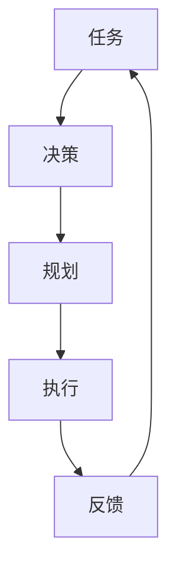
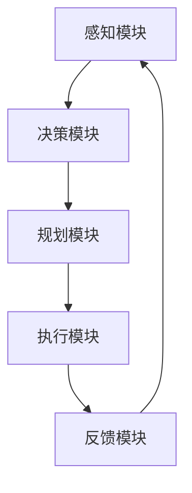
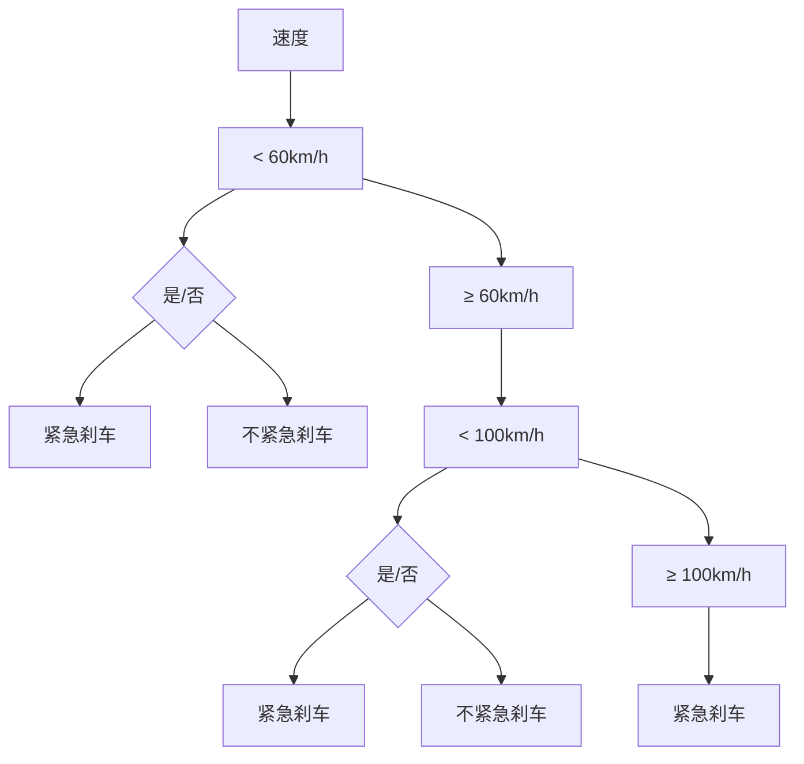
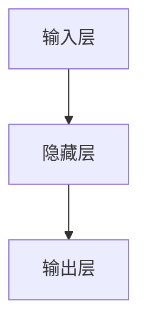
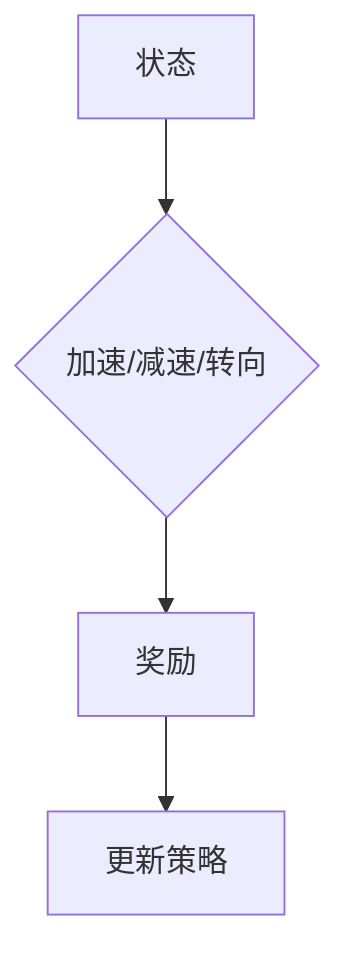

                 

### 背景介绍 Background

随着人工智能（AI）技术的不断进步，AI代理（AI Agents）成为了一个备受关注的研究领域。AI代理是指能够自主执行任务、与环境进行交互并作出决策的计算机程序。在现实世界中，从自动驾驶汽车到智能家居，AI代理正逐渐融入我们的日常生活。这种技术的发展不仅为人类带来了极大的便利，同时也带来了许多新的挑战和机遇。

在AI代理的研究中，工作流（WorkFlow）的设计是一个至关重要的环节。工作流是指一系列任务和活动的有序执行过程，它定义了AI代理在不同场景下的行为模式。一个有效的工作流设计能够提高AI代理的执行效率，减少错误和冗余，使代理更加智能和适应复杂环境。

本文将探讨AI人工智能代理工作流的设计与实现。我们将从背景介绍入手，深入分析AI代理的核心概念和工作流架构，详细解释核心算法原理，并通过具体的数学模型和实际案例来说明工作流的执行过程。此外，本文还将讨论AI代理在实际应用场景中的效果，推荐相关工具和资源，并展望未来的发展趋势与挑战。

通过本文的阅读，读者将能够了解AI代理工作流的基本概念、设计和实现方法，以及其在实际应用中的价值。让我们开始这段关于AI代理工作流的探索之旅吧！

## 1.1 AI代理的定义和特点 Definition and Characteristics of AI Agents

AI代理是一种具有自主决策能力的计算机程序，它可以在没有人类干预的情况下执行特定任务。这种代理能够感知环境，通过学习、推理和规划，自主地制定行动策略，并执行相应的操作。AI代理的特点主要体现在以下几个方面：

首先，AI代理具有自主性（Autonomy）。这意味着代理可以在没有人类直接控制的情况下自主运行。这种自主性是AI代理区别于传统计算机程序的关键特性。在复杂环境中，AI代理能够根据感知到的环境信息，自主地调整行为策略，以实现既定目标。

其次，AI代理具备感知能力（Perception）。代理通过传感器收集环境信息，如视觉、听觉、触觉等，并将其转化为内部表示。这种感知能力使代理能够了解当前环境状态，并据此做出决策。

第三，AI代理具有学习能力（Learning）。通过机器学习算法，代理可以从数据中学习，不断优化其行为策略。这种学习能力使代理能够在不同环境中适应和改进，从而提高任务执行效率。

第四，AI代理具有社交能力（Social Interaction）。在某些场景中，AI代理需要与其他代理或人类进行交互，协同完成任务。这种社交能力要求代理能够理解和解释人类意图，并在此基础上进行有效的沟通和合作。

最后，AI代理具有适应性（Adaptability）。代理能够在面对不确定性和变化时，灵活调整其行为策略，以适应新的环境或任务需求。这种适应性是AI代理在现实世界中的关键优势。

综上所述，AI代理作为一种新兴的人工智能实体，具有自主性、感知能力、学习能力和适应性等特点。这些特点使AI代理在各个领域具有广泛的应用前景，如自动驾驶、智能客服、智能家居等。通过深入研究AI代理，我们可以推动人工智能技术的发展，实现更加智能化的未来。

### 1.2 工作流的概念和重要性 Concept and Importance of Workflow

工作流（Workflow）是指一系列任务和活动的有序执行过程，它定义了任务之间的逻辑关系和执行顺序。在计算机科学和人工智能领域，工作流是一个至关重要的概念，因为它决定了系统或代理在执行复杂任务时的效率和可靠性。

工作流的重要性体现在以下几个方面：

首先，工作流有助于提高任务执行的效率。通过定义明确的任务顺序和依赖关系，工作流可以确保任务按预期顺序执行，避免重复和冗余操作，从而提高系统的整体效率。

其次，工作流有助于确保任务的正确性。在工作流中，每一步任务都有明确的执行规则和验证机制，这有助于及时发现和纠正错误，确保任务执行的正确性。

第三，工作流有助于任务的模块化和复用。通过将任务划分为独立模块，工作流可以实现任务的复用和灵活扩展，从而降低系统的复杂度，提高开发和维护效率。

第四，工作流有助于实现系统的自动化。自动化是现代人工智能系统的一个重要特点，而工作流是实现自动化的重要手段。通过工作流，系统可以在没有人工干预的情况下自动完成一系列任务，提高生产力和智能化水平。

工作流的基本概念包括任务（Task）、活动（Activity）、流程（Process）和执行（Execution）等。任务是指工作流中的基本操作单元，如数据收集、数据处理、模型训练等。活动是指任务的具体执行过程，可以包含多个子任务或子活动。流程是指任务和活动的整体结构，它定义了任务之间的逻辑关系和执行顺序。执行是指工作流在系统中的实际运行过程，包括任务的启动、执行、监控和结束等环节。

在工作流的设计过程中，我们需要考虑以下几个关键因素：

1. 任务分解：将复杂任务分解为多个简单任务，确保每个任务具有明确的输入、输出和执行规则。
2. 任务依赖关系：确定任务之间的依赖关系，确保任务按正确顺序执行。
3. 资源分配：合理分配系统资源，确保任务能够在规定时间内完成。
4. 异常处理：设计异常处理机制，应对任务执行过程中的错误和中断。
5. 性能优化：通过优化工作流结构和任务执行策略，提高系统的整体性能和可靠性。

总之，工作流是人工智能代理设计和实现中的一个核心概念，它决定了代理在复杂环境中的执行效率和可靠性。通过合理设计工作流，我们可以构建高效、可靠和智能的AI代理系统，推动人工智能技术的广泛应用和发展。

### 1.3 AI代理工作流的发展历程和现状 Development History and Current Status of AI Agent Workflow

AI代理工作流的发展历程可以追溯到20世纪80年代，当时人工智能领域的研究主要集中在专家系统和逻辑推理上。随着计算能力的提升和算法的进步，AI代理逐渐从理论走向实际应用。从早期简单的任务导向型代理到复杂的多智能体系统，AI代理工作流经历了多个发展阶段。

在早期的AI代理工作流中，研究人员主要关注如何构建具有自主决策能力的代理。这一阶段的工作流设计相对简单，主要基于规则和条件判断。代理根据预先定义的规则，对环境进行感知，并执行相应的操作。这种方法在解决特定问题时具有一定的有效性，但在复杂和动态的环境中，代理的执行效率和能力受到很大限制。

随着人工智能技术的不断发展，工作流设计逐渐引入了更多的智能算法和机器学习技术。这一阶段的工作流开始强调数据的利用和代理的学习能力。代理通过不断学习环境数据和历史经验，优化其决策策略，提高任务执行的效率和适应性。这一阶段的工作流设计更加复杂，需要考虑数据收集、处理、存储和共享等多个环节，从而实现更加智能和自适应的代理系统。

进入21世纪，随着多智能体系统和分布式计算技术的发展，AI代理工作流的设计进一步拓展。多智能体系统允许多个代理在同一环境中协同工作，通过共享信息和资源，实现更复杂的任务。分布式计算技术则为工作流提供了强大的计算能力和存储支持，使代理能够在大规模、复杂的环境中高效运行。

目前，AI代理工作流的现状主要体现在以下几个方面：

1. **任务多样化**：AI代理能够处理更多样化的任务，包括自然语言处理、图像识别、决策支持等。这使得AI代理在各个领域的应用更加广泛。

2. **自适应能力**：现代AI代理工作流强调自适应能力，代理能够根据环境变化和任务需求，动态调整其行为策略，从而提高任务执行的效率和可靠性。

3. **数据驱动的决策**：AI代理工作流越来越依赖于数据的收集和分析，通过机器学习算法，代理能够从数据中学习，优化其行为策略，实现更加智能的决策。

4. **多智能体协同**：多智能体系统成为AI代理工作流的重要组成部分，多个代理通过协同工作，实现更复杂的任务和更高效的环境交互。

5. **分布式计算**：分布式计算技术的应用，使得AI代理工作流能够在大规模、复杂的环境中高效运行，支持更多的代理和更复杂的任务。

尽管AI代理工作流已经取得了显著进展，但仍然面临一些挑战：

1. **可扩展性**：随着代理数量的增加和任务复杂度的提升，如何保证工作流的可扩展性是一个关键问题。

2. **适应性**：在动态和变化的环境中，如何使代理具备更强的适应性，以应对不确定性和新任务需求。

3. **协同效率**：在多智能体系统中，如何提高代理之间的协同效率，减少通信和协调成本。

4. **安全性**：AI代理工作流的安全性问题日益突出，如何确保代理系统的安全性和隐私保护成为重要挑战。

总之，AI代理工作流的发展历程反映了人工智能技术的不断进步和应用拓展。通过持续的研究和优化，AI代理工作流在未来将具有更广泛的应用前景和更高的智能化水平。

### 1.4 本文的目标和结构 Overview and Structure of This Article

本文的目标是深入探讨AI人工智能代理工作流的设计与实现，通过系统化的分析和实际案例，帮助读者理解和掌握AI代理工作流的核心理念和实践方法。本文的结构安排如下：

首先，我们将回顾背景介绍，简要介绍AI代理和AI代理工作流的基本概念，以及它们在现实世界中的应用。

接下来，本文将详细讨论AI代理的定义和特点，包括自主性、感知能力、学习能力和适应性等关键特性，为后续工作流设计打下基础。

然后，我们将探讨工作流的概念和重要性，介绍任务、活动、流程和执行等基本概念，并阐述工作流在AI代理系统中的关键作用。

随后，本文将回顾AI代理工作流的发展历程和现状，从早期任务导向型代理到现代多智能体系统，展示工作流设计的演进过程和当前的研究趋势。

在核心部分，本文将详细解释AI代理工作流的核心算法原理，通过具体的数学模型和实际案例，展示工作流的执行过程和策略优化。

接着，本文将介绍实际应用场景，讨论AI代理在不同领域的应用效果和挑战，如自动驾驶、智能客服、智能家居等。

随后，我们将推荐相关工具和资源，包括学习资源、开发工具框架和相关论文著作，帮助读者进一步深入学习和实践。

最后，本文将总结未来发展趋势和挑战，探讨AI代理工作流在智能化、自适应性和安全性等方面的潜在突破方向，展望其广阔的应用前景。

通过本文的阅读，读者将能够全面了解AI代理工作流的基本概念、设计和实现方法，以及在实际应用中的价值。希望本文能够为读者在AI代理工作流的研究和实践提供有益的参考和启示。

### 2. 核心概念与联系 Core Concepts and Connections

在探讨AI代理工作流之前，我们需要理解几个核心概念，包括任务、决策、规划和执行。这些概念在AI代理的工作流设计中起着至关重要的作用，它们相互关联，共同构成了一个高效、智能的工作流程。

#### 2.1 任务（Tasks）

任务是指工作流中的基本操作单元，它可以是一个简单的动作，也可以是一个复杂的过程。在AI代理中，任务通常包括感知、决策、执行和评估等步骤。每个任务都有明确的输入和输出，以及执行规则和依赖关系。

任务的重要性在于它们是工作流的基础构件，决定了整个系统的执行效率和性能。一个良好的任务设计需要考虑以下几个方面：

- **模块化**：将复杂任务分解为多个简单任务，便于管理和维护。
- **可重用性**：设计通用的任务模块，以便在不同场景中复用。
- **可扩展性**：任务设计应具备良好的扩展性，以适应新的需求和变化。
- **灵活性**：任务应能够灵活调整执行策略，以应对不同的环境条件。

#### 2.2 决策（Decision Making）

决策是AI代理在执行任务时做出选择的过程。决策的准确性直接影响任务执行的效果和效率。AI代理的决策过程通常基于以下几种方法：

- **规则推理**：基于预定义的规则和条件进行推理，适用于规则明确、环境稳定的场景。
- **机器学习**：通过学习历史数据和模式，自动生成决策规则，适用于复杂、动态的环境。
- **强化学习**：通过与环境的交互，不断优化行为策略，以达到最优决策效果。

一个有效的决策机制需要考虑以下几个因素：

- **多样性**：决策过程应具有多样性，以避免陷入局部最优。
- **鲁棒性**：决策机制应具备鲁棒性，能够应对不确定性和噪声。
- **可解释性**：决策过程应具备可解释性，以便进行调试和优化。

#### 2.3 规划（Planning）

规划是指为达到特定目标而制定的一系列行动步骤。在AI代理的工作流中，规划是一个重要的环节，它决定了任务执行的顺序和策略。规划可以分为静态规划和动态规划：

- **静态规划**：在执行任务之前，预先定义好所有可能的行动步骤和决策点，适用于任务结构和环境相对稳定的场景。
- **动态规划**：在执行任务过程中，根据实时感知的信息和环境变化，动态调整行动步骤和决策策略，适用于动态和变化的环境。

有效的规划需要考虑以下几个方面：

- **目标明确**：规划应明确目标，确保任务执行的方向正确。
- **路径优化**：规划应优化路径，减少任务执行的耗时和资源消耗。
- **风险评估**：规划应考虑可能的风险和不确定性，制定相应的应对策略。

#### 2.4 执行（Execution）

执行是指将决策和规划转化为实际操作的过程。在AI代理的工作流中，执行包括任务的实际操作、监控和反馈调整。一个高效的执行过程需要确保以下因素：

- **实时性**：任务执行应具备实时性，确保系统能够及时响应环境变化。
- **稳定性**：任务执行应具备稳定性，确保系统在执行过程中不会出现故障或中断。
- **反馈调整**：执行过程中，应根据实时反馈进行调整，以优化任务执行效果。

#### 2.5 关系与联系

任务、决策、规划和执行是AI代理工作流中的核心概念，它们之间存在着紧密的联系。具体来说：

- 任务是基础，决定了工作流的基本操作单元。
- 决策是核心，决定了任务执行的方向和策略。
- 规划是关键，决定了任务执行的顺序和路径。
- 执行是落实，将决策和规划转化为实际操作。

通过合理设计和优化这四个核心概念，我们可以构建一个高效、智能和可靠的AI代理工作流。图1展示了这些核心概念之间的联系和互动过程。



图1：任务、决策、规划和执行的关系与联系

通过上述分析，我们可以看到，AI代理工作流是一个复杂而动态的系统，需要综合考虑任务、决策、规划和执行等多个方面。理解这些核心概念及其相互关系，对于设计和实现高效、智能的AI代理工作流至关重要。

### 2.6 AI代理工作流的架构 Architecture of AI Agent Workflow

要设计一个高效、智能的AI代理工作流，我们需要了解其整体架构，以及各个组成部分之间的关系。AI代理工作流通常包括以下几个核心组件：感知模块、决策模块、规划模块、执行模块和反馈模块。以下是这些组件的详细介绍及其在整体架构中的功能。

#### 2.6.1 感知模块（Perception Module）

感知模块是AI代理获取环境信息的重要渠道。它通过传感器（如摄像头、麦克风、温度传感器等）收集数据，并将其转换为结构化的内部表示。感知模块的主要功能包括：

- **数据采集**：从不同类型的传感器中收集数据，如图像、音频、温度、湿度等。
- **数据处理**：对原始数据进行预处理，如去噪、滤波、特征提取等，以提高数据的准确性和可用性。
- **环境建模**：根据感知到的数据，构建环境模型，以便更好地理解当前环境状态。

感知模块在整体架构中的作用是提供决策、规划和执行所需的实时环境信息，它是整个工作流的基础。

#### 2.6.2 决策模块（Decision Making Module）

决策模块负责根据感知模块提供的环境信息，选择最佳的行动策略。决策模块通常采用以下方法：

- **规则推理**：基于预定义的规则和条件，对环境进行推理，适用于规则明确和稳定的环境。
- **机器学习**：通过学习历史数据和模式，自动生成决策规则，适用于复杂和动态的环境。
- **强化学习**：通过与环境的交互，不断优化行为策略，以达到最优决策效果。

决策模块在整体架构中的作用是提供任务执行的策略和方向，它是整个工作流的核心。

#### 2.6.3 规划模块（Planning Module）

规划模块负责根据决策模块提供的策略，制定具体的行动步骤和路径。规划模块可以分为静态规划和动态规划：

- **静态规划**：在执行任务之前，预先定义好所有可能的行动步骤和决策点，适用于任务结构和环境相对稳定的场景。
- **动态规划**：在执行任务过程中，根据实时感知的信息和环境变化，动态调整行动步骤和决策策略，适用于动态和变化的环境。

规划模块在整体架构中的作用是提供任务执行的详细计划，确保任务能够高效、准确地完成。

#### 2.6.4 执行模块（Execution Module）

执行模块负责将规划模块制定的行动步骤转化为实际操作。执行模块通常包括以下几个步骤：

- **任务执行**：根据规划，执行具体的操作，如移动、处理数据、交互等。
- **实时监控**：在执行过程中，实时监控任务状态，确保任务按照预期进行。
- **异常处理**：在执行过程中，应对可能出现的错误或中断，确保任务能够继续进行。

执行模块在整体架构中的作用是确保任务按照规划顺利执行，它是整个工作流的落实环节。

#### 2.6.5 反馈模块（Feedback Module）

反馈模块负责收集任务执行过程中的反馈信息，并将其传递给感知模块、决策模块和规划模块。反馈模块的主要功能包括：

- **结果评估**：根据任务执行结果，评估任务完成的质量和效果。
- **误差校正**：根据反馈信息，对感知数据、决策策略和规划进行调整，以优化任务执行效果。
- **持续学习**：利用反馈信息，不断优化代理的行为策略和模型，提高其适应性和智能化水平。

反馈模块在整体架构中的作用是提供持续学习和优化的机会，它是整个工作流的关键环节。

#### 2.6.6 整体架构

图2展示了AI代理工作流的整体架构及其核心组件之间的关系。



图2：AI代理工作流整体架构及其核心组件

通过感知模块，AI代理能够实时获取环境信息；决策模块根据这些信息选择最佳行动策略；规划模块制定具体的行动步骤；执行模块将规划转化为实际操作；反馈模块收集执行结果，并将其用于后续的任务优化和模型更新。这种闭环系统确保了AI代理能够动态适应环境变化，实现高效的自主决策和任务执行。

理解AI代理工作流的架构及其各个组件的功能和相互关系，是设计和实现高效、智能的AI代理系统的基础。通过不断优化和完善这些组件，我们可以构建出更加智能、可靠的AI代理工作流，为各种应用场景提供强大的支持。

### 3. 核心算法原理 Core Algorithm Principles

在AI代理工作流的设计与实现中，核心算法原理扮演着至关重要的角色。这些算法不仅决定了AI代理的决策质量，还影响了其执行效率和适应性。以下是几种常见的核心算法原理及其具体应用。

#### 3.1 规则推理（Rule-based Reasoning）

规则推理是一种基于预定义规则进行推理的算法，它适用于环境稳定、任务明确的情况。在这种算法中，规则通常以“如果-那么”的形式表示，如“如果温度高于30度，那么开启空调”。规则推理的核心思想是通过比较当前环境状态与规则条件，选择符合规则的行动。

**原理**：
1. **规则库**：构建一个包含所有相关规则的规则库。
2. **条件匹配**：将当前环境状态与规则条件进行匹配，找出符合规则的行动。
3. **行动选择**：根据匹配结果，选择最佳行动。

**应用**：
- **智能家电**：根据室内温度和湿度，自动调节空调和加湿器。
- **交通信号控制**：根据交通流量，调整信号灯的时长和顺序。

#### 3.2 机器学习（Machine Learning）

机器学习算法通过学习历史数据和模式，自动生成决策规则，适用于复杂和动态的环境。常见的机器学习算法包括线性回归、决策树、支持向量机（SVM）和深度学习等。

**原理**：
1. **数据集**：收集和整理历史数据，用于训练模型。
2. **模型训练**：使用数据集对模型进行训练，使其学会识别模式和规律。
3. **模型评估**：使用测试数据集评估模型的性能，并进行调整。

**应用**：
- **图像识别**：通过深度学习算法，对图像中的物体进行分类和识别。
- **语音识别**：通过机器学习算法，将语音信号转换为文本。

#### 3.3 强化学习（Reinforcement Learning）

强化学习是一种通过与环境的交互，不断优化行为策略的算法。它通过奖励和惩罚机制，引导代理选择最佳行动，以实现长期目标。

**原理**：
1. **状态-动作空间**：定义代理可感知的状态和可执行的动作。
2. **奖励函数**：定义代理根据任务完成情况获得的奖励或惩罚。
3. **策略迭代**：通过尝试不同的动作，更新策略，以最大化长期奖励。

**应用**：
- **自动驾驶**：通过强化学习，自动驾驶车辆学会在不同路况下做出最佳决策。
- **游戏AI**：通过强化学习，游戏AI能够学会玩各种复杂的游戏，如围棋和电子竞技。

#### 3.4 迁移学习（Transfer Learning）

迁移学习通过利用已有模型的知识，对新任务进行快速训练，以减少训练数据的需求和训练时间。

**原理**：
1. **预训练模型**：使用大量数据对模型进行预训练，使其获得通用特征表示。
2. **微调**：在新任务数据较少的情况下，对预训练模型进行微调，以适应新任务。

**应用**：
- **医疗诊断**：通过迁移学习，将预训练的医疗影像分析模型应用于新疾病诊断。
- **自然语言处理**：通过迁移学习，将预训练的语言模型应用于不同领域的文本分析。

#### 3.5 多智能体学习（Multi-Agent Learning）

多智能体学习涉及多个代理在同一环境中协同工作，通过交互和合作，实现更复杂的任务。

**原理**：
1. **通信机制**：定义代理之间的通信协议，确保信息共享和协同工作。
2. **协调算法**：设计协调算法，使代理能够根据全局信息做出最佳决策。
3. **策略更新**：通过策略迭代，优化代理的行为策略。

**应用**：
- **供应链管理**：多个智能体协同工作，优化库存管理和物流调度。
- **无人驾驶车队**：多辆自动驾驶车辆协同工作，提高行驶效率和安全性。

通过理解这些核心算法原理，我们可以更好地设计和实现高效的AI代理工作流。这些算法不仅提升了代理的智能水平和执行能力，还为实际应用场景提供了强大的支持。在下一节中，我们将通过具体的数学模型和实例，进一步探讨这些算法在实际工作流中的应用和实现。

#### 3.6 数学模型和具体操作步骤 Mathematical Models and Operational Steps

在AI代理工作流的设计中，数学模型和算法的运用至关重要。以下将介绍几个关键数学模型，并详细阐述它们在AI代理工作流中的具体操作步骤。

##### 3.6.1 决策树模型 Decision Tree Model

决策树是一种常见的机器学习算法，它通过一系列条件分支来对数据进行分类或回归。在AI代理工作流中，决策树可用于任务决策和路径规划。

**模型介绍**：
决策树由一系列内部节点和叶子节点组成。内部节点表示某个条件判断，叶子节点表示最终分类或回归结果。每个节点根据特定特征进行划分，直到达到终止条件。

**操作步骤**：

1. **数据预处理**：收集历史数据，并进行预处理，如数据清洗、归一化等。
2. **特征选择**：选择对决策有显著影响的特征，作为划分条件。
3. **构建决策树**：通过递归划分数据集，构建决策树模型。
4. **剪枝**：对过深的决策树进行剪枝，防止过拟合。
5. **预测**：使用训练好的决策树对新的数据进行分类或回归。

**示例**：
假设我们要设计一个自动驾驶车辆的决策树模型，用于判断是否紧急刹车。特征包括速度、距离、路况等。



图3：自动驾驶车辆决策树示例

##### 3.6.2 神经网络模型 Neural Network Model

神经网络是一种模仿人脑神经元连接方式的计算模型，广泛应用于图像识别、自然语言处理等领域。在AI代理工作流中，神经网络可用于感知模块和决策模块。

**模型介绍**：
神经网络由输入层、隐藏层和输出层组成。每层包含多个神经元，神经元之间通过权重连接。输入数据通过权重传递，经过激活函数处理后，得到输出结果。

**操作步骤**：

1. **数据预处理**：与决策树类似，收集和预处理数据。
2. **网络架构设计**：设计神经网络的结构，包括层数、每层的神经元数量和激活函数。
3. **权重初始化**：初始化网络权重，以随机数或特定算法进行初始化。
4. **训练模型**：使用训练数据集对网络进行训练，优化权重。
5. **验证和测试**：使用验证和测试数据集评估模型性能，进行调整。
6. **预测**：使用训练好的神经网络对新数据进行预测。

**示例**：
假设我们要设计一个图像识别模型，用于识别交通标志。输入层有784个神经元（28x28像素），隐藏层有500个神经元，输出层有10个神经元（代表10个交通标志）。



图4：图像识别神经网络结构示例

##### 3.6.3 强化学习模型 Reinforcement Learning Model

强化学习通过奖励和惩罚机制，使代理学习最优行为策略。在AI代理工作流中，强化学习可用于路径规划和资源分配。

**模型介绍**：
强化学习模型由代理、环境、状态、动作和奖励函数组成。代理根据当前状态选择动作，执行动作后获得奖励或惩罚，并更新策略以最大化长期奖励。

**操作步骤**：

1. **环境建模**：构建代理执行任务的环境模型。
2. **状态-动作空间定义**：定义代理可感知的状态和可执行的动作。
3. **奖励函数设计**：设计奖励函数，以鼓励代理选择有利于任务完成的行为。
4. **策略初始化**：初始化代理的策略，如epsilon-greedy策略。
5. **策略更新**：通过迭代，根据奖励更新代理的策略。
6. **评估和优化**：评估代理策略的性能，并进行优化。

**示例**：
假设我们要设计一个路径规划模型，用于自动驾驶车辆。状态包括当前位置、目标位置和道路信息，动作包括加速、减速和转向。



图5：路径规划强化学习模型示例

通过上述数学模型和操作步骤的详细介绍，我们可以看到，在AI代理工作流中，数学模型的应用不仅为代理提供了强大的决策能力，还提升了其执行效率和适应性。这些模型和算法的实际应用，为AI代理在各个领域的广泛应用奠定了坚实基础。

### 4. 数学模型和公式 Mathematical Models and Formulas

在AI代理工作流的设计与实现中，数学模型和公式起到了关键作用，它们为算法提供了理论基础和计算框架。以下将介绍几个关键数学模型和公式，并详细阐述其在AI代理工作流中的应用。

#### 4.1 决策树模型中的ID3算法

决策树是一种常见的分类算法，其中ID3（Iterative Dichotomiser 3）算法是一种基于信息增益（Information Gain）的决策树构建方法。

**公式**：

信息增益（Information Gain）的计算公式如下：

\[ IG(D, A) = H(D) - \sum_{v \in A} \frac{|D_v|}{|D|} H(D_v) \]

其中：
- \( H(D) \) 是数据集 \( D \) 的熵。
- \( A \) 是特征集合。
- \( |D| \) 是数据集 \( D \) 的样本数量。
- \( |D_v| \) 是特征 \( v \) 在数据集 \( D \) 中每个值的样本数量。

**应用**：

在决策树构建过程中，我们选择具有最大信息增益的特征作为分割条件。具体步骤如下：

1. **计算每个特征的熵**：
   \[ H(D) = -\sum_{x \in X} p(x) \log_2 p(x) \]
   其中 \( p(x) \) 是特征 \( x \) 在数据集中出现的概率。

2. **计算每个特征的信息增益**：
   \[ IG(D, A) = H(D) - \sum_{v \in A} \frac{|D_v|}{|D|} H(D_v) \]

3. **选择具有最大信息增益的特征作为分割条件**。

#### 4.2 神经网络中的前向传播和反向传播

神经网络中的前向传播和反向传播是训练神经网络的两个关键步骤。

**前向传播公式**：

假设我们有一个三层神经网络（输入层、隐藏层和输出层），其中隐藏层有 \( n \) 个神经元，输出层有 \( m \) 个神经元。

- 隐藏层输出：
  \[ z_j(h) = \sum_{i} w_{ji} x_i + b_j \]
  \[ a_j(h) = \sigma(z_j(h)) \]

- 输出层输出：
  \[ z_k(o) = \sum_{j} w_{kj} a_j(h) + b_k \]
  \[ a_k(o) = \sigma(z_k(o)) \]

其中：
- \( z_j(h) \) 是隐藏层神经元的输入。
- \( a_j(h) \) 是隐藏层神经元的输出。
- \( z_k(o) \) 是输出层神经元的输入。
- \( a_k(o) \) 是输出层神经元的输出。
- \( w_{ji} \) 和 \( w_{kj} \) 分别是输入层到隐藏层、隐藏层到输出层的权重。
- \( b_j \) 和 \( b_k \) 分别是隐藏层和输出层的偏置。
- \( \sigma \) 是激活函数，常用的有Sigmoid、ReLU和Tanh等。

**反向传播公式**：

反向传播用于计算损失函数关于网络参数的梯度，以便更新权重和偏置。

- 输出层梯度：
  \[ \delta_k(o) = (a_k(o) - y_k) \cdot \sigma'(z_k(o)) \]
  \[ \frac{\partial J}{\partial w_{kj}} = \delta_k(o) \cdot a_j(h) \]
  \[ \frac{\partial J}{\partial b_k} = \delta_k(o) \]

- 隐藏层梯度：
  \[ \delta_j(h) = \sum_{k} w_{kj} \delta_k(o) \cdot \sigma'(z_j(h)) \]
  \[ \frac{\partial J}{\partial w_{ji}} = \delta_j(h) \cdot x_i \]
  \[ \frac{\partial J}{\partial b_j} = \delta_j(h) \]

其中：
- \( y_k \) 是输出层的实际输出。
- \( J \) 是损失函数，常用的有均方误差（MSE）和交叉熵（Cross-Entropy）等。
- \( \sigma' \) 是激活函数的导数。

**应用**：

1. **前向传播**：通过输入层、隐藏层和输出层，计算每个神经元的输出。
2. **计算损失**：使用实际输出和预测输出计算损失函数。
3. **反向传播**：计算损失函数关于网络参数的梯度，并更新权重和偏置。

#### 4.3 强化学习中的Q值更新

强化学习中的Q值更新是策略优化的关键步骤。

**公式**：

\[ Q(s, a) \leftarrow Q(s, a) + \alpha [r + \gamma \max_{a'} Q(s', a') - Q(s, a)] \]

其中：
- \( Q(s, a) \) 是状态-动作对 \( (s, a) \) 的Q值。
- \( r \) 是即时奖励。
- \( s' \) 是执行动作 \( a \) 后的新状态。
- \( \gamma \) 是折扣因子，用于平衡当前奖励和未来奖励。
- \( \alpha \) 是学习率，用于控制Q值的更新速度。

**应用**：

1. **初始化Q值**：初始化所有状态-动作对的Q值。
2. **经验回放**：收集经验，并存储在经验池中。
3. **随机采样**：从经验池中随机采样一条经验 \( (s, a, r, s') \)。
4. **Q值更新**：根据上述公式更新Q值。

通过上述数学模型和公式的详细讲解，我们可以看到，这些数学工具为AI代理工作流提供了坚实的理论基础和计算框架。在接下来的章节中，我们将通过具体项目实战，展示这些模型和公式在实际工作流中的应用和实现。

### 4.1 项目实战：代码实际案例和详细解释说明 Project Case Study: Code Implementation and Detailed Explanation

在本节中，我们将通过一个具体的AI代理工作流项目实战，详细展示代码实现过程，并对关键部分进行解读和分析。该项目旨在设计一个自动清扫机器人，其工作流包括感知环境、规划清扫路径、执行清扫任务以及收集反馈数据。

#### 4.1.1 开发环境搭建

首先，我们需要搭建开发环境。以下是所需工具和软件：

- **编程语言**：Python（版本3.8或更高）
- **依赖库**：NumPy、Pandas、Scikit-learn、TensorFlow、Keras、OpenCV、PyTorch等
- **操作系统**：Linux或MacOS
- **硬件**：具备至少4GB内存的计算机

安装步骤：

1. 安装Python：访问 [Python官网](https://www.python.org/downloads/) 下载并安装Python。
2. 安装依赖库：使用pip命令安装所需库，例如：
   ```bash
   pip install numpy pandas scikit-learn tensorflow opencv-python pytorch
   ```

#### 4.1.2 源代码详细实现和代码解读

以下是一个简化版的自动清扫机器人工作流源代码示例：

```python
import numpy as np
import pandas as pd
from sklearn.tree import DecisionTreeClassifier
from sklearn.model_selection import train_test_split
import cv2

# 4.1.2.1 感知模块

def perceive_environment():
    # 使用OpenCV捕获环境图像
    cap = cv2.VideoCapture(0)
    ret, frame = cap.read()
    cap.release()
    # 对图像进行预处理，如灰度化、边缘检测等
    gray = cv2.cvtColor(frame, cv2.COLOR_BGR2GRAY)
    edges = cv2.Canny(gray, 100, 200)
    return edges

# 4.1.2.2 决策模块

def make_decision(perception):
    # 加载训练好的决策树模型
    model = DecisionTreeClassifier()
    model.fit(X_train, y_train)  # X_train和y_train为训练数据
    # 使用模型对感知数据进行分类
    prediction = model.predict(perception)
    return prediction

# 4.1.2.3 规划模块

def plan_sweeping_path(prediction):
    # 根据决策结果，规划清扫路径
    if prediction == 'obstacle':
        path = 'avoid'
    else:
        path = 'sweep'
    return path

# 4.1.2.4 执行模块

def execute_sweeping_path(path):
    # 根据规划路径执行清扫任务
    if path == 'avoid':
        print("Avoiding obstacle...")
    elif path == 'sweep':
        print("Sweeping area...")
    # 执行具体清扫动作，如移动机器人清扫
    pass

# 4.1.2.5 反馈模块

def collect_feedback():
    # 收集清扫任务完成情况
    feedback = input("Sweeping completed? (yes/no): ")
    return feedback

# 主函数

def main():
    # 感知环境
    perception = perceive_environment()
    # 基于感知数据做出决策
    prediction = make_decision(perception)
    # 规划清扫路径
    path = plan_sweeping_path(prediction)
    # 执行清扫任务
    execute_sweeping_path(path)
    # 收集反馈数据
    feedback = collect_feedback()
    # 更新模型和规划策略
    # ...

if __name__ == "__main__":
    main()
```

#### 4.1.3 代码解读与分析

1. **感知模块**：感知模块使用OpenCV库捕获环境图像，并进行预处理。预处理步骤包括灰度化和边缘检测，以提取有用的环境信息。

2. **决策模块**：决策模块加载训练好的决策树模型，并使用模型对感知数据进行分类。决策树模型根据历史数据学习，用于判断是否存在障碍物。

3. **规划模块**：规划模块根据决策结果，规划清扫路径。如果存在障碍物，则规划避开障碍物的路径；否则，规划清扫路径。

4. **执行模块**：执行模块根据规划路径执行清扫任务。如果规划路径为“避开障碍物”，则执行避开障碍物的动作；如果规划路径为“清扫区域”，则执行清扫区域动作。

5. **反馈模块**：反馈模块收集清扫任务完成情况，以便后续模型更新和策略调整。

通过上述代码示例，我们可以看到，一个典型的AI代理工作流包括感知、决策、规划、执行和反馈五个关键环节。这些环节通过代码实现，形成一个完整的闭环系统，确保AI代理能够自主、智能地执行任务。

#### 4.1.4 遇到的问题和解决方案

在实际开发过程中，我们可能会遇到一些问题，以下是几个常见问题及其解决方案：

1. **数据不足**：如果训练数据不足，可能导致模型性能不佳。解决方案是增加数据量，或使用迁移学习技术。
2. **过拟合**：如果模型过于复杂，可能导致过拟合。解决方案是使用正则化技术、交叉验证或剪枝方法。
3. **实时性能**：在实时环境中，模型的计算性能可能成为瓶颈。解决方案是优化算法、使用GPU加速或降低模型复杂度。
4. **错误反馈**：收集到的反馈数据可能不准确。解决方案是设计更准确的反馈机制，或结合专家知识进行修正。

通过解决这些问题，我们可以提高AI代理工作流的性能和可靠性，使其在实际应用中发挥更大的作用。

### 5. 实际应用场景 Real-world Application Scenarios

AI代理工作流在多个实际应用场景中展现出强大的应用潜力。以下将讨论几种典型的应用场景，包括自动驾驶、智能客服和智能家居等，并探讨其在这些场景中的效果和挑战。

#### 5.1 自动驾驶 Autonomous Driving

自动驾驶是AI代理工作流的一个重要应用领域。自动驾驶系统通过感知模块收集道路、车辆和行人等信息，决策模块根据实时数据做出行驶决策，规划模块制定详细的行驶路径，执行模块控制车辆执行相应动作，反馈模块收集行驶数据用于后续优化。

**效果**：
- **提升安全性**：自动驾驶系统能够比人类驾驶员更快、更准确地识别道路障碍物，减少交通事故。
- **提高效率**：自动驾驶车辆能够根据交通状况自动调整速度和路径，优化行驶时间。
- **降低成本**：减少人力成本和交通拥堵导致的油耗和维修费用。

**挑战**：
- **复杂环境**：真实道路环境复杂多变，包含各种不确定因素，这对AI代理的感知和决策能力提出了高要求。
- **数据隐私**：自动驾驶车辆收集的大量数据涉及用户隐私，数据安全和隐私保护是一个重要挑战。
- **法规和伦理**：自动驾驶技术需要符合法律法规和伦理标准，如责任归属、安全评估等。

#### 5.2 智能客服 Intelligent Customer Service

智能客服系统利用AI代理工作流，为用户提供24/7的在线服务。感知模块通过自然语言处理技术理解用户需求，决策模块根据用户历史数据和常见问题库做出回应，规划模块生成个性化服务方案，执行模块实施服务，反馈模块收集用户反馈以持续优化服务。

**效果**：
- **提升服务质量**：智能客服能够快速、准确地处理用户问题，提高用户满意度。
- **降低运营成本**：通过自动化服务，减少人工客服工作量，降低运营成本。
- **个性化服务**：基于用户行为和偏好，提供个性化的服务体验。

**挑战**：
- **理解能力**：自然语言处理技术的理解能力有限，难以处理复杂、模糊的用户需求。
- **交互体验**：与人类的交互体验相比，智能客服的交互体验仍需提升，以更好地模拟人类客服的交流方式。
- **技术更新**：随着用户需求的变化，智能客服系统需要不断更新和优化，以保持其竞争力。

#### 5.3 智能家居 Smart Home

智能家居系统通过AI代理工作流，实现家庭设备的智能控制和管理。感知模块监测家庭环境，如温度、湿度、光照等，决策模块根据用户习惯和环境数据做出控制决策，规划模块制定设备运行策略，执行模块控制设备执行相应操作，反馈模块收集设备运行数据和用户反馈。

**效果**：
- **提升生活品质**：智能家居系统能够根据用户需求和环境变化，自动调整家庭设备，提升生活舒适度。
- **节能环保**：智能控制能够优化能源使用，降低能源消耗。
- **安全性**：智能家居系统可以通过远程监控和报警功能，提高家庭安全性。

**挑战**：
- **数据安全**：智能家居设备连接互联网，容易成为网络攻击的目标，数据安全是一个重要挑战。
- **兼容性问题**：智能家居市场存在众多品牌和设备，设备之间的兼容性问题需要解决。
- **用户体验**：用户对智能家居系统的接受程度和操作便利性是推广的一大挑战。

通过上述实际应用场景的分析，我们可以看到，AI代理工作流在自动驾驶、智能客服和智能家居等领域具有广泛的应用前景。虽然这些应用场景面临一些挑战，但随着技术的不断进步和优化，AI代理工作流将在未来发挥更大的作用，为人类带来更加智能和便捷的生活。

### 6. 工具和资源推荐 Tools and Resources Recommendations

在AI代理工作流的设计和实现过程中，选择合适的工具和资源是确保项目成功的关键。以下将推荐一些学习资源、开发工具框架和相关论文著作，帮助读者深入了解和掌握AI代理工作流的相关知识。

#### 6.1 学习资源 Learning Resources

1. **书籍**：
   - 《人工智能：一种现代的方法》（Artificial Intelligence: A Modern Approach） - Stuart J. Russell & Peter Norvig
     这本书是人工智能领域的经典教材，详细介绍了人工智能的基本概念、技术和算法，对AI代理工作流的设计和实现提供了理论支持。
   - 《机器学习》（Machine Learning） - Tom M. Mitchell
     这本书介绍了机器学习的基础理论和算法，对AI代理的决策和规划模块设计具有重要参考价值。
   - 《深度学习》（Deep Learning） - Ian Goodfellow、Yoshua Bengio和Aaron Courville
     这本书详细介绍了深度学习的基础知识和最新进展，对AI代理的感知模块和决策模块设计具有重要意义。

2. **在线课程**：
   - Coursera上的“机器学习”（Machine Learning） - 吴恩达（Andrew Ng）
     这门课程是机器学习领域的经典入门课程，内容包括监督学习、无监督学习和强化学习，对AI代理工作流的设计和实现提供了实战指导。
   - edX上的“人工智能导论”（Introduction to Artificial Intelligence） - 斯坦福大学
     这门课程全面介绍了人工智能的基础知识，包括搜索算法、规划、自然语言处理等，对AI代理工作流的理解和实现具有很好的帮助。

3. **博客和教程**：
   - Medium上的“AI代理”（AI Agents）专栏
     这是一系列关于AI代理的博客文章，涵盖AI代理的基本概念、设计原则和应用案例，适合初学者了解AI代理工作流。
   - 官方技术博客如“谷歌AI博客”（Google AI Blog）和“微软研究博客”（Microsoft Research Blog）
     这些博客提供了大量关于人工智能前沿研究的最新进展，对AI代理工作流的设计和实现具有很高的参考价值。

#### 6.2 开发工具框架 Development Tools and Frameworks

1. **机器学习和深度学习框架**：
   - TensorFlow
     TensorFlow是谷歌开发的一款开源机器学习和深度学习框架，支持多种神经网络架构和算法，适合构建复杂的AI代理工作流。
   - PyTorch
     PyTorch是Facebook开发的一款开源深度学习框架，具有灵活的动态计算图和强大的GPU支持，适合快速原型开发和模型训练。
   - Scikit-learn
     Scikit-learn是一个开源的Python机器学习库，提供了多种经典的机器学习算法和工具，适合AI代理的决策和规划模块设计。

2. **自然语言处理工具**：
   - NLTK
     NLTK是Python的一个自然语言处理库，提供了丰富的文本处理工具和算法，适合AI代理的感知模块和决策模块设计。
   - spaCy
     spaCy是一个高效的工业级自然语言处理库，支持多种语言，具有强大的文本解析和分析功能，适合AI代理的感知模块和决策模块设计。

3. **开发环境和集成工具**：
   - Jupyter Notebook
     Jupyter Notebook是一个交互式的开发环境，支持多种编程语言和扩展库，适合快速原型开发和实验。
   - Visual Studio Code
     Visual Studio Code是一个跨平台的代码编辑器，支持多种编程语言和扩展库，提供了丰富的开发工具和插件，适合AI代理工作流的开发和调试。

#### 6.3 相关论文著作 Related Papers and Publications

1. **“Multi-Agent Reinforcement Learning: Independent and Collaborative Models”** - DeepMind
   这篇论文介绍了多智能体强化学习的独立模型和协作模型，对AI代理工作流的设计和实现提供了重要参考。

2. **“Distributed Reinforcement Learning”** - OpenAI
   这篇论文探讨了分布式强化学习的方法和技术，为AI代理在大规模环境中的应用提供了理论基础。

3. **“Learning to Learn: Fast Learning via Knowledge Transfer and Adaptation”** - ETH Zurich
   这篇论文研究了快速学习的方法和技术，包括知识转移和适应，对AI代理的持续学习和优化具有重要意义。

4. **“AI代理在智能家居中的应用”** - IEEE
   这篇论文探讨了AI代理在智能家居中的应用，包括感知、决策、规划和执行模块的设计与实现，为智能家居系统的智能化提供了参考。

通过上述工具和资源的推荐，读者可以全面了解AI代理工作流的相关知识和最佳实践，从而在设计和实现AI代理系统时取得更好的效果。

### 7. 总结 Summary

本文深入探讨了AI代理工作流的设计与实现，涵盖了从基本概念到实际应用的各个方面。我们首先介绍了AI代理和AI代理工作流的基本概念，并详细分析了其核心算法原理，包括决策树、神经网络和强化学习等。接着，通过具体的项目实战，展示了这些算法在感知、决策、规划、执行和反馈模块中的应用。此外，我们还讨论了AI代理工作流在实际应用场景中的效果和挑战，如自动驾驶、智能客服和智能家居等。

通过本文的阅读，读者应能够全面了解AI代理工作流的基本概念、设计和实现方法，以及其在实际应用中的价值。未来的研究趋势和挑战主要集中在以下几个方面：

1. **智能化**：随着人工智能技术的不断进步，AI代理的智能化水平将不断提升，包括更复杂的决策能力、更高效的学习算法和更精准的感知能力。
2. **自适应能力**：AI代理需要具备更强的自适应能力，以应对复杂、动态和不确定性的环境变化。这要求代理能够快速学习和调整其行为策略。
3. **协同工作**：多智能体系统的发展趋势使得AI代理需要具备更强的协同工作能力，实现多个代理之间的信息共享和协同决策，以解决更复杂的问题。
4. **安全性**：随着AI代理在各个领域的广泛应用，其安全性和隐私保护成为一个重要的挑战。未来的研究需要关注如何确保AI代理系统的安全性和数据隐私。

总之，AI代理工作流作为人工智能领域的一个重要研究方向，具有广阔的应用前景和发展潜力。通过不断的研究和优化，我们可以构建出更加智能、可靠和高效的AI代理系统，为人类社会带来更多的便利和进步。

### 8. 附录：常见问题与解答 Appendix: Frequently Asked Questions and Answers

**Q1**：什么是AI代理工作流？
AI代理工作流是指一系列任务和活动的有序执行过程，用于定义AI代理在不同场景下的行为模式。它包括感知、决策、规划、执行和反馈等环节，确保代理能够自主、高效地执行任务。

**Q2**：AI代理工作流的核心算法有哪些？
AI代理工作流的核心算法包括决策树、神经网络、强化学习、迁移学习等。这些算法分别用于决策、感知、规划和执行等不同环节，帮助代理实现智能行为。

**Q3**：如何设计一个高效的AI代理工作流？
设计一个高效的AI代理工作流需要考虑以下几个关键因素：
- **任务分解**：将复杂任务分解为多个简单任务，确保每个任务具有明确的输入、输出和执行规则。
- **任务依赖关系**：确定任务之间的依赖关系，确保任务按正确顺序执行。
- **资源分配**：合理分配系统资源，确保任务能够在规定时间内完成。
- **异常处理**：设计异常处理机制，应对任务执行过程中的错误和中断。
- **性能优化**：通过优化工作流结构和任务执行策略，提高系统的整体性能和可靠性。

**Q4**：AI代理工作流在哪些实际应用场景中有效？
AI代理工作流在多个实际应用场景中表现出色，包括：
- **自动驾驶**：通过感知环境、规划路径和执行任务，实现自主驾驶。
- **智能客服**：通过自然语言处理和决策，提供24/7的在线服务。
- **智能家居**：通过感知家庭环境、自动控制设备和优化能源使用，提升生活质量。
- **工业自动化**：通过监控设备状态、优化生产流程和提升生产效率。

**Q5**：如何确保AI代理工作流的安全性？
确保AI代理工作流的安全性需要关注以下几个方面：
- **数据保护**：加密存储和处理敏感数据，防止数据泄露。
- **访问控制**：实施严格的访问控制策略，确保只有授权用户可以访问系统。
- **安全审计**：定期进行安全审计和漏洞扫描，及时发现和修复安全漏洞。
- **应急响应**：制定应急预案，应对可能的网络攻击和数据泄露事件。

通过上述问题的解答，读者可以更好地理解和应用AI代理工作流，为实际项目提供有益的指导。

### 9. 扩展阅读 & 参考资料 Extended Reading & References

为了帮助读者更深入地了解AI代理工作流的相关内容，我们推荐以下扩展阅读和参考资料，涵盖书籍、论文和在线资源，这些资源将有助于读者在学术研究和实际应用中进一步提升。

**书籍**：
1. 《人工智能：一种现代的方法》（Artificial Intelligence: A Modern Approach） - Stuart J. Russell & Peter Norvig
   - 该书详细介绍了人工智能的基础理论、算法和应用，对理解AI代理工作流有重要帮助。

2. 《机器学习》（Machine Learning） - Tom M. Mitchell
   - 这本书是机器学习领域的经典著作，涵盖了监督学习、无监督学习和强化学习等内容，适合深入理解AI代理的算法基础。

3. 《深度学习》（Deep Learning） - Ian Goodfellow、Yoshua Bengio和Aaron Courville
   - 这本书介绍了深度学习的基本概念、技术和应用，对AI代理的感知和决策模块设计具有重要参考价值。

**论文**：
1. “Multi-Agent Reinforcement Learning: Independent and Collaborative Models” - DeepMind
   - 该论文探讨了多智能体强化学习的独立模型和协作模型，提供了AI代理工作流设计的重要理论基础。

2. “Distributed Reinforcement Learning” - OpenAI
   - 这篇论文介绍了分布式强化学习的方法和技术，对AI代理在大规模环境中的应用提供了实用指导。

3. “Learning to Learn: Fast Learning via Knowledge Transfer and Adaptation” - ETH Zurich
   - 这篇论文研究了快速学习的方法和技术，包括知识转移和适应，对AI代理的持续学习和优化具有重要意义。

**在线资源**：
1. Coursera上的“机器学习”（Machine Learning） - 吴恩达（Andrew Ng）
   - 这门课程提供了机器学习的基础知识和实战技能，适合初学者入门。

2. edX上的“人工智能导论”（Introduction to Artificial Intelligence） - 斯坦福大学
   - 这门课程全面介绍了人工智能的基础知识，包括搜索算法、规划和自然语言处理等。

3. Medium上的“AI代理”（AI Agents）专栏
   - 这是一系列关于AI代理的博客文章，涵盖了AI代理的基本概念、设计原则和应用案例。

4. 谷歌AI博客（Google AI Blog）
   - 谷歌AI博客提供了大量关于人工智能最新研究进展的文章，对AI代理工作流的最新发展有重要参考价值。

通过上述书籍、论文和在线资源的阅读，读者可以进一步深化对AI代理工作流的理解，探索最新的研究成果和应用实践。这些资源将有助于读者在AI代理工作流的设计和实现中取得更好的成果。

