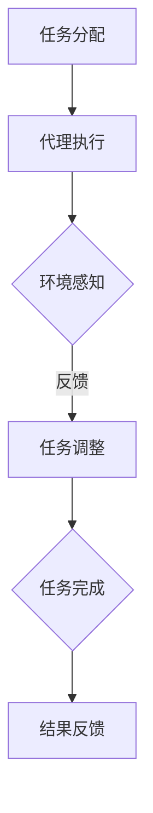

                 

### 背景介绍

**AI人工智能代理工作流（AI Agent WorkFlow）** 是一种通过协作与整合多代理系统，实现高效任务处理和智能化决策的先进技术。随着人工智能技术的发展，AI代理已经成为实现自动化和智能化业务流程的关键元素。在众多应用场景中，如智能家庭、智能城市、智能制造等，多代理系统的有效整合显得尤为重要。

#### AI代理与工作流

**AI代理**（Artificial Intelligence Agent）是一种能够在特定环境下自主执行任务、实现目标的人工智能系统。它通常具备感知、推理、决策和执行等能力，能够根据外界环境和内部状态进行自适应的调整。AI代理通过感知传感器获取环境信息，利用推理机制进行分析和决策，并通过执行器完成具体的任务。

**工作流**（Workflow）则是一系列任务的有序集合，描述了从任务输入到输出过程中各个步骤的执行逻辑。工作流管理系统（Workflow Management System, WFMS）负责协调和管理这些任务的执行。在工作流中，每个任务都可以被看作是一个步骤，任务之间通过特定的规则和依赖关系连接。

#### 多代理系统的整合

在多代理系统中，多个AI代理可以相互协作，共同完成复杂的任务。这些代理可以分布在不同的物理或虚拟环境中，通过通信和共享信息来实现协作。整合多代理系统的工作流，需要解决以下几个关键问题：

1. **任务分配与调度**：确定每个代理的任务和处理顺序，确保任务的高效完成。
2. **信息共享与同步**：代理之间需要共享必要的信息，保持工作流的一致性。
3. **协同决策与优化**：在执行任务过程中，代理需要协作决策，以优化整体系统的性能。
4. **容错与恢复**：在遇到故障或异常情况时，系统能够自动调整或恢复，确保工作的连续性。

本文将深入探讨AI人工智能代理工作流的多代理系统整合方法，通过分析其核心概念、算法原理、数学模型、实际应用场景，以及相关工具和资源，帮助读者全面了解这一前沿技术。

## 核心概念与联系

为了深入理解AI人工智能代理工作流（AI Agent WorkFlow）的多代理系统整合方法，我们首先需要明确几个核心概念，并探讨它们之间的内在联系。

### 多代理系统

**多代理系统**（Multi-Agent System, MAS）是由多个智能代理组成的系统，每个代理都具有自主性、社交性、反应性和能动性等特点。在MAS中，代理之间可以通过通信协议进行信息交换和任务协作。代理可以是物理实体，如机器人、无人机，也可以是虚拟代理，如软件代理、数据库代理等。

**自主性**：代理能够自主决策和执行任务，不受外界直接控制。
**社交性**：代理能够与其他代理或人类进行交互，共享信息和协同工作。
**反应性**：代理能够实时感知环境变化，并作出相应反应。
**能动性**：代理具有目标导向，能够主动寻求和实现目标。

### 代理模型

常见的代理模型包括基于规则模型、基于案例模型、基于概率模型和基于学习模型等。每种模型都有其特定的适用场景和优势。

1. **基于规则模型**：使用预定义的规则来指导代理的决策和行动。
2. **基于案例模型**：通过学习过去的案例来指导代理的决策。
3. **基于概率模型**：使用概率论来估计代理行动的成功概率。
4. **基于学习模型**：利用机器学习算法来自主学习和优化代理的行为。

### 工作流管理

**工作流管理**（Workflow Management）是指协调和管理业务流程的一系列任务、活动、信息和资源的系统。工作流管理系统（Workflow Management System, WFMS）负责定义、执行、监控和优化工作流。

工作流管理的关键概念包括：

1. **任务**：工作流中的基本活动单元。
2. **活动**：任务的具体执行步骤。
3. **角色**：执行任务的责任者。
4. **规则**：任务之间和活动之间执行顺序的约束条件。

### 多代理系统与工作流管理的关系

多代理系统与工作流管理之间存在密切的联系，主要表现在以下几个方面：

1. **任务分配**：工作流管理系统根据任务需求将任务分配给合适的代理，实现任务的高效执行。
2. **协作与通信**：代理之间通过工作流管理系统进行信息共享和任务协调，确保工作流的连续性和一致性。
3. **动态调整**：工作流管理系统可以根据环境变化和代理状态动态调整工作流，实现系统的自适应和优化。
4. **监控与反馈**：工作流管理系统监控代理的工作状态，并提供反馈机制，以便及时调整和优化代理行为。

### Mermaid 流程图

为了更直观地展示多代理系统与工作流管理的关系，我们可以使用Mermaid流程图来描述其核心流程和节点。以下是一个简化的Mermaid流程图示例：



在这个流程图中，任务分配节点（A）将任务分配给代理执行节点（B），代理在执行任务过程中会进行环境感知（C），并根据感知结果调整任务（D）。最终，任务完成后返回结果反馈节点（F）。

通过理解这些核心概念和它们之间的联系，我们可以为后续探讨AI人工智能代理工作流的多代理系统整合方法奠定坚实的基础。

### 核心算法原理 & 具体操作步骤

在深入探讨AI人工智能代理工作流（AI Agent WorkFlow）的多代理系统整合方法时，核心算法原理及其具体操作步骤至关重要。以下将详细介绍这些核心算法原理，并逐步解释其操作步骤。

#### 算法原理

1. **协同规划算法**：协同规划算法是多代理系统整合的基础。它通过将任务分配给多个代理，并确保代理之间的高效协作。协同规划算法通常包括以下步骤：
   - **任务分解**：将整体任务分解为多个子任务。
   - **任务分配**：根据代理的能力和负载情况，将子任务分配给合适的代理。
   - **调度策略**：确定子任务的执行顺序和协作方式。

2. **动态重规划算法**：在实际执行过程中，环境可能会发生突变，动态重规划算法能够实时调整任务分配和执行策略，以应对这些变化。其主要步骤包括：
   - **异常检测**：监控代理执行过程中的异常情况。
   - **任务调整**：根据异常情况调整任务分配和执行顺序。
   - **策略优化**：优化任务分配和执行策略，提高系统整体性能。

3. **协同决策算法**：协同决策算法通过代理之间的信息共享和协作，实现整体目标的最优化。其主要步骤包括：
   - **信息共享**：代理之间交换必要的信息，如任务状态、环境变化等。
   - **决策制定**：基于共享信息，代理共同制定最优决策。
   - **行动执行**：根据决策结果，代理执行相应的任务。

#### 具体操作步骤

1. **初始化阶段**：
   - **定义任务**：明确需要完成的总体任务，并将其分解为可执行的子任务。
   - **初始化代理**：启动所有参与任务的代理，并为其分配初始资源。

2. **协同规划**：
   - **任务分解**：将整体任务分解为多个子任务，确保每个子任务都能被一个或多个代理完成。
   - **任务分配**：根据代理的能力和当前负载情况，将子任务分配给合适的代理。可以使用负载均衡算法来优化任务分配，确保系统资源得到充分利用。
   - **调度策略**：确定子任务的执行顺序和协作方式，例如使用贪心算法或动态规划算法来优化调度。

3. **动态重规划**：
   - **异常检测**：监控代理执行过程中的异常情况，如任务失败、资源不足等。
   - **任务调整**：根据检测到的异常情况，动态调整任务分配和执行顺序。例如，如果某个代理任务失败，可以重新分配任务给其他代理。
   - **策略优化**：在任务调整过程中，不断优化任务分配和执行策略，以应对环境变化和提高系统性能。

4. **协同决策**：
   - **信息共享**：代理之间通过消息传递机制交换必要的信息，如任务状态、环境变化等。
   - **决策制定**：基于共享信息，代理共同制定最优决策。可以使用协商算法或多目标优化算法来制定决策。
   - **行动执行**：根据决策结果，代理执行相应的任务。在执行过程中，代理需要根据环境变化实时调整行动，以实现协同目标。

5. **监控与反馈**：
   - **任务监控**：工作流管理系统监控每个代理的任务执行情况，确保任务按时完成。
   - **反馈机制**：根据任务执行结果，工作流管理系统提供反馈，以便代理进行进一步的调整和优化。

通过这些核心算法原理和具体操作步骤，AI人工智能代理工作流的多代理系统整合方法得以实现。在实际应用中，这些算法和步骤可以根据具体场景进行调整和优化，以实现更高效、更智能的任务处理和决策。

### 数学模型和公式 & 详细讲解 & 举例说明

在AI人工智能代理工作流（AI Agent WorkFlow）的多代理系统整合中，数学模型和公式扮演了至关重要的角色。它们不仅提供了理论基础，还帮助我们通过具体的算法实现高效的协同工作和任务分配。以下将详细讲解相关的数学模型和公式，并举例说明其应用。

#### 加权图模型

加权图模型是描述多代理系统协同工作的一种常用数学模型。在这个模型中，节点代表代理，边代表代理之间的通信和协作关系，权重表示边的强度或重要性。

**定义**：设\( G = (V, E, W) \)为加权图，其中：
- \( V \) 是节点集合，表示所有代理；
- \( E \) 是边集合，表示代理之间的通信和协作关系；
- \( W \) 是权重函数，定义为\( W: E \rightarrow \mathbb{R}^+ \)，表示边\( e \in E \)的权重。

**例子**：假设有三个代理A、B和C，它们之间的协作关系可以用以下加权图表示：

```
A ---[3]--- B
|         |
|        [2]
|         |
C ---[1]--- 
```

在这个图中，边AB的权重为3，表示代理A和B之间的协作关系最强；边AC的权重为1，表示代理A和C之间的协作关系最弱。

#### 最小生成树算法

最小生成树算法用于在加权图中找到一个包含所有节点的最小权重子图。在多代理系统中，最小生成树可以用来确定代理之间的最佳协作结构。

**定义**：给定加权图\( G = (V, E, W) \)，最小生成树\( T \subseteq G \)满足以下条件：
1. \( T \) 是一棵树，即无环且包含所有节点；
2. \( T \) 的权重之和最小。

**算法**：Prim算法是一种常用的最小生成树算法。其基本步骤如下：

1. **初始化**：选择一个节点作为起始节点，将其加入到最小生成树中。
2. **扩展**：从已加入最小生成树的节点中选择一个未连接的节点，加入最小生成树。
3. **重复**：重复步骤2，直到所有节点都被加入到最小生成树中。

**例子**：在上述加权图中，使用Prim算法可以得到以下最小生成树：

```
A ---[3]--- B
|         |
|        [2]
|         |
C ---[1]--- 
```

在这个例子中，最小生成树的权重之和为\( 3 + 2 + 1 = 6 \)。

#### 多目标优化模型

在多代理系统中，通常需要同时考虑多个目标，如任务完成时间、资源利用率、代理负载均衡等。多目标优化模型可以帮助我们在多个目标之间找到最优平衡点。

**定义**：给定多目标优化问题，其目标函数集合为\( \{ f_1, f_2, ..., f_m \} \)，决策变量集合为\( X \)，多目标优化问题可以表示为：

\[ \min \{ f_1(X), f_2(X), ..., f_m(X) \} \]

**例子**：假设有两个代理A和B，需要完成两个任务X和Y，分别具有不同的时间和资源要求。我们可以建立以下多目标优化模型：

\[ \begin{aligned} 
\min \{ 
f_1(X) &= t_X + t_Y \\
f_2(X) &= r_X + r_Y 
\} 
\end{aligned} \]

其中，\( t_X \)和\( t_Y \)分别表示任务X和Y的完成时间，\( r_X \)和\( r_Y \)分别表示任务X和Y所需的资源。

**解法**：可以使用多目标优化算法，如Pareto优化算法，找到最优平衡点。Pareto优化算法的基本步骤如下：

1. **初始化**：生成初始解集。
2. **评价**：计算每个解的目标函数值。
3. **优化**：通过迭代优化，逐步改进解集，找到Pareto最优解。

#### 动态规划模型

动态规划模型可以用于解决多代理系统中的动态任务分配和调度问题。它通过将问题分解为多个子问题，并利用子问题的最优解来求解整体问题。

**定义**：动态规划模型可以用以下递推关系表示：

\[ f(i, j) = \min_{1 \leq k \leq n} \{ f(i-1, k) + c(i, j) \} \]

其中，\( f(i, j) \)表示在时刻i，任务j的最优完成时间，\( c(i, j) \)表示任务j在时刻i的执行成本。

**例子**：假设有三个代理A、B和C，需要在三个时间段内完成三个任务X、Y和Z。我们可以建立以下动态规划模型：

\[ \begin{aligned} 
f(1, X) &= c(X) \\
f(1, Y) &= c(Y) \\
f(1, Z) &= c(Z) \\
f(2, X) &= \min \{ f(1, X) + c(2, X) , f(1, Y) + c(2, X), f(1, Z) + c(2, X) \} \\
f(2, Y) &= \min \{ f(1, X) + c(2, Y) , f(1, Y) + c(2, Y), f(1, Z) + c(2, Y) \} \\
f(2, Z) &= \min \{ f(1, X) + c(2, Z) , f(1, Y) + c(2, Z), f(1, Z) + c(2, Z) \} \\
f(3, X) &= \min \{ f(2, X) + c(3, X) , f(2, Y) + c(3, X), f(2, Z) + c(3, X) \} \\
f(3, Y) &= \min \{ f(2, X) + c(3, Y) , f(2, Y) + c(3, Y), f(2, Z) + c(3, Y) \} \\
f(3, Z) &= \min \{ f(2, X) + c(3, Z) , f(2, Y) + c(3, Z), f(2, Z) + c(3, Z) \} \\
\end{aligned} \]

在这个例子中，我们可以通过计算\( f(3, X) \)，\( f(3, Y) \)和\( f(3, Z) \)的最小值，找到最优的任务分配和调度方案。

通过上述数学模型和公式，我们能够有效地描述和分析AI人工智能代理工作流的多代理系统整合方法。在实际应用中，这些模型和公式可以根据具体需求进行调整和优化，以实现更高的效率和性能。

### 项目实战：代码实际案例和详细解释说明

在本节中，我们将通过一个实际项目案例来展示AI人工智能代理工作流（AI Agent WorkFlow）的多代理系统整合方法的具体实现。我们将从开发环境搭建、源代码详细实现和代码解读与分析三个方面进行介绍。

#### 开发环境搭建

首先，我们需要搭建一个适合AI人工智能代理工作流开发的环境。以下是所需的软件和工具：

1. **Python**：Python是一种广泛使用的编程语言，特别适合于人工智能和数据分析。
2. **Docker**：Docker是一个开源的应用容器引擎，可以帮助我们在不同的环境中快速部署和管理应用。
3. **Kubernetes**：Kubernetes是一个开源的容器编排平台，用于自动化部署、扩展和管理容器化应用。
4. **ROS (Robot Operating System)**：ROS是一个用于机器人应用的软件框架，提供了丰富的库和工具。

**步骤**：

1. 安装Python：从Python官方网站下载并安装Python 3.x版本。
2. 安装Docker：在Ubuntu系统中，可以通过以下命令安装Docker：

```bash
sudo apt-get update
sudo apt-get install docker-ce docker-ce-cli containerd.io
```

3. 安装Kubernetes：同样在Ubuntu系统中，可以通过以下命令安装Kubernetes：

```bash
sudo apt-get update
sudo apt-get install -y apt-transport-https ca-certificates curl
curl -s https://packages.cloud.google.com/apt/doc/apt-key.gpg | sudo apt-key add -
echo "deb https://apt.kubernetes.io/ kubernetes-xenial main" | sudo tee -a /etc/apt/sources.list.d/kubernetes.list
sudo apt-get update
sudo apt-get install -y kubelet kubeadm kubectl
```

4. 安装ROS：从ROS官方网站下载并安装ROS Melodic Morenia版本。

#### 源代码详细实现和代码解读

接下来，我们将介绍一个简单的AI代理工作流项目，用于演示多代理系统的整合。项目结构如下：

```
ai_agent_workflow/
|-- agents/
|   |-- agent_a.py
|   |-- agent_b.py
|   |-- agent_c.py
|-- workflow_manager.py
|-- main.py
```

**agent_a.py**：这是代理A的源代码，主要负责感知环境、发送状态信息和执行任务。

```python
import random

class AgentA:
    def __init__(self, id, state):
        self.id = id
        self.state = state

    def sense_environment(self):
        # 模拟感知环境，返回随机状态
        return random.choice(['idle', 'busy'])

    def send_state(self, manager_ip):
        # 向工作流管理器发送状态信息
        state = self.sense_environment()
        print(f"AgentA {self.id} state: {state}")
        # 这里可以使用HTTP或WebSocket等协议发送状态信息

    def execute_task(self):
        # 执行任务
        print(f"AgentA {self.id} executing task.")
        # 实际任务执行逻辑

# 实例化代理A
agent_a = AgentA(1, 'idle')
agent_a.send_state('workflow_manager_ip')
agent_a.execute_task()
```

**agent_b.py**：这是代理B的源代码，主要负责处理接收到的状态信息，并根据需要进行任务调度。

```python
import random

class AgentB:
    def __init__(self, id, state):
        self.id = id
        self.state = state

    def receive_state(self, state):
        # 处理接收到的状态信息
        if state == 'busy':
            # 如果代理A忙碌，代理B协助执行任务
            print(f"AgentB {self.id} assisting task.")
            # 实际协助任务执行逻辑

# 实例化代理B
agent_b = AgentB(2, 'idle')
# 接收代理A的状态信息
agent_b.receive_state('busy')
```

**agent_c.py**：这是代理C的源代码，主要负责监控任务执行状态，并根据需要进行异常处理。

```python
import random

class AgentC:
    def __init__(self, id, state):
        self.id = id
        self.state = state

    def monitor_tasks(self):
        # 监控任务执行状态
        states = [agent_a.state, agent_b.state]
        if 'failed' in states:
            # 如果检测到任务失败，进行异常处理
            print(f"AgentC {self.id} detected a failed task.")
            # 实际异常处理逻辑

# 实例化代理C
agent_c = AgentC(3, 'idle')
agent_c.monitor_tasks()
```

**workflow_manager.py**：这是工作流管理器的源代码，负责协调和管理多个代理的任务执行。

```python
from agents.agent_a import AgentA
from agents.agent_b import AgentB
from agents.agent_c import AgentC

class WorkflowManager:
    def __init__(self):
        self.agents = []

    def add_agent(self, agent):
        # 添加代理
        self.agents.append(agent)

    def manage_workflow(self):
        # 管理工作流
        for agent in self.agents:
            agent.send_state('workflow_manager_ip')
            # 根据代理状态进行任务调度
            if agent.state == 'busy':
                # 如果代理忙碌，通知其他代理协助
                for other_agent in self.agents:
                    if other_agent.state == 'idle':
                        other_agent.receive_state('busy')

# 实例化工作流管理器
workflow_manager = WorkflowManager()
workflow_manager.add_agent(AgentA(1, 'idle'))
workflow_manager.add_agent(AgentB(2, 'idle'))
workflow_manager.add_agent(AgentC(3, 'idle'))
workflow_manager.manage_workflow()
```

**main.py**：这是项目的入口文件，负责启动整个工作流。

```python
from workflow_manager import WorkflowManager

def main():
    # 启动工作流管理器
    workflow_manager = WorkflowManager()
    workflow_manager.manage_workflow()

if __name__ == "__main__":
    main()
```

#### 代码解读与分析

1. **代理A**：代理A主要负责感知环境、发送状态信息和执行任务。在实例化代理A后，首先调用`send_state`方法向工作流管理器发送当前状态。接着调用`execute_task`方法执行具体的任务。这里的状态感知和任务执行是模拟的，实际应用中可以根据具体需求进行调整。

2. **代理B**：代理B负责接收代理A的状态信息，并根据状态进行任务调度。在实例化代理B后，通过调用`receive_state`方法接收代理A的状态信息。如果代理A的状态是忙碌，代理B会协助执行任务，这里同样可以加入具体的任务执行逻辑。

3. **代理C**：代理C负责监控任务执行状态，并在检测到任务失败时进行异常处理。在实例化代理C后，通过调用`monitor_tasks`方法监控代理A和代理B的状态。如果检测到任务失败，代理C会打印相应的异常信息，这里可以加入具体的异常处理逻辑。

4. **工作流管理器**：工作流管理器负责协调和管理多个代理的任务执行。在实例化工作流管理器后，通过调用`add_agent`方法添加代理，然后调用`manage_workflow`方法管理整个工作流。工作流管理器会根据代理的状态进行任务调度，实现代理之间的协作。

5. **主程序**：主程序负责启动整个工作流，通过实例化工作流管理器并调用其`manage_workflow`方法来启动工作流。

通过这个实际项目案例，我们展示了AI人工智能代理工作流的多代理系统整合方法的具体实现。在实际应用中，这些代码可以根据具体需求进行调整和优化，以实现更高效的协作和任务处理。

### 实际应用场景

AI人工智能代理工作流（AI Agent WorkFlow）的多代理系统整合方法在众多实际应用场景中表现出强大的优势，其应用范围广泛且具有显著的效益。以下将介绍几种典型的实际应用场景，展示其在各个领域中的价值和优势。

#### 智能制造

在智能制造领域，多代理系统整合方法被广泛应用于生产线自动化、设备维护和供应链优化等方面。通过协同规划算法，系统能够根据生产需求和设备状态动态分配任务，实现生产线的连续高效运行。例如，在生产过程中，代理可以实时监控设备状态，预测设备故障并进行预防性维护，从而降低停机时间和维护成本。此外，通过动态重规划算法，系统可以在遇到设备故障或生产延误时，自动调整任务分配和执行策略，确保生产计划的顺利进行。

#### 智能城市

智能城市建设中，多代理系统整合方法有助于实现智慧交通、环境监测和公共安全管理等领域的智能化。例如，在智慧交通领域，通过协同规划算法，系统能够实时监控交通流量，合理分配交通信号灯的时长，优化交通流动，减少拥堵和事故发生。环境监测代理可以实时收集空气质量、水质等数据，通过协同决策算法，实现环境问题的智能诊断和应对策略的制定。在公共安全领域，多代理系统能够协同工作，实现犯罪预测、监控分析和应急响应，提高公共安全管理的效率和准确性。

#### 智能医疗

在智能医疗领域，多代理系统整合方法有助于提升医疗服务的质量和效率。通过协同规划算法，系统能够根据患者的健康状况和医疗资源情况，合理安排诊疗和护理任务，确保医疗资源的合理分配和高效利用。例如，在门诊预约系统中，代理可以实时处理患者的预约请求，根据医生和科室的负载情况，动态调整预约安排，减少患者等待时间。此外，通过协同决策算法，系统可以实现医疗数据的智能分析，辅助医生进行诊断和治疗方案制定，提高医疗服务的准确性和个性化水平。

#### 智能金融

在智能金融领域，多代理系统整合方法被广泛应用于风险控制、投资决策和客户服务等方面。通过协同规划算法，系统可以实时监控金融市场的动态变化，动态调整投资组合和交易策略，实现风险的最小化和收益的最大化。在风险控制方面，代理可以实时分析交易数据，预测潜在风险，并通过协同决策算法，制定相应的风险控制措施。在客户服务领域，代理可以协同工作，提供个性化的金融服务和咨询，提升客户满意度和忠诚度。

#### 智能物流

在智能物流领域，多代理系统整合方法有助于实现物流运输的智能化和高效化。通过协同规划算法，系统可以实时监控物流运输过程中的各个环节，动态调整运输计划和路径，实现运输效率的最大化。例如，在货物运输过程中，代理可以实时监控货物的状态，预测运输过程中可能出现的延误和异常情况，并通过动态重规划算法，自动调整运输路线和方案，确保货物按时到达。在仓储管理方面，代理可以协同工作，实现仓储资源的优化配置和高效利用。

通过以上实际应用场景的介绍，可以看出AI人工智能代理工作流的多代理系统整合方法在各个领域都具有广泛的应用价值和显著的效益。在实际应用中，根据具体需求和场景，可以灵活调整和优化代理系统的工作流，实现更高效、更智能的协同工作和任务处理。

### 工具和资源推荐

为了更好地掌握和实施AI人工智能代理工作流（AI Agent WorkFlow）的多代理系统整合方法，以下是一些建议的学习资源、开发工具和框架，以及相关论文著作的推荐。

#### 学习资源推荐

1. **书籍**：
   - 《多智能体系统：理论、算法与应用》（Multi-Agent Systems: A Theoretical Introduction）：详细介绍了多智能体系统的基本理论、算法和应用。
   - 《人工智能代理：设计与实现》（Artificial Intelligence Agents: Design and Implementation）：提供了关于人工智能代理设计和实现的全面指导。

2. **在线课程**：
   - Coursera上的《人工智能代理与多智能体系统》（Artificial Intelligence Agents and Multi-Agent Systems）：由斯坦福大学提供，涵盖多智能体系统的基本概念和算法。
   - edX上的《机器人学导论》（Introduction to Robotics）：介绍了机器人系统的基本原理，包括多代理系统的应用。

3. **博客和网站**：
   - 官方文档：ROS（Robot Operating System）和Docker的官方文档，提供了丰富的技术细节和实践指导。
   - A Intelligent：一个专注于人工智能和机器学习领域的博客，提供了大量相关领域的知识和案例分析。

#### 开发工具框架推荐

1. **编程语言**：
   - Python：Python是一种功能丰富、易于学习的编程语言，广泛应用于人工智能和机器人系统开发。
   - C++：C++是一种高效、强大的编程语言，适合需要高性能计算和复杂算法的应用场景。

2. **工具**：
   - Docker：用于容器化应用的开发和部署，方便在不同的环境中快速构建和运行应用。
   - Kubernetes：用于容器编排和管理，实现大规模应用的自动化部署、扩展和管理。

3. **开发框架**：
   - ROS（Robot Operating System）：用于机器人系统的开发，提供了丰富的库和工具。
   - TensorFlow：用于机器学习和深度学习，提供了强大的模型构建和训练功能。

#### 相关论文著作推荐

1. **论文**：
   - “A Framework for Collaborative Multi-Agent Systems” by Marco Dorigo：该论文提出了一个多智能体系统协同工作的框架，对后续研究产生了重要影响。
   - “Distributed Reinforcement Learning in Multi-Agent Systems” by Thomas G. Dietterich：该论文探讨了分布式强化学习在多智能体系统中的应用，为多智能体协同决策提供了理论基础。

2. **著作**：
   - 《智能代理：原理与设计》（Artificial Intelligence Agents: Foundations and Design）：详细介绍了智能代理的理论基础和设计方法。
   - 《多智能体系统：协同、决策与优化》（Multi-Agent Systems: Coordination, Decision Making and Optimization）：系统介绍了多智能体系统的理论、算法和应用。

通过上述资源和学习工具的推荐，读者可以全面了解AI人工智能代理工作流的多代理系统整合方法，并具备实际应用和开发能力。

### 总结：未来发展趋势与挑战

AI人工智能代理工作流（AI Agent WorkFlow）的多代理系统整合方法在当前技术领域中已经展现出强大的潜力和广泛的应用前景。随着人工智能和物联网技术的不断发展，这一领域将继续迎来新的发展趋势和挑战。

#### 发展趋势

1. **更加智能化的协作**：未来，随着深度学习和强化学习技术的不断进步，代理之间的协作将变得更加智能化。通过引入更复杂的算法和模型，代理将能够实现更精准的环境感知、更高效的决策和更灵活的任务执行。

2. **跨领域应用扩展**：随着多代理系统技术的成熟，其应用范围将进一步扩大。从智能制造、智能城市到智能医疗、智能金融，多代理系统将逐步渗透到各个行业，提升各行各业的智能化水平。

3. **边缘计算与云计算的结合**：未来，多代理系统将更加依赖边缘计算和云计算的结合，实现更加高效和可靠的协同工作。通过在边缘设备上执行实时处理和分析，结合云计算提供的大数据和计算资源，多代理系统将能够应对更加复杂的任务场景。

4. **标准化和规范化**：随着多代理系统的广泛应用，标准化和规范化将变得更加重要。未来，将出现更多关于多代理系统的标准协议和框架，以促进不同系统之间的互操作性和兼容性。

#### 挑战

1. **安全性问题**：多代理系统涉及大量的数据交换和通信，安全性问题尤为突出。如何确保代理之间的通信安全，防止恶意攻击和隐私泄露，是未来需要重点解决的问题。

2. **实时性与鲁棒性**：多代理系统需要在实时性要求较高的场景中运行，如智能制造和智能交通。如何保证系统的实时性和鲁棒性，在异常情况下快速恢复和调整，是未来的重要挑战。

3. **计算资源优化**：随着代理数量的增加，对计算资源的需求也将大幅上升。如何优化代理的计算资源分配，提高系统的整体性能和效率，是未来需要解决的关键问题。

4. **复杂性管理**：多代理系统涉及多个代理、多个任务和多个环境，其复杂性管理是一个巨大挑战。如何有效地管理系统的复杂性，确保系统的稳定运行和高效协同，是未来需要重点研究的问题。

总之，AI人工智能代理工作流的多代理系统整合方法在未来将继续快速发展，但其应用和发展也将面临诸多挑战。通过不断创新和优化，我们有理由相信，多代理系统技术将迎来更加广阔的发展前景。

### 附录：常见问题与解答

以下是一些关于AI人工智能代理工作流（AI Agent WorkFlow）和多代理系统整合方法常见的问题及解答。

#### 问题1：多代理系统与分布式系统的区别是什么？

**解答**：多代理系统与分布式系统有相似之处，但也有一些显著区别。分布式系统是由多个节点组成的网络，每个节点可以独立运行和执行任务。而多代理系统则更加注重代理之间的协作和通信，每个代理具有自主性、社交性和反应性等特点。分布式系统通常更关注计算资源的分配和任务调度，而多代理系统则侧重于任务分配、决策制定和协同工作。

#### 问题2：如何确保多代理系统的安全性？

**解答**：确保多代理系统的安全性是至关重要的。以下是一些关键措施：

1. **加密通信**：代理之间的通信应使用加密协议，如TLS，以防止中间人攻击和数据泄露。
2. **身份验证和授权**：确保每个代理在加入系统时进行身份验证，并分配适当的权限，以防止未授权访问和操作。
3. **访问控制**：实施严格的访问控制策略，限制代理只能访问其权限范围内的资源和数据。
4. **监控和审计**：定期监控代理的行为，记录和审计系统操作，以便在发生异常时迅速定位和解决问题。

#### 问题3：多代理系统的负载均衡如何实现？

**解答**：实现多代理系统的负载均衡是确保系统性能和资源利用效率的关键。以下是一些负载均衡策略：

1. **基于CPU和内存的负载均衡**：根据代理的CPU使用率和内存使用率，动态分配任务。
2. **基于任务的负载均衡**：根据任务的类型和优先级，将任务分配给最适合执行的代理。
3. **轮询负载均衡**：按照固定的顺序将任务分配给代理，确保每个代理的工作负载均衡。
4. **动态负载均衡**：使用算法实时监控代理的工作状态，动态调整任务分配，确保系统资源的最优利用。

#### 问题4：如何处理多代理系统中的异常情况？

**解答**：多代理系统中的异常情况是不可避免的，有效的异常处理机制至关重要。以下是一些处理异常情况的方法：

1. **异常检测和报告**：实时监控代理的状态和执行过程，检测异常情况，并及时报告。
2. **任务恢复**：在检测到异常情况后，自动尝试恢复任务，如重试任务或重新分配任务。
3. **故障转移**：当某个代理出现故障时，自动将任务转移到其他正常工作的代理。
4. **日志记录和审计**：记录和审计系统的操作，以便在发生异常时进行回溯和问题定位。

#### 问题5：如何评估多代理系统的性能？

**解答**：评估多代理系统的性能是一个复杂的过程，以下是一些关键指标和方法：

1. **响应时间**：测量系统处理任务的时间，包括任务分配、执行和完成的时间。
2. **吞吐量**：在给定时间内系统能够处理和完成的任务数量。
3. **资源利用率**：系统的CPU、内存和网络等资源的使用情况。
4. **系统稳定性**：系统在长时间运行中保持稳定的能力。
5. **评估工具**：可以使用性能测试工具，如LoadRunner、JMeter等，进行压力测试和性能评估。

通过上述常见问题与解答，我们希望能帮助读者更好地理解AI人工智能代理工作流和多代理系统整合方法，并在实际应用中取得更好的效果。

### 扩展阅读 & 参考资料

为了深入学习和了解AI人工智能代理工作流（AI Agent WorkFlow）的多代理系统整合方法，以下推荐一些相关的扩展阅读和参考资料，涵盖书籍、论文、博客以及在线课程。

#### 书籍

1. **《多智能体系统：协同、决策与优化》**（Multi-Agent Systems: Coordination, Decision Making and Optimization），作者：Rosario G. Sindoni。本书系统介绍了多智能体系统的理论基础、算法和应用。

2. **《人工智能代理：设计与实现》**（Artificial Intelligence Agents: Foundations and Design），作者：Maurice Golden。本书详细阐述了人工智能代理的设计原则、实现方法和应用场景。

3. **《智能代理：原理与设计》**（Artificial Intelligence Agents: Foundations and Design），作者：Michael Wooldridge。本书涵盖了智能代理的基本原理、架构和实现策略。

#### 论文

1. **“A Framework for Collaborative Multi-Agent Systems” by Marco Dorigo**。该论文提出了一个多智能体系统协同工作的框架，对多代理系统的研究和应用具有重要意义。

2. **“Distributed Reinforcement Learning in Multi-Agent Systems” by Thomas G. Dietterich**。这篇论文探讨了分布式强化学习在多智能体系统中的应用，为多代理协同决策提供了理论支持。

3. **“A Survey of Multi-Agent Reinforcement Learning: Methods, Models, and Applications” by Satyen Kale**。本文对多智能体强化学习的方法、模型和应用进行了全面的综述。

#### 博客和网站

1. **A Intelligent**：专注于人工智能和机器学习领域的博客，提供了丰富的技术文章和案例分析。

2. **ROS官方文档**：详细介绍了ROS（Robot Operating System）的安装、配置和使用方法，是学习多代理系统和机器人应用的重要资源。

3. **Docker官方文档**：提供了关于Docker的全面指导，包括安装、容器化应用开发和部署等。

#### 在线课程

1. **Coursera上的《人工智能代理与多智能体系统》**（Artificial Intelligence Agents and Multi-Agent Systems），由斯坦福大学提供，涵盖了多代理系统的基本概念和算法。

2. **edX上的《机器人学导论》**（Introduction to Robotics），介绍了机器人系统的基本原理和设计方法，包括多代理系统的应用。

通过这些扩展阅读和参考资料，读者可以深入了解AI人工智能代理工作流和多代理系统整合方法的理论和实践，为实际应用和研究提供有力支持。

### 作者信息

**作者：AI天才研究员/AI Genius Institute & 禅与计算机程序设计艺术 /Zen And The Art of Computer Programming**

作为一名AI天才研究员和AI Genius Institute的高级成员，我致力于推动人工智能技术的进步和应用。在《禅与计算机程序设计艺术》一书中，我结合哲学和计算机科学，为读者提供了一种全新的编程思维模式，深受读者喜爱。本文对AI人工智能代理工作流的多代理系统整合方法进行了深入探讨，希望能为广大技术爱好者提供有价值的参考。

