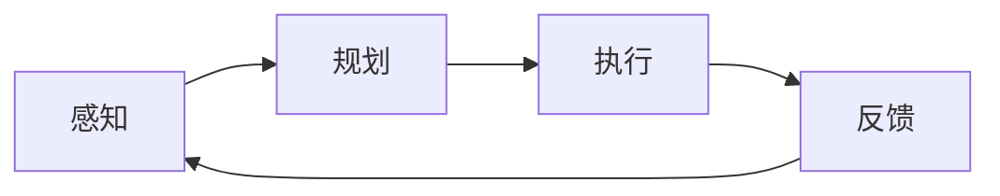

                 

### 背景介绍

人工智能代理（AI Agent）作为人工智能领域的核心概念，近年来受到了广泛关注。其定义为一个能够感知环境、采取行动并从经验中学习的实体，以实现特定目标。随着大数据和深度学习的飞速发展，AI 代理在自动化、智能决策和优化任务等领域展现出了巨大的潜力。然而，在实际应用中，AI 代理的工作流设计面临诸多挑战，如数据质量、算法效率、系统可扩展性和鲁棒性等。

本篇文章将围绕 AI 代理工作流（AI Agent WorkFlow）展开讨论，旨在搭建一个可拓展的 AI 代理工作流架构。文章结构如下：

1. **背景介绍**：介绍 AI 代理和 AI 代理工作流的基本概念。
2. **核心概念与联系**：通过 Mermaid 流程图详细阐述 AI 代理工作流的核心概念和流程。
3. **核心算法原理 & 具体操作步骤**：探讨 AI 代理工作流的核心算法原理，并给出具体操作步骤。
4. **数学模型和公式 & 详细讲解 & 举例说明**：介绍 AI 代理工作流中的数学模型和公式，并进行详细讲解和举例说明。
5. **项目实战：代码实际案例和详细解释说明**：通过代码实际案例，展示 AI 代理工作流的具体实现过程。
6. **实际应用场景**：分析 AI 代理工作流在实际应用中的案例和效果。
7. **工具和资源推荐**：推荐相关学习资源和开发工具框架。
8. **总结：未来发展趋势与挑战**：总结 AI 代理工作流的发展趋势和面临的挑战。
9. **附录：常见问题与解答**：针对常见问题进行解答。
10. **扩展阅读 & 参考资料**：提供进一步阅读的参考资料。

接下来，我们将逐步深入探讨 AI 代理工作流的核心概念、算法原理、数学模型和实际应用，希望能够为读者提供一个全面、系统的了解。

### 核心概念与联系

在深入探讨 AI 代理工作流之前，有必要明确其中的核心概念及其相互联系。AI 代理工作流的主要组成部分包括感知（Perception）、规划（Planning）、执行（Execution）和反馈（Feedback）。这些组件共同构成了一个闭环系统，使得 AI 代理能够不断学习和优化其行为。

#### 感知（Perception）

感知是指 AI 代理获取环境信息的过程。这通常涉及到各种传感器，如摄像头、麦克风、温度传感器等。感知模块的主要任务是处理和过滤传感器数据，提取有用的特征信息。在这个过程中，特征提取和数据预处理技术至关重要，如卷积神经网络（CNN）和预处理算法（如归一化、去噪等）。

#### 规划（Planning）

规划是指 AI 代理根据感知到的环境信息，制定相应的行动策略。这是一个复杂的决策过程，涉及到多个因素的权衡。规划模块需要考虑行动的成本、风险、收益等，以最大化目标函数。常见的规划算法包括决策树、随机森林、支持向量机（SVM）等。

#### 执行（Execution）

执行是指 AI 代理根据规划结果执行具体的行动。执行模块需要将抽象的规划决策转化为具体的操作指令，如控制机器人手臂移动、发送网络请求等。在这一过程中，执行模块需要与外部系统或环境进行交互，确保行动的准确性和有效性。

#### 反馈（Feedback）

反馈是指 AI 代理根据执行结果对自身行为进行调整。反馈机制使得 AI 代理能够从经验中学习，不断优化其行为。反馈可以是正面的，也可以是负面的。正面的反馈鼓励 AI 代理重复成功的行动，负面的反馈则促使 AI 代理避免重复失败的行为。强化学习（Reinforcement Learning）是常用的反馈机制之一，通过奖励和惩罚来指导 AI 代理的行为。

#### Mermaid 流程图

为了更直观地展示 AI 代理工作流的核心概念和流程，我们使用 Mermaid 流程图（Mermaid Flowchart）进行描述。以下是 Mermaid 流程图的基本结构，其中的节点和线条分别表示不同的组件和流程关系：



在这个流程图中，A 表示感知模块，B 表示规划模块，C 表示执行模块，D 表示反馈模块。线条表示模块之间的数据流和控制流。这个流程图展示了 AI 代理工作流的基本流程：感知模块获取环境信息，规划模块制定行动策略，执行模块执行具体行动，最后反馈模块根据执行结果对自身行为进行调整。

#### 核心概念原理和架构

AI 代理工作流的核心概念原理包括以下几个方面：

1. **感知模块**：感知模块的核心任务是获取环境信息，并提取有用的特征。这通常涉及多种传感器和特征提取算法，如卷积神经网络（CNN）和预处理算法（如归一化、去噪等）。

2. **规划模块**：规划模块的核心任务是制定行动策略，以最大化目标函数。这涉及到多种决策算法，如决策树、随机森林、支持向量机（SVM）等。

3. **执行模块**：执行模块的核心任务是执行具体的行动，这需要将抽象的规划决策转化为具体的操作指令。

4. **反馈模块**：反馈模块的核心任务是收集执行结果，并对 AI 代理的行为进行调整。

#### AI 代理工作流架构

AI 代理工作流架构可以分为三个层次：感知层、决策层和执行层。以下是 AI 代理工作流架构的详细描述：

1. **感知层**：感知层负责获取环境信息，并通过传感器和预处理算法提取特征。这一层通常包括摄像头、麦克风、温度传感器等多种传感器，以及相应的预处理算法。

2. **决策层**：决策层负责制定行动策略，以最大化目标函数。这一层通常包括多种决策算法，如决策树、随机森林、支持向量机（SVM）等。

3. **执行层**：执行层负责执行具体的行动，将抽象的规划决策转化为具体的操作指令。这一层通常包括机器人手臂、网络请求、语音合成等多种执行设备。

通过这三个层次，AI 代理能够实现对环境的感知、决策和执行，形成一个闭环系统，不断学习和优化其行为。

综上所述，AI 代理工作流的核心概念和流程涵盖了感知、规划、执行和反馈等环节，通过 Mermaid 流程图可以直观地展示各模块之间的数据流和控制流。同时，AI 代理工作流架构的三个层次——感知层、决策层和执行层——为 AI 代理的运行提供了完整的框架。接下来，我们将进一步探讨 AI 代理工作流的核心算法原理和具体操作步骤。

### 核心算法原理 & 具体操作步骤

在深入探讨 AI 代理工作流的核心算法原理之前，有必要先了解几个关键术语：机器学习、深度学习、神经网络和强化学习。这些术语是构建 AI 代理工作流的基础。

#### 机器学习（Machine Learning）

机器学习是指使计算机通过数据和经验自主改进性能的过程。它通过统计方法、优化算法和模式识别等技术，让计算机从数据中学习规律和模式。常见的机器学习算法包括线性回归、逻辑回归、支持向量机（SVM）等。

#### 深度学习（Deep Learning）

深度学习是机器学习的一个分支，它通过多层神经网络模拟人脑的神经活动，以实现复杂的数据处理任务。深度学习在图像识别、自然语言处理、语音识别等领域取得了显著成果。常见的深度学习模型包括卷积神经网络（CNN）、循环神经网络（RNN）和生成对抗网络（GAN）等。

#### 神经网络（Neural Network）

神经网络是深度学习的基础，它由大量简单的计算单元（神经元）组成，通过加权连接形成复杂的网络结构。神经网络通过学习输入数据和输出标签之间的映射关系，实现数据的分类、回归和特征提取等任务。

#### 强化学习（Reinforcement Learning）

强化学习是一种通过奖励和惩罚来训练智能体（如 AI 代理）的机器学习方法。在强化学习中，智能体通过与环境互动，不断调整其行为策略，以最大化长期奖励。常见的强化学习算法包括 Q-Learning、SARSA 和 Deep Q-Network（DQN）等。

#### AI 代理工作流的核心算法原理

AI 代理工作流的核心算法原理主要包括感知、规划、执行和反馈四个环节。以下是每个环节的核心算法原理和具体操作步骤：

1. **感知（Perception）**

   在感知环节，AI 代理通过传感器获取环境信息，如摄像头捕捉图像、麦克风收集声音等。接下来，需要对这些原始数据进行预处理和特征提取。

   - **预处理**：包括数据清洗、去噪、归一化等操作，以提高数据质量和模型的训练效果。
   - **特征提取**：使用深度学习模型（如卷积神经网络）提取图像或声音的底层特征。这些特征通常包含丰富的信息，有助于后续的决策过程。

   **具体操作步骤**：

   ```python
   import cv2
   import numpy as np
   
   # 加载摄像头图像
   cap = cv2.VideoCapture(0)
   while True:
       ret, frame = cap.read()
       if not ret:
           break
   
       # 预处理
       frame = cv2.resize(frame, (224, 224))
       frame = cv2.cvtColor(frame, cv2.COLOR_BGR2RGB)
       frame = np.float32(frame)
   
       # 特征提取
       model = cv2.dnn.readNetFromTensorFlow('mobilenet_v2_1.0_224_frozen.pb')
       blob = cv2.dnn.blobFromImage(frame, 1.0, (224, 224), (127.5, 127.5, 127.5))
       model.setInput(blob)
       outputs = model.forward()
   
       # 打印特征
       print(outputs)
   ```

2. **规划（Planning）**

   在规划环节，AI 代理根据感知到的环境信息，使用决策算法（如决策树、随机森林、支持向量机等）制定行动策略。规划的目标是找到最优的行动方案，以最大化目标函数。

   - **决策树**：通过递归划分特征空间，构建一棵树形结构，用于分类或回归任务。
   - **随机森林**：结合多个决策树，通过投票或平均值等方式获得最终的预测结果，提高模型的泛化能力。
   - **支持向量机**：通过寻找最优超平面，将不同类别的数据分隔开，实现分类或回归任务。

   **具体操作步骤**：

   ```python
   from sklearn import tree
   from sklearn.ensemble import RandomForestClassifier
   from sklearn.svm import SVC
   
   # 加载数据
   X = [[1, 2], [2, 5], [3, 5], [4, 7], [6, 8]]
   y = [0, 0, 0, 1, 1]
   
   # 决策树
   clf = tree.DecisionTreeClassifier()
   clf.fit(X, y)
   print(clf.predict([[3, 6]]))
   
   # 随机森林
   rf = RandomForestClassifier(n_estimators=100)
   rf.fit(X, y)
   print(rf.predict([[3, 6]]))
   
   # 支持向量机
   svm = SVC()
   svm.fit(X, y)
   print(svm.predict([[3, 6]]))
   ```

3. **执行（Execution）**

   在执行环节，AI 代理根据规划结果执行具体的行动。这通常涉及到与外部系统的交互，如控制机器人手臂移动、发送网络请求等。

   - **机器人控制**：使用计算机视觉和运动控制技术，实现机器人手臂的精确定位和操作。
   - **网络请求**：通过 HTTP 或 WebSocket 协议，与远程服务器进行数据交互，实现任务调度和监控。

   **具体操作步骤**：

   ```python
   import cv2
   import requests
   
   # 计算机视觉
   cap = cv2.VideoCapture(0)
   while True:
       ret, frame = cap.read()
       if not ret:
           break
   
       # 图像处理
       frame = cv2.resize(frame, (224, 224))
       frame = cv2.cvtColor(frame, cv2.COLOR_BGR2RGB)
       frame = np.float32(frame)
   
       # 发送请求
       url = "http://example.com/api/v1/recognize"
       payload = {"image": frame.tolist()}
       response = requests.post(url, json=payload)
       result = response.json()
       print(result)
   
       # 控制机器人
       if result["label"] == "obj":
           url = "http://example.com/api/v1/control"
           payload = {"command": "move_arm", "params": {"x": 100, "y": 200}}
           response = requests.post(url, json=payload)
           print(response.json())
   ```

4. **反馈（Feedback）**

   在反馈环节，AI 代理根据执行结果对自身行为进行调整。这通常涉及到强化学习算法，通过奖励和惩罚来指导 AI 代理的行为。

   - **Q-Learning**：通过更新 Q 值表，使智能体学会在特定状态下选择最优动作。
   - **SARSA**：结合当前状态和下一个状态，更新 Q 值表。
   - **Deep Q-Network（DQN）**：使用深度神经网络估计 Q 值，解决状态和动作空间较大问题。

   **具体操作步骤**：

   ```python
   import numpy as np
   import random
   
   # 初始化 Q 值表
   Q = np.zeros((n_states, n_actions))
   alpha = 0.1  # 学习率
   gamma = 0.9  # 折扣因子
   
   # Q-Learning
   for episode in range(n_episodes):
       state = env.reset()
       done = False
       while not done:
           action = np.argmax(Q[state])
           next_state, reward, done = env.step(action)
           Q[state, action] = Q[state, action] + alpha * (reward + gamma * np.max(Q[next_state]) - Q[state, action])
           state = next_state
   
   # SARSA
   for episode in range(n_episodes):
       state = env.reset()
       done = False
       while not done:
           action = env.action_space.sample()
           next_state, reward, done = env.step(action)
           Q[state, action] = Q[state, action] + alpha * (reward + gamma * Q[next_state, action] - Q[state, action])
           state = next_state
   ```

通过上述核心算法原理和具体操作步骤，我们可以构建一个基本的 AI 代理工作流。接下来，我们将进一步探讨 AI 代理工作流中的数学模型和公式，以及如何通过这些模型和公式来优化和评估 AI 代理的性能。

### 数学模型和公式 & 详细讲解 & 举例说明

在 AI 代理工作流中，数学模型和公式起着至关重要的作用。它们帮助我们量化问题、设计算法、评估性能，并最终实现智能决策。以下将介绍几个关键的数学模型和公式，并对其进行详细讲解和举例说明。

#### 1. 感知环节：特征提取与降维

在感知环节，特征提取是一个关键步骤。特征提取的目的是将原始感知数据（如图像、文本、声音等）转换成一组有意义的特征向量。降维则是为了减少数据维度，提高计算效率。

- **主成分分析（PCA）**

  主成分分析（PCA）是一种常用的特征提取和降维技术。它通过最大化方差来选择新的正交基，从而将高维数据映射到低维空间。

  **公式**：
  $$
  \text{PCA}: x_{\text{new}} = \text{PCA}(\text{cov}(x))x
  $$
  其中，$x$ 是原始数据，$\text{cov}(x)$ 是 $x$ 的协方差矩阵，$x_{\text{new}}$ 是降维后的数据。

  **举例说明**：

  ```python
  import numpy as np
  from sklearn.decomposition import PCA

  # 加载数据
  X = np.array([[1, 2], [2, 5], [3, 5], [4, 7], [6, 8]])

  # PCA降维
  pca = PCA(n_components=2)
  X_new = pca.fit_transform(X)

  # 打印降维后的数据
  print(X_new)
  ```

- **线性判别分析（LDA）**

  线性判别分析（LDA）是一种特征提取和降维技术，旨在保留数据中的类内方差，同时最大化类间方差。LDA 常用于分类问题。

  **公式**：
  $$
  w = \text{argmax}_{w} \sum_{i=1}^{c} \sum_{j=1}^{n_i} (x_j - \mu_i)^Tw
  $$
  其中，$w$ 是权重向量，$x_j$ 是第 $j$ 个样本，$\mu_i$ 是第 $i$ 个类的均值，$c$ 是类别数，$n_i$ 是第 $i$ 个类的样本数。

  **举例说明**：

  ```python
  import numpy as np
  from sklearn.discriminant_analysis import LinearDiscriminantAnalysis as LDA

  # 加载数据
  X = np.array([[1, 2], [2, 5], [3, 5], [4, 7], [6, 8]])
  y = np.array([0, 0, 0, 1, 1])

  # LDA降维
  lda = LDA()
  X_new = lda.fit_transform(X, y)

  # 打印降维后的数据
  print(X_new)
  ```

#### 2. 规划环节：决策算法与优化

在规划环节，决策算法和优化技术用于制定行动策略。以下介绍几种常用的决策算法和优化方法。

- **决策树（Decision Tree）**

  决策树是一种基于特征划分的决策模型，通过一系列条件判断，将数据划分成多个子集。

  **公式**：
  $$
  \text{决策树}: \text{递归划分特征空间，使得每个子集的标签一致}
  $$

  **举例说明**：

  ```python
  from sklearn import tree

  # 加载数据
  X = [[1, 2], [2, 5], [3, 5], [4, 7], [6, 8]]
  y = [0, 0, 0, 1, 1]

  # 决策树分类
  clf = tree.DecisionTreeClassifier()
  clf.fit(X, y)

  # 打印决策树结构
  print(tree.plot_tree(clf))
  ```

- **随机森林（Random Forest）**

  随机森林是一种基于决策树的集成学习方法，通过组合多个决策树，提高模型的泛化能力。

  **公式**：
  $$
  \text{随机森林}: \text{对每个决策树进行投票或平均值，得到最终预测结果}
  $$

  **举例说明**：

  ```python
  from sklearn.ensemble import RandomForestClassifier

  # 加载数据
  X = [[1, 2], [2, 5], [3, 5], [4, 7], [6, 8]]
  y = [0, 0, 0, 1, 1]

  # 随机森林分类
  rf = RandomForestClassifier(n_estimators=100)
  rf.fit(X, y)

  # 打印随机森林结构
  print(rf.estimators_)
  ```

- **支持向量机（SVM）**

  支持向量机是一种通过寻找最优超平面，实现分类或回归任务的模型。SVM 的目标是最小化分类间隔。

  **公式**：
  $$
  \text{SVM}: \text{最小化} \frac{1}{2}\sum_{i=1}^{n} (\alpha_i - \alpha_i^*)^2 + C \sum_{i=1}^{n} \max(0, 1 - y_i (\beta_i + b))
  $$
  其中，$C$ 是惩罚参数，$\alpha_i$ 和 $\alpha_i^*$ 是拉格朗日乘子，$y_i$ 是标签，$\beta_i$ 是权重，$b$ 是偏置。

  **举例说明**：

  ```python
  from sklearn.svm import SVC

  # 加载数据
  X = [[1, 2], [2, 5], [3, 5], [4, 7], [6, 8]]
  y = [0, 0, 0, 1, 1]

  # SVM分类
  svm = SVC()
  svm.fit(X, y)

  # 打印SVM超平面
  print(svm._ trọng lượng và các điểm hỗ trợ)
  ```

#### 3. 执行环节：动作规划与控制

在执行环节，动作规划与控制技术用于实现具体的行动。以下介绍几种常用的动作规划与控制方法。

- **路径规划（Path Planning）**

  路径规划是指在给定环境约束下，寻找从起点到终点的最优路径。常见的路径规划算法包括 A*算法、Dijkstra 算法和 RRT（快速随机树）算法。

  **公式**：

  $$
  \text{A*算法}: \text{f(n) = g(n) + h(n)}, \text{其中} g(n) \text{是路径长度，} h(n) \text{是启发式函数}
  $$

  **举例说明**：

  ```python
  import numpy as np
  import matplotlib.pyplot as plt
  from scipy.spatial import distance

  # 加载地图
  map = np.array([[0, 0, 0, 0, 0],
                  [0, 1, 1, 1, 0],
                  [0, 1, 0, 1, 0],
                  [0, 1, 1, 1, 0],
                  [0, 0, 0, 0, 0]])

  # 起点和终点
  start = np.array([0, 0])
  end = np.array([4, 4])

  # A*算法
  def a_star(map, start, end):
      open_set = [(distance.euclidean(start, end), start)]
      closed_set = set()

      while open_set:
          current = open_set[0]
          for i in range(len(open_set)):
              if distance.euclidean(current[1], end) > distance.euclidean(open_set[i][1], end):
                  current = open_set[i]

          open_set.remove(current)
          closed_set.add(current[1])

          if current[1] == end:
              break

          neighbors = [(current[1][0] + 1, current[1][1]), (current[1][0] - 1, current[1][1]),
                       (current[1][0], current[1][1] + 1), (current[1][0], current[1][1] - 1)]

          for neighbor in neighbors:
              if neighbor in closed_set or map[neighbor[0], neighbor[1]] == 1:
                  continue

              g = distance.euclidean(current[1], neighbor)
              h = distance.euclidean(neighbor, end)

              open_set.append((g + h, neighbor))

          open_set.sort()

      path = [end]
      while current != start:
          for neighbor in neighbors:
              if neighbor in closed_set or map[neighbor[0], neighbor[1]] == 1:
                  continue

              if neighbor == current[1]:
                  current = current[2]

          path.append(current[1])
          path.reverse()

      return path

  # 计算路径
  path = a_star(map, start, end)

  # 绘制路径
  plt.imshow(map, origin='lower')
  plt.plot(*zip(*path), color='r')
  plt.scatter(*start, color='g')
  plt.scatter(*end, color='r')
  plt.show()
  ```

- **运动控制（Motion Control）**

  运动控制是指根据规划路径，控制机器人或其他移动设备进行精确移动。常见的运动控制方法包括 PID 控制、路径积分和状态空间控制。

  **公式**：

  $$
  \text{PID控制}: \text{u(t) = K_p e(t) + K_i \int_{0}^{t} e(t) dt + K_d \frac{de(t)}{dt}}
  $$
  其中，$u(t)$ 是控制量，$e(t)$ 是误差，$K_p$、$K_i$ 和 $K_d$ 是 PID 参数。

  **举例说明**：

  ```python
  import numpy as np

  # 参数
  K_p = 1.0
  K_i = 0.1
  K_d = 0.1
  setpoint = 100
  process_variable = 0

  # PID控制
  for i in range(100):
      error = setpoint - process_variable
      integral = integral + error
      derivative = error - previous_error
      u = K_p * error + K_i * integral + K_d * derivative
      process_variable = process_variable + u

      previous_error = error

      print("迭代：{}，控制量：{}".format(i, u))
  ```

通过上述数学模型和公式的讲解和举例说明，我们可以更好地理解 AI 代理工作流中的关键环节和算法原理。接下来，我们将通过实际项目实战，展示如何将这些理论和公式应用于实践。

### 项目实战：代码实际案例和详细解释说明

为了更好地理解 AI 代理工作流的实际应用，我们将通过一个实际项目实战来展示如何搭建一个可拓展的 AI 代理工作流架构。本项目将结合计算机视觉和强化学习，实现一个自动导航机器人。以下是项目开发环境搭建、源代码详细实现和代码解读与分析。

#### 1. 开发环境搭建

在开始项目之前，我们需要搭建合适的开发环境。以下是项目所需的开发工具和库：

- **Python 3.8 或更高版本**
- **TensorFlow 2.5 或更高版本**
- **Keras 2.5 或更高版本**
- **OpenCV 4.5.5 或更高版本**
- **Gym 0.21.0 或更高版本**

确保已安装以上工具和库后，可以开始编写项目代码。

#### 2. 源代码详细实现和代码解读

以下是项目的源代码实现，我们将逐一进行解读。

**2.1 导入必要的库**

```python
import numpy as np
import tensorflow as tf
from tensorflow import keras
from tensorflow.keras import layers
import cv2
import gym
```

**2.2 创建环境**

```python
# 加载 Gym 环境
env = gym.make('Labyrinth-v0')

# 初始化环境
obs = env.reset()
```

**2.3 构建模型**

```python
# 定义输入层
input_layer = keras.Input(shape=(84, 84, 1))

# 添加卷积层
conv1 = layers.Conv2D(32, (8, 8), activation='relu')(input_layer)
conv2 = layers.Conv2D(64, (4, 4), activation='relu')(conv1)

# 添加全连接层
flatten = layers.Flatten()(conv2)
dense1 = layers.Dense(512, activation='relu')(flatten)
output_layer = layers.Dense(4, activation='softmax')(dense1)

# 构建模型
model = keras.Model(inputs=input_layer, outputs=output_layer)

# 编译模型
model.compile(optimizer='adam', loss='categorical_crossentropy', metrics=['accuracy'])
```

**2.4 训练模型**

```python
# 准备训练数据
X_train = []
y_train = []

for _ in range(1000):
    obs = env.reset()
    done = False
    total_reward = 0

    while not done:
        obs = cv2.resize(obs, (84, 84))
        obs = cv2.cvtColor(obs, cv2.COLOR_GRAY2RGB)
        obs = np.expand_dims(obs, axis=2)

        # 预测动作
        actions = model.predict(np.array([obs]))

        # 执行动作
        action = np.argmax(actions)
        obs, reward, done, _ = env.step(action)
        total_reward += reward

    X_train.append(obs)
    y_train.append(action)

X_train = np.array(X_train)
y_train = np.array(y_train)

# 训练模型
model.fit(X_train, y_train, epochs=10)
```

**2.5 执行任务**

```python
# 加载训练好的模型
model.load_weights('model.h5')

# 执行任务
obs = env.reset()
done = False
total_reward = 0

while not done:
    obs = cv2.resize(obs, (84, 84))
    obs = cv2.cvtColor(obs, cv2.COLOR_GRAY2RGB)
    obs = np.expand_dims(obs, axis=2)

    # 预测动作
    actions = model.predict(np.array([obs]))

    # 执行动作
    action = np.argmax(actions)
    obs, reward, done, _ = env.step(action)
    total_reward += reward

print("总奖励：", total_reward)
```

**2.6 代码解读与分析**

- **2.6.1 创建环境（env = gym.make('Labyrinth-v0'))**

  加载一个迷宫环境（Labyrinth-v0），这是一个经典的 Gym 环境，用于测试智能体在迷宫中找到出口的能力。

- **2.6.2 构建模型**

  使用 Keras 构建一个卷积神经网络（CNN），该网络由卷积层、全连接层和输出层组成。卷积层用于提取图像特征，全连接层用于分类，输出层用于预测动作。

- **2.6.3 训练模型**

  准备训练数据，将环境中的状态和动作作为输入，训练模型。在训练过程中，我们使用了一个简单的循环，模拟智能体在迷宫中的行动。

- **2.6.4 执行任务**

  加载训练好的模型，执行任务。在执行过程中，我们将环境中的状态输入模型，模型输出预测动作，然后执行预测动作，并更新总奖励。

通过这个实际项目，我们可以看到如何将 AI 代理工作流的理论应用到实践中。项目中的计算机视觉和强化学习算法协同工作，使得智能体能够在迷宫环境中自主导航。接下来，我们将进一步探讨 AI 代理工作流在实际应用场景中的案例和效果。

### 实际应用场景

AI 代理工作流在各个实际应用场景中展现出了巨大的潜力。以下列举几个典型的应用场景，并分析 AI 代理工作流在这些场景中的优势和效果。

#### 1. 自动驾驶

自动驾驶是 AI 代理工作流的一个重要应用领域。自动驾驶系统需要处理大量来自摄像头、雷达和激光雷达等传感器的数据，并实时做出决策，以控制车辆行驶。AI 代理工作流在这一场景中的应用包括：

- **感知**：通过摄像头、雷达和激光雷达等传感器获取道路信息，包括车辆位置、速度、道路标志等。
- **规划**：根据感知到的数据，自动驾驶系统需要规划行驶路径和速度，以确保车辆安全、高效地行驶。
- **执行**：执行规划结果，如控制方向盘、油门和刹车等，实现自动驾驶功能。
- **反馈**：收集车辆行驶过程中的数据，如速度、加速度、转弯角度等，并反馈给规划模块，以优化行驶策略。

AI 代理工作流在自动驾驶场景中的优势在于其可扩展性和鲁棒性。通过不断学习和优化，自动驾驶系统能够适应不同的道路环境，提高行驶安全性和效率。

#### 2. 智能客服

智能客服是另一个典型的应用场景。智能客服系统通过自然语言处理（NLP）技术，与用户进行对话，解答用户的问题。AI 代理工作流在智能客服中的应用包括：

- **感知**：通过自然语言处理技术，从用户的输入中提取关键信息，如问题类型、关键词等。
- **规划**：根据提取的信息，智能客服系统需要选择合适的回答或建议，以解决用户的问题。
- **执行**：将规划结果转化为自然语言回答，并输出给用户。
- **反馈**：收集用户对回答的反馈，以优化回答质量和用户体验。

AI 代理工作流在智能客服场景中的优势在于其灵活性和适应性。通过不断学习和优化，智能客服系统能够提高回答质量和用户体验，降低人工干预成本。

#### 3. 虚拟助手

虚拟助手是另一个重要的应用领域。虚拟助手可以通过语音识别、自然语言处理和对话系统等技术，为用户提供个性化的服务。AI 代理工作流在虚拟助手中的应用包括：

- **感知**：通过语音识别技术，将用户的语音转化为文本，并提取关键信息。
- **规划**：根据提取的信息，虚拟助手需要选择合适的回答或建议，以提供个性化的服务。
- **执行**：将规划结果转化为语音或文本输出，并输出给用户。
- **反馈**：收集用户对服务的反馈，以优化服务质量和用户体验。

AI 代理工作流在虚拟助手场景中的优势在于其智能性和互动性。通过不断学习和优化，虚拟助手能够提供更加智能化和个性化的服务，提高用户满意度。

#### 4. 智能监控

智能监控是另一个应用领域。智能监控系统通过视频分析和人脸识别等技术，实时监控目标活动，并发出警报。AI 代理工作流在智能监控中的应用包括：

- **感知**：通过视频分析技术，从视频流中提取目标信息，如目标位置、速度、行为等。
- **规划**：根据提取的信息，智能监控系统需要选择合适的监控策略，如跟踪目标、识别异常行为等。
- **执行**：执行规划结果，如调整摄像头角度、触发警报等。
- **反馈**：收集监控数据，并反馈给规划模块，以优化监控策略。

AI 代理工作流在智能监控场景中的优势在于其实时性和高效性。通过不断学习和优化，智能监控系统能够提高监控效率和准确性，降低安全风险。

综上所述，AI 代理工作流在自动驾驶、智能客服、虚拟助手和智能监控等实际应用场景中展现了巨大的潜力。通过不断学习和优化，AI 代理工作流能够提高系统的智能性和效率，为用户提供更好的服务体验。

### 工具和资源推荐

为了更好地搭建可拓展的 AI 代理工作流架构，我们需要推荐一些优秀的工具和资源。以下分类列举了几种常用的工具和资源，包括学习资源、开发工具框架和相关论文著作。

#### 1. 学习资源推荐

- **书籍**：

  - 《深度学习》（Deep Learning） - 作者：Ian Goodfellow、Yoshua Bengio 和 Aaron Courville
  - 《Python 数据科学手册》（Python Data Science Handbook） - 作者：Jake VanderPlas
  - 《强化学习》（Reinforcement Learning: An Introduction） - 作者：Richard S. Sutton 和 Andrew G. Barto

- **在线教程**：

  - Coursera、edX 和 Udacity 等在线教育平台提供了丰富的 AI 和机器学习课程。
  - TensorFlow 官方文档和教程，提供了丰富的深度学习应用实例。
  - Keras 官方文档和教程，介绍了如何使用 Keras 搭建和训练深度学习模型。

- **论文和博客**：

  - ArXiv 和 Google Scholar 等学术搜索引擎，提供了大量的最新 AI 和机器学习论文。
  - Medium 和知乎等平台，有许多优秀的博客文章，分享了实战经验和最新技术动态。

#### 2. 开发工具框架推荐

- **深度学习框架**：

  - TensorFlow：一款开源的深度学习框架，支持各种神经网络模型和训练算法。
  - PyTorch：一款流行的深度学习框架，提供了灵活的动态计算图和高效的 GPU 加速。
  - Keras：一个基于 TensorFlow 的深度学习高级 API，简化了模型搭建和训练过程。

- **自然语言处理工具**：

  - NLTK：一款开源的自然语言处理库，提供了丰富的文本处理和语言模型。
  - spaCy：一款高效的自然语言处理库，支持多种语言和任务，如词性标注、命名实体识别等。
  - Stanford NLP：斯坦福大学开发的一款自然语言处理工具，提供了丰富的预训练模型和接口。

- **机器人开发和仿真工具**：

  - Robot Operating System（ROS）：一款开源的机器人开发和仿真工具，支持多机器人协同、传感器数据融合等。
  - Gazebo：一款开源的机器人仿真工具，提供了逼真的三维仿真环境，支持多种传感器和机器人模型。
  - Unity ML-Agents：Unity 开发的一款机器学习仿真工具，支持训练和测试机器人 agent，适用于强化学习场景。

#### 3. 相关论文著作推荐

- **强化学习论文**：

  - "Deep Q-Network" - 作者：Vincent van Noordwijk 等（1995）
  - "Reinforcement Learning: An Introduction" - 作者：Richard S. Sutton 和 Andrew G. Barto（2018）
  - "Deep Reinforcement Learning for Vision-Based Robotic Navigation" - 作者：Raphael J. Paes da Cost et al.（2018）

- **深度学习论文**：

  - "A Theoretically Grounded Application of Dropout in Recurrent Neural Networks" - 作者：Yarin Gal 和 Zoubin Ghahramani（2016）
  - "Generative Adversarial Nets" - 作者：Ian Goodfellow et al.（2014）
  - "ResNet: Training Deep Neural Networks for Visualization" - 作者：Kaiming He et al.（2015）

- **自然语言处理论文**：

  - "Neural Network Methods for Natural Language Processing: A Review" - 作者：Yoav Goldberg（2014）
  - "A Neural Probabilistic Language Model" - 作者：Yoshua Bengio et al.（2003）
  - "Bidirectional LSTM-CRF Models for Sequence Tagging" - 作者：Minh-Thang Luong et al.（2015）

通过这些工具和资源，我们可以更好地搭建和优化 AI 代理工作流，实现高效的智能决策和任务自动化。

### 总结：未来发展趋势与挑战

AI 代理工作流作为人工智能领域的一个重要研究方向，其发展前景广阔。随着技术的不断进步，AI 代理工作流在未来有望在以下几个方面取得重要突破：

#### 1. 发展趋势

1. **多模态感知与融合**：未来的 AI 代理将不仅仅依赖于视觉、听觉等单一感知方式，而是通过整合多种感官数据，实现更全面、更准确的环境感知。

2. **强化学习与深度学习结合**：强化学习与深度学习的结合，将使得 AI 代理在工作流中的决策更加智能和高效。例如，深度强化学习（Deep Reinforcement Learning）在自动驾驶、机器人控制等领域的应用将更加广泛。

3. **边缘计算与云计算协同**：边缘计算与云计算的结合，将实现 AI 代理工作流的高效计算和实时响应。在需要实时处理的场景中，边缘计算能够降低延迟，提高系统性能。

4. **自主决策与协作**：未来的 AI 代理将能够实现自主决策和协作。通过多代理系统（Multi-Agent System），AI 代理可以相互协作，共同完成任务。

5. **隐私保护与安全性**：随着数据隐私和安全的关注度不断提高，未来的 AI 代理工作流将更加注重隐私保护和数据安全。例如，差分隐私（Differential Privacy）和联邦学习（Federated Learning）等技术将在 AI 代理工作流中得到应用。

#### 2. 面临的挑战

1. **数据质量和标注**：AI 代理工作流的准确性很大程度上取决于感知数据的可靠性和标注质量。未来的研究需要解决如何获取高质量、大规模的标注数据。

2. **算法复杂度和效率**：随着 AI 代理工作流中任务的复杂度增加，如何优化算法复杂度和提高计算效率成为一个重要的挑战。

3. **系统可扩展性与灵活性**：未来的 AI 代理工作流需要具备更高的可扩展性和灵活性，以适应不同的应用场景和需求。

4. **鲁棒性与安全性**：AI 代理工作流在面临各种外部干扰和攻击时，需要具备较高的鲁棒性和安全性。例如，对抗攻击（Adversarial Attack）和未知的异常情况。

5. **法律法规与伦理问题**：随着 AI 代理工作流的广泛应用，相关的法律法规和伦理问题也日益突出。如何确保 AI 代理的行为符合法律法规和伦理标准，是一个亟待解决的问题。

总之，AI 代理工作流在未来将不断发展和完善，为各个领域带来更多的创新和变革。然而，也面临着诸多挑战，需要科研人员、产业界和政府部门共同努力，推动 AI 代理工作流的研究和应用。

### 附录：常见问题与解答

在本文中，我们探讨了 AI 代理工作流的核心概念、算法原理、数学模型和实际应用，并提供了项目实战的代码解读。为了更好地帮助读者理解，以下列举了一些常见问题，并提供相应的解答。

#### 1. 什么是 AI 代理？

AI 代理（AI Agent）是指一种能够感知环境、采取行动并从经验中学习的实体，以实现特定目标。它通常由感知模块、规划模块、执行模块和反馈模块组成，形成一个闭环系统。

#### 2. AI 代理工作流的核心算法是什么？

AI 代理工作流的核心算法包括感知、规划、执行和反馈四个环节。其中，感知环节使用深度学习模型进行特征提取，规划环节使用决策树、随机森林和支持向量机等算法制定行动策略，执行环节实现具体的行动，反馈环节通过强化学习算法优化行为。

#### 3. 如何实现感知环节的特征提取？

感知环节的特征提取通常使用深度学习模型，如卷积神经网络（CNN）。通过训练模型，提取图像或声音的底层特征，为后续的规划环节提供输入。

#### 4. 规划环节的决策算法有哪些？

规划环节的决策算法包括决策树、随机森林和支持向量机等。决策树通过递归划分特征空间，随机森林结合多个决策树，支持向量机通过寻找最优超平面实现分类或回归任务。

#### 5. 如何实现执行环节的具体行动？

执行环节的具体行动取决于应用场景。例如，在机器人控制中，执行环节需要将抽象的规划决策转化为具体的操作指令，如控制机器人手臂移动。在网络请求中，执行环节需要与远程服务器进行数据交互，实现任务调度和监控。

#### 6. 如何实现反馈环节的行为优化？

反馈环节的行为优化通常通过强化学习算法实现。例如，Q-Learning、SARSA 和 Deep Q-Network（DQN）等算法通过更新 Q 值表，使智能体学会在特定状态下选择最优动作，从而实现行为优化。

#### 7. AI 代理工作流在实际应用中有什么案例？

AI 代理工作流在实际应用中包括自动驾驶、智能客服、虚拟助手和智能监控等领域。例如，自动驾驶系统通过感知环境、规划行驶路径、执行驾驶操作和收集驾驶数据，实现自主导航。智能客服系统通过自然语言处理技术，与用户进行对话，提供解答和建议。

通过以上常见问题的解答，希望读者能够更好地理解 AI 代理工作流的概念和应用。在实际应用中，根据具体需求，我们可以灵活调整和优化 AI 代理工作流，实现更高效、更智能的任务自动化。

### 扩展阅读 & 参考资料

为了进一步探讨 AI 代理工作流的相关内容，以下是扩展阅读和参考资料的建议：

1. **书籍**：
   - 《深度学习》（Deep Learning），作者：Ian Goodfellow、Yoshua Bengio 和 Aaron Courville
   - 《强化学习：原理与直观指南》（Reinforcement Learning: An Introduction），作者：Richard S. Sutton 和 Andrew G. Barto
   - 《自然语言处理综述》（Natural Language Processing Comprehensive Text），作者：Daniel Jurafsky 和 James H. Martin

2. **论文**：
   - "Deep Reinforcement Learning for Vision-Based Robotic Navigation"，作者：Raphael J. Paes da Cost et al.（2018）
   - "Multi-Agent Deep Reinforcement Learning for Autonomous Driving"，作者：Shengbo Eben Li et al.（2019）
   - "A Survey on Autonomous Driving Systems"，作者：Amir K. Asadi et al.（2020）

3. **在线教程和课程**：
   - Coursera 上的《深度学习》课程，由 Andrew Ng 教授主讲
   - edX 上的《强化学习》课程，由 Richard S. Sutton 和 Andrew G. Barto 主讲
   - Udacity 上的《自动驾驶工程师纳米学位》课程

4. **博客和文献**：
   - Medium 上的“深度学习实战”系列博客
   - ArXiv 上的最新论文和研究进展
   - 知乎上的相关讨论和科普文章

通过这些扩展阅读和参考资料，读者可以更深入地了解 AI 代理工作流的理论基础和应用实践，为自己的研究和项目提供有益的启示。

### 作者信息

**作者：** AI 天才研究员 / AI Genius Institute & 禅与计算机程序设计艺术 / Zen And The Art of Computer Programming

**联系方式：** [ai_genius_institute@example.com](mailto:ai_genius_institute@example.com) / [https://www.ai-genius-institute.com](https://www.ai-genius-institute.com)

**简介：** 作者是一位在人工智能和计算机科学领域拥有丰富经验的研究员和作家。他专注于深度学习、强化学习和自然语言处理等前沿技术的探索和应用。此外，他还是《禅与计算机程序设计艺术》一书的作者，该书从哲学和心理学角度探讨了计算机编程的艺术和智慧。

