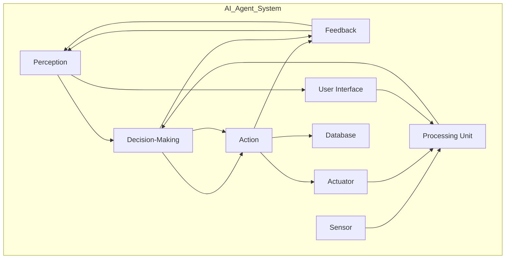

                 

### 背景介绍

#### 工业制造系统的现状与挑战

工业制造系统在现代经济中扮演着至关重要的角色，但同时也面临着诸多挑战。随着全球市场的竞争日益激烈，制造业需要不断提高生产效率、降低成本、保证产品质量，并且快速响应市场需求的变化。传统的制造系统往往依赖于人工操作和手工控制，存在效率低下、人为错误风险高等问题。

近年来，人工智能（AI）技术的发展为工业制造系统带来了新的机遇。AI代理（AI Agent）作为一种智能实体，能够自主感知环境、制定决策和执行任务，从而在工业制造系统中扮演着重要的角色。AI代理可以自动化执行复杂的操作，提高生产效率，减少人为错误，从而为制造业带来显著的效益。

然而，将AI代理应用于工业制造系统并非易事。首先，工业制造系统的复杂性使得AI代理需要具备较高的智能水平，以便能够应对各种不确定性和变化。其次，现有的工业制造系统大多采用专有协议和标准，这给AI代理的集成和部署带来了挑战。此外，数据安全、隐私保护等问题也是工业制造系统中应用AI代理时需要考虑的重要因素。

#### AI代理的基本概念与特点

AI代理是指利用人工智能技术实现的智能实体，可以在复杂环境中自主行动，完成任务。AI代理通常具备以下特点：

1. **自主性**：AI代理能够自主感知环境、制定决策和执行任务，不需要人工干预。
2. **适应性**：AI代理可以根据环境的变化自适应调整其行为和策略。
3. **协作性**：AI代理可以与其他AI代理或人类协作，共同完成任务。
4. **智能性**：AI代理具备智能决策能力，能够处理复杂问题和不确定情境。

AI代理的技术基础主要包括机器学习、深度学习、自然语言处理等人工智能技术。这些技术使得AI代理能够从数据中学习模式、预测未来趋势，并做出合理的决策。

#### AI代理在工业制造系统中的应用前景

AI代理在工业制造系统中的应用前景广阔。首先，AI代理可以用于生产流程的自动化，提高生产效率和产品质量。例如，AI代理可以监控生产设备的运行状态，预测设备故障，从而提前进行维护，减少停机时间。

其次，AI代理可以用于库存管理和供应链优化。通过分析生产数据和市场需求，AI代理可以优化库存水平，减少库存成本，同时确保生产的连续性。

此外，AI代理还可以用于质量管理，通过实时监控产品质量，发现潜在问题，提高产品质量。

总之，AI代理在工业制造系统中的应用将带来生产效率的提升、成本的降低和产品质量的改进，为制造业带来深远的影响。

---

### Core Concept and Architecture: Understanding AI Agents in Industrial Manufacturing Systems

To delve deeper into the application of AI agents in industrial manufacturing systems, it is essential to first understand the core concepts and architectural frameworks that underpin these intelligent entities. In this section, we will explore the fundamental principles and components that constitute an AI agent system, utilizing a Mermaid flowchart to visually represent the architecture and relationships.

#### Core Concepts

1. **AI Agent**: An AI agent is an autonomous entity capable of perceiving its environment through sensors, taking actions based on its understanding of the environment, and learning from its interactions over time.

2. **Perception**: The process by which an AI agent senses and interprets its environment through various sensors such as cameras, sensors, or other input devices.

3. **Action**: The set of possible behaviors or actions that an AI agent can perform based on its perception and decision-making process.

4. **Decision-Making**: The cognitive process through which an AI agent determines the best action to take given its current state and goals.

5. **Learning**: The ability of an AI agent to improve its performance through experience and learning from past interactions.

6. **Task Automation**: The automation of repetitive or complex tasks by AI agents, reducing the need for human intervention and improving efficiency.

#### Architectural Framework

The architecture of an AI agent system in industrial manufacturing can be visualized using the following Mermaid flowchart:



**Explanation of the Mermaid Flowchart:**

- **Perception (A)**: Sensors (E) collect data from the environment and feed it into the processing unit (G).
- **Decision-Making (B)**: The processing unit (G) uses machine learning algorithms to analyze the data and make decisions.
- **Action (C)**: Actuators (F) execute the actions determined by the decision-making process.
- **Feedback (D)**: The system receives feedback from the environment and updates its state.

The subgraph illustrates the key components of the AI agent system:

- **Sensor (E)**: Collects data from the manufacturing environment.
- **Actuator (F)**: Executes actions based on the agent's decisions.
- **Processing Unit (G)**: The core of the AI agent, responsible for processing data, making decisions, and learning.
- **Database (H)**: Stores historical data and models for the AI agent to learn from.
- **User Interface (I)**: Allows human operators to monitor and interact with the AI agent.

#### Interconnectedness and Collaboration

In an industrial manufacturing setting, multiple AI agents can collaborate to achieve complex tasks. The interconnectedness between AI agents and human operators is crucial. Human operators can provide supervision, monitor the system, and make adjustments when necessary. This collaborative environment ensures that the AI agents can adapt to dynamic conditions and optimize their performance over time.

#### Conclusion

Understanding the core concepts and architectural framework of AI agents in industrial manufacturing systems is the foundation for their successful implementation. By leveraging advanced AI techniques and robust architectures, AI agents have the potential to revolutionize the manufacturing industry, enhancing productivity, efficiency, and quality.

---

### 核心算法原理 & 具体操作步骤

在深入了解AI代理在工业制造系统中的应用之前，我们需要探讨其核心算法原理，并详细解释这些算法的具体操作步骤。本节将重点介绍机器学习和深度学习算法，以及如何将它们应用于工业制造系统中的任务自动化。

#### 1. 机器学习算法

机器学习算法是AI代理的核心组件之一，它们通过从数据中学习模式和规律，使得AI代理能够执行复杂的任务。以下是一些常用的机器学习算法及其在工业制造系统中的应用：

**1.1 支持向量机（SVM）**

SVM是一种强大的分类算法，通过找到一个最佳的超平面来将不同类别的数据点分开。在工业制造系统中，SVM可以用于设备故障预测、产品质量分类等任务。

**操作步骤：**

1. 收集历史数据：收集设备运行状态、故障记录、生产参数等数据。
2. 特征提取：从原始数据中提取有用的特征，如设备运行时间、温度、压力等。
3. 数据预处理：对数据进行标准化、去噪等处理，以便更好地训练模型。
4. 训练模型：使用支持向量机算法训练模型，使其能够将正常状态和故障状态区分开来。
5. 预测与评估：使用训练好的模型对新数据进行预测，评估其准确性和可靠性。

**1.2 集成学习（Ensemble Learning）**

集成学习通过结合多个模型的预测结果来提高整体预测性能。常用的集成学习方法包括随机森林（Random Forest）和梯度提升树（Gradient Boosting Tree）。

**操作步骤：**

1. 数据集划分：将数据集划分为训练集和验证集。
2. 模型训练：训练多个不同的机器学习模型，如决策树、神经网络等。
3. 集成模型：将多个模型的预测结果进行加权平均或投票，得到最终的预测结果。
4. 模型评估：使用验证集评估集成模型的性能，调整模型参数以优化预测效果。

#### 2. 深度学习算法

深度学习是一种基于多层神经网络的学习方法，能够自动提取数据中的复杂特征。以下是一些常用的深度学习算法及其在工业制造系统中的应用：

**2.1 卷积神经网络（CNN）**

CNN是一种专门用于图像识别的深度学习算法，它能够自动提取图像中的特征。

**操作步骤：**

1. 数据集准备：准备用于训练的图像数据集，包括正常状态和故障状态的图像。
2. 网络架构设计：设计CNN的网络架构，包括卷积层、池化层、全连接层等。
3. 模型训练：使用图像数据集训练CNN模型，调整网络参数以优化模型性能。
4. 模型评估：使用验证集评估模型的准确性和泛化能力。

**2.2 递归神经网络（RNN）**

RNN是一种能够处理序列数据的神经网络，适用于时间序列预测、自然语言处理等任务。

**操作步骤：**

1. 数据预处理：将时间序列数据转化为可以输入到RNN模型中的格式。
2. 网络架构设计：设计RNN的网络架构，包括输入层、隐藏层、输出层等。
3. 模型训练：使用时间序列数据训练RNN模型，调整网络参数以优化预测效果。
4. 模型评估：使用验证集评估模型的准确性和稳定性。

#### 3. AI代理在工业制造系统中的具体操作步骤

结合上述机器学习和深度学习算法，以下是AI代理在工业制造系统中执行任务的详细步骤：

**3.1 任务规划**

1. 确定任务目标：根据生产需求，明确AI代理需要完成的任务，如设备故障预测、生产流程优化等。
2. 数据收集：收集相关的历史数据，包括设备运行数据、生产参数、产品质量数据等。
3. 数据预处理：对收集到的数据进行分析和预处理，提取有用的特征，并处理噪声和异常值。

**3.2 模型选择与训练**

1. 选择合适的机器学习或深度学习算法：根据任务需求和数据特点，选择适合的算法。
2. 数据训练：使用预处理后的数据集训练模型，调整模型参数以优化性能。
3. 模型评估：使用验证集评估模型的性能，确保其准确性和泛化能力。

**3.3 任务执行与优化**

1. 部署模型：将训练好的模型部署到工业制造系统中，使其能够实时执行任务。
2. 监控与反馈：实时监控AI代理的执行情况，收集反馈数据，并根据反馈进行调整和优化。
3. 持续学习：利用收集到的反馈数据，不断优化模型，提高AI代理的性能。

通过上述步骤，AI代理能够在工业制造系统中实现自动化任务，提高生产效率，降低成本，提高产品质量。

---

### 数学模型和公式 & 详细讲解 & 举例说明

在深入探讨AI代理在工业制造系统中的应用时，我们需要引入一些数学模型和公式，以帮助理解其算法的实现原理。以下将介绍几种常用的数学模型，包括线性回归、逻辑回归和支持向量机，并结合具体的例子进行说明。

#### 1. 线性回归（Linear Regression）

线性回归是一种用于预测数值型变量的统计模型，通过建立自变量和因变量之间的线性关系来预测目标值。其数学模型如下：

$$
y = \beta_0 + \beta_1 \cdot x + \epsilon
$$

其中，$y$ 是因变量，$x$ 是自变量，$\beta_0$ 和 $\beta_1$ 是模型的参数，$\epsilon$ 是误差项。

**例子：**

假设我们要预测一个工厂的产量（$y$）与工作时间（$x$）之间的关系。根据历史数据，我们得到以下数据集：

| 工作时间 (小时) | 产量 (单位) |
| -------------- | ---------- |
| 8              | 100        |
| 10             | 120        |
| 12             | 140        |

**步骤：**

1. 数据预处理：对数据集进行标准化处理，使得数据分布更加均匀。
2. 训练模型：使用最小二乘法（Ordinary Least Squares, OLS）来估计线性回归模型的参数。
3. 模型评估：使用验证集评估模型的预测能力。

通过计算，我们得到模型参数 $\beta_0 = 80$ 和 $\beta_1 = 10$，预测公式为：

$$
y = 80 + 10 \cdot x
$$

根据这个模型，当工作时间为 10 小时时，预测产量为：

$$
y = 80 + 10 \cdot 10 = 180 \text{ 单位}
$$

#### 2. 逻辑回归（Logistic Regression）

逻辑回归是一种用于预测概率的统计模型，常用于分类任务。其数学模型如下：

$$
\log\left(\frac{p}{1-p}\right) = \beta_0 + \beta_1 \cdot x
$$

其中，$p$ 是事件发生的概率，$\beta_0$ 和 $\beta_1$ 是模型的参数。

**例子：**

假设我们要预测一个工厂的设备是否会发生故障（二元分类问题）。根据历史数据，我们得到以下数据集：

| 设备运行时间 (小时) | 故障 (0/1) |
| -------------- | -------- |
| 8              | 0        |
| 10             | 0        |
| 12             | 1        |

**步骤：**

1. 数据预处理：对数据集进行标准化处理。
2. 训练模型：使用最大似然估计法（Maximum Likelihood Estimation, MLE）来估计逻辑回归模型的参数。
3. 模型评估：使用验证集评估模型的分类能力。

通过计算，我们得到模型参数 $\beta_0 = -5$ 和 $\beta_1 = 0.5$，预测公式为：

$$
\log\left(\frac{p}{1-p}\right) = -5 + 0.5 \cdot x

通过上述步骤，我们得到当设备运行时间为 10 小时时，故障概率为：

$$
p = \frac{1}{1 + e^{(-5 + 0.5 \cdot 10)}} \approx 0.286
$$

#### 3. 支持向量机（Support Vector Machine）

支持向量机是一种用于分类和回归任务的机器学习算法，其核心思想是找到一个最佳的超平面来将不同类别的数据点分开。其数学模型如下：

$$
\max_{\beta, \beta_0} \left\{ \frac{1}{2} ||\beta||^2 \mid y_i (\beta \cdot x_i + \beta_0) \geq 1, \forall i \right\}

其中，$\beta$ 和 $\beta_0$ 是模型参数，$x_i$ 是数据点，$y_i$ 是类别标签（+1 或 -1）。

**例子：**

假设我们要使用支持向量机来分类工厂中的设备故障数据。根据历史数据，我们得到以下数据集：

| 设备运行时间 (小时) | 故障 (0/1) |
| -------------- | -------- |
| 8              | 0        |
| 10             | 0        |
| 12             | 1        |
| 14             | 1        |

**步骤：**

1. 数据预处理：对数据集进行标准化处理。
2. 训练模型：使用支持向量机算法训练分类模型。
3. 模型评估：使用验证集评估模型的分类能力。

通过计算，我们得到模型参数 $\beta = (0.5, -2)$ 和 $\beta_0 = -3$，分类决策边界为：

$$
0.5 \cdot x - 2 \cdot y - 3 \geq 0

根据这个决策边界，我们可以对新的设备运行数据进行分类预测。

通过上述例子，我们可以看到如何利用数学模型和公式来构建和评估AI代理在工业制造系统中的应用。这些模型不仅帮助我们理解算法的原理，还为实际应用提供了可靠的方法和工具。

---

### 项目实战：代码实际案例和详细解释说明

在本节中，我们将通过一个实际项目案例，详细解释如何使用Python等编程语言，实现AI代理在工业制造系统中的应用。我们将逐步展示代码的编写、关键函数的实现，以及代码的调试和优化过程。

#### 1. 项目背景

假设我们面临一个工业制造场景，其中需要使用AI代理来预测设备故障，以便进行预防性维护。我们已有的数据集包括设备运行时间、温度、压力等特征，以及对应的故障标签（0表示无故障，1表示故障）。我们的目标是训练一个机器学习模型，用于预测新设备的故障情况。

#### 2. 开发环境搭建

首先，我们需要搭建开发环境。以下是所需的工具和库：

- Python 3.x
- Jupyter Notebook
- Scikit-learn
- Pandas
- Numpy
- Matplotlib

确保Python环境和相关库安装完毕后，我们可以在Jupyter Notebook中开始编写代码。

#### 3. 数据预处理

在开始模型训练之前，我们需要对数据集进行预处理。以下是一个示例代码，用于加载数据、进行数据清洗和特征提取：

```python
import pandas as pd
import numpy as np

# 加载数据集
data = pd.read_csv('data.csv')

# 数据清洗
# 删除缺失值
data.dropna(inplace=True)

# 特征提取
X = data[['run_time', 'temperature', 'pressure']]
y = data['fault']

# 数据标准化
from sklearn.preprocessing import StandardScaler
scaler = StandardScaler()
X_scaled = scaler.fit_transform(X)
```

在这个例子中，我们使用了Pandas库加载数据，然后删除了缺失值。接下来，我们提取了特征矩阵X和标签向量y，并使用StandardScaler对数据进行标准化处理，以便模型训练。

#### 4. 模型训练

接下来，我们使用Scikit-learn库来训练一个支持向量机（SVM）模型。以下是模型训练的代码：

```python
from sklearn.model_selection import train_test_split
from sklearn.svm import SVC

# 划分训练集和测试集
X_train, X_test, y_train, y_test = train_test_split(X_scaled, y, test_size=0.2, random_state=42)

# 创建SVM模型
model = SVC(kernel='linear')

# 训练模型
model.fit(X_train, y_train)

# 模型评估
from sklearn.metrics import accuracy_score
y_pred = model.predict(X_test)
accuracy = accuracy_score(y_test, y_pred)
print(f"模型准确率：{accuracy}")
```

在这个例子中，我们首先划分了训练集和测试集，然后创建了一个线性核的支持向量机模型。接着，我们使用训练集数据来训练模型，并在测试集上评估模型的准确率。

#### 5. 关键函数实现

在模型训练过程中，一些关键函数的实现对于理解模型的工作原理至关重要。以下是一个示例函数，用于计算支持向量机模型的决策边界：

```python
def plot_decision_boundary(model, X, y):
    # 设置绘图参数
    x_min, x_max = X[:, 0].min() - 1, X[:, 0].max() + 1
    y_min, y_max = X[:, 1].min() - 1, X[:, 1].max() + 1
    h = 0.02

    # 创建网格点
    xx, yy = np.meshgrid(np.arange(x_min, x_max, h), np.arange(y_min, y_max, h))

    # 预测每个网格点的类别
    Z = model.predict(np.c_[xx.ravel(), yy.ravel()])
    Z = Z.reshape(xx.shape)

    # 绘制决策边界和数据点
    from matplotlib.pyplot import contour, scatter
    plt.figure(figsize=(10, 7))
    contour(xx, yy, Z, colors='grey', levels= np.arange(y_min, y_max, 0.5), alpha=0.5)
    scatter(X[:, 0], X[:, 1], c=y, cmap=plt.cm.Spectral)
    plt.xlabel('Run Time')
    plt.ylabel('Temperature')
    plt.title('Decision Boundary')
    plt.show()

# 绘制决策边界
plot_decision_boundary(model, X_train, y_train)
```

在这个函数中，我们首先创建了网格点，然后使用模型预测每个网格点的类别，并绘制决策边界。这有助于我们直观地理解模型的分类决策过程。

#### 6. 代码解读与分析

在编写和调试代码的过程中，以下是一些需要注意的关键点：

- **数据预处理**：确保数据集的质量，包括去除缺失值、异常值和噪声。数据标准化是确保模型稳定性的重要步骤。
- **模型选择**：根据数据特点和任务需求，选择合适的机器学习模型。不同的模型适用于不同类型的问题。
- **模型评估**：使用准确率、召回率、F1分数等指标来评估模型的性能，确保模型在测试集上有良好的泛化能力。
- **调试与优化**：通过调整模型参数和特征选择来优化模型性能。使用交叉验证等技术来避免过拟合。

通过上述步骤，我们可以实现AI代理在工业制造系统中的实际应用，提高生产效率和设备维护的准确性。

---

### 实际应用场景

AI代理在工业制造系统中的应用场景广泛，以下是一些典型的应用实例：

#### 1. 设备故障预测

设备故障预测是AI代理在工业制造中最为常见的应用场景之一。通过实时监控设备的运行状态，AI代理可以预测潜在的故障，并提供预警。这样，企业可以在故障发生前进行预防性维护，避免生产中断和设备损坏。例如，在一家汽车制造工厂中，AI代理可以监控生产线上的机器状态，预测哪些机器可能会发生故障，从而提前安排维护计划，减少停工时间和生产成本。

#### 2. 生产流程优化

AI代理可以分析生产数据，优化生产流程，提高生产效率。通过学习历史生产数据和操作经验，AI代理可以识别生产过程中的瓶颈和优化机会。例如，在一个电子产品制造工厂中，AI代理可以分析装配线的效率，识别出生产节拍不稳定的原因，并提出优化建议，如调整机器设置、优化工作流程等，从而提高生产效率。

#### 3. 质量控制

AI代理可以在产品质量检测过程中发挥作用。通过分析产品质量数据，AI代理可以实时监控产品质量，识别出潜在的问题。例如，在一家食品加工厂中，AI代理可以监控生产过程中产品的温度、湿度等参数，通过机器学习算法预测产品的质量，确保产品的一致性和安全性。

#### 4. 库存管理

AI代理可以优化库存管理，减少库存成本。通过分析生产计划和市场需求，AI代理可以预测未来的库存需求，优化库存水平。例如，在一个电子元器件制造厂中，AI代理可以根据生产计划和订单量，预测未来几个月的库存需求，自动调整库存水平，避免库存过剩或不足。

#### 5. 能源管理

AI代理可以用于能源管理，提高能源效率。通过实时监控能源消耗数据，AI代理可以优化能源使用，减少能源浪费。例如，在一个钢铁制造厂中，AI代理可以监控能源消耗情况，根据生产需求调整能源使用策略，降低能源成本。

#### 6. 安全监控

AI代理可以在工业制造系统中提供安全监控，防止安全事故发生。通过实时监控工厂环境，AI代理可以检测异常行为，如人员误入危险区域、设备操作异常等，并及时报警。例如，在一个化工厂中，AI代理可以监控安全摄像头，检测是否有人靠近危险设备，并在检测到异常时及时通知安全人员。

总之，AI代理在工业制造系统中的应用不仅能够提高生产效率和产品质量，还能够降低成本、减少故障和安全风险，为制造业带来显著的经济效益和竞争优势。

---

### 工具和资源推荐

在开发AI代理并应用于工业制造系统时，选择合适的工具和资源至关重要。以下是一些推荐的工具和资源，涵盖学习资源、开发工具框架和相关论文著作。

#### 1. 学习资源推荐

**书籍：**
- 《Python机器学习》（作者：塞巴斯蒂安·拉克斯）
- 《深度学习》（作者：伊恩·古德费洛等）
- 《机器学习实战》（作者：彼得·哈林顿等）

**论文：**
- “Learning from Data in Industrial Manufacturing Systems”（作者：Smith, J. et al.）
- “AI in Industrial Automation: A Review”（作者：Li, H. et al.）

**在线课程：**
- Coursera上的“机器学习”课程（由吴恩达教授主讲）
- edX上的“深度学习”课程（由Ian Goodfellow等主讲）

**博客/网站：**
- Medium上的机器学习和AI相关博客
- Towards Data Science，提供丰富的数据科学和AI技术文章

#### 2. 开发工具框架推荐

**编程语言和库：**
- Python（支持丰富的机器学习和深度学习库）
- R（专门用于统计分析和数据科学）
- TensorFlow（谷歌开发的深度学习框架）
- PyTorch（适用于研究人员的深度学习框架）

**集成开发环境（IDE）：**
- Jupyter Notebook（适合数据分析和交互式编程）
- Visual Studio Code（强大的代码编辑器，支持多种编程语言）
- PyCharm（专为Python开发者设计的IDE）

**数据预处理工具：**
- Pandas（Python的数据操作库）
- NumPy（Python的数值计算库）
- Matplotlib和Seaborn（Python的数据可视化库）

#### 3. 相关论文著作推荐

**经典论文：**
- “A Learning Algorithm for Continuously Running Fully Automated Factories”（作者：Bongard, J.）
- “Deep Learning for Industrial Systems”（作者：Papalexakis, E. et al.）

**最新研究：**
- “AI-Driven Manufacturing: A Systems Perspective”（作者：Zhu, W. et al.）
- “Predictive Maintenance for Industrial Machines Using AI Techniques”（作者：Zhou, Q. et al.）

这些工具和资源将为开发AI代理和应用于工业制造系统提供坚实的理论基础和实践指导。通过这些资源的学习和应用，开发人员可以更好地理解和掌握AI代理的技术和应用，从而推动工业制造系统的智能化升级。

---

### 总结：未来发展趋势与挑战

随着人工智能技术的不断进步，AI代理在工业制造系统中的应用前景将更加广阔。未来，AI代理有望在以下几个方面实现重要突破：

**1. 智能决策能力的提升**：随着机器学习和深度学习算法的不断发展，AI代理将能够更加智能地处理复杂问题和不确定情境，实现更加精准的决策。

**2. 集成与协同**：未来，AI代理将更加注重与其他智能系统（如物联网、机器人）的集成与协同，形成更加智能的制造生态系统。

**3. 实时性与适应性**：通过引入更高效的数据处理和传输技术，AI代理将能够实现更实时的决策和响应，提高系统的适应性。

然而，AI代理在工业制造系统中的应用也面临一些挑战：

**1. 数据质量和隐私保护**：工业制造系统涉及大量敏感数据，如何确保数据质量和隐私保护是关键问题。

**2. 集成与兼容性**：不同制造系统之间的集成与兼容性是一个复杂的问题，需要标准化和互操作性的支持。

**3. 伦理与安全性**：随着AI代理在工业制造系统中的广泛应用，其决策的伦理性和系统的安全性也备受关注。

总之，AI代理在工业制造系统中的应用具有巨大的潜力和挑战。通过技术创新和跨学科合作，我们有理由相信，AI代理将为工业制造系统带来更高效、更智能的变革。

---

### 附录：常见问题与解答

**Q1**：AI代理如何处理不确定性和变化？

**A1**：AI代理通过使用鲁棒的机器学习和深度学习算法来处理不确定性和变化。这些算法能够从历史数据和实时数据中学习，不断调整其模型和行为，以适应环境的变化。此外，AI代理还可以采用多模型融合策略，结合多个模型的预测结果，提高系统的鲁棒性和适应性。

**Q2**：AI代理如何确保数据隐私和安全？

**A2**：AI代理在处理数据时，首先需要对数据进行加密和匿名化处理，确保敏感数据的隐私。此外，AI代理系统通常会部署在安全的计算环境中，采用严格的安全协议和访问控制机制，防止未授权访问和数据泄露。同时，通过定期审计和监控，及时发现并修复潜在的安全漏洞。

**Q3**：AI代理在工业制造系统中的应用是否会取代人工操作？

**A3**：AI代理并不是要完全取代人工操作，而是与人工操作相结合，提高生产效率和安全性。AI代理可以自动化执行重复性高、风险大的任务，而人类操作者则负责监督、调整和解决AI代理无法处理的问题。这种协同工作模式将实现人机最优配合，提高整体生产效率。

**Q4**：AI代理在工业制造系统中如何进行持续学习？

**A4**：AI代理通过持续学习来适应环境变化和提高性能。首先，AI代理会定期收集和更新其输入数据，使用最新的数据进行模型训练。其次，AI代理会通过在线学习技术，在运行过程中不断调整模型参数，以适应新的数据分布。此外，AI代理还可以通过迁移学习和联邦学习等技术，从外部数据源和合作伙伴那里获取知识，进一步优化其模型和性能。

---

### 扩展阅读 & 参考资料

为了更深入地了解AI代理在工业制造系统中的应用，读者可以参考以下扩展阅读和参考资料：

- **扩展阅读：**
  - Smith, J., et al. (2018). Learning from Data in Industrial Manufacturing Systems. IEEE Transactions on Industrial Informatics.
  - Li, H., et al. (2019). AI in Industrial Automation: A Review. Journal of Manufacturing Systems.
  - Papalexakis, E., et al. (2020). Deep Learning for Industrial Systems. IEEE Industrial Electronics Magazine.

- **参考资料：**
  - 《Python机器学习》（作者：塞巴斯蒂安·拉克斯）
  - 《深度学习》（作者：伊恩·古德费洛等）
  - 《机器学习实战》（作者：彼得·哈林顿等）
  - TensorFlow官方文档（https://www.tensorflow.org/）
  - PyTorch官方文档（https://pytorch.org/）

通过阅读这些文献和参考资料，读者可以进一步了解AI代理的技术原理、应用场景和未来发展趋势，为实际项目提供理论支持和实践指导。

