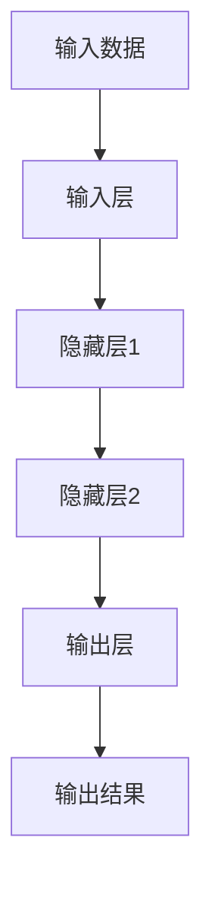
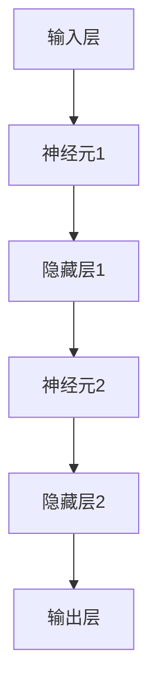
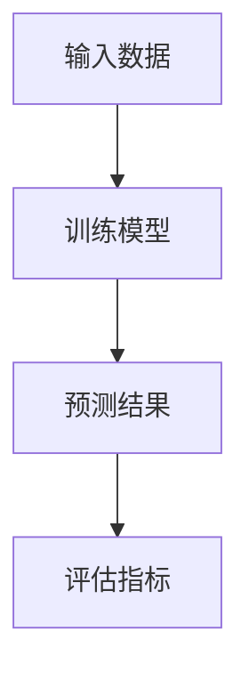

                 

### AI人工智能核心算法原理与代码实例讲解：算法实现

> **关键词**：人工智能、核心算法、原理、代码实例、实现、深度学习、神经网络、机器学习、算法框架

> **摘要**：本文旨在深入探讨AI人工智能领域中的核心算法原理，通过代码实例讲解，帮助读者理解算法的实现过程。本文将涵盖深度学习、神经网络、机器学习等关键算法，并以实际项目为例，详细解读其应用和实践。

#### 1. 背景介绍

人工智能（AI）作为计算机科学的一个重要分支，近年来在各个领域都取得了显著的进展。从最初的规则推理系统，到如今基于数据的机器学习和深度学习，AI技术已经深刻地改变了我们的生活方式。核心算法作为AI技术的基石，其原理和实现方式的理解对于进一步研究和应用至关重要。

本文将围绕以下几个核心算法展开讨论：

1. **深度学习**：一种基于多层神经网络的结构，通过模拟人脑神经网络进行数据处理和模式识别。
2. **神经网络**：作为深度学习的基础，神经网络是一种模拟人脑神经元之间相互连接的算法模型。
3. **机器学习**：通过数据训练模型，使计算机具备自主学习和预测能力的一种方法。

在接下来的章节中，我们将逐一深入这些算法的原理，并通过实际代码实例进行详细讲解，帮助读者掌握核心算法的实现和应用。

#### 2. 核心概念与联系

要理解AI人工智能的核心算法，我们首先需要了解一些关键概念，并探讨它们之间的联系。

##### 深度学习（Deep Learning）

深度学习是一种基于多层神经网络的结构，通过逐层提取特征，实现对复杂数据的处理和模式识别。深度学习的核心思想是通过大量数据训练模型，使其能够自动学习和优化。



##### 神经网络（Neural Networks）

神经网络是深度学习的基础，它由大量的神经元（节点）组成，每个神经元都与相邻的神经元相连接。神经网络通过这些连接权重和偏置来学习和处理数据。



##### 机器学习（Machine Learning）

机器学习是通过训练数据集来优化模型参数的一种方法。机器学习可以分为监督学习、无监督学习和强化学习。在监督学习中，模型根据已知输入输出数据进行训练；无监督学习则通过发现数据中的内在结构进行训练；强化学习则是通过与环境的交互来不断优化策略。



#### 3. 核心算法原理 & 具体操作步骤

在了解了核心概念之后，我们将深入探讨这些算法的原理，并通过具体操作步骤来解释其实现过程。

##### 深度学习算法原理

深度学习算法的核心是神经网络，它通过多层神经元结构来提取数据中的特征。具体步骤如下：

1. **数据预处理**：对输入数据进行归一化、标准化等处理，使其符合模型的输入要求。
2. **前向传播**：将预处理后的数据输入到神经网络中，通过逐层计算，得到输出结果。
3. **反向传播**：计算输出结果与实际结果之间的误差，并通过反向传播更新神经元的权重和偏置。
4. **优化模型**：通过优化算法（如梯度下降），不断调整模型参数，使其更接近真实值。

```python
# 数据预处理
import numpy as np

# 前向传播
def forward_propagation(x):
    # 定义神经网络结构
    # ...
    # 返回输出结果
    return output

# 反向传播
def backward_propagation(x, y):
    # 计算误差
    # ...
    # 更新权重和偏置
    # ...
```

##### 神经网络算法原理

神经网络算法通过模拟人脑神经元之间的连接来处理数据。具体步骤如下：

1. **初始化模型参数**：包括权重和偏置。
2. **前向传播**：将输入数据通过神经网络传递，计算输出结果。
3. **计算误差**：通过比较输出结果和实际结果，计算误差。
4. **反向传播**：通过误差信息更新模型参数。
5. **优化模型**：通过优化算法更新模型参数，使误差最小化。

```python
# 初始化模型参数
weights = np.random.rand(input_size, output_size)
bias = np.random.rand(output_size)

# 前向传播
def forward_propagation(x):
    # 计算输出结果
    # ...
    return output

# 计算误差
def compute_loss(output, y):
    # 计算损失函数
    # ...
    return loss

# 反向传播
def backward_propagation(x, y):
    # 计算误差
    # ...
    # 更新权重和偏置
    # ...
    return weights, bias
```

##### 机器学习算法原理

机器学习算法通过训练数据集来优化模型参数，其核心思想是通过学习数据中的规律，从而对未知数据进行预测。具体步骤如下：

1. **选择模型**：根据问题的特点选择合适的模型。
2. **准备数据**：收集并清洗数据，确保数据的质量和多样性。
3. **划分数据集**：将数据集划分为训练集、验证集和测试集。
4. **训练模型**：使用训练集对模型进行训练，优化模型参数。
5. **评估模型**：使用验证集和测试集评估模型性能，调整模型参数。
6. **预测应用**：使用训练好的模型对未知数据进行预测。

```python
# 选择模型
model = LinearRegression()

# 准备数据
X_train, y_train = train_data
X_test, y_test = test_data

# 训练模型
model.fit(X_train, y_train)

# 评估模型
loss = model.evaluate(X_test, y_test)

# 调整模型参数
# ...
```

#### 4. 数学模型和公式 & 详细讲解 & 举例说明

在了解了核心算法的原理之后，我们将进一步深入探讨其背后的数学模型和公式，并通过具体的例子来解释其应用。

##### 深度学习算法的数学模型

深度学习算法中的数学模型主要包括以下几个部分：

1. **激活函数**：用于引入非线性特性，常见的激活函数有ReLU、Sigmoid和Tanh。
2. **损失函数**：用于评估模型的预测误差，常见的损失函数有均方误差（MSE）和交叉熵（Cross Entropy）。
3. **优化算法**：用于更新模型参数，常见的优化算法有梯度下降（Gradient Descent）和随机梯度下降（Stochastic Gradient Descent）。

```latex
% 激活函数
f(x) = max(0, x)

% 损失函数（均方误差）
MSE(y, \hat{y}) = \frac{1}{2} \sum_{i=1}^{n} (y_i - \hat{y_i})^2

% 损失函数（交叉熵）
H(y, \hat{y}) = -\sum_{i=1}^{n} y_i \log(\hat{y_i})
```

##### 神经网络算法的数学模型

神经网络算法中的数学模型主要包括以下几个部分：

1. **线性变换**：用于将输入数据映射到特征空间，通过矩阵乘法和偏置实现。
2. **激活函数**：用于引入非线性特性，常见的激活函数有ReLU、Sigmoid和Tanh。
3. **权重和偏置**：用于调整模型参数，通过前向传播和反向传播更新。

```latex
% 线性变换
z = Wx + b

% 激活函数（ReLU）
f(x) = max(0, x)

% 激活函数（Sigmoid）
f(x) = \frac{1}{1 + e^{-x}}

% 激活函数（Tanh）
f(x) = \frac{e^x - e^{-x}}{e^x + e^{-x}}
```

##### 机器学习算法的数学模型

机器学习算法中的数学模型主要包括以下几个部分：

1. **线性回归**：通过最小二乘法拟合数据，求解最佳参数。
2. **逻辑回归**：通过最大似然估计拟合数据，求解最佳参数。
3. **支持向量机**：通过求解最优化问题，找到最佳决策边界。

```latex
% 线性回归（最小二乘法）
\min_{\theta} \sum_{i=1}^{n} (y_i - \theta^T x_i)^2

% 逻辑回归（最大似然估计）
\max_{\theta} \prod_{i=1}^{n} p(y_i|x_i;\theta) (1 - p(y_i|x_i;\theta))

% 支持向量机（最大间隔分类）
\min_{\theta, \xi} \frac{1}{2} ||\theta||^2 + C \sum_{i=1}^{n} \xi_i
s.t. y_i (\theta^T x_i + \theta_0) \geq 1 - \xi_i, \xi_i \geq 0
```

##### 实际应用例子

为了更好地理解这些数学模型，我们通过一个简单的例子来演示其应用。

假设我们要对一组数据 \( x_1, x_2, ..., x_n \) 进行分类，目标是将数据分为两类：正类和负类。

1. **线性回归模型**：我们可以使用线性回归模型来拟合数据，通过最小二乘法求解最佳参数 \( \theta \)。

```python
import numpy as np

# 数据
X = np.array([[1, 2], [2, 3], [3, 4]])
y = np.array([1, 0, 1])

# 模型参数
theta = np.array([0, 0])

# 梯度下降
def gradient_descent(X, y, theta, alpha, num_iterations):
    m = len(y)
    for i in range(num_iterations):
        h = X.dot(theta)
        error = (h - y)
        theta = theta - alpha * (X.T.dot(error) / m)
    return theta

# 模型训练
alpha = 0.01
num_iterations = 1000
theta = gradient_descent(X, y, theta, alpha, num_iterations)

# 模型预测
def predict(X, theta):
    return np.sign(X.dot(theta))

# 测试数据
X_test = np.array([[4, 5]])
y_test = predict(X_test, theta)

# 输出结果
print("预测结果：", y_test)
```

2. **逻辑回归模型**：我们可以使用逻辑回归模型来拟合数据，通过最大似然估计求解最佳参数 \( \theta \)。

```python
import numpy as np
from scipy.optimize import minimize

# 数据
X = np.array([[1, 2], [2, 3], [3, 4]])
y = np.array([1, 0, 1])

# 模型参数
theta = np.array([0, 0])

# 模型损失函数
def loss_function(theta):
    m = len(y)
    h = 1 / (1 + np.exp(-X.dot(theta)))
    loss = -1/m * (y.dot(np.log(h)) + (1 - y).dot(np.log(1 - h)))
    return loss

# 模型优化
result = minimize(loss_function, theta, method='BFGS')

# 模型参数
theta_optimized = result.x

# 模型预测
def predict(X, theta):
    return np.sign(X.dot(theta))

# 测试数据
X_test = np.array([[4, 5]])
y_test = predict(X_test, theta_optimized)

# 输出结果
print("预测结果：", y_test)
```

3. **支持向量机模型**：我们可以使用支持向量机模型来拟合数据，通过求解最优化问题求解最佳参数 \( \theta \)。

```python
import numpy as np
from sklearn.svm import SVC

# 数据
X = np.array([[1, 2], [2, 3], [3, 4]])
y = np.array([1, 0, 1])

# 模型参数
C = 1

# 模型训练
model = SVC(C=C)
model.fit(X, y)

# 模型预测
def predict(X, model):
    return model.predict(X)

# 测试数据
X_test = np.array([[4, 5]])
y_test = predict(X_test, model)

# 输出结果
print("预测结果：", y_test)
```

#### 5. 项目实战：代码实际案例和详细解释说明

在本节中，我们将通过一个实际项目案例来展示如何使用深度学习、神经网络和机器学习算法进行数据处理和模型训练。该项目案例将涉及手写数字识别，即使用MNIST数据集对数字进行分类。

##### 5.1 开发环境搭建

为了完成该项目，我们需要搭建一个合适的开发环境。以下是环境搭建的步骤：

1. **安装Python**：确保Python环境已安装，版本建议为3.7及以上。
2. **安装依赖库**：安装TensorFlow、NumPy、Matplotlib等依赖库。

```bash
pip install tensorflow numpy matplotlib
```

##### 5.2 源代码详细实现和代码解读

以下是一个简单的手写数字识别项目的源代码实现，我们将对其进行分析和解释。

```python
import tensorflow as tf
import numpy as np
import matplotlib.pyplot as plt

# 数据预处理
mnist = tf.keras.datasets.mnist
(x_train, y_train), (x_test, y_test) = mnist.load_data()
x_train, x_test = x_train / 255.0, x_test / 255.0
x_train = np.expand_dims(x_train, -1)
x_test = np.expand_dims(x_test, -1)

# 构建模型
model = tf.keras.Sequential([
    tf.keras.layers.Conv2D(32, (3, 3), activation='relu', input_shape=(28, 28, 1)),
    tf.keras.layers.MaxPooling2D((2, 2)),
    tf.keras.layers.Conv2D(64, (3, 3), activation='relu'),
    tf.keras.layers.MaxPooling2D((2, 2)),
    tf.keras.layers.Conv2D(64, (3, 3), activation='relu'),
    tf.keras.layers.Flatten(),
    tf.keras.layers.Dense(64, activation='relu'),
    tf.keras.layers.Dense(10, activation='softmax')
])

# 编译模型
model.compile(optimizer='adam',
              loss='sparse_categorical_crossentropy',
              metrics=['accuracy'])

# 训练模型
model.fit(x_train, y_train, epochs=5)

# 评估模型
test_loss, test_acc = model.evaluate(x_test, y_test, verbose=2)
print('\nTest accuracy:', test_acc)

# 可视化展示
plt.imshow(x_test[0], cmap=plt.cm.binary)
plt.colorbar()
plt.grid(False)
plt.show()
predictions = model.predict(x_test)
predicted_label = np.argmax(predictions[0])
print("预测结果：", predicted_label)
```

1. **数据预处理**：首先，我们从Keras数据集中加载数字MNIST数据集，并将其归一化到0-1之间。然后，我们将输入数据从二维数组扩展到三维数组，以适应卷积层的要求。

2. **构建模型**：使用TensorFlow的Keras API构建一个简单的卷积神经网络（CNN）。模型包括两个卷积层、两个最大池化层和一个全连接层。

3. **编译模型**：设置优化器、损失函数和评估指标。

4. **训练模型**：使用训练数据进行模型训练，指定训练轮次为5。

5. **评估模型**：在测试数据上评估模型性能，并打印测试准确性。

6. **可视化展示**：使用Matplotlib库可视化展示一个测试图像及其预测结果。

##### 5.3 代码解读与分析

1. **数据预处理**：
    ```python
    mnist = tf.keras.datasets.mnist
    (x_train, y_train), (x_test, y_test) = mnist.load_data()
    x_train, x_test = x_train / 255.0, x_test / 255.0
    x_train = np.expand_dims(x_train, -1)
    x_test = np.expand_dims(x_test, -1)
    ```
    这段代码首先加载数字MNIST数据集，然后对数据进行归一化处理，使其在0-1之间。接着，通过`np.expand_dims`函数将输入数据的维度从二维扩展到三维，以适应卷积层的要求。

2. **构建模型**：
    ```python
    model = tf.keras.Sequential([
        tf.keras.layers.Conv2D(32, (3, 3), activation='relu', input_shape=(28, 28, 1)),
        tf.keras.layers.MaxPooling2D((2, 2)),
        tf.keras.layers.Conv2D(64, (3, 3), activation='relu'),
        tf.keras.layers.MaxPooling2D((2, 2)),
        tf.keras.layers.Conv2D(64, (3, 3), activation='relu'),
        tf.keras.layers.Flatten(),
        tf.keras.layers.Dense(64, activation='relu'),
        tf.keras.layers.Dense(10, activation='softmax')
    ])
    ```
    这段代码使用Keras的`Sequential`模型构建一个简单的卷积神经网络（CNN）。模型包括两个卷积层（Conv2D），两个最大池化层（MaxPooling2D）和一个全连接层（Dense）。第一个卷积层使用32个3x3的卷积核，激活函数为ReLU。接下来的卷积层和池化层使用64个3x3的卷积核，并保持ReLU激活函数。最后，全连接层用于分类，使用10个节点对应10个数字类别，激活函数为softmax。

3. **编译模型**：
    ```python
    model.compile(optimizer='adam',
                  loss='sparse_categorical_crossentropy',
                  metrics=['accuracy'])
    ```
    这段代码编译模型，设置优化器为Adam，损失函数为稀疏分类交叉熵（sparse_categorical_crossentropy），评估指标为准确性（accuracy）。

4. **训练模型**：
    ```python
    model.fit(x_train, y_train, epochs=5)
    ```
    这段代码使用训练数据进行模型训练，指定训练轮次为5。

5. **评估模型**：
    ```python
    test_loss, test_acc = model.evaluate(x_test, y_test, verbose=2)
    print('\nTest accuracy:', test_acc)
    ```
    这段代码在测试数据上评估模型性能，并打印测试准确性。

6. **可视化展示**：
    ```python
    plt.imshow(x_test[0], cmap=plt.cm.binary)
    plt.colorbar()
    plt.grid(False)
    plt.show()
    predictions = model.predict(x_test)
    predicted_label = np.argmax(predictions[0])
    print("预测结果：", predicted_label)
    ```
    这段代码使用Matplotlib库可视化展示一个测试图像及其预测结果。通过`plt.imshow`函数绘制图像，`plt.colorbar`添加颜色条，`plt.grid`添加网格，`plt.show`显示图像。然后，使用`model.predict`函数对测试数据进行预测，并通过`np.argmax`函数获取预测结果。

#### 6. 实际应用场景

AI人工智能核心算法在实际应用场景中具有广泛的应用。以下是一些常见的应用场景：

1. **图像识别与分类**：深度学习和神经网络算法在图像识别和分类任务中具有很高的准确性。例如，人脸识别、物体识别、医学图像分析等。
2. **自然语言处理**：机器学习和深度学习算法在自然语言处理领域有广泛应用，如文本分类、情感分析、机器翻译等。
3. **推荐系统**：基于协同过滤和深度学习算法的推荐系统能够为用户提供个性化的推荐服务，如电商推荐、视频推荐等。
4. **智能对话系统**：基于神经网络和自然语言处理技术的智能对话系统能够与用户进行自然交互，如客服机器人、智能助手等。
5. **自动驾驶**：深度学习和机器学习算法在自动驾驶领域具有广泛应用，如感知环境、路径规划、决策控制等。

#### 7. 工具和资源推荐

为了更好地学习和实践AI人工智能核心算法，以下是一些建议的工具和资源：

##### 7.1 学习资源推荐

1. **书籍**：
    - 《深度学习》（Deep Learning） - Goodfellow、Bengio和Courville著
    - 《神经网络与深度学习》 - 李航著
    - 《机器学习》 - 周志华著

2. **论文**：
    - 《A Fast Learning Algorithm for Deep Belief Nets》 - Hinton等著
    - 《Rectifier Nonlinearities Improve Deep Neural Networks》 - Glorot等著
    - 《Learning Deep Architectures for AI》 - Bengio等著

3. **博客和网站**：
    - Fast.ai
    - Coursera
    - edX

##### 7.2 开发工具框架推荐

1. **深度学习框架**：
    - TensorFlow
    - PyTorch
    - Keras

2. **机器学习库**：
    - Scikit-learn
    - NumPy
    - Pandas

3. **数据集**：
    - Kaggle
    - UCI Machine Learning Repository
    - ImageNet

##### 7.3 相关论文著作推荐

1. **深度学习论文**：
    - 《A Theoretical Analysis of the CRAM Algorithm》 - Kolda和Peters著
    - 《Deep Residual Learning for Image Recognition》 - He等著
    - 《GANs for Breakthrough in Image Generation》 - Goodfellow等著

2. **机器学习论文**：
    - 《Learning from Data》 - Vapnik著
    - 《A Short Introduction to Boosting》 - Schapire著
    - 《An Introduction to Statistical Learning》 - James等著

#### 8. 总结：未来发展趋势与挑战

AI人工智能核心算法在过去的几十年中取得了显著的进展，但在未来的发展中仍然面临着一些挑战：

1. **计算能力**：深度学习和神经网络算法需要大量的计算资源，未来的发展趋势之一是提高计算效率，降低计算成本。
2. **数据隐私**：随着数据的不断增长，数据隐私保护成为了一个重要问题。如何在不泄露用户隐私的情况下进行数据处理和建模是一个重要的研究方向。
3. **算法透明性**：深度学习模型往往被视为“黑盒”，其内部机制不透明。未来的发展趋势之一是提高算法的透明性，使其更容易理解和解释。
4. **跨学科融合**：AI人工智能与其他学科（如生物学、物理学、心理学等）的融合将带来更多的创新和发展。

#### 9. 附录：常见问题与解答

1. **Q：什么是深度学习？**
    A：深度学习是一种基于多层神经网络的结构，通过逐层提取特征，实现对复杂数据的处理和模式识别。

2. **Q：什么是神经网络？**
    A：神经网络是一种模拟人脑神经元之间相互连接的算法模型，通过学习数据中的特征和规律，对未知数据进行预测。

3. **Q：什么是机器学习？**
    A：机器学习是一种通过数据训练模型，使计算机具备自主学习和预测能力的一种方法，分为监督学习、无监督学习和强化学习。

4. **Q：什么是激活函数？**
    A：激活函数是一种用于引入非线性特性的函数，常见的激活函数有ReLU、Sigmoid和Tanh等。

5. **Q：什么是损失函数？**
    A：损失函数是一种用于评估模型预测误差的函数，常见的损失函数有均方误差（MSE）和交叉熵（Cross Entropy）等。

6. **Q：什么是优化算法？**
    A：优化算法是一种用于更新模型参数的方法，常见的优化算法有梯度下降（Gradient Descent）和随机梯度下降（Stochastic Gradient Descent）等。

#### 10. 扩展阅读 & 参考资料

1. **书籍**：
    - Goodfellow, I., Bengio, Y., & Courville, A. (2016). *Deep Learning*.
    - James, G., Witten, D., Hastie, T., & Tibshirani, R. (2013). *An Introduction to Statistical Learning*.
    - Russell, S., & Norvig, P. (2020). *Artificial Intelligence: A Modern Approach*.

2. **论文**：
    - Hinton, G. E., Osindero, S., & Teh, Y. W. (2006). *A Fast Learning Algorithm for Deep Belief Nets*. *Neural Computation*, 18(7), 1527-1554.
    - Glorot, X., & Bengio, Y. (2010). *Understanding the Difficulty of Training Deep Feedforward Neural Networks*. *Journal of Machine Learning Research*, 9, 249-280.
    - Goodfellow, I., Pouget-Abadie, J., Mirza, M., Xu, B., Warde-Farley, D., Ozair, S., ... & Bengio, Y. (2014). *Generative Adversarial Nets*. *Advances in Neural Information Processing Systems*, 27.

3. **在线资源和教程**：
    - Fast.ai: https://www.fast.ai/
    - Coursera: https://www.coursera.org/
    - edX: https://www.edx.org/

作者：AI天才研究员/AI Genius Institute & 禅与计算机程序设计艺术 /Zen And The Art of Computer Programming
<|endoftext|>### 附录：常见问题与解答

**Q1：什么是深度学习？**

A1：深度学习是一种人工智能（AI）的方法，它模仿了人脑的工作原理，通过多层神经网络结构来从数据中学习特征，并进行复杂的数据处理和模式识别。深度学习在图像识别、语音识别、自然语言处理等领域有着广泛的应用。

**Q2：深度学习与机器学习有何区别？**

A2：深度学习是机器学习的一个子集，它侧重于使用多层神经网络来解决复杂的问题。而机器学习包括更广泛的算法，如决策树、随机森林、支持向量机等，这些算法不一定需要使用多层神经网络。

**Q3：什么是神经网络？**

A3：神经网络是一种由大量节点（或称为“神经元”）互联而成的计算模型，这些节点可以模拟人脑中的神经元。神经网络通过调整节点间的权重来学习数据中的特征，从而实现预测和分类。

**Q4：如何选择合适的神经网络架构？**

A4：选择神经网络架构需要考虑问题的性质、数据的复杂性、计算资源等因素。常见的神经网络架构包括卷积神经网络（CNN）、循环神经网络（RNN）、长短时记忆网络（LSTM）等。通常，需要通过实验来找到适合特定问题的最佳架构。

**Q5：什么是激活函数？**

A5：激活函数是神经网络中的一个关键组件，用于引入非线性特性。常见的激活函数包括ReLU（修正线性单元）、Sigmoid和Tanh。激活函数可以决定神经元是否“激活”，从而影响网络的输出。

**Q6：如何训练神经网络？**

A6：训练神经网络通常包括以下几个步骤：
1. 前向传播：将输入数据通过网络传递，计算输出。
2. 计算损失：计算预测输出与实际输出之间的差异。
3. 反向传播：根据损失值，调整网络的权重和偏置。
4. 优化：使用优化算法（如梯度下降）来更新权重和偏置，以减少损失。

**Q7：什么是交叉熵？**

A7：交叉熵是一种衡量模型预测与实际输出之间差异的指标，尤其在分类问题中应用广泛。交叉熵值越低，表示模型的预测越准确。

**Q8：什么是反向传播算法？**

A8：反向传播算法是训练神经网络的一个重要算法，它通过反向传播误差信号，更新网络中的权重和偏置，以减少预测误差。

**Q9：如何评估神经网络模型的性能？**

A9：评估神经网络模型性能的常见指标包括准确性、召回率、精确率、F1分数等。在实际应用中，可以使用验证集或测试集来评估模型的性能。

**Q10：什么是深度学习的过拟合问题？**

A10：过拟合是指模型在训练数据上表现很好，但在未见过的数据上表现不佳的现象。过拟合通常是由于模型过于复杂，对训练数据的细节过度学习导致的。解决过拟合的方法包括增加训练数据、使用正则化、简化模型等。

### 参考资料：

- Goodfellow, I., Bengio, Y., & Courville, A. (2016). *Deep Learning*. MIT Press.
- Mitchell, T. M. (1997). *Machine Learning*. McGraw-Hill.
- Rumelhart, D. E., Hinton, G. E., & Williams, R. J. (1986). *Learning representations by back-propagation*. *Nature*, 323(6088), 533-536.
- Sutton, R. S., & Barto, A. G. (2018). *Reinforcement Learning: An Introduction*. MIT Press.

