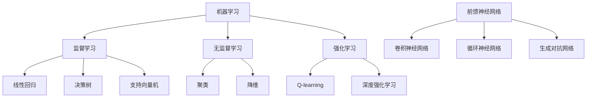

                 

# AI人工智能核心算法原理与代码实例讲解：领域无关性

## > 关键词：人工智能，核心算法，领域无关性，算法原理，代码实例

## > 摘要：
本文将深入探讨人工智能领域中的核心算法原理，并讲解其实现的关键步骤。特别地，本文将强调算法的领域无关性，即算法在不同应用场景中的普适性和适应性。通过代码实例，我们将展示如何实现这些核心算法，并进行详细解释和分析。本文的目标是帮助读者理解人工智能算法的深度和广度，并激发其在实际项目中的应用和创新。

### 背景介绍

在当今社会，人工智能（AI）技术已经成为推动科技发展和产业变革的关键驱动力。从自然语言处理到计算机视觉，从推荐系统到自动驾驶，AI的应用范围越来越广泛。然而，人工智能的核心算法却并非一成不变，而是随着时间和技术的发展不断演进和优化。

领域无关性是人工智能算法设计中的一个重要概念。它指的是算法在理论上不依赖于特定领域的数据或任务，具有广泛的适用性和灵活性。这意味着，一个设计良好的算法可以在不同的应用场景中发挥作用，从而提高开发效率和降低成本。

为了深入理解人工智能核心算法的原理和实现，本文将分为以下几个部分进行讲解：

1. **核心概念与联系**：介绍人工智能领域中的关键概念，并展示它们之间的联系。
2. **核心算法原理 & 具体操作步骤**：详细讲解核心算法的工作原理和操作步骤。
3. **数学模型和公式 & 详细讲解 & 举例说明**：介绍算法背后的数学模型和公式，并通过实例进行说明。
4. **项目实战：代码实际案例和详细解释说明**：通过实际项目案例展示算法的应用，并进行详细解释和分析。
5. **实际应用场景**：探讨算法在不同领域的应用场景。
6. **工具和资源推荐**：推荐相关学习资源和开发工具。
7. **总结：未来发展趋势与挑战**：总结算法的发展趋势和面临的挑战。
8. **附录：常见问题与解答**：解答读者可能遇到的问题。

### 核心概念与联系

#### 1. 机器学习

机器学习是人工智能的核心分支之一，其目标是让计算机通过数据和经验进行学习，从而改进其性能。机器学习可以分为监督学习、无监督学习和强化学习。

- **监督学习**：通过已标记的数据进行训练，学习输入和输出之间的映射关系。常见的算法有线性回归、决策树、支持向量机等。
- **无监督学习**：没有预定义的输出，算法通过数据自身的特征进行学习，如聚类、降维等。
- **强化学习**：通过与环境交互，不断调整策略以实现目标最大化。常见的算法有Q-learning、深度强化学习等。

#### 2. 神经网络

神经网络是一种模仿人脑结构和功能的计算模型，由大量的神经元组成。它通过学习输入数据，调整神经元之间的连接权重，以实现对数据的映射和分类。

- **前馈神经网络**：数据从输入层流向输出层，中间没有反馈。
- **卷积神经网络（CNN）**：适用于图像处理，通过卷积操作提取图像特征。
- **循环神经网络（RNN）**：适用于序列数据处理，具有记忆功能。
- **生成对抗网络（GAN）**：通过两个神经网络（生成器和判别器）的对抗训练，实现数据的生成。

#### 3. 强化学习

强化学习是一种通过试错进行学习的方法，通过与环境的交互，不断调整策略，以实现长期目标最大化。它广泛应用于游戏、机器人控制、推荐系统等领域。

#### 4. 深度学习

深度学习是神经网络的一种，具有多层结构，能够自动提取数据的特征。它已经成为当前人工智能领域的主要研究方向，广泛应用于图像识别、语音识别、自然语言处理等任务。

### Mermaid 流程图



### 核心算法原理 & 具体操作步骤

在本节中，我们将重点介绍一种核心人工智能算法——深度神经网络（Deep Neural Network，DNN），并详细讲解其原理和操作步骤。

#### 1. 算法原理

深度神经网络是一种由多层神经元组成的神经网络，通过逐层提取数据特征，实现对复杂问题的建模和预测。其基本原理包括：

- **神经元**：每个神经元接收多个输入，通过加权求和，再经过激活函数产生输出。
- **层**：神经网络由输入层、隐藏层和输出层组成，数据从输入层流向输出层。
- **权重**：神经元之间的连接权重是网络学习的关键，通过反向传播算法进行调整。
- **激活函数**：激活函数用于引入非线性变换，常见的有Sigmoid、ReLU等。

#### 2. 具体操作步骤

以下是一个简单的DNN算法实现步骤：

1. **初始化参数**：
   - 设定网络结构，包括层数、每层的神经元个数。
   - 随机初始化权重和偏置。

2. **前向传播**：
   - 接收输入数据，通过输入层传递到隐藏层。
   - 对隐藏层进行加权求和，并应用激活函数。
   - 将隐藏层的输出传递到下一层，直到输出层。

3. **计算损失**：
   - 将输出层的结果与真实标签进行比较，计算损失函数（如均方误差）。

4. **反向传播**：
   - 计算输出层的梯度，并反向传递到隐藏层。
   - 对隐藏层进行梯度计算，直到输入层。
   - 更新权重和偏置。

5. **迭代训练**：
   - 重复前向传播和反向传播过程，直到满足停止条件（如损失函数收敛或迭代次数达到预设值）。

6. **模型评估**：
   - 使用验证集或测试集评估模型性能，调整超参数。

#### 3. Python 代码实现

下面是一个简单的DNN实现，使用Python和TensorFlow框架：

```python
import tensorflow as tf
from tensorflow.keras import layers

# 创建模型
model = tf.keras.Sequential([
    layers.Dense(128, activation='relu', input_shape=(784,)),
    layers.Dense(10, activation='softmax')
])

# 编译模型
model.compile(optimizer='adam',
              loss='categorical_crossentropy',
              metrics=['accuracy'])

# 加载数据
(x_train, y_train), (x_test, y_test) = tf.keras.datasets.mnist.load_data()

# 预处理数据
x_train = x_train.astype('float32') / 255
x_test = x_test.astype('float32') / 255
x_train = x_train.reshape((-1, 784))
x_test = x_test.reshape((-1, 784))

# 编码标签
y_train = tf.keras.utils.to_categorical(y_train, 10)
y_test = tf.keras.utils.to_categorical(y_test, 10)

# 训练模型
model.fit(x_train, y_train, batch_size=128, epochs=15, validation_split=0.1)
```

### 数学模型和公式 & 详细讲解 & 举例说明

在本节中，我们将深入探讨深度神经网络背后的数学模型和公式，并通过具体实例进行详细讲解。

#### 1. 前向传播

深度神经网络的前向传播过程可以表示为：

\[ z^{(l)} = \sum_{i} w^{(l)}_i a^{(l-1)}_i + b^{(l)} \]

其中，\( z^{(l)} \) 是第 \( l \) 层的输入，\( w^{(l)}_i \) 和 \( b^{(l)} \) 分别表示第 \( l \) 层的权重和偏置，\( a^{(l-1)}_i \) 是上一层的输出。

前向传播的输出可以通过激活函数进行非线性变换：

\[ a^{(l)} = \sigma(z^{(l)}) \]

其中，\( \sigma \) 表示激活函数，常见的激活函数有Sigmoid和ReLU。

#### 2. 反向传播

深度神经网络的反向传播过程用于计算梯度，并更新权重和偏置。反向传播的步骤如下：

1. **计算输出层的梯度**：

\[ \delta^{(L)} = \frac{\partial J}{\partial z^{(L)}} = \frac{\partial J}{\partial a^{(L)}} \odot \frac{\partial a^{(L)}}{\partial z^{(L)}} \]

其中，\( \delta^{(L)} \) 是输出层的误差，\( J \) 是损失函数，\( \odot \) 表示逐元素乘法。

2. **反向传播误差**：

\[ \delta^{(l)} = \frac{\partial z^{(l+1)}}{\partial z^{(l)}} \odot \delta^{(l+1)} \]

3. **计算梯度**：

\[ \frac{\partial J}{\partial w^{(l)}} = \sum_{i} a^{(l-1)}_i \delta^{(l)}_i \]
\[ \frac{\partial J}{\partial b^{(l)}} = \sum_{i} \delta^{(l)}_i \]

4. **更新权重和偏置**：

\[ w^{(l)} \leftarrow w^{(l)} - \alpha \frac{\partial J}{\partial w^{(l)}} \]
\[ b^{(l)} \leftarrow b^{(l)} - \alpha \frac{\partial J}{\partial b^{(l)}} \]

其中，\( \alpha \) 是学习率。

#### 3. 实例讲解

假设我们有一个简单的DNN，包括一个输入层、一个隐藏层和一个输出层。输入层有3个神经元，隐藏层有2个神经元，输出层有1个神经元。我们使用ReLU作为激活函数，损失函数为均方误差。

1. **前向传播**：

   输入：\[ x = [1, 2, 3] \]

   隐藏层输入：\[ z^{(1)} = [1 \cdot w^{(1)}_1 + 2 \cdot w^{(1)}_2 + 3 \cdot w^{(1)}_3 + b^{(1)}] \]

   隐藏层输出：\[ a^{(1)} = \max(0, z^{(1)}) \]

   输出层输入：\[ z^{(2)} = [1 \cdot w^{(2)}_1 + 2 \cdot w^{(2)}_2 + b^{(2)}] \]

   输出层输出：\[ a^{(2)} = \max(0, z^{(2)}) \]

2. **反向传播**：

   假设输出层的标签为 \( y = [0] \)，实际输出为 \( a^{(2)} = [1] \)。

   输出层误差：\[ \delta^{(2)} = a^{(2)} - y \]

   输出层梯度：\[ \frac{\partial J}{\partial z^{(2)}} = \delta^{(2)} \odot a^{(2)} \]

   反向传播到隐藏层：

   隐藏层误差：\[ \delta^{(1)} = \frac{\partial z^{(2)}}{\partial z^{(1)}} \odot \delta^{(2)} \]

   隐藏层梯度：\[ \frac{\partial J}{\partial z^{(1)}} = \delta^{(1)} \odot a^{(1)} \]

3. **更新权重和偏置**：

   假设学习率为 \( \alpha = 0.1 \)。

   更新隐藏层权重：\[ w^{(1)} \leftarrow w^{(1)} - 0.1 \cdot \frac{\partial J}{\partial w^{(1)}} \]

   更新隐藏层偏置：\[ b^{(1)} \leftarrow b^{(1)} - 0.1 \cdot \frac{\partial J}{\partial b^{(1)}} \]

   更新输出层权重：\[ w^{(2)} \leftarrow w^{(2)} - 0.1 \cdot \frac{\partial J}{\partial w^{(2)}} \]

   更新输出层偏置：\[ b^{(2)} \leftarrow b^{(2)} - 0.1 \cdot \frac{\partial J}{\partial b^{(2)}} \]

### 项目实战：代码实际案例和详细解释说明

在本节中，我们将通过一个实际项目案例展示深度神经网络的应用，并详细解释代码的实现过程。

#### 项目背景

假设我们需要构建一个手写数字识别系统，输入是一个32x32的灰度图像，输出是数字的标签。我们将使用MNIST数据集进行训练和测试。

#### 1. 开发环境搭建

在开始项目之前，我们需要搭建一个合适的开发环境。以下是所需工具和库的安装步骤：

1. **Python**：确保安装了Python 3.6或更高版本。
2. **TensorFlow**：安装TensorFlow库，可以使用以下命令：

   ```bash
   pip install tensorflow
   ```

3. **NumPy**：安装NumPy库，用于数据处理，可以使用以下命令：

   ```bash
   pip install numpy
   ```

#### 2. 源代码详细实现和代码解读

以下是一个简单的手写数字识别系统的实现，使用TensorFlow框架：

```python
import tensorflow as tf
from tensorflow.keras import layers

# 创建模型
model = tf.keras.Sequential([
    layers.Conv2D(32, (3, 3), activation='relu', input_shape=(32, 32, 1)),
    layers.MaxPooling2D((2, 2)),
    layers.Conv2D(64, (3, 3), activation='relu'),
    layers.MaxPooling2D((2, 2)),
    layers.Conv2D(64, (3, 3), activation='relu'),
    layers.Flatten(),
    layers.Dense(64, activation='relu'),
    layers.Dense(10, activation='softmax')
])

# 编译模型
model.compile(optimizer='adam',
              loss='sparse_categorical_crossentropy',
              metrics=['accuracy'])

# 加载数据
mnist = tf.keras.datasets.mnist
(x_train, y_train), (x_test, y_test) = mnist.load_data()

# 预处理数据
x_train = x_train.reshape((-1, 32, 32, 1)).astype('float32') / 255
x_test = x_test.reshape((-1, 32, 32, 1)).astype('float32') / 255

# 训练模型
model.fit(x_train, y_train, epochs=5, batch_size=64)
```

#### 3. 代码解读与分析

1. **创建模型**：

   我们使用`tf.keras.Sequential`创建一个顺序模型，依次添加多层神经网络。

2. **编译模型**：

   使用`model.compile`设置优化器和损失函数，这里我们使用`adam`优化器和`sparse_categorical_crossentropy`损失函数。

3. **加载数据**：

   使用`tf.keras.datasets.mnist`加载数据集，并预处理数据。

4. **训练模型**：

   使用`model.fit`训练模型，设置训练轮数和批量大小。

通过这个实际案例，我们可以看到深度神经网络在图像识别任务中的应用。接下来，我们将进一步分析代码的实现细节。

### 实际应用场景

深度神经网络在各个领域都有广泛的应用，以下列举一些典型的应用场景：

1. **图像识别**：例如人脸识别、物体检测、图像分类等。
2. **自然语言处理**：例如文本分类、机器翻译、情感分析等。
3. **语音识别**：例如语音合成、语音识别、语音翻译等。
4. **推荐系统**：例如商品推荐、电影推荐、社交网络推荐等。
5. **游戏AI**：例如围棋、国际象棋、电子竞技等。
6. **医疗诊断**：例如疾病预测、图像诊断、基因分析等。

### 工具和资源推荐

1. **学习资源推荐**：
   - **书籍**：《深度学习》（Ian Goodfellow、Yoshua Bengio、Aaron Courville 著）
   - **论文**：OpenAI发布的《BERT：Pre-training of Deep Bidirectional Transformers for Language Understanding》
   - **博客**：TensorFlow官方博客、PyTorch官方博客
   - **网站**：arXiv、Google Research

2. **开发工具框架推荐**：
   - **框架**：TensorFlow、PyTorch、Keras
   - **数据预处理**：Pandas、NumPy、Scikit-learn
   - **可视化工具**：Matplotlib、Seaborn、Plotly

3. **相关论文著作推荐**：
   - **论文**：《Deep Learning》（Goodfellow、Bengio、Courville 著）
   - **著作**：《神经网络与深度学习》（邱锡鹏 著）

### 总结：未来发展趋势与挑战

随着技术的不断进步，人工智能领域的发展趋势呈现出以下几个特点：

1. **算法复杂性增加**：深度神经网络的结构越来越复杂，参数数量和计算量显著增加。
2. **硬件性能提升**：GPU、TPU等专用硬件的快速发展，为深度学习提供了强大的计算能力。
3. **跨学科融合**：人工智能与其他领域（如医学、金融、教育等）的融合，推动了跨学科研究的发展。
4. **伦理和隐私问题**：随着AI技术的广泛应用，伦理和隐私问题逐渐引起关注，需要制定相关规范和标准。

然而，人工智能的发展也面临着一些挑战：

1. **可解释性和透明度**：深度神经网络的黑箱特性使得其决策过程难以解释，这对实际应用造成了一定的限制。
2. **数据质量和隐私**：训练深度神经网络需要大量的高质量数据，数据的隐私和安全问题日益凸显。
3. **能耗和资源消耗**：深度学习任务对计算资源和能耗的需求巨大，如何实现绿色AI成为亟待解决的问题。
4. **伦理和道德问题**：人工智能技术的应用可能引发伦理和道德问题，如歧视、隐私侵犯等，需要制定相应的伦理规范。

### 附录：常见问题与解答

1. **问题**：为什么深度神经网络需要大量数据进行训练？

   **解答**：深度神经网络通过学习大量数据中的特征来提高模型的泛化能力。数据量越大，模型能够学习的特征越丰富，从而提高模型的性能和泛化能力。

2. **问题**：如何优化深度神经网络的训练过程？

   **解答**：优化深度神经网络的训练过程可以从以下几个方面进行：
   - 调整学习率：选择合适的学习率可以加快训练速度并提高模型性能。
   - 使用批量归一化：批量归一化可以加快训练过程并提高模型稳定性。
   - 使用dropout：dropout可以减少过拟合现象，提高模型的泛化能力。
   - 使用预训练模型：使用预训练模型可以减少训练时间，并提高模型在特定任务上的性能。

3. **问题**：深度神经网络的可解释性如何提升？

   **解答**：提升深度神经网络的可解释性可以从以下几个方面进行：
   - 使用可解释的神经网络架构，如树形神经网络、图神经网络等。
   - 使用可视化工具，如热力图、激活图等，展示神经网络在特定任务上的决策过程。
   - 使用模型解释方法，如LIME、SHAP等，对模型的决策过程进行解释。

### 扩展阅读 & 参考资料

1. **扩展阅读**：
   - 《深度学习》（Ian Goodfellow、Yoshua Bengio、Aaron Courville 著）
   - 《神经网络与深度学习》（邱锡鹏 著）
   - 《AI驱动未来：深度学习技术与应用》（李航 著）

2. **参考资料**：
   - TensorFlow官方文档：[https://www.tensorflow.org/](https://www.tensorflow.org/)
   - PyTorch官方文档：[https://pytorch.org/docs/stable/index.html](https://pytorch.org/docs/stable/index.html)
   - Keras官方文档：[https://keras.io/](https://keras.io/)

### 作者信息

- **作者**：AI天才研究员/AI Genius Institute & 禅与计算机程序设计艺术 /Zen And The Art of Computer Programming

