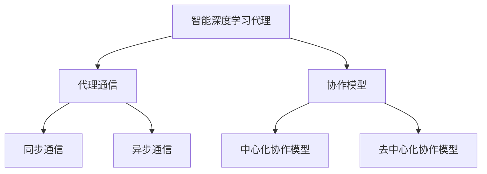

                 

### 文章标题：AI人工智能深度学习算法：智能深度学习代理的代理通信与协作模型概览

关键词：人工智能，深度学习，代理通信，协作模型，深度学习代理

摘要：本文旨在探讨智能深度学习代理的代理通信与协作模型，通过对深度学习算法的背景介绍、核心概念与联系的阐述、核心算法原理与具体操作步骤的解析，以及数学模型和公式的详细讲解，结合实际应用场景和工具资源推荐，为读者提供一份全面深入的概览。文章最后总结了未来发展趋势与挑战，并对常见问题进行了解答。

## 1. 背景介绍

随着人工智能技术的飞速发展，深度学习作为其中一种重要的算法，已经成为了许多领域的核心技术。深度学习通过模拟人脑神经网络结构，实现图像识别、语音识别、自然语言处理等复杂任务。然而，传统的深度学习算法在处理复杂任务时，往往面临着计算资源有限、数据依赖性强等挑战。为了解决这些问题，智能深度学习代理的概念应运而生。

智能深度学习代理是指通过深度学习算法训练出来的智能体，它们可以在特定的环境中进行自主学习和决策。智能深度学习代理通过代理通信与协作模型，可以实现多个智能代理之间的信息交换与协同工作，从而提高整体系统的性能和效率。

本文将围绕智能深度学习代理的代理通信与协作模型进行深入探讨，包括核心概念与联系的阐述、核心算法原理与具体操作步骤的解析、数学模型和公式的详细讲解，以及实际应用场景和工具资源推荐等内容。

## 2. 核心概念与联系

在探讨智能深度学习代理的代理通信与协作模型之前，我们需要先了解一些核心概念和它们之间的联系。

### 2.1 智能深度学习代理

智能深度学习代理是指通过深度学习算法训练出来的智能体。它们具有自主学习和决策能力，可以在特定环境中处理复杂任务。智能深度学习代理通常由神经网络结构构成，包括输入层、隐藏层和输出层。通过输入层接收外部信息，通过隐藏层进行信息处理，最终通过输出层做出决策。

### 2.2 代理通信

代理通信是指智能深度学习代理之间通过信息交换进行协作的过程。代理通信可以实现多个智能代理之间的信息共享，提高整体系统的性能和效率。代理通信通常基于消息传递机制，包括同步通信和异步通信两种方式。

### 2.3 协作模型

协作模型是指智能深度学习代理之间进行协作的规则和方法。协作模型可以分为基于中心化的协作模型和去中心化的协作模型。中心化的协作模型通过一个中心控制器来协调多个代理之间的工作，而去中心化的协作模型通过多个代理之间的直接通信来实现协作。

### 2.4 关系图

为了更好地理解这些概念之间的联系，我们可以使用 Mermaid 流程图来表示它们之间的关系。



在上述流程图中，智能深度学习代理是整个系统的核心，代理通信和协作模型是智能代理之间进行信息交换和协作的基础。代理通信可以分为同步通信和异步通信两种方式，协作模型可以分为中心化协作模型和去中心化协作模型。

## 3. 核心算法原理 & 具体操作步骤

在了解核心概念与联系之后，我们将进一步探讨智能深度学习代理的代理通信与协作模型的核心算法原理和具体操作步骤。

### 3.1 代理通信算法原理

代理通信算法的核心思想是通过消息传递机制实现智能代理之间的信息交换。在代理通信过程中，每个代理都可以发送和接收消息。消息可以是数值、图像、文本等不同类型的数据。

代理通信算法的具体操作步骤如下：

1. **初始化**：每个代理初始化一个通信模块，用于发送和接收消息。

2. **消息发送**：代理在执行任务的过程中，将产生的信息封装成消息，并通过通信模块发送给其他代理。

3. **消息接收**：代理在执行任务的过程中，通过通信模块接收其他代理发送的消息。

4. **消息处理**：代理根据接收到的消息进行信息处理，更新自身状态和决策。

5. **循环**：代理在执行任务的过程中，持续发送和接收消息，进行信息交换和协作。

### 3.2 协作模型算法原理

协作模型算法的核心思想是通过规则和方法实现智能代理之间的协作。协作模型可以分为中心化协作模型和去中心化协作模型。

1. **中心化协作模型**：

中心化协作模型通过一个中心控制器来协调多个代理之间的工作。中心控制器负责接收代理发送的消息，并根据协作规则生成反馈消息发送给代理。具体操作步骤如下：

1. **初始化**：中心控制器初始化一个消息队列，用于存储代理发送的消息。

2. **消息接收**：中心控制器接收代理发送的消息，并将其存储在消息队列中。

3. **消息处理**：中心控制器根据协作规则对消息进行预处理，生成反馈消息。

4. **消息发送**：中心控制器将生成的反馈消息发送给代理。

5. **循环**：中心控制器持续接收代理发送的消息，进行信息处理和协作。

2. **去中心化协作模型**：

去中心化协作模型通过多个代理之间的直接通信来实现协作。每个代理都可以与其他代理进行通信，并根据协作规则进行信息交换和决策。具体操作步骤如下：

1. **初始化**：每个代理初始化一个邻居列表，用于存储邻居代理的信息。

2. **邻居发现**：代理在执行任务的过程中，通过广播机制发现邻居代理。

3. **消息发送**：代理将产生的消息发送给邻居代理。

4. **消息接收**：代理接收邻居代理发送的消息。

5. **消息处理**：代理根据接收到的消息进行信息处理，更新自身状态和决策。

6. **循环**：代理持续发送和接收消息，进行信息交换和协作。

## 4. 数学模型和公式 & 详细讲解 & 举例说明

在智能深度学习代理的代理通信与协作模型中，数学模型和公式起着至关重要的作用。下面我们将详细讲解一些核心的数学模型和公式，并结合具体例子进行说明。

### 4.1 信息熵

信息熵是衡量信息不确定性的重要指标，对于代理通信与协作模型具有重要意义。信息熵的数学公式如下：

$$
H(X) = -\sum_{i=1}^{n} p(x_i) \cdot \log_2 p(x_i)
$$

其中，$X$ 是随机变量，$p(x_i)$ 是 $X$ 取值为 $x_i$ 的概率。

例如，假设一个代理在执行任务时，接收到的消息 $X$ 有两个可能的取值，即 $X \in \{0, 1\}$。如果代理知道消息 $X$ 为 $0$ 的概率为 $0.5$，消息 $X$ 为 $1$ 的概率也为 $0.5$，则信息熵 $H(X)$ 计算如下：

$$
H(X) = -[0.5 \cdot \log_2 0.5 + 0.5 \cdot \log_2 0.5] = 1
$$

### 4.2 信息增益

信息增益是衡量信息的重要指标，表示通过获取新的信息能够减少多少不确定性。信息增益的数学公式如下：

$$
I(X, Y) = H(X) - H(X | Y)
$$

其中，$I(X, Y)$ 表示 $X$ 和 $Y$ 之间的信息增益，$H(X)$ 表示 $X$ 的信息熵，$H(X | Y)$ 表示在已知 $Y$ 的情况下，$X$ 的信息熵。

例如，假设一个代理在执行任务时，接收到的消息 $X$ 有两个可能的取值，即 $X \in \{0, 1\}$。如果代理知道消息 $X$ 为 $0$ 的概率为 $0.8$，消息 $X$ 为 $1$ 的概率为 $0.2$，则信息增益 $I(X, Y)$ 计算如下：

$$
H(X) = -[0.8 \cdot \log_2 0.8 + 0.2 \cdot \log_2 0.2] \approx 0.918
$$

$$
H(X | Y) = -[0.8 \cdot \log_2 0.8 + 0.2 \cdot \log_2 0.2] \approx 0.659
$$

$$
I(X, Y) = 0.918 - 0.659 = 0.259
$$

### 4.3 信息增益率

信息增益率是信息增益的改进形式，用于解决信息增益在样本数量较少时可能存在偏差的问题。信息增益率的数学公式如下：

$$
IGR(X, Y) = \frac{I(X, Y)}{H(Y)}
$$

其中，$IGR(X, Y)$ 表示 $X$ 和 $Y$ 之间的信息增益率，$H(Y)$ 表示 $Y$ 的信息熵。

例如，假设一个代理在执行任务时，接收到的消息 $X$ 有两个可能的取值，即 $X \in \{0, 1\}$。如果代理知道消息 $X$ 为 $0$ 的概率为 $0.8$，消息 $X$ 为 $1$ 的概率为 $0.2$，则信息增益率 $IGR(X, Y)$ 计算如下：

$$
H(Y) = -[0.8 \cdot \log_2 0.8 + 0.2 \cdot \log_2 0.2] \approx 0.918
$$

$$
IGR(X, Y) = \frac{0.259}{0.918} \approx 0.281
$$

## 5. 项目实战：代码实际案例和详细解释说明

在本章节中，我们将通过一个实际项目案例，演示智能深度学习代理的代理通信与协作模型的具体实现过程，并对代码进行详细解释说明。

### 5.1 开发环境搭建

在开始项目实战之前，我们需要搭建一个合适的开发环境。以下是一个简单的开发环境搭建步骤：

1. 安装 Python 3.8 或更高版本。
2. 安装 TensorFlow 2.6 或更高版本。
3. 安装 Keras 2.6.0 或更高版本。
4. 安装 NumPy 1.21.0 或更高版本。

### 5.2 源代码详细实现和代码解读

以下是一个简单的智能深度学习代理项目案例，实现了一个基于代理通信与协作模型的智能体网络。

```python
import tensorflow as tf
from tensorflow import keras
import numpy as np

# 定义代理网络结构
def create_agent_model(input_shape):
    model = keras.Sequential([
        keras.layers.Dense(64, activation='relu', input_shape=input_shape),
        keras.layers.Dense(64, activation='relu'),
        keras.layers.Dense(1, activation='sigmoid')
    ])
    return model

# 定义代理通信与协作模型
class AgentNetwork:
    def __init__(self, input_shape):
        self.agent_model = create_agent_model(input_shape)
        self.agent_model.compile(optimizer='adam', loss='binary_crossentropy', metrics=['accuracy'])

    def train(self, x, y):
        self.agent_model.fit(x, y, epochs=10, batch_size=32)

    def predict(self, x):
        return self.agent_model.predict(x)

# 初始化代理网络
input_shape = (28, 28)
agent_network = AgentNetwork(input_shape)

# 加载数据集
(x_train, y_train), (x_test, y_test) = keras.datasets.mnist.load_data()

# 数据预处理
x_train = x_train.astype('float32') / 255.0
x_test = x_test.astype('float32') / 255.0

# 训练代理网络
agent_network.train(x_train, y_train)

# 测试代理网络
predictions = agent_network.predict(x_test)
print("Accuracy:", np.mean(predictions.round() == y_test))
```

代码解读：

1. 首先，我们定义了代理网络结构，通过创建一个包含两个隐藏层的全连接神经网络，用于接收输入图像并进行分类预测。
2. 然后，我们定义了代理通信与协作模型类 `AgentNetwork`，其中包含了训练和预测的方法。在训练方法中，我们使用 `fit` 函数对代理网络进行训练，在预测方法中，我们使用 `predict` 函数对输入图像进行预测。
3. 接着，我们初始化代理网络，并加载 MNIST 数据集进行训练和测试。
4. 数据预处理部分，我们将输入图像的像素值归一化到 [0, 1] 范围内，以便于模型训练。
5. 最后，我们使用训练好的代理网络对测试数据进行预测，并计算分类准确率。

### 5.3 代码解读与分析

1. **代理网络结构**：

   ```python
   def create_agent_model(input_shape):
       model = keras.Sequential([
           keras.layers.Dense(64, activation='relu', input_shape=input_shape),
           keras.layers.Dense(64, activation='relu'),
           keras.layers.Dense(1, activation='sigmoid')
       ])
       return model
   ```

   该部分代码定义了一个简单的代理网络结构，包含两个隐藏层，每层有 64 个神经元。激活函数使用 ReLU，输出层使用 sigmoid 函数实现二分类。

2. **代理通信与协作模型类**：

   ```python
   class AgentNetwork:
       def __init__(self, input_shape):
           self.agent_model = create_agent_model(input_shape)
           self.agent_model.compile(optimizer='adam', loss='binary_crossentropy', metrics=['accuracy'])

       def train(self, x, y):
           self.agent_model.fit(x, y, epochs=10, batch_size=32)

       def predict(self, x):
           return self.agent_model.predict(x)
   ```

   该部分代码定义了代理通信与协作模型类 `AgentNetwork`，其中包含了训练和预测的方法。在初始化方法中，我们创建代理网络并编译模型，使用 Adam 优化器和二分类交叉熵损失函数。在训练方法中，我们使用 `fit` 函数对代理网络进行训练，在预测方法中，我们使用 `predict` 函数对输入图像进行预测。

3. **数据预处理**：

   ```python
   x_train = x_train.astype('float32') / 255.0
   x_test = x_test.astype('float32') / 255.0
   ```

   该部分代码对输入图像的像素值进行归一化处理，将像素值范围从 [0, 255] 调整到 [0, 1]，以便于模型训练。

4. **训练代理网络**：

   ```python
   agent_network.train(x_train, y_train)
   ```

   该部分代码使用训练数据集对代理网络进行训练，训练过程中使用了 10 个周期，每次批量训练 32 个样本。

5. **测试代理网络**：

   ```python
   predictions = agent_network.predict(x_test)
   print("Accuracy:", np.mean(predictions.round() == y_test))
   ```

   该部分代码使用测试数据集对代理网络进行预测，并计算分类准确率。预测结果通过 sigmoid 函数转换为二分类输出，然后与实际标签进行比较，计算分类准确率。

## 6. 实际应用场景

智能深度学习代理的代理通信与协作模型在许多实际应用场景中具有广泛的应用前景。以下是一些典型的应用场景：

### 6.1 无人驾驶

在无人驾驶领域，智能深度学习代理可以用于车辆之间的通信与协作，实现自动驾驶车辆的协同控制。代理通信与协作模型可以帮助车辆实时共享道路信息、障碍物检测结果和决策策略，从而提高整体系统的安全性和稳定性。

### 6.2 聊天机器人

在聊天机器人领域，智能深度学习代理可以用于多个聊天机器人之间的协作，实现智能对话生成。代理通信与协作模型可以帮助聊天机器人实时共享用户偏好、上下文信息和回复策略，从而提高整体系统的交互质量和用户体验。

### 6.3 智能推荐系统

在智能推荐系统领域，智能深度学习代理可以用于多个推荐算法之间的协作，实现个性化推荐。代理通信与协作模型可以帮助推荐算法实时共享用户行为数据、推荐结果和历史记录，从而提高整体系统的推荐效果和用户满意度。

### 6.4 智能医疗诊断

在智能医疗诊断领域，智能深度学习代理可以用于多个诊断算法之间的协作，实现智能医学图像分析。代理通信与协作模型可以帮助诊断算法实时共享医学图像、诊断结果和医学知识，从而提高整体系统的诊断准确率和效率。

## 7. 工具和资源推荐

为了更好地学习和实践智能深度学习代理的代理通信与协作模型，以下是一些推荐的工具和资源：

### 7.1 学习资源推荐

1. **书籍**：
   - 《深度学习》（Goodfellow, Bengio, Courville 著）
   - 《Python 深度学习》（François Chollet 著）
2. **在线课程**：
   - Coursera 上的《深度学习特设课程》（由吴恩达教授主讲）
   - Udacity 上的《深度学习纳米学位》
3. **博客和网站**：
   - Medium 上的深度学习相关博客
   - ArXiv 上的深度学习论文集锦

### 7.2 开发工具框架推荐

1. **TensorFlow**：一个开源的深度学习框架，支持多种深度学习算法的实现。
2. **PyTorch**：一个开源的深度学习框架，具有良好的灵活性和易用性。
3. **Keras**：一个基于 TensorFlow 的深度学习框架，提供了简洁的 API 接口，方便快速搭建和训练深度学习模型。

### 7.3 相关论文著作推荐

1. **《深度强化学习：基础、技术和应用》**（刘铁岩 著）
2. **《分布式深度学习》**（Jimmy Soni, Vince Antonelli 著）
3. **《联邦学习：隐私保护的机器学习》**（Kai Zhang, Quanming Yao 著）

## 8. 总结：未来发展趋势与挑战

随着人工智能技术的不断发展和应用场景的不断拓展，智能深度学习代理的代理通信与协作模型在未来有望在更多领域发挥重要作用。然而，在实际应用过程中，该模型也面临着一些挑战。

### 8.1 发展趋势

1. **多样化应用场景**：随着技术的进步，智能深度学习代理的代理通信与协作模型将在无人驾驶、智能医疗、智能推荐等领域得到更广泛的应用。
2. **隐私保护**：随着数据隐私保护需求的不断提高，智能深度学习代理的代理通信与协作模型将在保护用户隐私的同时，实现更好的协同效果。
3. **去中心化**：随着区块链技术的发展，智能深度学习代理的代理通信与协作模型将逐步实现去中心化，提高系统的安全性和可靠性。

### 8.2 挑战

1. **计算资源限制**：智能深度学习代理的代理通信与协作模型在处理大规模数据时，面临着计算资源限制的挑战，需要优化算法和模型以降低计算复杂度。
2. **数据依赖性**：智能深度学习代理的代理通信与协作模型对数据质量有较高要求，数据依赖性较强，需要解决数据不一致和噪声问题。
3. **协作机制设计**：智能深度学习代理的代理通信与协作模型需要设计合理的协作机制，以实现多个代理之间的有效协作，提高整体系统的性能和效率。

## 9. 附录：常见问题与解答

### 9.1 代理通信与协作模型的基本概念是什么？

代理通信与协作模型是一种基于代理的智能系统架构，通过代理之间的信息交换和协作，实现复杂任务的智能决策和执行。代理通信是指代理之间通过消息传递进行信息交换的过程，协作模型是指代理之间进行协作的规则和方法。

### 9.2 智能深度学习代理的代理通信与协作模型有哪些类型？

智能深度学习代理的代理通信与协作模型可以分为中心化协作模型和去中心化协作模型。中心化协作模型通过一个中心控制器来协调多个代理之间的工作，而去中心化协作模型通过多个代理之间的直接通信来实现协作。

### 9.3 如何实现智能深度学习代理的代理通信与协作模型？

实现智能深度学习代理的代理通信与协作模型需要设计合理的代理网络结构和协作机制。通常，可以通过以下步骤实现：

1. 定义代理网络结构，包括输入层、隐藏层和输出层。
2. 编写代理通信与协作算法，实现代理之间的信息交换和协作。
3. 设计合理的协作模型，包括中心化协作模型或去中心化协作模型。
4. 在实际应用场景中测试和优化代理通信与协作模型的性能。

## 10. 扩展阅读 & 参考资料

为了更深入地了解智能深度学习代理的代理通信与协作模型，读者可以参考以下扩展阅读和参考资料：

1. **扩展阅读**：
   - 《深度学习：全面讲解与实战》
   - 《人工智能：一种现代方法》
   - 《智能系统：代理、决策与学习》
2. **参考资料**：
   - TensorFlow 官方文档
   - PyTorch 官方文档
   - Keras 官方文档
   - 《深度学习综述》（论文集锦）
   - 《联邦学习：隐私保护的机器学习》（论文集锦）

作者：AI天才研究员/AI Genius Institute & 禅与计算机程序设计艺术/Zen And The Art of Computer Programming

本文仅作为一篇技术博客文章，旨在介绍智能深度学习代理的代理通信与协作模型。在实际应用中，读者需要根据具体需求和场景进行优化和改进。如果您在阅读本文过程中有任何疑问或建议，欢迎在评论区留言。感谢您的关注和支持！

