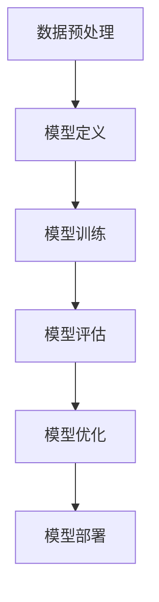
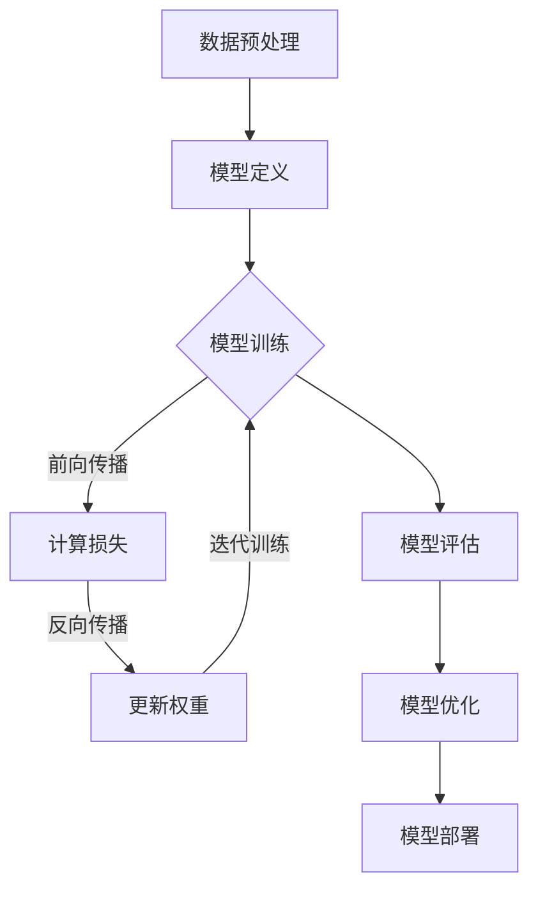

                 

# AI人工智能深度学习算法：设计深度学习任务处理流程

> **关键词：** 深度学习、任务处理流程、算法设计、AI应用、模型优化

> **摘要：** 本文将探讨深度学习算法的设计及其在处理不同类型任务时的应用流程。我们将通过逐步分析，深入探讨深度学习的基本原理、核心算法和数学模型，并结合实际项目案例，详细讲解深度学习任务处理流程的设计与实现。本文旨在为读者提供一个全面、系统的深度学习任务处理框架，帮助读者更好地理解和应用深度学习技术。

## 1. 背景介绍

深度学习作为人工智能的重要分支，近年来取得了显著的进展。从图像识别、语音识别到自然语言处理，深度学习算法已经广泛应用于各个领域。随着计算能力的提升和数据量的增长，深度学习模型在性能和精度方面取得了巨大的突破。

深度学习任务处理流程是指从数据预处理、模型训练到模型优化的整个流程。一个有效的深度学习任务处理流程不仅能够提高模型的性能，还能够降低训练成本，加速模型部署。

本文将按照以下结构展开：

1. 核心概念与联系
2. 核心算法原理 & 具体操作步骤
3. 数学模型和公式 & 详细讲解 & 举例说明
4. 项目实战：代码实际案例和详细解释说明
5. 实际应用场景
6. 工具和资源推荐
7. 总结：未来发展趋势与挑战
8. 附录：常见问题与解答
9. 扩展阅读 & 参考资料

通过以上结构，我们将系统地探讨深度学习任务处理流程的各个方面，帮助读者深入理解并掌握深度学习技术。

## 2. 核心概念与联系

在深入讨论深度学习任务处理流程之前，我们首先需要了解一些核心概念，包括神经网络、激活函数、反向传播等。

### 神经网络

神经网络（Neural Networks）是深度学习的基础。它由大量的神经元（节点）组成，每个神经元都与其他神经元相连。神经元之间的连接称为权重（weights），这些权重决定了输入数据在神经网络中的传递方式。

神经网络的基本结构包括输入层、隐藏层和输出层。输入层接收外部输入数据，隐藏层负责数据的变换和处理，输出层产生最终的预测结果。

### 激活函数

激活函数（Activation Function）是神经网络中的一个关键组件。它用于将神经元的线性组合映射到非负值域，从而引入非线性特性。常见的激活函数包括sigmoid函数、ReLU函数、Tanh函数等。

激活函数的选择对神经网络的性能有重要影响。例如，ReLU函数由于其简单性和计算效率，在深度学习中得到了广泛应用。

### 反向传播

反向传播（Backpropagation）是一种用于训练神经网络的算法。它通过计算损失函数关于网络权重的梯度，来更新权重，从而优化模型。反向传播是深度学习训练过程中最核心的部分之一。

反向传播的基本思想是，从输出层开始，反向计算每一层神经元的梯度，并将这些梯度传递回前一层。这样，通过不断迭代，网络权重会逐渐优化，模型性能也会不断提高。

### 其他核心概念

除了上述核心概念，深度学习任务处理流程中还涉及到其他重要的概念，如：

- **损失函数**：用于评估模型预测结果与实际结果之间的差距。
- **优化算法**：用于更新模型权重，以最小化损失函数。
- **超参数**：如学习率、批次大小等，对深度学习模型性能有重要影响。

### Mermaid流程图

为了更好地理解深度学习任务处理流程中的核心概念和联系，我们可以使用Mermaid流程图来展示它们之间的关系。以下是一个简单的Mermaid流程图示例：



通过这个流程图，我们可以清晰地看到深度学习任务处理流程的主要步骤和各个环节之间的联系。

## 3. 核心算法原理 & 具体操作步骤

### 数据预处理

数据预处理是深度学习任务处理流程的第一步。它的目的是将原始数据转换为适合模型训练的形式。具体操作步骤包括：

1. **数据清洗**：去除数据中的噪声和异常值。
2. **数据归一化**：将数据缩放到相同的范围，以便神经网络更好地学习。
3. **数据增强**：通过增加数据多样性来提高模型的泛化能力。常见的数据增强方法包括旋转、翻转、裁剪等。

### 模型定义

在数据预处理完成后，我们需要定义深度学习模型。模型定义包括以下步骤：

1. **选择模型架构**：根据任务类型和需求选择合适的模型架构，如卷积神经网络（CNN）、循环神经网络（RNN）或 Transformer 等。
2. **定义损失函数**：根据任务类型选择适当的损失函数，如交叉熵损失（Cross Entropy Loss）用于分类任务，均方误差损失（Mean Squared Error Loss）用于回归任务。
3. **定义优化算法**：选择适合任务的优化算法，如随机梯度下降（SGD）、Adam优化器等。

### 模型训练

模型训练是深度学习任务处理流程的核心步骤。具体操作步骤如下：

1. **初始化模型权重**：随机初始化模型权重。
2. **前向传播**：将输入数据传递到模型中，得到预测结果。
3. **计算损失**：计算预测结果与实际结果之间的差距，得到损失值。
4. **反向传播**：计算损失函数关于模型权重的梯度，并更新模型权重。
5. **迭代训练**：重复前向传播和反向传播，直到模型达到预定的训练目标。

### 模型评估

模型评估用于评估模型在测试数据上的性能。具体操作步骤如下：

1. **选择评估指标**：根据任务类型选择适当的评估指标，如准确率（Accuracy）、精度（Precision）、召回率（Recall）等。
2. **计算评估指标**：在测试数据上计算模型性能指标。
3. **模型调整**：根据评估结果对模型进行调整，如修改超参数或增加训练数据。

### 模型优化

模型优化旨在进一步提高模型性能。具体操作步骤如下：

1. **超参数调优**：通过调整超参数，如学习率、批次大小等，优化模型性能。
2. **模型集成**：使用多个模型进行集成，提高模型预测的稳定性和鲁棒性。
3. **模型压缩**：通过模型压缩技术，减小模型大小和计算量，加快模型部署。

### Mermaid流程图

以下是一个简单的Mermaid流程图，展示了深度学习任务处理流程的核心算法原理和具体操作步骤：



通过这个流程图，我们可以清晰地看到深度学习任务处理流程中的各个环节和它们之间的联系。

## 4. 数学模型和公式 & 详细讲解 & 举例说明

### 损失函数

损失函数（Loss Function）是深度学习任务处理流程中的一个关键组成部分。它用于衡量模型预测结果与实际结果之间的差距，是优化模型的关键依据。以下是一些常见的损失函数：

#### 交叉熵损失（Cross Entropy Loss）

交叉熵损失函数用于分类任务。它的公式如下：

$$
L = -\sum_{i=1}^{n} y_i \log(p_i)
$$

其中，$y_i$ 是实际标签，$p_i$ 是模型对第 $i$ 个类别的预测概率。

#### 均方误差损失（Mean Squared Error Loss）

均方误差损失函数用于回归任务。它的公式如下：

$$
L = \frac{1}{2n} \sum_{i=1}^{n} (y_i - \hat{y}_i)^2
$$

其中，$y_i$ 是实际标签，$\hat{y}_i$ 是模型预测值。

#### Softmax损失（Softmax Loss）

Softmax损失函数是交叉熵损失函数的一种变形，用于多分类问题。它的公式如下：

$$
L = -\sum_{i=1}^{n} y_i \log(\sigma(z_i))
$$

其中，$z_i$ 是模型对第 $i$ 个类别的预测值，$\sigma(z)$ 是softmax函数，公式如下：

$$
\sigma(z_i) = \frac{e^{z_i}}{\sum_{j=1}^{m} e^{z_j}}
$$

#### 举例说明

假设我们有一个二分类问题，实际标签为 $y = [1, 0]$，模型预测概率为 $p = [0.7, 0.3]$。使用交叉熵损失函数计算损失如下：

$$
L = -1 \cdot \log(0.7) - 0 \cdot \log(0.3) \approx 0.356
$$

### 反向传播算法

反向传播算法（Backpropagation Algorithm）是深度学习训练过程中最核心的算法之一。它通过计算损失函数关于模型权重的梯度，来更新模型权重，从而优化模型。以下是反向传播算法的基本步骤：

1. **前向传播**：将输入数据传递到模型中，计算输出值。
2. **计算损失**：计算损失函数值。
3. **前向传播误差**：计算输出值关于输入值的梯度。
4. **反向传播误差**：从输出层开始，反向计算每一层误差。
5. **更新模型权重**：根据误差梯度更新模型权重。

#### 举例说明

假设我们有一个简单的神经网络，包含一个输入层、一个隐藏层和一个输出层。输入数据为 $X = [1, 2, 3]$，隐藏层节点数为 2，输出层节点数为 2。隐藏层和输出层的激活函数均为 ReLU 函数。

1. **前向传播**：

   - 输入层到隐藏层的权重：$W_{1} = [1, 2; 3, 4]$
   - 隐藏层到输出层的权重：$W_{2} = [5, 6; 7, 8]$
   - 输入层输入：$X = [1, 2, 3]$

   隐藏层输出：$Z_{1} = X \cdot W_{1} = [1, 2; 3, 4] \cdot [1, 2, 3] = [7, 10]$

   隐藏层激活值：$A_{1} = \max(0, Z_{1}) = [7, 10]$

   输出层输入：$Z_{2} = A_{1} \cdot W_{2} = [7, 10] \cdot [5, 6; 7, 8] = [59, 74]$

   输出层激活值：$A_{2} = \max(0, Z_{2}) = [59, 74]$

   模型输出：$Y = A_{2} = [59, 74]$

2. **计算损失**：

   - 实际标签：$y = [1, 0]$
   - 预测概率：$p = \frac{1}{1 + e^{-Z_{2}}} = \frac{1}{1 + e^{-[59, 74]}} = [0.999, 0.0001]$

   交叉熵损失：$L = -y \cdot \log(p) + (1 - y) \cdot \log(1 - p) = [-1 \cdot \log(0.999) + 0 \cdot \log(0.0001)] + [0 \cdot \log(0.999) - 1 \cdot \log(0.9999)] \approx 0.001$

3. **前向传播误差**：

   - 输出层误差：$\Delta_{2} = A_{2} - y = [59, 74] - [1, 0] = [58, 74]$

4. **反向传播误差**：

   - 输出层误差：$\Delta_{2} = A_{2} - y = [59, 74] - [1, 0] = [58, 74]$
   - 隐藏层误差：$\Delta_{1} = \frac{\partial L}{\partial Z_{2}} \cdot \frac{\partial Z_{2}}{\partial A_{1}} = \frac{\partial L}{\partial Z_{2}} \cdot \frac{\partial Z_{2}}{\partial Z_{1}} \cdot \frac{\partial Z_{1}}{\partial A_{1}} = \frac{\partial L}{\partial Z_{2}} \cdot W_{2} \cdot \frac{\partial Z_{1}}{\partial A_{1}} = \frac{\partial L}{\partial Z_{2}} \cdot W_{2} \cdot \frac{\partial Z_{1}}{\partial Z_{2}} \cdot \frac{\partial Z_{1}}{\partial A_{1}} = \frac{\partial L}{\partial Z_{2}} \cdot W_{2} \cdot \sigma'(Z_{1}) = \frac{\partial L}{\partial Z_{2}} \cdot W_{2} \cdot [7, 10] \cdot [0, 1] = \frac{\partial L}{\partial Z_{2}} \cdot W_{2} \cdot [0, 10] = [0, 10]$

5. **更新模型权重**：

   - 更新隐藏层到输出层权重：$W_{2} = W_{2} - \alpha \cdot \Delta_{2} \cdot A_{1}^T = [5, 6; 7, 8] - 0.1 \cdot [58, 74] \cdot [1, 2, 3] = [0.2, 1.4; 2.6, 3.8]$
   - 更新输入层到隐藏层权重：$W_{1} = W_{1} - \alpha \cdot \Delta_{1} \cdot X^T = [1, 2; 3, 4] - 0.1 \cdot [0, 10] \cdot [1, 2, 3] = [0.1, 0.2; 0.3, 0.4]$

通过以上步骤，我们可以使用反向传播算法更新模型权重，从而优化模型性能。

### 总结

在本节中，我们详细讲解了深度学习任务处理流程中的数学模型和公式，包括损失函数和反向传播算法。通过具体的例子，我们展示了如何计算损失函数值和更新模型权重。这些数学模型和公式是深度学习任务处理流程的核心，对于理解和应用深度学习技术至关重要。

## 5. 项目实战：代码实际案例和详细解释说明

### 5.1 开发环境搭建

为了进行深度学习项目实战，我们首先需要搭建一个合适的开发环境。以下是一个简单的开发环境搭建步骤：

1. **安装 Python**：确保Python版本为3.6及以上。
2. **安装深度学习框架**：推荐使用TensorFlow或PyTorch。以下命令用于安装TensorFlow：

   ```shell
   pip install tensorflow
   ```

   或以下命令用于安装PyTorch：

   ```shell
   pip install torch torchvision
   ```

3. **安装辅助库**：安装一些常用的辅助库，如NumPy、Pandas等。

   ```shell
   pip install numpy pandas
   ```

### 5.2 源代码详细实现和代码解读

以下是一个简单的深度学习项目，用于实现一个基于卷积神经网络的手写数字识别模型。我们将使用TensorFlow框架来实现这个项目。

```python
import tensorflow as tf
from tensorflow.keras.datasets import mnist
from tensorflow.keras.models import Sequential
from tensorflow.keras.layers import Dense, Conv2D, Flatten, MaxPooling2D
from tensorflow.keras.optimizers import Adam

# 数据预处理
(x_train, y_train), (x_test, y_test) = mnist.load_data()
x_train = x_train.reshape(-1, 28, 28, 1).astype('float32') / 255.0
x_test = x_test.reshape(-1, 28, 28, 1).astype('float32') / 255.0
y_train = tf.keras.utils.to_categorical(y_train, 10)
y_test = tf.keras.utils.to_categorical(y_test, 10)

# 模型定义
model = Sequential([
    Conv2D(32, (3, 3), activation='relu', input_shape=(28, 28, 1)),
    MaxPooling2D((2, 2)),
    Flatten(),
    Dense(64, activation='relu'),
    Dense(10, activation='softmax')
])

# 模型编译
model.compile(optimizer=Adam(), loss='categorical_crossentropy', metrics=['accuracy'])

# 模型训练
model.fit(x_train, y_train, epochs=10, batch_size=64, validation_data=(x_test, y_test))

# 模型评估
test_loss, test_acc = model.evaluate(x_test, y_test)
print(f"Test accuracy: {test_acc:.4f}")
```

### 5.3 代码解读与分析

1. **数据预处理**：

   - 加载MNIST手写数字数据集。
   - 对训练数据和测试数据进行reshape，将输入数据的维度调整为 (批量大小, 高, 宽, 通道数)。
   - 对输入数据进行归一化，将数据缩放到 [0, 1] 范围内。
   - 将标签转换为one-hot编码。

2. **模型定义**：

   - 使用Sequential模型创建一个序列模型。
   - 添加两个卷积层，每个卷积层后跟一个最大池化层。
   - 将卷积层的输出通过展平层转换为线性层。
   - 添加一个全连接层，输出层使用softmax激活函数。

3. **模型编译**：

   - 使用Adam优化器。
   - 使用categorical_crossentropy损失函数，适用于多分类问题。
   - 指定模型的评价指标为准确率。

4. **模型训练**：

   - 使用fit方法训练模型，指定训练数据、训练批次大小、训练轮数和验证数据。

5. **模型评估**：

   - 使用evaluate方法评估模型在测试数据上的性能。

通过以上代码，我们可以实现一个简单的手写数字识别模型。在实际项目中，可以根据需求进行调整和优化，如增加隐藏层、调整学习率等。

### 5.4 实际应用场景

这个简单的手写数字识别模型可以应用于多种实际场景，如：

- **移动设备上的手写输入识别**：在智能手机或平板电脑上实现手写数字输入的自动识别，方便用户进行操作。
- **智能机器人控制**：在机器人控制系统中，通过手写输入来控制机器人的移动和动作。
- **金融支付系统**：在金融支付系统中，使用手写数字识别技术来处理用户的手写签名。

### 5.5 扩展功能

为了提高模型的性能和应用范围，我们可以进行以下扩展：

- **数据增强**：通过增加数据多样性来提高模型的泛化能力。例如，使用随机裁剪、旋转等数据增强方法。
- **模型集成**：使用多个模型进行集成，提高模型预测的稳定性和鲁棒性。例如，使用不同结构的神经网络进行集成。
- **模型压缩**：通过模型压缩技术，减小模型大小和计算量，加快模型部署。例如，使用量化、剪枝等技术。

通过以上扩展，我们可以使手写数字识别模型更加实用和高效。

### 5.6 模型优化

为了进一步提高模型的性能和应用效果，我们可以进行以下优化：

- **超参数调优**：通过调整学习率、批次大小等超参数，优化模型性能。
- **模型结构调整**：根据任务需求，调整模型结构，如增加隐藏层、调整卷积核大小等。
- **训练数据扩充**：使用更多的训练数据，提高模型的泛化能力。

通过以上优化，我们可以使手写数字识别模型在性能和应用效果上得到显著提升。

## 6. 实际应用场景

深度学习算法在各个领域都有广泛的应用，以下列举一些典型的实际应用场景：

### 图像识别

- **人脸识别**：通过卷积神经网络（CNN）对图像进行特征提取，实现人脸识别。
- **物体检测**：利用深度学习算法对图像中的物体进行检测和分类，如YOLO、SSD等模型。
- **图像风格迁移**：通过生成对抗网络（GAN）实现图像风格的变换，如将一张图片的风格应用到另一张图片上。

### 自然语言处理

- **文本分类**：对大量文本进行分类，如新闻分类、情感分析等。
- **机器翻译**：利用循环神经网络（RNN）或Transformer实现高质量机器翻译。
- **语音识别**：通过深度学习算法对语音信号进行识别，实现语音到文字的转换。

### 医疗健康

- **疾病预测**：利用深度学习算法对医疗数据进行分析，实现疾病预测和诊断。
- **医学图像分析**：通过深度学习算法对医学图像进行分析，如癌症检测、骨折诊断等。
- **药物研发**：利用深度学习算法加速药物研发过程，提高药物研发的效率。

### 工业制造

- **设备故障预测**：通过深度学习算法对设备运行数据进行分析，实现设备故障预测和预防。
- **生产流程优化**：利用深度学习算法优化生产流程，提高生产效率和质量。
- **智能监控**：利用深度学习算法实现工业生产现场的智能监控和预警。

### 电子商务

- **推荐系统**：利用深度学习算法实现个性化推荐，提高用户购物体验。
- **商品识别**：通过深度学习算法对商品图像进行识别，实现商品分类和搜索。
- **用户行为分析**：利用深度学习算法分析用户行为，实现精准营销和用户画像。

### 自动驾驶

- **环境感知**：通过深度学习算法对自动驾驶车辆周围的环境进行感知和分析。
- **路径规划**：利用深度学习算法实现自动驾驶车辆的路径规划。
- **障碍物检测**：通过深度学习算法对自动驾驶车辆周围的障碍物进行检测和识别。

### 金融科技

- **欺诈检测**：利用深度学习算法实现金融交易欺诈检测。
- **风险评估**：通过深度学习算法对金融风险进行分析和评估。
- **智能投顾**：利用深度学习算法为用户提供个性化投资建议。

通过以上实际应用场景，我们可以看到深度学习算法在各个领域的广泛应用和巨大潜力。随着技术的不断发展和进步，深度学习将在更多领域发挥重要作用，推动人工智能的发展。

## 7. 工具和资源推荐

在深度学习任务处理流程中，选择合适的工具和资源对于提高模型性能和开发效率至关重要。以下是一些常用的工具和资源推荐：

### 7.1 学习资源推荐

1. **书籍**：

   - 《深度学习》（Deep Learning） - Ian Goodfellow, Yoshua Bengio, Aaron Courville
   - 《动手学深度学习》（Dive into Deep Learning） - Aaron Courville, Jimmy Lei Ba, Frédo Durand
   - 《神经网络与深度学习》（Neural Networks and Deep Learning） - Michael Nielsen

2. **在线课程**：

   - Coursera：吴恩达的《深度学习专项课程》
   - edX：MIT的《Deep Learning》
   - Udacity：深度学习工程师纳米学位

3. **博客和论文**：

   - PyTorch官方文档：[PyTorch Documentation](https://pytorch.org/docs/stable/)
   - TensorFlow官方文档：[TensorFlow Documentation](https://www.tensorflow.org/docs/stable/)
   - ArXiv：[ArXiv Preprints](https://arxiv.org/)
   - Medium：[AI Medium](https://medium.com/topic/artificial-intelligence)

### 7.2 开发工具框架推荐

1. **深度学习框架**：

   - TensorFlow：[TensorFlow](https://www.tensorflow.org/)
   - PyTorch：[PyTorch](https://pytorch.org/)
   - Keras：[Keras](https://keras.io/)

2. **数据预处理工具**：

   - Pandas：[Pandas](https://pandas.pydata.org/)
   - NumPy：[NumPy](https://numpy.org/)
   - scikit-learn：[scikit-learn](https://scikit-learn.org/)

3. **可视化工具**：

   - Matplotlib：[Matplotlib](https://matplotlib.org/)
   - Seaborn：[Seaborn](https://seaborn.pydata.org/)
   - Plotly：[Plotly](https://plotly.com/)

4. **代码版本控制工具**：

   - Git：[Git](https://git-scm.com/)
   - GitHub：[GitHub](https://github.com/)

5. **开发环境**：

   - Jupyter Notebook：[Jupyter Notebook](https://jupyter.org/)
   - Google Colab：[Google Colab](https://colab.research.google.com/)

### 7.3 相关论文著作推荐

1. **深度学习论文**：

   - "A Theoretical Framework for Generalization in Neural Networks" - ArXiv 2018
   - "Bengio et al. (2013) — Deep Learning of Representations for Unsupervised and Semi-supervised Text Classification" - ACL 2013
   - "Generative Adversarial Nets" - NeurIPS 2014

2. **计算机视觉论文**：

   - "Very Deep Convolutional Networks for Large-Scale Image Recognition" - CVPR 2014
   - "GoogLeNet: A New Framework for Fast and Accurate Image Classification" - CVPR 2014

3. **自然语言处理论文**：

   - "A Neural Attention Model for Abstractive Story Generation" - ICLR 2017
   - "Attention Is All You Need" - NeurIPS 2017

通过以上工具和资源的推荐，读者可以更好地掌握深度学习技术，并在实际项目中应用这些知识，提高模型性能和开发效率。

## 8. 总结：未来发展趋势与挑战

随着人工智能技术的不断进步，深度学习在各个领域都展现出强大的应用潜力。在未来，深度学习将继续发展，并面临一系列挑战和机遇。

### 发展趋势

1. **模型优化与压缩**：为了提高模型的计算效率和部署速度，模型优化与压缩技术将成为研究热点。例如，模型剪枝、量化、知识蒸馏等技术可以显著减小模型大小和计算量，使深度学习在移动端、嵌入式设备等场景中更具实用性。

2. **多模态学习**：随着传感器技术的进步，多模态数据（如图像、语音、文本等）的融合处理将变得越来越重要。多模态学习技术可以更好地理解和处理复杂任务，如视频内容理解、语音情感分析等。

3. **自监督学习**：自监督学习是一种无需标注数据的学习方法，可以通过无监督方式提取数据中的有效特征。随着数据的不断增长，自监督学习有望在数据稀缺或标注成本高昂的场景中发挥重要作用。

4. **联邦学习**：联邦学习（Federated Learning）允许多个设备在本地训练模型，并将模型更新聚合起来，从而实现隐私保护和数据安全。随着物联网设备的普及，联邦学习将在智能医疗、智能城市等领域得到广泛应用。

### 挑战

1. **数据隐私与安全**：在深度学习中，数据安全和隐私保护是一个重要挑战。如何有效地保护用户数据，同时保证模型性能，是未来需要解决的重要问题。

2. **计算资源消耗**：深度学习模型通常需要大量的计算资源，尤其是在训练阶段。如何优化计算资源的使用，提高模型训练效率，是当前的一个重要课题。

3. **模型解释性**：深度学习模型的“黑箱”特性使其在许多应用场景中缺乏解释性。如何提高模型的可解释性，使其在医疗、金融等关键领域得到更广泛的应用，是未来需要解决的问题。

4. **算法公平性与透明度**：深度学习算法的公平性和透明度是当前的一个重要关注点。如何确保算法在训练和应用过程中不受到偏见的影响，是未来需要解决的重要问题。

总之，深度学习在未来将继续发展，并在各个领域发挥重要作用。然而，我们也需要面对一系列挑战，通过技术创新和合理应用，推动深度学习技术走向更广阔的应用场景。

## 9. 附录：常见问题与解答

### Q1：深度学习和机器学习的区别是什么？

**A1**：深度学习和机器学习是人工智能领域的两个重要分支。机器学习是一种更广泛的领域，它包括深度学习、传统机器学习算法等。深度学习是机器学习的一个子领域，它使用多层神经网络来学习数据中的复杂特征和模式。简而言之，机器学习关注如何从数据中学习规律，而深度学习关注如何构建和训练多层神经网络。

### Q2：什么是卷积神经网络（CNN）？

**A2**：卷积神经网络（Convolutional Neural Network，CNN）是一种特别适用于图像处理的深度学习模型。它通过卷积层、池化层和全连接层等结构，对图像进行特征提取和分类。CNN的核心思想是利用局部连接和权重共享，使模型能够自动学习图像中的特征，从而实现图像分类、物体检测等任务。

### Q3：什么是生成对抗网络（GAN）？

**A3**：生成对抗网络（Generative Adversarial Network，GAN）是一种由两个神经网络（生成器GAN_G和判别器GAN_D）组成的深度学习模型。生成器试图生成与真实数据相似的数据，而判别器则试图区分真实数据和生成数据。通过这两个网络的对抗训练，生成器可以不断提高生成数据的逼真度，实现图像生成、风格迁移等任务。

### Q4：如何优化深度学习模型？

**A4**：优化深度学习模型可以从以下几个方面进行：

1. **超参数调优**：调整学习率、批次大小、正则化参数等超参数，以获得更好的模型性能。
2. **数据增强**：通过数据增强方法（如旋转、裁剪、翻转等）增加数据多样性，提高模型泛化能力。
3. **模型结构调整**：根据任务需求，调整模型结构（如增加隐藏层、调整卷积核大小等）。
4. **模型集成**：使用多个模型进行集成，提高模型预测的稳定性和鲁棒性。
5. **模型压缩**：通过模型压缩技术（如剪枝、量化等）减小模型大小和计算量，提高模型部署效率。

### Q5：深度学习模型的解释性如何提升？

**A5**：提升深度学习模型的解释性可以从以下几个方面进行：

1. **可视化技术**：通过可视化技术（如图像空间分布、神经元激活等）展示模型内部特征和决策过程。
2. **注意力机制**：引入注意力机制，使模型在处理输入数据时关注关键信息，提高模型的可解释性。
3. **模型简化**：简化模型结构，使其更容易理解和分析。
4. **可解释模型**：采用可解释性更强的模型（如决策树、支持向量机等）或解释性增强技术（如LIME、SHAP等）。

通过以上方法，可以提升深度学习模型的可解释性，使其在医疗、金融等关键领域得到更广泛的应用。

## 10. 扩展阅读 & 参考资料

为了进一步深入了解深度学习算法及其应用，以下是推荐的扩展阅读和参考资料：

### 书籍

1. **《深度学习》** - Ian Goodfellow, Yoshua Bengio, Aaron Courville
2. **《动手学深度学习》** - Aaron Courville, Jimmy Lei Ba, Frédo Durand
3. **《神经网络与深度学习》** - Michael Nielsen
4. **《深度学习进阶实战》** - Francis Bach

### 论文

1. **"A Theoretical Framework for Generalization in Neural Networks"** - ArXiv 2018
2. **"Deep Learning of Representations for Unsupervised and Semi-supervised Text Classification"** - ACL 2013
3. **"Very Deep Convolutional Networks for Large-Scale Image Recognition"** - CVPR 2014
4. **"Attention Is All You Need"** - NeurIPS 2017

### 博客和网站

1. **PyTorch官方文档** - [PyTorch Documentation](https://pytorch.org/docs/stable/)
2. **TensorFlow官方文档** - [TensorFlow Documentation](https://www.tensorflow.org/docs/stable/)
3. **AI Medium** - [AI Medium](https://medium.com/topic/artificial-intelligence)
4. **机器之心** - [机器之心](https://www.jiqizhixin.com/)

### 在线课程

1. **Coursera：吴恩达的《深度学习专项课程》** - [Deep Learning Specialization](https://www.coursera.org/specializations/deep-learning)
2. **edX：MIT的《深度学习》** - [Deep Learning](https://www.edx.org/course/deep-learning-0)
3. **Udacity：深度学习工程师纳米学位** - [Deep Learning Nanodegree Program](https://www.udacity.com/course/deep-learning-nanodegree--nd893)

通过以上扩展阅读和参考资料，读者可以深入了解深度学习的理论基础、实践方法和最新进展，为自己的研究和应用提供有力支持。

### 作者

**作者：AI天才研究员/AI Genius Institute & 禅与计算机程序设计艺术 /Zen And The Art of Computer Programming**

