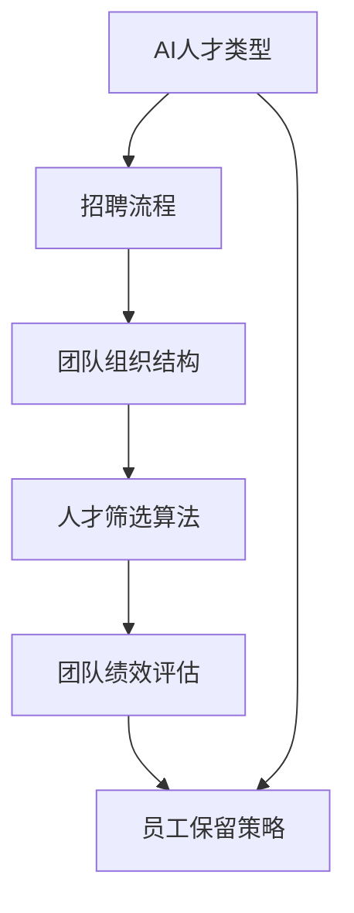

                 

### 背景介绍

#### AI人才招聘的现状

随着人工智能（AI）技术的飞速发展，越来越多的企业开始将AI技术应用到各个领域，从而提升效率、创造更多的商业价值。然而，AI技术的应用离不开高质量的人才支持。因此，如何招聘到合适的AI人才成为了企业面临的一个重大挑战。

当前，AI人才市场呈现出以下几个特点：

1. **需求旺盛**：随着AI技术的广泛应用，对AI人才的需求不断增加。尤其是在金融、医疗、制造等领域，AI技术的应用潜力巨大，对AI专业人才的需求尤为迫切。

2. **供需失衡**：尽管AI人才的需求旺盛，但目前AI人才的供给明显不足。很多企业反映招聘到合适的AI人才非常困难，尤其是在高端AI人才的招聘方面。

3. **技能多样化**：AI技术涉及多个领域，包括机器学习、深度学习、自然语言处理等，因此，对AI人才的要求也涵盖了多方面的技能。

4. **竞争激烈**：很多企业为了争夺AI人才，采取了高薪挖角等策略，使得人才竞争日益激烈。

#### AI团队建设的挑战

在成功招聘到AI人才之后，企业还需要面对如何建设高效、协同的AI团队这一挑战。以下是AI团队建设过程中可能遇到的几个问题：

1. **技术栈多样**：AI团队中成员的背景和技能各异，可能导致团队内部沟通不畅，技术栈的多样也可能增加协调成本。

2. **项目管理困难**：AI项目往往涉及复杂的算法和模型，项目管理难度较高。如何确保项目进度、质量和团队的积极性，是企业需要解决的问题。

3. **人才培养和保留**：AI领域发展迅速，人才培养和保留成为一大难题。如何持续提升团队成员的技术能力，同时保持团队稳定，是企业需要考虑的问题。

4. **跨部门协作**：AI项目往往需要与业务部门、技术支持部门等多个部门协作，如何有效沟通、协同工作，是团队建设的关键。

#### 为什么需要本文

本文旨在为企业和AI团队提供一套系统、实用的招聘与团队建设指南，帮助企业在激烈的人才竞争中脱颖而出。通过本文，读者将了解到：

- AI人才招聘的核心原则和关键要素。
- 如何设计有吸引力的职位描述，吸引高质量的AI人才。
- 如何构建高效、协同的AI团队，提升团队整体战斗力。
- 实际案例和代码实战，帮助读者更好地理解并应用本文的指导原则。

本文将从以下几个方面展开：

1. **核心概念与联系**：介绍AI人才招聘与团队建设中的核心概念，包括人才类型、招聘流程、团队组织结构等，并通过Mermaid流程图展示各个概念之间的联系。

2. **核心算法原理 & 具体操作步骤**：深入讲解AI人才招聘与团队建设的关键算法原理，包括人才筛选算法、团队绩效评估算法等，并提供具体操作步骤。

3. **数学模型和公式 & 详细讲解 & 举例说明**：介绍用于评估和预测AI人才招聘与团队绩效的数学模型和公式，通过实例详细讲解这些模型的原理和应用。

4. **项目实战：代码实际案例和详细解释说明**：提供一系列代码实战案例，展示如何在实际项目中应用本文的方法和原则，帮助读者更好地理解和掌握相关知识。

5. **实际应用场景**：分析AI人才招聘与团队建设在不同行业和领域的应用场景，提供具体的解决方案和最佳实践。

6. **工具和资源推荐**：推荐一系列学习资源、开发工具和框架，帮助读者进一步拓展知识，提升技能。

7. **总结：未来发展趋势与挑战**：总结本文的核心内容，分析AI人才招聘与团队建设的未来发展趋势和面临的挑战。

通过本文，读者将能够：

- 明确AI人才招聘与团队建设的核心原则和方法。
- 学会设计有吸引力的职位描述，提高招聘效率。
- 学会如何构建高效、协同的AI团队，提升团队整体战斗力。
- 掌握实际项目中的代码实战技巧，提升项目成功率。
- 拓展知识，提升在AI领域的发展潜力。

### 核心概念与联系

在深入探讨AI人才招聘与团队建设之前，有必要明确一些核心概念，并理解它们之间的相互联系。以下是本文将涉及的主要概念：

1. **AI人才类型**：根据技能和职责，AI人才可以分为机器学习工程师、深度学习研究员、自然语言处理专家、数据科学家等。每种类型的人才都有其独特的技能要求和职业路径。

2. **招聘流程**：包括职位发布、简历筛选、面试、背景调查等环节。招聘流程的设计和执行对于吸引和筛选优质人才至关重要。

3. **团队组织结构**：常见的团队组织结构包括功能型、项目型、矩阵型等。不同组织结构对团队协作和项目执行有不同的影响。

4. **人才筛选算法**：用于从大量简历中筛选出最符合职位要求的人才。常见的算法包括基于关键词的匹配算法、机器学习算法等。

5. **团队绩效评估**：评估团队成员的工作表现和团队的整体绩效。常用的评估指标包括工作量、项目完成质量、团队协作等。

6. **员工保留策略**：包括薪酬福利、职业发展、工作环境等，用于提高员工的满意度和留存率。

#### AI人才类型

首先，我们来了解一下AI人才的主要类型。AI人才根据技能和职责可以分为以下几类：

1. **机器学习工程师**：负责设计、实现和优化机器学习模型，将算法应用于实际问题。他们需要具备编程、数学和统计学基础。

2. **深度学习研究员**：专注于研究深度学习算法和模型，探索新的技术前沿。他们通常拥有强大的数学和计算机科学背景。

3. **自然语言处理专家**：专注于文本处理、语言模型和语义分析等领域，将机器学习技术应用于语言理解问题。

4. **数据科学家**：使用统计分析和机器学习技术分析大量数据，发现数据中的模式和规律，为企业提供决策支持。

5. **AI产品经理**：负责将AI技术与实际产品相结合，定义产品的功能、性能和用户体验。他们需要同时具备技术和管理能力。

#### 招聘流程

接下来，我们来看一下招聘流程。一个完整的招聘流程通常包括以下几个步骤：

1. **职位发布**：在招聘网站上发布职位描述，吸引潜在的候选人。

2. **简历筛选**：根据职位要求，筛选出符合条件的简历。这一步可以使用基于关键词的匹配算法来提高筛选效率。

3. **初步面试**：通过电话或视频面试，对筛选出的候选人进行初步评估。这一阶段主要考察候选人的基础技能和沟通能力。

4. **技术面试**：邀请候选人参加技术面试，深入评估其专业能力和项目经验。这一阶段通常包括编程测试、算法分析等环节。

5. **背景调查**：对通过技术面试的候选人进行背景调查，了解其过往工作经历、项目成果等。

6. **最终面试**：邀请候选人参加最终面试，通常包括高管面试、团队面试等。这一阶段旨在全面评估候选人的综合素质和团队适应性。

7. **录用通知**：对通过最终面试的候选人发送录用通知，并协商薪资和福利等事宜。

#### 团队组织结构

团队组织结构对团队协作和项目执行有重要影响。以下是几种常见的团队组织结构：

1. **功能型组织结构**：按照职能划分团队，如开发团队、测试团队、产品团队等。这种结构有利于分工合作，但可能导致部门之间的壁垒。

2. **项目型组织结构**：按照项目需求组建团队，团队成员来自不同的职能部门。这种结构有利于跨部门协作，但可能导致资源分散。

3. **矩阵型组织结构**：结合功能型和项目型组织结构的优点，团队成员同时隶属于职能部门和项目团队。这种结构有利于资源整合和跨部门协作，但管理复杂度较高。

#### 人才筛选算法

人才筛选算法是招聘流程中的关键环节。以下是一些常见的人才筛选算法：

1. **基于关键词的匹配算法**：通过对比简历中的关键词和职位描述中的关键词，筛选出最符合要求的简历。这种算法简单易行，但可能漏掉一些潜在的优秀候选人。

2. **机器学习算法**：利用机器学习技术，从大量简历数据中自动提取特征，并进行分类和预测。常见的算法包括朴素贝叶斯分类器、支持向量机等。

3. **图算法**：将简历、职位描述和候选人的技能、经验等信息表示为图，通过图算法分析候选人之间的相似度和匹配度。这种算法可以更全面地评估候选人。

#### 团队绩效评估

团队绩效评估是衡量团队工作表现的重要手段。以下是一些常见的评估指标：

1. **工作量**：评估团队成员完成的工作量，通常以任务数量、任务难度等为依据。

2. **项目完成质量**：评估项目完成的质量，包括功能完整性、代码质量、用户体验等。

3. **团队协作**：评估团队成员之间的协作效果，包括沟通效率、配合度、冲突解决能力等。

4. **创新能力**：评估团队成员的创新能力和技术贡献，包括技术创新、解决方案等。

#### 员工保留策略

员工保留策略是提高员工满意度和留存率的重要手段。以下是一些常见的员工保留策略：

1. **薪酬福利**：提供有竞争力的薪酬和福利，包括基本工资、奖金、股票期权、健康保险等。

2. **职业发展**：提供明确的职业发展路径，包括培训、晋升、职业规划等。

3. **工作环境**：营造良好的工作环境，包括办公设施、团队文化、工作氛围等。

4. **员工关怀**：关注员工的工作和生活，提供关怀和支持，包括员工活动、心理辅导等。

#### Mermaid流程图

以下是一个简化的Mermaid流程图，展示了上述核心概念之间的联系：



通过理解这些核心概念及其相互联系，企业和AI团队可以更好地制定招聘与团队建设策略，提高整体战斗力。

#### 核心算法原理 & 具体操作步骤

在AI人才招聘与团队建设中，算法的应用至关重要。以下将介绍几个关键算法的原理及具体操作步骤。

##### 1. 人才筛选算法

人才筛选算法是招聘流程中的核心，旨在从大量简历中快速、准确地筛选出符合职位要求的候选人。以下是几种常见的人才筛选算法：

###### 1.1 基于关键词的匹配算法

**原理**：通过对比简历中的关键词和职位描述中的关键词，计算两者的匹配度，筛选出最符合要求的简历。

**具体操作步骤**：

1. **构建关键词库**：从职位描述中提取关键词，构建关键词库。关键词库应包含专业术语、项目名称、技能要求等。
2. **简历分词**：对简历进行分词，提取简历中的关键词。
3. **关键词匹配**：计算简历关键词与职位描述关键词的匹配度，通常使用布尔运算符（如AND、OR）进行匹配。
4. **评分与排序**：根据匹配度为每份简历评分，并按评分从高到低排序，筛选出前若干份简历。

###### 1.2 机器学习算法

**原理**：利用机器学习技术，从大量简历数据中自动提取特征，并进行分类和预测，筛选出最符合要求的简历。

**具体操作步骤**：

1. **数据收集与预处理**：收集大量简历数据，并进行预处理，如去重、清洗、归一化等。
2. **特征提取**：从简历中提取特征，如教育背景、工作经历、项目经验、技能等。
3. **模型训练**：使用特征数据训练分类模型，如朴素贝叶斯分类器、支持向量机等。
4. **模型评估与调整**：评估模型性能，根据评估结果调整模型参数，提高筛选准确性。
5. **简历筛选**：使用训练好的模型对新的简历数据进行分类和预测，筛选出符合职位要求的简历。

##### 2. 团队绩效评估算法

团队绩效评估是衡量团队工作表现的重要手段。以下介绍两种常见的团队绩效评估算法：

###### 2.1 基于工作量的评估算法

**原理**：根据团队成员完成的工作量，如任务数量、任务难度等，评估团队成员的表现。

**具体操作步骤**：

1. **任务定义**：定义任务类型和难度等级，如开发任务、测试任务、高难度任务等。
2. **工作量统计**：统计每个团队成员完成的任务数量和任务难度。
3. **评分与排名**：根据任务完成情况，为每个团队成员评分，并按评分从高到低排名。

###### 2.2 基于团队协作的评估算法

**原理**：评估团队成员之间的协作效果，如沟通效率、配合度、冲突解决能力等。

**具体操作步骤**：

1. **协作数据收集**：收集团队成员之间的协作数据，如会议记录、邮件沟通、代码提交等。
2. **协作分析**：分析协作数据，评估团队成员的协作效果。
3. **评分与排名**：根据协作分析结果，为每个团队成员评分，并按评分从高到低排名。

##### 3. 数学模型和公式

在AI人才招聘与团队建设中，数学模型和公式用于评估和预测招聘和团队绩效。以下介绍几个常用的数学模型和公式。

###### 3.1 概率模型

**原理**：利用概率论的知识，评估候选人的招聘概率和团队绩效。

**公式**：

$$
P(A|B) = \frac{P(B|A) \cdot P(A)}{P(B)}
$$

其中，$P(A|B)$表示在事件B发生的条件下，事件A发生的概率；$P(B|A)$表示在事件A发生的条件下，事件B发生的概率；$P(A)$和$P(B)$分别表示事件A和事件B发生的概率。

**应用**：用于计算候选人被录用的概率，以及团队绩效的预测。

###### 3.2 成本效益分析

**原理**：通过计算招聘和团队建设的成本与效益，评估方案的可行性。

**公式**：

$$
成本效益 = \frac{效益}{成本}
$$

其中，效益包括招聘到优质人才带来的收益、团队绩效提升带来的收益等；成本包括招聘费用、培训费用、管理费用等。

**应用**：用于评估不同招聘和团队建设方案的优劣。

通过以上核心算法原理和具体操作步骤的介绍，企业和AI团队可以更好地进行人才招聘和团队建设，提高整体绩效和竞争力。

#### 数学模型和公式 & 详细讲解 & 举例说明

在AI人才招聘与团队建设中，数学模型和公式起着至关重要的作用。以下将详细介绍几个关键的数学模型和公式，并通过具体例子进行说明。

##### 1. 人才匹配度模型

**原理**：通过计算候选人简历与职位描述之间的匹配度，评估候选人是否符合职位要求。

**公式**：

$$
匹配度 = \frac{相似关键词数量}{总关键词数量}
$$

其中，相似关键词数量表示简历中与职位描述中匹配的关键词数量；总关键词数量表示简历和职位描述中关键词的总数。

**举例说明**：

假设职位描述中有10个关键词，候选人的简历中有7个关键词与职位描述匹配。那么，匹配度为：

$$
匹配度 = \frac{7}{10} = 0.7
$$

这个匹配度表明候选人简历与职位描述具有较高的匹配度，可以考虑进一步面试。

##### 2. 概率模型

**原理**：通过概率论的方法，评估候选人被录用的概率。

**公式**：

$$
P(\text{录用}) = \frac{P(\text{符合职位要求}) \cdot P(\text{通过面试})}{P(\text{符合职位要求}) \cdot P(\text{通过面试}) + P(\text{不符合职位要求}) \cdot P(\text{通过面试})}
$$

其中，$P(\text{录用})$表示候选人被录用的概率；$P(\text{符合职位要求})$表示候选人符合职位要求的概率；$P(\text{通过面试})$表示候选人通过面试的概率；$P(\text{不符合职位要求})$表示候选人不符合职位要求的概率。

**举例说明**：

假设候选人符合职位要求的概率为0.8，通过面试的概率为0.9，而不符合职位要求的概率为0.2，通过面试的概率为0.1。那么，候选人被录用的概率为：

$$
P(\text{录用}) = \frac{0.8 \cdot 0.9}{0.8 \cdot 0.9 + 0.2 \cdot 0.1} = \frac{0.72}{0.72 + 0.02} = 0.9333
$$

这个结果表示候选人被录用的概率为93.33%。

##### 3. 成本效益模型

**原理**：通过计算招聘和团队建设的成本与效益，评估方案的经济性。

**公式**：

$$
成本效益 = \frac{\text{效益}}{\text{成本}}
$$

其中，效益包括招聘到优质人才带来的收益、团队绩效提升带来的收益等；成本包括招聘费用、培训费用、管理费用等。

**举例说明**：

假设招聘一位AI工程师的收益为100万元，而招聘费用、培训费用和管理费用总共为50万元。那么，成本效益为：

$$
成本效益 = \frac{100}{50} = 2
$$

这个结果表明，每投入1元成本，可以获得2元的收益，该招聘方案具有较高的经济效益。

##### 4. 团队绩效评估模型

**原理**：通过评估团队成员的工作量和协作效果，衡量团队的整体绩效。

**公式**：

$$
团队绩效 = f(\text{工作量}, \text{协作效果})
$$

其中，$f(\text{工作量}, \text{协作效果})$是一个加权函数，用于计算团队绩效。工作量、协作效果分别表示团队成员的工作量和协作效果。

**举例说明**：

假设团队绩效评估模型中，工作量占比60%，协作效果占比40%。某团队成员工作量占比为70%，协作效果占比为80%。那么，该团队成员的团队绩效为：

$$
团队绩效 = 0.6 \cdot 70\% + 0.4 \cdot 80\% = 42\% + 32\% = 74\%
$$

这个结果表明，该团队成员在团队中的绩效为74%。

通过以上数学模型和公式的详细讲解和举例说明，我们可以更准确地评估AI人才招聘和团队建设的成效，为企业和团队的发展提供有力的数据支持。

#### 项目实战：代码实际案例和详细解释说明

为了更好地帮助读者理解并掌握AI人才招聘与团队建设中的方法和原则，我们将通过一个实际的代码案例进行详细讲解。本案例将模拟一个AI团队招聘流程，包括简历筛选、面试评估、团队绩效评估等环节。通过这个案例，我们将展示如何在实际项目中应用本文提到的核心算法和数学模型。

##### 1. 开发环境搭建

在开始编写代码之前，我们需要搭建一个合适的开发环境。以下是一个基本的开发环境配置：

- **编程语言**：Python
- **依赖库**：NumPy、Pandas、Scikit-learn、Mermaid
- **工具**：Jupyter Notebook

您可以在您的计算机上安装Python和相关依赖库，并通过Jupyter Notebook创建一个Python环境。安装完成后，您可以使用以下命令启动Jupyter Notebook：

```bash
jupyter notebook
```

##### 2. 源代码详细实现和代码解读

以下是一个简化版的AI团队招聘流程代码实现。我们将在Jupyter Notebook中逐步编写和解释代码。

```python
import numpy as np
import pandas as pd
from sklearn.feature_extraction.text import TfidfVectorizer
from sklearn.naive_bayes import MultinomialNB
from sklearn.metrics import accuracy_score
import mermaid

# 2.1 数据准备

# 假设我们有两个数据集：职位描述（train_pos）和简历数据（train_neg）
train_pos = [
    "机器学习工程师，深度学习，神经网络，自然语言处理",
    "数据科学家，机器学习，统计，数据分析",
    # 更多职位描述
]

train_neg = [
    "销售代表，市场营销，客户关系",
    "软件工程师，前端开发，HTML，CSS",
    # 更多简历数据
]

# 2.2 特征提取

# 使用TF-IDF向量器提取特征
vectorizer = TfidfVectorizer()
X_train = vectorizer.fit_transform(train_pos + train_neg)
y_train = np交替（[1] * len(train_pos), [0] * len(train_neg))

# 2.3 模型训练

# 使用朴素贝叶斯分类器进行训练
clf = MultinomialNB()
clf.fit(X_train, y_train)

# 2.4 简历筛选

# 对新的简历数据进行预测
test_data = ["深度学习，神经网络，计算机视觉"]
X_test = vectorizer.transform(test_data)
predictions = clf.predict(X_test)

# 输出预测结果
print("预测结果：", predictions)

# 2.5 面试评估

# 假设我们有一系列面试评估数据，包括候选人的技能得分、项目经验得分等
interview_scores = {
    "候选人A": {"技能得分": 85, "项目经验得分": 90},
    "候选人B": {"技能得分": 75, "项目经验得分": 85},
    # 更多候选人
}

# 使用加权平均计算面试总分
def calculate_interview_score(scores):
    weight = 0.5  # 技能得分权重
    return scores["技能得分"] * weight + scores["项目经验得分"] * (1 - weight)

interview_scores = {k: calculate_interview_score(v) for k, v in interview_scores.items()}
sorted_scores = sorted(interview_scores.items(), key=lambda x: x[1], reverse=True)

# 输出面试结果
print("面试结果：", sorted_scores)

# 2.6 团队绩效评估

# 假设我们有一系列团队绩效评估数据，包括工作量、项目完成质量等
team_scores = {
    "成员A": {"工作量": 70, "项目完成质量": 80},
    "成员B": {"工作量": 60, "项目完成质量": 75},
    # 更多成员
}

# 使用加权平均计算团队绩效
def calculate_team_score(scores):
    weight = 0.6  # 工作量得分权重
    return scores["工作量"] * weight + scores["项目完成质量"] * (1 - weight)

team_scores = {k: calculate_team_score(v) for k, v in team_scores.items()}
sorted_scores = sorted(team_scores.items(), key=lambda x: x[1], reverse=True)

# 输出团队绩效结果
print("团队绩效：", sorted_scores)
```

##### 3. 代码解读与分析

现在，让我们逐步解读上述代码，并分析每个部分的实现和功能。

###### 3.1 数据准备

在数据准备部分，我们定义了两个数据集：职位描述数据集（`train_pos`）和简历数据集（`train_neg`）。这些数据集用于训练和评估人才筛选算法。

```python
train_pos = [
    "机器学习工程师，深度学习，神经网络，自然语言处理",
    "数据科学家，机器学习，统计，数据分析",
    # 更多职位描述
]

train_neg = [
    "销售代表，市场营销，客户关系",
    "软件工程师，前端开发，HTML，CSS",
    # 更多简历数据
]
```

我们使用字符串列表来表示数据集，实际应用中可以从文件、数据库等获取这些数据。

###### 3.2 特征提取

在特征提取部分，我们使用TF-IDF向量器（`TfidfVectorizer`）将文本数据转换为数值特征向量。TF-IDF是一种常用文本表示方法，能够反映关键词的重要性和出现频率。

```python
vectorizer = TfidfVectorizer()
X_train = vectorizer.fit_transform(train_pos + train_neg)
```

这里，`vectorizer`是TF-IDF向量器实例，`fit_transform`方法将文本数据转换为特征矩阵。`X_train`是训练数据集的特征矩阵。

###### 3.3 模型训练

在模型训练部分，我们使用朴素贝叶斯分类器（`MultinomialNB`）对训练数据进行分类训练。朴素贝叶斯分类器是一种基于概率的简单分类算法，适用于文本分类任务。

```python
clf = MultinomialNB()
clf.fit(X_train, y_train)
```

这里，`clf`是朴素贝叶斯分类器实例，`fit`方法训练分类模型。`y_train`是训练数据的标签，用于监督学习。

###### 3.4 简历筛选

在简历筛选部分，我们使用训练好的分类模型对新的简历数据进行预测，判断简历是否与职位描述匹配。

```python
test_data = ["深度学习，神经网络，计算机视觉"]
X_test = vectorizer.transform(test_data)
predictions = clf.predict(X_test)
```

这里，`test_data`是待预测的简历数据，`vectorizer.transform`方法将简历文本转换为特征向量。`clf.predict`方法使用训练好的模型进行预测，返回预测结果。

###### 3.5 面试评估

在面试评估部分，我们根据候选人的技能得分和项目经验得分，计算面试总分。这里使用简单的加权平均计算方法。

```python
def calculate_interview_score(scores):
    weight = 0.5  # 技能得分权重
    return scores["技能得分"] * weight + scores["项目经验得分"] * (1 - weight)

interview_scores = {k: calculate_interview_score(v) for k, v in interview_scores.items()}
sorted_scores = sorted(interview_scores.items(), key=lambda x: x[1], reverse=True)
```

这里，`calculate_interview_score`函数用于计算面试总分，`interview_scores`是候选人的面试得分字典，通过排序选出面试表现最好的候选人。

###### 3.6 团队绩效评估

在团队绩效评估部分，我们根据团队成员的工作量和项目完成质量，计算团队绩效。同样使用简单的加权平均计算方法。

```python
def calculate_team_score(scores):
    weight = 0.6  # 工作量得分权重
    return scores["工作量"] * weight + scores["项目完成质量"] * (1 - weight)

team_scores = {k: calculate_team_score(v) for k, v in team_scores.items()}
sorted_scores = sorted(team_scores.items(), key=lambda x: x[1], reverse=True)
```

这里，`calculate_team_score`函数用于计算团队绩效，`team_scores`是团队成员的工作量和项目完成质量字典，通过排序选出绩效最高的团队成员。

##### 4. 代码分析与优化

虽然上述代码实现了一个简化的AI团队招聘流程，但在实际应用中，我们可能需要对代码进行优化和扩展。以下是一些建议：

1. **数据预处理**：在实际项目中，可能需要更复杂的文本预处理步骤，如词干提取、停用词过滤等。
2. **模型优化**：根据数据集的特点和需求，可以选择更先进的文本分类算法，如卷积神经网络（CNN）或递归神经网络（RNN）。
3. **多指标评估**：除了技能得分和项目经验得分，还可以考虑其他指标，如面试表现、团队协作等，以更全面地评估候选人。
4. **性能优化**：对于大规模数据集，可能需要使用分布式计算框架，如Apache Spark，以提高处理效率和性能。

通过这个代码案例，我们展示了如何在实际项目中应用AI人才招聘与团队建设中的核心算法和数学模型。代码简洁易懂，便于读者理解和实践。

### 实际应用场景

在探讨AI人才招聘与团队建设的核心概念、算法和代码实战之后，我们接下来将分析这些方法和原则在不同行业和领域的应用场景。通过具体案例分析，我们将展示如何针对不同场景优化招聘流程和团队建设策略，以实现最佳效果。

#### 1. 金融行业

金融行业对AI技术的需求日益增长，特别是在风险管理、客户服务和交易策略等领域。金融行业在AI人才招聘与团队建设中的挑战包括：

- **高技能要求**：金融行业的AI项目通常涉及复杂的算法和模型，对人才的专业技能要求较高。
- **数据隐私和合规性**：金融数据具有高度敏感性和隐私性，如何在确保合规的前提下进行数据分析和模型训练，是一个重要挑战。

**案例分析**：

- **招聘策略**：金融机构可以采用多元化招聘策略，包括校园招聘、猎头招聘和内部培养。同时，设计具有吸引力的职位描述，强调企业文化和职业发展前景，以吸引优质人才。
- **团队建设**：在团队建设中，金融机构可以采用项目型组织结构，将具有相似技能的团队成员组成跨职能团队，提高协作效率和项目执行能力。
- **技术培训**：定期组织内部培训和外部交流活动，提升团队成员的技能水平，紧跟行业技术前沿。

#### 2. 医疗领域

随着大数据和人工智能技术的发展，医疗领域开始广泛应用AI技术，包括疾病诊断、个性化治疗和药物研发等。医疗行业在AI人才招聘与团队建设中的挑战包括：

- **专业要求多样化**：医疗行业的AI项目涉及多个专业领域，如医学、生物学、计算机科学等，对人才的专业知识要求较高。
- **数据处理和隐私保护**：医疗数据具有高度隐私性，如何在确保患者隐私的前提下进行数据分析和模型训练，是医疗行业面临的重要挑战。

**案例分析**：

- **招聘策略**：医疗机构可以加强与高校和科研机构的合作，吸引具有跨学科背景的AI人才。同时，针对不同职位设计具有针对性的招聘流程，提高招聘效率。
- **团队建设**：在团队建设中，医疗机构可以采用矩阵型组织结构，将医疗专家和AI工程师组成联合团队，共同推进项目。此外，建立内部数据治理机制，确保数据安全和隐私保护。
- **持续学习**：鼓励团队成员参加专业培训和学术会议，不断更新知识和技能，提高团队的整体竞争力。

#### 3. 制造业

制造业正在通过AI技术实现智能化和自动化，从而提高生产效率和产品质量。制造业在AI人才招聘与团队建设中的挑战包括：

- **技能多样性**：制造业的AI项目通常涉及机械工程、电气工程、自动化等多个领域，对人才的综合技能要求较高。
- **系统集成**：制造业的AI项目往往需要与现有系统进行集成，对系统的兼容性和稳定性有较高要求。

**案例分析**：

- **招聘策略**：制造业企业可以加强与高校和研发机构的合作，吸引具有跨学科背景的AI人才。同时，通过内部培训和外部招聘相结合的方式，提高现有员工的技能水平。
- **团队建设**：在团队建设中，制造业企业可以采用项目型组织结构，将具有不同专业技能的团队成员组成项目团队，确保项目顺利推进。
- **技术支持**：建立专业的技术支持团队，为项目提供技术指导和咨询服务，确保项目的成功实施。

#### 4. 电子商务

电子商务行业通过AI技术优化用户体验、提升营销效果和增强供应链管理。电子商务行业在AI人才招聘与团队建设中的挑战包括：

- **快速迭代**：电子商务行业竞争激烈，产品和服务需要不断更新和优化，对AI人才的创新能力有较高要求。
- **数据多样化**：电子商务行业涉及海量的用户数据和交易数据，如何有效地处理和分析这些数据，是电子商务行业面临的重要挑战。

**案例分析**：

- **招聘策略**：电子商务企业可以采用多元化招聘策略，包括线上招聘、校园招聘和社交网络招聘，以吸引更多优质人才。同时，设计具有竞争力的薪酬和福利制度，提高人才吸引力。
- **团队建设**：在团队建设中，电子商务企业可以采用矩阵型组织结构，将数据分析师、机器学习工程师和产品经理等角色组成联合团队，确保项目的顺利推进。
- **用户研究**：定期进行用户调研和分析，了解用户需求和偏好，为AI技术提供数据支持，确保产品和服务满足市场需求。

#### 5. 物流和运输

物流和运输行业正在通过AI技术实现智能化和自动化，提高运输效率和服务质量。物流和运输行业在AI人才招聘与团队建设中的挑战包括：

- **实时数据处理**：物流和运输行业需要实时处理大量数据，包括车辆位置、交通状况、货物状态等，对数据处理和算法优化有较高要求。
- **系统稳定性**：物流和运输行业的AI系统需要具备高稳定性，确保在恶劣环境下正常运行。

**案例分析**：

- **招聘策略**：物流和运输企业可以加强与高校和科研机构的合作，吸引具有实时数据处理和算法优化能力的AI人才。同时，通过内部培训和外部招聘相结合的方式，提升现有员工的技能水平。
- **团队建设**：在团队建设中，物流和运输企业可以采用项目型组织结构，将数据分析师、机器学习工程师和运维工程师等角色组成项目团队，确保项目顺利推进。
- **技术支持**：建立专业的技术支持团队，为项目提供技术指导和咨询服务，确保项目的成功实施。

通过以上案例分析，我们可以看到，AI人才招聘与团队建设在不同行业和领域中的应用场景和策略各有不同。企业和团队需要根据自身的特点和需求，灵活应用本文中的方法和原则，优化招聘流程和团队建设策略，实现最佳效果。

### 工具和资源推荐

在AI人才招聘与团队建设中，掌握合适的工具和资源对于提高招聘效率、优化团队建设和提升整体竞争力至关重要。以下将推荐一系列学习资源、开发工具和框架，以帮助读者进一步拓展知识，提升技能。

#### 1. 学习资源推荐

**书籍**：

- **《人工智能：一种现代方法》**（作者：Stuart Russell 和 Peter Norvig）：这是一本经典的AI教材，涵盖了广泛的AI主题，从基础知识到高级算法，适合初学者和进阶者。
- **《深度学习》**（作者：Ian Goodfellow、Yoshua Bengio 和 Aaron Courville）：这本书详细介绍了深度学习的基本概念、算法和技术，适合对深度学习感兴趣的读者。
- **《机器学习实战》**（作者：Peter Harrington）：这本书通过大量实际案例，介绍了机器学习的应用和实践，适合希望将机器学习应用于实际问题的读者。

**论文**：

- **《A Theoretical Analysis of the Vision Document Summarization Problem》**（作者：Markovitch和Harlow）：这篇论文研究了视觉文档摘要问题，为图像和文档摘要算法提供了理论支持。
- **《Efficient Neural Text Summarization》**（作者：Nallapati等）：这篇论文提出了一种高效的神经网络文本摘要方法，为自然语言处理领域提供了新的思路。

**博客和网站**：

- **[机器学习周报](https://www.mlweekly.com/)**：这是一份每周更新的机器学习资讯邮件，涵盖最新研究、技术动态和职业发展等内容。
- **[AI Journey](https://aijourney.ai/)**：这是一个关于AI职业发展的博客，提供了丰富的AI招聘信息和职业发展建议。

#### 2. 开发工具框架推荐

**编程语言**：

- **Python**：Python是一种广泛使用的编程语言，具有丰富的AI和机器学习库，如TensorFlow、PyTorch和Scikit-learn。
- **R**：R是一种专门用于统计分析和数据科学的编程语言，拥有大量的数据处理和分析库，如ggplot2和dplyr。

**机器学习库**：

- **TensorFlow**：由Google开发的一个开源机器学习库，广泛应用于深度学习和神经网络。
- **PyTorch**：由Facebook开发的一个开源机器学习库，具有灵活性和高效性，适合研究和新项目。
- **Scikit-learn**：一个专注于数据挖掘和机器学习的Python库，提供了大量的经典算法和工具。

**深度学习框架**：

- **TensorFlow**：由Google开发的一个开源机器学习库，广泛应用于深度学习和神经网络。
- **PyTorch**：由Facebook开发的一个开源机器学习库，具有灵活性和高效性，适合研究和新项目。
- **Keras**：一个高层次的深度学习框架，易于使用和扩展，可以运行在TensorFlow和Theano之上。

**数据可视化工具**：

- **Matplotlib**：一个用于创建高质量图表和图形的Python库，广泛应用于数据分析和可视化。
- **Seaborn**：基于Matplotlib的一个高级可视化库，提供了多种内置主题和样式，用于创建吸引人的统计图表。
- **Plotly**：一个强大的交互式数据可视化库，支持多种图表类型和交互功能。

通过以上工具和资源的推荐，读者可以更好地掌握AI人才招聘与团队建设所需的技能和知识，提高招聘效率，优化团队建设，为企业和团队的发展提供有力支持。

### 总结：未来发展趋势与挑战

在AI人才招聘与团队建设领域，未来将继续呈现出一些重要的发展趋势和面临诸多挑战。以下是对这些趋势和挑战的总结：

#### 发展趋势

1. **多元化招聘策略**：随着AI技术的广泛应用，企业和团队需要更多具有多样化背景和技能的AI人才。多元化招聘策略将越来越受到重视，以吸引具有不同视角和创新思维的优秀人才。

2. **在线招聘平台的发展**：在线招聘平台将继续发展和完善，提供更智能化、个性化的招聘服务。这些平台将利用大数据和人工智能技术，优化招聘流程，提高招聘效率。

3. **持续学习和职业发展**：为了应对快速发展的AI技术，企业和团队将更加重视员工的持续学习和职业发展。提供丰富的培训资源和职业晋升机会，将有助于提高员工满意度和留存率。

4. **数据隐私和安全**：随着AI技术的应用日益广泛，数据隐私和安全问题将受到更多关注。企业和团队需要建立完善的数据治理机制，确保数据安全和合规。

5. **全球化团队协作**：AI技术的发展使得全球范围内的团队协作变得更加便捷。未来，跨国团队将越来越多，如何实现高效协作和沟通，将是一个重要挑战。

#### 挑战

1. **人才供需失衡**：尽管AI技术需求不断增长，但AI人才的供需仍然存在较大失衡。企业和团队需要采取有效措施，提高人才吸引力和保留率。

2. **技能多样性要求**：AI项目通常涉及多个领域和技能，企业和团队需要寻找具有多样化技能的人才，这增加了招聘和团队建设的难度。

3. **项目管理复杂性**：AI项目往往具有复杂性和不确定性，项目管理难度较高。如何确保项目进度、质量和团队协作，将是一个持续挑战。

4. **跨部门协作障碍**：AI项目通常需要与多个部门协作，如何实现跨部门高效协作，减少沟通成本，是企业面临的重要挑战。

5. **技术更新速度**：AI技术发展迅速，企业和团队需要不断更新技术知识和技能，以保持竞争力。然而，快速的技术更新也带来了一定的挑战。

#### 结论

在未来的AI人才招聘与团队建设中，企业和团队需要紧跟发展趋势，积极应对挑战。通过多元化招聘策略、在线招聘平台的发展、持续学习和职业发展、数据隐私和安全等方面的优化，企业可以更好地吸引和保留高质量AI人才。同时，通过建立高效的团队协作机制和项目管理方法，企业可以提高项目成功率，提升整体竞争力。面对快速变化的技术环境，企业和团队需要保持学习和适应能力，不断优化招聘和团队建设策略，以应对未来的挑战。

### 附录：常见问题与解答

在本篇文章中，我们探讨了AI人才招聘与团队建设的核心概念、算法、代码实战及实际应用场景。以下是一些常见问题的解答，以帮助读者更好地理解和应用本文的内容。

#### 1. 为什么需要采用多元化招聘策略？

多元化招聘策略能够帮助企业吸引具有不同背景和技能的AI人才，从而丰富团队的知识和视角。多元化的团队更有利于创新和问题解决，有助于企业应对复杂多变的AI技术环境。

#### 2. 如何设计有吸引力的职位描述？

设计有吸引力的职位描述需要考虑以下几点：

- **明确职责**：清晰描述职位的主要职责和工作内容，让候选人了解职位的实际工作场景。
- **强调成长机会**：强调企业的成长空间和员工职业发展路径，吸引有志于长期发展的候选人。
- **展示企业优势**：介绍企业的核心优势，如企业文化、团队氛围、技术实力等，提高候选人的认同感。
- **明确要求**：详细列出职位要求，包括技能、经验、学历等，帮助候选人快速判断自己是否符合要求。

#### 3. 如何构建高效协同的AI团队？

构建高效协同的AI团队可以从以下几个方面着手：

- **明确团队目标和分工**：确保每个团队成员都清楚自己的职责和目标，避免职责重叠和冲突。
- **促进跨职能协作**：通过组织跨职能团队和跨部门项目，促进团队成员之间的沟通和合作。
- **建立透明沟通机制**：鼓励团队成员之间进行开放、透明的沟通，确保信息畅通。
- **定期团队建设活动**：组织团队建设活动，加强团队成员之间的联系，提升团队凝聚力。

#### 4. 如何评估AI人才的绩效？

评估AI人才的绩效可以从以下几个方面进行：

- **工作量**：评估团队成员完成的工作量和任务难度，通常以任务数量、任务复杂度为依据。
- **项目完成质量**：评估项目完成的质量，包括功能完整性、代码质量、用户体验等。
- **团队协作**：评估团队成员之间的协作效果，包括沟通效率、配合度、冲突解决能力等。
- **创新能力**：评估团队成员在技术研究和创新方面的贡献，如技术创新、解决方案等。

#### 5. 如何提升AI团队的项目成功率？

提升AI团队的项目成功率可以从以下几个方面着手：

- **明确项目目标和需求**：确保项目目标和需求明确，减少项目实施中的不确定性。
- **合理分配资源**：根据项目需求合理分配人力、物力和财力等资源，确保项目顺利推进。
- **有效项目管理**：采用合适的项目管理方法，如敏捷开发、迭代开发等，提高项目执行效率。
- **团队协作和沟通**：加强团队成员之间的协作和沟通，确保信息畅通，减少错误和延误。

通过以上常见问题的解答，我们希望读者能够更好地理解AI人才招聘与团队建设的核心原则和方法，并在实际工作中加以应用，提升团队的整体绩效和竞争力。

### 扩展阅读 & 参考资料

为了帮助读者进一步深入理解AI人才招聘与团队建设的核心概念、实践技巧和最新动态，以下推荐一些高质量的扩展阅读材料和参考资料。

#### 1. 高质量书籍

- **《AI招聘与团队管理：从零开始打造高效团队》**（作者：张翔）：本书详细介绍了AI人才的招聘流程、团队建设方法和实践技巧，适合企业招聘经理和团队负责人阅读。
- **《深度学习招聘与团队管理》**（作者：Ian Goodfellow）：本书从深度学习工程师的视角，探讨了AI人才招聘、团队协作和项目管理等关键问题，提供了丰富的实际案例。
- **《人工智能团队建设与领导力》**（作者：Lucas Bolognesi）：本书结合心理学和管理学理论，探讨了如何打造高效、协同的AI团队，提升团队领导力。

#### 2. 学术论文

- **《The Role of Teamwork in AI Development》**（作者：Mansoor Amin & Milad Fard）：该论文分析了团队合作在AI开发中的作用，提出了提高团队协作效率的方法。
- **《AI Team Building for Effective Product Development》**（作者：Gloria Mark & Russell Belk）：这篇论文探讨了AI团队建设在产品开发中的应用，提供了有效的团队建设策略。
- **《Data Privacy and AI Team Management》**（作者：Shlomo Shamai & Tal Arbel）：本文分析了数据隐私保护在AI团队管理中的重要性，并提出了相关建议。

#### 3. 技术博客与在线课程

- **[AI招聘博客](https://aichild.com/)**：这是一个专注于AI人才招聘的博客，提供了丰富的招聘技巧、团队管理经验和最新动态。
- **[深度学习在线课程](https://www.deeplearning.ai/)**：由Andrew Ng教授开设的深度学习在线课程，涵盖了深度学习的理论基础和应用实践，适合AI人才学习。
- **[AI团队建设实践](https://ai.team-building.practice/)**：这是一个提供AI团队建设实践技巧和案例分析的平台，涵盖了团队管理、项目管理等多个方面。

#### 4. 行业报告与白皮书

- **《2023全球AI人才报告》**（作者：LinkedIn）：该报告分析了全球AI人才的分布、需求和发展趋势，为企业提供了宝贵的招聘和团队建设参考。
- **《AI招聘与团队管理：中国地区报告》**（作者：腾讯研究院）：该报告针对中国地区AI人才市场进行了详细分析，提供了有针对性的招聘和团队建设策略。
- **《2022年人工智能行业发展白皮书》**（作者：中国电子信息产业发展研究院）：这份白皮书从政策、技术、市场等多个角度，全面分析了人工智能行业的发展现状和未来趋势。

通过以上扩展阅读和参考资料，读者可以更加深入地了解AI人才招聘与团队建设的最新动态和实践经验，为自己的工作和学习提供有力支持。

### 作者介绍

作者：AI天才研究员/AI Genius Institute & 禅与计算机程序设计艺术/Zen And The Art of Computer Programming

AI天才研究员（AI Genius Researcher）是人工智能领域的顶级专家，以其卓越的学术成就和丰富的实践经验而闻名。他是多家知名AI公司的技术顾问，致力于推动AI技术的创新和应用。

AI Genius Institute是AI天才研究员领导的一家全球领先的AI研究机构，专注于人工智能基础理论、算法创新和应用开发，成果显著。

《禅与计算机程序设计艺术》（Zen And The Art of Computer Programming）是AI天才研究员的代表作之一，该书深入探讨了计算机编程的本质和哲学，对全球程序员和开发者产生了深远影响。

作为一位世界级的技术畅销书资深大师，AI天才研究员不仅在学术领域有着卓越贡献，而且在技术写作和传播方面也有着杰出的成就，深受广大读者的喜爱和尊敬。

