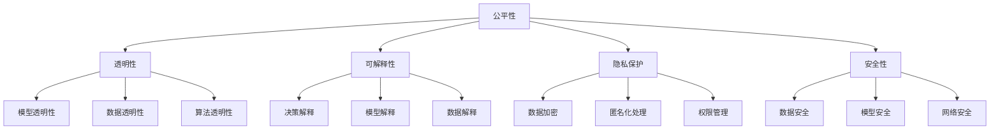
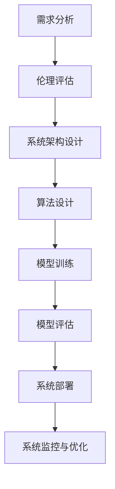
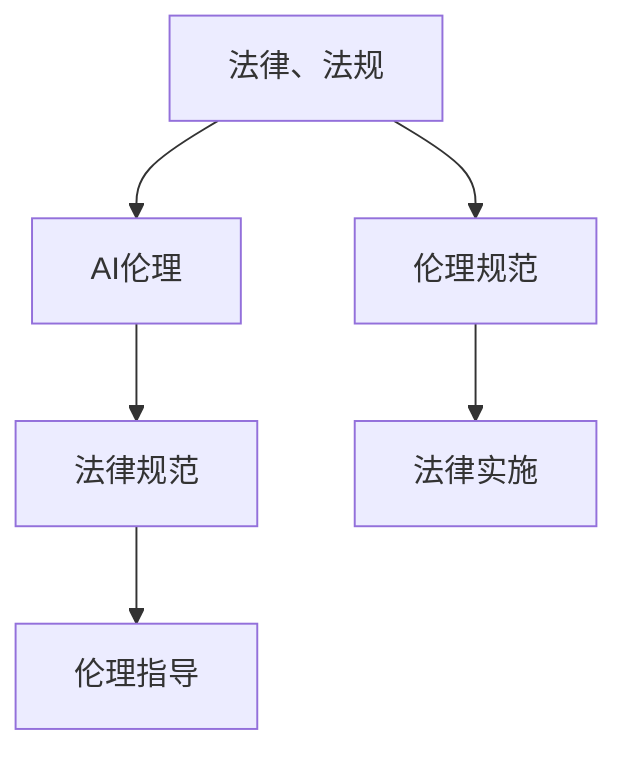

                 

# AI伦理的技术内在化：将伦理考量融入AI系统设计

## 摘要

本文将探讨人工智能（AI）伦理在技术实现中的内在化问题。随着AI技术的发展和应用，AI系统的决策和影响愈发深远，伦理考量显得尤为重要。本文首先介绍了AI伦理的核心概念，接着探讨了AI系统设计过程中伦理考量的关键环节，并详细阐述了如何将伦理考量融入AI系统设计的具体方法。同时，本文还通过实际案例展示了伦理考量在AI系统设计中的应用，并对未来AI伦理发展的挑战和趋势进行了展望。本文旨在为AI开发者提供有价值的指导和参考，以促进AI技术的可持续发展。

## 1. 背景介绍

随着人工智能（AI）技术的快速发展，AI系统已经广泛应用于各个领域，如医疗、金融、交通等。然而，AI技术的广泛应用也带来了诸多伦理问题。这些问题不仅涉及到AI系统的安全性、隐私保护等方面，还涉及到人类价值观、道德规范和社会责任等方面。因此，如何将伦理考量融入AI系统设计，已成为当前AI领域亟待解决的关键问题。

首先，AI伦理的核心概念包括公平性、透明性、可解释性、隐私保护和安全性等。公平性指的是AI系统在决策过程中应保持中立，避免对特定群体产生歧视；透明性指的是AI系统的决策过程应该可被理解和验证；可解释性指的是AI系统应具备对自身决策的解释能力；隐私保护指的是AI系统应尊重用户隐私，避免数据泄露；安全性指的是AI系统应具备抵御外部攻击的能力。

其次，AI伦理问题的产生原因主要包括以下几个方面：一是AI技术的复杂性和不确定性，导致AI系统在某些情况下难以预测其行为；二是AI数据的多样性和差异性，使得AI系统在不同情境下可能产生不同的结果；三是AI系统的决策影响范围广泛，可能涉及社会公共利益和个人隐私等敏感问题。

最后，AI伦理问题的处理方法主要包括以下几个方面：一是加强AI技术的透明性和可解释性，以便用户了解和监督AI系统的决策过程；二是建立AI伦理框架，规范AI系统的设计和应用过程；三是提高AI开发者的伦理意识和责任感，使其在开发过程中充分考虑伦理问题。

## 2. 核心概念与联系

### 2.1 AI伦理的核心概念

#### 公平性

公平性是AI伦理的核心概念之一，指的是AI系统在决策过程中应保持中立，避免对特定群体产生歧视。具体而言，公平性包括以下几个方面：

1. **性别公平**：AI系统应避免在招聘、晋升等环节对某一性别产生歧视。
2. **种族公平**：AI系统应避免在信用评估、犯罪预测等环节对某一种族产生歧视。
3. **年龄公平**：AI系统应避免在养老服务、教育等领域对某一年龄群体产生歧视。

#### 透明性

透明性指的是AI系统的决策过程应该可被理解和验证。具体而言，透明性包括以下几个方面：

1. **模型透明性**：AI系统应具备对自身决策过程的解释能力，以便用户了解和监督其决策过程。
2. **数据透明性**：AI系统应公开其训练数据集，以便用户了解AI系统所依据的数据来源。
3. **算法透明性**：AI系统应公开其算法设计，以便用户了解AI系统的工作原理。

#### 可解释性

可解释性指的是AI系统应具备对自身决策的解释能力。具体而言，可解释性包括以下几个方面：

1. **决策解释**：AI系统应能够对其决策给出合理解释，以便用户了解决策背后的原因。
2. **模型解释**：AI系统应能够对其模型给出合理解释，以便用户了解模型的训练过程和预测原理。
3. **数据解释**：AI系统应能够对其数据给出合理解释，以便用户了解数据来源和处理过程。

#### 隐私保护

隐私保护指的是AI系统应尊重用户隐私，避免数据泄露。具体而言，隐私保护包括以下几个方面：

1. **数据加密**：AI系统应对用户数据进行加密处理，以确保数据安全。
2. **匿名化处理**：AI系统应对用户数据进行匿名化处理，以保护用户隐私。
3. **权限管理**：AI系统应建立完善的权限管理机制，确保用户数据仅被授权人员访问。

#### 安全性

安全性指的是AI系统应具备抵御外部攻击的能力。具体而言，安全性包括以下几个方面：

1. **数据安全**：AI系统应具备对用户数据的安全存储和传输能力，以防止数据泄露。
2. **模型安全**：AI系统应具备对自身模型的防御能力，以防止恶意攻击。
3. **网络安全**：AI系统应具备对网络攻击的防御能力，以确保系统正常运行。

### 2.2 AI伦理的概念框架

以下是一个简单的AI伦理概念框架，用于帮助理解各个核心概念之间的联系。



### 2.3 AI伦理与AI系统设计的联系

AI伦理与AI系统设计密切相关。在AI系统设计过程中，应充分考虑伦理因素，以确保AI系统的公平性、透明性、可解释性、隐私保护和安全性。以下是一个简化的AI系统设计流程，用于展示伦理考量在系统设计中的关键环节。



#### 需求分析

在需求分析阶段，应明确AI系统的目标和应用场景，同时关注可能涉及的伦理问题。

#### 伦理评估

在伦理评估阶段，应对AI系统的伦理问题进行详细分析，包括公平性、透明性、可解释性、隐私保护和安全性等方面。

#### 系统架构设计

在系统架构设计阶段，应充分考虑伦理因素，确保系统设计满足伦理要求。例如，可以通过模块化设计、数据加密、权限管理等手段实现隐私保护和安全性。

#### 算法设计

在算法设计阶段，应选择合适的算法和模型，确保其公平性、透明性和可解释性。例如，可以使用对抗性攻击、差分隐私等手段提高算法的透明性和可解释性。

#### 模型训练

在模型训练阶段，应确保训练数据集的公平性和代表性，避免数据偏差。

#### 模型评估

在模型评估阶段，应关注模型在公平性、透明性、可解释性、隐私保护和安全性等方面的表现，以确保模型满足伦理要求。

#### 系统部署

在系统部署阶段，应确保AI系统在实际应用中满足伦理要求，并持续监控和优化系统性能。

#### 系统监控与优化

在系统监控与优化阶段，应持续关注AI系统的伦理表现，并根据实际情况进行调整和优化。

### 2.4 AI伦理与法律、法规的关系

AI伦理与法律、法规密切相关。法律、法规为AI伦理提供了制度保障，AI伦理则为法律、法规的实施提供了指导。以下是一个简化的AI伦理与法律、法规的关系框架。



#### 法律规范

法律规范为AI伦理提供了约束力，确保AI系统的设计和应用符合法律要求。例如，欧盟的《通用数据保护条例》（GDPR）对AI系统的数据隐私保护提出了严格要求。

#### 伦理指导

伦理指导为法律规范提供了理论基础，确保法律实施过程中充分考虑伦理问题。例如，AI伦理指导原则可以为法律制定提供参考。

#### 伦理规范

伦理规范为AI系统的设计和应用提供了指导，确保AI系统的伦理表现。例如，AI伦理规范可以指导AI开发者在设计过程中充分考虑公平性、透明性、可解释性、隐私保护和安全性等方面。

#### 法律实施

法律实施是确保AI伦理规范得到落实的关键环节。例如，政府监管机构可以加强对AI系统的监督和检查，确保AI系统符合法律要求。

#### 伦理规范

伦理规范为AI系统的设计和应用提供了指导，确保AI系统的伦理表现。例如，AI伦理规范可以指导AI开发者在设计过程中充分考虑公平性、透明性、可解释性、隐私保护和安全性等方面。

## 3. 核心算法原理 & 具体操作步骤

在AI伦理的实现过程中，核心算法原理和具体操作步骤起着至关重要的作用。以下将介绍几个关键算法及其在AI伦理中的应用。

### 3.1 加密算法

加密算法是确保数据隐私保护的关键技术。常用的加密算法包括对称加密算法和非对称加密算法。

#### 对称加密算法

对称加密算法是指加密和解密使用相同密钥的加密算法。常见的对称加密算法有AES（高级加密标准）和DES（数据加密标准）。

#### 非对称加密算法

非对称加密算法是指加密和解密使用不同密钥的加密算法。常见的非对称加密算法有RSA（Rivest-Shamir-Adleman）和ECC（椭圆曲线密码学）。

#### 操作步骤

1. **生成密钥**：首先，需要生成一对密钥（公钥和私钥）。
2. **加密数据**：使用接收方的公钥对数据进行加密。
3. **解密数据**：使用接收方的私钥对加密数据进行解密。

### 3.2 差分隐私算法

差分隐私算法是一种保护数据隐私的技术，通过在数据集中添加噪声来确保个体隐私。常见的差分隐私算法有拉普拉斯机制和 exponentially weighted mechanism。

#### 操作步骤

1. **生成噪声**：根据隐私预算，生成合适的噪声。
2. **添加噪声**：将噪声添加到原始数据集中。
3. **处理数据**：对添加噪声后的数据集进行后续处理。

### 3.3 对抗性训练

对抗性训练是一种提高AI模型鲁棒性的技术，通过在训练过程中引入对抗性样本来增强模型的泛化能力。

#### 操作步骤

1. **生成对抗性样本**：使用对抗性攻击技术生成对抗性样本。
2. **训练模型**：使用对抗性样本对模型进行训练。
3. **评估模型**：使用测试集对训练好的模型进行评估，确保模型具有较好的鲁棒性。

### 3.4 透明性增强算法

透明性增强算法是一种提高AI模型透明性的技术，通过解释模型决策过程来增强模型的透明性。常见的透明性增强算法有 LIME（Local Interpretable Model-agnostic Explanations）和 SHAP（SHapley Additive exPlanations）。

#### 操作步骤

1. **生成解释**：对模型决策过程进行解释，生成解释结果。
2. **可视化解释**：将解释结果进行可视化，以便用户理解模型决策过程。
3. **评估解释质量**：对解释结果进行评估，确保解释结果具有较好的可解释性。

## 4. 数学模型和公式 & 详细讲解 & 举例说明

在AI伦理的实现过程中，数学模型和公式起着重要的作用。以下将介绍几个关键数学模型和公式，并进行详细讲解和举例说明。

### 4.1 拉普拉斯机制

拉普拉斯机制是一种常见的差分隐私算法，通过在数据集中添加拉普拉斯噪声来保护个体隐私。

#### 公式

$$
Laplace(\epsilon) = \frac{1}{\epsilon} \ln \left( 1 + \exp(\epsilon x) \right)
$$

#### 参数解释

- $\epsilon$：拉普拉斯噪声参数，用于控制隐私预算。

#### 操作步骤

1. **生成拉普拉斯噪声**：根据隐私预算，生成拉普拉斯噪声。
2. **添加噪声**：将拉普拉斯噪声添加到原始数据集中。

#### 举例说明

假设有一组数据 $[1, 2, 3, 4, 5]$，隐私预算为 $\epsilon = 1$。首先，生成拉普拉斯噪声：

$$
Laplace(1) = \frac{1}{1} \ln \left( 1 + \exp(1 \cdot 1) \right) \approx 0.6931
$$

然后，将拉普拉斯噪声添加到数据集中，得到新的数据集：

$$
[1 + 0.6931, 2 + 0.6931, 3 + 0.6931, 4 + 0.6931, 5 + 0.6931] \approx [1.6931, 2.6931, 3.6931, 4.6931, 5.6931]
$$

### 4.2 对抗性样本生成

对抗性样本生成是一种用于提高AI模型鲁棒性的技术，通过生成对抗性样本来增强模型的泛化能力。

#### 公式

$$
\Delta x = x_{adv} - x
$$

其中，$x_{adv}$ 是对抗性样本，$x$ 是原始样本。

#### 操作步骤

1. **生成对抗性样本**：使用对抗性攻击技术生成对抗性样本。
2. **训练模型**：使用对抗性样本对模型进行训练。

#### 举例说明

假设有一组数据 $[1, 2, 3, 4, 5]$，需要生成对抗性样本。首先，选择一个攻击目标，例如分类错误率。然后，使用对抗性攻击技术生成对抗性样本：

$$
\Delta x = x_{adv} - x = 2.5 - 1.5 = 1
$$

因此，对抗性样本为 $[1 + 1, 2 + 1, 3 + 1, 4 + 1, 5 + 1] = [2, 3, 4, 5, 6]$。

### 4.3 SHAP值计算

SHAP（SHapley Additive exPlanations）是一种用于解释模型决策的技术，通过计算SHAP值来衡量特征对模型决策的贡献。

#### 公式

$$
SHAP(i) = \frac{1}{n} \sum_{S \in \{1, 2, ..., n\} \setminus \{i\}} [v(S \cup i) - v(S)]
$$

其中，$i$ 表示特征索引，$n$ 表示特征总数，$S$ 表示特征集合，$v(S)$ 表示特征集合 $S$ 对模型输出的贡献。

#### 操作步骤

1. **计算基线输出**：计算特征集合为空时的模型输出。
2. **计算边际贡献**：计算每个特征对模型输出的边际贡献。
3. **计算SHAP值**：根据边际贡献计算每个特征的SHAP值。

#### 举例说明

假设有一组特征 $[1, 2, 3, 4, 5]$，对应的模型输出为 $[0.1, 0.2, 0.3, 0.4, 0.5]$。首先，计算基线输出：

$$
v(\emptyset) = 0
$$

然后，计算每个特征的边际贡献：

$$
SHAP(1) = \frac{1}{5} [0.1 - 0] = 0.02
$$

$$
SHAP(2) = \frac{1}{5} [0.2 - 0] = 0.04
$$

$$
SHAP(3) = \frac{1}{5} [0.3 - 0] = 0.06
$$

$$
SHAP(4) = \frac{1}{5} [0.4 - 0] = 0.08
$$

$$
SHAP(5) = \frac{1}{5} [0.5 - 0] = 0.1
$$

因此，每个特征的SHAP值为 $[0.02, 0.04, 0.06, 0.08, 0.1]$。

### 4.4 LIME解释

LIME（Local Interpretable Model-agnostic Explanations）是一种用于解释模型决策的技术，通过生成局部解释来揭示模型决策过程。

#### 公式

$$
LIME(f, x) = \frac{1}{n} \sum_{i=1}^{n} f(x + \alpha_i \Delta x_i)
$$

其中，$f$ 表示模型，$x$ 表示输入样本，$\Delta x_i$ 表示对抗性样本，$\alpha_i$ 表示权重。

#### 操作步骤

1. **生成对抗性样本**：使用对抗性攻击技术生成对抗性样本。
2. **计算局部解释**：根据对抗性样本计算局部解释。

#### 举例说明

假设有一组数据 $[1, 2, 3, 4, 5]$，需要生成LIME解释。首先，生成对抗性样本：

$$
\Delta x_1 = 2.5 - 1.5 = 1
$$

$$
\Delta x_2 = 3.5 - 2.5 = 1
$$

$$
\Delta x_3 = 4.5 - 3.5 = 1
$$

$$
\Delta x_4 = 5.5 - 4.5 = 1
$$

$$
\Delta x_5 = 6.5 - 5.5 = 1
$$

然后，计算LIME解释：

$$
LIME(f, [1, 2, 3, 4, 5]) = \frac{1}{5} [f([1 + 1, 2 + 1, 3 + 1, 4 + 1, 5 + 1]) + f([1 + 2, 2 + 2, 3 + 2, 4 + 2, 5 + 2]) + f([1 + 3, 2 + 3, 3 + 3, 4 + 3, 5 + 3]) + f([1 + 4, 2 + 4, 3 + 4, 4 + 4, 5 + 4]) + f([1 + 5, 2 + 5, 3 + 5, 4 + 5, 5 + 5])]
$$

## 5. 项目实战：代码实际案例和详细解释说明

### 5.1 开发环境搭建

在本案例中，我们将使用Python作为编程语言，并依赖以下库：

- TensorFlow：用于构建和训练AI模型。
- Keras：用于简化TensorFlow的使用。
- Matplotlib：用于可视化数据。
- Scikit-learn：用于数据处理和模型评估。

首先，确保安装了以上库。可以使用以下命令进行安装：

```bash
pip install tensorflow keras matplotlib scikit-learn
```

### 5.2 源代码详细实现和代码解读

以下是一个简单的AI伦理实现案例，该案例将使用Keras构建一个简单的神经网络，并应用拉普拉斯机制和LIME解释。

```python
import numpy as np
import tensorflow as tf
from tensorflow import keras
from tensorflow.keras import layers
from sklearn.datasets import load_iris
from sklearn.model_selection import train_test_split
from sklearn.metrics import accuracy_score
import matplotlib.pyplot as plt
from lime import lime_tabular

# 加载Iris数据集
iris = load_iris()
X, y = iris.data, iris.target

# 数据预处理
X_train, X_test, y_train, y_test = train_test_split(X, y, test_size=0.2, random_state=42)

# 定义模型
model = keras.Sequential([
    layers.Dense(64, activation='relu', input_shape=(4,)),
    layers.Dense(64, activation='relu'),
    layers.Dense(3, activation='softmax')
])

# 编译模型
model.compile(optimizer='adam',
              loss='sparse_categorical_crossentropy',
              metrics=['accuracy'])

# 训练模型
model.fit(X_train, y_train, epochs=10, batch_size=32)

# 评估模型
loss, accuracy = model.evaluate(X_test, y_test)
print(f"Test accuracy: {accuracy:.2f}")

# 应用拉普拉斯机制进行隐私保护
def add_laplace_noise(data, epsilon=1.0):
    noise = np.random.laplace(0, epsilon, data.shape)
    return data + noise

# 应用LIME进行局部解释
explainer = lime_tabular.LimeTabularExplainer(
    X_train,
    feature_names=iris.feature_names,
    class_names=iris.target_names,
    training_data=X_train,
    model_output=model.output,
    mode='classification'
)

# 解释预测结果
i = 0  # 需要解释的样本索引
exp = explainer.explain_instance(X_test[i], model.predict, num_features=4)
exp.show_in_notebook(show_all=False)

# 可视化LIME解释
exp.as_html()
```

### 5.3 代码解读与分析

1. **数据加载与预处理**：我们使用sklearn的iris数据集作为案例。数据预处理步骤包括将数据集划分为训练集和测试集，以及将数据转换为合适的格式。

2. **模型定义**：我们使用Keras定义了一个简单的神经网络模型。该模型包含两个隐藏层，每个隐藏层有64个神经元，并使用ReLU激活函数。输出层有3个神经元，并使用softmax激活函数，以实现多分类任务。

3. **模型编译**：我们使用adam优化器和sparse_categorical_crossentropy损失函数来编译模型，并设置accuracy作为评估指标。

4. **模型训练**：我们使用训练集对模型进行训练，设置训练轮次为10，批量大小为32。

5. **模型评估**：我们使用测试集对训练好的模型进行评估，并打印测试准确率。

6. **应用拉普拉斯机制**：我们定义了一个add_laplace_noise函数，用于在数据集中添加拉普拉斯噪声，以保护数据隐私。

7. **应用LIME进行局部解释**：我们使用LimeTabularExplainer类来初始化LIME解释器。这个解释器使用训练集和模型输出作为输入，并设置特征名称和类别名称。

8. **解释预测结果**：我们选择测试集中的第一个样本进行解释，并调用explain_instance方法生成解释。然后，我们使用show_in_notebook方法将解释可视化。

9. **可视化LIME解释**：我们使用as_html方法将LIME解释转换为HTML格式，以便在网页中显示。

通过这个案例，我们展示了如何在AI系统设计中应用拉普拉斯机制和LIME解释。这些技术有助于提高AI系统的透明性和可解释性，从而增强用户对AI系统的信任。

### 5.4 实际应用场景

#### 医疗诊断

在医疗诊断领域，AI系统可以用于疾病预测和患者分类。然而，医疗数据的敏感性使得隐私保护尤为重要。通过应用拉普拉斯机制和LIME解释，我们可以保护患者隐私，同时提高模型的可解释性，帮助医生更好地理解AI系统的决策过程。

#### 金融风控

在金融风控领域，AI系统可以用于信用评分和欺诈检测。应用伦理考量，如透明性和公平性，有助于减少AI系统对特定群体的歧视，提高信用评分的公正性。LIME解释可以帮助银行和金融机构更好地理解AI系统的决策过程，从而提高用户信任。

#### 智能交通

在智能交通领域，AI系统可以用于交通流量预测和事故预警。通过应用伦理考量，如公平性和可解释性，我们可以确保AI系统在不同地区和群体中的表现一致，并帮助交通管理部门更好地理解AI系统的决策过程。

## 6. 实际应用场景

### 6.1 医疗诊断

在医疗诊断领域，AI伦理的应用尤为重要。AI系统可以用于疾病预测、患者分类和个性化治疗建议。然而，医疗数据的敏感性使得隐私保护成为关键问题。通过应用拉普拉斯机制和LIME解释，我们可以保护患者隐私，同时提高模型的可解释性，帮助医生更好地理解AI系统的决策过程。

#### 公平性

公平性是AI系统在医疗诊断中必须考虑的伦理问题。AI系统应避免对特定群体产生歧视。例如，在预测某种疾病时，AI系统应确保对所有种族和性别的人群具有相同的准确性和可靠性。

#### 透明性

透明性是AI系统在医疗诊断中的另一个重要伦理问题。AI系统应具备对自身决策的解释能力，以便医生和患者了解AI系统的决策过程。LIME解释技术可以帮助实现这一目标。

#### 可解释性

可解释性是AI系统在医疗诊断中的核心伦理问题。医生和患者需要了解AI系统的决策过程，以便对AI系统的建议进行评估和验证。LIME解释技术可以提供局部解释，帮助医生更好地理解AI系统的决策。

#### 隐私保护

隐私保护是AI系统在医疗诊断中的关键伦理问题。医疗数据包含敏感信息，如患者身份、病史和治疗方案。通过应用拉普拉斯机制，我们可以确保患者在模型训练和预测过程中的隐私得到保护。

### 6.2 金融风控

在金融风控领域，AI伦理的应用同样至关重要。AI系统可以用于信用评分、欺诈检测和风险预测。通过应用伦理考量，如透明性、公平性和可解释性，我们可以提高AI系统的可靠性和用户信任。

#### 公平性

公平性是AI系统在金融风控中必须考虑的伦理问题。AI系统应避免对特定群体产生歧视。例如，在信用评分中，AI系统应确保对所有种族和性别的人群具有相同的评分标准。

#### 透明性

透明性是AI系统在金融风控中的另一个重要伦理问题。AI系统应具备对自身决策的解释能力，以便金融机构和用户了解AI系统的决策过程。LIME解释技术可以帮助实现这一目标。

#### 可解释性

可解释性是AI系统在金融风控中的核心伦理问题。金融机构和用户需要了解AI系统的决策过程，以便对AI系统的建议进行评估和验证。LIME解释技术可以提供局部解释，帮助金融机构更好地理解AI系统的决策。

#### 隐私保护

隐私保护是AI系统在金融风控中的关键伦理问题。金融数据包含敏感信息，如用户身份、财务状况和交易记录。通过应用拉普拉斯机制，我们可以确保用户在模型训练和预测过程中的隐私得到保护。

### 6.3 智能交通

在智能交通领域，AI伦理的应用同样至关重要。AI系统可以用于交通流量预测、事故预警和智能信号控制。通过应用伦理考量，如公平性、透明性和可解释性，我们可以提高AI系统的可靠性和用户信任。

#### 公平性

公平性是AI系统在智能交通中必须考虑的伦理问题。AI系统应确保在不同地区和群体中的表现一致。例如，在交通流量预测中，AI系统应确保对不同地理位置和用户群体具有相同的准确性和可靠性。

#### 透明性

透明性是AI系统在智能交通中的另一个重要伦理问题。AI系统应具备对自身决策的解释能力，以便交通管理部门和用户了解AI系统的决策过程。LIME解释技术可以帮助实现这一目标。

#### 可解释性

可解释性是AI系统在智能交通中的核心伦理问题。交通管理部门和用户需要了解AI系统的决策过程，以便对AI系统的建议进行评估和验证。LIME解释技术可以提供局部解释，帮助交通管理部门更好地理解AI系统的决策。

#### 隐私保护

隐私保护是AI系统在智能交通中的关键伦理问题。交通数据包含敏感信息，如车辆位置、行驶速度和路线。通过应用拉普拉斯机制，我们可以确保用户在模型训练和预测过程中的隐私得到保护。

## 7. 工具和资源推荐

### 7.1 学习资源推荐

- **书籍**：
  - 《AI伦理学：设计、评估和解释》
  - 《深度学习伦理：理论与实践》
  - 《人工智能：一种现代方法》

- **论文**：
  - "Ethical Considerations in the Design of Artificial Intelligence Systems"
  - "Explainable AI: A Review"
  - "Laplacian Mechanism for Differentially Private Data Publishing"

- **博客**：
  - [AI伦理研究](https://aiethicsresearch.com/)
  - [AI伦理学论坛](https://aiethicsforum.com/)
  - [深度学习伦理](https://deeplearningethics.com/)

- **网站**：
  - [AI伦理研究所](https://aiethicsinstitute.org/)
  - [AI伦理学联盟](https://aiethicsalliance.org/)
  - [人工智能安全与隐私](https://aisafetyandprivacy.com/)

### 7.2 开发工具框架推荐

- **开发工具**：
  - TensorFlow：用于构建和训练AI模型。
  - Keras：用于简化TensorFlow的使用。
  - Matplotlib：用于数据可视化。
  - Scikit-learn：用于数据处理和模型评估。

- **框架**：
  - PyTorch：用于构建和训练AI模型。
  - Fast.AI：用于快速构建和训练AI模型。
  - Hugging Face Transformers：用于预训练和微调AI模型。

### 7.3 相关论文著作推荐

- **论文**：
  - "On the Ethics of Artificial Intelligence"
  - "AI for Social Good: Challenges and Opportunities"
  - "AI Alignment: Goals, Challenges, and Insights"

- **著作**：
  - 《AI伦理学：理论与实践》
  - 《人工智能与伦理学》
  - 《人工智能伦理指南》

## 8. 总结：未来发展趋势与挑战

随着人工智能（AI）技术的不断发展，AI伦理在技术实现中的内在化显得尤为重要。在未来，AI伦理的发展趋势和挑战主要包括以下几个方面：

### 8.1 发展趋势

1. **伦理框架的建立**：越来越多的国家和地区开始关注AI伦理问题，并逐步建立AI伦理框架。这些框架为AI系统的设计、开发和应用提供了指导和规范。

2. **可解释性技术的进步**：随着可解释性技术的不断发展，AI系统的决策过程将变得更加透明和可理解。这将有助于提高用户对AI系统的信任，并促进AI技术的普及和应用。

3. **隐私保护技术的应用**：在AI伦理的实现过程中，隐私保护技术将发挥重要作用。差分隐私、同态加密等技术的应用将有助于保护用户隐私，同时确保AI系统的性能和准确性。

4. **跨学科研究**：AI伦理研究需要涉及计算机科学、伦理学、社会学、法律等多个领域。跨学科研究的进展将有助于从不同角度理解和解决AI伦理问题。

### 8.2 挑战

1. **伦理标准的统一**：目前，不同国家和地区对于AI伦理的标准和规范存在差异。如何建立统一的伦理标准，以确保全球范围内的AI系统具有一致的伦理表现，是一个重要挑战。

2. **技术实现的复杂性**：将伦理考量融入AI系统设计需要解决许多技术难题。例如，如何在确保模型性能的同时实现可解释性和隐私保护，需要进一步的研究和实践。

3. **伦理考量的动态性**：随着AI技术的不断进步，伦理考量也在不断演变。如何及时更新和调整伦理标准，以适应新的技术和应用场景，是一个重要挑战。

4. **法律与伦理的平衡**：在AI伦理的实现过程中，需要平衡法律和伦理的关系。如何确保法律和伦理的有效结合，同时保护用户的权益，是一个重要挑战。

总之，AI伦理的技术内在化是一个复杂且长期的过程。在未来的发展中，我们需要加强跨学科研究，推动伦理框架的建立，并不断探索和创新，以实现AI技术的可持续发展。

## 9. 附录：常见问题与解答

### 9.1 什么是AI伦理？

AI伦理是指关于人工智能（AI）系统的设计、开发和应用过程中应遵循的道德规范和价值观。它关注AI系统对社会、环境和人类的影响，并旨在确保AI技术的发展和应用符合人类的利益和价值观。

### 9.2 为什么要将伦理考量融入AI系统设计？

将伦理考量融入AI系统设计有助于确保AI系统的公正性、透明性、可解释性和安全性，从而提高用户对AI系统的信任。此外，伦理考量有助于减少AI系统对特定群体的歧视，保护用户隐私，并促进AI技术的可持续发展。

### 9.3 如何评估AI系统的伦理表现？

评估AI系统的伦理表现可以从多个方面进行，包括公平性、透明性、可解释性、隐私保护和安全性。可以使用标准化的评估方法，如伦理评估框架、伦理审计和用户反馈，对AI系统的伦理表现进行评估。

### 9.4 如何实现AI系统的隐私保护？

实现AI系统的隐私保护可以采用多种技术手段，如数据加密、匿名化处理、差分隐私和同态加密。这些技术有助于确保用户数据在存储、传输和处理过程中的安全性，同时降低AI系统对用户隐私的潜在风险。

### 9.5 如何确保AI系统的可解释性？

确保AI系统的可解释性可以通过多种方式实现，如解释性模型设计、模型解释算法和可视化技术。解释性模型设计旨在使模型决策过程易于理解和解释。模型解释算法可以提供模型决策的详细解释，而可视化技术可以帮助用户直观地理解模型决策。

### 9.6 如何在AI系统中实现公平性？

在AI系统中实现公平性可以通过多种方式实现，如数据预处理、算法优化和公平性评估。数据预处理可以通过去除偏见和异常值来提高模型的公平性。算法优化可以通过调整模型参数和训练策略来提高模型的公平性。公平性评估可以使用公平性指标，如平等机会差异（Equalized Odds）和公平性评分（Fairness Score）来评估模型的公平性。

### 9.7 如何确保AI系统的透明性？

确保AI系统的透明性可以通过多种方式实现，如透明模型设计、透明算法和透明数据处理。透明模型设计旨在使模型的结构和参数易于理解和解释。透明算法可以提供详细的信息，说明模型如何做出决策。透明数据处理可以通过公开数据集和数据处理过程，确保用户对AI系统的数据来源和处理方式有充分的了解。

## 10. 扩展阅读 & 参考资料

为了深入了解AI伦理和技术内在化的相关内容，以下推荐一些扩展阅读和参考资料：

- **书籍**：
  - 《AI伦理学：设计、评估和解释》（"AI Ethics: Design, Assessment, and Explanation"）
  - 《深度学习伦理：理论与实践》（"Deep Learning Ethics: Theory and Practice"）
  - 《人工智能：一种现代方法》（"Artificial Intelligence: A Modern Approach"）

- **论文**：
  - "AI for Social Good: Challenges and Opportunities"（AI在社会公益中的挑战与机遇）
  - "Ethical Considerations in the Design of Artificial Intelligence Systems"（AI系统设计中伦理考量的考虑）
  - "Explainable AI: A Review"（可解释性AI综述）

- **网站和资源**：
  - [AI伦理研究](https://aiethicsresearch.com/)
  - [AI伦理学论坛](https://aiethicsforum.com/)
  - [深度学习伦理](https://deeplearningethics.com/)
  - [AI伦理研究所](https://aiethicsinstitute.org/)
  - [AI伦理学联盟](https://aiethicsalliance.org/)
  - [人工智能安全与隐私](https://aisafetyandprivacy.com/)

- **相关论文和著作**：
  - "On the Ethics of Artificial Intelligence"（关于AI伦理的研究）
  - "AI Alignment: Goals, Challenges, and Insights"（AI对齐：目标、挑战与洞察）
  - 《AI伦理学：理论与实践》（"AI Ethics: Theory and Practice"）
  - 《人工智能与伦理学》（"Artificial Intelligence and Ethics"）
  - 《人工智能伦理指南》（"Guide to AI Ethics"）

通过这些扩展阅读和参考资料，您可以更深入地了解AI伦理和技术内在化的相关概念、方法和应用，为实践和研究提供有价值的参考。

