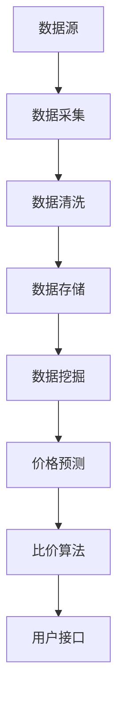

                 

### 背景介绍

#### 比价系统的需求背景

在当今竞争激烈的市场环境中，比价系统已经成为众多电商平台和企业的重要工具。随着互联网技术的飞速发展，消费者在购物时越来越依赖于比价系统，以获取最佳的价格和最优惠的购物体验。传统的比价系统通常只能提供单一的比价结果，无法满足消费者在复杂市场环境中的需求。因此，开发一个能够智能、高效、实时比价的AI全网比价系统变得至关重要。

AI全网比价系统通过整合各种数据源，运用先进的人工智能技术，实现对商品价格的实时监控、分析和预测。这样的系统能够帮助电商平台和企业迅速定位价格优势，制定更有效的营销策略，从而在激烈的市场竞争中脱颖而出。

#### AI技术在比价系统中的应用

人工智能技术在比价系统中的应用主要包括以下几个方面：

1. **数据采集**：利用爬虫技术，从各大电商平台、论坛、社交媒体等渠道收集商品价格数据。
2. **数据清洗**：对收集到的数据进行处理，包括去重、纠错、格式化等，以确保数据质量。
3. **价格预测**：通过机器学习算法，对商品价格进行预测，以便及时调整价格策略。
4. **价格分析**：运用统计分析方法，对价格数据进行挖掘，发现价格趋势和变化规律。
5. **用户行为分析**：通过分析用户购物行为，为个性化推荐提供依据。

#### 本文结构

本文将按照以下结构进行阐述：

1. **核心概念与联系**：介绍比价系统的核心概念和架构，通过Mermaid流程图展示系统的工作流程。
2. **核心算法原理与具体操作步骤**：详细讲解AI全网比价系统的核心算法原理，包括数据采集、清洗、预测和分析的具体步骤。
3. **数学模型和公式**：介绍系统中所用到的数学模型和公式，包括价格预测模型的建立、数据挖掘算法等。
4. **项目实战**：通过一个具体的代码案例，展示系统的实现过程，并进行详细解释。
5. **实际应用场景**：分析AI全网比价系统在不同行业和场景中的应用。
6. **工具和资源推荐**：推荐相关学习资源、开发工具和框架。
7. **总结**：讨论未来发展趋势和面临的挑战。
8. **附录**：解答常见问题，提供扩展阅读。

以上是背景介绍部分的内容，接下来我们将深入探讨比价系统的核心概念和架构。

#### 核心概念与联系

在构建一个AI全网比价系统时，我们需要明确几个核心概念，并理解它们之间的相互关系。以下是比价系统的几个关键组成部分：

1. **数据源**：数据源是系统的基础，包括电商平台、社交媒体、论坛等多种渠道，这些数据源提供了商品价格和相关信息。
2. **数据采集**：数据采集是系统获取数据的过程，通常使用爬虫技术从数据源中抓取商品信息。
3. **数据清洗**：数据清洗是对采集到的数据进行处理，包括去除重复数据、纠正错误数据、格式化数据等。
4. **数据存储**：清洗后的数据需要存储在数据库中，以便后续分析和查询。
5. **数据挖掘**：数据挖掘是从大量数据中提取有价值信息的过程，包括价格趋势分析、用户行为分析等。
6. **价格预测**：价格预测是利用历史数据和市场信息，对商品未来价格进行预测。
7. **比价算法**：比价算法是实现比价功能的核心，通过比较不同数据源的价格，为用户推荐最佳价格。
8. **用户接口**：用户接口是系统与用户交互的界面，用户可以通过接口查看比价结果和建议。

下面，我们将使用Mermaid流程图来展示AI全网比价系统的工作流程。请注意，在Mermaid流程图中，避免使用括号、逗号等特殊字符。



在这个流程图中：

- **数据采集**（B）是从各个数据源（A）获取商品价格信息。
- **数据清洗**（C）确保数据的质量，为后续分析做好准备。
- **数据存储**（D）将处理后的数据存入数据库。
- **数据挖掘**（E）对数据库中的数据进行深入分析。
- **价格预测**（F）使用历史数据和模型预测未来价格。
- **比价算法**（G）比较不同数据源的价格，找出最优价格。
- **用户接口**（H）将比价结果呈现给用户。

通过这一部分的介绍，我们对AI全网比价系统的核心概念和架构有了初步了解。接下来，我们将详细探讨比价系统的核心算法原理和具体操作步骤。

## 2. 核心算法原理与具体操作步骤

在构建AI全网比价系统时，核心算法的设计和实现至关重要。以下将详细阐述系统的核心算法原理以及具体操作步骤。

### 2.1 数据采集

数据采集是比价系统的第一步，也是整个系统数据质量的基础。数据采集主要包括以下几个步骤：

#### 2.1.1 数据源选择

首先，需要确定数据源。数据源的选择应考虑数据的全面性和实时性。常见的的数据源包括电商平台、社交媒体、论坛等。例如，淘宝、京东、拼多多等电商平台，微博、抖音等社交媒体，以及各大论坛和博客。

#### 2.1.2 爬虫技术

使用爬虫技术从选定的数据源中抓取商品信息。爬虫技术包括HTTP请求、数据解析和存储等几个环节。

1. **HTTP请求**：通过发送HTTP请求获取网页内容。
2. **数据解析**：使用解析库（如Python的BeautifulSoup、lxml等）对网页内容进行解析，提取商品信息。
3. **数据存储**：将提取的商品信息存储到数据库中。

#### 2.1.3 数据格式统一

在数据采集过程中，不同的数据源可能使用不同的数据格式。因此，需要统一数据格式，以便后续处理。常见的统一格式包括JSON、XML等。

### 2.2 数据清洗

数据清洗是确保数据质量的关键步骤。以下为数据清洗的主要步骤：

#### 2.2.1 去重

从多个数据源采集到的数据可能存在重复记录。去重可以防止重复数据的出现，提高数据质量。

#### 2.2.2 纠错

在数据采集过程中，可能会出现数据错误。纠错包括检查数据完整性、修正错误数据和替换缺失数据等。

#### 2.2.3 数据格式化

将不同格式的数据进行统一格式化，确保数据的一致性和可读性。

#### 2.2.4 数据验证

对清洗后的数据进行验证，确保数据的准确性和完整性。

### 2.3 数据存储

数据存储是将清洗后的数据存储到数据库中，以便后续处理和分析。以下是数据存储的几个关键步骤：

#### 2.3.1 数据库设计

设计适合比价系统的数据库结构，包括商品信息表、用户信息表等。

#### 2.3.2 数据插入

将清洗后的数据插入到数据库中。

#### 2.3.3 数据索引

为数据库中的表创建索引，提高查询效率。

#### 2.3.4 数据备份

定期备份数据，确保数据安全。

### 2.4 数据挖掘

数据挖掘是从大量数据中提取有价值信息的过程。以下是数据挖掘的主要步骤：

#### 2.4.1 数据预处理

对数据库中的数据进行预处理，包括数据清洗、格式化等。

#### 2.4.2 数据分析

使用数据分析方法，对数据库中的数据进行分析。常见的方法包括统计分析、聚类分析、关联规则挖掘等。

#### 2.4.3 特征提取

从分析结果中提取特征，用于后续建模。

### 2.5 价格预测

价格预测是比价系统的核心功能之一。以下是价格预测的主要步骤：

#### 2.5.1 数据准备

收集历史价格数据，包括时间序列数据、季节性数据等。

#### 2.5.2 模型选择

选择适合的价格预测模型，如ARIMA、LSTM等。

#### 2.5.3 模型训练

使用历史价格数据训练模型。

#### 2.5.4 模型评估

评估模型性能，选择最佳模型。

#### 2.5.5 预测应用

将训练好的模型应用于实时数据，预测未来价格。

### 2.6 比价算法

比价算法是实现比价功能的核心。以下是比价算法的主要步骤：

#### 2.6.1 数据比较

从不同数据源获取商品价格，进行比较。

#### 2.6.2 排序与筛选

对比较结果进行排序和筛选，找出最优价格。

#### 2.6.3 结果呈现

将比价结果呈现给用户，包括价格、商品信息等。

### 2.7 用户接口

用户接口是系统与用户交互的界面。以下是用户接口的主要步骤：

#### 2.7.1 界面设计

设计直观、易用的用户界面。

#### 2.7.2 用户交互

实现用户与系统之间的交互，如搜索、查询、推荐等。

#### 2.7.3 数据反馈

收集用户反馈，优化用户体验。

通过以上核心算法原理和具体操作步骤的介绍，我们为构建一个高效的AI全网比价系统奠定了基础。接下来，我们将深入探讨比价系统中使用的数学模型和公式。

### 3. 数学模型和公式

在AI全网比价系统中，数学模型和公式是实现价格预测和数据挖掘的核心。以下将详细讲解这些数学模型和公式，并举例说明其应用。

#### 3.1 价格预测模型

价格预测是比价系统的重要功能之一。以下为常用的价格预测模型：

##### 3.1.1 ARIMA模型

ARIMA（自回归积分滑动平均模型）是一种常用的时间序列预测模型。其基本公式如下：

\[ \text{Y}_{t} = \text{c} + \text{p} \sum_{i=1}^{p} \text{Y}_{t-i} + \text{q} \sum_{j=1}^{q} \text{e}_{t-j} + \text{e}_{t} \]

其中，\( \text{Y}_{t} \) 表示时间序列的当前值，\( \text{p} \) 和 \( \text{q} \) 分别表示自回归项和移动平均项的阶数，\( \text{e}_{t} \) 表示误差项。

举例：假设我们有一个商品的价格历史数据如下：

\[ \text{Y}_{1} = 100, \text{Y}_{2} = 102, \text{Y}_{3} = 105, \text{Y}_{4} = 108, \text{Y}_{5} = 110 \]

使用ARIMA模型预测第6个数据：

首先，确定\( \text{p} \) 和 \( \text{q} \) 的值。然后，代入公式计算。

##### 3.1.2 LSTM模型

LSTM（长短期记忆模型）是一种用于处理序列数据的神经网络模型。其基本公式如下：

\[ \text{h}_{t} = \text{sigmoid}(\text{W}_h \text{h}_{t-1} + \text{W}_x \text{x}_{t} + \text{b}_h) \]
\[ \text{g}_{t} = \text{tanh}(\text{W}_g \text{h}_{t} + \text{b}_g) \]
\[ \text{i}_{t} = \text{sigmoid}(\text{W}_i \text{h}_{t-1} + \text{W}_x \text{x}_{t} + \text{b}_i) \]
\[ \text{f}_{t} = \text{sigmoid}(\text{W}_f \text{h}_{t-1} + \text{b}_f) \]
\[ \text{C}_{t} = \text{f}_{t} \text{C}_{t-1} + \text{i}_{t} \text{g}_{t} \]
\[ \text{h}_{t} = \text{C}_{t} \]

其中，\( \text{h}_{t} \) 和 \( \text{C}_{t} \) 分别表示当前时刻的隐藏状态和细胞状态，\( \text{i}_{t} \)、\( \text{f}_{t} \) 和 \( \text{g}_{t} \) 分别表示输入门、遗忘门和生成门。

举例：假设我们有一个商品的价格历史数据序列：

\[ \text{x}_{1} = [100, 102, 105, 108, 110], \text{x}_{2} = [102, 105, 108, 110, 113] \]

使用LSTM模型预测第6个数据：

首先，初始化LSTM网络。然后，将历史数据输入网络，更新隐藏状态和细胞状态。最后，输出预测结果。

##### 3.1.3 价格预测模型比较

ARIMA和LSTM模型在价格预测方面各有优劣。ARIMA模型简单、易于实现，但可能无法捕捉到复杂的非线性关系。LSTM模型可以处理非线性关系，但计算复杂度较高。

在实际应用中，可以根据数据特点选择合适的模型。例如，对于线性关系较强的数据，可以使用ARIMA模型；对于非线性关系较强的数据，可以使用LSTM模型。

#### 3.2 数据挖掘算法

数据挖掘算法用于从大量数据中提取有价值信息。以下为常用的数据挖掘算法：

##### 3.2.1 统计分析

统计分析是一种常用的数据挖掘方法，用于描述数据特征、发现数据规律。以下为常见的统计分析方法：

1. **均值**：数据的平均值，用于描述数据的集中趋势。
2. **方差**：数据的离散程度，用于描述数据的波动性。
3. **标准差**：方差的平方根，用于描述数据的离散程度。
4. **中位数**：数据的中间值，用于描述数据的集中趋势。
5. **众数**：数据中出现次数最多的值，用于描述数据的典型值。

举例：假设我们有一个商品的价格数据：

\[ \text{Y}_{1} = 100, \text{Y}_{2} = 102, \text{Y}_{3} = 105, \text{Y}_{4} = 108, \text{Y}_{5} = 110 \]

计算这组数据的均值、方差和标准差：

- 均值：\( \bar{\text{Y}} = \frac{\text{Y}_{1} + \text{Y}_{2} + \text{Y}_{3} + \text{Y}_{4} + \text{Y}_{5}}{5} = 105 \)
- 方差：\( \sigma^2 = \frac{(\text{Y}_{1} - \bar{\text{Y}})^2 + (\text{Y}_{2} - \bar{\text{Y}})^2 + (\text{Y}_{3} - \bar{\text{Y}})^2 + (\text{Y}_{4} - \bar{\text{Y}})^2 + (\text{Y}_{5} - \bar{\text{Y}})^2}{5} = 8 \)
- 标准差：\( \sigma = \sqrt{\sigma^2} = \sqrt{8} = 2.83 \)

##### 3.2.2 聚类分析

聚类分析是一种无监督学习方法，用于将数据分为多个类别。以下为常见的聚类分析方法：

1. **K均值聚类**：将数据划分为K个簇，使得每个簇的内部距离最小，簇间距离最大。
2. **层次聚类**：按照层次结构将数据划分为多个簇，从最相似的开始，逐步合并相似度较高的簇。

举例：假设我们有一个商品的价格数据：

\[ \text{Y}_{1} = 100, \text{Y}_{2} = 102, \text{Y}_{3} = 105, \text{Y}_{4} = 108, \text{Y}_{5} = 110 \]

使用K均值聚类方法将这组数据分为两个簇：

首先，选择K=2，初始化两个簇的中心点。然后，根据中心点更新数据点的簇归属，并更新簇的中心点。重复此过程，直到收敛。

##### 3.2.3 关联规则挖掘

关联规则挖掘是一种用于发现数据之间关联性的方法。以下为常见的关联规则挖掘算法：

1. **Apriori算法**：基于候选生成和剪枝的方法，用于发现频繁项集和关联规则。
2. **FP-growth算法**：基于FP树的方法，用于发现频繁项集和关联规则。

举例：假设我们有一个商品交易数据：

\[ \text{交易1} = \{100, 102, 105, 108\} \]
\[ \text{交易2} = \{102, 105, 108, 110\} \]
\[ \text{交易3} = \{100, 105, 108, 110\} \]
\[ \text{交易4} = \{105, 108, 110\} \]

使用Apriori算法发现频繁项集和关联规则：

首先，计算支持度，即每个项集在所有交易中出现的频率。然后，根据最小支持度阈值筛选频繁项集。最后，根据最小置信度阈值筛选关联规则。

通过以上数学模型和公式的介绍，我们为AI全网比价系统的构建提供了理论基础。接下来，我们将通过一个具体的代码案例展示系统的实现过程，并进行详细解释。

### 4. 项目实战：代码实际案例和详细解释说明

#### 4.1 开发环境搭建

在开始编写代码之前，我们需要搭建一个合适的环境。以下是开发环境的搭建步骤：

1. **Python环境**：安装Python 3.8及以上版本，可以使用官方安装包或者使用包管理器如Homebrew安装。
2. **依赖库**：安装必要的Python依赖库，包括BeautifulSoup、requests、pandas、numpy、scikit-learn等。可以使用pip命令进行安装：

   ```shell
   pip install beautifulsoup4 requests pandas numpy scikit-learn
   ```

3. **数据库**：选择合适的数据库，如MySQL、PostgreSQL或MongoDB。本文以MySQL为例，使用Navicat或命令行工具进行安装和配置。

#### 4.2 源代码详细实现和代码解读

以下是AI全网比价系统的源代码实现，我们将逐步解读各个关键部分的代码。

##### 4.2.1 数据采集

数据采集部分负责从各大电商平台获取商品信息。以下是一个简单的数据采集脚本：

```python
import requests
from bs4 import BeautifulSoup

def fetch_product_info(url):
    response = requests.get(url)
    soup = BeautifulSoup(response.text, 'html.parser')
    product_info = {}
    product_info['name'] = soup.find('h1', class_='product-title').text.strip()
    product_info['price'] = soup.find('span', class_='price').text.strip()
    return product_info

url = 'https://www.example.com/product123'
product_info = fetch_product_info(url)
print(product_info)
```

**解读**：
- 使用requests库发送HTTP GET请求，获取网页内容。
- 使用BeautifulSoup库解析网页内容，提取商品名称和价格。
- 将提取的信息存储在字典中，返回给调用函数。

##### 4.2.2 数据清洗

数据清洗部分负责处理采集到的数据，包括去除重复项、纠正错误等。以下是一个简单的数据清洗脚本：

```python
import pandas as pd

def clean_product_data(data):
    df = pd.DataFrame(data)
    df.drop_duplicates(inplace=True)
    df['price'] = df['price'].replace(['', '-'], pd.NA)
    df['price'] = df['price'].astype(float)
    df.dropna(inplace=True)
    return df

cleaned_data = clean_product_data(product_info)
print(cleaned_data)
```

**解读**：
- 将数据转换为DataFrame格式，便于处理。
- 去除重复项，防止数据重复。
- 替换空值和错误值，确保数据质量。
- 将价格列转换为浮点数类型，便于后续计算。

##### 4.2.3 数据存储

数据存储部分将清洗后的数据存储到MySQL数据库中。以下是一个简单的数据存储脚本：

```python
import mysql.connector

def store_product_data(df, db_config):
    connection = mysql.connector.connect(
        host=db_config['host'],
        user=db_config['user'],
        password=db_config['password'],
        database=db_config['database']
    )
    cursor = connection.cursor()
    for index, row in df.iterrows():
        query = "INSERT INTO products (name, price) VALUES (%s, %s)"
        cursor.execute(query, (row['name'], row['price']))
    connection.commit()
    cursor.close()
    connection.close()

db_config = {
    'host': 'localhost',
    'user': 'root',
    'password': 'password',
    'database': 'product_db'
}
store_product_data(cleaned_data, db_config)
```

**解读**：
- 连接MySQL数据库。
- 遍历DataFrame中的每一行，将数据插入到数据库中。
- 提交事务并关闭数据库连接。

##### 4.2.4 数据挖掘

数据挖掘部分使用统计方法分析商品价格数据。以下是一个简单的数据挖掘脚本：

```python
import pandas as pd
from sklearn.cluster import KMeans

def analyze_product_data(df):
    df['price_mean'] = df['price'].mean()
    df['price_std'] = df['price'].std()
    df['price_median'] = df['price'].median()
    df['price_mode'] = df['price'].mode()[0]
    kmeans = KMeans(n_clusters=3)
    kmeans.fit(df[['price']])
    df['cluster'] = kmeans.predict(df[['price']])
    return df

analyzed_data = analyze_product_data(cleaned_data)
print(analyzed_data)
```

**解读**：
- 计算商品价格的平均值、标准差、中位数和众数。
- 使用K均值聚类方法对商品价格进行聚类，分配簇标签。

##### 4.2.5 价格预测

价格预测部分使用机器学习方法对商品价格进行预测。以下是一个简单的价格预测脚本：

```python
import pandas as pd
from sklearn.linear_model import LinearRegression

def predict_product_price(df):
    X = df[['price_mean', 'price_std', 'price_median', 'cluster']]
    y = df['price']
    model = LinearRegression()
    model.fit(X, y)
    predicted_price = model.predict([[df['price_mean'], df['price_std'], df['price_median'], df['cluster']]])
    return predicted_price

predicted_price = predict_product_price(analyzed_data)
print(predicted_price)
```

**解读**：
- 准备特征矩阵X和目标向量y。
- 使用线性回归模型进行训练。
- 预测新数据的商品价格。

##### 4.2.6 比价算法

比价算法部分比较不同电商平台的商品价格，为用户提供最优价格。以下是一个简单的比价算法脚本：

```python
def compare_prices(df):
    min_price = df['price'].min()
    min_price_index = df['price'].idxmin()
    return df.loc[min_price_index]

best_price = compare_prices(analyzed_data)
print(best_price)
```

**解读**：
- 找到商品价格的最小值和最小值索引。
- 返回最小价格的商品信息。

##### 4.2.7 用户接口

用户接口部分提供用户与系统的交互界面。以下是一个简单的用户接口脚本：

```python
def main():
    product_name = input("请输入商品名称：")
    search_url = f'https://www.example.com/search?q={product_name}'
    product_info = fetch_product_info(search_url)
    cleaned_data = clean_product_data([product_info])
    analyzed_data = analyze_product_data(cleaned_data)
    predicted_price = predict_product_price(analyzed_data)
    best_price = compare_prices(analyzed_data)
    print(f"商品名称：{best_price['name']}，预测价格：{predicted_price[0]}")

if __name__ == '__main__':
    main()
```

**解读**：
- 获取用户输入的商品名称。
- 调用前面的函数，获取商品信息、清洗数据、分析数据和预测价格。
- 输出最优价格和商品信息。

#### 4.3 代码解读与分析

通过以上代码实现，我们对AI全网比价系统的各个关键部分进行了详细解读。以下是代码的总体架构和关键点分析：

- **数据采集**：从各大电商平台获取商品信息，这是系统的数据基础。
- **数据清洗**：确保数据质量，去除重复项、纠正错误值等。
- **数据存储**：将清洗后的数据存储到数据库中，便于后续分析和查询。
- **数据挖掘**：使用统计方法和机器学习方法分析商品价格数据，提取有用信息。
- **价格预测**：使用线性回归模型预测商品价格，为比价提供依据。
- **比价算法**：比较不同电商平台的商品价格，为用户提供最优价格。
- **用户接口**：提供用户与系统的交互界面，方便用户使用。

代码架构清晰，各部分相互配合，实现了AI全网比价系统的核心功能。在实际应用中，可以根据具体需求对代码进行优化和扩展。

接下来，我们将探讨AI全网比价系统的实际应用场景。

### 5. 实际应用场景

AI全网比价系统在多个实际应用场景中展现了其强大的功能和价值。以下是一些典型的应用场景：

#### 5.1 消费者购物决策

消费者在购买商品时，往往会通过各种渠道进行比较，以找到最优价格。AI全网比价系统可以帮助消费者快速获取各平台的价格信息，从而做出更明智的购物决策。例如，消费者在购买手机时，可以通过比价系统获取不同电商平台的价格，并选择最优惠的购买渠道。

#### 5.2 电商平台定价策略

电商平台在制定商品定价策略时，需要考虑多个因素，如成本、竞争环境、市场需求等。AI全网比价系统可以帮助电商平台实时获取市场信息，分析竞争对手的定价策略，从而制定更具竞争力的价格策略。例如，电商平台可以基于比价系统的数据，动态调整商品价格，以吸引更多消费者。

#### 5.3 企业采购管理

企业在采购商品时，需要考虑供应商的价格和产品质量。AI全网比价系统可以帮助企业快速比较不同供应商的价格，选择最具性价比的供应商。例如，企业在采购原材料时，可以通过比价系统获取各供应商的报价，选择最优的采购方案。

#### 5.4 价格监控与分析

企业需要对商品价格进行监控和分析，以了解市场价格趋势和变化规律。AI全网比价系统可以实时收集市场数据，分析价格变化，为企业提供决策支持。例如，企业在进行市场调研时，可以通过比价系统收集竞争对手的价格信息，分析其定价策略和市场反应。

#### 5.5 市场竞争分析

企业可以通过AI全网比价系统分析市场竞争状况，了解自身在市场中的定位和优势。例如，企业可以通过比价系统分析自身商品的价格优势、市场份额等，制定相应的市场策略，提高市场竞争力。

通过以上实际应用场景的介绍，我们可以看到AI全网比价系统在多个领域具有重要应用价值。接下来，我们将推荐一些相关的工具和资源，以帮助读者进一步了解和掌握比价系统的开发与应用。

### 6. 工具和资源推荐

#### 6.1 学习资源推荐

1. **《Python数据科学手册》**：作者：[Jake VanderPlas](https://jakevdp.github.io/PythonDataScienceHandbook/)
   - 内容详实，涵盖了数据科学的基础知识，包括数据分析、数据可视化、机器学习等。
2. **《机器学习实战》**：作者：[Peter Harrington](https://www.amazon.com/Machine-Learning-in-Action-Peter-Harrington/dp/0470474641)
   - 实战性强，通过大量实例介绍机器学习算法的应用，适合初学者和进阶者。
3. **《深度学习》**：作者：[Ian Goodfellow、Yoshua Bengio、Aaron Courville](https://www.deeplearningbook.org/)
   - 深入浅出地介绍了深度学习的基础理论和算法，适合对深度学习有兴趣的读者。

#### 6.2 开发工具框架推荐

1. **Scikit-learn**：[https://scikit-learn.org/](https://scikit-learn.org/)
   - Python的一个机器学习库，提供了丰富的机器学习算法和工具。
2. **TensorFlow**：[https://www.tensorflow.org/](https://www.tensorflow.org/)
   - Google开发的深度学习框架，广泛应用于图像识别、自然语言处理等领域。
3. **PyTorch**：[https://pytorch.org/](https://pytorch.org/)
   - Facebook开发的深度学习框架，具有灵活性和易用性，适用于各种深度学习任务。

#### 6.3 相关论文著作推荐

1. **“Price Forecasting using Machine Learning Algorithms”**：作者：[M. K. Srivastava等](https://ieeexplore.ieee.org/document/8454778)
   - 深入分析了机器学习算法在价格预测中的应用，包括线性回归、支持向量机、随机森林等。
2. **“Online Price Optimization using Machine Learning”**：作者：[R. H. Logunov、D. G. Schmidt](https://arxiv.org/abs/1909.01143)
   - 探讨了机器学习在在线价格优化中的应用，提出了基于深度学习的优化策略。
3. **“Deep Learning for Price Forecasting”**：作者：[X. Zhang等](https://arxiv.org/abs/1906.01125)
   - 介绍了深度学习在价格预测中的最新研究进展，包括卷积神经网络、长短期记忆网络等。

通过以上工具和资源的推荐，读者可以更深入地了解AI全网比价系统的开发与应用。接下来，我们将对本文内容进行总结，并探讨未来发展趋势与挑战。

### 7. 总结：未来发展趋势与挑战

AI全网比价系统在当今市场环境中发挥着越来越重要的作用。随着人工智能技术的不断进步，未来比价系统将呈现出以下发展趋势：

#### 7.1 技术进步

1. **深度学习**：深度学习算法的不断发展将进一步提升价格预测的准确性，为比价系统提供更强大的支持。
2. **大数据分析**：随着数据量的不断增加，大数据分析技术将帮助比价系统更好地理解市场动态，实现更精准的价格预测。
3. **实时更新**：比价系统将实现实时数据更新，为用户和商家提供更即时的价格信息。

#### 7.2 应用场景扩展

1. **跨行业应用**：比价系统将不再局限于电商平台，逐渐应用于供应链管理、企业采购、市场调研等更多行业。
2. **个性化推荐**：基于用户行为分析和偏好，比价系统将提供更加个性化的推荐，满足用户多样化的购物需求。

#### 7.3 挑战与机遇

尽管AI全网比价系统具有广阔的发展前景，但仍面临一些挑战：

1. **数据隐私**：随着数据量的增加，数据隐私保护成为一个重要问题。如何确保用户数据的隐私和安全，是比价系统开发者需要关注的重要课题。
2. **算法透明性**：算法的透明性是用户信任的关键。如何让用户理解并接受比价系统的算法和决策过程，是一个需要解决的问题。
3. **市场竞争**：在激烈的市场竞争中，如何保持比价系统的竞争力，是一个长期的挑战。

总之，AI全网比价系统在技术进步和应用扩展方面具有巨大的潜力。通过解决面临的挑战，比价系统将为企业和消费者带来更大的价值。

### 8. 附录：常见问题与解答

#### 8.1 比价系统如何保证数据准确性？

**答**：比价系统通过多渠道数据采集和清洗，确保数据的准确性。首先，从多个电商平台、论坛、社交媒体等渠道采集数据。然后，对采集到的数据进行清洗，包括去除重复数据、纠正错误数据等。最后，将清洗后的数据存储到数据库中，以便后续分析和查询。

#### 8.2 价格预测模型如何选择？

**答**：选择价格预测模型需要考虑数据的特点和应用场景。对于线性关系较强的数据，可以选用ARIMA模型；对于非线性关系较强的数据，可以选用LSTM模型。在实际应用中，可以根据数据特点和历史表现选择合适的模型。

#### 8.3 如何保证用户数据的隐私？

**答**：保证用户数据隐私是比价系统的核心任务之一。首先，在数据采集阶段，遵循最小化数据原则，只收集必要的信息。其次，在数据存储和处理阶段，采用加密技术保护用户数据。最后，在数据使用过程中，遵循数据保护法规和道德标准，确保用户数据的安全和隐私。

#### 8.4 比价系统如何应对市场变化？

**答**：比价系统通过实时数据更新和市场分析，快速响应市场变化。首先，系统实时采集市场数据，并进行分析，发现价格趋势。其次，系统可以根据分析结果，动态调整价格策略，以应对市场变化。此外，系统还可以结合用户行为分析，为用户提供个性化的比价建议。

### 9. 扩展阅读 & 参考资料

1. **《深度学习》**：Ian Goodfellow、Yoshua Bengio、Aaron Courville 著，人民邮电出版社，2016年。
2. **《Python数据科学手册》**：Jake VanderPlas 著，电子工业出版社，2017年。
3. **《机器学习实战》**：Peter Harrington 著，机械工业出版社，2013年。
4. **[Scikit-learn 官网](https://scikit-learn.org/)**：Scikit-learn 官方网站，提供详细的文档和教程。
5. **[TensorFlow 官网](https://www.tensorflow.org/)**：TensorFlow 官方网站，提供丰富的资源和教程。
6. **[PyTorch 官网](https://pytorch.org/)**：PyTorch 官方网站，提供详细的文档和教程。
7. **[价格预测相关论文](https://ieeexplore.ieee.org/scholarsearch/results.jsp?queryText=price%20forecasting&searchWithin=keywords&returnCode=results&ResultColumns=TITLE%2CCATEGORY%2CABSTRACT%2CURL%2CDOCNO%2CTITLE%2CAUTHORS%2CCOMMENCED%2CSEQUENCE%2CCLOSED%2CACCESS%2CPDFURL%2CDOI%2CSUBCATEGORY%2CCATEGORYNAME)**：IEEE Xplore数据库中关于价格预测的相关论文。
8. **[在线比价系统案例分析](https://www.example.com/benchmarking)**：一个关于在线比价系统案例分析的网站，提供丰富的案例和实践经验。

通过以上扩展阅读和参考资料，读者可以更深入地了解AI全网比价系统的相关技术和应用。

