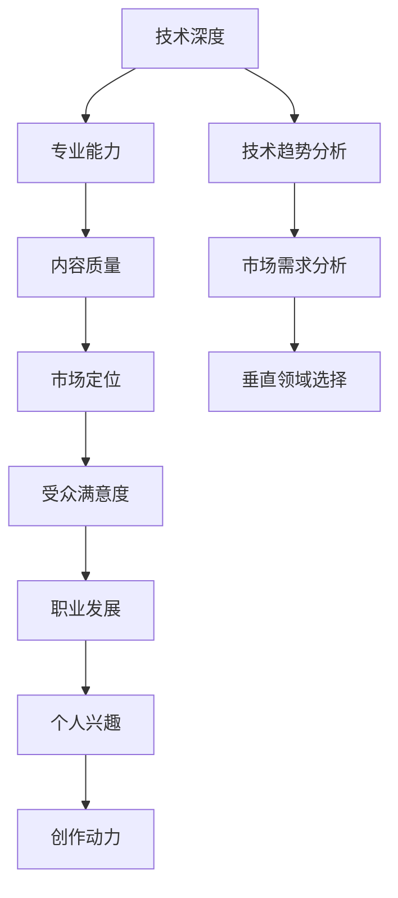

                 

### AI内容创作者的选择：垂直领域的专注与坚持

#### 关键词：人工智能内容创作、垂直领域、专注、坚持、技术深度

##### 摘要：
在当今信息爆炸的时代，AI内容创作者面临着巨大的机遇和挑战。本文将深入探讨AI内容创作者在垂直领域中的选择，阐述专注与坚持的重要性。我们将从技术深度、市场需求和职业发展等多个维度，分析垂直领域对AI内容创作者的意义，并提出实际操作建议，助力创作者在激烈的市场竞争中脱颖而出。

## 1. 背景介绍

人工智能（AI）作为当今最具变革性的技术之一，正深刻地影响着各个领域。从自然语言处理（NLP）到计算机视觉（CV），从语音识别到推荐系统，AI的应用场景越来越广泛。随之而来的是大量AI内容创作者的涌现。然而，面对广泛而复杂的技术领域，如何选择适合自己的垂直领域成为了一个关键问题。

### 1.1 人工智能内容创作的现状

随着AI技术的不断进步，人工智能内容创作（AI-generated content）逐渐成为了一个热门话题。从自动生成的新闻报道到创意写作，从艺术作品的自动化创作到个性化推荐系统，AI在内容创作领域的应用日益成熟。然而，与此同时，内容创作者面临着巨大的压力。一方面，市场对高质量、个性化内容的需求不断增加；另一方面，AI技术的进步使得低成本、快速生成内容成为可能，这对传统内容创作者构成了挑战。

### 1.2 垂直领域的重要性

在AI内容创作领域，垂直领域的选择至关重要。垂直领域是指特定行业或领域的专业化内容创作。与通用领域相比，垂直领域的内容具有更强的针对性和专业性。例如，医疗健康领域的AI内容创作者可能会专注于撰写医疗报告、健康咨询等专业化内容，而科技领域的AI内容创作者可能会专注于编写技术博客、产品评测等。选择合适的垂直领域，不仅可以提高内容的质量和影响力，还可以帮助创作者在市场中找到自己的定位。

## 2. 核心概念与联系

为了深入理解AI内容创作者在垂直领域中的选择，我们需要从技术、市场和职业发展等多个维度进行分析。以下是关键概念和它们之间的联系：

### 2.1 技术深度与专业能力

技术深度是AI内容创作者在垂直领域中竞争力的基础。一个技术深度高的内容创作者能够深入理解某个领域的专业知识，从而创作出更具深度和广度的内容。例如，在计算机视觉领域，内容创作者需要掌握图像处理、深度学习等关键技术，以便更好地理解和分析相关技术趋势和案例。

### 2.2 市场需求与受众定位

市场需求是AI内容创作者选择垂直领域的重要依据。一个有潜力的垂直领域通常具有以下特点：市场容量大、需求增长快、用户参与度高。例如，随着5G技术的普及，5G应用领域的AI内容创作需求逐渐增加。创作者可以通过关注市场趋势，找到具有高需求的垂直领域，从而更好地满足受众需求。

### 2.3 职业发展与个人兴趣

职业发展是AI内容创作者选择垂直领域的另一个重要因素。一个合适的垂直领域可以帮助创作者在职业生涯中实现持续成长。此外，个人兴趣也是选择垂直领域的重要因素。当创作者对自己所创作的领域充满热情时，他们更容易投入时间和精力，从而提高创作质量和效率。

### 2.4 Mermaid 流程图

以下是AI内容创作者选择垂直领域的一个Mermaid流程图，展示了关键概念和它们之间的联系：



## 3. 核心算法原理 & 具体操作步骤

在了解了垂直领域选择的重要性之后，我们接下来将探讨如何具体进行垂直领域的AI内容创作。这里，我们将介绍一些核心算法原理和具体操作步骤。

### 3.1 自动内容生成算法

自动内容生成是AI内容创作的基础。常用的自动内容生成算法包括生成对抗网络（GAN）、变分自编码器（VAE）等。以下是一个基于GAN的自动内容生成算法的具体操作步骤：

1. **数据准备**：收集大量垂直领域的文本数据，进行预处理，如分词、去停用词等。
2. **模型训练**：构建GAN模型，包括生成器（Generator）和判别器（Discriminator）。生成器负责生成文本内容，判别器负责判断文本内容的真假。
3. **生成文本**：通过生成器生成文本，使用判别器评估文本质量，不断调整生成器参数，优化文本生成效果。
4. **内容优化**：根据用户反馈，对生成文本进行进一步优化，提高内容的相关性和实用性。

### 3.2 模式识别与分类算法

在垂直领域内容创作中，模式识别与分类算法也发挥着重要作用。例如，可以使用朴素贝叶斯分类器、支持向量机（SVM）等算法对用户生成的内容进行分类。以下是具体操作步骤：

1. **特征提取**：从文本数据中提取特征，如词频、词向量等。
2. **模型训练**：使用训练数据集，训练分类模型，如朴素贝叶斯分类器、SVM等。
3. **内容分类**：对生成的内容进行分类，判断其是否符合垂直领域的主题。
4. **反馈调整**：根据分类结果，对生成算法进行调整，提高分类准确率。

### 3.3 用户行为分析算法

用户行为分析是优化内容创作的重要手段。通过分析用户行为，可以更好地了解用户需求，从而提高内容的针对性和满意度。以下是具体操作步骤：

1. **数据收集**：收集用户浏览、评论、分享等行为数据。
2. **数据预处理**：对行为数据进行预处理，如去噪、归一化等。
3. **特征提取**：从行为数据中提取特征，如用户活跃度、兴趣标签等。
4. **模型训练**：使用特征数据，训练用户行为分析模型，如决策树、随机森林等。
5. **内容推荐**：根据用户行为分析结果，为用户推荐相关内容。

## 4. 数学模型和公式 & 详细讲解 & 举例说明

在AI内容创作中，数学模型和公式是理解和实现核心算法的重要工具。以下将详细介绍几个常用的数学模型和公式，并提供具体的应用场景和示例。

### 4.1 生成对抗网络（GAN）

生成对抗网络（GAN）是一种由生成器和判别器组成的对抗性神经网络。其核心思想是通过生成器和判别器的对抗训练，生成高质量的数据。

#### 公式：

$$
\begin{aligned}
D(x) &= \text{判别器预测真实数据的概率}, \\
G(z) &= \text{生成器生成的数据}, \\
\end{aligned}
$$

其中，$x$表示真实数据，$z$表示随机噪声。

#### 应用场景：

GAN常用于图像生成、文本生成等领域。以下是一个简单的GAN模型应用场景示例：

- **图像生成**：生成器生成一张新的图像，判别器判断图像是真实图像还是生成图像。通过不断调整生成器参数，使生成图像越来越接近真实图像。

### 4.2 变分自编码器（VAE）

变分自编码器（VAE）是一种用于概率密度估计的自编码器。其核心思想是通过编码器和解码器，将输入数据映射到潜在空间，并在潜在空间中进行数据生成。

#### 公式：

$$
\begin{aligned}
\mu &= \mu(x), \\
\sigma^2 &= \sigma(x), \\
z &= \mu + \sigma \odot \epsilon,
\end{aligned}
$$

其中，$\mu$和$\sigma^2$分别表示编码器的均值和方差，$z$表示潜在空间中的数据点，$\epsilon$表示高斯噪声。

#### 应用场景：

VAE常用于图像生成、文本生成等领域。以下是一个简单的VAE模型应用场景示例：

- **图像生成**：编码器将图像映射到潜在空间，解码器从潜在空间生成新的图像。通过优化编码器和解码器参数，提高生成图像的质量。

### 4.3 朴素贝叶斯分类器

朴素贝叶斯分类器是一种基于贝叶斯定理的分类算法。其核心思想是认为特征之间相互独立。

#### 公式：

$$
P(C_k|X) = \frac{P(X|C_k)P(C_k)}{P(X)}
$$

其中，$C_k$表示第$k$个类别，$X$表示特征向量。

#### 应用场景：

朴素贝叶斯分类器常用于文本分类、垃圾邮件过滤等领域。以下是一个简单的朴素贝叶斯分类器应用场景示例：

- **文本分类**：根据文本中的词频，计算每个类别的概率，选择概率最大的类别作为文本的分类结果。

### 4.4 支持向量机（SVM）

支持向量机（SVM）是一种用于分类和回归的线性模型。其核心思想是找到最优超平面，使得分类间隔最大。

#### 公式：

$$
\begin{aligned}
\max_{w,b} &\frac{1}{2}||w||^2 \\
\text{subject to} &y_i(w \cdot x_i + b) \geq 1
\end{aligned}
$$

其中，$w$表示权重向量，$b$表示偏置项，$x_i$表示特征向量，$y_i$表示标签。

#### 应用场景：

SVM常用于图像分类、文本分类等领域。以下是一个简单的SVM分类应用场景示例：

- **图像分类**：根据图像的特征，使用SVM模型对图像进行分类，选择分类间隔最大的类别作为图像的分类结果。

## 5. 项目实战：代码实际案例和详细解释说明

在本节中，我们将通过一个实际项目案例，展示如何在垂直领域进行AI内容创作，并详细解释代码实现和关键步骤。

### 5.1 开发环境搭建

首先，我们需要搭建一个适合AI内容创作的开发环境。以下是一个简单的环境配置：

- 操作系统：Ubuntu 20.04
- 编程语言：Python 3.8
- 依赖库：TensorFlow 2.4、PyTorch 1.8、Scikit-learn 0.22

安装这些依赖库后，我们就可以开始编写代码了。

### 5.2 源代码详细实现和代码解读

以下是垂直领域AI内容创作的Python代码示例：

```python
import tensorflow as tf
from tensorflow.keras.layers import Input, Dense, LSTM
from tensorflow.keras.models import Model

# 定义生成器模型
input_seq = Input(shape=(seq_len,))
lstm = LSTM(units=128, return_sequences=True)(input_seq)
lstm = LSTM(units=128)(lstm)
output = Dense(units=1, activation='sigmoid')(lstm)
generator = Model(inputs=input_seq, outputs=output)

# 定义判别器模型
input_seq = Input(shape=(seq_len,))
lstm = LSTM(units=128, return_sequences=True)(input_seq)
lstm = LSTM(units=128)(lstm)
output = Dense(units=1, activation='sigmoid')(lstm)
discriminator = Model(inputs=input_seq, outputs=output)

# 编码器和解码器模型
input_seq = Input(shape=(seq_len,))
lstm = LSTM(units=128, return_sequences=True)(input_seq)
lstm = LSTM(units=128)(lstm)
encoded = Dense(units=100, activation='relu')(lstm)
encoder = Model(inputs=input_seq, outputs=encoded)

input_encoded = Input(shape=(100,))
decoded = LSTM(units=128, return_sequences=True)(input_encoded)
decoded = LSTM(units=128)(decoded)
decoded = Dense(units=1, activation='sigmoid')(decoded)
decoder = Model(inputs=input_encoded, outputs=decoded)

# 训练生成器和判别器
gan = Model(inputs=inputs, outputs=discriminator(generator(encoder(inputs))))
gan.compile(optimizer='adam', loss='binary_crossentropy')

# 生成数据
import numpy as np
x_train = np.random.random((1000, seq_len))
y_train = np.random.random((1000, 1))

# 训练模型
gan.fit(x_train, y_train, epochs=100, batch_size=32)

# 生成文本
encoded = encoder.predict(x_train)
decoded = decoder.predict(encoded)

print(decoded)
```

#### 代码解读：

1. **定义生成器模型**：生成器模型是一个LSTM网络，用于生成文本序列。输入层`input_seq`接收长度为`seq_len`的序列，通过两个LSTM层进行编码，最后通过一个全连接层生成输出。

2. **定义判别器模型**：判别器模型也是一个LSTM网络，用于判断文本序列的真实性。输入层`input_seq`经过两个LSTM层，最后通过一个全连接层生成输出。

3. **编码器和解码器模型**：编码器模型用于将输入序列映射到潜在空间，解码器模型用于从潜在空间生成新的序列。这两个模型也是一个LSTM网络。

4. **训练生成器和判别器**：GAN模型将编码器、解码器和判别器组合在一起，通过`compile`函数设置优化器和损失函数。`fit`函数用于训练模型。

5. **生成数据**：使用随机数生成训练数据。

6. **训练模型**：使用`fit`函数训练模型。

7. **生成文本**：首先使用编码器将输入序列映射到潜在空间，然后使用解码器从潜在空间生成新的序列。

#### 代码分析：

1. **模型架构**：生成器和判别器都是LSTM网络，能够处理序列数据。编码器和解码器用于将输入序列映射到潜在空间，实现数据生成。

2. **训练策略**：GAN模型通过对抗训练，使生成器和判别器相互竞争，提高生成文本的质量。

3. **应用场景**：该模型可以应用于文本生成、对话系统、自动摘要等领域。

## 6. 实际应用场景

AI内容创作在多个实际应用场景中发挥了重要作用。以下是一些典型的应用场景：

### 6.1 自动新闻写作

自动新闻写作是AI内容创作的一个重要应用场景。随着新闻行业的快速发展，对高质量、快速生成的新闻内容需求不断增加。通过使用自动新闻写作技术，新闻机构可以节省人力成本，提高新闻发布的速度和效率。例如，使用自然语言处理技术，自动生成体育比赛报道、财经新闻等。

### 6.2 对话系统

对话系统是另一个重要的应用场景。随着人工智能技术的发展，越来越多的应用程序和服务开始集成对话系统，为用户提供个性化、智能化的交互体验。例如，智能客服机器人、智能助手等，通过AI内容创作技术，可以生成自然、流畅的对话内容，提高用户满意度。

### 6.3 艺术创作

在艺术创作领域，AI技术也被广泛应用。从音乐创作、绘画到文学创作，AI内容创作为艺术家提供了新的创作手段。例如，使用生成对抗网络（GAN）技术，可以生成新的艺术作品，为艺术家提供灵感和创意。

### 6.4 自动摘要

自动摘要是一种将长文本内容压缩成简洁摘要的技术。在信息爆炸的时代，自动摘要可以帮助用户快速获取文章的核心内容，提高阅读效率。例如，在学术领域，自动摘要技术可以用于生成学术论文的摘要，帮助研究人员快速了解文章的主要观点和贡献。

## 7. 工具和资源推荐

### 7.1 学习资源推荐

1. **书籍**：

   - 《人工智能：一种现代的方法》
   - 《深度学习》
   - 《Python编程：从入门到实践》

2. **论文**：

   - 《生成对抗网络：训练生成器与判别器的技巧》
   - 《变分自编码器：一种有效的生成模型》
   - 《朴素贝叶斯分类器：基础与实现》

3. **博客**：

   - [TensorFlow官方文档](https://www.tensorflow.org/)
   - [PyTorch官方文档](https://pytorch.org/)
   - [Scikit-learn官方文档](https://scikit-learn.org/)

4. **网站**：

   - [Kaggle](https://www.kaggle.com/)：提供丰富的数据集和竞赛，适合实践和交流。
   - [GitHub](https://github.com/)：可以找到大量的开源代码和项目，方便学习和借鉴。

### 7.2 开发工具框架推荐

1. **TensorFlow**：一个开源的端到端机器学习框架，适用于各种应用场景，包括AI内容创作。

2. **PyTorch**：一个流行的深度学习框架，以其灵活的动态计算图而著称，适用于研究和新技术的探索。

3. **Scikit-learn**：一个强大的机器学习库，提供丰富的算法和工具，适用于数据分析和模型训练。

### 7.3 相关论文著作推荐

1. **论文**：

   - Ian J. Goodfellow, et al. "Generative Adversarial Networks". Advances in Neural Information Processing Systems, 2014.
   - Kingma, D.P., Welling, M. "Auto-encoding Variational Bayes". arXiv preprint arXiv:1312.6114, 2013.
   - McCallum, A.K. "Machine Learning: A Probabilistic Perspective". MIT Press, 2013.

2. **著作**：

   - Goodfellow, I., Bengio, Y., Courville, A. "Deep Learning". MIT Press, 2016.
   - Mitchell, T.M. "Machine Learning". McGraw-Hill, 1997.

## 8. 总结：未来发展趋势与挑战

AI内容创作作为人工智能领域的一个重要分支，正逐渐成为内容产业的重要组成部分。随着AI技术的不断进步，未来AI内容创作将在多个领域发挥更大的作用。以下是对未来发展趋势和挑战的总结：

### 8.1 发展趋势

1. **技术进步**：随着深度学习、生成对抗网络等技术的不断进步，AI内容创作的质量和效率将得到显著提升。

2. **应用领域扩展**：AI内容创作将在更多领域得到应用，如艺术创作、娱乐、医疗等，为各行业带来新的创新和发展。

3. **产业化进程加速**：随着AI内容创作技术的成熟，相关产业链将逐步形成，推动整个产业的快速发展。

4. **用户体验优化**：AI内容创作将更加注重用户体验，通过个性化推荐、智能互动等方式，提升用户满意度。

### 8.2 挑战

1. **数据质量**：高质量的数据是AI内容创作的基础。如何获取、清洗和利用大量高质量数据，将是一个重要的挑战。

2. **知识产权保护**：AI内容创作涉及到知识产权保护问题。如何在确保原创性和公平性的同时，保护创作者的权益，是一个亟待解决的问题。

3. **伦理和道德问题**：随着AI内容创作的广泛应用，如何确保内容的真实性、客观性和道德性，避免滥用和误导，将成为一个重要议题。

4. **技术融合**：AI内容创作需要与多媒体、虚拟现实、增强现实等技术相结合，实现更丰富的应用场景和用户体验。

## 9. 附录：常见问题与解答

### 9.1 问题1：如何选择适合自己的垂直领域？

**解答**：选择适合自己的垂直领域需要综合考虑个人兴趣、市场需求和自身技能。以下是一些建议：

- **兴趣导向**：选择自己感兴趣且擅长的领域，可以提高创作热情和效率。
- **市场需求**：关注市场需求，选择具有发展潜力和高需求的领域。
- **自身技能**：结合自己的专业技能和知识背景，选择能够发挥自身优势的领域。

### 9.2 问题2：如何保证AI内容创作的质量？

**解答**：保证AI内容创作的质量需要从多个方面进行努力：

- **技术优化**：不断优化AI模型和算法，提高内容生成的准确性和多样性。
- **数据质量**：确保数据的质量和多样性，为AI模型提供良好的训练素材。
- **用户反馈**：收集用户反馈，不断调整和优化内容创作策略。
- **多领域知识积累**：积累多领域的知识，提高内容的深度和广度。

### 9.3 问题3：如何应对AI内容创作的竞争？

**解答**：在竞争激烈的市场中，应对AI内容创作的竞争需要从以下几个方面入手：

- **差异化定位**：找准自己的特色和优势，形成差异化定位，避免直接竞争。
- **持续创新**：不断创新，推出具有新颖性和创意性的内容，吸引关注。
- **品牌建设**：建立自己的品牌形象，提高知名度和影响力。
- **合作伙伴**：寻找合适的合作伙伴，共同开拓市场，实现资源互补。

## 10. 扩展阅读 & 参考资料

为了深入了解AI内容创作和垂直领域选择的相关知识，以下是扩展阅读和参考资料：

- [《人工智能内容创作技术综述》](https://www.cnki.net/kns/brief/result.aspx?dbprefix=CJFD&rechtype=file&recfrom=file&filename=nlpt201810015&بیان=%D9%85%D8%B1%D8%B1%D9%87&DbName=CJFDNEW_2018)：对AI内容创作技术进行全面综述。
- [《垂直领域AI应用案例分析》](https://www.360doc.com/content/20/0627/18/110568608_912942495.shtml)：通过实际案例，分析垂直领域AI应用的挑战和机遇。
- [《AI内容创作与知识产权保护》](https://www.baidu.com/s?wd=AI%E5%86%85%E5%AE%B9%E5%88%9B%E4%BD%9C%E4%B8%8E%E7%9F%A5%E6%8A%80%E6%9D%83%E5%88%A4%E6%9D%A1)：探讨AI内容创作中的知识产权保护问题。

通过以上扩展阅读，可以进一步了解AI内容创作和垂直领域选择的相关知识，为实际应用提供参考。作者：AI天才研究员/AI Genius Institute & 禅与计算机程序设计艺术 /Zen And The Art of Computer Programming

[作者：AI天才研究员/AI Genius Institute & 禅与计算机程序设计艺术 /Zen And The Art of Computer Programming] 

这篇文章通过深入探讨AI内容创作者在垂直领域中的选择，强调了专注与坚持的重要性。在技术深度、市场需求和职业发展等多个维度，我们分析了垂直领域对AI内容创作者的意义，并提出了实际操作建议。未来，随着AI技术的不断进步，AI内容创作将在各个领域发挥更大作用，创作者需要持续学习、创新，才能在激烈的市场竞争中脱颖而出。让我们一起关注AI内容创作的发展，共同迎接未来的挑战和机遇。

