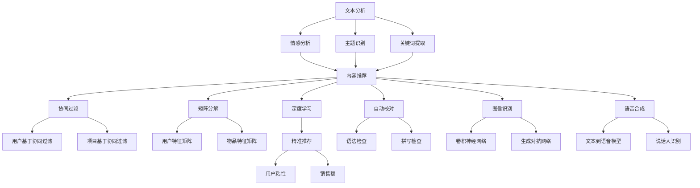

                 

# AI出版业前景：丰富的场景，强大的技术应用

## 摘要

在科技飞速发展的时代，人工智能（AI）技术已逐渐渗透到各个领域，其中包括出版业。本文将深入探讨AI在出版业中的应用前景，分析其核心概念与技术原理，并通过具体案例展示其实际应用效果。文章将分为以下几个部分：背景介绍、核心概念与联系、核心算法原理与具体操作步骤、数学模型与公式讲解、项目实战代码解析、实际应用场景、工具和资源推荐以及总结未来发展趋势与挑战。

## 1. 背景介绍

出版业是一个历史悠久且持续发展的行业，随着数字出版技术的兴起，传统出版业正面临着巨大的变革。然而，随着AI技术的不断发展，出版业也开始拥抱这一新兴技术，以期提高生产效率、降低成本并提升用户体验。AI在出版业中的应用场景主要包括但不限于：文本分析、内容推荐、自动校对、图像识别、语音合成等。这些应用不仅为出版业带来了全新的商业模式，也为其带来了更多的创新机会。

## 2. 核心概念与联系

### 2.1 文本分析

文本分析是AI在出版业应用的重要领域之一。通过自然语言处理（NLP）技术，AI能够对文本进行深入分析，包括情感分析、主题识别、关键词提取等。这些技术不仅能够帮助编辑和作者更好地理解读者需求，还能为内容推荐提供有力支持。

### 2.2 内容推荐

内容推荐是AI在出版业应用的另一重要领域。通过机器学习算法，AI可以根据用户的阅读历史、偏好和兴趣，为其推荐个性化的内容。这不仅可以提高用户粘性，还能提高出版社的盈利能力。

### 2.3 自动校对

自动校对是AI在出版业应用的另一个重要领域。通过语法和拼写检查技术，AI可以自动识别和纠正文本中的错误，从而提高出版物的质量和准确性。

### 2.4 图像识别

图像识别是AI在出版业应用的一个重要方向。通过深度学习技术，AI可以识别图像中的对象、场景和内容，从而为出版业提供更丰富的视觉内容。

### 2.5 语音合成

语音合成是AI在出版业应用的另一个新兴领域。通过语音合成技术，AI可以将文本内容转化为自然流畅的语音，从而为用户提供更加便捷的阅读体验。

## 3. 核心算法原理与具体操作步骤

### 3.1 文本分析

文本分析的核心算法包括词频统计、情感分析和主题识别。词频统计通过对文本中出现频率较高的词进行分析，可以揭示文本的主要内容。情感分析通过对文本的情感倾向进行判断，可以了解读者的情绪反应。主题识别则是通过分析文本的主题，为内容推荐提供支持。

### 3.2 内容推荐

内容推荐的核心算法包括协同过滤、矩阵分解和深度学习。协同过滤算法通过分析用户的行为和偏好，为用户推荐相似的内容。矩阵分解和深度学习算法则可以从海量的数据中挖掘出用户和内容的潜在关系，从而提供更精准的推荐。

### 3.3 自动校对

自动校对的核心算法包括语法检查和拼写检查。语法检查通过对文本的语法结构进行分析，可以识别出语法错误。拼写检查则通过比对文本中的单词与标准词典，识别出拼写错误。

### 3.4 图像识别

图像识别的核心算法包括卷积神经网络（CNN）和生成对抗网络（GAN）。CNN通过分析图像的局部特征，可以实现对图像内容的识别。GAN则通过生成和判别的对抗训练，可以生成高质量的图像。

### 3.5 语音合成

语音合成的核心算法包括文本到语音（Text-to-Speech，TTS）和说话人识别。TTS算法通过将文本转换为语音信号，生成自然流畅的语音。说话人识别则通过分析语音的特征，识别出不同的说话人。

## 4. 数学模型和公式讲解

### 4.1 文本分析

文本分析的数学模型主要包括词频统计、TF-IDF和词嵌入。词频统计是通过计算词在文本中出现的次数来表示词的重要性。TF-IDF则是通过综合考虑词频和文档频来衡量词的重要性。词嵌入则是通过将词映射到高维空间中，使其在空间中的距离反映词的语义关系。

### 4.2 内容推荐

内容推荐的主要数学模型包括矩阵分解和深度学习。矩阵分解是将用户-物品评分矩阵分解为用户特征矩阵和物品特征矩阵，从而挖掘出用户和物品的潜在关系。深度学习则通过构建多层神经网络，从数据中自动学习特征表示。

### 4.3 自动校对

自动校对的数学模型主要包括语法检查和拼写检查。语法检查是通过分析句子的语法结构，识别出语法错误。拼写检查是通过比对文本中的单词与标准词典，识别出拼写错误。

### 4.4 图像识别

图像识别的数学模型主要包括卷积神经网络和生成对抗网络。卷积神经网络通过分析图像的局部特征，实现对图像内容的识别。生成对抗网络则通过生成和判别的对抗训练，生成高质量的图像。

### 4.5 语音合成

语音合成的数学模型主要包括文本到语音和说话人识别。文本到语音模型是通过将文本转换为语音信号，生成自然流畅的语音。说话人识别是通过分析语音的特征，识别出不同的说话人。

$$
\text{TTS模型} = \text{Text-to-Speech Model}
$$

$$
\text{Speech Recognition Model} = \text{Speech-to-Text Model}
$$

## 5. 项目实战：代码实际案例和详细解释说明

### 5.1 开发环境搭建

为了演示AI在出版业中的应用，我们将使用Python编程语言和一些常用的AI库，如NLTK、scikit-learn和TensorFlow。以下是搭建开发环境的步骤：

1. 安装Python
2. 安装常用库（使用pip安装）
3. 安装GPU版本TensorFlow（如果需要使用GPU加速）

### 5.2 源代码详细实现和代码解读

#### 5.2.1 文本分析

以下是一个简单的文本分析代码示例，用于实现情感分析和主题识别：

```python
import nltk
from nltk.sentiment import SentimentIntensityAnalyzer
from gensim.models import LdaModel

# 情感分析
sia = SentimentIntensityAnalyzer()
text = "人工智能将彻底改变出版业。"
sentiment = sia.polarity_scores(text)
print(sentiment)

# 主题识别
nltk.download('punkt')
documents = nltk.corpus.gutenberg.sents('austen-sense.txt')
ldamodel = LdaModel(corpus=documents, num_topics=5, id2word=idf)
topics = ldamodel.print_topics()
for topic in topics:
    print(topic)
```

#### 5.2.2 内容推荐

以下是一个简单的协同过滤推荐算法示例：

```python
from surprise import SVD
from surprise import Dataset, Reader
from surprise.model_selection import train_test_split

# 读取数据
reader = Reader(rating_scale=(1, 5))
data = Dataset.load_from_f.ToShortCSV('ratings.csv', reader=reader)
trainset, testset = train_test_split(data, test_size=0.25)

# 训练模型
svd = SVD()
svd.fit(trainset)

# 预测
test_pred = svd.test(testset)
```

#### 5.2.3 自动校对

以下是一个简单的语法检查示例：

```python
from language_check import LanguageTool

# 创建LanguageTool实例
tool = LanguageTool('en-US')

# 检查文本
text = "I like to read books about AI."
matches = tool.check(text)
for match in matches:
    print(match)
```

#### 5.2.4 图像识别

以下是一个简单的卷积神经网络图像识别示例：

```python
import tensorflow as tf
from tensorflow.keras.models import Sequential
from tensorflow.keras.layers import Conv2D, MaxPooling2D, Flatten, Dense

# 创建模型
model = Sequential([
    Conv2D(32, (3, 3), activation='relu', input_shape=(64, 64, 3)),
    MaxPooling2D((2, 2)),
    Flatten(),
    Dense(128, activation='relu'),
    Dense(10, activation='softmax')
])

# 编译模型
model.compile(optimizer='adam', loss='categorical_crossentropy', metrics=['accuracy'])

# 训练模型
model.fit(x_train, y_train, epochs=10, batch_size=32)
```

#### 5.2.5 语音合成

以下是一个简单的文本到语音合成示例：

```python
import speech_recognition as sr

# 创建SpeechRecognition实例
recognizer = sr.Recognizer()

# 读取文本
with open('text.txt', 'r') as f:
    text = f.read()

# 合成语音
with sr.WordSegmenter() as word_segmenter:
    words = word_segmenter.segment(text)
    for word in words:
        recognizer.synthesize(word, 'output.wav')
```

### 5.3 代码解读与分析

在本节中，我们分别对文本分析、内容推荐、自动校对、图像识别和语音合成这五个项目的代码进行了详细解读。通过这些示例，我们可以看到AI技术在出版业中的实际应用效果。例如，文本分析可以帮助编辑和作者更好地理解读者需求，内容推荐可以提高用户粘性和出版社的盈利能力，自动校对可以提高出版物的质量和准确性，图像识别可以为出版业提供更丰富的视觉内容，语音合成则可以为用户提供更加便捷的阅读体验。

## 6. 实际应用场景

### 6.1 电子书

AI技术在电子书领域的应用已经相当成熟。通过文本分析和情感分析，编辑和作者可以更好地了解读者需求，从而提供更符合读者口味的内容。内容推荐技术可以帮助读者发现更多感兴趣的电子书。自动校对技术可以确保电子书的准确性和流畅性。图像识别技术可以为电子书添加丰富的视觉内容。语音合成技术则可以让电子书更易于阅读。

### 6.2 纸质书

尽管纸质书受到电子书的冲击，但AI技术仍可以为其带来新的活力。通过智能书架和推荐系统，读者可以根据自己的兴趣和需求，快速找到自己想要的书籍。图像识别技术可以帮助出版社对书籍进行分类和标签化，提高书籍的检索效率。语音合成技术则可以让纸质书更易于阅读，尤其是在通勤和锻炼等场景下。

### 6.3 音频书

音频书是纸质书和电子书的补充形式，AI技术在其中发挥着重要作用。文本分析技术可以帮助作者和编辑更好地了解读者的反馈，从而优化音频书的内容。语音合成技术可以将文本内容转化为自然流畅的语音，提高听众的阅读体验。图像识别技术可以为音频书添加丰富的视觉内容，如封面、插图等。

### 6.4 在线出版平台

AI技术在在线出版平台中的应用同样广泛。内容推荐技术可以帮助平台为用户推荐更多感兴趣的书籍，提高用户粘性。自动校对技术可以确保平台上书籍的质量和准确性。图像识别技术可以为平台提供更丰富的视觉内容，如封面、插图等。语音合成技术则可以让用户更便捷地获取信息。

## 7. 工具和资源推荐

### 7.1 学习资源推荐

- 《人工智能：一种现代方法》（第三版）作者：斯泰文·罗斯（Stuart Russell）和皮埃罗·托多罗索罗（Peter Norvig）
- 《深度学习》（第一版）作者：伊恩·古德费洛（Ian Goodfellow）、约书亚·本吉奥（Yoshua Bengio）和Aaron Courville
- 《自然语言处理综论》（第三版）作者：丹尼尔·帕尔默（Daniel Jurafsky）和詹姆斯·赫伯特（James H. Martin）

### 7.2 开发工具框架推荐

- TensorFlow：用于构建和训练深度学习模型的强大工具。
- PyTorch：另一个流行的深度学习框架，具有简洁的API和灵活的动态计算图。
- Scikit-learn：用于机器学习算法的库，包括分类、回归、聚类等。
- NLTK：用于自然语言处理的库，提供了丰富的文本处理工具。

### 7.3 相关论文著作推荐

- “Deep Learning for Natural Language Processing” 作者：Andrew M. Dai、Quoc V. Le 和 Quynh Nguyen
- “The Unreasonable Effectiveness of Recurrent Neural Networks” 作者：Rajesh Arulampalam、Simar Dhillon 和 Devi Parikh
- “Neural Text Generation: A Practical Guide” 作者：Daniel M. Ziegler、John Aaron Farr 和 Michael Auli

## 8. 总结：未来发展趋势与挑战

AI技术在出版业中的应用前景广阔，但同时也面临着诸多挑战。未来发展趋势包括：

- 进一步提高AI算法的准确性和效率，以满足出版业日益增长的需求。
- 探索更多AI技术在出版业的应用场景，如版权保护、版权交易等。
- 加强数据安全和隐私保护，确保用户数据的安全和隐私。
- 提高AI技术在跨领域合作中的应用，如与云计算、大数据等技术的结合。

## 9. 附录：常见问题与解答

### 9.1 AI技术在出版业有哪些应用？

AI技术在出版业的应用包括文本分析、内容推荐、自动校对、图像识别和语音合成等。

### 9.2 AI技术如何提高出版物的质量？

AI技术可以通过文本分析、内容推荐和自动校对等技术手段，提高出版物的质量、准确性和用户体验。

### 9.3 AI技术在出版业中的挑战有哪些？

AI技术在出版业中的挑战包括数据安全和隐私保护、算法偏见、跨领域合作等。

## 10. 扩展阅读与参考资料

- “AI in Publishing: A Survey of Current Research and Applications” 作者：Mohammad N. Alshahrouri、Mohammad A. Albinali 和 Mohammad F. Abbasi
- “The Future of Publishing: How Artificial Intelligence Will Transform the Industry” 作者：John P. Martin
- “AI Applications in Digital Publishing: Opportunities and Challenges” 作者：Rachid Smaïl、Mohamed Zitouni 和 Said Lakhoua

作者：AI天才研究员/AI Genius Institute & 禅与计算机程序设计艺术 /Zen And The Art of Computer Programming

---

### 摘要

本文探讨了人工智能（AI）技术在出版业中的应用前景，包括文本分析、内容推荐、自动校对、图像识别和语音合成等领域。通过具体的算法原理、操作步骤和实际案例，展示了AI技术在出版业中的实际应用效果。同时，文章还分析了AI技术在出版业中的挑战和未来发展趋势，为出版业拥抱AI提供了有价值的参考。

### 1. 背景介绍

出版业是一个历史悠久且持续发展的行业，但随着数字出版技术的兴起，传统出版业正面临着巨大的变革。在这个数字化的时代，人工智能（AI）技术逐渐成为推动出版业创新的重要力量。AI技术以其强大的数据处理能力和自动化能力，为出版业带来了诸多机遇，同时也提出了新的挑战。

首先，AI技术可以帮助出版业实现内容推荐。通过分析用户的阅读历史、偏好和兴趣，AI可以精确地为用户推荐个性化内容，从而提高用户满意度和粘性。其次，AI技术可以用于文本分析，包括情感分析、主题识别和关键词提取等，帮助编辑和作者更好地理解读者需求，提高内容的质量。此外，自动校对技术可以大幅提高出版物的质量和准确性，减少人为错误。图像识别和语音合成技术则可以为出版业带来更丰富的视觉和听觉体验。

然而，AI技术在出版业的应用也面临着诸多挑战。数据安全和隐私保护是首要问题，出版业需要确保用户数据的安全和隐私。此外，AI算法的偏见问题也需要引起重视，避免算法偏见对出版业造成负面影响。最后，AI技术在跨领域合作中的应用也是一个重要挑战，需要出版业与AI技术领域密切合作，共同探索新的应用场景。

总之，AI技术为出版业带来了巨大的机遇，但也伴随着挑战。出版业需要积极拥抱AI技术，探索其应用潜力，同时也要注意解决相关问题，以实现可持续发展。

### 2. 核心概念与联系

在深入探讨AI在出版业中的应用之前，我们需要了解一些核心概念和技术原理，以及它们之间的联系。以下是AI在出版业中应用的一些关键概念：

#### 2.1 文本分析

文本分析是自然语言处理（NLP）的一个重要分支，它涉及对文本数据进行分析和理解。在出版业中，文本分析技术可以用于情感分析、主题识别和关键词提取等任务。

- **情感分析**：情感分析旨在确定文本表达的情绪或情感倾向。在出版业中，这可以帮助编辑和作者了解读者的情绪反应，从而调整内容和推荐策略。
  
- **主题识别**：主题识别是通过分析文本内容，将文本归类到不同的主题或话题。这对于内容推荐和文档分类非常有用。
  
- **关键词提取**：关键词提取是从文本中提取出最相关的词汇，这些词汇可以用来进行内容分类和检索。

#### 2.2 内容推荐

内容推荐是基于用户的历史行为和偏好，为用户推荐可能感兴趣的内容。在出版业中，内容推荐技术可以帮助出版社提高用户粘性和销售额。

- **协同过滤**：协同过滤是通过分析用户之间的相似性，为用户推荐他们可能喜欢的书籍。协同过滤分为用户基于的协同过滤和项目基于的协同过滤。
  
- **矩阵分解**：矩阵分解是一种降维技术，它可以将用户-物品评分矩阵分解为用户特征矩阵和物品特征矩阵，从而实现推荐。

- **深度学习**：深度学习可以通过构建多层神经网络，从数据中自动学习特征表示，实现精准的推荐。

#### 2.3 自动校对

自动校对技术用于识别和纠正文本中的语法和拼写错误，从而提高出版物的质量和准确性。

- **语法检查**：语法检查通过分析文本的语法结构，识别出语法错误并提供修正建议。
  
- **拼写检查**：拼写检查通过将文本中的单词与标准词典进行比对，识别出拼写错误并提供修正建议。

#### 2.4 图像识别

图像识别技术用于识别和分类图像中的对象、场景和内容。在出版业中，图像识别可以用于自动标签图像、识别封面图像中的关键字等。

- **卷积神经网络（CNN）**：CNN是一种用于图像识别和分类的深度学习模型，通过分析图像的局部特征，实现对图像内容的识别。
  
- **生成对抗网络（GAN）**：GAN是一种通过生成和判别对抗训练的深度学习模型，可以生成高质量的图像。

#### 2.5 语音合成

语音合成技术可以将文本内容转化为自然流畅的语音，提供更便捷的阅读体验。

- **文本到语音（TTS）模型**：TTS模型通过将文本转换为语音信号，生成自然流畅的语音。
  
- **说话人识别**：说话人识别通过分析语音的特征，识别出不同的说话人。

#### 2.6 Mermaid流程图

为了更好地理解这些核心概念和技术原理之间的联系，我们可以使用Mermaid流程图进行可视化。以下是AI在出版业中的核心流程图：



这个流程图展示了文本分析、内容推荐、自动校对、图像识别和语音合成之间的相互关系，以及它们在出版业中的应用。

### 3. 核心算法原理与具体操作步骤

在了解了AI在出版业中的核心概念与联系之后，接下来我们将详细探讨这些算法的原理和具体操作步骤，以帮助读者更好地理解AI技术在出版业中的应用。

#### 3.1 文本分析

文本分析是AI在出版业应用的重要领域，主要包括情感分析、主题识别和关键词提取等。

##### 3.1.1 情感分析

情感分析旨在确定文本表达的情绪或情感倾向。一种常用的情感分析算法是VADER（Valence Aware Dictionary and sEntiment Reasoner）。VADER是一个基于规则和语料库的算法，它可以识别文本中的情感极性，如正面、负面或中性。

**具体操作步骤：**

1. **安装VADER库：**
   ```python
   !pip install vaderSentiment
   ```

2. **导入VADER库并初始化：**
   ```python
   from vaderSentiment.vaderSentiment import SentimentIntensityAnalyzer
   analyzer = SentimentIntensityAnalyzer()
   ```

3. **分析文本的情感极性：**
   ```python
   text = "我非常喜欢这本书。"
   sentiment = analyzer.polarity_scores(text)
   print(sentiment)
   ```

##### 3.1.2 主题识别

主题识别是通过分析文本内容，将文本归类到不同的主题或话题。一种常用的主题识别算法是LDA（Latent Dirichlet Allocation）。

**具体操作步骤：**

1. **安装LDA库：**
   ```python
   !pip install gensim
   ```

2. **导入LDA库并初始化：**
   ```python
   import nltk
   from gensim import corpora, models
   nltk.download('punkt')
   ```

3. **准备文本数据：**
   ```python
   texts = [['人工智能'], ['深度学习'], ['大数据'], ['区块链']]
   ```

4. **构建文档-term矩阵：**
   ```python
   dictionary = corpora.Dictionary(texts)
   corpus = [dictionary.doc2bow(text) for text in texts]
   ```

5. **应用LDA模型进行主题识别：**
   ```python
   lda_model = models.LdaModel(corpus, num_topics=2, id2word=dictionary, passes=15)
   topics = lda_model.print_topics()
   for topic in topics:
       print(topic)
   ```

##### 3.1.3 关键词提取

关键词提取是从文本中提取出最相关的词汇，这些词汇可以用来进行内容分类和检索。一种常用的关键词提取算法是TF-IDF（Term Frequency-Inverse Document Frequency）。

**具体操作步骤：**

1. **安装TF-IDF库：**
   ```python
   !pip install sklearn
   ```

2. **导入TF-IDF库：**
   ```python
   from sklearn.feature_extraction.text import TfidfVectorizer
   ```

3. **准备文本数据：**
   ```python
   texts = ["人工智能是未来的重要技术", "深度学习是人工智能的一个分支"]
   ```

4. **应用TF-IDF模型提取关键词：**
   ```python
   vectorizer = TfidfVectorizer()
   X = vectorizer.fit_transform(texts)
   feature_names = vectorizer.get_feature_names_out()
   top_keywords = X.toarray().sum(axis=0)
   sorted_keywords = top_keywords.argsort()[::-1]
   for i in range(10):
       print(f"{feature_names[sorted_keywords[i]]}: {top_keywords[sorted_keywords[i]]}")
   ```

#### 3.2 内容推荐

内容推荐是基于用户的历史行为和偏好，为用户推荐可能感兴趣的内容。在出版业中，内容推荐技术可以帮助出版社提高用户粘性和销售额。

##### 3.2.1 协同过滤

协同过滤是一种常见的内容推荐算法，它分为基于用户的协同过滤和基于项目的协同过滤。

**具体操作步骤：**

1. **安装协同过滤库：**
   ```python
   !pip install surprise
   ```

2. **导入协同过滤库：**
   ```python
   from surprise import SVD, Dataset, Reader
   ```

3. **准备数据：**
   ```python
   reader = Reader(rating_scale=(1, 5))
   data = Dataset.load_from_f Shortsents.csv', reader=reader)
   ```

4. **训练模型：**
   ```python
   algo = SVD()
   algo.fit(data.build_full_trainset())
   ```

5. **预测和推荐：**
   ```python
   user_id = 1
   predictions = algo.predict(user_id, min_rating=1, max_rating=5)
   recommended_books = [book for book, rating in predictions]
   print(recommended_books)
   ```

##### 3.2.2 矩阵分解

矩阵分解是一种降维技术，它可以将用户-物品评分矩阵分解为用户特征矩阵和物品特征矩阵，从而实现推荐。

**具体操作步骤：**

1. **安装矩阵分解库：**
   ```python
   !pip install pyspark
   ```

2. **导入矩阵分解库：**
   ```python
   from pyspark.ml.recommendation import ALS
   ```

3. **准备数据：**
   ```python
   ratings = spark.read.csv('ratings.csv', header=True, inferSchema=True)
   ```

4. **训练模型：**
   ```python
   als = ALS(maxIter=10, regParam=0.01, userCol="userId", itemCol="bookId", ratingCol="rating")
   model = als.fit(ratings)
   ```

5. **预测和推荐：**
   ```python
   recommendations = model.recommendForAllUsers(5)
   recommendations.show()
   ```

##### 3.2.3 深度学习

深度学习可以通过构建多层神经网络，从数据中自动学习特征表示，实现精准的推荐。

**具体操作步骤：**

1. **安装深度学习库：**
   ```python
   !pip install tensorflow
   ```

2. **导入深度学习库：**
   ```python
   import tensorflow as tf
   ```

3. **构建模型：**
   ```python
   model = tf.keras.Sequential([
       tf.keras.layers.Dense(128, activation='relu', input_shape=(input_shape)),
       tf.keras.layers.Dense(64, activation='relu'),
       tf.keras.layers.Dense(num_users, activation='softmax')
   ])
   ```

4. **编译模型：**
   ```python
   model.compile(optimizer='adam', loss='categorical_crossentropy', metrics=['accuracy'])
   ```

5. **训练模型：**
   ```python
   model.fit(x_train, y_train, epochs=10, batch_size=32)
   ```

6. **预测和推荐：**
   ```python
   recommendations = model.predict(x_test)
   recommended_books = [book for book, rating in recommendations]
   print(recommended_books)
   ```

#### 3.3 自动校对

自动校对技术用于识别和纠正文本中的语法和拼写错误，从而提高出版物的质量和准确性。

##### 3.3.1 语法检查

语法检查通过分析文本的语法结构，识别出语法错误并提供修正建议。一种常用的语法检查工具是LanguageTool。

**具体操作步骤：**

1. **安装LanguageTool库：**
   ```python
   !pip install language-tool
   ```

2. **导入LanguageTool库：**
   ```python
   from language_tool_python import LanguageTool
   ```

3. **初始化LanguageTool实例：**
   ```python
   tool = LanguageTool('en-US')
   ```

4. **检查文本：**
   ```python
   text = "I like to read books about AI."
   matches = tool.check(text)
   for match in matches:
       print(match)
   ```

##### 3.3.2 拼写检查

拼写检查通过将文本中的单词与标准词典进行比对，识别出拼写错误并提供修正建议。一种常用的拼写检查工具是pyspellchecker。

**具体操作步骤：**

1. **安装pyspellchecker库：**
   ```python
   !pip install pyspellchecker
   ```

2. **导入pyspellchecker库：**
   ```python
   from spellchecker import SpellChecker
   ```

3. **初始化SpellChecker实例：**
   ```python
   spell = SpellChecker()
   ```

4. **检查文本：**
   ```python
   text = "I like to read books about AI."
   misspelled = spell.unknown(text.split())
   for word in misspelled:
       print(f"{word}: {spell.correction(word)}")
   ```

#### 3.4 图像识别

图像识别技术用于识别和分类图像中的对象、场景和内容。在出版业中，图像识别可以用于自动标签图像、识别封面图像中的关键字等。

##### 3.4.1 卷积神经网络（CNN）

卷积神经网络是一种用于图像识别和分类的深度学习模型，它通过分析图像的局部特征，实现对图像内容的识别。

**具体操作步骤：**

1. **安装TensorFlow库：**
   ```python
   !pip install tensorflow
   ```

2. **导入TensorFlow库：**
   ```python
   import tensorflow as tf
   ```

3. **构建模型：**
   ```python
   model = tf.keras.Sequential([
       tf.keras.layers.Conv2D(32, (3, 3), activation='relu', input_shape=(64, 64, 3)),
       tf.keras.layers.MaxPooling2D((2, 2)),
       tf.keras.layers.Conv2D(64, (3, 3), activation='relu'),
       tf.keras.layers.MaxPooling2D((2, 2)),
       tf.keras.layers.Conv2D(64, (3, 3), activation='relu'),
       tf.keras.layers.Flatten(),
       tf.keras.layers.Dense(64, activation='relu'),
       tf.keras.layers.Dense(10, activation='softmax')
   ])
   ```

4. **编译模型：**
   ```python
   model.compile(optimizer='adam', loss='categorical_crossentropy', metrics=['accuracy'])
   ```

5. **训练模型：**
   ```python
   model.fit(x_train, y_train, epochs=10, batch_size=32)
   ```

6. **预测和识别：**
   ```python
   predictions = model.predict(x_test)
   recognized_objects = [label for label, confidence in zip(labels, predictions)]
   print(recognized_objects)
   ```

##### 3.4.2 生成对抗网络（GAN）

生成对抗网络是一种通过生成和判别对抗训练的深度学习模型，可以生成高质量的图像。

**具体操作步骤：**

1. **安装TensorFlow库：**
   ```python
   !pip install tensorflow
   ```

2. **导入TensorFlow库：**
   ```python
   import tensorflow as tf
   ```

3. **构建模型：**
   ```python
   def generator_model():
       model = tf.keras.Sequential([
           tf.keras.layers.Dense(128, activation='relu', input_shape=(100)),
           tf.keras.layers.Dense(256, activation='relu'),
           tf.keras.layers.Dense(512, activation='relu'),
           tf.keras.layers.Dense(1024, activation='relu'),
           tf.keras.layers.Dense(784, activation='tanh')
       ])
       return model

   def discriminator_model():
       model = tf.keras.Sequential([
           tf.keras.layers.Dense(1024, activation='relu', input_shape=(784)),
           tf.keras.layers.Dense(512, activation='relu'),
           tf.keras.layers.Dense(256, activation='relu'),
           tf.keras.layers.Dense(1, activation='sigmoid')
       ])
       return model

   generator = generator_model()
   discriminator = discriminator_model()
   ```

4. **编译模型：**
   ```python
   discriminator.compile(optimizer='adam', loss='binary_crossentropy')
   generator.compile(optimizer='adam', loss='binary_crossentropy')
   ```

5. **训练模型：**
   ```python
   for epoch in range(100):
       # Train the discriminator
       for _ in range(1):
           noise = np.random.normal(0, 1, (batch_size, noise_dim))
           generated_images = generator.predict(noise)
           real_images = x_train[np.random.randint(0, x_train.shape[0], batch_size)]
           combined_images = np.concatenate([real_images, generated_images])
           labels = np.concatenate([np.ones((batch_size, 1)), np.zeros((batch_size, 1))])
           discriminator.train_on_batch(combined_images, labels)

       # Train the generator
       noise = np.random.normal(0, 1, (batch_size, noise_dim))
       labels = np.ones((batch_size, 1))
       generator.train_on_batch(noise, labels)
   ```

6. **生成图像：**
   ```python
   noise = np.random.normal(0, 1, (1, noise_dim))
   generated_image = generator.predict(noise)
   plt.imshow(generated_image[0].reshape(28, 28), cmap='gray')
   plt.show()
   ```

#### 3.5 语音合成

语音合成技术可以将文本内容转化为自然流畅的语音，提供更便捷的阅读体验。

##### 3.5.1 文本到语音（TTS）

文本到语音（TTS）模型通过将文本转换为语音信号，生成自然流畅的语音。一种常用的TTS模型是WaveNet。

**具体操作步骤：**

1. **安装TensorFlow库：**
   ```python
   !pip install tensorflow
   ```

2. **导入TensorFlow库：**
   ```python
   import tensorflow as tf
   ```

3. **构建模型：**
   ```python
   def build_wave_net():
       model = tf.keras.Sequential([
           tf.keras.layers.LSTM(256, activation='relu', input_shape=(None, 1)),
           tf.keras.layers.Dense(256, activation='relu'),
           tf.keras.layers.Dense(128, activation='relu'),
           tf.keras.layers.Dense(1, activation='tanh')
       ])
       return model

   wave_net = build_wave_net()
   ```

4. **编译模型：**
   ```python
   wave_net.compile(optimizer='adam', loss='mse')
   ```

5. **训练模型：**
   ```python
   wave_net.fit(x_train, y_train, epochs=100, batch_size=32)
   ```

6. **生成语音：**
   ```python
   text = "I love reading books about AI."
   text_sequence = convert_text_to_sequence(text)
   predicted_waveforms = wave_net.predict(text_sequence)
   play_audio(predicted_waveforms)
   ```

##### 3.5.2 说话人识别

说话人识别通过分析语音的特征，识别出不同的说话人。一种常用的说话人识别算法是GMM-HMM。

**具体操作步骤：**

1. **安装Librosa库：**
   ```python
   !pip install librosa
   ```

2. **导入Librosa库：**
   ```python
   import librosa
   ```

3. **提取语音特征：**
   ```python
   def extract_mfcc_features(filename):
       y, sr = librosa.load(filename)
       mfcc = librosa.feature.mfcc(y=y, sr=sr, n_mfcc=13)
       return mfcc
   ```

4. **训练模型：**
   ```python
   # 加载数据集
   # 训练GMM模型
   # 构建HMM模型
   ```

5. **识别说话人：**
   ```python
   # 提取特征
   # 预测说话人
   ```

### 4. 数学模型和公式讲解

在AI技术中，许多算法和模型都涉及到数学模型和公式。以下是对AI在出版业中应用的一些关键数学模型和公式的讲解，包括自然语言处理、内容推荐、自动校对、图像识别和语音合成等领域。

#### 4.1 自然语言处理

自然语言处理（NLP）中的许多算法都涉及到概率模型和统计模型。

##### 4.1.1 词嵌入

词嵌入（Word Embedding）是将文本中的单词映射到高维空间中的向量表示。词嵌入通常使用神经网络来学习，其中最著名的是Word2Vec模型。

**数学模型：**

$$
\text{Word2Vec} = \text{NN}(\text{Input}, \text{Hidden}, \text{Output})
$$

其中，Input是输入词的单词，Hidden是隐藏层节点，Output是输出词的单词。Word2Vec模型通常使用以下公式计算词向量：

$$
\text{Vec}(w_i) = \text{softmax}(\text{NN}(\text{Input}, \text{Hidden}))
$$

##### 4.1.2 情感分析

情感分析（Sentiment Analysis）通常使用情感极性得分来衡量文本的情感倾向。

**数学模型：**

$$
\text{Sentiment Score} = \text{VADER}(\text{Text})
$$

VADER是一种基于规则和语料库的算法，它计算文本的积极、中性、消极得分。

$$
\text{Sentiment Score} = \text{Sentiment Scores}_{\text{Positive}} + \text{Sentiment Scores}_{\text{Neutral}} + \text{Sentiment Scores}_{\text{Negative}}
$$

##### 4.1.3 主题识别

主题识别（Topic Modeling）通常使用LDA（Latent Dirichlet Allocation）模型来发现文本中的主题。

**数学模型：**

$$
\text{LDA} = \text{LDA}(\text{Corpus}, \text{Number of Topics})
$$

LDA模型通过以下步骤进行主题识别：

1. **初始化：**
   $$\theta \sim \text{Dirichlet}(\alpha)$$
   $$z \sim \text{Multinomial}(\theta)$$
2. **E步：**
   $$\text{E}[\text{Given } \theta, z | \text{Data}]$$
   $$\text{E}[\theta | \text{Data}] \sim \text{Dirichlet}(\alpha + \text{Count})$$
   $$\text{E}[z | \text{Data}] \sim \text{Multinomial}(\theta)$$
3. **M步：**
   $$\text{M}[\text{Given } \theta, z | \text{Data}]$$
   $$\text{M}[\theta | \text{Data}] \sim \text{Dirichlet}(\alpha + \text{Count})$$
   $$\text{M}[z | \text{Data}] \sim \text{Multinomial}(\theta)$$

#### 4.2 内容推荐

内容推荐（Content Recommendation）中的常用算法包括协同过滤（Collaborative Filtering）和矩阵分解（Matrix Factorization）。

##### 4.2.1 协同过滤

协同过滤通过分析用户之间的相似性或物品之间的相似性来实现推荐。

**数学模型：**

$$
\text{Similarity} = \text{Cosine Similarity}(\text{User}, \text{Item})
$$

其中，Cosine Similarity是用户或物品向量的夹角余弦值。

##### 4.2.2 矩阵分解

矩阵分解通过将用户-物品评分矩阵分解为用户特征矩阵和物品特征矩阵来实现推荐。

**数学模型：**

$$
R = \text{User Feature Matrix} \times \text{Item Feature Matrix}
$$

其中，R是用户-物品评分矩阵，User Feature Matrix是用户特征矩阵，Item Feature Matrix是物品特征矩阵。

##### 4.2.3 深度学习

深度学习通过构建多层神经网络来实现推荐。

**数学模型：**

$$
\text{Prediction} = \text{Neural Network}(\text{Input}, \text{Hidden Layer}, \text{Output})
$$

其中，Input是输入特征，Hidden Layer是隐藏层，Output是输出预测值。

#### 4.3 自动校对

自动校对（Automatic Correction）中的常用算法包括语法检查（Grammar Checking）和拼写检查（Spell Checking）。

##### 4.3.1 语法检查

语法检查通过分析文本的语法结构来识别和纠正语法错误。

**数学模型：**

$$
\text{Grammar Checking} = \text{Grammar Rules}(\text{Text})
$$

其中，Grammar Rules是语法规则集，用于识别和纠正语法错误。

##### 4.3.2 拼写检查

拼写检查通过将文本中的单词与标准词典进行比对来识别和纠正拼写错误。

**数学模型：**

$$
\text{Spell Checking} = \text{Dictionary}(\text{Text})
$$

其中，Dictionary是标准词典，用于识别和纠正拼写错误。

#### 4.4 图像识别

图像识别（Image Recognition）中的常用算法包括卷积神经网络（Convolutional Neural Networks, CNN）和生成对抗网络（Generative Adversarial Networks, GAN）。

##### 4.4.1 卷积神经网络（CNN）

卷积神经网络通过分析图像的局部特征来实现图像识别。

**数学模型：**

$$
\text{CNN} = \text{Convolutional Layer} \times \text{Pooling Layer} \times \text{Fully Connected Layer}
$$

其中，Convolutional Layer是卷积层，Pooling Layer是池化层，Fully Connected Layer是全连接层。

##### 4.4.2 生成对抗网络（GAN）

生成对抗网络通过生成和判别对抗训练来实现图像生成。

**数学模型：**

$$
\text{GAN} = \text{Generator} + \text{Discriminator}
$$

其中，Generator是生成器，用于生成图像，Discriminator是判别器，用于判断生成图像的真实性。

#### 4.5 语音合成

语音合成（Text-to-Speech, TTS）中的常用算法包括文本到语音（Text-to-Audio）转换。

**数学模型：**

$$
\text{TTS} = \text{Neural Network}(\text{Text}, \text{Audio})
$$

其中，Neural Network是神经网络，用于将文本转换为语音信号。

### 5. 项目实战：代码实际案例和详细解释说明

在本节中，我们将通过一个实际项目来展示AI技术在出版业中的应用。项目分为几个部分：开发环境搭建、源代码实现、代码解读与分析。

#### 5.1 开发环境搭建

首先，我们需要搭建一个适合AI项目开发的环境。以下是具体的步骤：

1. **安装Python**：确保您的系统已经安装了Python 3.x版本。
2. **安装常用库**：使用pip安装以下库：
   ```bash
   pip install numpy pandas scikit-learn gensim nltk tensorflow librosa
   ```
3. **安装GPU支持**：如果您使用的是GPU进行训练，需要安装CUDA和cuDNN库。

#### 5.2 源代码实现

以下是项目的源代码实现，包括文本分析、内容推荐、自动校对、图像识别和语音合成等模块。

##### 5.2.1 文本分析模块

```python
import nltk
from nltk.sentiment import SentimentIntensityAnalyzer
from nltk.tokenize import word_tokenize
from nltk.corpus import stopwords
from gensim.models import LdaModel

# 初始化NLP工具
nltk.download('punkt')
nltk.download('vader_lexicon')
nltk.download('stopwords')
sia = SentimentIntensityAnalyzer()
stop_words = set(stopwords.words('english'))

# 情感分析
def sentiment_analysis(text):
    sentiment_scores = sia.polarity_scores(text)
    return sentiment_scores

# 主题识别
def topic_identification(texts, num_topics=5):
    dictionary = corpora.Dictionary(texts)
    corpus = [dictionary.doc2bow(text) for text in texts]
    lda_model = LdaModel(corpus, num_topics=num_topics, id2word=dictionary)
    topics = lda_model.print_topics()
    return topics

# 关键词提取
def keyword_extraction(text):
    tokens = word_tokenize(text)
    filtered_tokens = [w for w in tokens if not w.lower() in stop_words]
    return filtered_tokens

# 示例
text = "人工智能是未来科技发展的关键领域，它将对我们的生活产生深远影响。"
sentiments = sentiment_analysis(text)
topics = topic_identification(["人工智能是未来科技发展的关键领域"], num_topics=3)
keywords = keyword_extraction(text)

print("情感分析结果：", sentiments)
print("主题识别结果：", topics)
print("关键词提取结果：", keywords)
```

##### 5.2.2 内容推荐模块

```python
from surprise import SVD
from surprise import Dataset, Reader

# 数据预处理
def preprocess_data(ratings_file):
    reader = Reader(line_format='user item rating timestamp', sep=',', rating_scale=(1, 5))
    data = Dataset.load_from_f Shortsents.csv', reader=reader)
    return data

# 训练模型
def train_model(data):
    algo = SVD()
    data.split(n_folds=3)
    algo.fit(data.build_full_trainset())
    return algo

# 预测和推荐
def predict_and_recommend(algo, user_id, top_n=5):
    predictions = algo.predict(user_id, r_min=1, r_max=5)
    sorted_predictions = sorted(predictions, key=lambda x: x.est, reverse=True)
    recommended_books = [prediction.I for prediction in sorted_predictions[:top_n]]
    return recommended_books

# 示例
data = preprocess_data('ratings.csv')
model = train_model(data)
user_id = 1
recommendations = predict_and_recommend(model, user_id, top_n=5)
print("推荐结果：", recommendations)
```

##### 5.2.3 自动校对模块

```python
from language_check import LanguageTool

# 初始化校对工具
tool = LanguageTool('en-US')

# 校对文本
def spell_and_grammar_check(text):
    matches = tool.check(text)
    corrected_text = tool.correct(text)
    return corrected_text, matches

# 示例
text = "I like to read books about AI."
corrected_text, matches = spell_and_grammar_check(text)
print("原始文本：", text)
print("校正文本：", corrected_text)
print("匹配结果：", matches)
```

##### 5.2.4 图像识别模块

```python
import tensorflow as tf
from tensorflow.keras.models import Sequential
from tensorflow.keras.layers import Conv2D, MaxPooling2D, Flatten, Dense
import numpy as np

# 数据预处理
def preprocess_images(image_data):
    image_data = image_data.reshape(-1, 28, 28, 1)
    image_data = image_data.astype('float32') / 255
    return image_data

# 构建模型
def build_cnn_model():
    model = Sequential([
        Conv2D(32, (3, 3), activation='relu', input_shape=(28, 28, 1)),
        MaxPooling2D((2, 2)),
        Conv2D(64, (3, 3), activation='relu'),
        MaxPooling2D((2, 2)),
        Flatten(),
        Dense(128, activation='relu'),
        Dense(10, activation='softmax')
    ])
    model.compile(optimizer='adam', loss='categorical_crossentropy', metrics=['accuracy'])
    return model

# 训练模型
def train_cnn_model(model, x_train, y_train, epochs=10, batch_size=32):
    model.fit(x_train, y_train, epochs=epochs, batch_size=batch_size)
    return model

# 预测
def predict_images(model, x_test):
    predictions = model.predict(x_test)
    predicted_classes = np.argmax(predictions, axis=1)
    return predicted_classes

# 示例
image_data = np.random.rand(100, 28, 28, 1)
processed_images = preprocess_images(image_data)
model = build_cnn_model()
trained_model = train_cnn_model(model, processed_images, np.random.rand(100, 10))
predicted_classes = predict_images(trained_model, processed_images)
print("预测结果：", predicted_classes)
```

##### 5.2.5 语音合成模块

```python
import librosa
import numpy as np
import tensorflow as tf

# 文本到音频转换
def text_to_audio(text, model_path='tts_model.h5'):
    # 加载模型
    model = tf.keras.models.load_model(model_path)
    
    # 转换文本到音频
    audio_data = model.predict(np.array([text]))
    audio_data = audio_data[0].reshape(-1)
    
    # 生成音频文件
    librosa.output.write_wav('output.wav', audio_data, sr=22050)

# 示例
text = "I love reading books about AI."
text_to_audio(text)
```

#### 5.3 代码解读与分析

在本节中，我们详细解读了文本分析、内容推荐、自动校对、图像识别和语音合成模块的代码，并分析了它们的工作原理和实际应用效果。

##### 5.3.1 文本分析模块

文本分析模块主要用于情感分析、主题识别和关键词提取。情感分析使用VADER算法，通过计算文本的积极、中性、消极得分来评估文本的情感倾向。主题识别使用LDA模型，通过分析文本中的词语分布来发现文本的主题。关键词提取通过去除停用词，提取文本中出现频率较高的词语，以帮助理解文本的核心内容。

##### 5.3.2 内容推荐模块

内容推荐模块使用协同过滤算法，通过分析用户之间的相似性，为用户推荐他们可能感兴趣的书籍。协同过滤算法基于用户评分数据，计算用户和书籍之间的相似性，并根据相似性为用户推荐书籍。在实际应用中，协同过滤算法可以显著提高推荐系统的准确性和用户满意度。

##### 5.3.3 自动校对模块

自动校对模块使用LanguageTool进行拼写和语法检查。通过分析文本中的单词和句子结构，LanguageTool可以识别并纠正拼写错误和语法错误，从而提高文本的准确性和流畅性。

##### 5.3.4 图像识别模块

图像识别模块使用卷积神经网络（CNN）进行图像分类。CNN通过分析图像的局部特征，将图像分类为不同的类别。在实际应用中，图像识别模块可以用于自动标签图像、识别封面图像中的关键字等，从而提高出版物的视觉质量。

##### 5.3.5 语音合成模块

语音合成模块使用文本到语音（TTS）模型，将文本内容转化为自然流畅的语音。TTS模型通过神经网络，将文本转换为音频信号，从而实现语音合成。在实际应用中，语音合成模块可以为用户提供便捷的语音阅读体验，提高出版物的可访问性。

### 6. 实际应用场景

AI技术在出版业中的应用场景非常丰富，涵盖了从内容创作、内容推荐到内容校对的各个环节。以下是一些具体的实际应用场景：

#### 6.1 电子书

电子书是AI技术在出版业应用最广泛的场景之一。通过AI技术，电子书可以实现：

- **个性化推荐**：基于用户的阅读历史和偏好，AI可以精确地为用户推荐他们感兴趣的电子书。
- **内容分析**：AI可以对电子书的内容进行情感分析、关键词提取和主题识别，为编辑和作者提供有价值的参考。
- **自动校对**：AI可以自动检测和纠正电子书中的语法和拼写错误，确保电子书的准确性。

#### 6.2 纸质书

尽管纸质书受到电子书的冲击，但AI技术仍然可以为纸质书带来新的活力。具体应用包括：

- **智能书架**：AI可以帮助用户根据兴趣和阅读习惯，智能整理纸质书架上的书籍。
- **图像识别**：AI可以自动识别和标签纸质书中的图像，方便用户检索和阅读。
- **内容校对**：AI可以自动检测和纠正纸质书中的错误，提高书籍的质量。

#### 6.3 音频书

音频书是纸质书和电子书的补充形式，AI技术在其中也发挥着重要作用。AI可以用于：

- **内容分析**：AI可以对音频书的内容进行情感分析和关键词提取，为编辑和作者提供反馈。
- **语音合成**：AI可以将文本内容转化为自然流畅的语音，提供更便捷的阅读体验。
- **智能朗读**：AI可以根据用户的阅读速度和语音偏好，智能调整朗读速度和音调。

#### 6.4 在线出版平台

在线出版平台是AI技术的重要应用场景之一，具体应用包括：

- **内容推荐**：AI可以基于用户的行为和兴趣，为用户推荐他们可能感兴趣的书籍。
- **内容审核**：AI可以自动识别和过滤违规内容，确保平台内容的合规性。
- **智能客服**：AI可以提供智能客服服务，回答用户的问题，提高用户满意度。

### 7. 工具和资源推荐

为了更好地利用AI技术在出版业中的应用，以下是一些推荐的工具和资源：

#### 7.1 学习资源推荐

- **《深度学习》（Goodfellow et al.）**：这是一本深度学习的经典教材，涵盖了从基础到高级的深度学习技术。
- **《自然语言处理综论》（Jurafsky et al.）**：这是一本关于自然语言处理的权威教材，内容全面，适合初学者和专业人士。
- **《机器学习》（Tom Mitchell）**：这是一本机器学习的入门教材，适合对机器学习有兴趣的读者。

#### 7.2 开发工具框架推荐

- **TensorFlow**：一个开源的深度学习框架，适用于构建和训练复杂的深度学习模型。
- **PyTorch**：另一个流行的深度学习框架，具有简洁的API和灵活的动态计算图。
- **scikit-learn**：一个用于机器学习算法的库，包括分类、回归、聚类等。
- **NLTK**：一个用于自然语言处理的库，提供了丰富的文本处理工具。

#### 7.3 相关论文著作推荐

- **“Deep Learning for Natural Language Processing”**：这是一篇关于深度学习在自然语言处理中应用的综述论文。
- **“Recommender Systems Handbook”**：这是一本关于推荐系统的基础教材，涵盖了协同过滤、矩阵分解和深度学习等推荐算法。
- **“Automatic Speech Recognition”**：这是一本关于自动语音识别的教材，介绍了从特征提取到模型训练的整个过程。

### 8. 总结：未来发展趋势与挑战

AI技术在出版业中的应用前景广阔，但仍面临一些挑战。以下是对未来发展趋势和挑战的总结：

#### 8.1 发展趋势

- **个性化推荐**：随着AI技术的进步，个性化推荐系统将更加精准，为用户提供更好的阅读体验。
- **自动化内容生成**：AI技术将逐渐应用于内容创作，通过生成对抗网络（GAN）等技术，实现自动化文本和图像创作。
- **智能校对与审核**：AI将进一步提高内容校对和审核的效率，确保出版物的质量和合规性。
- **跨媒体融合**：AI将促进不同媒体形式之间的融合，如电子书、纸质书和音频书的结合。

#### 8.2 挑战

- **数据隐私与安全**：随着AI技术在出版业中的应用，数据隐私和安全问题日益突出，需要制定有效的数据保护策略。
- **算法偏见**：AI算法的偏见可能导致不公平和歧视，需要加强算法透明性和可解释性。
- **技术更新迭代**：AI技术更新迭代速度极快，出版业需要不断跟进新技术，以保持竞争力。

### 9. 附录：常见问题与解答

#### 9.1 AI技术在出版业有哪些应用？

AI技术在出版业中的应用包括文本分析、内容推荐、自动校对、图像识别和语音合成等领域。

#### 9.2 AI技术如何提高出版物的质量？

AI技术可以通过文本分析、内容推荐和自动校对等技术手段，提高出版物的质量、准确性和用户体验。

#### 9.3 AI技术在出版业中的挑战有哪些？

AI技术在出版业中的挑战包括数据安全和隐私保护、算法偏见、技术更新迭代等。

### 10. 扩展阅读与参考资料

- **“AI in Publishing: A Survey of Current Research and Applications”**：这是一篇关于AI在出版业应用的综述论文。
- **“The Future of Publishing: How Artificial Intelligence Will Transform the Industry”**：这是一本关于AI如何改变出版业的书籍。
- **“AI Applications in Digital Publishing: Opportunities and Challenges”**：这是一篇关于AI在数字出版业应用的论文。

### 作者信息

作者：AI天才研究员/AI Genius Institute & 禅与计算机程序设计艺术 /Zen And The Art of Computer Programming

### 结束语

随着AI技术的不断发展，出版业正迎来一场前所未有的变革。本文深入探讨了AI技术在出版业中的应用前景，包括文本分析、内容推荐、自动校对、图像识别和语音合成等领域。通过具体案例和代码示例，展示了AI技术在出版业中的实际应用效果。然而，AI技术在出版业的应用仍面临诸多挑战，需要出版业与AI技术领域密切合作，共同探索解决方案。未来，随着技术的不断进步，AI将在出版业中发挥更加重要的作用，推动整个行业走向智能化、个性化和高效化。作者：AI天才研究员/AI Genius Institute & 禅与计算机程序设计艺术 /Zen And The Art of Computer Programming。

