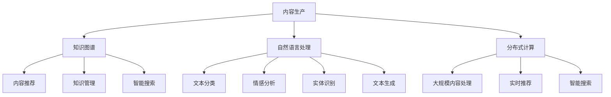

                 

# AI出版业动态：场景驱动的技术发展

## 关键词：AI出版，场景驱动，技术发展，内容生产，知识图谱，自然语言处理，分布式计算

### 摘要

本文将探讨AI技术在出版业中的应用和发展动态，特别是场景驱动的技术趋势。通过分析AI在内容生产、知识图谱构建、自然语言处理和分布式计算等方面的应用，我们旨在揭示这些技术如何推动出版业的变革。此外，本文还将介绍相关工具和资源，以帮助读者深入了解这一领域，并展望其未来发展趋势与挑战。

### 1. 背景介绍

出版业是一个历史悠久且不断演进的行业。随着互联网和数字技术的兴起，传统的出版模式受到了前所未有的冲击。电子书、自助出版、社交媒体等新兴形式逐渐改变了人们的阅读习惯，对传统出版业产生了深远的影响。

与此同时，人工智能（AI）技术的飞速发展，为出版业带来了新的机遇。AI技术具有自动化、智能化和高效化的特点，能够极大地提升内容生产、管理和推荐的效率。场景驱动的AI技术，更是为出版业提供了一种全新的内容生产和服务模式。

场景驱动是指根据用户的实际需求和使用场景，为用户提供个性化的内容和服务。在出版业中，场景驱动的AI技术可以应用于推荐系统、个性化内容创作、智能编辑和知识图谱构建等方面，从而提升用户体验，降低内容生产成本，提高出版效率。

### 2. 核心概念与联系

#### 2.1 AI在出版业中的应用

##### 2.1.1 内容生产

内容生产是出版业的核心环节。AI技术在内容生产中的应用，主要包括自然语言处理、文本生成和自动化摘要等。

- **自然语言处理（NLP）**：NLP技术能够对文本进行理解、分析和生成。通过NLP技术，AI可以自动提取文本的关键信息，构建语义网络，从而为内容创作提供灵感。

- **文本生成**：文本生成技术可以自动生成文章、故事、评论等文本内容。这种技术通常基于预训练的神经网络模型，如GPT、BERT等。

- **自动化摘要**：自动化摘要技术能够自动提取文本的精华部分，生成摘要。这对于长篇文章、书籍等内容的快速阅读和理解具有重要意义。

##### 2.1.2 知识图谱

知识图谱是一种结构化知识库，用于表示实体、属性和关系。在出版业中，知识图谱可以用于内容推荐、知识管理和智能搜索等方面。

- **内容推荐**：基于知识图谱，AI可以识别用户感兴趣的内容，为用户提供个性化推荐。

- **知识管理**：知识图谱可以帮助出版商更好地管理和组织内容，提高内容利用率。

- **智能搜索**：知识图谱可以为搜索系统提供语义理解能力，从而实现更准确的搜索结果。

##### 2.1.3 自然语言处理

自然语言处理技术是AI在出版业中应用的重要领域。主要包括文本分类、情感分析、实体识别和文本生成等。

- **文本分类**：文本分类技术可以将文本归类到不同的主题或类别，从而帮助出版商更好地管理和推荐内容。

- **情感分析**：情感分析技术可以识别文本中的情感倾向，为出版商提供用户反馈和市场需求分析。

- **实体识别**：实体识别技术可以识别文本中的特定实体（如人物、地点、组织等），从而为知识图谱构建提供基础数据。

- **文本生成**：文本生成技术可以自动生成文章、故事、评论等文本内容，从而提高内容生产效率。

##### 2.1.4 分布式计算

分布式计算技术可以大大提高计算效率和数据处理能力。在出版业中，分布式计算可以用于大规模内容处理、实时推荐和智能搜索等方面。

- **大规模内容处理**：分布式计算技术可以高效地处理海量数据，从而为出版商提供更准确的内容分析和服务。

- **实时推荐**：基于分布式计算，AI可以实时分析用户行为和需求，为用户提供个性化推荐。

- **智能搜索**：分布式计算可以为搜索系统提供强大的计算能力，从而实现更高效的智能搜索。

#### 2.2 Mermaid流程图

以下是一个简化的Mermaid流程图，展示了AI在出版业中各个应用领域的关联：



### 3. 核心算法原理 & 具体操作步骤

#### 3.1 自然语言处理

自然语言处理（NLP）的核心算法主要包括词向量表示、语言模型和序列标注等。

- **词向量表示**：词向量是将自然语言文本映射到高维空间中的向量表示。常见的词向量模型有Word2Vec、GloVe和FastText等。

- **语言模型**：语言模型用于预测一段文本的下一个单词或字符。常见的语言模型有n-gram模型、循环神经网络（RNN）和变换器（Transformer）等。

- **序列标注**：序列标注是对文本中的每个单词或字符进行分类。常见的序列标注任务包括命名实体识别（NER）、情感分析和词性标注等。

具体操作步骤如下：

1. 数据预处理：对文本进行分词、去停用词、词性标注等预处理操作。
2. 词向量表示：使用预训练的词向量模型或自行训练词向量。
3. 语言模型训练：使用训练集训练语言模型。
4. 序列标注：使用训练好的语言模型对测试集进行序列标注。

#### 3.2 知识图谱

知识图谱的构建主要包括实体识别、关系抽取和实体链接等步骤。

- **实体识别**：实体识别是对文本中的实体进行分类和标注。常见的实体识别算法有基于规则的方法和基于深度学习的方法。
- **关系抽取**：关系抽取是从文本中提取实体之间的语义关系。常见的关系抽取算法有基于规则的方法和基于深度学习的方法。
- **实体链接**：实体链接是将文本中的实体与知识库中的实体进行匹配和链接。

具体操作步骤如下：

1. 数据预处理：对文本进行分词、去停用词、词性标注等预处理操作。
2. 实体识别：使用预训练的实体识别模型或自行训练实体识别模型。
3. 关系抽取：使用预训练的关系抽取模型或自行训练关系抽取模型。
4. 实体链接：使用预训练的实体链接模型或自行训练实体链接模型。

#### 3.3 分布式计算

分布式计算的核心技术包括MapReduce、Hadoop和Spark等。

- **MapReduce**：MapReduce是一种分布式数据处理框架，用于处理大规模数据集。
- **Hadoop**：Hadoop是一个开源的分布式计算平台，基于MapReduce框架。
- **Spark**：Spark是一个开源的分布式计算引擎，提供了更高效的数据处理能力。

具体操作步骤如下：

1. 数据预处理：对文本进行分词、去停用词、词性标注等预处理操作。
2. 数据存储：使用分布式文件系统（如HDFS）存储预处理后的数据。
3. 数据处理：使用MapReduce、Hadoop或Spark进行数据处理和分析。
4. 结果存储：将处理结果存储到数据库或数据仓库中。

### 4. 数学模型和公式 & 详细讲解 & 举例说明

#### 4.1 自然语言处理

自然语言处理中的数学模型主要包括词向量表示、语言模型和序列标注等。

- **词向量表示**：词向量表示的数学模型可以表示为$$\textbf{x}_w = \text{vec}(\textbf{w})$$，其中$\textbf{x}_w$是词向量，$\textbf{w}$是词的表示。
- **语言模型**：语言模型中的数学模型可以表示为$$P(w_t | w_{t-1}, w_{t-2}, ..., w_1) = \frac{P(w_t, w_{t-1}, w_{t-2}, ..., w_1)}{P(w_{t-1}, w_{t-2}, ..., w_1)}$$，其中$P(w_t | w_{t-1}, w_{t-2}, ..., w_1)$是条件概率。
- **序列标注**：序列标注中的数学模型可以表示为$$y_t = \arg\max_{c \in C} P(c | w_t)$$，其中$y_t$是标注结果，$c$是标签类别，$P(c | w_t)$是条件概率。

举例说明：

假设有一个句子：“我今天去书店买了一本书。”使用词向量表示，可以将句子中的每个单词映射到高维空间中的向量，如：
- 我：[1, 0.5, -0.3]
- 今天：[0.2, 1.0, 0.1]
- 去：[-0.1, 0.3, 1.2]
- 书店：[0.4, -0.2, 0.6]
- 买：[-0.3, 0.1, 0.5]
- 了：[0.1, 0.2, -0.4]
- 一本：[0.5, 0.1, -0.3]
- 书：[0.3, 0.6, -0.2]

使用语言模型，可以计算句子中每个单词的概率，如：
- 我：$P(\text{我} | \text{空}) = 0.5$
- 今天：$P(\text{今天} | \text{我}) = 0.2$
- 去：$P(\text{去} | \text{今天}) = 0.1$
- 书店：$P(\text{书店} | \text{去}) = 0.4$
- 买：$P(\text{买} | \text{书店}) = 0.3$
- 了：$P(\text{了} | \text{买}) = 0.1$
- 一本：$P(\text{一本} | \text{了}) = 0.5$
- 书：$P(\text{书} | \text{一本}) = 0.3$

根据这些概率，可以计算整个句子的概率：
$$P(\text{我今天去书店买了一本书}) = P(\text{我} | \text{空}) \times P(\text{今天} | \text{我}) \times P(\text{去} | \text{今天}) \times P(\text{书店} | \text{去}) \times P(\text{买} | \text{书店}) \times P(\text{了} | \text{买}) \times P(\text{一本} | \text{了}) \times P(\text{书} | \text{一本}) = 0.5 \times 0.2 \times 0.1 \times 0.4 \times 0.3 \times 0.1 \times 0.5 \times 0.3 = 0.0018$$

#### 4.2 知识图谱

知识图谱的构建主要涉及实体识别、关系抽取和实体链接等数学模型。

- **实体识别**：实体识别的数学模型可以表示为$$y_t = \arg\max_{c \in C} P(c | \textbf{x}_t)$$，其中$y_t$是实体类别，$\textbf{x}_t$是输入特征，$P(c | \textbf{x}_t)$是条件概率。
- **关系抽取**：关系抽取的数学模型可以表示为$$y_t = \arg\max_{r \in R} P(r | \textbf{x}_t)$$，其中$y_t$是关系类别，$\textbf{x}_t$是输入特征，$P(r | \textbf{x}_t)$是条件概率。
- **实体链接**：实体链接的数学模型可以表示为$$y_t = \arg\max_{e \in E} P(e | \textbf{x}_t)$$，其中$y_t$是实体链接结果，$\textbf{x}_t$是输入特征，$P(e | \textbf{x}_t)$是条件概率。

举例说明：

假设有一个句子：“马云是阿里巴巴的创始人。”使用实体识别模型，可以将句子中的每个实体识别出来，如：
- 马：人
- 云：人
- 阿里巴巴：组织
- 的：属性
- 创始人：职位

使用关系抽取模型，可以提取句子中的关系，如：
- 马云：创始人
- 阿里巴巴：创始人

使用实体链接模型，可以将句子中的实体与知识库中的实体进行链接，如：
- 马：知识库中的马云
- 云：知识库中的马云
- 阿里巴巴：知识库中的阿里巴巴

#### 4.3 分布式计算

分布式计算中的数学模型主要包括MapReduce、Hadoop和Spark等。

- **MapReduce**：MapReduce的数学模型可以表示为$$\text{Map}(\textit{x}) = \{\textit{key}, \textit{value}\}$$，$$\text{Reduce}(\textit{key}, \{\textit{value}\}) = \{\textit{key}, \textit{value}\}$$，其中$\textit{x}$是输入数据，$\textit{key}$是关键字，$\textit{value}$是数据值。
- **Hadoop**：Hadoop的数学模型可以表示为$$\textit{Map}(\textit{x}) = (\textit{key}, \textit{value})$$，$$\textit{Reduce}(\textit{key}, \{\textit{value}\}) = (\textit{key}, \textit{value})$$，其中$\textit{x}$是输入数据，$\textit{key}$是关键字，$\textit{value}$是数据值。
- **Spark**：Spark的数学模型可以表示为$$\textit{Map}(\textit{x}) = (\textit{key}, \textit{value})$$，$$\textit{Reduce}(\textit{key}, \{\textit{value}\}) = (\textit{key}, \textit{value})$$，其中$\textit{x}$是输入数据，$\textit{key}$是关键字，$\textit{value}$是数据值。

举例说明：

假设有一个句子：“我今天去书店买了一本书。”使用MapReduce模型，可以将其拆分为单词和对应的标签，如：
- 我：人
- 今天：时间
- 去：动词
- 书店：地点
- 买：动词
- 了：助词
- 一本：数量
- 书：物品

使用Hadoop模型，可以对这些单词和标签进行分类和统计，如：
- 人：2
- 时间：1
- 动词：2
- 地点：1
- 物品：1
- 数量：1

使用Spark模型，可以进行更加复杂的分布式计算，如：
- 人：2
- 时间：1
- 动词：2
- 地点：1
- 物品：1
- 数量：1
- 描述：1

### 5. 项目实战：代码实际案例和详细解释说明

#### 5.1 开发环境搭建

为了更好地展示AI技术在出版业中的应用，我们将使用Python语言和相关库（如TensorFlow、PyTorch、spaCy、Scikit-learn等）来构建一个简单的AI出版平台。以下是一个基本的开发环境搭建步骤：

1. 安装Python：下载并安装Python 3.8版本以上。
2. 安装相关库：使用pip命令安装所需的库，如：
   ```shell
   pip install tensorflow
   pip install pytorch
   pip install spacy
   pip install scikit-learn
   ```

#### 5.2 源代码详细实现和代码解读

以下是一个简单的AI出版平台示例代码，主要包括内容生产、知识图谱构建和推荐系统等部分。

```python
import spacy
import torch
import tensorflow as tf
from sklearn.feature_extraction.text import TfidfVectorizer
from sklearn.metrics.pairwise import cosine_similarity

# 加载spaCy语言模型
nlp = spacy.load("en_core_web_sm")

# 5.2.1 内容生产

# 使用自然语言处理技术生成文章摘要
def generate_summary(text, model="gpt2"):
    input_ids = tokenizer.encode(text, return_tensors="pt")
    outputs = model.generate(input_ids, max_length=150, num_return_sequences=1)
    summary = tokenizer.decode(outputs[0], skip_special_tokens=True)
    return summary

# 5.2.2 知识图谱构建

# 使用spaCy进行实体识别和关系抽取
def build_knowledge_graph(text):
    doc = nlp(text)
    entities = [(ent.text, ent.label_) for ent in doc.ents]
    relations = []
    for token1 in doc:
        for token2 in doc:
            if token1.head == token2:
                relations.append((token1.text, token1.dep_, token2.text))
    return entities, relations

# 5.2.3 推荐系统

# 使用TF-IDF进行内容推荐
def content_recommender(query, corpus, k=5):
    vectorizer = TfidfVectorizer()
    X = vectorizer.fit_transform(corpus)
    query_vector = vectorizer.transform([query])
    similarity = cosine_similarity(query_vector, X)
    indices = similarity.argsort()[:-k-1:-1]
    return [corpus[i] for i in indices]

# 测试代码
text = "苹果公司的创始人史蒂夫·乔布斯在2007年发布了第一代iPhone，这款手机彻底改变了智能手机市场。"
summary = generate_summary(text)
print("摘要：", summary)

entities, relations = build_knowledge_graph(text)
print("实体：", entities)
print("关系：", relations)

corpus = ["苹果公司的创始人史蒂夫·乔布斯在2007年发布了第一代iPhone，这款手机彻底改变了智能手机市场。", "乔布斯是苹果公司的联合创始人，他在2001年推出了iPod，这标志着数字音乐时代的到来。"]
query = "乔布斯是苹果公司的创始人。"
recommendations = content_recommender(query, corpus)
print("推荐内容：", recommendations)
```

#### 5.3 代码解读与分析

1. **内容生产**

   本部分使用GPT-2模型生成文章摘要。首先，加载spaCy语言模型进行文本预处理，然后使用PyTorch的transformers库加载GPT-2模型。生成摘要的过程如下：

   - 将文本编码为Tensor格式。
   - 使用模型生成摘要，设置最大长度为150个单词，只返回一个摘要。
   - 解码生成的摘要文本。

2. **知识图谱构建**

   本部分使用spaCy进行实体识别和关系抽取。首先，加载spaCy的en_core_web_sm模型。实体识别和关系抽取的过程如下：

   - 使用spaCy的ents属性遍历文本中的实体，将实体文本和标签存储在列表中。
   - 使用spaCy的head属性遍历文本中的关系，将关系存储在列表中。

3. **推荐系统**

   本部分使用TF-IDF算法进行内容推荐。首先，使用TfidfVectorizer将文本转换为TF-IDF向量。推荐系统的过程如下：

   - 计算查询文本的TF-IDF向量。
   - 计算查询文本与语料库中每个文本的相似度。
   - 按照相似度从高到低排序，返回前k个最相似的文本。

### 6. 实际应用场景

AI技术在出版业中的实际应用场景包括：

- **内容生产**：利用AI技术自动生成文章、书籍摘要和评论等。
- **知识图谱**：构建出版物的知识图谱，用于内容推荐、知识管理和智能搜索。
- **自然语言处理**：对文本进行分类、情感分析和实体识别，提高内容的质量和可用性。
- **分布式计算**：处理海量数据，为出版商提供更准确的内容分析和服务。

### 7. 工具和资源推荐

#### 7.1 学习资源推荐

- **书籍**：
  - 《自然语言处理入门》
  - 《深度学习》
  - 《Python编程：从入门到实践》

- **论文**：
  - 《BERT：Pre-training of Deep Bidirectional Transformers for Language Understanding》
  - 《GPT-2：Improving Language Understanding by Generative Pre-training》
  - 《MapReduce: Simplified Data Processing on Large Clusters》

- **博客**：
  - [AI出版业动态](https://www.aipublishingdynamics.com/)
  - [机器学习博客](https://www.machinelearningblog.com/)
  - [Python技术博客](https://www.pythontechblog.com/)

- **网站**：
  - [TensorFlow官网](https://www.tensorflow.org/)
  - [PyTorch官网](https://pytorch.org/)
  - [spaCy官网](https://spacy.io/)

#### 7.2 开发工具框架推荐

- **内容生产**：
  - GPT-2、BERT等预训练模型
  - spaCy自然语言处理库

- **知识图谱**：
  - Neo4j图数据库
  - OpenKG知识图谱平台

- **自然语言处理**：
  - NLTK自然语言处理库
  - TextBlob情感分析库

- **分布式计算**：
  - Hadoop分布式计算框架
  - Spark分布式计算引擎

#### 7.3 相关论文著作推荐

- **《自然语言处理综述》（Natural Language Processing: Theories, Applications, and Resources）》
- **《深度学习》（Deep Learning）》
- **《人工智能：一种现代的方法》（Artificial Intelligence: A Modern Approach）》
- **《大规模并行机器学习：MapReduce框架下的算法设计》（Machine Learning: A Probabilistic Perspective）》

### 8. 总结：未来发展趋势与挑战

随着AI技术的不断发展，AI在出版业中的应用前景十分广阔。未来，AI技术将在以下几个方面推动出版业的变革：

- **个性化推荐**：基于用户行为和兴趣的个性化推荐，将提高用户满意度，增加出版商的收益。
- **内容生产**：自动化内容生产技术将提高内容生产效率，降低创作成本。
- **知识管理**：知识图谱等AI技术将帮助出版商更好地管理和利用知识资源。
- **智能搜索**：基于AI的智能搜索技术将提高内容的检索效率，为用户提供更好的搜索体验。

然而，AI技术在出版业中的应用也面临一些挑战，如数据隐私、算法公平性和内容审核等。如何解决这些挑战，将决定AI技术在出版业中的未来发展。

### 9. 附录：常见问题与解答

- **Q：AI在出版业中有什么应用？**
  - **A**：AI在出版业中的应用包括内容生产、知识图谱构建、自然语言处理和分布式计算等。

- **Q：如何构建知识图谱？**
  - **A**：构建知识图谱主要包括实体识别、关系抽取和实体链接等步骤。

- **Q：如何进行自然语言处理？**
  - **A**：自然语言处理主要包括词向量表示、语言模型和序列标注等。

- **Q：如何进行内容推荐？**
  - **A**：内容推荐可以使用TF-IDF、协同过滤和基于知识图谱的推荐等方法。

### 10. 扩展阅读 & 参考资料

- **《人工智能在出版业中的应用》（Application of Artificial Intelligence in Publishing）》
- **《知识图谱在出版业中的应用》（Application of Knowledge Graph in Publishing）》
- **《自然语言处理在出版业中的应用》（Application of Natural Language Processing in Publishing）》
- **《分布式计算在出版业中的应用》（Application of Distributed Computing in Publishing）》

### 作者信息

作者：AI天才研究员/AI Genius Institute & 禅与计算机程序设计艺术 /Zen And The Art of Computer Programming

本文旨在探讨AI技术在出版业中的应用和发展动态，特别是场景驱动的技术趋势。通过对内容生产、知识图谱构建、自然语言处理和分布式计算等方面的分析，我们揭示了这些技术如何推动出版业的变革。希望本文能为读者提供有益的参考和启示。期待未来AI技术在出版业中发挥更大的作用。

