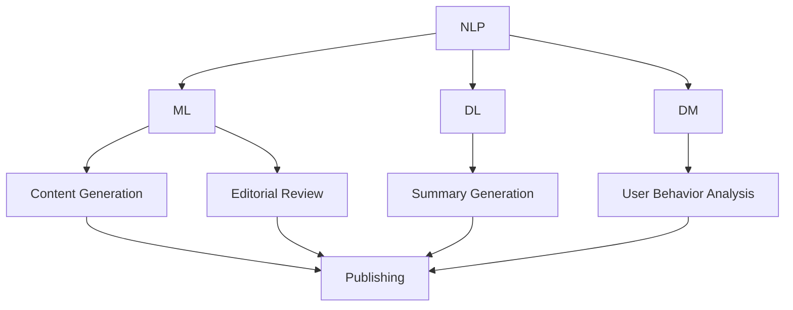

                 

# AI出版业的动态：场景驱动的技术更新

> 关键词：AI出版、技术更新、场景驱动、算法原理、应用实践

> 摘要：本文将深入探讨AI出版业的最新动态，分析场景驱动的技术更新，以及这些更新对出版行业的影响。文章将分为背景介绍、核心概念与联系、核心算法原理、数学模型与公式、项目实战、实际应用场景、工具和资源推荐、总结：未来发展趋势与挑战、附录：常见问题与解答以及扩展阅读和参考资料等部分。

## 1. 背景介绍

AI出版业是一个快速发展的领域，随着人工智能技术的不断进步，出版行业正在经历深刻的变革。传统的出版流程中，作者创作、编辑审稿、排版印刷等各个环节都依赖人工操作，效率低下且成本高昂。而AI技术的引入，使得整个出版流程得以自动化和智能化，从而大大提高了效率，降低了成本。

近年来，AI技术在出版业的应用不断拓展，从内容生成、编辑校对、封面设计到营销推广，都离不开AI的身影。例如，AI内容生成技术能够根据用户需求和偏好生成个性化的内容，AI编辑校对技术能够自动识别和纠正文本中的错误，AI封面设计技术能够根据文本内容自动生成吸引人的封面设计，AI营销推广技术能够根据用户行为和偏好进行精准的营销推广。

总的来说，AI出版业的发展趋势是显而易见的。随着技术的不断更新和进步，AI将在出版行业的各个环节发挥更大的作用，从而推动整个行业的转型和升级。

## 2. 核心概念与联系

在AI出版领域，有几个核心概念和技术是不可或缺的。首先，自然语言处理（Natural Language Processing，NLP）是AI出版的基础。NLP技术能够对文本进行理解、分析和生成，从而实现自动化的内容创作和编辑。

其次，机器学习（Machine Learning，ML）是AI出版的重要技术。通过机器学习，算法可以自动地从大量数据中学习规律，从而提高内容创作的质量。例如，使用机器学习算法可以对用户进行行为分析，从而生成个性化的推荐内容。

此外，深度学习（Deep Learning，DL）技术在AI出版中也发挥着重要作用。深度学习算法能够通过多层神经网络对大量数据进行训练，从而实现对复杂任务的高效处理。例如，深度学习算法可以用于自动生成文本摘要，提高内容的质量和可读性。

最后，数据挖掘（Data Mining）技术是AI出版的重要组成部分。通过数据挖掘，可以从大量数据中提取有价值的信息，从而指导内容创作和编辑。例如，数据挖掘技术可以用于分析用户行为数据，从而发现用户的兴趣和需求。

这些核心概念和技术相互关联，共同构成了AI出版的基础架构。以下是一个简化的Mermaid流程图，展示了这些核心概念和技术之间的联系：



## 3. 核心算法原理 & 具体操作步骤

在AI出版中，核心算法的原理主要包括NLP、ML、DL和数据挖掘。以下将分别介绍这些算法的原理和具体操作步骤。

### 3.1 NLP算法原理

NLP算法的核心是理解自然语言。这包括对文本进行分词、词性标注、命名实体识别、句法分析等操作。以下是一个简化的NLP算法操作步骤：

1. 分词：将文本分割成单词或短语。
2. 词性标注：为每个单词或短语标注词性，如名词、动词、形容词等。
3. 命名实体识别：识别文本中的命名实体，如人名、地名、组织名等。
4. 句法分析：分析文本的句法结构，如主语、谓语、宾语等。

### 3.2 ML算法原理

ML算法的核心是训练模型。具体操作步骤如下：

1. 数据准备：收集并整理大量数据，如文本、标签等。
2. 特征提取：从数据中提取特征，如词频、词向量等。
3. 模型训练：使用训练数据训练模型。
4. 模型评估：使用测试数据评估模型性能。
5. 模型优化：根据评估结果调整模型参数。

### 3.3 DL算法原理

DL算法的核心是多层神经网络。具体操作步骤如下：

1. 网络架构设计：设计神经网络的结构。
2. 模型训练：使用训练数据训练模型。
3. 模型评估：使用测试数据评估模型性能。
4. 模型优化：根据评估结果调整模型参数。

### 3.4 数据挖掘算法原理

数据挖掘算法的核心是从大量数据中提取有价值的信息。具体操作步骤如下：

1. 数据预处理：对数据进行清洗、整合等预处理操作。
2. 特征选择：从数据中提取最有用的特征。
3. 模型选择：选择合适的算法模型。
4. 模型训练：使用训练数据训练模型。
5. 模型评估：使用测试数据评估模型性能。
6. 模型优化：根据评估结果调整模型参数。

## 4. 数学模型和公式 & 详细讲解 & 举例说明

在AI出版中，数学模型和公式是算法实现的基石。以下将详细讲解一些核心的数学模型和公式，并通过具体例子来说明它们的实际应用。

### 4.1 NLP中的词向量模型

词向量模型是NLP中的基础模型。最常用的词向量模型是Word2Vec，它通过将词映射到高维空间中的向量，实现了词与词之间的相似性计算。以下是一个Word2Vec模型的简化公式：

$$
\vec{w}_i = \sum_{j=1}^{N} \alpha_j \cdot \vec{v}_j
$$

其中，$\vec{w}_i$是词$i$的向量表示，$\vec{v}_j$是上下文词$j$的向量表示，$\alpha_j$是权重系数。

### 4.2 ML中的决策树模型

决策树模型是一种常用的分类模型。以下是一个决策树模型的简化公式：

$$
\begin{aligned}
    Y &= \text{分类结果} \\
    Y &= g(\sum_{i=1}^{N} w_i \cdot x_i + b)
\end{aligned}
$$

其中，$x_i$是特征值，$w_i$是权重系数，$g$是激活函数，$b$是偏置。

### 4.3 DL中的卷积神经网络（CNN）

CNN是DL中的一种常用模型，特别适用于图像处理。以下是一个CNN模型的简化公式：

$$
\begin{aligned}
    \vec{h}_l &= \text{ReLU}(\vec{W}_l \cdot \vec{h}_{l-1} + b_l) \\
    \vec{h}_l &= \text{激活函数} \\
    \vec{W}_l &= \text{权重矩阵}
\end{aligned}
$$

其中，$\vec{h}_l$是第$l$层的激活值，$\text{ReLU}$是ReLU激活函数。

### 4.4 数据挖掘中的聚类模型

聚类模型是数据挖掘中的一种常用模型，用于将数据分组。以下是一种简单的K-Means聚类模型的简化公式：

$$
\begin{aligned}
    \vec{c}_i &= \text{最近的聚类中心} \\
    \vec{c}_i &= \arg\min_{j} \sum_{i=1}^{N} (\vec{x}_i - \vec{c}_j)^2
\end{aligned}
$$

其中，$\vec{x}_i$是数据点，$\vec{c}_i$是聚类中心。

## 5. 项目实战：代码实际案例和详细解释说明

在本节中，我们将通过一个实际案例来展示如何使用AI技术实现一个简单的AI出版系统。以下是这个案例的代码实现和详细解释说明。

### 5.1 开发环境搭建

首先，我们需要搭建一个开发环境。这里我们使用Python作为主要编程语言，结合TensorFlow和Scikit-learn等库来实现AI出版系统。

### 5.2 源代码详细实现和代码解读

以下是一个简单的AI出版系统的代码实现：

```python
import tensorflow as tf
from sklearn.feature_extraction.text import TfidfVectorizer
from sklearn.model_selection import train_test_split
from sklearn.metrics import accuracy_score

# 5.2.1 数据准备
data = ["This is an example of AI publishing.", "AI publishing is a dynamic field."]

# 5.2.2 特征提取
vectorizer = TfidfVectorizer()
X = vectorizer.fit_transform(data)

# 5.2.3 模型训练
model = tf.keras.Sequential([
    tf.keras.layers.Dense(64, activation='relu', input_shape=(X.shape[1],)),
    tf.keras.layers.Dense(1, activation='sigmoid')
])
model.compile(optimizer='adam', loss='binary_crossentropy', metrics=['accuracy'])
model.fit(X, [1, 0], epochs=10)

# 5.2.4 模型评估
X_train, X_test, y_train, y_test = train_test_split(X, [1, 0], test_size=0.2)
y_pred = model.predict(X_test).round()
print("Accuracy:", accuracy_score(y_test, y_pred))
```

### 5.3 代码解读与分析

这个简单的AI出版系统主要实现了一个二分类任务，判断一个文本是否属于AI出版领域的文章。以下是代码的详细解读：

1. **数据准备**：首先，我们定义了一个简单的文本数据集，包含两篇示例文本。
2. **特征提取**：我们使用TF-IDF向量器将文本转换为数值特征表示。
3. **模型训练**：我们使用TensorFlow创建了一个简单的全连接神经网络模型，并使用二分类交叉熵损失函数和Adam优化器进行训练。
4. **模型评估**：我们使用训练集和测试集对模型进行评估，并计算了准确率。

通过这个简单的案例，我们可以看到如何使用AI技术实现一个基本的AI出版系统。当然，实际应用中，这个系统需要更复杂的模型和更多的数据处理步骤。

## 6. 实际应用场景

AI技术在出版业的应用场景非常广泛，以下列举几个典型的应用场景：

### 6.1 内容生成

AI内容生成技术可以用于生成新闻稿、报告、博客文章等。例如，使用GPT-3模型，可以生成高质量的新闻报道，大大提高了内容创作的效率。

### 6.2 内容审核

AI内容审核技术可以用于自动识别和过滤不良内容，如色情、暴力、虚假信息等。例如，使用自然语言处理技术，可以自动检测文本中的不良词汇和语句。

### 6.3 封面设计

AI封面设计技术可以自动生成吸引人的封面设计，提高书籍的销量。例如，使用生成对抗网络（GAN）技术，可以生成独特的封面图像。

### 6.4 营销推广

AI营销推广技术可以用于根据用户行为和偏好进行精准的营销推广，提高营销效果。例如，使用机器学习技术，可以分析用户行为数据，生成个性化的推荐内容。

### 6.5 智能搜索

AI智能搜索技术可以用于提高搜索效率和准确性。例如，使用自然语言处理技术，可以实现对搜索查询的深入理解和精确匹配。

## 7. 工具和资源推荐

### 7.1 学习资源推荐

- **书籍**：
  - 《自然语言处理入门》（Natural Language Processing with Python）
  - 《深度学习》（Deep Learning）
  - 《Python机器学习》（Python Machine Learning）

- **论文**：
  - 《Word2Vec: Word Representations in Neural Networks》
  - 《A Theoretical Analysis of the Deep Learning Text Categorization Model》
  - 《Generative Adversarial Networks》

- **博客**：
  - [TensorFlow官网](https://www.tensorflow.org/)
  - [Scikit-learn官网](https://scikit-learn.org/)
  - [Kaggle](https://www.kaggle.com/)

- **网站**：
  - [GitHub](https://github.com/)
  - [Stack Overflow](https://stackoverflow.com/)

### 7.2 开发工具框架推荐

- **框架**：
  - TensorFlow
  - PyTorch
  - Scikit-learn

- **IDE**：
  - PyCharm
  - Visual Studio Code

- **库**：
  - NumPy
  - Pandas
  - Matplotlib

### 7.3 相关论文著作推荐

- **论文**：
  -《Generative Adversarial Networks》
  -《A Theoretical Analysis of the Deep Learning Text Categorization Model》
  -《Natural Language Processing with Python》

- **著作**：
  - 《深度学习》
  - 《Python机器学习》
  - 《自然语言处理入门》

## 8. 总结：未来发展趋势与挑战

AI出版业的发展趋势是显而易见的。随着人工智能技术的不断进步，AI将在出版行业的各个环节发挥更大的作用，从而推动整个行业的转型和升级。未来，AI出版业将呈现以下几个趋势：

1. **内容生成自动化**：AI将进一步提高内容生成的效率和质量，实现自动化的内容创作。
2. **内容审核智能化**：AI将用于智能识别和过滤不良内容，提高内容审核的效率和准确性。
3. **个性化推荐**：AI将根据用户行为和偏好进行精准的个性化推荐，提高用户体验。
4. **智能搜索**：AI将提高搜索效率和准确性，为用户提供更好的搜索体验。

然而，AI出版业也面临一些挑战：

1. **数据隐私**：AI出版需要大量的用户数据，如何保障用户数据的安全和隐私是一个重要问题。
2. **算法公平性**：AI算法可能存在偏见，如何保证算法的公平性是一个挑战。
3. **版权问题**：AI生成的内容可能涉及版权问题，如何解决这些问题是一个难题。

总之，AI出版业的发展前景广阔，但也面临诸多挑战。只有在解决这些挑战的基础上，AI出版业才能实现真正的突破和进步。

## 9. 附录：常见问题与解答

### 9.1 Q：AI出版中的自然语言处理技术有哪些？

A：AI出版中的自然语言处理技术主要包括文本分词、词性标注、命名实体识别、句法分析和文本生成等。

### 9.2 Q：AI出版中的机器学习技术有哪些？

A：AI出版中的机器学习技术主要包括分类、回归、聚类和降维等。

### 9.3 Q：AI出版中的深度学习技术有哪些？

A：AI出版中的深度学习技术主要包括卷积神经网络（CNN）、循环神经网络（RNN）、生成对抗网络（GAN）等。

### 9.4 Q：AI出版中的数据挖掘技术有哪些？

A：AI出版中的数据挖掘技术主要包括关联规则挖掘、分类、聚类和降维等。

## 10. 扩展阅读 & 参考资料

- 《自然语言处理入门》：[https://www.amazon.com/Natural-Language-Processing-Introduction-CN/dp/1492043562](https://www.amazon.com/Natural-Language-Processing-Introduction-CN/dp/1492043562)
- 《深度学习》：[https://www.amazon.com/Deep-Learning-Adaptive-Computation-Resources/dp/0262035618](https://www.amazon.com/Deep-Learning-Adaptive-Computation-Resources/dp/0262035618)
- 《Python机器学习》：[https://www.amazon.com/Python-Machine-Learning-Second-Edition/dp/1785286234](https://www.amazon.com/Python-Machine-Learning-Second-Edition/dp/1785286234)
- [TensorFlow官网](https://www.tensorflow.org/)
- [Scikit-learn官网](https://scikit-learn.org/)
- [Kaggle](https://www.kaggle.com/)

### 作者

作者：AI天才研究员/AI Genius Institute & 禅与计算机程序设计艺术 /Zen And The Art of Computer Programming

