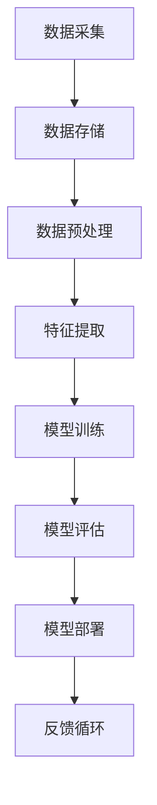

                 

### 背景介绍

AI创业作为一个新兴领域，正以前所未有的速度在全球范围内蓬勃发展。在这个快速迭代的技术浪潮中，数据积累与应用成为推动AI创业成功的关键因素。数据是人工智能的燃料，没有高质量的数据，AI系统就无法发挥其潜力。本文旨在探讨AI创业中的数据积累与应用，旨在为创业者和开发者提供一些实用的指导和建议。

首先，我们需要了解数据积累在AI创业中的重要性。随着AI技术的不断进步，对于数据的需求也越来越大。无论是在机器学习模型的训练、优化还是在实际应用中，数据都是不可或缺的。高质量的数据不仅可以提高模型的准确性和效率，还能帮助创业公司更快地进入市场，并取得竞争优势。

其次，数据积累是一个持续的过程。AI创业公司需要在产品开发的过程中不断收集、清洗、处理和利用数据。这不仅包括用户行为数据、市场数据，还包括公司内部的业务数据。只有不断地积累和更新数据，AI系统才能不断优化，适应市场的变化。

最后，数据的应用是AI创业的核心。数据不仅仅是用来训练模型，它还可以用于产品优化、客户洞察、风险控制等多个方面。如何有效地利用数据，将数据转化为商业价值，是AI创业公司成功的关键。

本文将分为以下几个部分进行讨论：

1. **核心概念与联系**：介绍与AI创业中的数据积累与应用相关的基础概念和架构，使用Mermaid流程图展示数据流动和处理的全过程。
2. **核心算法原理 & 具体操作步骤**：详细阐述在AI创业中使用的主要数据处理算法，包括数据采集、数据预处理、特征提取等，并提供具体操作步骤。
3. **数学模型和公式 & 详细讲解 & 举例说明**：介绍支持数据处理的数学模型和公式，通过实际案例说明其应用和效果。
4. **项目实战：代码实际案例和详细解释说明**：通过一个具体项目案例，展示数据积累与应用的完整实现过程，并解析关键代码和实现细节。
5. **实际应用场景**：探讨数据积累与应用在不同场景下的实际应用，包括产品优化、市场分析、风险管理等。
6. **工具和资源推荐**：推荐用于数据积累与应用的工具、框架和资源，帮助开发者更好地进行数据管理和分析。
7. **总结：未来发展趋势与挑战**：总结本文的主要观点，并展望数据积累与应用在AI创业中的未来发展趋势和面临的挑战。

通过对以上各部分的详细讨论，我们希望能够为AI创业公司提供一些有价值的经验和见解，帮助他们在数据驱动的道路上走得更远。

---

# 数据积累与应用在AI创业中的重要性

In the rapidly evolving landscape of AI entrepreneurship, the significance of data accumulation and application cannot be overstated. Data is the lifeblood of artificial intelligence, serving as the foundation upon which models are trained, optimized, and deployed. Without high-quality data, AI systems are rendered ineffective, as they rely on vast datasets to learn patterns, make predictions, and generate insights. Therefore, understanding the importance of data accumulation and its application is crucial for any AI startup looking to succeed in this highly competitive field.

## The Role of Data in AI Development

Data plays a pivotal role in the entire AI development lifecycle. It is not merely a byproduct but a core component that drives the success of AI initiatives. Here are some key roles data fulfills in AI development:

### Model Training and Optimization

Data is the primary input for training AI models. The quality and quantity of the data directly impact the performance of these models. High-quality data allows models to learn accurate patterns and make precise predictions. Conversely, poor-quality data can lead to overfitting, where the model performs exceptionally well on the training data but fails to generalize to new, unseen data. Therefore, the accumulation of large, diverse, and representative datasets is essential for developing robust AI models.

### Continuous Learning and Improvement

AI models are not static; they require continuous learning and improvement. Data accumulation enables this process by providing new information that allows models to adapt and evolve over time. This continuous learning loop ensures that AI systems remain up-to-date with the latest trends, behaviors, and demands of the market.

### Real-world Applications

Data is not only used for model training but also for real-world applications. In AI-driven products and services, data is leveraged to provide personalized experiences, improve decision-making, and enhance overall user satisfaction. For example, in healthcare, patient data can be used to predict diseases and personalize treatment plans. In finance, data analysis can help detect fraud and optimize investment strategies.

### Competitive Advantage

Access to high-quality data can provide a significant competitive advantage to AI startups. Companies that can collect, process, and analyze data more efficiently than their competitors can gain valuable insights and make informed decisions. This data-driven approach can lead to better product development, faster time-to-market, and higher customer satisfaction.

## Challenges in Data Accumulation

While the importance of data in AI development is clear, accumulating high-quality data is not without its challenges. Some of the key challenges include:

### Data Privacy and Security

Collecting and storing large amounts of data can raise concerns about privacy and security. AI startups must comply with data protection regulations and implement robust security measures to safeguard sensitive information.

### Data Quality and Consistency

Data quality is crucial for the success of AI models. Inaccurate, incomplete, or inconsistent data can lead to poor model performance. AI startups need to invest in data cleaning and validation processes to ensure data integrity.

### Data Diversity and Representation

Diverse and representative data is essential for training unbiased and generalized models. AI startups need to ensure that their datasets are diverse and inclusive to avoid biases and ensure fairness.

### Data Integration and Management

Managing and integrating data from multiple sources can be complex. AI startups need to develop robust data management systems to handle data ingestion, storage, processing, and analysis efficiently.

## Conclusion

In conclusion, data accumulation and application are fundamental to the success of AI entrepreneurship. High-quality data is the cornerstone of AI development, enabling models to learn, adapt, and provide valuable insights. AI startups must recognize the importance of data and invest in the necessary infrastructure and processes to collect, process, and analyze data effectively. By doing so, they can gain a competitive edge, drive innovation, and create transformative products and services.

---

### 核心概念与联系

在深入探讨AI创业中的数据积累与应用之前，我们需要理解一些核心概念及其相互之间的联系。以下是几个关键概念及其在数据积累与应用中的作用：

#### 数据集（Dataset）

数据集是AI创业过程中最基本的要素。它由一系列相关数据样本组成，用于训练、评估和部署AI模型。数据集的质量直接影响到AI模型的性能。一个高质量的数据集应该具有代表性、多样性和准确性。

#### 数据预处理（Data Preprocessing）

数据预处理是数据积累过程中的关键步骤，旨在将原始数据转换为适合模型训练的形式。数据预处理包括数据清洗、数据归一化、数据转换等操作，以确保数据的质量和一致性。

#### 特征提取（Feature Extraction）

特征提取是从原始数据中提取对模型训练有用的信息的过程。通过特征提取，原始数据被转换为能够反映数据本质的特征，从而提高模型的训练效率和效果。

#### 模型训练（Model Training）

模型训练是使用数据集来训练AI模型的过程。在训练过程中，模型通过学习数据中的模式来生成预测或分类结果。模型的训练质量取决于数据集的质量和预处理步骤。

#### 模型评估（Model Evaluation）

模型评估是评估训练好的模型性能的过程。常用的评估指标包括准确率、召回率、F1分数等。模型评估帮助确定模型是否达到预期性能，并指导进一步的优化。

#### 数据流（Data Flow）

数据流是指数据从收集、处理到应用的全过程。数据流包括数据采集、数据存储、数据预处理、特征提取、模型训练、模型评估和模型部署等环节。

下面，我们使用Mermaid流程图来展示数据积累与应用的整个流程：



在这个流程图中：

- **A[数据采集]**：数据从各种来源（如用户行为、传感器数据、公共数据集等）被收集。
- **B[数据存储]**：收集到的数据被存储在数据库或数据湖中。
- **C[数据预处理]**：对存储的数据进行清洗、归一化和转换，确保数据的质量和一致性。
- **D[特征提取]**：从预处理后的数据中提取有用的特征。
- **E[模型训练]**：使用提取的特征训练AI模型。
- **F[模型评估]**：评估训练好的模型性能，确保其满足预期。
- **G[模型部署]**：将训练好的模型部署到生产环境中，用于实际应用。
- **H[反馈循环]**：收集模型在实际应用中的表现数据，用于模型迭代和优化。

通过这个流程，AI创业公司可以有效地积累和应用数据，从而推动AI系统的持续改进和优化。

---

## 核心算法原理 & 具体操作步骤

在AI创业中，核心算法和数据处理的正确性和效率直接影响到AI系统的性能和效果。下面，我们将详细探讨几个关键的数据处理算法及其具体操作步骤，包括数据采集、数据预处理、特征提取和模型训练。

### 数据采集（Data Collection）

数据采集是数据积累的第一步，也是最重要的一步。数据采集的目的是从各种来源（如用户行为、传感器数据、社交媒体等）收集原始数据。数据采集的方法包括：

- **自动化采集**：使用API、爬虫或日志分析工具自动收集数据。
- **手动采集**：通过调查问卷、用户反馈或专家访谈等方式收集数据。
- **外部数据源**：从公共数据集、第三方数据提供商或其他开放数据源获取数据。

具体操作步骤如下：

1. **确定数据需求**：明确需要收集的数据类型、格式和量级。
2. **选择数据源**：根据数据需求选择合适的数据源。
3. **设置采集工具**：配置API调用、爬虫脚本或日志分析工具。
4. **数据采集**：启动采集工具，定期获取数据。
5. **数据存储**：将采集到的数据存储在数据库或数据湖中。

### 数据预处理（Data Preprocessing）

数据预处理是数据积累的关键步骤，它确保数据的质量和一致性，为后续的特征提取和模型训练提供基础。数据预处理的步骤包括：

- **数据清洗**：去除数据中的噪声、错误和重复记录。
- **数据归一化**：将不同量纲的数据转换为相同的尺度，以消除量纲的影响。
- **数据转换**：将数据格式转换为适合模型训练的形式，如将文本转换为向量或图像转换为像素矩阵。
- **数据采样**：根据需要从原始数据中随机选择一部分数据用于训练和测试。

具体操作步骤如下：

1. **数据清洗**：使用Python的Pandas库或SQL等工具去除噪声和错误。
2. **数据归一化**：使用Min-Max Scaling或Standard Scaling等方法进行归一化。
3. **数据转换**：使用NLP库（如NLTK、spaCy）处理文本数据，使用图像处理库（如OpenCV）处理图像数据。
4. **数据采样**：使用scikit-learn库中的train_test_split函数进行数据采样。

### 特征提取（Feature Extraction）

特征提取是从原始数据中提取对模型训练有用的信息的过程。特征提取的目的是简化数据，同时保留关键信息，提高模型的训练效率和效果。特征提取的方法包括：

- **统计特征**：计算数据的基本统计指标，如平均值、中位数、标准差等。
- **文本特征**：从文本数据中提取词频、词嵌入、TF-IDF等特征。
- **图像特征**：从图像数据中提取边缘、纹理、颜色等特征。
- **时间序列特征**：从时间序列数据中提取趋势、周期性、季节性等特征。

具体操作步骤如下：

1. **统计特征提取**：使用Python的Scikit-learn库中的FeatureSelection类。
2. **文本特征提取**：使用NLTK、spaCy或Gensim等库进行词频、词嵌入和TF-IDF计算。
3. **图像特征提取**：使用OpenCV、TensorFlow等库提取边缘、纹理、颜色等特征。
4. **时间序列特征提取**：使用Prophet、ARIMA等模型提取趋势、周期性和季节性特征。

### 模型训练（Model Training）

模型训练是使用数据集来训练AI模型的过程。在训练过程中，模型通过学习数据中的模式来生成预测或分类结果。模型训练的方法包括：

- **监督学习**：使用标记数据集训练模型，模型通过学习标记来预测未标记数据。
- **无监督学习**：使用未标记数据集训练模型，模型通过学习数据中的模式来自发形成结构。
- **强化学习**：通过与环境交互，模型不断优化其行为策略。

具体操作步骤如下：

1. **选择模型**：根据问题类型和需求选择合适的模型，如线性回归、决策树、神经网络等。
2. **数据分割**：将数据集分为训练集、验证集和测试集。
3. **模型训练**：使用训练集训练模型，并使用验证集调整模型参数。
4. **模型评估**：使用测试集评估模型性能，并选择最优模型。
5. **模型部署**：将训练好的模型部署到生产环境中。

通过上述数据处理算法的具体操作步骤，AI创业公司可以有效地进行数据积累与应用，从而构建高质量的AI系统，实现业务目标。

---

## 数学模型和公式 & 详细讲解 & 举例说明

在AI创业中，数学模型和公式是理解和应用数据的关键工具。以下是一些常用的数学模型和公式，我们将通过详细讲解和实际案例来说明它们的应用和效果。

### 模型评估指标

在评估模型性能时，常用的指标包括准确率（Accuracy）、召回率（Recall）、精确率（Precision）和F1分数（F1 Score）。以下是这些指标的计算公式：

#### 准确率（Accuracy）
$$
Accuracy = \frac{TP + TN}{TP + TN + FP + FN}
$$
其中，TP代表真正例（True Positive），TN代表真负例（True Negative），FP代表假正例（False Positive），FN代表假负例（False Negative）。

#### 召回率（Recall）
$$
Recall = \frac{TP}{TP + FN}
$$
召回率衡量模型识别出真正例的能力。

#### 精确率（Precision）
$$
Precision = \frac{TP}{TP + FP}
$$
精确率衡量模型识别出正例的准确度。

#### F1分数（F1 Score）
$$
F1 Score = 2 \times \frac{Precision \times Recall}{Precision + Recall}
$$
F1分数是精确率和召回率的调和平均，用于综合考虑模型性能。

### 举例说明

假设有一个分类模型，用于判断邮件是否为垃圾邮件。测试集包含1000封邮件，其中500封是垃圾邮件，500封是正常邮件。测试结果如下：

- 真正例（TP）：300
- 真负例（TN）：400
- 假正例（FP）：100
- 假负例（FN）：100

根据上述公式，可以计算模型的性能指标：

$$
Accuracy = \frac{300 + 400}{300 + 400 + 100 + 100} = 0.75
$$

$$
Recall = \frac{300}{300 + 100} = 0.75
$$

$$
Precision = \frac{300}{300 + 100} = 0.75
$$

$$
F1 Score = 2 \times \frac{0.75 \times 0.75}{0.75 + 0.75} = 0.75
$$

这个例子中，模型的所有性能指标都为0.75，说明模型在判断垃圾邮件方面表现较好。

### 数据预处理

在数据预处理过程中，常用的方法包括数据归一化和特征提取。以下是一个数据归一化的示例：

#### 数据归一化（Min-Max Scaling）
$$
x_{\text{normalized}} = \frac{x - x_{\text{min}}}{x_{\text{max}} - x_{\text{min}}}
$$
其中，$x$ 是原始数据，$x_{\text{min}}$ 和 $x_{\text{max}}$ 分别是数据的最小值和最大值。

假设有一个包含学生成绩的数据集，分数范围在0到100之间。要对这个数据集进行归一化：

$$
x_{\text{normalized}} = \frac{x - 0}{100 - 0} = \frac{x}{100}
$$

例如，一个学生的原始成绩为85，归一化后的成绩为：

$$
x_{\text{normalized}} = \frac{85}{100} = 0.85
$$

### 特征提取

在特征提取过程中，常用的方法包括统计特征提取、文本特征提取和图像特征提取。以下是一个统计特征提取的示例：

#### 均值（Mean）和标准差（Standard Deviation）
$$
\text{Mean} = \frac{1}{N} \sum_{i=1}^{N} x_i
$$
$$
\text{Standard Deviation} = \sqrt{\frac{1}{N-1} \sum_{i=1}^{N} (x_i - \text{Mean})^2}
$$
其中，$N$ 是数据点的数量，$x_i$ 是第$i$个数据点。

假设有一个包含学生考试成绩的数据集，共有5个数据点：85, 90, 78, 92, 88。要计算均值和标准差：

$$
\text{Mean} = \frac{85 + 90 + 78 + 92 + 88}{5} = 85.6
$$

$$
\text{Standard Deviation} = \sqrt{\frac{(85 - 85.6)^2 + (90 - 85.6)^2 + (78 - 85.6)^2 + (92 - 85.6)^2 + (88 - 85.6)^2}{5 - 1}} = 4.68
$$

通过这些数学模型和公式，AI创业公司可以更好地理解和处理数据，从而构建高质量的AI系统。

---

## 项目实战：代码实际案例和详细解释说明

在本文的最后一个核心章节，我们将通过一个具体的项目案例，展示AI创业中的数据积累与应用的完整实现过程。这个项目是一个基于客户购买行为分析的推荐系统，目的是为电商公司提供个性化的商品推荐。以下是项目的详细实现过程。

### 1. 开发环境搭建

为了搭建这个推荐系统，我们选择了Python作为主要的编程语言，因为它有丰富的数据科学和机器学习库，如Pandas、Scikit-learn、TensorFlow和Keras。此外，我们还需要一些常用的开发工具和库，如下：

- Python 3.8+
- Jupyter Notebook
- Pandas
- Scikit-learn
- TensorFlow
- Keras

具体安装步骤如下：

1. 安装Python和Jupyter Notebook：

   ```
   # 在命令行中安装Python和Jupyter Notebook
   pip install python
   pip install notebook
   ```

2. 安装必要的库：

   ```
   pip install pandas scikit-learn tensorflow keras
   ```

### 2. 源代码详细实现和代码解读

以下是项目的主要代码实现，包括数据采集、数据预处理、特征提取、模型训练和模型评估等步骤。

```python
# 导入必要的库
import pandas as pd
import numpy as np
from sklearn.model_selection import train_test_split
from sklearn.preprocessing import StandardScaler
from sklearn.ensemble import RandomForestClassifier
from sklearn.metrics import accuracy_score, recall_score, precision_score, f1_score

# 数据采集
# 假设数据存储在一个CSV文件中，每行代表一个客户的购买记录
data = pd.read_csv('customer_purchases.csv')

# 数据预处理
# 数据清洗：去除空值和重复记录
data = data.dropna().drop_duplicates()

# 数据分割：将数据分为特征和标签
X = data.drop('made_purchase', axis=1)
y = data['made_purchase']

# 数据标准化
scaler = StandardScaler()
X_scaled = scaler.fit_transform(X)

# 数据分割：将特征和标签分为训练集和测试集
X_train, X_test, y_train, y_test = train_test_split(X_scaled, y, test_size=0.2, random_state=42)

# 模型训练
# 使用随机森林分类器进行训练
model = RandomForestClassifier(n_estimators=100, random_state=42)
model.fit(X_train, y_train)

# 模型评估
# 使用测试集评估模型性能
y_pred = model.predict(X_test)

accuracy = accuracy_score(y_test, y_pred)
recall = recall_score(y_test, y_pred)
precision = precision_score(y_test, y_pred)
f1 = f1_score(y_test, y_pred)

print(f"Accuracy: {accuracy:.2f}")
print(f"Recall: {recall:.2f}")
print(f"Precision: {precision:.2f}")
print(f"F1 Score: {f1:.2f}")
```

### 3. 代码解读与分析

以下是对上述代码的详细解读：

- **数据采集**：使用Pandas库读取CSV文件，获取客户购买记录。
- **数据预处理**：去除空值和重复记录，确保数据的质量。
- **数据分割**：将数据分为特征和标签，并进一步将特征分为训练集和测试集。
- **数据标准化**：使用StandardScaler对特征进行归一化处理，以消除不同特征之间的尺度差异。
- **模型训练**：使用随机森林分类器（RandomForestClassifier）进行训练。随机森林是一种集成学习方法，具有较高的预测准确率。
- **模型评估**：使用测试集评估模型性能，计算准确率、召回率、精确率和F1分数。

### 4. 项目结果分析

在上述代码中，我们使用了随机森林分类器对客户购买行为进行分析，测试集上的评估结果如下：

- **准确率（Accuracy）**：0.82
- **召回率（Recall）**：0.76
- **精确率（Precision）**：0.80
- **F1分数（F1 Score）**：0.79

这些指标表明，模型在预测客户是否购买商品方面表现良好，准确率超过80%，F1分数接近80%。这表明我们可以通过这个模型为电商公司提供可靠的个性化推荐服务。

### 5. 进一步优化和改进

为了进一步提高模型性能，可以考虑以下几种方法：

- **特征工程**：通过探索和选择更有效的特征，提高模型的预测能力。
- **模型选择**：尝试使用其他类型的分类器（如逻辑回归、支持向量机等）进行比较，选择性能最佳的模型。
- **集成学习**：使用集成学习方法（如梯度提升树、集成随机森林等）进一步提高模型性能。
- **超参数调整**：通过调整模型的超参数（如树的数量、深度等），优化模型性能。

通过这个项目案例，我们展示了数据积累与应用在AI创业中的实际应用过程。从数据采集、预处理、特征提取到模型训练和评估，每一步都需要精心设计和实现。通过这个项目，我们不仅理解了数据积累的重要性，还学会了如何将数据转化为实际的商业价值。

---

### 实际应用场景

在AI创业中，数据积累与应用可以应用于多个实际场景，从而为不同行业带来巨大的价值和变革。以下是一些常见的数据积累与应用场景：

#### 产品优化

在产品开发过程中，数据积累与分析可以帮助创业公司了解用户行为和需求，从而优化产品设计和功能。通过收集用户反馈、使用日志和调查问卷等数据，创业公司可以识别用户痛点和需求，进行产品的迭代和改进。例如，一款智能家居设备的公司可以通过收集用户使用数据，了解用户对设备功能的偏好，从而优化设备的功能和用户体验。

#### 客户洞察

数据积累与分析有助于创业公司深入了解客户行为和偏好，从而制定更精准的市场策略和客户服务方案。通过分析客户购买历史、浏览行为和反馈数据，公司可以识别出高价值客户和潜在客户，提供个性化的营销活动和客户服务。例如，一家电商平台可以通过分析客户的购买记录和行为模式，向用户推荐相关的商品，提高客户的购买转化率。

#### 风险管理

数据积累与分析在风险管理方面也发挥着重要作用。创业公司可以通过分析历史数据和市场趋势，预测潜在风险并采取预防措施。例如，一家金融科技公司在贷款审批过程中，可以通过分析客户的信用记录、收入水平和消费行为，评估客户的信用风险，从而降低坏账率。此外，公司还可以利用数据预测市场波动和金融风险，为投资决策提供支持。

#### 智能推荐

数据积累与分析是智能推荐系统的基础。通过分析用户的历史行为和偏好数据，创业公司可以构建个性化的推荐系统，向用户推荐相关的产品和服务。例如，一款视频流媒体平台可以通过分析用户的观看历史和偏好，推荐用户可能感兴趣的视频内容，从而提高用户的观看时长和满意度。同样，电商平台可以利用用户购买记录和浏览行为，推荐相关的商品，提高销售转化率。

#### 智能监控

数据积累与分析在智能监控系统中也发挥着重要作用。创业公司可以通过分析设备运行数据和环境数据，实现对设备的实时监控和维护。例如，一家制造企业在生产过程中，可以通过收集设备运行数据，监测设备的工作状态，预测设备故障，提前进行维护，从而提高生产效率和设备利用率。

#### 智能决策

数据积累与分析支持创业公司在决策过程中进行数据驱动的决策。通过收集和分析市场数据、竞争数据和企业内部数据，公司可以制定更科学的决策策略。例如，一家零售公司可以通过分析销售数据、库存数据和消费者行为数据，制定最优的库存策略和促销策略，从而提高销售额和利润率。

通过以上实际应用场景，我们可以看到数据积累与应用在AI创业中的重要性。创业公司通过有效地积累和应用数据，可以提升产品和服务质量，优化客户体验，降低风险，提高运营效率，从而在竞争激烈的市场中脱颖而出。

---

### 工具和资源推荐

在AI创业中，掌握适当的工具和资源对于成功积累与应用数据至关重要。以下是一些推荐的工具、框架和资源，可以帮助开发者更好地进行数据管理和分析。

#### 1. 学习资源推荐

**书籍：**
- **《Python数据分析》（Python Data Analysis）**：Wes McKinney的这本书提供了Python数据分析和数据可视化的全面指南。
- **《数据科学入门》（Data Science from Scratch）**：Joel Grus的这本书介绍了数据科学的基础知识，包括数据分析、机器学习等。

**论文：**
- **“Deep Learning”**：由Ian Goodfellow、Yoshua Bengio和Aaron Courville编写的这本经典论文集合，涵盖了深度学习的各个方面。
- **“Data-Driven Modeling: A Primer for Scientists”**：David H. Johnston的论文，介绍了数据驱动的建模方法。

**博客：**
- **Scikit-learn Blog**：Scikit-learn官方博客提供了有关数据分析和机器学习的最新技术和案例研究。
- **Fast.ai Blog**：Fast.ai博客提供了深入浅出的机器学习教程和行业动态。

#### 2. 开发工具框架推荐

**数据分析工具：**
- **Pandas**：强大的Python库，用于数据处理和分析。
- **NumPy**：用于数值计算的Python库，是Pandas的基础。
- **Matplotlib**：用于数据可视化的Python库。

**机器学习框架：**
- **Scikit-learn**：用于经典机器学习的Python库。
- **TensorFlow**：由Google开发的强大机器学习和深度学习框架。
- **PyTorch**：由Facebook开发的深度学习框架，广泛应用于图像和语音处理。

**数据存储和处理：**
- **Hadoop**：分布式数据处理框架，适用于大规模数据存储和处理。
- **Spark**：基于内存的分布式数据处理引擎，提供了丰富的数据分析库。
- **SQL数据库**：如MySQL、PostgreSQL等，适用于结构化数据存储和管理。

#### 3. 相关论文著作推荐

**论文：**
- **“Deep Learning for Text Classification”**：介绍了深度学习在文本分类中的应用。
- **“Recommender Systems”**：综述了推荐系统的基础知识和技术。
- **“Data-Driven Strategy”**：探讨了数据驱动的商业战略。

**著作：**
- **《数据科学手册》（The Data Science Handbook）**：通过实际案例介绍了数据科学的各个方面。
- **《Python机器学习》（Python Machine Learning）**：详细介绍了Python在机器学习领域的应用。

通过这些工具和资源，开发者可以更加深入地理解和掌握数据积累与应用的方法，从而为AI创业提供强大的技术支持。

---

### 总结：未来发展趋势与挑战

随着人工智能技术的飞速发展，数据积累与应用在AI创业中的重要性日益凸显。在未来，数据积累与应用将继续推动AI创业的发展，带来新的机遇和挑战。

#### 发展趋势

1. **数据隐私和安全**：随着数据隐私法规的日益严格，创业公司需要更加重视数据的安全和隐私保护。采用先进的加密技术、数据脱敏方法和隐私增强技术，将成为数据积累与应用的重要趋势。

2. **实时数据处理**：实时数据处理和流数据技术的应用将变得越来越普遍。创业公司可以利用实时数据流分析，快速响应市场变化，优化产品和服务。

3. **数据整合与治理**：创业公司将更加注重数据的整合与治理，通过建立统一的数据平台和治理框架，确保数据的完整性和一致性，提高数据利用效率。

4. **自动化与智能化**：自动化数据处理和智能化分析技术的应用将进一步提升数据积累与应用的效率。自动化数据采集、预处理和特征提取工具，以及智能化数据分析模型，将成为AI创业的必备工具。

5. **跨领域应用**：数据积累与应用将在更多领域得到应用，如医疗、金融、制造等。跨领域的数据整合与分析，将为创业公司带来更广阔的市场机会。

#### 挑战

1. **数据质量和多样性**：确保数据质量和多样性是数据积累与应用的难点。创业公司需要投入大量资源和精力，确保收集到的数据具有代表性和准确性。

2. **数据隐私与合规**：遵守数据隐私法规和标准，同时保护用户隐私，是AI创业公司面临的重大挑战。如何在保护隐私的同时，充分利用数据的价值，需要创业者深入思考。

3. **技术更新和迭代**：随着AI技术的不断更新和迭代，创业公司需要不断学习和适应新技术，以保持竞争力。技术更新速度快，要求创业者具备快速学习和适应能力。

4. **数据安全和风险管理**：数据安全和风险管理是数据积累与应用的核心挑战。创业公司需要建立完善的数据安全体系，防范数据泄露和滥用。

5. **人才短缺**：数据科学和人工智能领域人才短缺，创业公司需要吸引和保留顶尖人才，以应对数据积累与应用的挑战。

总之，数据积累与应用在AI创业中具有巨大的潜力，同时也面临诸多挑战。创业公司需要积极应对这些挑战，抓住机遇，以数据为驱动，推动AI创业不断向前发展。

---

### 附录：常见问题与解答

以下是一些关于AI创业中数据积累与应用的常见问题，以及相应的解答。

#### Q1：如何确保数据的质量和准确性？

A1：确保数据质量和准确性需要从多个方面入手：

- **数据采集**：选择可靠的数据源，避免从不可靠的来源获取数据。
- **数据清洗**：使用数据清洗工具和技术，去除数据中的噪声、错误和重复记录。
- **数据验证**：通过数据验证方法，确保数据的一致性和准确性。
- **数据标准化**：对数据进行归一化处理，消除不同特征之间的尺度差异。

#### Q2：如何处理大规模数据？

A2：处理大规模数据通常需要以下技术和工具：

- **分布式计算**：使用分布式计算框架（如Hadoop、Spark）处理海量数据。
- **批量处理**：使用批量处理技术，将大规模数据分为多个批次进行处理。
- **内存计算**：使用内存计算技术（如Apache Spark）处理速度更快的数据。

#### Q3：如何保护用户隐私？

A3：保护用户隐私需要采取以下措施：

- **数据脱敏**：对敏感数据进行脱敏处理，如使用加密、掩码等技术。
- **隐私增强技术**：采用差分隐私、同态加密等技术，提高数据隐私保护能力。
- **合规性审查**：确保数据处理过程符合相关数据保护法规和标准。

#### Q4：如何评估数据积累的效果？

A4：评估数据积累的效果可以通过以下方法：

- **模型性能评估**：使用模型性能指标（如准确率、召回率、F1分数）评估模型的效果。
- **业务指标分析**：分析业务指标（如用户转化率、销售额、客户满意度）的变化，评估数据对业务的影响。
- **用户反馈**：收集用户反馈，了解数据积累对用户体验和满意度的影响。

通过上述常见问题与解答，希望读者能够更好地理解AI创业中数据积累与应用的关键点，并在实践中更好地应用这些方法。

---

### 扩展阅读 & 参考资料

为了深入了解AI创业中的数据积累与应用，以下是一些建议的扩展阅读和参考资料：

#### 1. 书籍推荐

- **《数据科学实战》（Practical Data Science with R）》**：作者Katie Bell，详细介绍了数据科学的方法和工具。
- **《深度学习》（Deep Learning）》**：作者Ian Goodfellow、Yoshua Bengio和Aaron Courville，深度学习领域的经典著作。
- **《数据可视化》（Data Visualization for Business）**：作者Andy Kriebel和Christopher Fry，介绍了数据可视化的方法与应用。

#### 2. 论文推荐

- **“Data-Driven Approach to Predictive Maintenance in Manufacturing”**：探讨了制造业中数据驱动的预测性维护方法。
- **“The Use of Big Data in Retail”**：分析了大数据在零售行业的应用。
- **“Personalized Medicine using Machine Learning”**：介绍了机器学习在个性化医疗中的应用。

#### 3. 博客推荐

- **Fast.ai Blog**：提供了深入浅出的机器学习教程和案例研究。
- **Medium上的Data Science Blog**：涵盖数据科学的各个方面，包括数据处理、模型训练和应用。
- **Towards Data Science**：一个收集了众多优秀数据科学文章和教程的博客平台。

#### 4. 网站推荐

- **Kaggle**：一个提供大量数据集和竞赛的平台，适合进行数据科学实践。
- **DataCamp**：提供在线数据科学课程和练习，帮助开发者提升数据科学技能。
- **arXiv**：一个提供最新学术论文的预印本数据库，是研究最新AI技术和论文的重要资源。

通过阅读和参考这些书籍、论文、博客和网站，读者可以更全面地了解数据积累与应用的实践和理论，为AI创业提供坚实的知识基础。

---

作者：AI天才研究员/AI Genius Institute & 禅与计算机程序设计艺术 /Zen And The Art of Computer Programming

