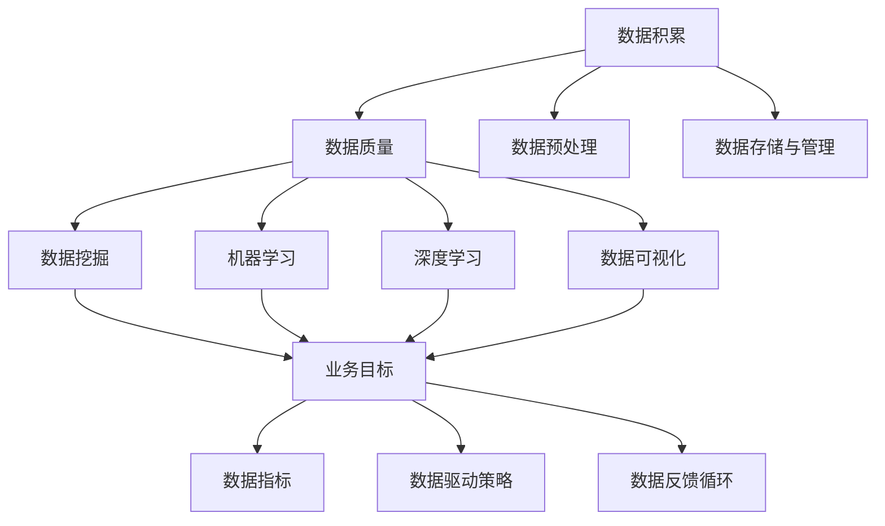

                 

# AI创业中的数据积累与应用

## 概述

在当今时代，人工智能（AI）技术已经成为了推动各行各业创新发展的关键力量。而AI创业的关键要素之一，便是数据积累与应用。本文将深入探讨AI创业过程中的数据积累与应用，旨在帮助创业者更好地理解和利用数据，从而在激烈的竞争中脱颖而出。

本文首先介绍AI创业的背景和意义，接着详细阐述数据积累的重要性。随后，我们将探讨数据应用的方法和策略，以及如何构建数据驱动的业务模型。此外，本文还将分析AI创业中的挑战和风险，并提出相应的解决方案。最后，本文将对未来的发展趋势和挑战进行展望，为创业者提供有益的参考。

关键词：AI创业，数据积累，数据应用，业务模型，挑战与风险，发展趋势

摘要：本文详细探讨了AI创业中的数据积累与应用。通过对AI创业的背景和意义的介绍，本文强调了数据积累在AI创业中的重要性。随后，本文阐述了数据应用的方法和策略，并分析了数据驱动的业务模型构建。此外，本文还探讨了AI创业中的挑战和风险，并提出了解决方案。最后，本文展望了未来的发展趋势和挑战，为创业者提供了有益的参考。

## 背景介绍

### AI创业的背景

人工智能（AI）技术在过去几十年里取得了惊人的发展，已经成为现代科技领域的重要驱动力。从最初的简单规则系统，到如今的深度学习和强化学习，AI技术不断突破传统技术的界限，逐渐渗透到各个行业。这为创业者提供了前所未有的机遇。

随着大数据、云计算、物联网等技术的快速发展，AI创业的土壤日益肥沃。大量数据的积累为AI技术的应用提供了丰富的素材，而云计算和物联网则为AI算法的部署提供了强大的计算能力和广泛的应用场景。此外，资本的涌入和政策支持也为AI创业提供了有力保障。

### AI创业的意义

AI创业不仅推动了科技的进步，还对经济发展、社会进步和人类生活产生了深远影响。首先，AI创业有助于推动产业升级和转型。通过将AI技术应用于传统行业，可以提高生产效率，降低成本，提升产品质量，从而推动产业升级。例如，智能制造、智能医疗、智能交通等领域已经展现出巨大的潜力。

其次，AI创业有助于解决社会问题。AI技术在智能城市、环境保护、公共安全等领域具有广泛的应用前景。通过智能分析、预测和决策，AI技术可以有效提高社会管理和服务水平，改善人们的生活质量。

最后，AI创业有助于激发创新创业活力。AI技术的高门槛和跨学科特性吸引了大量的创业者进入这个领域。他们通过不断的创新和实践，推动AI技术的应用和普及，为社会发展注入新的动力。

## 核心概念与联系

### 数据积累

数据积累是AI创业的核心环节之一。数据的质量和数量直接影响AI模型的性能和应用效果。以下是数据积累过程中需要关注的核心概念：

1. **数据来源**：数据可以来自内部生成（如企业内部数据、用户行为数据等）和外部获取（如公共数据集、第三方数据提供商等）。

2. **数据质量**：数据质量是数据积累的关键因素。高质量的数据可以提高模型训练效果，降低错误率。数据质量包括数据的准确性、完整性、一致性、实时性等。

3. **数据预处理**：数据预处理是数据积累的重要步骤，包括数据清洗、去重、归一化、特征提取等。数据预处理可以消除噪声、减少数据冗余，提高数据的可用性。

4. **数据存储与管理**：随着数据量的不断增长，如何高效地存储和管理数据成为一个重要问题。常用的数据存储技术包括关系型数据库、NoSQL数据库、分布式文件系统等。

### 数据应用

数据应用是AI创业的核心目标之一。以下是数据应用过程中需要关注的核心概念：

1. **数据挖掘**：数据挖掘是从大量数据中提取有价值的信息和知识的过程。常用的数据挖掘方法包括关联规则挖掘、聚类分析、分类分析、预测分析等。

2. **机器学习**：机器学习是AI的核心技术之一，通过构建模型从数据中学习规律，实现对未知数据的预测和分类。常用的机器学习算法包括决策树、支持向量机、神经网络等。

3. **深度学习**：深度学习是机器学习的一个分支，通过多层神经网络对数据进行建模。深度学习在图像识别、语音识别、自然语言处理等领域取得了显著成果。

4. **数据可视化**：数据可视化是将数据以图形化方式呈现的过程，可以帮助人们更好地理解和分析数据。常用的数据可视化工具包括Tableau、D3.js、Matplotlib等。

### 数据驱动的业务模型

数据驱动的业务模型是将数据应用于业务决策和运营的过程。以下是构建数据驱动的业务模型需要关注的核心概念：

1. **业务目标**：明确业务目标是构建数据驱动的业务模型的第一步。业务目标包括提高销售额、降低成本、提高客户满意度等。

2. **数据指标**：数据指标是衡量业务目标达成情况的关键指标。常用的数据指标包括销售额、成本、客户满意度、转化率等。

3. **数据驱动策略**：数据驱动策略是根据业务目标和数据指标制定的具体行动计划。数据驱动策略包括市场分析、客户分析、产品优化、运营优化等。

4. **数据反馈循环**：数据反馈循环是将数据应用于业务决策，并通过反馈调整和优化业务模型的过程。数据反馈循环可以不断提高业务模型的准确性和效率。

### Mermaid 流程图

以下是数据积累、数据应用和数据驱动的业务模型构建的Mermaid流程图：



## 核心算法原理 & 具体操作步骤

### 数据积累

1. **数据采集**：数据采集是数据积累的第一步，可以通过以下几种方式进行：
   - **内部生成**：从企业内部系统（如ERP、CRM等）中获取数据。
   - **外部获取**：通过公共数据集（如Kaggle、UCI机器学习库等）或第三方数据提供商获取数据。
   - **网络爬虫**：使用爬虫技术从互联网上抓取数据。

2. **数据清洗**：数据清洗是消除数据噪声、处理缺失值和异常值的过程。常用的数据清洗方法包括：
   - **缺失值处理**：使用均值、中位数、最值等填补缺失值，或删除含有缺失值的记录。
   - **异常值处理**：使用统计方法（如标准差、箱线图等）检测和标记异常值，然后根据具体情况选择保留或删除。
   - **数据格式转换**：将不同格式的数据转换为统一的格式，如将文本数据转换为数值数据。

3. **数据预处理**：数据预处理是提高数据质量、为模型训练做准备的过程。常用的数据预处理方法包括：
   - **特征提取**：从原始数据中提取有用的特征，如使用词袋模型提取文本数据中的关键词。
   - **特征选择**：从大量特征中选择对模型训练有重要影响的特征，如使用特征重要性评估方法（如随机森林）。
   - **特征缩放**：将不同尺度的特征进行缩放，如使用标准化或归一化方法。

4. **数据存储与管理**：数据存储与管理是保证数据安全、高效地存储和访问的过程。常用的数据存储与管理技术包括：
   - **关系型数据库**：如MySQL、PostgreSQL等，适用于结构化数据存储。
   - **NoSQL数据库**：如MongoDB、Cassandra等，适用于非结构化数据存储。
   - **分布式文件系统**：如Hadoop HDFS、Amazon S3等，适用于大规模数据存储。

### 数据应用

1. **数据挖掘**：数据挖掘是发现数据中隐藏的模式和规律的过程。常用的数据挖掘方法包括：
   - **关联规则挖掘**：如Apriori算法，用于发现数据之间的关联性。
   - **聚类分析**：如K-means算法，用于将数据划分为不同的群体。
   - **分类分析**：如决策树、支持向量机等，用于预测数据分类结果。
   - **预测分析**：如时间序列分析、回归分析等，用于预测未来数据趋势。

2. **机器学习**：机器学习是通过训练模型从数据中学习规律，实现对未知数据的预测和分类。常用的机器学习算法包括：
   - **监督学习**：如线性回归、逻辑回归、支持向量机等，用于对已知数据进行分类或回归。
   - **无监督学习**：如K-means聚类、主成分分析等，用于对未知数据进行聚类或降维。
   - **强化学习**：如Q-learning、Deep Q-Network等，用于在动态环境中进行决策和优化。

3. **深度学习**：深度学习是通过多层神经网络对数据进行建模。常用的深度学习框架包括：
   - **TensorFlow**：由Google开发，适用于各种深度学习任务。
   - **PyTorch**：由Facebook开发，具有良好的灵活性和易用性。
   - **Keras**：基于TensorFlow和Theano开发，提供了简洁高效的API。

4. **数据可视化**：数据可视化是将数据以图形化方式呈现的过程。常用的数据可视化工具包括：
   - **Tableau**：适用于企业级数据可视化。
   - **D3.js**：适用于Web端数据可视化。
   - **Matplotlib**：适用于Python编程语言中的数据可视化。

### 数据驱动的业务模型构建

1. **业务目标明确**：明确业务目标是构建数据驱动的业务模型的第一步。业务目标可以包括提高销售额、降低成本、提高客户满意度等。

2. **数据指标设定**：数据指标是衡量业务目标达成情况的关键指标。常用的数据指标包括销售额、成本、客户满意度、转化率等。

3. **数据驱动策略制定**：数据驱动策略是根据业务目标和数据指标制定的具体行动计划。数据驱动策略可以包括市场分析、客户分析、产品优化、运营优化等。

4. **数据反馈循环**：数据反馈循环是将数据应用于业务决策，并通过反馈调整和优化业务模型的过程。数据反馈循环可以不断提高业务模型的准确性和效率。

### Mermaid 流�程图

以下是数据积累、数据应用和数据驱动的业务模型构建的Mermaid流程图：


## 数学模型和公式 & 详细讲解 & 举例说明

### 数据质量评估

1. **数据完整性**：数据完整性是数据质量的重要指标之一，表示数据中缺失值的比例。常用的数据完整性评估方法有：

   $$\text{完整性} = \frac{\text{实际数据记录数}}{\text{预期数据记录数}}$$

   例如，如果一个数据集预期包含100条记录，但实际只有80条记录，则数据完整性为80%。

2. **数据准确性**：数据准确性是数据质量的重要指标之一，表示数据中正确值的比例。常用的数据准确性评估方法有：

   $$\text{准确性} = \frac{\text{正确数据记录数}}{\text{总数据记录数}}$$

   例如，如果一个数据集包含100条记录，其中80条记录是正确的，则数据准确性为80%。

### 数据挖掘算法

1. **K-means聚类算法**：K-means是一种经典的聚类算法，用于将数据划分为K个簇。算法的步骤如下：

   - 初始选择K个中心点。
   - 计算每个数据点到中心点的距离，并将数据点分配到最近的中心点所在的簇。
   - 重新计算每个簇的中心点。
   - 重复步骤2和步骤3，直到中心点不再发生显著变化。

   例如，假设有一个包含10个数据点的数据集，需要将其划分为2个簇。首先随机选择2个中心点，然后计算每个数据点到这两个中心点的距离，并将数据点分配到最近的中心点所在的簇。接着重新计算每个簇的中心点，再次计算距离，重复这个过程，直到中心点不再发生显著变化。

2. **决策树算法**：决策树是一种常用的分类算法，用于根据特征值将数据划分为不同的类别。决策树的构建过程如下：

   - 选择一个特征作为分割标准，根据该特征的不同取值将数据划分为多个子集。
   - 计算每个子集的信息增益，选择信息增益最大的特征作为下一个分割标准。
   - 重复步骤1和步骤2，直到满足停止条件（如最大树深度、信息增益低于阈值等）。

   例如，假设有一个包含3个特征（年龄、收入、教育程度）的数据集，需要将其划分为两个类别（A类和B类）。首先计算每个特征的增益，选择增益最大的特征作为分割标准，例如年龄。然后根据年龄的不同取值将数据划分为两个子集，接着计算每个子集的增益，选择增益最大的特征作为下一个分割标准，例如收入。重复这个过程，直到满足停止条件。

### 深度学习算法

1. **反向传播算法**：反向传播算法是一种用于训练神经网络的常用算法，其基本思想是利用梯度下降法更新网络权重，以最小化损失函数。算法的步骤如下：

   - 前向传播：将输入数据通过神经网络进行前向传播，得到预测输出。
   - 计算损失函数：计算预测输出与真实输出之间的差异，得到损失值。
   - 反向传播：从输出层开始，反向传播损失函数的梯度，更新网络权重。
   - 重复步骤1到步骤3，直到满足停止条件（如损失值低于阈值、达到最大迭代次数等）。

   例如，假设有一个包含3个输入节点、2个隐藏层节点和1个输出节点的神经网络，需要对其进行训练。首先将输入数据通过神经网络进行前向传播，得到预测输出，然后计算损失函数，最后反向传播损失函数的梯度，更新网络权重。重复这个过程，直到损失值低于阈值或达到最大迭代次数。

2. **卷积神经网络（CNN）**：卷积神经网络是一种用于图像识别和处理的常用深度学习算法，其基本思想是通过卷积操作提取图像的特征。算法的步骤如下：

   - 卷积层：使用卷积核对输入图像进行卷积操作，提取图像的特征。
   - 池化层：对卷积层的结果进行池化操作，减小特征图的尺寸。
   - 全连接层：将池化层的结果进行全连接操作，得到最终的预测结果。

   例如，假设有一个包含32x32像素的输入图像，需要对其进行识别。首先使用卷积层提取图像的特征，然后通过池化层减小特征图的尺寸，接着使用全连接层得到最终的预测结果。这个过程可以通过多个卷积层和池化层的组合来实现，以提高模型的识别能力。

## 项目实战：代码实际案例和详细解释说明

### 开发环境搭建

在开始项目实战之前，我们需要搭建一个合适的开发环境。以下是一个基于Python的简单数据挖掘项目的开发环境搭建步骤：

1. **安装Python**：从官方网站（https://www.python.org/）下载并安装Python。
2. **安装Anaconda**：Anaconda是一个Python数据科学和机器学习平台，可以方便地管理和安装相关依赖。从官方网站（https://www.anaconda.com/）下载并安装Anaconda。
3. **创建虚拟环境**：打开Anaconda命令行工具（Anaconda Navigator），创建一个新的虚拟环境，名称为`data_mining_project`。
4. **安装依赖库**：在虚拟环境中安装所需的依赖库，如NumPy、Pandas、Scikit-learn、Matplotlib等。

以下是一个简单的安装依赖库的命令示例：

```bash
conda install numpy pandas scikit-learn matplotlib
```

### 源代码详细实现和代码解读

以下是该数据挖掘项目的源代码及其解读：

```python
import numpy as np
import pandas as pd
from sklearn.cluster import KMeans
from sklearn.preprocessing import StandardScaler
import matplotlib.pyplot as plt

# 读取数据集
data = pd.read_csv('data.csv')

# 数据预处理
# 将数据转换为数值型
data_num = data.select_dtypes(include=[np.number])
# 标准化数据
scaler = StandardScaler()
data_scaled = scaler.fit_transform(data_num)

# K-means聚类
kmeans = KMeans(n_clusters=3)
kmeans.fit(data_scaled)
labels = kmeans.predict(data_scaled)

# 可视化结果
plt.scatter(data_scaled[:, 0], data_scaled[:, 1], c=labels)
plt.xlabel('Feature 1')
plt.ylabel('Feature 2')
plt.title('K-means Clustering')
plt.show()
```

#### 代码解读

1. **导入库**：首先，我们导入所需的Python库，包括NumPy、Pandas、Scikit-learn和Matplotlib。
2. **读取数据集**：使用Pandas库读取数据集，该数据集包含多个特征，其中至少有两个特征用于可视化。
3. **数据预处理**：将数据转换为数值型，并使用StandardScaler进行标准化处理，以消除不同特征之间的尺度差异。
4. **K-means聚类**：使用Scikit-learn库中的KMeans类进行K-means聚类，指定聚类数为3，然后对数据集进行聚类。
5. **可视化结果**：使用Matplotlib库绘制聚类结果，将数据点根据聚类标签进行颜色标记，以直观地展示聚类效果。

### 代码解读与分析

该数据挖掘项目的核心任务是使用K-means聚类算法对数据集进行聚类，并使用可视化工具展示聚类结果。以下是代码的详细解读和分析：

1. **数据预处理**：数据预处理是数据挖掘项目的基础步骤，包括数据清洗、数据转换和数据标准化。在本项目中，我们仅使用了数据标准化，将数据转换为标准正态分布，以便K-means算法能够更有效地进行聚类。
2. **K-means聚类**：K-means聚类是一种基于距离的聚类算法，通过计算数据点之间的距离，将数据划分为多个簇。在本项目中，我们指定聚类数为3，这意味着我们将数据划分为3个簇。K-means算法通过迭代计算，逐步优化聚类中心，以最小化聚类内距离和。
3. **可视化结果**：可视化是将数据以图形化方式呈现的过程，有助于我们直观地理解和分析数据。在本项目中，我们使用Matplotlib库绘制了聚类结果，将数据点根据聚类标签进行颜色标记。通过观察可视化结果，我们可以发现数据点的分布情况，以及聚类效果的好坏。

## 实际应用场景

### 智能医疗

在智能医疗领域，数据积累和应用至关重要。通过收集和分析大量的医疗数据，如病历、基因数据、医疗影像等，可以实现对疾病早期诊断、个性化治疗和疾病预测。以下是数据积累和应用在智能医疗领域的实际应用场景：

1. **疾病预测**：通过对患者的医疗数据进行深度学习和机器学习分析，可以预测疾病的发生概率，从而实现早期干预。
2. **个性化治疗**：基于患者的基因信息和病史，可以为患者制定个性化的治疗方案，提高治疗效果。
3. **医疗影像分析**：利用深度学习技术，可以对医疗影像（如X光片、CT、MRI等）进行自动分析，帮助医生快速诊断疾病。

### 电子商务

在电子商务领域，数据积累和应用是提升用户体验和增加销售的关键。以下是数据积累和应用在电子商务领域的实际应用场景：

1. **用户行为分析**：通过对用户浏览、购买、评价等行为数据进行分析，可以了解用户偏好，为用户提供个性化的推荐和服务。
2. **库存管理**：通过分析销售数据和市场需求，可以优化库存管理，减少库存成本，提高库存周转率。
3. **价格优化**：通过对市场数据和用户数据进行分析，可以制定更合理的价格策略，提高销售额。

### 智能交通

在智能交通领域，数据积累和应用是提高交通效率、减少交通事故和改善出行体验的关键。以下是数据积累和应用在智能交通领域的实际应用场景：

1. **交通流量预测**：通过对交通数据进行深度学习和机器学习分析，可以预测交通流量，优化交通信号控制，减少拥堵。
2. **智能导航**：通过分析实时交通数据和用户出行需求，可以为用户提供最优的出行路线和出行时间，减少出行时间。
3. **车辆管理**：通过对车辆运行数据进行监控和分析，可以优化车辆调度和管理，提高运输效率。

## 工具和资源推荐

### 学习资源推荐

1. **书籍**：
   - 《Python数据分析》（Wes McKinney）
   - 《深度学习》（Ian Goodfellow、Yoshua Bengio、Aaron Courville）
   - 《机器学习实战》（Peter Harrington）
2. **论文**：
   - "Deep Learning for Image Recognition"（Karen Simonyan、Andrew Zisserman）
   - "Recurrent Neural Networks for Language Modeling"（Yoshua Bengio等）
   - "Data Preprocessing for Machine Learning"（Andrzej K. Klamut）
3. **博客**：
   - DataCamp（https://www.datacamp.com/）
   - Medium（https://medium.com/）
   -Towards Data Science（https://towardsdatascience.com/）
4. **网站**：
   - Kaggle（https://www.kaggle.com/）
   - Coursera（https://www.coursera.org/）
   - edX（https://www.edx.org/）

### 开发工具框架推荐

1. **Python开发工具**：
   - Jupyter Notebook：适用于数据分析和机器学习实验。
   - PyCharm：适用于Python编程，提供了强大的代码编辑功能和调试工具。
   - Spyder：适用于数据科学和机器学习，集成了Jupyter Notebook和PyCharm的功能。
2. **深度学习框架**：
   - TensorFlow：由Google开发，适用于各种深度学习任务。
   - PyTorch：由Facebook开发，具有良好的灵活性和易用性。
   - Keras：基于TensorFlow和Theano开发，提供了简洁高效的API。
3. **数据可视化工具**：
   - Matplotlib：适用于Python编程中的数据可视化。
   - Plotly：提供了丰富的图表类型和交互功能。
   - Tableau：适用于企业级数据可视化。

### 相关论文著作推荐

1. **论文**：
   - "Deep Learning: A Brief History, A Case Study, and a Manifesto"（Yoshua Bengio等）
   - "Stochastic Gradient Descent for Machine Learning"（Martin J. D. Powell）
   - "The Hundred-Page Machine Learning Book"（Andriy Burkov）
2. **著作**：
   - 《深度学习》（Ian Goodfellow、Yoshua Bengio、Aaron Courville）
   - 《Python数据科学手册》（Jake VanderPlas）
   - 《机器学习实战》（Peter Harrington）

## 总结：未来发展趋势与挑战

### 发展趋势

1. **数据隐私保护**：随着数据隐私问题的日益突出，如何在保障数据隐私的前提下进行数据积累和应用将成为一个重要趋势。
2. **联邦学习**：联邦学习是一种在保护数据隐私的前提下进行模型训练的方法，未来将在更多领域得到应用。
3. **边缘计算**：边缘计算将数据处理和计算能力推向网络边缘，降低延迟，提高实时性，未来将在智能交通、智能医疗等领域发挥重要作用。
4. **多模态学习**：多模态学习结合了不同类型的数据（如图像、文本、语音等），将提高模型的泛化能力和应用范围。

### 挑战

1. **数据质量问题**：数据质量直接影响模型的性能，如何确保数据质量将是一个长期挑战。
2. **模型解释性**：随着深度学习等模型的应用，模型的可解释性成为一个重要问题，如何提高模型的解释性将是一个重要研究方向。
3. **数据安全与隐私**：如何在保证数据安全与隐私的前提下进行数据积累和应用，将是一个重要挑战。

## 附录：常见问题与解答

### 问题1：数据积累的目的是什么？

数据积累的目的是为了构建高质量的数据集，为模型训练和预测提供素材。高质量的数据集可以提高模型的性能和可靠性，从而在实际应用中取得更好的效果。

### 问题2：如何保证数据质量？

保证数据质量的方法包括数据清洗、数据预处理和数据验证。数据清洗是消除数据噪声、处理缺失值和异常值的过程；数据预处理是提高数据质量、为模型训练做准备的过程；数据验证是检查数据是否符合预期质量标准的过程。

### 问题3：如何选择合适的机器学习算法？

选择合适的机器学习算法需要考虑以下几个因素：

1. 数据类型：根据数据的类型（如分类、回归、聚类等）选择相应的算法。
2. 数据规模：对于大规模数据，可以选择分布式算法；对于小规模数据，可以选择简单的算法。
3. 特征数量：对于特征数量较多的数据，可以选择复杂度较低的算法；对于特征数量较少的数据，可以选择复杂度较高的算法。
4. 性能指标：根据具体应用场景选择合适的性能指标，如准确率、召回率、F1值等。

### 问题4：如何优化机器学习模型？

优化机器学习模型的方法包括：

1. 超参数调优：通过调整模型的超参数（如学习率、隐藏层节点数等）来提高模型的性能。
2. 特征选择：通过选择对模型训练有重要影响的特征，提高模型的泛化能力。
3. 模型集成：将多个模型集成在一起，提高模型的性能和稳定性。
4. 数据增强：通过增加数据多样性，提高模型的泛化能力。

## 扩展阅读 & 参考资料

### 参考资料

1. Goodfellow, I., Bengio, Y., & Courville, A. (2016). *Deep Learning*. MIT Press.
2. Murphy, K. P. (2012). *Machine Learning: A Probabilistic Perspective*. MIT Press.
3. Mitchell, T. M. (1997). *Machine Learning*. McGraw-Hill.
4. Hastie, T., Tibshirani, R., & Friedman, J. (2009). *The Elements of Statistical Learning: Data Mining, Inference, and Prediction*. Springer.
5. Schölkopf, B., & Smola, A. J. (2001). *Learning with Kernels: Support Vector Machines, Regularization, Optimization, and Beyond*. Springer.

### 扩展阅读

1. "Data Science Handbook"（Avi Bryant）
2. "Python Machine Learning"（Sebastian Raschka、Vahid Mirjalili）
3. "Practical Data Science with R"（Kenta Obayashi）
4. "Practical Deep Learning for Coders"（Alex Aiken、Adrian Trenaman）
5. "Deep Learning Specialization"（Andrew Ng）

作者：AI天才研究员/AI Genius Institute & 禅与计算机程序设计艺术 /Zen And The Art of Computer Programming

