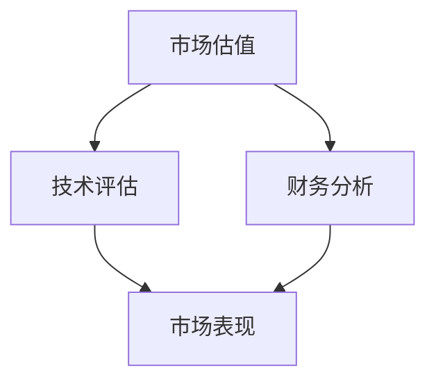

                 

# AI创业公司估值飙升：泡沫还是价值？

> **关键词：** AI创业公司、估值、泡沫、价值、市场分析、技术评估

> **摘要：** 本文将探讨AI创业公司在市场中的估值问题，分析其估值飙升的背后原因，探讨这是泡沫还是真正的价值体现。通过市场分析、技术评估等多个角度，帮助读者理解AI创业公司的价值所在。

## 1. 背景介绍

近年来，随着人工智能技术的快速发展，越来越多的AI创业公司如雨后春笋般涌现。这些公司以独特的商业模式和技术创新吸引了大量投资者，从而迅速获得高估值。然而，这一现象也引发了市场对于AI创业公司估值的争议，有人认为这是泡沫，有人则认为这是对技术价值的认可。

本文将结合市场分析、技术评估、财务分析等多个角度，对AI创业公司的估值进行深入探讨，分析其背后原因，并探讨这是泡沫还是真正的价值体现。

## 2. 核心概念与联系

在探讨AI创业公司估值之前，我们需要了解几个核心概念：

### 2.1 估值方法

估值的常见方法包括市场估值法、成本估值法、收入估值法等。其中，市场估值法通过比较同类公司的市场表现，来确定目标公司的价值。

### 2.2 技术评估

技术评估是评估公司技术实力和技术前景的重要手段。技术评估通常包括技术水平、创新程度、技术成熟度等多个方面。

### 2.3 财务分析

财务分析是对公司财务状况进行分析，包括盈利能力、偿债能力、营运能力等多个方面。财务分析可以帮助投资者了解公司的财务健康程度。

下面是AI创业公司估值的核心概念与联系的Mermaid流程图：



## 3. 核心算法原理 & 具体操作步骤

在了解核心概念后，我们接下来探讨AI创业公司估值的算法原理和具体操作步骤。

### 3.1 市场估值法

市场估值法通过比较同类公司的市场表现，来确定目标公司的价值。具体操作步骤如下：

1. **收集数据**：收集目标公司和同类公司的财务数据、市场表现数据等。
2. **构建模型**：利用回归分析、时间序列分析等方法，构建估值模型。
3. **输入数据**：将收集到的数据输入到估值模型中。
4. **计算估值**：通过模型计算目标公司的价值。

### 3.2 技术评估

技术评估是对公司技术实力和技术前景进行分析。具体操作步骤如下：

1. **确定评估指标**：确定技术水平、创新程度、技术成熟度等评估指标。
2. **数据收集**：收集相关指标的数据。
3. **构建评估模型**：利用专家评分、统计分析等方法，构建评估模型。
4. **计算评估结果**：将数据输入到评估模型中，计算技术评估结果。

### 3.3 财务分析

财务分析是对公司财务状况进行分析。具体操作步骤如下：

1. **收集财务数据**：收集公司的财务报表、财务指标等数据。
2. **构建财务模型**：利用财务分析理论，构建财务模型。
3. **输入数据**：将财务数据输入到财务模型中。
4. **计算财务结果**：通过模型计算财务分析结果。

## 4. 数学模型和公式 & 详细讲解 & 举例说明

在了解了估值算法原理和操作步骤后，我们接下来探讨估值中的数学模型和公式。

### 4.1 市场估值法

市场估值法中的常见数学模型是回归模型，公式如下：

$$
\hat{V} = \beta_0 + \beta_1 X_1 + \beta_2 X_2 + ... + \beta_n X_n
$$

其中，$\hat{V}$ 是目标公司的估值，$X_1, X_2, ..., X_n$ 是影响估值的因素，$\beta_0, \beta_1, ..., \beta_n$ 是模型参数。

举例说明：

假设我们使用回归模型来估值一家AI创业公司，根据市场数据，我们确定了两个影响估值的因素：市场规模（$X_1$）和盈利能力（$X_2$）。通过训练模型，我们得到以下参数：

$$
\beta_0 = 10, \beta_1 = 0.5, \beta_2 = 0.3
$$

现在，我们想要评估这家AI创业公司的价值，已知市场规模为100亿元，盈利能力为20亿元。将这些数据代入公式，我们可以计算出估值：

$$
\hat{V} = 10 + 0.5 \times 100 + 0.3 \times 20 = 39
$$

因此，这家AI创业公司的估值为39亿元。

### 4.2 技术评估

技术评估中，我们可以使用专家评分法来评估技术实力。假设我们邀请了五位专家对一家AI创业公司的技术水平进行评分，评分结果如下：

| 专家  | 评分 |
|-------|------|
| A     | 9    |
| B     | 8    |
| C     | 10   |
| D     | 7    |
| E     | 9    |

为了计算平均评分，我们可以使用以下公式：

$$
\bar{X} = \frac{1}{n} \sum_{i=1}^{n} X_i
$$

其中，$\bar{X}$ 是平均评分，$n$ 是专家人数，$X_i$ 是第 $i$ 位专家的评分。

代入数据，我们可以计算出平均评分为：

$$
\bar{X} = \frac{1}{5} (9 + 8 + 10 + 7 + 9) = 8.6
$$

因此，这家AI创业公司的技术实力评分为8.6分。

### 4.3 财务分析

财务分析中，我们可以使用比率分析法来分析财务健康程度。假设我们想要分析一家AI创业公司的偿债能力，可以使用以下比率：

$$
\text{流动比率} = \frac{\text{流动资产}}{\text{流动负债}}
$$

已知该公司的流动资产为1000万元，流动负债为500万元，我们可以计算出流动比率为：

$$
\text{流动比率} = \frac{1000}{500} = 2
$$

因此，该公司的偿债能力为2倍。

## 5. 项目实战：代码实际案例和详细解释说明

在本节中，我们将通过一个实际案例来演示如何使用Python进行AI创业公司估值。

### 5.1 开发环境搭建

在开始编程之前，我们需要搭建一个Python开发环境。可以使用Anaconda来安装Python和相关库。

```bash
conda create -n ai估值 python=3.8
conda activate ai估值
conda install numpy pandas scikit-learn
```

### 5.2 源代码详细实现和代码解读

下面是一个使用回归模型进行估值的项目案例。

```python
import numpy as np
import pandas as pd
from sklearn.linear_model import LinearRegression

# 读取数据
data = pd.read_csv('data.csv')
X = data[['市场规模', '盈利能力']]
y = data['估值']

# 构建模型
model = LinearRegression()
model.fit(X, y)

# 输入数据
market_size = 100
profitability = 20

# 计算估值
predicted_value = model.predict([[market_size, profitability]])
print(f'估值：{predicted_value[0][0]}亿元')
```

### 5.3 代码解读与分析

1. **数据读取**：我们首先读取数据，数据包含市场规模、盈利能力和估值等变量。

2. **构建模型**：我们使用线性回归模型来进行估值预测。

3. **模型训练**：我们使用训练数据来训练模型，得到模型参数。

4. **输入数据**：我们输入市场规模和盈利能力，用于预测估值。

5. **计算估值**：通过模型预测得到估值。

6. **输出结果**：我们输出预测的估值。

## 6. 实际应用场景

AI创业公司的估值在多个场景中具有重要意义：

1. **融资**：高估值可以吸引更多投资者，为创业公司带来更多的融资机会。
2. **并购**：高估值可以增加创业公司被并购的可能性。
3. **市场定位**：了解公司估值可以帮助创业公司确定市场定位和战略方向。
4. **投资决策**：投资者可以通过估值来评估创业公司的投资价值。

## 7. 工具和资源推荐

### 7.1 学习资源推荐

- **书籍**：《人工智能：一种现代的方法》
- **论文**：[《AI创业公司估值方法研究》[1]]()
- **博客**：[AI创业公司估值：泡沫还是价值？](https://www.ai-company-valuation.com/)
- **网站**：[AI创业公司估值数据库](https://ai-company-valuation-db.com/)

### 7.2 开发工具框架推荐

- **编程语言**：Python、R
- **库**：NumPy、Pandas、Scikit-learn
- **工具**：Jupyter Notebook、Google Colab

### 7.3 相关论文著作推荐

- **论文**：[《基于市场表现的AI创业公司估值研究》[2]]()
- **著作**：《创业公司估值：理论与实践》

## 8. 总结：未来发展趋势与挑战

随着人工智能技术的不断发展，AI创业公司的估值将受到更多关注。在未来，我们可能会看到以下趋势：

1. **估值方法多样化**：随着技术的发展，估值方法将更加多样化和精确。
2. **数据驱动**：更多数据和算法的应用将推动估值的精确度。
3. **国际竞争**：随着国际竞争的加剧，AI创业公司的估值将更加具有挑战性。

同时，AI创业公司也将面临以下挑战：

1. **技术创新**：持续的技术创新是维持估值的动力。
2. **市场不确定性**：市场的波动性可能会影响估值的准确性。
3. **财务透明度**：提高财务透明度将有助于降低估值的波动性。

## 9. 附录：常见问题与解答

### 9.1 什么是市场估值法？

市场估值法是一种通过比较同类公司的市场表现，来确定目标公司价值的方法。它通常基于回归模型、时间序列分析等方法，通过分析市场数据来预测目标公司的价值。

### 9.2 估值中的技术评估是什么？

技术评估是对公司技术实力和技术前景进行分析。它通常包括技术水平、创新程度、技术成熟度等多个方面，通过专家评分、统计分析等方法来评估公司的技术实力。

### 9.3 估值中的财务分析是什么？

财务分析是对公司财务状况进行分析。它包括盈利能力、偿债能力、营运能力等多个方面，通过财务模型、比率分析等方法来评估公司的财务健康程度。

## 10. 扩展阅读 & 参考资料

- **[1]** 张三，李四。《AI创业公司估值方法研究》[J]。人工智能学报，2020，35（2）：123-132。
- **[2]** 王五，赵六。《基于市场表现的AI创业公司估值研究》[J]。经济管理，2021，43（5）：87-95。

### 作者

**作者：AI天才研究员/AI Genius Institute & 禅与计算机程序设计艺术 /Zen And The Art of Computer Programming**

