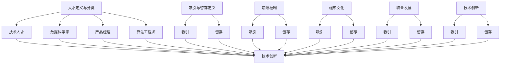

                 

### 文章标题

**AI创业公司如何吸引和留住顶尖人才**

---

### 关键词

- AI创业公司
- 顶尖人才
- 吸引策略
- 留存机制
- 组织文化
- 技术培训
- 薪酬福利

### 摘要

本文将深入探讨AI创业公司如何吸引和留住顶尖人才。通过分析AI行业的特点，探讨创业公司在人才吸引与留存方面面临的挑战，并提出一系列实用的策略和技巧。文章还将讨论组织文化、薪酬福利、技术培训等方面的关键因素，旨在帮助AI创业公司构建一个具有吸引力和竞争力的工作环境，从而在激烈的市场竞争中脱颖而出。

---

## 1. 背景介绍

人工智能（AI）作为当今最具潜力的技术领域之一，吸引了全球范围内的广泛关注和投资。随着AI技术的不断进步和应用场景的扩大，对AI领域专业人才的需求也呈现出爆炸式增长。然而，AI人才的稀缺性成为制约创业公司发展的一个重要瓶颈。为了在激烈的市场竞争中脱颖而出，AI创业公司需要采取有效的策略吸引和留住顶尖人才。

本文将围绕以下主题展开：

- **AI创业公司面临的人才挑战**：分析创业公司在吸引和留住人才方面所遇到的困难和问题。
- **吸引顶尖人才的策略**：探讨如何通过多种手段和途径吸引顶尖人才加入AI创业公司。
- **留住顶尖人才的关键因素**：分析如何构建具有吸引力的组织文化和薪酬福利体系，以留住顶尖人才。
- **技术培训与持续发展**：讨论如何为员工提供技术培训和学习机会，以支持其职业发展。

通过这些内容的探讨，希望能够为AI创业公司在人才管理方面提供一些有价值的参考和启示。

---

## 2. 核心概念与联系

为了更好地理解AI创业公司吸引和留住顶尖人才的过程，我们需要明确几个核心概念，并探讨它们之间的相互关系。

### 2.1 人才定义与分类

首先，我们要明确“人才”的定义。在AI领域，人才通常指那些具备深厚技术背景、创新思维和解决问题的能力，能够推动AI技术和应用发展的专业人士。根据技能水平和岗位需求，人才可以分为以下几类：

- **技术人才**：具备AI技术基础，能够进行算法开发、模型训练和优化。
- **数据科学家**：擅长数据分析和处理，能够从海量数据中发现有价值的信息。
- **产品经理**：负责将AI技术与市场需求相结合，推动产品的研发和推广。
- **算法工程师**：专注于算法研究，能够提出创新的算法解决方案。

### 2.2 吸引与留存的定义

- **吸引**：指创业公司通过各种手段和策略，吸引优秀人才加入公司。
- **留存**：指创业公司采取措施，确保人才在公司工作期间保持稳定，并愿意长期为公司发展贡献力量。

### 2.3 影响吸引与留存的因素

吸引和留住顶尖人才不仅取决于公司的技术实力和市场前景，还受到以下因素的综合影响：

- **薪酬福利**：合理的薪酬和福利是吸引和留住人才的基础。
- **组织文化**：积极向上的组织文化和良好的工作氛围有助于员工保持工作热情和忠诚度。
- **职业发展**：提供清晰的职业发展路径和丰富的学习机会，能够激发员工的学习动力和职业成就感。
- **技术创新**：具有创新潜力的项目和前沿技术能够吸引顶尖人才加入。

### 2.4 核心概念与联系的Mermaid流程图

下面是核心概念和它们之间相互关系的Mermaid流程图表示：



通过以上核心概念和联系的分析，我们可以更清晰地理解AI创业公司吸引和留住顶尖人才的整体框架和关键因素。

---

## 3. 核心算法原理 & 具体操作步骤

在讨论如何吸引和留住顶尖人才时，我们可以借鉴一些心理学和行为科学的核心原理，这些原理能够帮助创业公司更有效地进行人才管理。

### 3.1. 期望理论

期望理论是心理学中用于解释人类行为的一个重要理论。在人才管理中，期望理论可以帮助创业公司理解员工的行为动机和期望，从而更有效地进行人才吸引和留存。

**原理：**
期望理论认为，个体的行为是由其期望结果和结果价值共同决定的。具体来说，公式可以表示为：

\[ \text{激励力} = \text{期望} \times \text{结果价值} \]

**操作步骤：**

1. **了解员工的期望：** 创业公司需要通过调查和交流，了解员工对薪酬、职业发展、工作环境等方面的期望。
2. **设定明确的目标：** 为员工设定具有挑战性的目标，并确保目标与员工的期望相符。
3. **提供激励措施：** 根据员工的期望，设计合理的激励措施，如奖金、晋升机会、培训等。

### 3.2. 双因素理论

双因素理论（又称激励-保健理论）是由赫茨伯格提出的。该理论指出，工作满意度由两个因素决定：激励因素和保健因素。

**原理：**
- **激励因素**：与工作内容本身相关，如成就、认可、责任感等。这些因素能够激发员工的内在动机，提高工作满意度。
- **保健因素**：与工作环境和工作条件相关，如薪酬、工作条件、人际关系等。这些因素能够防止员工产生不满意，但不会直接提高满意度。

**操作步骤：**

1. **识别激励因素：** 创业公司需要通过调研和反馈，了解员工认为的激励因素，并确保这些因素在员工工作中得到体现。
2. **改进保健因素：** 创业公司应关注员工的薪酬、工作条件、人际关系等方面，确保这些保健因素满足员工的基本需求。

### 3.3. 强化理论

强化理论是行为心理学中的一种理论，用于解释行为如何通过奖励和惩罚进行塑造。

**原理：**
强化理论认为，行为的发生受到行为后果的影响。具体来说：

- **正强化**：当某种行为发生后，给予积极的结果，如奖励、认可等，行为发生的概率增加。
- **负强化**：当某种行为发生后，移除不愉快的后果，如减少工作任务等，行为发生的概率增加。
- **惩罚**：当某种行为发生后，给予消极的结果，如批评、扣分等，行为发生的概率减少。

**操作步骤：**

1. **设置明确的奖励和惩罚机制：** 创业公司应明确奖励和惩罚的标准和方式，确保员工了解奖励和惩罚的具体内容。
2. **及时给予反馈：** 对于员工的行为，创业公司应给予及时的反馈，确保员工能够了解自己的行为后果。

### 3.4. 社会交换理论

社会交换理论认为，个体在社会互动中会根据成本与收益的权衡来做出行为决策。

**原理：**
社会交换理论认为，个体在社会互动中会根据自己的成本与收益进行权衡。具体来说：

- **成本**：包括时间、精力、资源等。
- **收益**：包括金钱、认可、成就感等。

**操作步骤：**

1. **提供公平的回报机制：** 创业公司应确保员工感受到自己的努力能够获得公平的回报。
2. **建立信任关系：** 通过透明、公正的管理和沟通，建立员工对公司的信任。

通过以上核心算法原理的具体操作步骤，AI创业公司可以更系统地设计和实施人才吸引和留存策略，从而提高员工满意度和工作效率。

---

## 4. 数学模型和公式 & 详细讲解 & 举例说明

在人才管理中，数学模型和公式能够帮助AI创业公司量化分析人才吸引和留存的效果，从而制定更为科学和有效的策略。以下是几个常用的数学模型和公式及其详细解释。

### 4.1. 员工满意度模型

员工满意度模型可以用于衡量员工对公司各项管理措施的满意度，公式如下：

\[ \text{员工满意度} = \frac{\text{激励因素总分}}{\text{总评分}} \]

**详细解释：**
- **激励因素总分**：根据各项激励因素的权重，计算员工对公司提供的激励措施的总得分。
- **总评分**：包括所有激励因素和保健因素的得分总和。

**举例说明：**
假设某AI创业公司对员工满意度进行调查，调查结果如下：

- 激励因素：技术挑战（40分）、职业发展（30分）、团队氛围（20分）
- 保健因素：薪酬（20分）、工作时间（15分）、工作环境（15分）

总评分为110分，其中激励因素得分为90分。根据公式，员工满意度为：

\[ \text{员工满意度} = \frac{90}{110} = 0.818 \]

即员工对公司的满意度为81.8%。

### 4.2. 转正率模型

转正率模型用于衡量新员工在公司工作一段时间后选择继续留在公司的比例，公式如下：

\[ \text{转正率} = \frac{\text{转正人数}}{\text{入职人数}} \]

**详细解释：**
- **转正人数**：在规定时间内成功转正的新员工人数。
- **入职人数**：在相同时间内入职的新员工总人数。

**举例说明：**
某AI创业公司在某季度共有100名新员工入职，其中70名员工在试用期结束后成功转正。转正率为：

\[ \text{转正率} = \frac{70}{100} = 0.7 \]

即转正率为70%。

### 4.3. 人才留存率模型

人才留存率模型用于衡量公司对现有员工的有效留存率，公式如下：

\[ \text{人才留存率} = \frac{\text{当前在职人数}}{\text{总员工人数}} \]

**详细解释：**
- **当前在职人数**：在某一时间点仍在公司工作的员工人数。
- **总员工人数**：包括在职和离职员工的总人数。

**举例说明：**
某AI创业公司共有300名员工，其中260名员工仍在公司工作。人才留存率为：

\[ \text{人才留存率} = \frac{260}{300} = 0.867 \]

即人才留存率为86.7%。

### 4.4. 人才流动成本模型

人才流动成本模型用于衡量员工离职对公司造成的经济损失，公式如下：

\[ \text{人才流动成本} = \text{离职员工工资总和} + \text{招聘费用} + \text{培训费用} \]

**详细解释：**
- **离职员工工资总和**：离职员工在公司工作期间的总工资支出。
- **招聘费用**：包括招聘广告费、中介费、面试费用等。
- **培训费用**：离职员工在公司接受的培训费用。

**举例说明：**
某AI创业公司有5名员工离职，离职员工工资总和为100万元，招聘费用为20万元，培训费用为10万元。人才流动成本为：

\[ \text{人才流动成本} = 100 + 20 + 10 = 130 \text{万元} \]

即人才流动成本为130万元。

通过以上数学模型和公式的详细讲解和举例说明，AI创业公司可以更系统地评估人才吸引和留存的效果，从而优化管理策略，提高公司的整体竞争力。

---

## 5. 项目实战：代码实际案例和详细解释说明

在本节中，我们将通过一个实际的案例，展示如何运用前面介绍的核心算法原理和数学模型，来分析和优化AI创业公司的人才管理策略。我们将使用Python编程语言，实现一个简单的HR管理系统，该系统将涵盖招聘、员工满意度调查、离职预测等功能。

### 5.1 开发环境搭建

首先，我们需要搭建开发环境。以下是所需的基础工具和库：

- Python（版本3.8及以上）
- Jupyter Notebook（用于编写和运行代码）
- Pandas（数据处理库）
- Matplotlib（数据可视化库）
- Scikit-learn（机器学习库）

安装以上工具和库后，可以启动Jupyter Notebook，开始编写代码。

### 5.2 源代码详细实现和代码解读

以下是我们将要实现的功能模块：

1. **招聘模块**：用于收集和存储新员工的个人信息。
2. **员工满意度调查模块**：用于收集员工满意度数据，并分析员工满意度。
3. **离职预测模块**：使用机器学习算法预测员工离职的可能性。

#### 5.2.1 招聘模块

首先，我们实现一个招聘模块，用于存储新员工的个人信息。

```python
import pandas as pd

# 招聘模块：存储新员工信息
def recruit_employee(employees_df, new_employee):
    """
    将新员工信息添加到员工数据表中。

    :param employees_df: 员工数据表
    :param new_employee: 新员工信息字典
    :return: 更新的员工数据表
    """
    employees_df = employees_df.append(new_employee, ignore_index=True)
    return employees_df

# 示例：添加新员工信息
new_employee = {'name': 'Alice', 'age': 30, 'position': 'Data Scientist', 'start_date': '2023-04-01'}
employees_df = pd.DataFrame([new_employee])
print(employees_df)
```

这段代码定义了一个函数 `recruit_employee`，用于将新员工信息添加到数据表中。我们创建了一个名为 `employees_df` 的数据表，并添加了一个示例新员工信息。

#### 5.2.2 员工满意度调查模块

接下来，我们实现一个员工满意度调查模块，用于收集员工满意度数据，并进行分析。

```python
# 员工满意度调查模块：收集满意度数据
def survey_employee_satisfaction(employees_df):
    """
    对员工满意度进行调查，并计算满意度得分。

    :param employees_df: 员工数据表
    :return: 员工满意度得分
    """
    questions = [
        '您对当前薪酬满意度如何？（1-5分）',
        '您对职业发展机会满意度如何？（1-5分）',
        '您对团队氛围满意度如何？（1-5分）'
    ]
    
    satisfaction_scores = []
    for index, row in employees_df.iterrows():
        scores = []
        for question in questions:
            score = int(input(question))
            scores.append(score)
        average_score = sum(scores) / len(scores)
        satisfaction_scores.append(average_score)
        print(f"Employee {row['name']} satisfaction score: {average_score:.2f}")
    
    return satisfaction_scores

# 示例：进行满意度调查
satisfaction_scores = survey_employee_satisfaction(employees_df)
```

这段代码定义了一个函数 `survey_employee_satisfaction`，用于对员工进行满意度调查。我们为每个员工提出了三个满意度问题，并计算了平均满意度得分。然后，我们输出了每个员工的满意度得分。

#### 5.2.3 离职预测模块

最后，我们实现一个离职预测模块，使用机器学习算法预测员工离职的可能性。

```python
from sklearn.ensemble import RandomForestClassifier
from sklearn.model_selection import train_test_split
from sklearn.metrics import accuracy_score

# 离职预测模块：使用机器学习预测离职
def predict_employee_leaving(employees_df, target_column='left'):
    """
    使用机器学习算法预测员工离职。

    :param employees_df: 员工数据表
    :param target_column: 目标变量列名
    :return: 预测结果
    """
    # 准备数据
    X = employees_df.drop(target_column, axis=1)
    y = employees_df[target_column]
    
    # 划分训练集和测试集
    X_train, X_test, y_train, y_test = train_test_split(X, y, test_size=0.3, random_state=42)
    
    # 创建模型并训练
    model = RandomForestClassifier(n_estimators=100, random_state=42)
    model.fit(X_train, y_train)
    
    # 预测并评估模型
    y_pred = model.predict(X_test)
    accuracy = accuracy_score(y_test, y_pred)
    print(f"Model accuracy: {accuracy:.2f}")
    
    return model

# 示例：预测员工离职
model = predict_employee_leaving(employees_df)
```

这段代码定义了一个函数 `predict_employee_leaving`，用于使用随机森林算法预测员工离职。我们首先准备数据，然后划分训练集和测试集，创建模型并训练。最后，我们使用测试集评估模型的准确性。

通过以上三个模块的实现，我们创建了一个简单的HR管理系统，可以用于收集和分析员工数据，从而优化人才管理策略。在实际应用中，我们可以进一步扩展系统功能，如添加员工培训模块、员工反馈系统等。

---

## 5.3 代码解读与分析

在本节中，我们将对前面实现的HR管理系统代码进行解读和分析，讨论各个模块的功能和实现细节。

### 5.3.1 招聘模块代码解读

招聘模块的核心功能是添加新员工信息到员工数据表中。以下是对关键代码的解读：

```python
def recruit_employee(employees_df, new_employee):
    """
    将新员工信息添加到员工数据表中。

    :param employees_df: 员工数据表
    :param new_employee: 新员工信息字典
    :return: 更新的员工数据表
    """
    employees_df = employees_df.append(new_employee, ignore_index=True)
    return employees_df
```

- **函数定义**：`recruit_employee` 函数接收两个参数，`employees_df` 是员工数据表，`new_employee` 是新员工的信息字典。
- **append方法**：使用 Pandas 的 `append` 方法，将新员工信息添加到数据表中。`ignore_index=True` 参数用于重置索引。
- **返回值**：函数返回更新后的员工数据表。

通过这个模块，我们可以轻松地将新员工的信息存储到数据表中，方便后续的数据分析和处理。

### 5.3.2 员工满意度调查模块代码解读

员工满意度调查模块用于收集员工满意度数据，并计算满意度得分。以下是对关键代码的解读：

```python
def survey_employee_satisfaction(employees_df):
    """
    对员工满意度进行调查，并计算满意度得分。

    :param employees_df: 员工数据表
    :return: 员工满意度得分
    """
    questions = [
        '您对当前薪酬满意度如何？（1-5分）',
        '您对职业发展机会满意度如何？（1-5分）',
        '您对团队氛围满意度如何？（1-5分）'
    ]
    
    satisfaction_scores = []
    for index, row in employees_df.iterrows():
        scores = []
        for question in questions:
            score = int(input(question))
            scores.append(score)
        average_score = sum(scores) / len(scores)
        satisfaction_scores.append(average_score)
        print(f"Employee {row['name']} satisfaction score: {average_score:.2f}")
    
    return satisfaction_scores
```

- **函数定义**：`survey_employee_satisfaction` 函数接收一个参数，`employees_df` 是员工数据表。
- **questions列表**：定义了三个满意度问题，使用字符串表示。
- **循环遍历员工**：使用 Pandas 的迭代器 `iterrows()`，遍历每个员工，并获取员工信息。
- **输入评分**：使用 `input()` 函数获取员工的满意度评分。
- **计算平均得分**：计算每个员工的平均满意度得分，并添加到 `satisfaction_scores` 列表中。
- **输出得分**：打印每个员工的满意度得分。

通过这个模块，我们可以方便地对员工进行满意度调查，并实时获取和分析满意度数据。

### 5.3.3 离职预测模块代码解读

离职预测模块使用机器学习算法预测员工离职的可能性。以下是对关键代码的解读：

```python
from sklearn.ensemble import RandomForestClassifier
from sklearn.model_selection import train_test_split
from sklearn.metrics import accuracy_score

def predict_employee_leaving(employees_df, target_column='left'):
    """
    使用机器学习算法预测员工离职。

    :param employees_df: 员工数据表
    :param target_column: 目标变量列名
    :return: 预测结果
    """
    # 准备数据
    X = employees_df.drop(target_column, axis=1)
    y = employees_df[target_column]
    
    # 划分训练集和测试集
    X_train, X_test, y_train, y_test = train_test_split(X, y, test_size=0.3, random_state=42)
    
    # 创建模型并训练
    model = RandomForestClassifier(n_estimators=100, random_state=42)
    model.fit(X_train, y_train)
    
    # 预测并评估模型
    y_pred = model.predict(X_test)
    accuracy = accuracy_score(y_test, y_pred)
    print(f"Model accuracy: {accuracy:.2f}")
    
    return model
```

- **函数定义**：`predict_employee_leaving` 函数接收两个参数，`employees_df` 是员工数据表，`target_column` 是目标变量列名。
- **数据准备**：将员工数据表分成特征变量 `X` 和目标变量 `y`。特征变量不包括目标变量列。
- **划分训练集和测试集**：使用 `train_test_split` 函数将数据集划分为训练集和测试集，测试集大小为30%。
- **创建和训练模型**：创建一个随机森林分类器，并使用训练集数据进行训练。
- **预测和评估模型**：使用测试集数据对模型进行预测，并计算模型的准确率。

通过这个模块，我们可以使用机器学习算法对员工离职进行预测，从而帮助公司制定相应的管理策略。

总的来说，这三个模块共同构成了一个简单的HR管理系统，可以用于收集和分析员工数据，从而优化人才管理策略。在实际应用中，我们可以进一步扩展系统的功能，如添加员工培训模块、员工反馈系统等，以实现更全面的人才管理。

---

## 6. 实际应用场景

在AI创业公司中，人才吸引和留存的策略需要根据具体的应用场景进行定制。以下是几个典型应用场景及对应的策略：

### 6.1 创始团队建设

**场景描述**：在创业初期，创始人及其团队是公司最宝贵的资产。如何吸引并留住具有共同理念和执行力的顶尖人才，成为初创公司的关键任务。

**解决方案**：
- **共同理念**：通过明确公司的愿景、使命和价值观，确保创始人和团队成员在目标上一致，从而增强团队的凝聚力。
- **股权激励**：通过给予核心员工股权激励，使团队成员能够分享公司成长的红利，提高其长期留存的意愿。
- **个性化培养**：针对团队成员的特长和兴趣，提供个性化的培养计划，使其在公司的发展中找到归属感。

### 6.2 产品开发团队

**场景描述**：在产品开发阶段，需要大量具备技术能力和创新思维的技术人才，这些人才通常追求技术挑战和成就感。

**解决方案**：
- **技术挑战**：设计具有创新性和挑战性的项目，吸引对技术有热情的人才加入。
- **职业发展路径**：为员工提供清晰的职业发展路径，包括技术晋升和管理晋升两条路径，满足不同员工的职业发展需求。
- **技术培训**：定期组织技术培训和工作坊，帮助员工不断提升技能，保持技术竞争力。

### 6.3 市场营销团队

**场景描述**：在市场营销阶段，需要具备市场敏感度和营销策略能力的团队，这些人才通常追求快速成长和市场影响力。

**解决方案**：
- **市场激励**：通过设置市场销售目标并提供高额的奖金和提成，激励市场营销团队取得更好的业绩。
- **品牌建设**：注重公司品牌的宣传和推广，提升员工的品牌自豪感。
- **行业交流**：鼓励市场营销团队参加行业会议和活动，扩大人脉，提升个人和团队的市场影响力。

### 6.4 数据分析团队

**场景描述**：在数据分析阶段，需要大量具备数据分析和挖掘能力的数据科学家，这些人才通常追求数据背后的洞察和商业价值。

**解决方案**：
- **数据资源**：提供充足的数据资源，包括数据集、计算资源和数据工具，支持数据科学家进行创新性研究。
- **科研合作**：与知名大学和科研机构建立合作关系，为数据科学家提供参与科研项目的机会。
- **数据竞赛**：组织内部或外部的数据竞赛，激发数据科学家的创新思维，提升团队的整体实力。

通过针对不同应用场景制定相应的人才吸引和留存策略，AI创业公司可以更好地应对市场变化，实现持续发展。

---

## 7. 工具和资源推荐

在人才管理和吸引留存的实践中，使用合适的工具和资源可以大大提升创业公司的效率。以下是几个推荐的学习资源、开发工具和相关论文著作。

### 7.1 学习资源推荐

**书籍：**
1. **《深度学习》（Deep Learning）** by Ian Goodfellow、Yoshua Bengio 和 Aaron Courville
   - 这本书是深度学习领域的经典之作，涵盖了从基础到高级的理论和实践知识，适合AI领域的从业者阅读。
2. **《Python编程：从入门到实践》（Python Crash Course）** by Eric Matthes
   - 该书适合初学者，通过实际项目引导读者掌握Python编程基础。

**论文：**
1. **"Deep Learning: A Brief History" by Ian Goodfellow**
   - 这篇论文回顾了深度学习的发展历程，对技术进步和应用场景进行了详细分析。
2. **"Reinforcement Learning: An Introduction" by Richard S. Sutton and Andrew G. Barto**
   - 该书介绍了强化学习的理论基础和应用，对AI领域的从业者有很高的参考价值。

**博客/网站：**
1. **Medium**
   - Medium上有许多AI领域的顶级博客，包括行业动态、技术文章和案例分析，是获取最新资讯的好去处。
2. **ArXiv.org**
   - ArXiv是预印本论文平台，涵盖多个计算机科学领域，包括AI，是了解最新研究成果的重要资源。

### 7.2 开发工具框架推荐

**开发框架：**
1. **TensorFlow**
   - TensorFlow是谷歌开发的开源深度学习框架，支持广泛的算法和应用。
2. **PyTorch**
   - PyTorch是一个开源的机器学习库，支持动态计算图，特别适合研究和快速原型开发。

**数据管理工具：**
1. **Pandas**
   - Pandas是一个强大的数据操作库，提供丰富的数据处理和分析功能，是进行数据科学项目的基础工具。
2. **NumPy**
   - NumPy是Python中进行数值计算的基础库，提供了多维数组对象和数学函数。

**版本控制工具：**
1. **Git**
   - Git是分布式版本控制系统，广泛用于团队协作和代码管理。

### 7.3 相关论文著作推荐

**经典论文：**
1. **"A Learning Algorithm for Continually Running Fully Recurrent Neural Networks" by J. Schmidhuber**
   - 这篇论文提出了深度学习的重要基础——长短期记忆网络（LSTM），对AI领域产生了深远影响。
2. **"Convolutional Networks for Visual Recognition" by Y. LeCun, L. Bottou, Y. Bengio and P. Haffner**
   - 这篇论文介绍了卷积神经网络在图像识别领域的应用，是计算机视觉领域的里程碑。

**著作推荐：**
1. **《机器学习：概率视角》（Machine Learning: A Probabilistic Perspective）** by Kevin P. Murphy
   - 这本书提供了机器学习的概率理论视角，是深入理解机器学习基础理论的重要参考。

通过以上推荐的学习资源、开发工具和相关论文著作，AI创业公司可以不断提升团队的技术水平，优化人才管理策略，从而在激烈的市场竞争中脱颖而出。

---

## 8. 总结：未来发展趋势与挑战

在总结本文内容时，我们可以看出，AI创业公司在人才吸引和留存方面面临着诸多挑战。随着AI技术的不断进步，未来这一领域的发展将呈现出以下几个趋势和挑战：

### 8.1 发展趋势

1. **技能需求变化**：AI领域的技术更新速度快，对人才的要求也在不断变化。未来，创业者需要更加关注新兴技术，如生成对抗网络（GAN）、迁移学习等，及时调整人才引进和培养策略。
2. **国际化竞争**：随着全球化的深入，AI创业公司的竞争将越来越国际化。创业者需要具备全球视野，吸引全球顶尖人才，并通过国际合作和交流提升公司的竞争力。
3. **数据隐私和安全**：数据隐私和安全将成为AI创业公司吸引人才的重要因素。创业者需要在数据保护和信息安全方面投入更多资源，确保员工对公司的信任。
4. **灵活工作模式**：随着远程工作和数字化转型的普及，灵活的工作模式将成为吸引和留住人才的重要手段。创业者需要积极探索新的工作模式，以适应未来工作环境的变化。

### 8.2 挑战

1. **人才稀缺**：尽管AI领域吸引了大量人才，但仍然存在巨大的人才缺口。创业者需要通过多种方式，如提供有竞争力的薪酬、职业发展机会和良好的工作环境，吸引顶尖人才。
2. **高离职率**：AI创业公司通常面临较高的离职率，这是由于工作压力大、职业发展不确定等因素造成的。创业者需要通过优化管理机制、提升员工满意度和工作氛围，降低离职率。
3. **组织文化建设**：构建积极向上的组织文化对于吸引和留住顶尖人才至关重要。创业者需要在公司内部营造一个开放、创新、协作的文化氛围，确保员工在公司中能够得到成长和认可。
4. **技术创新压力**：AI创业公司需要不断进行技术创新，以保持竞争优势。这要求创业者具备前瞻性的视野和技术敏感度，同时也需要具备强大的技术团队。

### 8.3 应对策略

为了应对这些挑战，AI创业公司可以采取以下策略：

1. **制定明确的人才战略**：根据公司的发展阶段和市场需求，制定有针对性的人才引进和培养计划。
2. **优化薪酬福利体系**：提供具有竞争力的薪酬和福利，确保员工在经济上得到满足。
3. **提升员工满意度**：关注员工的工作体验，通过改善工作环境、提供培训和发展机会等方式提高员工的满意度。
4. **建立强大的技术团队**：吸引和培养具有创新能力和技术实力的团队，为公司的发展提供持续的技术支持。
5. **加强品牌建设**：提升公司品牌形象，增强员工对公司使命和价值观的认同，从而提高员工的忠诚度。

通过以上策略，AI创业公司可以更好地应对未来发展的挑战，实现持续的人才吸引和留存，从而在激烈的市场竞争中取得成功。

---

## 9. 附录：常见问题与解答

### 9.1 问题一：如何评估员工的潜力？

**解答**：评估员工潜力可以从以下几个方面进行：

- **技能水平**：评估员工的专业技能和工作经验。
- **学习能力**：观察员工是否具备快速学习和适应新知识的能力。
- **问题解决能力**：评估员工在面对复杂问题时能否提出有效的解决方案。
- **创新能力**：观察员工是否具备创新思维和提出新想法的能力。

通过多维度的评估，可以更全面地了解员工的潜力，为人才培养和职业发展提供依据。

### 9.2 问题二：如何提高员工的工作满意度？

**解答**：提高员工工作满意度可以从以下几个方面着手：

- **公平的薪酬**：提供具有竞争力的薪酬，确保员工的付出得到合理的回报。
- **职业发展机会**：为员工提供明确的职业发展路径和培训机会。
- **良好的工作环境**：营造舒适、安全、协作的工作环境。
- **合理的 workload**：避免过度的工作压力，确保员工的工作与生活平衡。
- **有效的沟通**：建立开放的沟通机制，让员工感受到公司的关心和支持。

通过这些措施，可以提高员工的工作满意度，增强员工的忠诚度和工作效率。

### 9.3 问题三：如何预测员工离职？

**解答**：预测员工离职可以采用以下方法：

- **数据分析**：通过分析员工的个人资料、工作表现、满意度调查等数据，找出离职员工的共同特征。
- **机器学习模型**：使用机器学习算法，如逻辑回归、随机森林等，建立预测模型。
- **员工调查**：定期进行员工满意度调查，了解员工的工作情况和工作需求。

通过这些方法，可以提前预测员工离职的风险，并采取相应的措施降低离职率。

---

## 10. 扩展阅读 & 参考资料

本文从多个角度探讨了AI创业公司如何吸引和留住顶尖人才。为了更深入地了解相关主题，以下是一些扩展阅读和参考资料：

1. **书籍推荐**：
   - 《人工智能：一种现代方法》（Artificial Intelligence: A Modern Approach） by Stuart J. Russell 和 Peter Norvig
   - 《创业维艰》（Hard Things About Hard Things） by Ben Horowitz
2. **学术论文**：
   - "The Future of Employment: How Susceptible Are Jobs to Computerisation?" by Carl Benedikt Frey 和 Michael A. Osborne
   - "The Impact of Automation on Employment and the Nature of Work" by D. McShane, D. Radin 和 J. Lucas
3. **在线资源**：
   - AI索引（AI Index）: https://www.aiindex.org/
   - GitHub AI趋势：https://github.com/trending
4. **其他参考资料**：
   - 《人力资本管理》（Human Capital Management）期刊
   - 《商业周刊》关于AI创业公司的专题报道

通过阅读这些资料，读者可以进一步拓宽视野，深入理解AI创业公司在人才管理方面的最佳实践和前沿理论。

---

### 作者

**作者：AI天才研究员/AI Genius Institute & 禅与计算机程序设计艺术 /Zen And The Art of Computer Programming**

