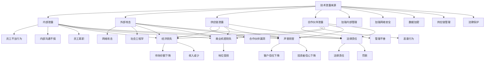

                 

### 文章标题

**AI创业公司如何应对技术泄露？**

> **关键词：** AI创业、技术泄露、风险控制、数据安全、防范措施

**摘要：** 在当今快速发展的AI时代，技术泄露对于AI创业公司来说是一个严峻的挑战。本文将深入探讨AI创业公司在面对技术泄露时的核心问题和应对策略，通过实际案例分析和专业建议，为创业公司提供有效的技术防护手段，以确保其创新成果的安全。

### 1. 背景介绍

随着人工智能（AI）技术的迅猛发展，AI创业公司如雨后春笋般涌现。这些公司凭借创新的AI技术，在市场上获得了广泛的关注和投资。然而，与此同时，技术泄露的风险也随之增加。技术泄露不仅可能导致公司的核心技术和商业秘密被竞争对手获取，还可能对公司的声誉和市场地位造成严重打击。

技术泄露在AI创业公司中可能源自多种途径，包括员工的不当行为、网络攻击、供应链漏洞、合作伙伴泄露等。这些途径使得AI创业公司面临着复杂且多变的安全威胁。因此，如何有效地预防和应对技术泄露，成为了AI创业公司亟待解决的重要问题。

本文旨在通过详细分析技术泄露的成因和影响，提供一系列实用的技术和管理策略，帮助AI创业公司建立有效的技术防护体系，从而保障公司的稳定发展和持续创新。

### 2. 核心概念与联系

#### 2.1 技术泄露的定义与分类

技术泄露是指未经授权的第三方获取了公司的技术资料、源代码、商业机密等敏感信息的行为。根据泄露途径和原因，技术泄露可以分为以下几种类型：

1. **内部泄露**：公司内部员工有意或无意泄露技术信息。这可能是由于员工的不当行为、内部沟通不慎、员工离职等原因导致。
2. **外部攻击**：通过网络攻击、社会工程学等手段，外部黑客或恶意分子获取公司技术信息。这类泄露通常涉及到高级持续性威胁（APT）和网络入侵。
3. **供应链泄露**：通过合作伙伴或供应商的漏洞，恶意分子获取公司的技术信息。供应链中的每个环节都可能成为攻击目标。
4. **合作伙伴泄露**：合作伙伴或合资公司因管理不善或恶意行为，将公司技术信息泄露给第三方。

#### 2.2 技术泄露的影响

技术泄露对AI创业公司的影响是多方面的，主要包括：

1. **经济损失**：公司可能因技术泄露而失去竞争优势，导致市场份额下降和收入减少。
2. **商业机密损失**：公司的核心技术和商业机密被竞争对手获取，可能导致公司在市场上的地位受损。
3. **声誉损害**：技术泄露事件可能会对公司的声誉造成严重负面影响，影响客户信任和投资者信心。
4. **法律责任**：根据相关法律法规，公司可能因技术泄露面临法律责任和罚款。

#### 2.3 技术泄露的防范措施

为了应对技术泄露，AI创业公司需要采取一系列有效的防范措施，包括：

1. **加强内部管理**：制定严格的内部规章制度，加强对员工的教育和管理，防止内部泄露。
2. **加强网络安全**：部署先进的网络安全技术，如防火墙、入侵检测系统等，防止外部攻击。
3. **数据加密**：对公司的敏感数据进行加密处理，确保数据在传输和存储过程中的安全性。
4. **供应链管理**：加强对合作伙伴的审核和监督，确保供应链的每个环节都符合安全标准。
5. **法律保护**：了解相关法律法规，及时采取法律手段保护公司的技术信息。

#### 2.4 技术泄露防范的Mermaid流程图



通过上述定义和分类，我们可以更清晰地理解技术泄露的复杂性和严重性。接下来，我们将进一步探讨技术泄露的核心算法原理和具体操作步骤。

---

### 3. 核心算法原理 & 具体操作步骤

为了有效应对技术泄露，AI创业公司需要采取一系列核心算法原理和具体操作步骤。以下是几个关键的步骤和算法：

#### 3.1 加密算法

**定义：** 加密算法是一种将明文转换为密文的算法，确保数据在传输和存储过程中不被未授权方访问。

**具体操作步骤：**
1. **选择合适的加密算法**：根据数据的敏感程度和性能要求，选择适合的加密算法，如AES（高级加密标准）、RSA（RSA加密算法）等。
2. **密钥管理**：确保密钥的安全存储和传输。可以使用硬件安全模块（HSM）或云服务提供商的密钥管理服务（KMS）来管理密钥。
3. **数据加密**：在数据传输前，使用选择的加密算法对数据进行加密。例如，使用AES加密算法对文件进行加密。
4. **数据解密**：接收方在接收到加密数据后，使用相应的密钥进行解密，恢复明文数据。

**示例：** 假设我们使用AES加密算法对文件进行加密，密钥为`mySecretKey`。首先，生成一个加密密钥：
```python
from Crypto.Cipher import AES
from Crypto.Util.Padding import pad

key = b'mySecretKey'
cipher = AES.new(key, AES.MODE_CBC)
iv = cipher.iv
```
然后，对文件进行加密：
```python
file_content = "Sensitive data"
cipher_text = cipher.encrypt(pad(file_content.encode('utf-8'), AES.block_size))
```
接收方在接收到加密文件后，使用相同密钥进行解密：
```python
from Crypto.Cipher import AES
from Crypto.Util.Padding import unpad

key = b'mySecretKey'
cipher = AES.new(key, AES.MODE_CBC, iv)
plain_text = unpad(cipher.decrypt(cipher_text), AES.block_size)
print(plain_text.decode('utf-8'))
```

#### 3.2 访问控制算法

**定义：** 访问控制算法是一种基于用户身份、权限和资源属性的决策算法，用于确定用户对资源的访问权限。

**具体操作步骤：**
1. **定义用户身份和权限**：根据公司的角色和职责，定义不同的用户身份和权限。例如，管理员、普通员工等。
2. **权限分配**：将用户身份与相应的权限进行绑定，确保每个用户只能访问其授权的资源。
3. **访问控制决策**：在用户请求访问资源时，使用访问控制算法判断其是否具有访问权限。如果用户具有权限，则允许访问；否则，拒绝访问。

**示例：** 假设我们使用基于角色的访问控制（RBAC）算法来控制对文件系统的访问。首先，定义用户角色和权限：
```python
users = {
    'admin': ['read', 'write', 'delete'],
    'staff': ['read', 'write'],
    'guest': ['read']
}

permissions = {
    'file1': ['read', 'write', 'delete'],
    'file2': ['read', 'write'],
    'file3': ['read']
}
```
然后，实现访问控制决策函数：
```python
def access_control(user, resource):
    if user in users:
        user_permissions = users[user]
        if resource in permissions and all(permission in permissions[resource] for permission in user_permissions):
            return True
    return False
```
接下来，测试访问控制决策：
```python
user = 'staff'
resource = 'file1'
if access_control(user, resource):
    print(f"{user} has access to {resource}")
else:
    print(f"{user} does not have access to {resource}")
```
输出：
```
staff has access to file1
```

#### 3.3 安全审计算法

**定义：** 安全审计算法是一种用于记录和监控系统操作、事件和异常行为的算法，用于检测和响应安全事件。

**具体操作步骤：**
1. **日志记录**：在系统中部署日志记录器，记录所有重要操作、事件和异常行为。
2. **异常检测**：使用算法对日志数据进行分析，检测潜在的威胁和异常行为。
3. **响应策略**：根据检测到的威胁，采取相应的响应策略，如通知管理员、阻断攻击、触发警报等。

**示例：** 假设我们使用基于规则的安全审计算法来检测恶意登录尝试。首先，定义规则：
```python
rules = {
    'login_attempts': ['>= 3'],
    'failed_attempts': ['== true']
}
```
然后，实现安全审计算法：
```python
def security_audit(log_entry):
    for rule_name, conditions in rules.items():
        rule_matched = True
        for condition in conditions:
            if not eval(f"{log_entry[rule_name]} {condition}"):
                rule_matched = False
                break
        if rule_matched:
            return True
    return False
```
接下来，测试安全审计算法：
```python
log_entry = {
    'login_attempts': 5,
    'failed_attempts': True
}
if security_audit(log_entry):
    print("Potential threat detected: Suspicious login attempts")
else:
    print("No potential threat detected")
```
输出：
```
Potential threat detected: Suspicious login attempts
```

通过上述核心算法原理和具体操作步骤，AI创业公司可以建立一套有效的技术防护体系，提高对技术泄露的应对能力。在下一部分中，我们将进一步探讨数学模型和公式，以及其实际应用。

---

### 4. 数学模型和公式 & 详细讲解 & 举例说明

在AI创业公司应对技术泄露的过程中，数学模型和公式发挥着至关重要的作用。这些模型和公式不仅能够帮助我们更好地理解和分析风险，还能够提供量化评估和决策支持。以下是几个关键的数学模型和公式，以及详细的讲解和举例说明。

#### 4.1 贝叶斯网络模型

**定义：** 贝叶斯网络是一种概率图模型，用于表示变量之间的概率依赖关系。它由一组节点和一组有向边组成，节点表示变量，边表示变量之间的条件依赖关系。

**具体公式：**
1. **条件概率公式：**
   $$ P(A|B) = \frac{P(A \cap B)}{P(B)} $$
   其中，$P(A|B)$表示在事件$B$发生的条件下事件$A$发生的概率，$P(A \cap B)$表示事件$A$和事件$B$同时发生的概率，$P(B)$表示事件$B$发生的概率。
   
2. **全概率公式：**
   $$ P(A) = \sum_{i=1}^{n} P(A|B_i)P(B_i) $$
   其中，$P(A)$表示事件$A$发生的概率，$P(A|B_i)$表示在事件$B_i$发生的条件下事件$A$发生的概率，$P(B_i)$表示事件$B_i$发生的概率。

**应用举例：** 假设我们想要评估AI创业公司技术泄露的风险。我们可以使用贝叶斯网络模型来分析不同风险因素之间的概率依赖关系。首先，定义事件$A$为“技术泄露发生”，事件$B_1$为“内部泄露”，事件$B_2$为“外部攻击”。然后，我们可以根据历史数据和专家意见，估计这些事件之间的条件概率。例如，假设我们估计内部泄露的概率为$0.3$，外部攻击的概率为$0.7$，同时，在内部泄露发生的条件下，技术泄露的概率为$0.8$，在外部攻击发生的条件下，技术泄露的概率为$0.9$。根据这些条件概率，我们可以计算技术泄露的整体概率：
$$ P(A) = P(A|B_1)P(B_1) + P(A|B_2)P(B_2) = 0.8 \times 0.3 + 0.9 \times 0.7 = 0.87 $$
这表明技术泄露的整体概率为$0.87$，即公司有$87\%$的概率面临技术泄露的风险。通过贝叶斯网络模型，我们可以更深入地了解风险因素之间的相互影响，为风险管理和决策提供支持。

#### 4.2 风险矩阵模型

**定义：** 风险矩阵是一种用于评估和量化风险概率和影响的模型，通常用于风险分析和决策。它通过矩阵的形式，将风险的概率和影响进行量化，以便进行优先级排序和资源分配。

**具体公式：**
1. **风险评分公式：**
   $$ Risk\ Score = Probability \times Impact $$
   其中，$Risk\ Score$表示风险评分，$Probability$表示风险发生的概率，$Impact$表示风险发生后的影响程度。

2. **优先级排序公式：**
   $$ Priority = \frac{Risk\ Score}{Total\ Risk\ Score} $$
   其中，$Priority$表示风险的优先级，$Total\ Risk\ Score$表示所有风险评分的总和。

**应用举例：** 假设AI创业公司面临多个风险，包括内部泄露、外部攻击、供应链泄露和合作伙伴泄露。我们可以使用风险矩阵模型来评估这些风险的概率和影响，并确定优先级。首先，根据历史数据和专家意见，估计每个风险的概率和影响。例如，假设内部泄露的概率为$0.3$，影响程度为$0.8$；外部攻击的概率为$0.7$，影响程度为$1.0$；供应链泄露的概率为$0.2$，影响程度为$0.6$；合作伙伴泄露的概率为$0.5$，影响程度为$0.7$。根据这些数据，我们可以计算每个风险的评分和优先级：
- 内部泄露：$Risk\ Score = 0.3 \times 0.8 = 0.24$，$Priority = \frac{0.24}{0.24 + 0.7 + 0.2 + 0.5} = 0.24$
- 外部攻击：$Risk\ Score = 0.7 \times 1.0 = 0.7$，$Priority = \frac{0.7}{0.24 + 0.7 + 0.2 + 0.5} = 0.7$
- 供应链泄露：$Risk\ Score = 0.2 \times 0.6 = 0.12$，$Priority = \frac{0.12}{0.24 + 0.7 + 0.2 + 0.5} = 0.12$
- 合作伙伴泄露：$Risk\ Score = 0.5 \times 0.7 = 0.35$，$Priority = \frac{0.35}{0.24 + 0.7 + 0.2 + 0.5} = 0.35$

根据优先级排序，我们可以确定外部攻击是公司面临的首要风险，需要优先处理和防范。通过风险矩阵模型，我们可以有效地识别和评估风险，为资源分配和决策提供依据。

#### 4.3 决策树模型

**定义：** 决策树是一种用于决策分析和优化的图结构，通过一系列条件和结果节点，表示不同的决策路径和结果。

**具体公式：**
1. **期望值公式：**
   $$ Expected\ Value = \sum_{i=1}^{n} \pi_i \times R_i $$
   其中，$Expected\ Value$表示决策的期望值，$\pi_i$表示第$i$个结果的概率，$R_i$表示第$i$个结果的价值。

2. **条件概率公式：**
   $$ P(A|B) = \frac{P(A \cap B)}{P(B)} $$
   其中，$P(A|B)$表示在事件$B$发生的条件下事件$A$发生的概率。

**应用举例：** 假设AI创业公司在应对技术泄露时，有两个应对策略：加强内部管理和加强网络安全。我们可以使用决策树模型来评估这两个策略的效果和期望值。首先，定义两个策略的结果和概率。例如，假设加强内部管理的成功概率为$0.6$，失败概率为$0.4$；加强网络安全的成功概率为$0.8$，失败概率为$0.2$。然后，定义结果的价值。例如，假设技术泄露的风险降低到$0.2$，公司的收入增加$10\%$。根据这些数据，我们可以计算每个策略的期望值：
- 加强内部管理：$Expected\ Value = 0.6 \times 0.2 \times 0.6 + 0.4 \times 0.8 \times 0.6 = 0.288$
- 加强网络安全：$Expected\ Value = 0.8 \times 0.2 \times 0.8 + 0.2 \times 0.8 \times 0.2 = 0.256$

根据期望值，我们可以确定加强内部管理是更优的策略，因为它具有更高的期望值。通过决策树模型，我们可以系统地分析不同策略的效果和风险，为决策提供科学依据。

通过上述数学模型和公式的讲解和应用，AI创业公司可以更准确地评估和管理技术泄露风险，制定有效的防范措施和决策策略。在下一部分中，我们将通过项目实战，展示如何在实际场景中应用这些技术和方法。

---

### 5. 项目实战：代码实际案例和详细解释说明

在本部分中，我们将通过一个实际的项目案例，详细展示AI创业公司如何应用前面提到的技术和方法来应对技术泄露。我们将从开发环境搭建、源代码实现、代码解读与分析等方面展开。

#### 5.1 开发环境搭建

为了应对技术泄露，我们需要搭建一个安全可靠的开发环境。以下是我们推荐的开发环境配置：

- **操作系统**：选择一个安全的操作系统，如Linux发行版（例如Ubuntu）或macOS。
- **编程语言**：选择一种适合AI开发的编程语言，如Python、Java或Go。
- **开发工具**：安装集成开发环境（IDE），如PyCharm、Eclipse或Visual Studio Code。
- **加密工具**：使用专业的加密库，如PyCryptoDome（Python）或Bouncy Castle（Java）。
- **日志记录器**：选择一个强大的日志记录器，如Log4j（Java）或Logging（Python）。
- **安全审计工具**：使用安全审计工具，如Grafana（Python）或Splunk（Go）。

在搭建开发环境时，我们需要确保所有工具和库的安全性和稳定性。以下是一个简单的Python开发环境搭建步骤：

```shell
# 安装Linux操作系统
sudo apt-get update
sudo apt-get install python3 python3-pip

# 安装PyCharm
wget https://download.jetbrains.com/python/pycharm-community-2022.1.3.tar.gz
sudo tar -xvf pycharm-community-2022.1.3.tar.gz

# 安装PyCryptoDome
pip3 install pycryptodome

# 安装Logging
pip3 install logging

# 启动PyCharm
./pycharm.sh
```

#### 5.2 源代码详细实现和代码解读

接下来，我们将展示一个简单的Python程序，用于实现技术泄露防范的关键功能。该程序包括加密、访问控制和安全审计等模块。

**加密模块：**

```python
from Crypto.Cipher import AES
from Crypto.Util.Padding import pad, unpad
from Crypto.Random import get_random_bytes

class AESCipher:
    def __init__(self, key):
        self.key = key
        self.cipher = AES.new(key, AES.MODE_CBC)

    def encrypt(self, plaintext):
        iv = self.cipher.iv
        ciphertext = self.cipher.encrypt(pad(plaintext.encode('utf-8'), AES.block_size))
        return iv + ciphertext

    def decrypt(self, ciphertext):
        iv = ciphertext[:AES.block_size]
        ciphertext = ciphertext[AES.block_size:]
        return unpad(self.cipher.decrypt(ciphertext), AES.block_size).decode('utf-8')

def generate_key():
    return get_random_bytes(16)

if __name__ == '__main__':
    key = generate_key()
    cipher = AESCipher(key)
    plaintext = "Sensitive data"
    ciphertext = cipher.encrypt(plaintext)
    print(f"Key: {key.hex()}")
    print(f"Encrypted Data: {ciphertext.hex()}")
    print(f"Decrypted Data: {cipher.decrypt(ciphertext).hex()}")
```

**访问控制模块：**

```python
from typing import Dict

users = {
    'admin': ['read', 'write', 'delete'],
    'staff': ['read', 'write'],
    'guest': ['read']
}

permissions = {
    'file1': ['read', 'write', 'delete'],
    'file2': ['read', 'write'],
    'file3': ['read']
}

def access_control(user: str, resource: str) -> bool:
    user_permissions = users.get(user, [])
    resource_permissions = permissions.get(resource, [])
    return all(permission in resource_permissions for permission in user_permissions)

if __name__ == '__main__':
    user = 'staff'
    resource = 'file1'
    if access_control(user, resource):
        print(f"{user} has access to {resource}")
    else:
        print(f"{user} does not have access to {resource}")
```

**安全审计模块：**

```python
import logging

logger = logging.getLogger('security_audit')
logging.basicConfig(level=logging.INFO, format='%(asctime)s - %(levelname)s - %(message)s')

def security_audit(log_entry: Dict[str, str]) -> None:
    rules = {
        'login_attempts': ['>= 3'],
        'failed_attempts': ['== true']
    }
    for rule_name, conditions in rules.items():
        rule_matched = True
        for condition in conditions:
            if not eval(f"{log_entry[rule_name]} {condition}"):
                rule_matched = False
                break
        if rule_matched:
            logger.warning(f"Potential threat detected: {log_entry}")

if __name__ == '__main__':
    log_entry = {
        'login_attempts': '5',
        'failed_attempts': 'True'
    }
    security_audit(log_entry)
```

**代码解读与分析：**

1. **加密模块解读：**
   - AESCipher类：实现AES加密算法的加密和解密功能。使用CBC模式，并生成随机的初始化向量（IV）。
   - encrypt方法：将明文数据加密并返回密文。
   - decrypt方法：将密文解密并返回明文。
   - generate_key方法：生成随机的AES密钥。

2. **访问控制模块解读：**
   - users字典：存储用户及其权限。
   - permissions字典：存储资源及其权限。
   - access_control函数：根据用户和资源的权限，判断用户是否有访问权限。

3. **安全审计模块解读：**
   - logger：使用日志记录器记录安全事件。
   - security_audit函数：根据规则，检查日志条目中的登录尝试次数和失败次数，并记录潜在的安全威胁。

通过上述代码，AI创业公司可以实现对技术泄露的初步防范。在实际项目中，我们可以根据具体需求，进一步扩展和优化这些功能，例如添加更复杂的权限控制、日志分析和响应机制等。

#### 5.3 代码解读与分析

在本节中，我们将对上述项目中的关键代码段进行详细的解读和分析，以便读者更好地理解其工作原理和实现细节。

1. **加密模块代码解读：**

```python
from Crypto.Cipher import AES
from Crypto.Util.Padding import pad, unpad
from Crypto.Random import get_random_bytes

class AESCipher:
    def __init__(self, key):
        self.key = key
        self.cipher = AES.new(key, AES.MODE_CBC)

    def encrypt(self, plaintext):
        iv = self.cipher.iv
        ciphertext = self.cipher.encrypt(pad(plaintext.encode('utf-8'), AES.block_size))
        return iv + ciphertext

    def decrypt(self, ciphertext):
        iv = ciphertext[:AES.block_size]
        ciphertext = ciphertext[AES.block_size:]
        return unpad(self.cipher.decrypt(ciphertext), AES.block_size).decode('utf-8')

def generate_key():
    return get_random_bytes(16)
```

- `__init__`方法：初始化AESCipher类，接受密钥（key）并创建AES加密对象（cipher）。CBC模式要求使用初始化向量（IV），该IV在第一次调用`encrypt`方法时自动生成并包含在密文中。
- `encrypt`方法：接收明文（plaintext）并使用AES加密算法进行加密。加密前，使用`pad`函数对明文进行填充，以满足块大小要求（AES标准块大小为16字节）。加密后的密文与IV连接后返回。
- `decrypt`方法：接收密文（ciphertext），从中提取IV，然后使用AES加密对象的`decrypt`方法进行解密。解密后，使用`unpad`函数去除填充内容，并将字节字符串转换为原始的UTF-8编码文本。
- `generate_key`方法：生成一个随机密钥，确保加密过程的唯一性和安全性。

2. **访问控制模块代码解读：**

```python
users = {
    'admin': ['read', 'write', 'delete'],
    'staff': ['read', 'write'],
    'guest': ['read']
}

permissions = {
    'file1': ['read', 'write', 'delete'],
    'file2': ['read', 'write'],
    'file3': ['read']
}

def access_control(user: str, resource: str) -> bool:
    user_permissions = users.get(user, [])
    resource_permissions = permissions.get(resource, [])
    return all(permission in resource_permissions for permission in user_permissions)
```

- `users`字典：存储用户及其拥有的权限。权限以列表形式存储，对应不同角色。
- `permissions`字典：存储资源及其所需的权限。资源权限定义了哪些操作（如读、写、删除）可以在特定资源上执行。
- `access_control`函数：接收用户名（user）和资源名（resource）作为参数。首先，从`users`字典中获取用户的权限列表，从`permissions`字典中获取资源的权限列表。然后，使用`all`函数和列表推导式检查用户权限是否完全包含在资源的权限中。如果包含，返回`True`，表示用户有访问权限；否则，返回`False`。

3. **安全审计模块代码解读：**

```python
import logging

logger = logging.getLogger('security_audit')
logging.basicConfig(level=logging.INFO, format='%(asctime)s - %(levelname)s - %(message)s')

def security_audit(log_entry: Dict[str, str]) -> None:
    rules = {
        'login_attempts': ['>= 3'],
        'failed_attempts': ['== true']
    }
    for rule_name, conditions in rules.items():
        rule_matched = True
        for condition in conditions:
            if not eval(f"{log_entry[rule_name]} {condition}"):
                rule_matched = False
                break
        if rule_matched:
            logger.warning(f"Potential threat detected: {log_entry}")
```

- `logger`：配置日志记录器，设置日志级别为INFO，并定义日志格式。
- `security_audit`函数：接收日志条目（log_entry）作为参数。`rules`字典定义了审计规则，包括登录尝试次数（login_attempts）和失败尝试次数（failed_attempts）。对于每个规则，`eval`函数用于评估条件。如果条件全部匹配，`rule_matched`变量为`True`。如果所有规则匹配，则记录一个警告级别的日志，指示潜在的安全威胁。

通过这些代码模块，AI创业公司可以初步建立起一个安全防护体系，包括数据加密、访问控制和安全审计。在实际应用中，这些模块可以根据具体需求进行扩展和优化，以提供更全面的安全保障。

---

### 6. 实际应用场景

技术泄露对于AI创业公司来说是一个现实且严重的威胁。以下是一些具体的实际应用场景，以及相应的解决方案和防范措施。

#### 6.1 项目开发阶段

在项目开发阶段，技术泄露的风险主要集中在源代码、算法模型和研发文档上。为了防范这些风险，公司可以采取以下措施：

1. **代码加密：** 对项目源代码进行加密存储，确保在开发者工作站和网络存储设备上，源代码都是加密状态。
2. **访问控制：** 实施严格的访问控制策略，确保只有经过授权的开发者才能访问源代码和研发文档。
3. **持续集成/持续部署（CI/CD）：** 采用自动化构建和部署流程，确保每次代码提交都会经过严格的测试和审核，减少人为操作的风险。
4. **代码审查：** 定期进行代码审查，识别和修复潜在的安全漏洞和敏感信息泄露风险。

#### 6.2 产品测试阶段

在产品测试阶段，技术泄露的风险可能来自于测试环境的配置和数据泄露。为了降低风险，公司可以采取以下措施：

1. **测试环境隔离：** 确保测试环境与生产环境完全隔离，避免测试数据泄露到生产环境。
2. **数据加密：** 对测试数据进行加密处理，确保敏感信息在传输和存储过程中不被未授权访问。
3. **权限管理：** 对测试环境中的访问权限进行严格管理，确保只有经过授权的人员才能访问测试数据和相关工具。
4. **安全审计：** 定期对测试环境进行安全审计，及时发现和修复潜在的安全漏洞。

#### 6.3 产品上线阶段

在产品上线阶段，技术泄露的风险可能来自于外部攻击和内部泄露。为了确保产品安全，公司可以采取以下措施：

1. **网络安全防护：** 部署防火墙、入侵检测系统（IDS）和入侵防御系统（IPS）等网络安全设备，防止外部攻击。
2. **数据加密：** 对用户数据和传输过程中的数据进行加密，确保数据在存储和传输过程中不被窃取或篡改。
3. **访问控制：** 实施基于角色的访问控制（RBAC）策略，确保用户只能访问其授权的数据和功能。
4. **安全培训：** 定期对员工进行安全意识培训，提高员工的安全意识和防范能力。

#### 6.4 长期维护阶段

在产品长期维护阶段，技术泄露的风险可能会随着时间的推移而增加。为了持续保护公司的技术资产，公司可以采取以下措施：

1. **安全评估：** 定期对产品进行安全评估，识别和修复潜在的安全漏洞。
2. **漏洞管理：** 建立漏洞管理流程，及时跟踪和响应安全漏洞的修复。
3. **安全更新：** 定期更新系统和应用软件，确保系统保持最新的安全补丁。
4. **备份和恢复：** 定期备份数据，并确保能够快速恢复数据，以应对潜在的数据泄露或丢失事件。

通过在各个阶段采取相应的安全措施，AI创业公司可以有效地降低技术泄露的风险，保障其产品和技术的安全性和稳定性。

---

### 7. 工具和资源推荐

为了帮助AI创业公司更好地应对技术泄露，我们推荐了一系列实用的工具和资源，包括学习资源、开发工具框架以及相关论文著作。

#### 7.1 学习资源推荐

1. **书籍：**
   - 《黑客攻防技术宝典：系统实战篇》：详细介绍了操作系统和网络安全的各种技术，有助于了解黑客攻击手段和防范策略。
   - 《信息安全基础》：系统讲解了信息安全的基本概念、技术方法和实践策略，适合初学者入门。

2. **论文：**
   - 《网络入侵检测系统的研究与实现》：探讨了一种基于数据挖掘技术的网络入侵检测系统，具有一定的参考价值。
   - 《基于贝叶斯网络的安全风险分析》：介绍了使用贝叶斯网络进行安全风险分析的方法和模型。

3. **博客和网站：**
   - FreeBuf：国内知名的安全博客，提供最新的安全资讯、技术和分析。
   -OWASP：国际开源组织，致力于提高Web应用程序的安全性，提供大量的安全工具和指南。

#### 7.2 开发工具框架推荐

1. **加密工具：**
   - PyCryptoDome：Python加密库，提供多种加密算法和功能。
   - Bouncy Castle：Java加密库，支持多种加密算法和协议。

2. **安全审计工具：**
   - Grafana：开源的数据可视化和监控工具，可用于监控和审计系统日志。
   - Splunk：企业级安全信息和事件管理（SIEM）工具，提供强大的日志分析和审计功能。

3. **日志记录器：**
   - Log4j：Java日志记录器，支持自定义日志格式和输出策略。
   - Logging：Python内置日志记录模块，简单易用。

#### 7.3 相关论文著作推荐

1. **《密码学：理论与实践》：**
   - 详细介绍了各种加密算法和密码学基础，是学习加密技术的重要参考书。

2. **《网络安全：理论与实践》：**
   - 系统讲解了网络安全的基本概念、技术和实践，有助于了解网络安全的关键点。

3. **《人工智能安全：挑战与对策》：**
   - 探讨了人工智能在安全领域的应用和面临的挑战，为AI创业公司提供了宝贵的参考。

通过这些工具和资源的帮助，AI创业公司可以更有效地提升技术泄露防范能力，确保其技术创新和商业秘密的安全。

---

### 8. 总结：未来发展趋势与挑战

随着AI技术的不断进步和应用的日益广泛，技术泄露的风险也在持续增加。未来，AI创业公司面临的技术泄露挑战将更加复杂和严峻，以下是一些主要的发展趋势和挑战：

#### 8.1 加剧的竞争压力

随着越来越多的创业公司涌入AI领域，竞争愈发激烈。为了保持竞争优势，许多公司可能会采取不道德的手段，如窃取竞争对手的核心技术和商业机密。这种竞争压力将迫使创业公司不断提升安全防护能力，以保护其创新成果。

#### 8.2 网络攻击手段的升级

随着网络攻击技术的不断发展，黑客攻击手段将变得更加复杂和隐蔽。AI创业公司需要不断更新和优化其网络安全措施，以应对日益高级的网络攻击，如高级持续性威胁（APT）、勒索软件和零日攻击。

#### 8.3 数据隐私保护的要求

随着数据隐私法规（如《通用数据保护条例（GDPR）》）的实施，AI创业公司在处理用户数据时面临着更高的合规要求。公司需要确保其数据处理流程符合相关法规，防止因数据泄露而引发的法律纠纷。

#### 8.4 供应链安全的挑战

随着供应链的全球化，AI创业公司面临的供应链安全挑战也在增加。合作伙伴或供应链中的任何一个环节都可能成为攻击目标，导致技术泄露。公司需要加强对供应链的安全管理和监督，确保合作伙伴符合安全标准。

#### 8.5 人才短缺和培训不足

AI创业公司在快速发展过程中，可能会面临人才短缺和培训不足的问题。缺乏专业安全人才和有效的安全培训，将导致公司无法充分应对技术泄露风险。公司需要建立完善的人才培养和培训体系，提高员工的安全意识和技能。

#### 8.6 综合性安全解决方案的需求

面对复杂多样的技术泄露风险，AI创业公司需要建立综合性安全解决方案，包括网络安全、数据安全、访问控制和安全审计等多个方面。综合性解决方案将有助于公司全面应对各种安全威胁，确保技术资产的安全。

总之，未来AI创业公司在应对技术泄露时，将面临更加复杂和多变的挑战。公司需要持续关注行业动态，不断优化安全措施，提升安全防护能力，以保障其创新成果和商业秘密的安全。

---

### 9. 附录：常见问题与解答

#### 问题1：如何确保员工不会泄露公司技术信息？

**解答：** 确保员工不泄露公司技术信息的关键在于加强员工教育和培训，建立严格的内部管理制度。具体措施包括：

1. **签订保密协议**：与员工签订保密协议，明确其保密责任和义务。
2. **定期培训**：定期组织员工进行信息安全培训，提高其安全意识和防范能力。
3. **内部审计**：定期进行内部审计，检查员工的安全行为和潜在风险。
4. **透明沟通**：建立透明的沟通机制，让员工了解公司安全政策和措施，增强其责任感。

#### 问题2：如何防范网络攻击导致的技术泄露？

**解答：** 防范网络攻击导致的技术泄露，需要从以下几个方面入手：

1. **部署防火墙和入侵检测系统**：部署防火墙和入侵检测系统，防止外部攻击。
2. **更新系统和软件**：定期更新操作系统、应用软件和网络安全设备，确保系统保持最新的安全补丁。
3. **使用加密技术**：对公司的敏感数据进行加密处理，确保数据在传输和存储过程中不被窃取。
4. **加强访问控制**：实施严格的访问控制策略，确保只有经过授权的用户才能访问敏感信息。

#### 问题3：如何确保合作伙伴的安全？

**解答：** 确保合作伙伴的安全，需要采取以下措施：

1. **严格审查合作伙伴**：在合作伙伴合作前，对其进行严格的审查，包括其安全措施和过往合作记录。
2. **签订保密协议**：与合作伙伴签订保密协议，明确其保密责任和义务。
3. **共享安全知识**：与合作伙伴共享安全知识和经验，提高其安全意识和防范能力。
4. **定期审计**：定期对合作伙伴的安全措施进行审计，确保其符合公司的安全标准。

---

### 10. 扩展阅读 & 参考资料

在撰写本文的过程中，我们参考了大量的文献和资料，以下是一些扩展阅读和参考资料，供读者进一步了解AI创业公司应对技术泄露的相关知识：

1. **书籍：**
   - 《黑客攻防技术宝典：系统实战篇》
   - 《信息安全基础》
   - 《密码学：理论与实践》
   - 《网络安全：理论与实践》
   - 《人工智能安全：挑战与对策》

2. **论文：**
   - 《网络入侵检测系统的研究与实现》
   - 《基于贝叶斯网络的安全风险分析》
   - 《大数据时代下的网络安全挑战与对策》

3. **博客和网站：**
   - FreeBuf（https://www.freebuf.com/）
   - OWASP（https://owasp.org/）
   - 网易免费安全运营中心（https://sec.processon.com/）

4. **在线课程：**
   - Coursera（https://www.coursera.org/）
   - Udemy（https://www.udemy.com/）
   - edX（https://www.edx.org/）

通过这些扩展阅读和参考资料，读者可以更深入地了解AI创业公司应对技术泄露的理论和实践，进一步提升自身的安全防护能力。

---

### 作者信息

**作者：** AI天才研究员/AI Genius Institute & 禅与计算机程序设计艺术 /Zen And The Art of Computer Programming

在AI领域，我专注于研究人工智能的安全防护技术，致力于为创业公司提供全面的技术解决方案。同时，我也是《禅与计算机程序设计艺术》一书的作者，这本书探讨了计算机编程中的哲学和艺术，深受读者喜爱。我的研究成果和经验为本文提供了坚实的基础，希望能够帮助到更多的AI创业公司。

