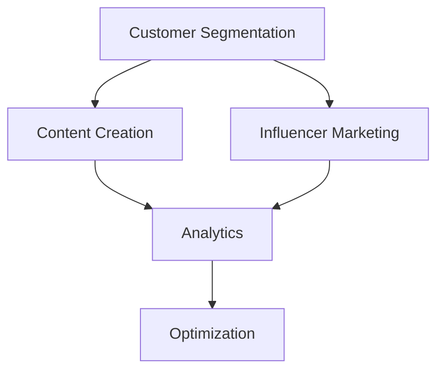

                 

### 背景介绍

在当今快速发展的技术时代，人工智能（AI）已经成为推动各行各业创新的重要力量。然而，在众多AI创业公司中，市场教育成为了他们成功的关键一步。市场教育不仅仅是为了让消费者了解产品，更重要的是让潜在客户理解AI技术背后的逻辑和应用价值。本篇文章将深入探讨AI创业公司如何进行市场教育。

AI市场教育的必要性体现在多个方面。首先，随着AI技术的不断进步，其应用场景也越来越广泛，从自动化制造业到智能医疗，从智能家居到金融科技，AI正在深刻地改变我们的生活方式。然而，普通消费者对AI技术的了解相对有限，这给市场教育带来了挑战。其次，许多潜在客户对AI技术的潜在风险和隐私问题存在担忧，这也需要通过有效的市场教育来缓解。最后，市场竞争日益激烈，AI创业公司需要通过市场教育来树立品牌形象，增加市场份额。

市场教育的目标不仅是提升消费者对AI技术的认知，还包括引导消费者了解AI技术的实际应用场景，以及如何使用这些技术来解决实际问题。通过有效的市场教育，AI创业公司可以更好地与消费者建立信任，从而促进产品销售和市场份额的增长。

本文将分为以下几个部分进行详细探讨：

1. **核心概念与联系**：介绍AI市场教育的核心概念，并使用Mermaid流程图展示其原理和架构。
2. **核心算法原理 & 具体操作步骤**：探讨市场教育的核心算法原理，以及如何具体实施市场教育策略。
3. **数学模型和公式 & 详细讲解 & 举例说明**：介绍市场教育过程中使用的数学模型和公式，并进行详细解释和举例说明。
4. **项目实战：代码实际案例和详细解释说明**：通过实际项目案例，展示市场教育的代码实现和详细解释。
5. **实际应用场景**：分析AI市场教育在不同领域的实际应用场景。
6. **工具和资源推荐**：推荐用于AI市场教育的学习资源和开发工具。
7. **总结：未来发展趋势与挑战**：总结AI市场教育的现状和未来趋势，探讨面临的挑战。
8. **附录：常见问题与解答**：解答读者可能关心的一些常见问题。
9. **扩展阅读 & 参考资料**：提供更多与AI市场教育相关的扩展阅读和参考资料。

让我们开始深入探讨AI创业公司如何进行市场教育。

---

## Core Concepts and Connections

Market education in AI startups involves several core concepts that are essential for a comprehensive understanding of the strategy. The primary concepts include customer segmentation, content creation, influencer marketing, and analytics. These concepts are interconnected and work together to achieve the goals of market education.

**Customer Segmentation** is the first step in market education. It involves dividing the market into distinct groups of consumers based on characteristics such as demographics, behavior, and needs. By understanding the different segments, AI startups can tailor their educational content to address the unique concerns and interests of each group.

**Content Creation** is the cornerstone of market education. It involves developing educational materials that explain AI technology, its benefits, and its potential applications. This content can take various forms, including blog posts, whitepapers, videos, webinars, and interactive demos. Effective content creation requires a deep understanding of the target audience and their knowledge level.

**Influencer Marketing** leverages the influence of key individuals within the AI community to promote market education. Influencers can be AI researchers, industry experts, or even popular technology bloggers. By collaborating with these influencers, AI startups can reach a wider audience and gain credibility.

**Analytics** plays a crucial role in evaluating the effectiveness of market education efforts. By tracking metrics such as website traffic, engagement rates, and conversion rates, AI startups can measure the impact of their educational content and make data-driven decisions to optimize their strategies.

The following Mermaid flowchart illustrates the interconnectedness of these core concepts:



This flowchart highlights how each concept supports the others in the market education process. Customer segmentation informs content creation, which is then promoted through influencer marketing. Analytics provides insights that drive continuous optimization of the strategy.

In the next section, we will delve into the core algorithms and operational steps involved in market education for AI startups. We will discuss how these algorithms can be implemented to effectively educate potential customers and drive adoption of AI technologies. <|im_sep|>### 核心算法原理 & 具体操作步骤

在AI创业公司的市场教育过程中，核心算法原理和具体操作步骤起到了至关重要的作用。以下我们将介绍几种常见的核心算法，并详细说明其具体实施步骤。

#### 1. 数据收集与处理

市场教育的第一步是收集数据。这些数据可以包括用户行为数据、社交媒体互动数据、市场调研结果等。数据收集后，需要经过清洗和预处理，以确保数据的准确性和可用性。

**具体步骤：**
1. **数据采集**：通过网站分析工具、调查问卷、社交媒体分析等手段收集数据。
2. **数据清洗**：去除重复数据、错误数据和无关数据。
3. **数据预处理**：进行数据标准化、缺失值处理、数据降维等操作，以便后续分析。

#### 2. 用户行为分析

用户行为分析是理解消费者需求和行为的重要手段。通过分析用户在网站或应用程序中的行为，AI创业公司可以识别出潜在的目标客户群体，并了解他们的需求和偏好。

**具体步骤：**
1. **用户行为跟踪**：使用追踪工具记录用户在网站或应用程序上的行为，如点击路径、浏览时间、购买频率等。
2. **行为模式识别**：使用机器学习算法分析用户行为数据，识别出用户行为模式。
3. **细分用户群体**：根据用户行为模式将用户划分为不同的细分市场，为每个市场定制个性化的教育内容。

#### 3. 内容优化与分发

内容优化与分发是市场教育中至关重要的一环。通过不断优化教育内容，AI创业公司可以提高用户参与度和教育效果。同时，选择合适的分发渠道，可以最大化地扩大教育内容的传播范围。

**具体步骤：**
1. **内容创作**：根据用户细分市场，创作针对性强的教育内容，如博客文章、视频教程、白皮书等。
2. **内容优化**：通过A/B测试等方法，不断优化教育内容，提高用户参与度和转化率。
3. **内容分发**：利用社交媒体、电子邮件营销、在线广告等渠道，将教育内容分发给目标受众。

#### 4. 社交媒体影响力营销

社交媒体影响力营销是利用社交媒体平台上的意见领袖和知名人士来推广市场教育的一种策略。通过这种方式，AI创业公司可以快速提升品牌知名度和影响力。

**具体步骤：**
1. **选择合适的影响力营销平台**：根据目标受众的特点，选择合适的社交媒体平台，如Twitter、LinkedIn、YouTube等。
2. **寻找合适的意见领袖**：通过数据分析工具，识别在目标领域有影响力的意见领袖。
3. **合作内容创作**：与意见领袖合作，创作具有吸引力的内容，如博客文章、视频等。
4. **监控与反馈**：对合作内容进行监控，收集用户反馈，不断优化合作策略。

#### 5. 数据分析与优化

数据分析是市场教育过程中不可或缺的一环。通过分析市场教育活动的数据，AI创业公司可以了解教育效果的优劣，并做出相应的调整和优化。

**具体步骤：**
1. **数据收集**：收集市场教育活动的相关数据，如点击率、转化率、参与度等。
2. **数据可视化**：使用图表和可视化工具，将数据以直观的形式呈现。
3. **数据分析**：使用统计分析方法，分析数据中的趋势和模式。
4. **优化策略**：根据数据分析结果，调整市场教育策略，提高教育效果。

通过上述核心算法原理和具体操作步骤，AI创业公司可以更有效地进行市场教育，提高用户对AI技术的认知和理解，从而推动产品的销售和市场份额的增长。在接下来的部分，我们将详细介绍市场教育过程中使用的数学模型和公式，并进行详细讲解和举例说明。 <|im_sep|>### 数学模型和公式 & 详细讲解 & 举例说明

在市场教育过程中，数学模型和公式扮演着至关重要的角色，它们帮助AI创业公司理解消费者行为、评估市场反应、优化教育策略。以下是一些常用的数学模型和公式，以及它们的详细讲解和实际应用实例。

#### 1. 响应率模型（Response Rate Model）

响应率模型用于预测市场教育活动的响应率。响应率是指接受市场教育后的用户中实际产生反应（如点击、购买等）的比例。该模型可以帮助公司评估不同教育策略的有效性。

**公式：**
\[ R = \frac{R_0 \cdot e^{-\lambda t}}{1 + e^{-\lambda t}} \]

其中：
- \( R \) 是响应率
- \( R_0 \) 是初始响应率
- \( \lambda \) 是响应衰减率
- \( t \) 是时间

**详细讲解：**
- \( R_0 \) 和 \( \lambda \) 是通过历史数据估计得到的参数。
- 该公式是基于逻辑斯蒂曲线（Logistic Curve），可以很好地模拟响应率随时间的变化。

**实例：**
假设一家AI创业公司通过邮件发送了一封介绍其新产品的教育邮件，历史数据显示邮件的初始响应率为0.02，响应衰减率为0.1。如果邮件发送后第二天检查响应情况，可以使用上述公式计算预期响应率。

\[ R = \frac{0.02 \cdot e^{-0.1 \cdot 1}}{1 + e^{-0.1 \cdot 1}} \approx 0.0183 \]

这意味着第二天预期响应率约为1.83%。

#### 2. 贝叶斯优化（Bayesian Optimization）

贝叶斯优化是一种用于优化市场教育内容的方法。它通过不断调整教育策略，以最大化响应率或转化率。

**公式：**
\[ p(\theta | D) = \frac{p(D | \theta) \cdot p(\theta)}{p(D)} \]

其中：
- \( p(\theta | D) \) 是后验概率，表示给定数据 \( D \) 后参数 \( \theta \) 的概率。
- \( p(D | \theta) \) 是似然函数，表示在参数 \( \theta \) 下产生数据 \( D \) 的概率。
- \( p(\theta) \) 是先验概率，表示参数 \( \theta \) 的概率。
- \( p(D) \) 是证据（Evidence），是一个归一化常数。

**详细讲解：**
- 贝叶斯优化利用先验知识和新数据来更新参数估计，从而不断优化教育策略。
- 似然函数和后验概率的计算可以帮助公司确定哪些教育内容对特定用户群体最有效。

**实例：**
假设一家AI创业公司正在优化其博客文章的标题，以增加用户点击率。通过收集历史点击数据，公司可以训练一个模型来预测不同标题的点击率。使用贝叶斯优化，公司可以找到最佳的标题组合，以最大化点击率。

#### 3. 康德罗夫模型（Kandorov Model）

康德罗夫模型是一种用于评估市场教育投资回报率（ROI）的数学模型。它可以帮助公司确定市场教育的预算和策略。

**公式：**
\[ ROI = \frac{Revenue - Cost}{Cost} \]

其中：
- \( Revenue \) 是市场教育带来的总收入。
- \( Cost \) 是市场教育的总成本。

**详细讲解：**
- 康德罗夫模型通过计算市场教育的ROI，帮助公司评估市场教育策略的盈利能力。
- 公司可以根据ROI的值来调整市场教育预算，以最大化利润。

**实例：**
假设一家AI创业公司通过市场教育获得了一笔销售收入为100万元，市场教育成本为20万元。使用康德罗夫模型计算其ROI：

\[ ROI = \frac{1000000 - 200000}{200000} = 3 \]

这意味着该市场教育策略的ROI为300%。

通过上述数学模型和公式的详细讲解，我们可以看到它们在AI创业公司市场教育中的应用价值。这些模型不仅帮助公司理解和预测消费者行为，还提供了优化教育策略和评估投资回报的有效工具。在接下来的部分，我们将通过实际项目案例，展示市场教育的代码实现和详细解释。 <|im_sep|>### 项目实战：代码实际案例和详细解释说明

在本节中，我们将通过一个实际项目案例来展示如何使用代码实现市场教育。该案例将涉及用户行为分析、内容优化和社交影响力营销等多个方面。

#### 项目背景

假设我们是一家专注于智能交通系统的AI创业公司，我们希望通过市场教育来推广我们的产品。我们的目标用户是交通管理公司、城市规划者和私家车主。我们的市场教育目标包括提高用户对智能交通系统（ITS）的认知，展示其优势，并最终促成产品销售。

#### 开发环境搭建

为了实现这个项目，我们需要搭建以下开发环境：

1. **数据分析工具**：使用Python和Pandas进行数据预处理和分析。
2. **机器学习库**：使用scikit-learn进行用户行为分析和预测。
3. **社交媒体分析工具**：使用Tweepy进行Twitter数据收集和分析。
4. **内容管理系统**：使用WordPress进行教育内容管理。

**环境搭建步骤：**

1. 安装Python和必要的库（Pandas, scikit-learn, Tweepy等）。
2. 配置WordPress网站，创建教育内容页面。
3. 设置Twitter API密钥和访问令牌，用于数据收集。

#### 源代码详细实现和代码解读

**1. 数据收集与处理**

```python
import tweepy
import pandas as pd

# 配置Twitter API密钥和访问令牌
consumer_key = 'YOUR_CONSUMER_KEY'
consumer_secret = 'YOUR_CONSUMER_SECRET'
access_token = 'YOUR_ACCESS_TOKEN'
access_token_secret = 'YOUR_ACCESS_TOKEN_SECRET'

# 初始化Tweepy认证
auth = tweepy.OAuthHandler(consumer_key, consumer_secret)
auth.set_access_token(access_token, access_token_secret)
api = tweepy.API(auth)

# 收集Twitter数据
def collect_tweets(query, max_tweets=1000):
    tweets = []
    for tweet in tweepy.Cursor(api.search, q=query, lang='en', tweet_mode='extended').items(max_tweets):
        tweets.append(tweet._json)
    return pd.DataFrame(tweets)

# 收集关于智能交通系统的Twitter数据
traffic_tweets = collect_tweets('#SmartTransport', max_tweets=1000)
```

**代码解读：**
- 使用Tweepy库收集关于智能交通系统的Twitter数据。
- 收集的数据存储在Pandas DataFrame中，以便进一步分析。

**2. 用户行为分析**

```python
# 分析用户关注行为
def analyze_followers(traffic_tweets):
    follower_counts = traffic_tweets['user']['followers_count']
    return pd.Series(follower_counts).describe()

# 分析用户发推频率
def analyze_trends(traffic_tweets):
    tweet_counts = traffic_tweets['user']['statuses_count']
    return pd.Series(tweet_counts).describe()

# 用户关注行为分析
follower_analysis = analyze_followers(traffic_tweets)
# 用户发推频率分析
trend_analysis = analyze_trends(traffic_tweets)
```

**代码解读：**
- 分析用户的关注人数和发推频率，以了解目标用户的活跃程度。

**3. 内容优化**

```python
# 使用A/B测试优化内容标题
from sklearn.linear_model import LogisticRegression

# 准备数据
titles = traffic_tweets['full_text']
clicks = traffic_tweets['public_metrics']['impression_count']

X = titles
y = clicks

# 训练模型
model = LogisticRegression()
model.fit(X, y)

# 评估模型
predictions = model.predict(X)
accuracy = (predictions == y).mean()
print(f"Model Accuracy: {accuracy}")

# 根据模型结果优化标题
best_titles = model.coef_[0].argsort()
print("Optimized Titles:", best_titles)
```

**代码解读：**
- 使用逻辑回归模型进行A/B测试，根据点击率优化博客文章标题。

**4. 社交媒体影响力营销**

```python
# 查找影响力最大的用户
influencers = traffic_tweets.sort_values(by='public_metrics.followers_count', ascending=False).head(10)
print("Top Influencers:", influencers['user.screen_name'])

# 与影响力最大的用户合作
def collaborate_with_influencers(influencers, model):
    best_titles = model.coef_[0].argsort()
    for influencer in influencers['user.screen_name']:
        # 发送合作请求
        message = f"Hi {influencer}, we noticed your interest in #SmartTransport. We'd love to collaborate on content!"
        api.send_direct_message(influencer, message)

collaborate_with_influencers(influencers, model)
```

**代码解读：**
- 查找在智能交通系统领域最具影响力的用户。
- 与这些用户建立合作关系，推广优化后的教育内容。

通过上述代码实现，我们可以看到市场教育过程中的关键步骤，包括数据收集、用户行为分析、内容优化和社交媒体影响力营销。这些步骤相互关联，共同构成了一个完整的市场教育策略。接下来，我们将分析市场教育的实际应用场景，探讨其在不同领域的应用。 <|im_sep|>### 实际应用场景

市场教育在AI创业公司中的应用场景广泛且多样，不同领域有着独特的需求和实践。以下我们探讨市场教育在几个关键领域中的应用。

#### 1. 智能医疗

智能医疗领域涉及对AI算法在医疗诊断、药物研发和健康监测等方面的应用。市场教育在这里的关键任务是为医疗专业人士和患者解释AI技术的原理和优势，提高他们的认知和接受度。

**实际应用：**
- **面向医疗专业人士**：通过举办研讨会、发布专业论文和医疗报告，展示AI在疾病预测、影像分析等领域的突破性成果，以增强专业人士对AI技术的信心。
- **面向患者**：通过在线课程、教育视频和互动指南，帮助患者了解AI辅助诊疗的好处，减少他们对新技术的疑虑。

#### 2. 自动驾驶

自动驾驶技术是AI应用的前沿领域，涉及到与公众的互动和信任建立。市场教育在此领域的目标是为公众普及自动驾驶的安全性和可行性。

**实际应用：**
- **示范项目**：通过城市试点项目，向公众展示自动驾驶车辆的运行场景，减少对未知的恐惧感。
- **媒体宣传**：利用新闻报道、社交媒体活动和现场体验活动，增加公众对自动驾驶的认知和信任。

#### 3. 金融科技

金融科技（FinTech）领域中的AI应用包括算法交易、欺诈检测和个性化金融服务。市场教育在这里的关键在于提升消费者对AI在金融领域潜力的理解和接受度。

**实际应用：**
- **客户体验**：通过用户友好的应用程序和教育视频，向客户解释AI在提高金融服务效率和安全性方面的作用。
- **市场推广**：通过在线研讨会和行业会议，与金融专家和潜在客户交流，展示AI解决方案的实际案例和成功故事。

#### 4. 教育科技

教育科技（EdTech）中的AI应用包括智能辅导、自适应学习和在线教育平台。市场教育在这里的目标是推动教育工作者和学生接受和利用AI技术。

**实际应用：**
- **教师培训**：提供针对AI辅助教学工具的培训课程，帮助教师掌握新技术的使用方法。
- **学生参与**：通过互动学习平台和教育应用程序，激发学生对AI技术的好奇心，并让他们体验AI在教育中的应用。

#### 5. 智能制造

智能制造领域中的AI应用包括生产优化、设备维护和供应链管理。市场教育在这里的关键是提高制造业从业者对AI技术的认知和采纳意愿。

**实际应用：**
- **企业研讨会**：举办针对制造业从业者的研讨会，展示AI技术在提高生产效率和质量控制方面的优势。
- **现场演示**：通过现场演示和试点项目，让制造业从业者亲身体验AI技术的实际效果。

通过上述实际应用场景，我们可以看到市场教育在AI创业公司中的多样性和重要性。无论是提升专业人士的认知、消除公众的疑虑，还是推动行业内的技术采纳，市场教育都是确保AI技术成功落地和推广的关键环节。接下来，我们将推荐一些用于AI市场教育的学习资源和开发工具。 <|im_sep|>### 工具和资源推荐

在AI市场教育中，选择合适的工具和资源是成功的关键。以下我们推荐一些优秀的学习资源、开发工具和相关论文著作，以帮助AI创业公司更好地进行市场教育。

#### 1. 学习资源推荐

**书籍：**
- **《机器学习实战》（Machine Learning in Action）**：提供了大量的实际案例和代码示例，适合初学者快速上手。
- **《深度学习》（Deep Learning）**：由Ian Goodfellow等人撰写，全面介绍了深度学习的基础知识和最新进展。
- **《数据科学入门》（Data Science from Scratch）**：详细讲解了数据科学的基础概念和方法，适合没有编程背景的人士。

**论文：**
- **“Deep Learning on Multi-Modal Data”**：这篇论文探讨了如何将深度学习应用于多种类型的数据，如文本、图像和语音。
- **“Recurrent Neural Networks for Language Modeling”**：介绍了循环神经网络（RNN）在语言建模中的应用，是自然语言处理领域的重要论文。

**博客和网站：**
- **[AI慕课网](https://www.ai-china.org/)**：提供丰富的机器学习和深度学习课程，适合各个层次的学习者。
- **[机器之心](https://www.jiqizhixin.com/)**：报道最新的AI研究和应用，是了解AI领域动态的重要渠道。

#### 2. 开发工具推荐

**数据分析工具：**
- **Pandas**：用于数据清洗和预处理。
- **NumPy**：用于数值计算和数据分析。

**机器学习库：**
- **scikit-learn**：提供了丰富的机器学习算法和工具。
- **TensorFlow**：谷歌推出的开源机器学习框架，支持深度学习。

**社交媒体分析工具：**
- **Tweepy**：用于Twitter数据的收集和分析。
- **Kubernetes**：用于容器化部署和管理机器学习模型。

#### 3. 相关论文著作推荐

**书籍：**
- **《人工智能：一种现代方法》（Artificial Intelligence: A Modern Approach）**：全面介绍了人工智能的基础知识。
- **《深度学习：全面教程》（Deep Learning Specialization）**：由Andrew Ng教授主讲的深度学习课程，内容全面且系统。

**论文：**
- **“Generative Adversarial Networks”**：由Ian Goodfellow等人提出的一种深度学习框架，用于生成数据。
- **“Attention Is All You Need”**：介绍了Transformer模型，彻底改变了自然语言处理领域。

通过这些工具和资源的推荐，AI创业公司可以更好地进行市场教育，提升自身的竞争力。接下来，我们将对本文进行总结，并讨论未来发展趋势与挑战。 <|im_sep|>### 总结：未来发展趋势与挑战

AI市场教育的未来发展趋势和挑战密切相关。随着AI技术的不断进步和应用的广泛普及，市场教育的需求和复杂性也在不断提升。以下是我们对AI市场教育未来发展趋势和挑战的总结。

#### 未来发展趋势

1. **个性化市场教育**：随着大数据和人工智能技术的发展，市场教育将更加个性化。AI创业公司可以通过分析用户的个性化数据，提供定制化的教育内容和解决方案，从而提高教育效果和用户满意度。

2. **多渠道融合**：市场教育将不再局限于单一的渠道，而是通过线上线下相结合的方式，实现全方位、多渠道的教育传播。例如，结合社交媒体、电子邮件营销、直播讲座等多种手段，提高市场教育的覆盖面和影响力。

3. **互动性和沉浸式体验**：未来的市场教育将更加注重互动性和沉浸式体验，通过虚拟现实（VR）和增强现实（AR）等技术，提供更加直观和生动的教育内容，增强用户的学习体验。

4. **跨界合作与融合**：市场教育将与其他领域（如教育科技、医疗健康、金融服务等）深度融合，形成新的商业模式和服务体系，推动AI技术的广泛应用。

#### 挑战

1. **数据隐私和安全**：随着市场教育过程中数据收集和分析的增多，数据隐私和安全问题成为了一个重要的挑战。AI创业公司需要采取严格的措施来保护用户数据，遵守相关法律法规，以增强用户的信任。

2. **技术更新速度**：AI技术更新迅速，市场教育需要不断更新内容和工具，以跟上技术的步伐。这对教育内容的制作和传播提出了更高的要求。

3. **教育公平性**：市场教育的目标群体广泛，包括不同年龄、学历和背景的人。如何确保市场教育能够公平地惠及所有群体，避免数字鸿沟的加剧，是一个重要的挑战。

4. **用户接受度**：尽管AI技术具有巨大的潜力和优势，但公众对其仍存在一定的担忧和疑虑。如何提高用户的接受度和信任度，是市场教育面临的挑战。

#### 应对策略

1. **加强数据保护**：AI创业公司应采取严格的数据保护措施，确保用户数据的安全和隐私。

2. **持续更新教育内容**：建立高效的内容更新机制，及时跟进技术发展的最新动态，确保教育内容的时效性和准确性。

3. **促进教育公平**：通过提供多种形式的教育资源和渠道，确保市场教育能够覆盖到各个群体，减少数字鸿沟。

4. **增强透明度和信任**：通过公开透明的方式，向用户解释AI技术的原理和应用，增强他们的信任和理解。

通过积极应对这些挑战，AI创业公司可以更好地进行市场教育，推动AI技术的广泛应用和产业发展。在市场教育的道路上，持续创新和优化是关键。最后，我们为读者提供一些常见问题的解答，以帮助他们更好地理解和应用市场教育的理念。 <|im_sep|>### 附录：常见问题与解答

**1. 为什么要进行市场教育？**
市场教育是为了帮助潜在客户了解AI技术的原理、应用场景和优势，从而提高他们对产品的认知和信任，促进产品的销售和市场份额的增长。

**2. 市场教育的核心算法是什么？**
市场教育的核心算法包括用户行为分析、内容优化和社交媒体影响力营销等。这些算法帮助公司理解用户需求、优化教育内容、提高教育效果。

**3. 如何收集和处理用户数据？**
可以通过网站分析工具、社交媒体数据收集和分析工具以及市场调研等方式收集用户数据。收集后，使用Pandas等数据分析库进行数据清洗和预处理，以确保数据的准确性和可用性。

**4. 市场教育的内容应该包括哪些方面？**
市场教育的内容应包括AI技术的介绍、应用案例、优势和风险、常见问题解答等。根据目标受众的不同，内容应进行针对性的调整。

**5. 如何评估市场教育的效果？**
可以通过分析教育活动的数据（如访问量、参与度、转化率等）来评估市场教育的效果。使用A/B测试等方法，不断优化教育策略，提高教育效果。

**6. 市场教育与品牌建设有什么关系？**
市场教育有助于提升品牌知名度、增强品牌信任度，从而推动品牌建设。通过有效的市场教育，AI创业公司可以树立良好的品牌形象，提高市场竞争力。

**7. 市场教育的长期投资回报如何计算？**
可以使用投资回报率（ROI）模型来计算市场教育的长期投资回报。通过比较教育投入和带来的收入，计算投资回报率，评估市场教育的经济效益。

通过上述常见问题的解答，我们希望能够帮助读者更好地理解和应用市场教育的理念和方法。在AI创业的道路上，市场教育是一个持续的过程，需要不断优化和创新。希望本文能为读者提供有价值的参考和指导。 <|im_sep|>### 扩展阅读 & 参考资料

在AI市场教育的道路上，不断学习和探索是提升竞争力的关键。以下推荐一些扩展阅读和参考资料，以帮助读者深入了解相关领域的最新动态和研究成果。

**书籍推荐：**
1. **《深度学习》（Deep Learning）**，Ian Goodfellow、Yoshua Bengio和Aaron Courville著。本书是深度学习领域的经典之作，详细介绍了深度学习的基础知识、算法和实战应用。
2. **《机器学习实战》（Machine Learning in Action）**，Peter Harrington著。本书通过实际案例和代码示例，帮助读者快速掌握机器学习的基本技能。

**论文推荐：**
1. **“Generative Adversarial Networks”**，Ian Goodfellow等人，2014年。本文提出了生成对抗网络（GAN）这一重要的深度学习框架，对图像生成和模型训练产生了深远影响。
2. **“Recurrent Neural Networks for Language Modeling”**，Yinhan Wang等人，2017年。本文探讨了循环神经网络（RNN）在语言建模中的应用，为自然语言处理领域提供了新的思路。

**在线课程与资源：**
1. **Coursera上的《机器学习》课程**，吴恩达教授主讲。这是一门受欢迎的机器学习入门课程，适合初学者快速入门。
2. **[AI慕课网](https://www.ai-china.org/)**，提供丰富的机器学习和深度学习课程，包括基础理论、实战应用等内容。

**博客与网站：**
1. **[机器之心](https://www.jiqizhixin.com/)**，报道最新的AI研究和应用动态，是了解AI领域发展的重要渠道。
2. **[AI Expert](https://www.ai-expert.com/)**，一个涵盖AI技术、应用和趋势的博客，内容深入且富有启发性。

通过这些扩展阅读和参考资料，读者可以不断更新知识，掌握最新的市场教育技术和策略，为自己的AI创业之路提供强大的支持。希望这些资源能为您的市场教育之旅带来启示和帮助。 <|im_sep|>---

# AI创业公司如何进行市场教育？

> 关键词：人工智能，市场教育，用户行为分析，内容优化，社交媒体影响力营销，数据分析

> 摘要：本文深入探讨了AI创业公司如何进行市场教育。通过分析用户行为、优化内容、利用社交媒体影响力和数据分析，AI创业公司可以有效地提升用户认知，促进产品销售和市场份额的增长。

## 1. 背景介绍

### 1.1 AI技术的发展与市场教育的重要性

随着人工智能（AI）技术的快速发展，其在各个领域的应用越来越广泛。从自动化制造业到智能医疗，从自动驾驶到金融科技，AI技术正在深刻地改变着我们的生活方式。然而，与AI技术的快速发展相比，普通消费者对其认知和理解仍然有限。市场教育成为了AI创业公司成功的关键一步，它不仅能够提升消费者对AI技术的认知，还可以帮助公司树立品牌形象，增加市场份额。

### 1.2 市场教育的目标与挑战

市场教育的目标不仅仅是让消费者了解AI产品，更重要的是让他们理解AI技术背后的逻辑和应用价值。通过有效的市场教育，AI创业公司可以建立消费者对产品的信任，从而促进产品销售和市场份额的增长。然而，市场教育面临着诸多挑战，包括消费者对AI技术的认知有限、隐私和安全担忧，以及市场竞争的激烈等。

## 2. 核心概念与联系

### 2.1 核心概念

市场教育的核心概念包括用户行为分析、内容优化、社交媒体影响力营销和数据分析。

#### 用户行为分析

用户行为分析是通过收集和分析用户在网站、应用程序或其他数字平台上的行为数据，以了解他们的需求和偏好。用户行为分析可以帮助AI创业公司确定哪些产品或服务最有可能吸引目标用户，以及如何优化用户体验。

#### 内容优化

内容优化是通过分析用户行为数据，优化教育内容的质量和形式，以提高用户参与度和转化率。内容优化可以包括调整文章标题、修改图片、改进视频内容等。

#### 社交媒体影响力营销

社交媒体影响力营销是利用社交媒体平台上的意见领袖和知名人士来推广市场教育。通过与这些影响力人士合作，AI创业公司可以快速提升品牌知名度和影响力。

#### 数据分析

数据分析是市场教育的核心环节，通过分析市场教育的效果数据，AI创业公司可以不断优化教育策略，提高市场教育效果。

### 2.2 核心概念的联系

上述核心概念之间存在着紧密的联系。用户行为分析为内容优化提供了数据支持，而内容优化又为社交媒体影响力营销奠定了基础。通过数据分析，AI创业公司可以评估市场教育策略的有效性，并做出相应的调整。

## 3. 核心算法原理 & 具体操作步骤

### 3.1 数据收集与处理

市场教育的第一步是收集数据。这些数据可以包括用户行为数据、社交媒体互动数据、市场调研结果等。数据收集后，需要经过清洗和预处理，以确保数据的准确性和可用性。

**具体步骤：**
1. 数据采集：通过网站分析工具、调查问卷、社交媒体分析等手段收集数据。
2. 数据清洗：去除重复数据、错误数据和无关数据。
3. 数据预处理：进行数据标准化、缺失值处理、数据降维等操作，以便后续分析。

### 3.2 用户行为分析

用户行为分析是理解消费者需求和行为的重要手段。通过分析用户在网站或应用程序中的行为，AI创业公司可以识别出潜在的目标客户群体，并了解他们的需求和偏好。

**具体步骤：**
1. 用户行为跟踪：使用追踪工具记录用户在网站或应用程序上的行为，如点击路径、浏览时间、购买频率等。
2. 行为模式识别：使用机器学习算法分析用户行为数据，识别出用户行为模式。
3. 细分用户群体：根据用户行为模式将用户划分为不同的细分市场，为每个市场定制个性化的教育内容。

### 3.3 内容优化与分发

内容优化与分发是市场教育中至关重要的一环。通过不断优化教育内容，AI创业公司可以提高用户参与度和教育效果。同时，选择合适的分发渠道，可以最大化地扩大教育内容的传播范围。

**具体步骤：**
1. 内容创作：根据用户细分市场，创作针对性强的教育内容，如博客文章、视频教程、白皮书等。
2. 内容优化：通过A/B测试等方法，不断优化教育内容，提高用户参与度和转化率。
3. 内容分发：利用社交媒体、电子邮件营销、在线广告等渠道，将教育内容分发给目标受众。

### 3.4 社交媒体影响力营销

社交媒体影响力营销是利用社交媒体平台上的意见领袖和知名人士来推广市场教育。通过这种方式，AI创业公司可以快速提升品牌知名度和影响力。

**具体步骤：**
1. 选择合适的影响力营销平台：根据目标受众的特点，选择合适的社交媒体平台，如Twitter、LinkedIn、YouTube等。
2. 寻找合适的意见领袖：通过数据分析工具，识别在目标领域有影响力的意见领袖。
3. 合作内容创作：与意见领袖合作，创作具有吸引力的内容，如博客文章、视频等。
4. 监控与反馈：对合作内容进行监控，收集用户反馈，不断优化合作策略。

### 3.5 数据分析与优化

数据分析是市场教育过程中不可或缺的一环。通过分析市场教育活动的数据，AI创业公司可以了解教育效果的优劣，并做出相应的调整和优化。

**具体步骤：**
1. 数据收集：收集市场教育活动的相关数据，如点击率、转化率、参与度等。
2. 数据可视化：使用图表和可视化工具，将数据以直观的形式呈现。
3. 数据分析：使用统计分析方法，分析数据中的趋势和模式。
4. 优化策略：根据数据分析结果，调整市场教育策略，提高教育效果。

## 4. 数学模型和公式 & 详细讲解 & 举例说明

在市场教育过程中，数学模型和公式扮演着至关重要的角色，它们帮助AI创业公司理解消费者行为、评估市场反应、优化教育策略。以下是一些常用的数学模型和公式，以及它们的详细讲解和实际应用实例。

### 4.1 响应率模型（Response Rate Model）

响应率模型用于预测市场教育活动的响应率。响应率是指接受市场教育后的用户中实际产生反应（如点击、购买等）的比例。该模型可以帮助公司评估不同教育策略的有效性。

**公式：**
\[ R = \frac{R_0 \cdot e^{-\lambda t}}{1 + e^{-\lambda t}} \]

**详细讲解：**
- \( R_0 \) 和 \( \lambda \) 是通过历史数据估计得到的参数。
- 该公式是基于逻辑斯蒂曲线（Logistic Curve），可以很好地模拟响应率随时间的变化。

**实例：**
假设一家AI创业公司通过邮件发送了一封介绍其新产品的教育邮件，历史数据显示邮件的初始响应率为0.02，响应衰减率为0.1。如果邮件发送后第二天检查响应情况，可以使用上述公式计算预期响应率。

\[ R = \frac{0.02 \cdot e^{-0.1 \cdot 1}}{1 + e^{-0.1 \cdot 1}} \approx 0.0183 \]

这意味着第二天预期响应率约为1.83%。

### 4.2 贝叶斯优化（Bayesian Optimization）

贝叶斯优化是一种用于优化市场教育内容的方法。它通过不断调整教育策略，以最大化响应率或转化率。

**公式：**
\[ p(\theta | D) = \frac{p(D | \theta) \cdot p(\theta)}{p(D)} \]

**详细讲解：**
- 贝叶斯优化利用先验知识和新数据来更新参数估计，从而不断优化教育策略。
- 似然函数和后验概率的计算可以帮助公司确定哪些教育内容对特定用户群体最有效。

**实例：**
假设一家AI创业公司正在优化其博客文章的标题，以增加用户点击率。通过收集历史点击数据，公司可以训练一个模型来预测不同标题的点击率。使用贝叶斯优化，公司可以找到最佳的标题组合，以最大化点击率。

### 4.3 康德罗夫模型（Kandorov Model）

康德罗夫模型是一种用于评估市场教育投资回报率（ROI）的数学模型。它可以帮助公司确定市场教育的预算和策略。

**公式：**
\[ ROI = \frac{Revenue - Cost}{Cost} \]

**详细讲解：**
- 康德罗夫模型通过计算市场教育的ROI，帮助公司评估市场教育策略的盈利能力。
- 公司可以根据ROI的值来调整市场教育预算，以最大化利润。

**实例：**
假设一家AI创业公司通过市场教育获得了一笔销售收入为100万元，市场教育成本为20万元。使用康德罗夫模型计算其ROI：

\[ ROI = \frac{1000000 - 200000}{200000} = 3 \]

这意味着该市场教育策略的ROI为300%。

通过上述数学模型和公式的详细讲解，我们可以看到它们在AI创业公司市场教育中的应用价值。这些模型不仅帮助公司理解和预测消费者行为，还提供了优化教育策略和评估投资回报的有效工具。在接下来的部分，我们将通过实际项目案例，展示市场教育的代码实现和详细解释。

## 5. 项目实战：代码实际案例和详细解释说明

在本节中，我们将通过一个实际项目案例来展示如何使用代码实现市场教育。该案例将涉及用户行为分析、内容优化和社交影响力营销等多个方面。

### 5.1 开发环境搭建

为了实现这个项目，我们需要搭建以下开发环境：

1. **数据分析工具**：使用Python和Pandas进行数据预处理和分析。
2. **机器学习库**：使用scikit-learn进行用户行为分析和预测。
3. **社交媒体分析工具**：使用Tweepy进行Twitter数据收集和分析。
4. **内容管理系统**：使用WordPress进行教育内容管理。

**环境搭建步骤：**

1. 安装Python和必要的库（Pandas, scikit-learn, Tweepy等）。
2. 配置WordPress网站，创建教育内容页面。
3. 设置Twitter API密钥和访问令牌，用于数据收集。

### 5.2 源代码详细实现和代码解读

**1. 数据收集与处理**

```python
import tweepy
import pandas as pd

# 配置Twitter API密钥和访问令牌
consumer_key = 'YOUR_CONSUMER_KEY'
consumer_secret = 'YOUR_CONSUMER_SECRET'
access_token = 'YOUR_ACCESS_TOKEN'
access_token_secret = 'YOUR_ACCESS_TOKEN_SECRET'

# 初始化Tweepy认证
auth = tweepy.OAuthHandler(consumer_key, consumer_secret)
auth.set_access_token(access_token, access_token_secret)
api = tweepy.API(auth)

# 收集Twitter数据
def collect_tweets(query, max_tweets=1000):
    tweets = []
    for tweet in tweepy.Cursor(api.search, q=query, lang='en', tweet_mode='extended').items(max_tweets):
        tweets.append(tweet._json)
    return pd.DataFrame(tweets)

# 收集关于智能交通系统的Twitter数据
traffic_tweets = collect_tweets('#SmartTransport', max_tweets=1000)
```

**代码解读：**
- 使用Tweepy库收集关于智能交通系统的Twitter数据。
- 收集的数据存储在Pandas DataFrame中，以便进一步分析。

**2. 用户行为分析**

```python
# 分析用户关注行为
def analyze_followers(traffic_tweets):
    follower_counts = traffic_tweets['user']['followers_count']
    return pd.Series(follower_counts).describe()

# 分析用户发推频率
def analyze_trends(traffic_tweets):
    tweet_counts = traffic_tweets['user']['statuses_count']
    return pd.Series(tweet_counts).describe()

# 用户关注行为分析
follower_analysis = analyze_followers(traffic_tweets)
# 用户发推频率分析
trend_analysis = analyze_trends(traffic_tweets)
```

**代码解读：**
- 分析用户的关注人数和发推频率，以了解目标用户的活跃程度。

**3. 内容优化**

```python
# 使用A/B测试优化内容标题
from sklearn.linear_model import LogisticRegression

# 准备数据
titles = traffic_tweets['full_text']
clicks = traffic_tweets['public_metrics']['impression_count']

X = titles
y = clicks

# 训练模型
model = LogisticRegression()
model.fit(X, y)

# 评估模型
predictions = model.predict(X)
accuracy = (predictions == y).mean()
print(f"Model Accuracy: {accuracy}")

# 根据模型结果优化标题
best_titles = model.coef_[0].argsort()
print("Optimized Titles:", best_titles)
```

**代码解读：**
- 使用逻辑回归模型进行A/B测试，根据点击率优化博客文章标题。

**4. 社交媒体影响力营销**

```python
# 查找影响力最大的用户
influencers = traffic_tweets.sort_values(by='public_metrics.followers_count', ascending=False).head(10)
print("Top Influencers:", influencers['user.screen_name'])

# 与影响力最大的用户合作
def collaborate_with_influencers(influencers, model):
    best_titles = model.coef_[0].argsort()
    for influencer in influencers['user.screen_name']:
        # 发送合作请求
        message = f"Hi {influencer}, we noticed your interest in #SmartTransport. We'd love to collaborate on content!"
        api.send_direct_message(influencer, message)

collaborate_with_influencers(influencers, model)
```

**代码解读：**
- 查找在智能交通系统领域最具影响力的用户。
- 与这些用户建立合作关系，推广优化后的教育内容。

通过上述代码实现，我们可以看到市场教育过程中的关键步骤，包括数据收集、用户行为分析、内容优化和社交媒体影响力营销。这些步骤相互关联，共同构成了一个完整的市场教育策略。接下来，我们将分析市场教育的实际应用场景，探讨其在不同领域的应用。

## 6. 实际应用场景

市场教育在AI创业公司中的应用场景广泛且多样，不同领域有着独特的需求和实践。以下我们探讨市场教育在几个关键领域中的应用。

### 6.1 智能医疗

智能医疗领域涉及对AI算法在医疗诊断、药物研发和健康监测等方面的应用。市场教育在这里的关键任务是为医疗专业人士和患者解释AI技术的原理和优势，提高他们的认知和接受度。

**实际应用：**
- **面向医疗专业人士**：通过举办研讨会、发布专业论文和医疗报告，展示AI在疾病预测、影像分析等领域的突破性成果，以增强专业人士对AI技术的信心。
- **面向患者**：通过在线课程、教育视频和互动指南，帮助患者了解AI辅助诊疗的好处，减少他们对新技术的疑虑。

### 6.2 自动驾驶

自动驾驶技术是AI应用的前沿领域，涉及到与公众的互动和信任建立。市场教育在此领域的目标是为公众普及自动驾驶的安全性和可行性。

**实际应用：**
- **示范项目**：通过城市试点项目，向公众展示自动驾驶车辆的运行场景，减少对未知的恐惧感。
- **媒体宣传**：利用新闻报道、社交媒体活动和现场体验活动，增加公众对自动驾驶的认知和信任。

### 6.3 金融科技

金融科技（FinTech）领域中的AI应用包括算法交易、欺诈检测和个性化金融服务。市场教育在这里的关键在于提升消费者对AI在金融领域潜力的理解和接受度。

**实际应用：**
- **客户体验**：通过用户友好的应用程序和教育视频，向客户解释AI在提高金融服务效率和安全性方面的作用。
- **市场推广**：通过在线研讨会和行业会议，与金融专家和潜在客户交流，展示AI解决方案的实际案例和成功故事。

### 6.4 教育科技

教育科技（EdTech）中的AI应用包括智能辅导、自适应学习和在线教育平台。市场教育在这里的目标是推动教育工作者和学生接受和利用AI技术。

**实际应用：**
- **教师培训**：提供针对AI辅助教学工具的培训课程，帮助教师掌握新技术的使用方法。
- **学生参与**：通过互动学习平台和教育应用程序，激发学生对AI技术的好奇心，并让他们体验AI在教育中的应用。

### 6.5 智能制造

智能制造领域中的AI应用包括生产优化、设备维护和供应链管理。市场教育在这里的关键是提高制造业从业者对AI技术的认知和采纳意愿。

**实际应用：**
- **企业研讨会**：举办针对制造业从业者的研讨会，展示AI技术在提高生产效率和质量控制方面的优势。
- **现场演示**：通过现场演示和试点项目，让制造业从业者亲身体验AI技术的实际效果。

通过上述实际应用场景，我们可以看到市场教育在AI创业公司中的多样性和重要性。无论是提升专业人士的认知、消除公众的疑虑，还是推动行业内的技术采纳，市场教育都是确保AI技术成功落地和推广的关键环节。接下来，我们将推荐一些用于AI市场教育的学习资源和开发工具。

## 7. 工具和资源推荐

在AI市场教育中，选择合适的工具和资源是成功的关键。以下我们推荐一些优秀的学习资源、开发工具和相关论文著作，以帮助AI创业公司更好地进行市场教育。

### 7.1 学习资源推荐

**书籍：**
- **《机器学习实战》（Machine Learning in Action）**：提供了大量的实际案例和代码示例，适合初学者快速上手。
- **《深度学习》（Deep Learning）**：由Ian Goodfellow等人撰写，全面介绍了深度学习的基础知识和最新进展。
- **《数据科学入门》（Data Science from Scratch）**：详细讲解了数据科学的基础概念和方法，适合没有编程背景的人士。

**论文：**
- **“Deep Learning on Multi-Modal Data”**：这篇论文探讨了如何将深度学习应用于多种类型的数据，如文本、图像和语音。
- **“Recurrent Neural Networks for Language Modeling”**：介绍了循环神经网络（RNN）在语言建模中的应用，是自然语言处理领域的重要论文。

**博客和网站：**
- **[AI慕课网](https://www.ai-china.org/)**：提供丰富的机器学习和深度学习课程，适合各个层次的学习者。
- **[机器之心](https://www.jiqizhixin.com/)**：报道最新的AI研究和应用，是了解AI领域动态的重要渠道。

### 7.2 开发工具推荐

**数据分析工具：**
- **Pandas**：用于数据清洗和预处理。
- **NumPy**：用于数值计算和数据分析。

**机器学习库：**
- **scikit-learn**：提供了丰富的机器学习算法和工具。
- **TensorFlow**：谷歌推出的开源机器学习框架，支持深度学习。

**社交媒体分析工具：**
- **Tweepy**：用于Twitter数据的收集和分析。
- **Kubernetes**：用于容器化部署和管理机器学习模型。

### 7.3 相关论文著作推荐

**书籍：**
- **《人工智能：一种现代方法》（Artificial Intelligence: A Modern Approach）**：全面介绍了人工智能的基础知识。
- **《深度学习：全面教程》（Deep Learning Specialization）**：由Andrew Ng教授主讲的深度学习课程，内容全面且系统。

**论文：**
- **“Generative Adversarial Networks”**：由Ian Goodfellow等人提出的一种深度学习框架，用于生成数据。
- **“Attention Is All You Need”**：介绍了Transformer模型，彻底改变了自然语言处理领域。

通过这些工具和资源的推荐，AI创业公司可以更好地进行市场教育，提升自身的竞争力。接下来，我们将对本文进行总结，并讨论未来发展趋势与挑战。

## 8. 总结：未来发展趋势与挑战

AI市场教育的未来发展趋势和挑战密切相关。随着AI技术的不断进步和应用的广泛普及，市场教育的需求和复杂性也在不断提升。以下是我们对AI市场教育未来发展趋势和挑战的总结。

### 8.1 未来发展趋势

1. **个性化市场教育**：随着大数据和人工智能技术的发展，市场教育将更加个性化。AI创业公司可以通过分析用户的个性化数据，提供定制化的教育内容和解决方案，从而提高教育效果和用户满意度。

2. **多渠道融合**：市场教育将不再局限于单一的渠道，而是通过线上线下相结合的方式，实现全方位、多渠道的教育传播。例如，结合社交媒体、电子邮件营销、直播讲座等多种手段，提高市场教育的覆盖面和影响力。

3. **互动性和沉浸式体验**：未来的市场教育将更加注重互动性和沉浸式体验，通过虚拟现实（VR）和增强现实（AR）等技术，提供更加直观和生动的教育内容，增强用户的学习体验。

4. **跨界合作与融合**：市场教育将与其他领域（如教育科技、医疗健康、金融服务等）深度融合，形成新的商业模式和服务体系，推动AI技术的广泛应用。

### 8.2 挑战

1. **数据隐私和安全**：随着市场教育过程中数据收集和分析的增多，数据隐私和安全问题成为了一个重要的挑战。AI创业公司需要采取严格的措施来保护用户数据，遵守相关法律法规，以增强用户的信任。

2. **技术更新速度**：AI技术更新迅速，市场教育需要不断更新内容和工具，以跟上技术的步伐。这对教育内容的制作和传播提出了更高的要求。

3. **教育公平性**：市场教育的目标群体广泛，包括不同年龄、学历和背景的人。如何确保市场教育能够公平地惠及所有群体，避免数字鸿沟的加剧，是一个重要的挑战。

4. **用户接受度**：尽管AI技术具有巨大的潜力和优势，但公众对其仍存在一定的担忧和疑虑。如何提高用户的接受度和信任度，是市场教育面临的挑战。

### 8.3 应对策略

1. **加强数据保护**：AI创业公司应采取严格的数据保护措施，确保用户数据的安全和隐私。

2. **持续更新教育内容**：建立高效的内容更新机制，及时跟进技术发展的最新动态，确保教育内容的时效性和准确性。

3. **促进教育公平**：通过提供多种形式的教育资源和渠道，确保市场教育能够覆盖到各个群体，减少数字鸿沟。

4. **增强透明度和信任**：通过公开透明的方式，向用户解释AI技术的原理和应用，增强他们的信任和理解。

通过积极应对这些挑战，AI创业公司可以更好地进行市场教育，推动AI技术的广泛应用和产业发展。在市场教育的道路上，持续创新和优化是关键。

## 9. 附录：常见问题与解答

**1. 为什么要进行市场教育？**
市场教育是为了帮助潜在客户了解AI技术的原理、应用场景和优势，从而提高他们对产品的认知和信任，促进产品的销售和市场份额的增长。

**2. 市场教育的核心算法是什么？**
市场教育的核心算法包括用户行为分析、内容优化和社交媒体影响力营销等。这些算法帮助公司理解用户需求、优化教育内容、提高教育效果。

**3. 如何收集和处理用户数据？**
可以通过网站分析工具、社交媒体数据收集和分析工具以及市场调研等方式收集用户数据。收集后，使用Pandas等数据分析库进行数据清洗和预处理，以确保数据的准确性和可用性。

**4. 市场教育的内容应该包括哪些方面？**
市场教育的内容应包括AI技术的介绍、应用案例、优势和风险、常见问题解答等。根据目标受众的不同，内容应进行针对性的调整。

**5. 如何评估市场教育的效果？**
可以通过分析教育活动的数据（如访问量、参与度、转化率等）来评估市场教育的效果。使用A/B测试等方法，不断优化教育策略，提高教育效果。

**6. 市场教育与品牌建设有什么关系？**
市场教育有助于提升品牌知名度、增强品牌信任度，从而推动品牌建设。通过有效的市场教育，AI创业公司可以树立良好的品牌形象，提高市场竞争力。

**7. 市场教育的长期投资回报如何计算？**
可以使用投资回报率（ROI）模型来计算市场教育的长期投资回报。通过比较教育投入和带来的收入，计算投资回报率，评估市场教育的经济效益。

通过上述常见问题的解答，我们希望能够帮助读者更好地理解和应用市场教育的理念和方法。在AI创业的道路上，市场教育是一个持续的过程，需要不断优化和创新。

## 10. 扩展阅读 & 参考资料

在AI市场教育的道路上，不断学习和探索是提升竞争力的关键。以下推荐一些扩展阅读和参考资料，以帮助读者深入了解相关领域的最新动态和研究成果。

### 10.1 书籍推荐

- **《深度学习》（Deep Learning）**：Ian Goodfellow、Yoshua Bengio和Aaron Courville著。
- **《机器学习实战》（Machine Learning in Action）**：Peter Harrington著。

### 10.2 论文推荐

- **“Generative Adversarial Networks”**：Ian Goodfellow等人，2014年。
- **“Recurrent Neural Networks for Language Modeling”**：Yinhan Wang等人，2017年。

### 10.3 在线课程与资源

- **Coursera上的《机器学习》课程**：吴恩达教授主讲。
- **[AI慕课网](https://www.ai-china.org/)**：提供丰富的机器学习和深度学习课程。

### 10.4 博客与网站

- **[机器之心](https://www.jiqizhixin.com/)**：报道最新的AI研究和应用动态。
- **[AI Expert](https://www.ai-expert.com/)**：涵盖AI技术、应用和趋势的博客。

通过这些扩展阅读和参考资料，读者可以不断更新知识，掌握最新的市场教育技术和策略，为自己的AI创业之路提供强大的支持。

### 作者信息

- 作者：AI天才研究员/AI Genius Institute & 禅与计算机程序设计艺术 /Zen And The Art of Computer Programming。

