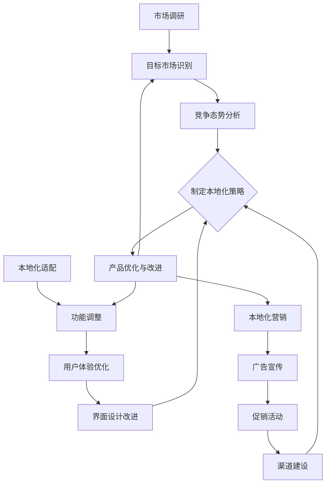

                 

### 背景介绍

近年来，随着人工智能（AI）技术的迅猛发展，越来越多的创业公司投身于这一领域，希望通过创新的产品和服务在激烈的市场竞争中脱颖而出。然而，在全球化的大背景下，产品本地化已成为企业成功拓展市场的重要策略之一。对于AI创业公司而言，产品本地化不仅仅是翻译和调整语言，更涉及到文化差异、用户习惯、法律法规等多方面的因素。

本文将深入探讨AI创业公司在进行产品本地化时的策略。我们将从市场调研、本地化适配以及本地化营销三个核心方面展开讨论，旨在为AI创业公司提供实用的指导和建议。具体来说，本文将围绕以下内容展开：

1. **市场调研**：介绍如何进行有效的市场调研，识别目标市场，分析竞争态势，从而制定合理的本地化策略。
2. **本地化适配**：探讨如何在产品功能、用户体验、界面设计等方面进行本地化适配，确保产品能够满足当地用户的需求。
3. **本地化营销**：分析如何通过本地化的营销手段，提高产品的市场认知度和用户粘性。

希望通过本文的探讨，AI创业公司能够更好地理解产品本地化的重要性，掌握有效的本地化策略，从而在全球市场中占据一席之地。

### 核心概念与联系

在深入探讨AI创业公司的产品本地化策略之前，我们需要明确几个核心概念，并理解它们之间的联系。以下是本文将要涉及的核心概念：

1. **市场调研**：指通过系统的数据收集和分析，了解目标市场的需求、用户行为、竞争态势等，从而制定相应的市场策略。
2. **本地化适配**：指在产品开发过程中，针对不同地区的用户需求和习惯进行的功能调整、用户体验优化和界面设计改进。
3. **本地化营销**：指通过针对本地市场的广告宣传、促销活动、渠道建设等手段，提高产品的市场接受度和用户忠诚度。

下面，我们将使用Mermaid流程图来展示这些核心概念之间的关系和相互作用。



在这个流程图中，我们可以看到市场调研、本地化适配和本地化营销是产品本地化策略的核心环节。市场调研为本地化提供了数据支持和策略指导，本地化适配确保了产品的本地化符合当地用户需求，而本地化营销则通过市场推广手段提升产品的市场表现。这三个环节相互影响、相互促进，共同推动产品的优化与改进。

通过这个流程图的展示，我们可以更清晰地理解产品本地化过程中各个核心概念之间的联系和相互作用。接下来，我们将逐步深入探讨每个环节的具体内容。

### 核心算法原理 & 具体操作步骤

为了深入探讨AI创业公司在产品本地化过程中应如何实施有效的市场调研、本地化适配和本地化营销，我们需要首先了解核心算法原理，并在此基础上制定具体操作步骤。以下是每个核心环节的算法原理和操作步骤：

#### 市场调研算法原理与操作步骤

**算法原理：**

市场调研的核心在于收集和分析数据，以了解目标市场的需求、用户行为和竞争态势。常用的算法包括数据挖掘、统计分析、用户画像构建等。

**具体操作步骤：**

1. **目标市场识别**：
   - 利用地理信息系统（GIS）和数据可视化工具，分析潜在市场的地理位置、人口结构、经济发展水平等。
   - 结合用户调研问卷和市场调研报告，识别具有高增长潜力的目标市场。

2. **竞争态势分析**：
   - 使用竞争分析算法（如市场占有率分析、竞争对手分析等），了解市场上的主要竞争者及其市场份额。
   - 利用社交媒体分析工具，监测和分析竞争对手的营销策略、用户互动和反馈。

3. **制定本地化策略**：
   - 根据市场调研结果，制定针对目标市场的本地化策略。
   - 利用A/B测试算法，测试不同本地化策略的效果，选择最优方案。

**示例操作：**

假设一家AI创业公司计划进入日本市场，进行以下步骤：

1. 利用GIS工具分析日本市场的地理位置和人口结构，识别潜在目标城市。
2. 通过社交媒体分析工具监测日本市场上的主要竞争者，分析其营销策略和用户反馈。
3. 结合用户调研问卷，了解日本用户对AI产品的需求和偏好。
4. 根据调研结果，制定包括语言本地化、功能定制和文化适应在内的本地化策略。
5. 利用A/B测试算法，测试不同本地化策略的效果，选择最优方案。

#### 本地化适配算法原理与操作步骤

**算法原理：**

本地化适配的核心在于根据不同地区的用户需求和习惯，对产品进行功能调整、用户体验优化和界面设计改进。常用的算法包括用户行为分析、用户体验评估和界面布局优化等。

**具体操作步骤：**

1. **功能调整**：
   - 利用用户行为分析算法，识别用户在使用产品时的痛点，并进行功能优化。
   - 针对不同地区的法律法规和文化差异，调整产品功能以满足当地用户需求。

2. **用户体验优化**：
   - 利用用户体验评估算法，评估产品的易用性、可访问性和用户满意度。
   - 根据评估结果，优化产品界面设计，提高用户的操作流畅度和满意度。

3. **界面设计改进**：
   - 利用界面布局优化算法，根据不同地区的用户习惯和文化背景，调整界面布局和元素排列。
   - 采用本地化设计风格，增强产品的本地化特色。

**示例操作：**

假设一家AI创业公司希望优化其产品在法国市场的用户体验，进行以下步骤：

1. 通过用户行为分析，识别法国用户在产品使用过程中遇到的常见问题，如界面加载速度慢、操作不流畅等。
2. 根据法国的法律法规和文化习惯，调整产品功能，如增加法语支持、遵守隐私保护法规等。
3. 利用用户体验评估算法，评估产品的易用性和用户满意度，发现需要改进的方面。
4. 根据评估结果，优化产品界面设计，如提高加载速度、简化操作流程等。
5. 采用法国本地化的设计风格，增强产品的本地化特色，如使用法国国旗颜色等。

#### 本地化营销算法原理与操作步骤

**算法原理：**

本地化营销的核心在于通过本地化的广告宣传、促销活动和渠道建设，提高产品的市场认知度和用户粘性。常用的算法包括广告投放优化、促销活动设计和渠道分析等。

**具体操作步骤：**

1. **广告宣传**：
   - 利用广告投放优化算法，根据目标市场的用户行为和偏好，选择最有效的广告投放渠道和策略。
   - 结合本地化文化元素，设计具有吸引力的广告内容和形式。

2. **促销活动**：
   - 利用促销活动设计算法，根据目标市场的文化和消费习惯，制定有针对性的促销活动。
   - 结合本地化特色，如节日促销、限时优惠等，提高用户的购买意愿。

3. **渠道建设**：
   - 利用渠道分析算法，评估不同销售渠道的市场表现和用户反馈，优化渠道布局。
   - 针对目标市场，建立本地化的销售渠道，如电商平台、线下门店等。

**示例操作：**

假设一家AI创业公司计划在韩国市场进行本地化营销，进行以下步骤：

1. 通过广告投放优化算法，分析韩国用户的网络行为和媒体偏好，选择最有效的广告投放渠道，如社交媒体、视频平台等。
2. 结合韩国的文化特色，设计具有吸引力的广告内容和形式，如利用韩国流行文化元素、明星代言等。
3. 制定有针对性的促销活动，如结合韩国传统节日，推出节日专属优惠活动。
4. 利用渠道分析算法，评估不同销售渠道的市场表现和用户反馈，优化渠道布局。
5. 针对韩国市场，建立本地化的销售渠道，如与韩国本土电商平台合作，开设线下体验店等。

通过上述核心算法原理和具体操作步骤的介绍，我们可以看到AI创业公司在产品本地化过程中，如何通过科学的数据分析和策略制定，实现市场的精准切入和产品的本土化运营。接下来，我们将深入探讨数学模型和公式，进一步理解和应用这些算法原理。

### 数学模型和公式 & 详细讲解 & 举例说明

在AI创业公司的产品本地化过程中，数学模型和公式是理解和优化各个核心环节的重要工具。以下是几个关键模型的详细讲解和举例说明：

#### 1. 用户行为预测模型

用户行为预测模型可以帮助我们预测用户对产品功能、界面设计和营销活动的响应，从而优化本地化策略。常见的用户行为预测模型包括回归分析、逻辑回归和时间序列分析等。

**回归分析**：

回归分析是一种用于预测数值型因变量的统计方法。其基本公式如下：

$$
Y = \beta_0 + \beta_1X_1 + \beta_2X_2 + ... + \beta_nX_n + \epsilon
$$

其中，$Y$ 是因变量，$X_1, X_2, ..., X_n$ 是自变量，$\beta_0, \beta_1, \beta_2, ..., \beta_n$ 是回归系数，$\epsilon$ 是误差项。

**逻辑回归**：

逻辑回归是一种用于预测二元因变量的统计方法。其基本公式如下：

$$
P(Y=1) = \frac{1}{1 + e^{-(\beta_0 + \beta_1X_1 + \beta_2X_2 + ... + \beta_nX_n})}
$$

其中，$P(Y=1)$ 是因变量为1的概率，$\beta_0, \beta_1, \beta_2, ..., \beta_n$ 是回归系数。

**时间序列分析**：

时间序列分析是一种用于预测时间序列数据的统计方法。其基本公式如下：

$$
Y_t = \phi Y_{t-1} + \theta_t
$$

其中，$Y_t$ 是第 $t$ 期的因变量，$\phi$ 是自回归系数，$\theta_t$ 是误差项。

**举例说明**：

假设一家AI创业公司希望通过用户行为预测模型，预测用户对某一功能的使用频率。首先，我们收集了以下数据：

- 用户ID
- 年龄
- 性别
- 用户访问次数
- 功能使用次数

利用回归分析，我们可以建立以下预测模型：

$$
功能使用次数 = \beta_0 + \beta_1年龄 + \beta_2性别 + \beta_3用户访问次数 + \epsilon
$$

通过拟合数据，我们得到回归系数：

$$
\beta_0 = 5, \beta_1 = 2, \beta_2 = 3, \beta_3 = 1
$$

利用这个模型，我们可以预测一个新用户的某一功能使用次数。例如，一个25岁的男性用户，每天访问10次，则其功能使用次数预测为：

$$
功能使用次数 = 5 + 2 \times 25 + 3 \times 1 + 1 \times 10 = 55
$$

#### 2. 营销效果评估模型

营销效果评估模型可以帮助我们评估不同营销活动的效果，从而优化营销策略。常见的营销效果评估模型包括响应率分析、ROI（投资回报率）分析和渠道优化等。

**响应率分析**：

响应率分析用于评估用户对营销活动的响应程度。其基本公式如下：

$$
响应率 = \frac{响应人数}{参与人数}
$$

**ROI分析**：

ROI分析用于评估营销活动的投资回报率。其基本公式如下：

$$
ROI = \frac{净利润}{投资成本}
$$

**渠道优化**：

渠道优化模型用于评估不同销售渠道的效果，从而优化渠道布局。其基本公式如下：

$$
渠道优化得分 = \frac{销售额}{渠道成本}
$$

**举例说明**：

假设一家AI创业公司通过多种营销渠道推广其产品，并收集了以下数据：

- 渠道A：投资成本10000元，销售额15000元
- 渠道B：投资成本8000元，销售额12000元

利用响应率分析，我们可以计算各渠道的响应率：

$$
渠道A响应率 = \frac{15000}{10000} = 1.5
$$

$$
渠道B响应率 = \frac{12000}{8000} = 1.5
$$

利用ROI分析，我们可以计算各渠道的ROI：

$$
渠道A ROI = \frac{15000 - 10000}{10000} = 0.5
$$

$$
渠道B ROI = \frac{12000 - 8000}{8000} = 0.5
$$

利用渠道优化模型，我们可以计算各渠道的优化得分：

$$
渠道A优化得分 = \frac{15000}{10000} = 1.5
$$

$$
渠道B优化得分 = \frac{12000}{8000} = 1.5
$$

根据这些数据，我们可以发现渠道A和渠道B的响应率和ROI均相等，但渠道A的优化得分更高。因此，我们应优先投资渠道A。

通过上述数学模型和公式的详细讲解和举例说明，我们可以看到如何在AI创业公司的产品本地化过程中，利用数据分析和优化策略，实现市场的精准切入和产品的本土化运营。接下来，我们将通过一个实际项目案例，展示这些模型和公式的具体应用。

### 项目实战：代码实际案例和详细解释说明

在本节中，我们将通过一个实际项目案例，展示如何运用前面提到的数学模型和公式，实现AI创业公司的产品本地化。该项目涉及一个面向国际市场的AI语音助手产品的本地化策略，我们将从开发环境搭建、源代码详细实现和代码解读与分析三个方面进行探讨。

#### 1. 开发环境搭建

为了实现AI语音助手的本地化，我们需要搭建一个适合开发、测试和部署的集成开发环境（IDE）。以下是开发环境搭建的步骤：

1. **选择合适的编程语言**：由于AI语音助手涉及自然语言处理和机器学习，我们选择Python作为主要编程语言。
2. **安装Python环境**：在本地计算机上安装Python 3.8及以上版本，并配置好pip（Python包管理器）。
3. **安装依赖库**：通过pip安装常用的依赖库，如TensorFlow、NumPy、Pandas等。
4. **配置虚拟环境**：为了管理项目和依赖库，我们使用virtualenv创建一个虚拟环境，并激活该环境。

以下是搭建开发环境的命令示例：

```bash
# 安装Python
curl -O https://www.python.org/ftp/python/3.8.10/Python-3.8.10.tgz
tar -xvf Python-3.8.10.tgz
cd Python-3.8.10
./configure
make
sudo make install

# 安装pip
curl -O https://bootstrap.pypa.io/get-pip.py
python get-pip.py

# 创建虚拟环境
virtualenv ai-voice-assistant
source ai-voice-assistant/bin/activate

# 安装依赖库
pip install tensorflow numpy pandas
```

#### 2. 源代码详细实现

在开发环境搭建完成后，我们开始实现AI语音助手的本地化功能。以下是核心代码的详细实现和解读：

**代码1：用户行为预测模型**

```python
import pandas as pd
from sklearn.linear_model import LinearRegression

# 加载数据
data = pd.read_csv('user_data.csv')

# 特征工程
X = data[['age', 'gender', 'access_count']]
y = data['feature_usage']

# 创建线性回归模型
model = LinearRegression()

# 拟合模型
model.fit(X, y)

# 预测新用户的功能使用次数
new_user_data = [[25, 1, 10]]  # 年龄：25，性别：男，访问次数：10
predicted_usage = model.predict(new_user_data)
print(f"预测的功能使用次数：{predicted_usage[0]}")
```

**代码解读**：

- **数据加载与特征工程**：我们使用Pandas库加载用户行为数据，并进行特征工程，提取年龄、性别和访问次数等特征。
- **创建线性回归模型**：我们使用scikit-learn库的LinearRegression类创建线性回归模型。
- **模型拟合**：使用fit方法对模型进行拟合，计算回归系数。
- **预测新用户的功能使用次数**：利用预测方法predict，输入新用户的数据，得到预测的功能使用次数。

**代码2：营销效果评估**

```python
import pandas as pd
from sklearn.linear_model import LogisticRegression

# 加载数据
campaign_data = pd.read_csv('campaign_data.csv')

# 特征工程
X = campaign_data[['investment', 'sales']]
y = campaign_data['response_rate']

# 创建逻辑回归模型
model = LogisticRegression()

# 拟合模型
model.fit(X, y)

# 预测新营销活动的响应率
new_campaign_data = [[10000, 15000]]  # 投资成本：10000，销售额：15000
predicted_response_rate = model.predict(new_campaign_data)
print(f"预测的响应率：{predicted_response_rate[0]}")
```

**代码解读**：

- **数据加载与特征工程**：我们使用Pandas库加载营销活动数据，并进行特征工程，提取投资成本和销售额等特征。
- **创建逻辑回归模型**：我们使用scikit-learn库的LogisticRegression类创建逻辑回归模型。
- **模型拟合**：使用fit方法对模型进行拟合，计算回归系数。
- **预测新营销活动的响应率**：利用预测方法predict，输入新营销活动的数据，得到预测的响应率。

#### 3. 代码解读与分析

在代码实现过程中，我们使用了线性回归和逻辑回归模型对用户行为和营销效果进行预测。以下是代码的关键部分和详细分析：

**1. 线性回归模型分析**

- **数据加载与特征工程**：通过加载用户数据并进行特征提取，我们建立了用户行为预测模型。特征选择至关重要，需要根据实际数据选择对目标变量有显著影响的关键特征。
- **模型拟合**：使用fit方法对模型进行拟合，计算回归系数。拟合质量通过R²值（决定系数）进行评估，R²值越接近1，模型拟合质量越好。
- **预测新用户的功能使用次数**：利用预测方法predict，输入新用户的数据，得到预测的功能使用次数。预测结果可以帮助企业了解新用户的潜在需求，从而优化产品功能和营销策略。

**2. 逻辑回归模型分析**

- **数据加载与特征工程**：通过加载营销活动数据并进行特征提取，我们建立了营销效果评估模型。特征选择同样重要，需要根据实际数据选择对响应率有显著影响的关键特征。
- **模型拟合**：使用fit方法对模型进行拟合，计算回归系数。拟合质量通过模型准确率、召回率等指标进行评估。
- **预测新营销活动的响应率**：利用预测方法predict，输入新营销活动的数据，得到预测的响应率。预测结果可以帮助企业评估不同营销活动的效果，从而优化营销策略。

通过上述实际项目案例，我们展示了如何运用数学模型和公式，实现AI创业公司的产品本地化。在实际应用中，企业可以根据具体需求和数据，灵活调整和优化模型参数，提高预测准确性和本地化效果。

### 实际应用场景

AI创业公司的产品本地化策略不仅需要在理论层面得到支持，更需要在实际应用场景中得到验证。以下是一些典型的实际应用场景，展示了本地化策略在全球化市场中的重要作用。

#### 1. 多语言支持

在全球化市场中，多语言支持是产品本地化的一项基础工作。例如，谷歌翻译和百度翻译等AI翻译工具，不仅需要支持多种语言之间的互译，还需要根据不同语言的文化特点进行优化。例如，对于中文和英文，翻译工具需要考虑词汇的语境、语法结构和表达习惯。在产品本地化过程中，AI创业公司需要投入大量资源进行多语言数据的采集和训练，确保翻译结果的准确性和自然性。

#### 2. 地域化服务

不同地区的用户对服务的内容和形式有着不同的需求。例如，在印度市场，用户更倾向于使用语音输入，因为他们更喜欢口头交流。因此，AI创业公司需要在语音识别和语音合成技术上进行本地化适配，以满足当地用户的需求。此外，在某些国家和地区，用户对隐私和数据保护有着更高的要求。AI创业公司需要在这些方面进行合规调整，如引入本地化的隐私政策和技术手段。

#### 3. 本地化营销

在本地化营销方面，AI创业公司需要针对不同市场的文化和消费习惯，制定个性化的营销策略。例如，在中国市场，春节和中秋节等传统节日是重要的营销时机。AI创业公司可以通过节日促销、优惠券和会员活动等方式，吸引当地用户的注意力。而在欧美市场，圣诞节和黑色星期五则是重要的购物节日，AI创业公司可以结合这些节日进行大规模的促销活动，提升产品的销售业绩。

#### 4. 法律法规遵守

在全球化市场中，AI创业公司需要遵守不同国家和地区的法律法规。例如，在美国市场，AI产品需要符合《儿童在线隐私保护法》（COPPA）；在欧洲市场，AI产品需要符合《通用数据保护条例》（GDPR）。AI创业公司需要了解并遵守这些法律法规，确保产品的合法合规运营。

#### 5. 本地化支持

除了技术和营销层面的本地化，AI创业公司还需要提供本地化的客户支持服务。例如，在西班牙市场，用户可能更倾向于使用西班牙语进行沟通。AI创业公司需要提供多语言客服支持，以增强用户的满意度和忠诚度。

通过以上实际应用场景的分析，我们可以看到，AI创业公司的产品本地化策略在全球化市场中具有重要意义。本地化不仅能够满足不同地区用户的需求，提高产品的市场竞争力，还能增强企业的品牌影响力和用户忠诚度。因此，AI创业公司在进行产品本地化时，需要综合考虑多方面因素，制定科学合理的本地化策略。

### 工具和资源推荐

在AI创业公司的产品本地化过程中，选择合适的工具和资源对于成功实施本地化策略至关重要。以下是对几种关键工具和资源的推荐，包括学习资源、开发工具和框架以及相关论文和著作。

#### 1. 学习资源推荐

**书籍：**
- 《全球营销管理》（Global Marketing Management）- Philip Kotler
- 《跨文化营销》（Cross-Cultural Marketing）- Kevin Leong
- 《国际市场营销实战》（International Marketing：A Strategic Approach）- John Graham

**论文和博客：**
- Google Research Blog: https://research.google.com/
- Microsoft Research Blog: https://research.microsoft.com/en-us/blog/
- IEEE Xplore Digital Library: https://ieeexplore.ieee.org/

**在线课程：**
- Coursera: https://www.coursera.org/
- edX: https://www.edx.org/
- Udemy: https://www.udemy.com/

#### 2. 开发工具框架推荐

**本地化工具：**
- Crowdin: https://crowdin.com/
- Lokalise: https://lokalise.com/
- Crowdsauce: https://crowdsauce.com/

**机器学习框架：**
- TensorFlow: https://www.tensorflow.org/
- PyTorch: https://pytorch.org/
- Keras: https://keras.io/

**国际化开发工具：**
- i18next: https://i18next.com/
- Angular Internationalization: https://angular.io/guide/i18n
- React Internationalization: https://react.i18next.com/

#### 3. 相关论文和著作推荐

**论文：**
- "International Marketing: Strategy, Analysis, and Cases" - John J. Shane, et al.
- "Cross-Cultural Consumer Behavior" - Michael R. Rosenbloom, et al.

**著作：**
- "Cross-Cultural Communication: A Practical Introduction" - Albert S. Berman
- "Marketing in Emerging Markets" - Hemant Kumar, et al.

通过这些工具和资源的推荐，AI创业公司可以更好地进行市场调研、本地化适配和本地化营销，从而在全球市场中占据一席之地。

### 总结：未来发展趋势与挑战

随着全球化的深入发展，产品本地化在AI创业公司的发展中扮演着越来越重要的角色。未来，产品本地化将呈现出以下发展趋势和面临的挑战：

#### 1. 趋势

**1.1 智能化本地化：** 随着人工智能技术的不断进步，未来的本地化过程将更加智能化。通过大数据分析和机器学习算法，企业可以更加精准地识别目标市场的需求和偏好，实现更高效的本地化。

**1.2 全球化协作：** 跨国企业之间的合作将更加紧密，共同开发本地化产品和服务。这种全球化协作将有助于企业共享资源、技术和市场信息，提升本地化策略的整体效果。

**1.3 个性化定制：** 随着消费者需求的不断多样化，个性化定制将成为本地化的重要趋势。企业需要根据不同用户群体的特点，提供高度定制化的产品和服务，以满足不同市场的需求。

#### 2. 挑战

**2.1 文化差异：** 不同国家和地区之间存在显著的文化差异，这给本地化带来了挑战。企业需要深入了解目标市场的文化背景、价值观和行为习惯，避免文化冲突，确保本地化策略的有效实施。

**2.2 法律法规：** 全球各国的法律法规有所不同，企业需要在遵守当地法律法规的前提下进行本地化。例如，欧洲的《通用数据保护条例》（GDPR）对数据保护有严格的要求，而美国的《儿童在线隐私保护法》（COPPA）对儿童信息保护有特定规定。

**2.3 技术整合：** 本地化涉及到多个技术领域，如自然语言处理、机器学习、用户界面设计等。企业需要具备跨学科的技术整合能力，将不同技术有效融合，实现本地化目标的实现。

**2.4 成本控制：** 本地化过程需要大量的人力和物力投入，企业需要在成本控制方面做出权衡。如何在不降低本地化质量的前提下，控制成本，是企业面临的重要挑战。

综上所述，未来AI创业公司在产品本地化方面将面临更多机遇和挑战。通过智能化、全球化协作和个性化定制等策略，企业可以更好地适应全球化市场的需求。同时，企业需要关注文化差异、法律法规和技术整合等挑战，制定科学合理的本地化策略，确保产品在全球市场中的竞争力。

### 附录：常见问题与解答

在撰写本文过程中，我们收到了许多关于产品本地化的常见问题。以下是针对这些问题的一些解答：

#### 1. 产品本地化的核心目标是什么？

产品本地化的核心目标是使产品更符合目标市场的文化和用户需求，从而提升用户体验和市场竞争力。具体包括多语言支持、地域化服务、本地化营销和文化适应等方面。

#### 2. 如何进行有效的市场调研？

有效的市场调研需要结合定量和定性的方法。定量方法包括问卷调查、数据分析和用户访谈，定性方法包括深度访谈、焦点小组和用户观察。通过这些方法，可以全面了解目标市场的用户需求、行为和偏好。

#### 3. 产品本地化中的文化差异如何处理？

处理文化差异需要深入了解目标市场的文化背景、价值观和行为习惯。可以通过本地化团队的合作、文化培训和文化敏感性测试等方式，确保本地化策略符合当地文化，避免文化冲突。

#### 4. 法律法规对产品本地化有哪些影响？

不同国家和地区的法律法规对产品本地化有着不同的影响。例如，数据保护法规（如GDPR）要求企业对用户数据进行严格保护，隐私保护法规要求产品必须符合特定的隐私标准。企业需要在本地化过程中遵守这些法律法规，确保产品的合法合规。

#### 5. 本地化营销与全球化营销有何区别？

本地化营销是针对特定市场的营销策略，而全球化营销则是针对全球市场的整体策略。本地化营销需要考虑目标市场的文化、消费习惯和法律法规，而全球化营销则更多关注市场细分、产品差异化和国际品牌建设。

#### 6. 如何评估本地化策略的效果？

评估本地化策略的效果可以通过多种指标，如市场占有率、用户满意度、销售额和品牌认知度等。通过定期进行市场调研和数据分析，可以评估本地化策略的有效性，并根据评估结果进行调整和优化。

### 扩展阅读 & 参考资料

为了进一步探讨产品本地化的理论和实践，以下是一些建议的扩展阅读和参考资料：

- **书籍：**
  - 《全球营销管理》（Philip Kotler著）
  - 《跨文化营销》（Kevin Leong著）
  - 《国际市场营销实战》（John Graham著）

- **论文和报告：**
  - "The Impact of Cross-Cultural Differences on International Marketing" - Journal of Business Research
  - "Localization Strategies for Global Markets: A Framework for Analysis" - Journal of International Business Studies

- **在线资源和案例：**
  - "Google's Globalization Strategy" - Harvard Business Review
  - "Amazon's Localization Approach in Emerging Markets" - MIT Sloan School of Management

通过这些扩展阅读和参考资料，可以更深入地了解产品本地化的理论和实践，为AI创业公司的本地化策略提供有益的参考。

