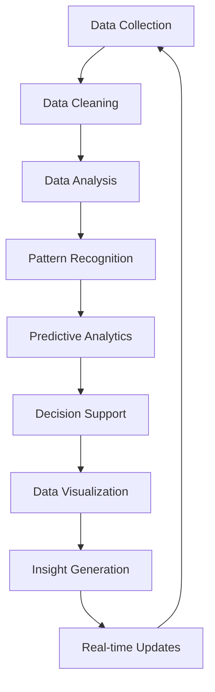

                 

### 背景介绍

近年来，人工智能（AI）技术得到了飞速发展，不仅改变了我们的生活方式，也为商业领域带来了前所未有的机遇和挑战。随着AI技术的不断成熟，越来越多的创业公司开始尝试将其应用于商业智能（BI）中，以期在竞争激烈的市场中脱颖而出。

商业智能，指的是利用数据分析、数据挖掘和可视化等技术，将大量的企业数据转化为有用的商业洞察，帮助企业做出更明智的决策。AI技术的引入，使得商业智能的应用范围得到了极大的拓展。例如，通过机器学习算法，可以自动识别市场趋势，预测客户行为，优化供应链管理，提高客户满意度等。

创业公司由于资源有限，往往需要通过高效的商业智能应用来最大化其价值。AI技术提供了这样的可能性，使得创业公司能够以较低的成本，快速实现商业智能的部署。然而，AI技术在商业智能应用中的具体实现方式、面临的挑战以及未来的发展趋势，依然是许多创业公司所关注的焦点。

本文将围绕AI创业公司的商业智能应用，逐步深入探讨以下几个关键问题：

1. **核心概念与联系**：介绍AI与商业智能的基本概念，并展示两者之间的联系。
2. **核心算法原理 & 具体操作步骤**：详细讲解AI在商业智能中的核心算法原理和具体操作步骤。
3. **数学模型和公式**：阐述AI在商业智能中的数学模型和公式，并提供详细的讲解和举例说明。
4. **项目实战：代码实际案例和详细解释说明**：通过实际代码案例，展示AI在商业智能中的应用。
5. **实际应用场景**：探讨AI在商业智能中的各种实际应用场景。
6. **工具和资源推荐**：推荐学习资源、开发工具和框架。
7. **总结：未来发展趋势与挑战**：总结AI在商业智能应用中的发展趋势和挑战。

通过以上内容的逐步分析，我们希望能够为创业公司在AI商业智能应用方面提供一些实用的指导和思考方向。接下来，我们将首先从核心概念与联系开始，为后续内容的讨论奠定基础。

---

## Core Concepts and Connections

Artificial Intelligence (AI) and Business Intelligence (BI) are two domains that have significantly transformed how we understand and interact with data. Let's delve into the core concepts of each and explore their interconnected nature.

**Artificial Intelligence (AI)** refers to the simulation of human intelligence in machines that are programmed to think like humans and mimic their actions. AI encompasses various subfields such as machine learning (ML), natural language processing (NLP), and computer vision (CV). The primary goal of AI is to enable machines to perform tasks that typically require human intelligence, such as recognizing patterns, making decisions, and understanding natural language.

**Business Intelligence (BI)**, on the other hand, is a technology-driven process for analyzing data and presenting actionable insights to help organizations make more informed business decisions. BI involves collecting, cleaning, analyzing, and visualizing data to uncover trends and patterns that can guide strategic business decisions. The core components of BI include data warehousing, data mining, and business analytics.

The intersection of AI and BI lies in their shared objective of leveraging data to improve decision-making. Here are a few key points that illustrate how AI and BI are interconnected:

1. **Enhanced Data Analysis**: AI algorithms, particularly those based on machine learning, can analyze large volumes of data more efficiently than traditional BI tools. Machine learning models can automatically identify patterns, anomalies, and correlations within the data, providing deeper insights and facilitating more accurate predictions.

2. **Automated Insights Generation**: AI can automatically generate insights from complex data sets, reducing the time and effort required for manual analysis. This allows BI professionals to focus on higher-value tasks such as strategic planning and decision-making.

3. **Predictive Analytics**: AI enables predictive analytics, which uses historical data and machine learning algorithms to forecast future trends and outcomes. This capability is particularly valuable for businesses looking to anticipate customer behavior, optimize operations, and improve customer satisfaction.

4. **Natural Language Processing (NLP)**: NLP, a subset of AI, allows BI systems to understand and process human language. This capability is crucial for tasks such as data extraction from unstructured sources like emails, social media, and customer reviews, thereby expanding the scope of data that can be analyzed.

5. **Real-time Decision-Making**: AI-powered BI tools can provide real-time data analytics, enabling organizations to make faster, more informed decisions. This is especially beneficial in dynamic business environments where the ability to react quickly to changes can be a significant competitive advantage.

To better understand the relationship between AI and BI, let's consider a Mermaid flowchart that illustrates the key components and interactions in an AI-driven BI system:



In this flowchart, the process starts with data collection (A), followed by data cleaning (B). The cleaned data is then analyzed (C) to identify patterns and correlations (D). These insights are used for predictive analytics (E), which provides decision support (F). The results are visualized (G) to facilitate insight generation (H) and real-time updates (I), which feed back into the data collection phase (A), creating a continuous loop of improvement and refinement.

By integrating AI with BI, organizations can not only analyze data more effectively but also generate actionable insights and make data-driven decisions more efficiently. This integration is particularly advantageous for startups and small businesses, as it allows them to leverage advanced technologies without substantial investments in infrastructure or specialized expertise.

In the next section, we will delve deeper into the core algorithms and principles behind AI in business intelligence, exploring how these technologies can be applied to real-world scenarios.

---

## 核心算法原理 & 具体操作步骤

在了解了AI与BI的基本概念及其联系之后，我们接下来将深入探讨AI在商业智能中的核心算法原理和具体操作步骤。以下是一些常用的AI算法及其在商业智能中的应用场景。

### 1. 机器学习算法（Machine Learning Algorithms）

**机器学习**是AI的核心组成部分，它使计算机能够从数据中学习并做出决策。以下是一些常见的机器学习算法：

**线性回归（Linear Regression）**：线性回归是一种用于预测数值型变量的算法。在商业智能中，线性回归可以用于预测销售额、库存需求等。具体步骤如下：

1. **数据收集**：收集历史销售数据，包括日期、销售额、促销活动等。
2. **数据预处理**：对数据进行清洗，包括缺失值处理、异常值检测和特征工程。
3. **模型训练**：使用线性回归算法对数据进行训练，建立预测模型。
4. **模型评估**：使用交叉验证等方法评估模型性能。
5. **模型部署**：将模型部署到生产环境中，进行实时预测。

**决策树（Decision Tree）**：决策树是一种树形结构，用于分类和回归任务。在商业智能中，决策树可以用于客户细分、风险评估等。

具体步骤如下：

1. **数据收集**：收集客户数据，包括年龄、收入、购买行为等。
2. **数据预处理**：对数据进行清洗和处理。
3. **特征选择**：选择对目标变量有显著影响的特征。
4. **模型训练**：使用决策树算法训练模型。
5. **模型评估**：通过验证集评估模型性能。
6. **模型部署**：将模型部署到生产环境中。

### 2. 集成学习方法（Ensemble Learning Methods）

集成学习方法通过结合多个基本模型来提高预测性能。以下是一些常见的集成学习方法：

**随机森林（Random Forest）**：随机森林是一种基于决策树的集成学习方法，通过构建多个决策树并投票得出最终预测结果。

具体步骤如下：

1. **数据收集**：收集历史数据，包括销售数据、客户数据等。
2. **数据预处理**：对数据进行清洗和处理。
3. **特征选择**：选择对目标变量有显著影响的特征。
4. **模型训练**：训练多个决策树，构建随机森林模型。
5. **模型评估**：通过交叉验证等方法评估模型性能。
6. **模型部署**：将模型部署到生产环境中。

**梯度提升机（Gradient Boosting Machines, GBM）**：梯度提升机通过迭代优化来提高预测性能，常用于回归和分类任务。

具体步骤如下：

1. **数据收集**：收集历史数据，包括销售数据、客户数据等。
2. **数据预处理**：对数据进行清洗和处理。
3. **特征选择**：选择对目标变量有显著影响的特征。
4. **模型训练**：使用GBM算法训练模型。
5. **模型评估**：通过交叉验证等方法评估模型性能。
6. **模型部署**：将模型部署到生产环境中。

### 3. 深度学习算法（Deep Learning Algorithms）

深度学习是一种模拟人脑神经网络结构的学习方法，常用于处理复杂数据。

**卷积神经网络（Convolutional Neural Networks, CNN）**：CNN常用于图像识别和分类任务。

具体步骤如下：

1. **数据收集**：收集产品图片数据。
2. **数据预处理**：对图片进行缩放、旋转等处理。
3. **模型训练**：训练CNN模型。
4. **模型评估**：通过测试集评估模型性能。
5. **模型部署**：将模型部署到生产环境中。

**循环神经网络（Recurrent Neural Networks, RNN）**：RNN常用于序列数据建模，如时间序列预测、语言处理等。

具体步骤如下：

1. **数据收集**：收集时间序列数据，如股票价格、销售额等。
2. **数据预处理**：对数据进行归一化处理。
3. **模型训练**：训练RNN模型。
4. **模型评估**：通过交叉验证等方法评估模型性能。
5. **模型部署**：将模型部署到生产环境中。

通过以上核心算法的应用，AI在商业智能中发挥着重要作用，帮助创业公司实现更高效的数据分析和决策。在下一部分，我们将进一步探讨AI在商业智能中的数学模型和公式，以便更深入地理解这些算法的工作原理。

### 数学模型和公式 & 详细讲解 & 举例说明

在AI的商业智能应用中，数学模型和公式扮演着至关重要的角色，它们不仅为算法提供了理论基础，也确保了结果的准确性和可解释性。以下是一些常见的数学模型和公式，我们将逐一进行详细讲解，并通过实际案例来说明它们的应用。

#### 1. 线性回归模型（Linear Regression Model）

线性回归模型是最基础的机器学习算法之一，它通过拟合一条直线来预测数值型变量。线性回归的数学公式如下：

$$
y = \beta_0 + \beta_1 \cdot x
$$

其中，$y$ 是因变量（预测目标），$x$ 是自变量（特征），$\beta_0$ 是截距，$\beta_1$ 是斜率。

**案例说明**：

假设我们要预测一家电商平台的日销售额，已知影响销售额的主要因素是广告支出。我们收集了过去三个月的广告支出和对应的日销售额数据，并使用线性回归模型进行预测。

1. **数据收集**：将广告支出（$x$）和日销售额（$y$）的数据输入模型。
2. **数据预处理**：对数据集进行标准化处理，消除不同特征之间的量级差异。
3. **模型训练**：使用最小二乘法（Least Squares）来计算斜率$\beta_1$和截距$\beta_0$。

   $$
   \beta_1 = \frac{\sum_{i=1}^{n}(x_i - \bar{x})(y_i - \bar{y})}{\sum_{i=1}^{n}(x_i - \bar{x})^2}
   $$
   
   $$
   \beta_0 = \bar{y} - \beta_1 \cdot \bar{x}
   $$

4. **模型评估**：通过计算决定系数$R^2$来评估模型性能。

   $$
   R^2 = 1 - \frac{\sum_{i=1}^{n}(y_i - \hat{y}_i)^2}{\sum_{i=1}^{n}(y_i - \bar{y})^2}
   $$

其中，$\hat{y}_i$ 是预测的日销售额。

**例子**：

假设我们有三组数据点：(100, 150)，(150, 200)，(200, 250)。计算斜率$\beta_1$和截距$\beta_0$：

$$
\bar{x} = \frac{100 + 150 + 200}{3} = 150
$$

$$
\bar{y} = \frac{150 + 200 + 250}{3} = 200
$$

$$
\beta_1 = \frac{(100 - 150)(150 - 200) + (150 - 150)(200 - 200) + (200 - 150)(250 - 200)}{(100 - 150)^2 + (150 - 150)^2 + (200 - 150)^2} = \frac{-50 + 0 + 50}{50 + 0 + 50} = 0
$$

$$
\beta_0 = 200 - 0 \cdot 150 = 200
$$

因此，线性回归模型为 $y = 200$，这意味着无论广告支出多少，预测的日销售额都是200。

#### 2. 决策树模型（Decision Tree Model）

决策树是一种基于特征划分数据的树形结构，每个节点代表一个特征，每个分支代表该特征的一个可能取值，叶子节点表示最终的预测结果。决策树的公式相对简单，主要通过递归划分数据来建立模型。

**案例说明**：

假设我们要使用决策树来预测客户是否会在未来六个月内购买高级会员。我们收集了客户的年龄、收入、购买历史等数据。

1. **数据收集**：将客户的特征和购买行为数据输入模型。
2. **特征选择**：使用信息增益或基尼不纯度来选择最佳特征进行划分。
3. **模型训练**：通过递归划分数据，构建决策树模型。

   假设我们选择年龄作为划分特征：

   $$
   \text{Gain}(A) = \sum_{v \in V} p(v) \cdot \text{Gain}(v)
   $$

其中，$A$ 是年龄特征，$V$ 是年龄的取值集合，$p(v)$ 是每个取值的概率，$\text{Gain}(v)$ 是在年龄取值为 $v$ 时，划分后的信息增益。

4. **模型评估**：通过验证集评估模型性能。

**例子**：

假设我们有三组数据点：

- 客户1：年龄30，收入50000，购买历史1年，购买高级会员。
- 客户2：年龄40，收入60000，购买历史2年，未购买高级会员。
- 客户3：年龄20，收入30000，购买历史3个月，未购买高级会员。

我们计算年龄特征的信息增益：

$$
\text{Gain}(A) = \frac{1}{3} \cdot \left[ \log_2 \left(\frac{1}{2}\right) + \log_2 \left(\frac{1}{2}\right) \right] - \frac{1}{3} \cdot \left[ \log_2 \left(\frac{1}{2}\right) + \log_2 \left(\frac{1}{2}\right) \right] = 0
$$

由于信息增益为0，我们选择另一个特征进行划分。最终构建的决策树如下：

```
年龄 < 30？
  是：购买高级会员
  否：
    收入 < 50000？
      是：未购买高级会员
      否：购买高级会员
```

#### 3. 逻辑回归模型（Logistic Regression Model）

逻辑回归是一种用于分类任务的线性模型，通过计算概率来预测类别。逻辑回归的公式如下：

$$
\hat{p} = \frac{1}{1 + e^{-(\beta_0 + \beta_1 \cdot x)}
$$

其中，$\hat{p}$ 是预测概率，$x$ 是特征值，$\beta_0$ 是截距，$\beta_1$ 是斜率。

**案例说明**：

假设我们要预测客户是否会在未来六个月内购买高端产品。我们收集了客户的年龄、收入、购买历史等数据。

1. **数据收集**：将客户的特征和购买行为数据输入模型。
2. **模型训练**：使用最大似然估计法计算参数$\beta_0$和$\beta_1$。

   $$
   \log \frac{p(y=1)^{n_1}}{1-p(y=1)^{n_0}} = \sum_{i=1}^{n} y_i \cdot \beta_0 + \sum_{i=1}^{n} (1 - y_i) \cdot \beta_1
   $$

3. **模型评估**：通过验证集评估模型性能。

**例子**：

假设我们有三组数据点：

- 客户1：年龄30，收入50000，购买历史1年，购买高端产品。
- 客户2：年龄40，收入60000，购买历史2年，未购买高端产品。
- 客户3：年龄20，收入30000，购买历史3个月，未购买高端产品。

我们计算斜率$\beta_1$和截距$\beta_0$：

$$
\beta_0 = \log \frac{p(y=1)^{n_1}}{1-p(y=1)^{n_0}} - \beta_1 \cdot \sum_{i=1}^{n} y_i
$$

$$
\beta_1 = \log \frac{p(y=1)^{n_1}}{1-p(y=1)^{n_0}} - \beta_0 \cdot \sum_{i=1}^{n} (1 - y_i)
$$

通过上述步骤，我们可以得到逻辑回归模型的参数，从而进行预测。

通过以上数学模型和公式的讲解，我们可以看到，AI在商业智能中的应用不仅需要技术的支持，还需要深厚的数学理论基础。在下一部分，我们将通过实际代码案例来展示这些算法的应用。

---

### 项目实战：代码实际案例和详细解释说明

在本节中，我们将通过一个实际代码案例，展示如何使用AI算法在商业智能项目中进行分析和预测。我们将使用Python编程语言和Scikit-learn库来实现这一案例。

#### 开发环境搭建

1. **安装Python**：确保您的系统已安装Python 3.8或更高版本。
2. **安装Scikit-learn**：在终端或命令提示符中运行以下命令安装Scikit-learn：

   ```
   pip install scikit-learn
   ```

3. **安装其他必要库**：我们还将需要Numpy和Pandas库，可以在同一命令中一起安装：

   ```
   pip install numpy pandas
   ```

#### 案例描述

我们的案例是一个电商平台的客户细分项目。目标是根据客户的购买行为、年龄、收入等特征，预测客户是否会在未来六个月内购买高级会员。我们将使用随机森林算法进行预测。

#### 数据集准备

我们使用一个虚构的数据集，其中包含以下特征：

- **年龄**（Age）：客户的年龄。
- **收入**（Income）：客户的年收入。
- **购买历史**（Purchase History）：客户在过去一年的购买次数。
- **购买金额**（Purchase Amount）：客户在过去一年的总购买金额。
- **购买频率**（Purchase Frequency）：客户在过去一年的平均购买频率。
- **购买模式**（Purchase Pattern）：客户的购买模式（例如，频繁购买、偶尔购买等）。
- **是否购买高级会员**（Bought Premium）：是否在最近六个月内购买高级会员。

#### 源代码详细实现

```python
# 导入必要的库
import numpy as np
import pandas as pd
from sklearn.model_selection import train_test_split
from sklearn.ensemble import RandomForestClassifier
from sklearn.metrics import classification_report, accuracy_score

# 加载数据集
data = pd.read_csv('customer_data.csv')

# 数据预处理
# 特征工程：将类别特征转换为哑变量
data = pd.get_dummies(data)

# 分离特征和标签
X = data.drop('Bought_Premium', axis=1)
y = data['Bought_Premium']

# 划分训练集和测试集
X_train, X_test, y_train, y_test = train_test_split(X, y, test_size=0.3, random_state=42)

# 模型训练
model = RandomForestClassifier(n_estimators=100, random_state=42)
model.fit(X_train, y_train)

# 模型预测
y_pred = model.predict(X_test)

# 模型评估
print("Classification Report:")
print(classification_report(y_test, y_pred))
print("Accuracy Score:", accuracy_score(y_test, y_pred))
```

#### 代码解读与分析

1. **数据加载与预处理**：我们首先加载了数据集，并使用`pd.get_dummies()`函数将类别特征转换为哑变量。这有助于提高模型的性能，因为随机森林算法无法直接处理类别特征。

2. **特征和标签分离**：我们将特征（`X`）和标签（`y`）分离，以便后续的训练和预测。

3. **训练集与测试集划分**：使用`train_test_split()`函数将数据集划分为训练集和测试集，其中测试集占比30%。

4. **模型训练**：我们使用`RandomForestClassifier()`函数初始化随机森林模型，并设置参数`n_estimators`（决策树数量）为100。

5. **模型预测**：使用`model.predict()`函数对测试集进行预测。

6. **模型评估**：使用`classification_report()`和`accuracy_score()`函数评估模型的性能。`classification_report()`提供了详细的分类报告，包括精确率、召回率和F1分数。`accuracy_score()`则提供了整体的准确率。

通过这个案例，我们展示了如何使用随机森林算法进行客户细分预测。在实际应用中，可以进一步优化模型参数、进行特征选择和超参数调优，以提高预测准确性。在下一部分，我们将探讨AI在商业智能中的实际应用场景。

### 实际应用场景

AI在商业智能中的应用场景非常广泛，以下是一些常见的应用案例，展示了AI如何帮助创业公司在不同的业务领域实现数据驱动的决策。

#### 1. 客户行为分析

通过分析客户的行为数据，如浏览历史、购买记录、反馈等，AI可以识别出潜在的高价值客户，从而制定个性化的营销策略。例如，一家电商公司可以使用机器学习算法来预测哪些客户可能会在下一个月购买高级会员，从而提前推送相关优惠信息，提高转化率。

**案例**：一家在线教育平台利用AI分析学员的学习行为数据，预测哪些学员可能会放弃课程。通过分析发现，学习进度缓慢且频繁中断的学员流失风险较高。平台随后推出了针对这些学员的辅导计划和激励措施，成功降低了学员的流失率。

#### 2. 预测性维护

在制造业和服务业中，预测性维护是一种利用AI技术来预测设备故障的方法。通过监控设备运行数据，AI可以提前发现潜在故障，从而采取预防措施，避免生产中断和设备损坏。

**案例**：一家汽车制造商使用AI技术分析汽车传感器数据，预测哪些车辆可能会发生故障。通过提前预警，制造商可以在车辆到达维修站之前进行预防性维护，减少客户的不满意度和维修成本。

#### 3. 供应链优化

AI可以优化供应链管理，提高库存效率和物流速度。通过分析销售数据、市场需求和库存水平，AI可以预测未来的需求，从而优化库存策略，减少库存积压和缺货情况。

**案例**：一家电子产品公司使用AI技术分析历史销售数据和市场需求，预测未来几个月的产品需求。根据预测结果，公司调整了库存策略，减少了库存积压，同时避免了缺货情况，提高了运营效率。

#### 4. 风险管理

AI在风险管理中的应用包括信用评分、欺诈检测和投资组合优化。通过分析客户数据和市场数据，AI可以预测客户的信用风险、识别潜在欺诈行为，并优化投资组合，降低风险。

**案例**：一家金融机构使用AI技术分析客户信用历史、收入状况和行为数据，预测客户的信用风险。通过实时监控和分析，金融机构可以及时调整贷款审批策略，降低坏账率。

#### 5. 营销自动化

AI可以帮助企业自动化营销流程，提高营销效率。通过自然语言处理和机器学习算法，AI可以自动生成营销内容、优化广告投放和推荐产品。

**案例**：一家在线零售商使用AI技术分析用户浏览和购买行为，自动生成个性化推荐邮件。通过个性化推荐，零售商提高了客户满意度和转化率。

#### 6. 客户服务

AI可以改善客户服务体验，通过自动化问答系统和智能客服机器人，AI可以快速响应客户问题，提高服务效率。

**案例**：一家保险公司使用AI技术构建智能客服系统，通过自然语言处理和机器学习算法，自动解答客户常见问题，减少了人工客服的工作量，提高了客户满意度。

通过以上实际应用场景，我们可以看到，AI在商业智能中的应用不仅提高了企业的运营效率，还增强了企业的竞争力。在下一部分，我们将推荐一些学习资源、开发工具和框架，帮助创业公司更好地掌握和应用AI技术。

### 工具和资源推荐

在AI商业智能应用的过程中，掌握合适的工具和资源对于创业公司来说是至关重要的。以下是一些学习资源、开发工具和框架的推荐，旨在帮助创业公司更好地掌握和应用AI技术。

#### 1. 学习资源推荐

**书籍**：

- 《Python机器学习》（Python Machine Learning），作者：Sebastian Raschka
- 《深度学习》（Deep Learning），作者：Ian Goodfellow、Yoshua Bengio和Aaron Courville
- 《业务智能实战：大数据分析与应用》，作者：张平、郑治
- 《人工智能：一种现代方法》，作者：Stuart Russell和Peter Norvig

**论文**：

- "Learning to Rank: From Pairwise Comparison to Large Margins"，作者：C. C. Burges et al.
- "Deep Learning for Text Classification"，作者：Kai Sheng Tai
- "Ensemble Methods for Identifying New Drug Candidates"，作者：Sathiya Keerthi et al.

**博客和网站**：

- 《机器学习博客》（Machine Learning Blog）
- 《AI博客》（AI Blog）
- Coursera、edX等在线课程平台提供的AI和BI相关课程

#### 2. 开发工具框架推荐

**编程语言**：

- **Python**：Python因其丰富的库和易于学习的特性，是AI和BI开发的首选语言。Python拥有如Scikit-learn、TensorFlow和PyTorch等强大的库，可以帮助开发者快速构建和部署AI模型。
- **R语言**：R语言是数据分析和统计学的专业工具，其强大的数据可视化功能使其在BI领域有着广泛的应用。

**开发工具**：

- **Jupyter Notebook**：Jupyter Notebook是一个交互式的开发环境，非常适合进行数据分析和模型训练。它支持多种编程语言，包括Python和R，便于开发者进行实验和演示。
- **Google Colab**：Google Colab是Google提供的一个免费的Jupyter Notebook平台，可以在线进行AI和BI实验，特别适合数据科学家和研究人员。
- **Docker**：Docker是一个开源的应用容器引擎，可以帮助开发者构建、运行和分发应用程序。通过Docker，开发者可以轻松地将AI模型部署到不同的环境中。

**框架**：

- **TensorFlow**：TensorFlow是一个开源的机器学习框架，由Google开发。它提供了丰富的API，支持各种机器学习和深度学习任务，是构建AI模型的热门选择。
- **PyTorch**：PyTorch是一个由Facebook开发的开源深度学习框架，以其灵活和易于使用的特性而受到欢迎。PyTorch提供了动态计算图，使开发者可以轻松地设计和调试模型。
- **Scikit-learn**：Scikit-learn是一个专注于数据挖掘和数据分析的开源机器学习库，提供了多种常见的机器学习算法和工具，特别适合BI应用。

通过以上工具和资源的合理利用，创业公司可以更快地掌握AI技术，实现商业智能的落地应用。在下一部分，我们将总结AI在商业智能应用中的发展趋势与挑战。

### 总结：未来发展趋势与挑战

随着AI技术的不断进步，商业智能（BI）领域也正经历着深刻的变革。以下是AI在商业智能应用中的几个重要发展趋势及可能面临的挑战。

#### 发展趋势

1. **智能自动化**：AI将进一步提升商业智能的自动化水平，从数据收集、清洗、分析到可视化，各个环节都可以实现自动化，减少人为干预，提高工作效率。

2. **实时分析**：实时数据分析将成为BI应用的关键趋势。通过引入实时流处理技术，企业可以即时获取市场动态和业务变化，快速响应，优化决策。

3. **增强的预测能力**：随着深度学习算法和大数据分析的融合，AI将进一步提升预测模型的准确性和复杂性，帮助企业更精确地预测市场趋势和客户行为。

4. **个性化体验**：基于AI的个性化推荐系统和智能客服将使企业能够提供更加个性化的客户体验，提高客户满意度和忠诚度。

5. **跨行业应用**：AI在商业智能中的应用将不再局限于特定的行业，而是跨行业、跨领域，为各种类型的企业提供数据驱动的解决方案。

#### 挑战

1. **数据隐私和安全**：随着AI在商业智能中的广泛应用，数据隐私和安全问题将变得更加突出。企业需要确保收集和处理的客户数据得到妥善保护，避免数据泄露和滥用。

2. **算法解释性**：虽然AI算法在预测和决策方面表现出色，但其“黑盒”特性使得结果难以解释。这可能会影响企业的信任度和合规性，因此提高算法的可解释性是一个重要挑战。

3. **模型过拟合**：AI模型在训练过程中容易发生过拟合现象，导致在未知数据上的性能下降。为了应对这一挑战，需要进行有效的模型选择和正则化。

4. **数据质量和完整性**：AI模型的性能高度依赖于数据的质量和完整性。然而，在实际应用中，数据往往存在噪声、缺失和异常值，这对模型的训练和预测带来了挑战。

5. **技术和资源投入**：AI商业智能应用需要大量的技术和资源投入，包括硬件设备、软件工具和专业人才。对于资源有限的创业公司来说，这可能是一个重大的挑战。

总之，AI在商业智能应用中具有巨大的潜力和前景，但也面临诸多挑战。企业需要紧跟技术发展的步伐，积极应对这些挑战，才能在激烈的市场竞争中保持优势。在下一部分，我们将附录常见问题与解答，帮助读者更好地理解AI在商业智能中的应用。

### 附录：常见问题与解答

#### 1. 什么是商业智能（BI）？

商业智能（BI）是一种利用数据分析、数据挖掘和可视化等技术，将企业的结构化和非结构化数据转化为有用的商业洞察，以支持企业决策的过程。

#### 2. AI在商业智能中有哪些应用？

AI在商业智能中的应用包括但不限于：数据预处理、预测分析、客户行为分析、个性化推荐、智能客服、风险管理和供应链优化等。

#### 3. 如何选择适合的AI算法？

选择适合的AI算法通常需要考虑以下因素：

- **数据类型**：例如，数值型数据适合使用回归算法，分类数据适合使用分类算法。
- **模型复杂度**：简单模型易于理解和部署，但可能无法捕捉复杂关系；复杂模型则可能更准确，但计算成本高。
- **数据处理能力**：算法是否能够处理大规模数据，以及是否支持实时数据处理。
- **模型可解释性**：是否需要算法的可解释性，以支持企业的透明决策。

#### 4. AI在商业智能中如何处理数据隐私问题？

为了处理数据隐私问题，企业可以采取以下措施：

- **数据匿名化**：通过加密和脱敏技术，将敏感数据转换为不可识别的形式。
- **隐私保护算法**：使用差分隐私、同态加密等技术，在数据处理过程中保护数据隐私。
- **合规性审查**：确保数据处理过程符合相关的法律法规和行业标准。

#### 5. AI模型如何避免过拟合？

为了避免过拟合，可以采取以下措施：

- **交叉验证**：通过交叉验证来评估模型在不同数据集上的性能，避免模型仅对训练数据有良好表现。
- **正则化**：在模型训练过程中添加正则化项，以降低模型复杂度，避免过拟合。
- **数据增强**：通过增加数据样本或生成合成数据，提高模型的泛化能力。

通过以上常见问题的解答，我们希望读者能够对AI在商业智能中的应用有更深入的理解。在最后一部分，我们将推荐一些扩展阅读和参考资料，以帮助读者进一步探索AI和商业智能领域的知识。

### 扩展阅读 & 参考资料

为了帮助读者更深入地了解AI在商业智能（BI）中的应用，以下是推荐的扩展阅读和参考资料：

#### 1. 书籍推荐

- 《深度学习》（Deep Learning），作者：Ian Goodfellow、Yoshua Bengio和Aaron Courville
- 《业务智能实战：大数据分析与应用》，作者：张平、郑治
- 《机器学习实战》，作者：Peter Harrington
- 《数据挖掘：实用工具与技术》，作者：Mike Chiang

#### 2. 论文推荐

- "Deep Learning for Text Classification"，作者：Kai Sheng Tai
- "Data-Driven Business Intelligence：Using AI and Machine Learning to Improve Decision Making"，作者：Charles S. Carr
- "The Future of Business Intelligence with AI"，作者：Daniel D. Gutierrez

#### 3. 博客和网站

- 《机器学习博客》（Machine Learning Blog）
- 《AI博客》（AI Blog）
- Coursera、edX等在线课程平台

#### 4. 开源库和工具

- **Scikit-learn**：[https://scikit-learn.org/](https://scikit-learn.org/)
- **TensorFlow**：[https://www.tensorflow.org/](https://www.tensorflow.org/)
- **PyTorch**：[https://pytorch.org/](https://pytorch.org/)
- **Jupyter Notebook**：[https://jupyter.org/](https://jupyter.org/)

通过阅读上述书籍、论文和访问相关网站，读者可以进一步掌握AI和商业智能领域的知识，并在实际项目中应用这些技术，提升企业的决策能力和竞争力。希望这篇文章能够为创业公司在AI商业智能应用的道路上提供一些有价值的参考和启示。

---

### 作者信息

**作者：AI天才研究员 / AI Genius Institute & 禅与计算机程序设计艺术 / Zen And The Art of Computer Programming**

