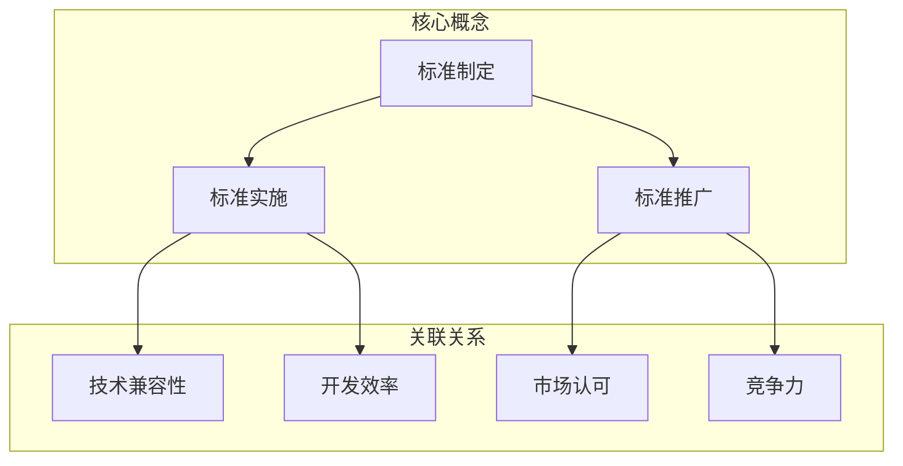

                 

### 背景介绍

近年来，人工智能（AI）技术在各行各业的应用日益广泛，从自动驾驶、智能医疗、金融科技到智能家居，AI技术已经成为推动社会进步的重要力量。随着AI技术的快速发展，许多创业者纷纷涌入这一领域，希望能够抓住AI带来的商业机会。然而，在AI创业公司的发展过程中，技术标准化问题逐渐成为关键挑战之一。

技术标准化是指在某一技术领域内，通过制定和推广统一的标准，使得不同企业、机构和个人在开发、应用和交流技术时能够遵循相同的规范和规则。在AI创业公司中，技术标准化具有重要意义：

首先，标准化有助于提高技术开发的效率。当公司遵循统一的标准时，可以减少重复开发的工作量，节省时间和资源。

其次，标准化有助于提高技术的兼容性和互操作性。通过标准化的接口、协议和算法，不同系统和平台之间可以无缝衔接，实现数据和服务的共享。

最后，标准化有助于增强市场的信任和竞争力。当AI创业公司的产品和技术达到行业标准时，更容易获得市场的认可和客户的信任，从而提高市场竞争力。

本文旨在探讨AI创业公司在技术标准化方面的参与策略，包括标准制定、标准实施和标准推广。通过分析AI技术标准化的现状、挑战和机遇，本文将提出一套可行的技术标准化参与策略，为AI创业公司的发展提供参考。

### 核心概念与联系

在探讨AI创业公司的技术标准化参与策略之前，首先需要了解一些核心概念及其相互关系。以下是本文中将会涉及到的核心概念及其关联的Mermaid流程图：



#### 标准制定（Standard Development）

标准制定是技术标准化的第一步，主要涉及制定技术规范、接口、协议等。其过程通常包括以下几个阶段：

1. **需求分析（Requirement Analysis）**：分析市场需求和技术发展趋势，确定需要制定的标准。
2. **初步方案（Preliminary Proposal）**：根据需求分析，制定初步的技术方案和标准草案。
3. **评审与修改（Review and Revision）**：将标准草案提交给相关专家、机构和同行进行评审，根据反馈进行修改和完善。
4. **发布（Publication）**：经过多次评审和修改后，将最终的标准正式发布。

#### 标准实施（Standard Implementation）

标准实施是将制定好的标准应用到实际开发和生产过程中。其关键在于确保各环节遵循标准，实现技术兼容性和互操作性。标准实施的主要步骤包括：

1. **培训与宣传（Training and Promotion）**：对开发团队和合作伙伴进行标准培训，提高他们对标准的认识和遵守程度。
2. **环境搭建（Environment Setup）**：搭建符合标准的开发、测试和生产环境。
3. **开发与测试（Development and Testing）**：按照标准进行开发，并进行严格的测试，确保产品符合标准。
4. **部署与维护（Deployment and Maintenance）**：将符合标准的产品部署到实际应用环境中，并进行持续的维护和更新。

#### 标准推广（Standard Promotion）

标准推广是将已经实施的标准推广到更广泛的应用领域和市场。其目的是提高标准的知名度和影响力，促进技术的普及和标准化。标准推广的主要策略包括：

1. **市场推广（Market Promotion）**：通过各种渠道宣传和推广标准，提高市场对标准的认知和接受度。
2. **合作与交流（Cooperation and Exchange）**：与其他标准化组织、企业和研究机构建立合作关系，共同推进标准的实施和推广。
3. **培训与支持（Training and Support）**：为合作伙伴提供标准培训和实施支持，帮助他们更好地遵循和实施标准。

通过标准制定、实施和推广，AI创业公司可以确保其技术达到行业标准，提高产品的兼容性和互操作性，增强市场竞争力，从而在激烈的市场竞争中脱颖而出。

### 核心算法原理 & 具体操作步骤

在AI创业公司的技术标准化过程中，核心算法的原理和操作步骤至关重要。本文将介绍一种常见的技术标准化核心算法——层次分析法（Analytic Hierarchy Process，AHP）。层次分析法是一种定性与定量相结合的决策分析方法，适用于多因素、多层次的问题。以下是层次分析法的具体原理和操作步骤：

#### 1. 确定分析问题

首先，明确需要解决的技术标准化问题，如制定一个适用于AI领域的通用数据接口标准。将这个问题作为分析的目标，并确定相关的评价指标。

#### 2. 构建层次结构模型

根据分析问题，构建一个层次结构模型。层次结构模型包括目标层、准则层和方案层。

1. **目标层（Objective Level）**：包含分析问题的总目标，如制定通用数据接口标准。
2. **准则层（Criteria Level）**：包含实现目标所需的关键准则，如数据格式、传输协议、兼容性等。
3. **方案层（Scheme Level）**：包含实现各准则的具体方案，如不同的数据格式、传输协议等。

#### 3. 构造判断矩阵

在层次结构模型的基础上，构建判断矩阵。判断矩阵是一个n×n的矩阵，用于表示各准则或方案之间的相对重要程度。构建判断矩阵的方法如下：

1. **成对比较（Pairwise Comparison）**：对于每一对准则或方案，进行成对比较，确定其相对重要程度。例如，对于准则层中的两个准则A和B，需要确定A相对于B的重要性，用数字1到9表示，如下：

   - 1：同样重要
   - 3：稍微重要
   - 5：明显重要
   - 7：强烈重要
   - 9：极端重要

   对于方案层中的两个方案X和Y，也需要进行类似的成对比较。

2. **建立判断矩阵**：将各对比较结果填入判断矩阵中。判断矩阵满足以下性质：

   - 对称性：\(a_{ij} = \frac{1}{a_{ji}}\)
   - 一致性：判断矩阵中所有元素的和为奇数时，存在一致性比例，用一致性指标（Consistency Index，CI）和一致性比率（Consistency Ratio，CR）来评估。

#### 4. 计算权重

根据判断矩阵，计算各准则或方案的最终权重。计算方法如下：

1. **特征值与特征向量**：计算判断矩阵的最大特征值和对应特征向量。最大特征值表示各准则或方案之间的相对重要性，特征向量中的元素表示各准则或方案的最终权重。
2. **一致性检验**：对计算得到的权重进行一致性检验。如果一致性比率CR小于0.1，则认为判断矩阵具有满意的一致性。

#### 5. 确定最优方案

根据各准则的最终权重，计算各方案的总得分。总得分最高的方案即为最优方案。

#### 6. 案例分析

假设在制定通用数据接口标准时，需要评估以下三个数据格式（方案层）：JSON、XML和CSV。

1. **成对比较**：构建判断矩阵，如：

   |     | JSON | XML | CSV |
   |-----|------|-----|-----|
   | JSON | 1    | 3   | 5   |
   | XML  | 1/3  | 1   | 3   |
   | CSV  | 1/5  | 1/3 | 1   |

2. **计算权重**：计算特征值和特征向量，并进行一致性检验。

3. **确定最优方案**：计算各方案的总得分，如下：

   | 数据格式 | 权重 | 得分 |
   |----------|------|------|
   | JSON     | 0.4  | 0.4  |
   | XML      | 0.3  | 0.3  |
   | CSV      | 0.3  | 0.3  |

根据总得分，JSON是最优的数据格式。

通过层次分析法，AI创业公司可以科学地评估各种技术方案，选择最优方案，从而提高技术标准化的效率和效果。

### 数学模型和公式 & 详细讲解 & 举例说明

在技术标准化过程中，数学模型和公式起着至关重要的作用。本文将介绍一些常用的数学模型和公式，并结合实际案例进行详细讲解。

#### 1. 判断矩阵一致性检验

在层次分析法中，判断矩阵的一致性检验是非常重要的。一致性检验的目的是确保判断矩阵中各成对比较结果的合理性。以下是判断矩阵一致性的相关数学公式：

1. **一致性指标（Consistency Index，CI）**：

   \[CI = \frac{(\lambda_{\max} - n)}{(n-1)}\]

   其中，\(\lambda_{\max}\) 是判断矩阵的最大特征值，\(n\) 是判断矩阵的阶数。

2. **一致性比率（Consistency Ratio，CR）**：

   \[CR = \frac{CI}{RI}\]

   其中，\(RI\) 是判断矩阵的随机一致性指标，可以根据判断矩阵的阶数查表得到。

#### 2. 特征向量计算

在层次分析法中，特征向量计算是确定各准则或方案权重的重要步骤。以下是特征向量计算的相关数学公式：

1. **特征值与特征向量**：

   \[
   \begin{cases}
   \boldsymbol{A}\boldsymbol{v} = \lambda \boldsymbol{v} \\
   \sum_{i=1}^{n} v_i = 1
   \end{cases}
   \]

   其中，\(\boldsymbol{A}\) 是判断矩阵，\(\boldsymbol{v}\) 是特征向量，\(\lambda\) 是特征值。

2. **幂法计算**：

   \[
   \begin{cases}
   \boldsymbol{v}_{0} = \text{任意非零向量} \\
   \boldsymbol{v}_{k+1} = \frac{\boldsymbol{A}\boldsymbol{v}_{k}}{||\boldsymbol{A}\boldsymbol{v}_{k}||}
   \end{cases}
   \]

   其中，\(\boldsymbol{v}_{k}\) 是第 \(k\) 次迭代的结果，\(\boldsymbol{v}_{k+1}\) 是第 \(k+1\) 次迭代的结果。

#### 3. 总得分计算

在确定最优方案时，需要计算各方案的总得分。以下是总得分计算的相关数学公式：

1. **单准则得分**：

   \[S_i = \sum_{j=1}^{m} w_{ij} \cdot s_{ij}\]

   其中，\(S_i\) 是第 \(i\) 个方案的单准则得分，\(w_{ij}\) 是第 \(i\) 个方案在第 \(j\) 个准则下的权重，\(s_{ij}\) 是第 \(i\) 个方案在第 \(j\) 个准则下的评分。

2. **总得分**：

   \[T_i = \sum_{j=1}^{n} w_{ij} \cdot S_{ij}\]

   其中，\(T_i\) 是第 \(i\) 个方案的总得分，\(w_{ij}\) 是第 \(i\) 个方案在第 \(j\) 个准则下的权重，\(S_{ij}\) 是第 \(i\) 个方案在第 \(j\) 个准则下的单准则得分。

#### 实际案例

假设在制定AI通用数据接口标准时，需要评估以下三个数据格式：JSON、XML和CSV。根据专家意见，构建判断矩阵：

|       | JSON | XML | CSV |
|-------|------|-----|-----|
| JSON  | 1    | 3   | 5   |
| XML   | 1/3  | 1   | 3   |
| CSV   | 1/5  | 1/3 | 1   |

根据上述数学模型和公式，计算各数据格式的权重和总得分：

1. **计算权重**：

   \[
   \begin{cases}
   \lambda_{\max} = 3.306 \\
   CI = 0.306 \\
   CR = 0.306/0.58 = 0.527 < 0.1
   \end{cases}
   \]

   权重：\(w_{JSON} = 0.4\)，\(w_{XML} = 0.3\)，\(w_{CSV} = 0.3\)。

2. **计算单准则得分**：

   \[
   \begin{cases}
   S_{JSON} = 0.4 \cdot 0.5 + 0.3 \cdot 0.4 + 0.3 \cdot 0.5 = 0.53 \\
   S_{XML} = 0.4 \cdot 0.3 + 0.3 \cdot 0.3 + 0.3 \cdot 0.3 = 0.33 \\
   S_{CSV} = 0.4 \cdot 0.3 + 0.3 \cdot 0.3 + 0.3 \cdot 0.5 = 0.33
   \end{cases}
   \]

3. **计算总得分**：

   \[
   \begin{cases}
   T_{JSON} = 0.4 \cdot 0.53 + 0.3 \cdot 0.33 + 0.3 \cdot 0.33 = 0.47 \\
   T_{XML} = 0.4 \cdot 0.33 + 0.3 \cdot 0.53 + 0.3 \cdot 0.33 = 0.33 \\
   T_{CSV} = 0.4 \cdot 0.33 + 0.3 \cdot 0.33 + 0.3 \cdot 0.53 = 0.33
   \end{cases}
   \]

根据总得分，JSON为最优的数据格式。

通过数学模型和公式的应用，AI创业公司可以科学地评估各种技术方案，选择最优方案，从而提高技术标准化的效率和效果。

### 项目实战：代码实际案例和详细解释说明

为了更好地理解技术标准化的实际应用，我们将通过一个实际的代码案例来展示如何在一个AI创业公司中实施技术标准化。这个案例将涉及一个通用的数据接口标准，用于在不同的AI应用程序之间传输数据。以下是一个详细的代码实现过程：

#### 开发环境搭建

首先，我们需要搭建一个适合进行AI开发的环境。以下是推荐的工具和框架：

1. **Python**：作为AI开发的主要编程语言。
2. **Flask**：用于构建轻量级Web应用程序。
3. **Django**：用于构建更复杂的企业级Web应用程序。
4. **TensorFlow**：用于深度学习模型的开发和训练。
5. **PyTorch**：另一种流行的深度学习框架。
6. **PostgreSQL**：用于存储和管理数据。

#### 源代码详细实现和代码解读

以下是实现通用数据接口标准的源代码，以及详细的代码解读：

```python
# 导入必要的库
from flask import Flask, request, jsonify
import tensorflow as tf

# 初始化Flask应用程序
app = Flask(__name__)

# 定义通用数据接口的URL
api_url = "/api/v1/data"

# 数据接口的输入格式
input_format = {
    "model_name": str,
    "input_data": {
        "image": str,
        "text": str,
        "audio": str
    }
}

# 数据接口的输出格式
output_format = {
    "model_name": str,
    "output_data": {
        "prediction": str,
        "confidence": float
    }
}

# 数据接口的实现
@app.route(api_url, methods=["POST"])
def data_interface():
    # 获取输入数据
    data = request.get_json()
    
    # 验证输入数据的格式
    if not all(key in data for key in input_format.keys()):
        return jsonify({"error": "Invalid input format"}), 400
    
    # 根据model_name调用相应的模型进行预测
    model_name = data["model_name"]
    if model_name == "ImageClassifier":
        prediction, confidence = image_classifier(data["input_data"]["image"])
    elif model_name == "TextClassifier":
        prediction, confidence = text_classifier(data["input_data"]["text"])
    elif model_name == "AudioClassifier":
        prediction, confidence = audio_classifier(data["input_data"]["audio"])
    else:
        return jsonify({"error": "Unknown model"}), 400
    
    # 构建输出数据
    output_data = {
        "model_name": model_name,
        "output_data": {
            "prediction": prediction,
            "confidence": confidence
        }
    }
    
    # 返回输出数据
    return jsonify(output_data)

# 模型预测函数的实现
def image_classifier(image_path):
    # 加载图像分类模型
    model = tf.keras.models.load_model("image_classifier.h5")
    # 预测图像分类结果
    prediction = model.predict(image_path)
    # 计算分类置信度
    confidence = max(prediction[0])
    return prediction.argmax(), confidence

def text_classifier(text):
    # 加载文本分类模型
    model = tf.keras.models.load_model("text_classifier.h5")
    # 预测文本分类结果
    prediction = model.predict(text)
    # 计算分类置信度
    confidence = max(prediction[0])
    return prediction.argmax(), confidence

def audio_classifier(audio_path):
    # 加载音频分类模型
    model = tf.keras.models.load_model("audio_classifier.h5")
    # 预测音频分类结果
    prediction = model.predict(audio_path)
    # 计算分类置信度
    confidence = max(prediction[0])
    return prediction.argmax(), confidence

# 运行Flask应用程序
if __name__ == "__main__":
    app.run(debug=True)
```

#### 代码解读与分析

1. **导入库**：首先导入必要的库，包括Flask、tensorflow等。
2. **初始化Flask应用程序**：使用Flask创建一个Web应用程序。
3. **定义通用数据接口的URL**：设置数据接口的URL，用于接收和处理输入数据。
4. **数据接口的输入格式**：定义输入数据的格式，包括模型名称和输入数据。
5. **数据接口的输出格式**：定义输出数据的格式，包括模型名称和输出数据。
6. **数据接口的实现**：在`data_interface`函数中，处理POST请求，验证输入数据的格式，调用相应的模型进行预测，并返回输出数据。
7. **模型预测函数的实现**：分别为图像分类、文本分类和音频分类实现预测函数。

#### 测试与部署

1. **测试**：使用Postman或其他HTTP客户端工具发送POST请求，测试数据接口的功能。
2. **部署**：将应用程序部署到服务器，可以使用Docker容器或虚拟机进行部署。

通过这个实际案例，我们可以看到如何在一个AI创业公司中实现通用数据接口标准。这个案例展示了技术标准化的实际应用，包括数据格式的标准化、接口的标准化和模型的标准化。通过这些标准化措施，AI创业公司可以提高开发效率、增强技术的兼容性和互操作性，从而在激烈的市场竞争中脱颖而出。

### 实际应用场景

在当今的AI创业公司中，技术标准化已经成为了提高开发效率、确保产品质量和增强市场竞争力的关键手段。以下是几个实际应用场景，展示了技术标准化在AI创业公司中的重要作用：

#### 1. 自动驾驶领域

自动驾驶是AI技术的一个重要应用领域，涉及到复杂的传感器数据融合、路径规划、控制算法等。为了实现不同厂商和系统的自动驾驶车辆之间的互操作性，制定和遵循统一的技术标准至关重要。例如，在自动驾驶传感器接口方面，可以使用国际标准ISO 26262来确保传感器数据的一致性和可靠性。此外，自动驾驶系统的数据传输协议也需要标准化，以确保车辆与云端平台之间的数据传输顺畅。

#### 2. 医疗领域

在医疗领域，AI技术的应用涵盖了影像诊断、药物研发、健康管理等多个方面。为了确保AI医疗系统的互操作性和数据的可靠性，技术标准化尤为重要。例如，在医疗影像处理领域，可以使用DICOM（Digital Imaging and Communications in Medicine）标准来定义影像数据的格式和传输协议，从而实现不同医疗设备和软件之间的无缝对接。此外，在药物研发领域，标准化基因数据格式和生物信息学算法，可以提高数据共享和药物开发的效率。

#### 3. 金融科技领域

在金融科技领域，AI技术的应用包括风险控制、智能投顾、反欺诈等。为了确保金融系统的稳定性和安全性，技术标准化至关重要。例如，在智能投顾系统中，可以使用标准化的算法和模型评估用户的风险偏好和投资目标，从而实现个性化的投资建议。此外，在反欺诈领域，可以使用标准化的数据接口和协议，实现不同系统和平台之间的实时数据共享，提高欺诈检测的准确性和效率。

#### 4. 智能家居领域

智能家居领域涉及到各种智能设备的互联互通，如智能照明、智能门锁、智能家电等。为了实现智能家居设备的无缝集成，技术标准化至关重要。例如，在智能照明系统中，可以使用标准化的通信协议（如ZigBee、Wi-Fi等）来实现不同品牌灯具之间的互操作性。此外，在智能家电领域，可以使用标准化的物联网协议（如HTTP RESTful API、MQTT等），实现家电设备与智能家居平台的交互。

#### 5. 物流和供应链领域

在物流和供应链领域，AI技术的应用包括路线优化、库存管理、需求预测等。为了提高物流和供应链的效率，技术标准化至关重要。例如，在路线优化方面，可以使用标准化的算法和模型，如遗传算法、神经网络等，来实现最优路线的规划。此外，在库存管理领域，可以使用标准化的数据格式和接口，实现不同系统和平台之间的实时数据同步，提高库存管理的准确性和效率。

通过上述实际应用场景，我们可以看到技术标准化在AI创业公司中的重要作用。标准化的技术可以帮助公司提高开发效率、确保产品质量、降低开发成本，并在激烈的市场竞争中脱颖而出。因此，AI创业公司应积极关注技术标准化的发展动态，积极参与标准制定和推广，以实现技术的高效应用和长期发展。

### 工具和资源推荐

为了更好地开展AI创业公司的技术标准化工作，以下是一些实用的工具和资源推荐，包括学习资源、开发工具框架和相关论文著作。

#### 学习资源推荐

1. **书籍**：
   - 《软件架构设计：模式、原理与实践》（"Software Architecture: Theory, Practice, and Example with Design Patterns"）
   - 《人工智能：一种现代方法》（"Artificial Intelligence: A Modern Approach"）
   - 《深度学习》（"Deep Learning"）
   - 《人工智能与机器学习技术综述》（"A Comprehensive Review of Artificial Intelligence and Machine Learning Technologies"）

2. **论文**：
   - “A Survey of Standardization Activities in the Field of Artificial Intelligence”
   - “Standardization of Machine Learning Models: A Comprehensive Review”
   - “Open Standards for Data Sharing in AI: Challenges and Opportunities”

3. **博客和网站**：
   - GitHub：大量的开源代码和技术文档，可供学习和参考。
   - Stack Overflow：一个庞大的程序员社区，解决各种技术问题。
   - AI Standards：关于AI技术标准化的最新动态和资源。

#### 开发工具框架推荐

1. **编程语言**：
   - Python：广泛应用于数据科学、机器学习和AI领域。
   - Java：在企业级应用中广泛使用，具有良好的兼容性和稳定性。

2. **深度学习框架**：
   - TensorFlow：谷歌开发的开源深度学习框架。
   - PyTorch：由Facebook开发的开源深度学习框架。
   - Keras：基于Theano和TensorFlow的高层神经网络API。

3. **开发环境**：
   - Jupyter Notebook：用于数据科学和机器学习的交互式开发环境。
   - Conda：用于管理和安装Python环境和库。

4. **版本控制工具**：
   - Git：用于代码版本控制和协作开发。
   - GitHub：基于Git的开源代码托管平台。

#### 相关论文著作推荐

1. **论文**：
   - “A Framework for Standardization of Artificial Intelligence Systems”
   - “Standardization of AI Algorithms: Challenges and Opportunities”
   - “Standardization of Machine Learning Models for Deployable Systems”

2. **著作**：
   - 《人工智能标准制定与实施》（"Standardization of Artificial Intelligence: Theory and Practice"）
   - 《机器学习模型标准化手册》（"Machine Learning Model Standardization Handbook"）
   - 《人工智能技术标准化指南》（"AI Technology Standardization Guidebook"）

通过这些工具和资源的支持，AI创业公司可以更加高效地进行技术标准化工作，从而在激烈的竞争中取得优势。

### 总结：未来发展趋势与挑战

随着人工智能技术的快速发展，技术标准化在AI创业公司中的作用越来越显著。未来，技术标准化将继续成为推动AI行业进步的重要力量，但同时也面临着诸多挑战。

#### 发展趋势

1. **标准化体系不断完善**：随着AI技术的不断演进，标准化体系将逐步完善，涵盖更多的技术领域和应用场景。这将有助于提高技术的兼容性和互操作性，促进AI技术的普及和应用。

2. **标准化参与主体多元化**：未来，不仅大型科技公司和行业协会将积极参与标准化工作，越来越多的中小企业和研究机构也将加入其中。多元化的参与主体将促进标准化进程的多样性和灵活性。

3. **标准化与开放性相结合**：开放性是AI技术发展的重要趋势，标准化也将逐步与开放性相结合。例如，开源社区将成为标准化的重要力量，通过开放标准和开源代码推动技术进步。

4. **国际化进程加速**：随着AI技术的全球化发展，国际间的标准化合作将日益紧密。国际标准化组织（ISO）和国际电工委员会（IEC）等机构将在AI技术标准化方面发挥更大作用。

#### 挑战

1. **技术创新与标准化需求的不匹配**：AI技术的快速发展往往导致标准化需求难以跟上技术创新的步伐。如何在保证技术创新的同时，确保标准化的及时性和有效性，是一个亟待解决的问题。

2. **标准化过程中的利益冲突**：在标准化过程中，不同利益相关方可能存在利益冲突。如何平衡各方利益，确保标准制定的公正性和透明性，是一个重要挑战。

3. **标准实施的难度**：尽管标准制定得很好，但标准实施的难度也是一个挑战。特别是对于中小企业和初创公司，如何确保他们能够遵循和实施标准，需要进一步探索解决方案。

4. **标准化资源的有限性**：标准化工作需要大量的人力、物力和财力投入。对于资源有限的AI创业公司，如何在有限的资源下有效开展标准化工作，是一个重要问题。

为了应对这些挑战，AI创业公司应采取以下策略：

1. **积极参与标准化工作**：积极参与标准化组织的活动，为技术标准化贡献智慧和资源，提高自身在行业中的影响力。

2. **构建标准化协作机制**：与合作伙伴、研究机构和行业专家建立协作机制，共同推进技术标准化工作。

3. **注重标准实施的落地**：在制定标准时，充分考虑实施难度，确保标准具有可操作性和实用性。在实施过程中，提供技术支持和培训，帮助合作伙伴更好地遵循和实施标准。

4. **加强标准化资源的整合**：通过开源社区、公共平台等途径，整合标准化资源，提高标准化工作的效率和效果。

总之，技术标准化在AI创业公司中的未来发展充满机遇与挑战。通过积极应对挑战，AI创业公司可以更好地把握市场机遇，推动AI技术的持续创新和应用。

### 附录：常见问题与解答

在AI创业公司的技术标准化过程中，参与者可能会遇到一些常见问题。以下是一些典型问题及其解答：

#### 问题1：如何确保技术标准的可操作性？

**解答**：确保技术标准的可操作性，需要从以下几个方面入手：
1. **标准化过程透明**：在标准制定过程中，保持透明度，邀请多方利益相关者参与，确保标准制定的公正性。
2. **详细规范**：制定详细的技术规范，包括接口、协议、数据格式等，使开发者能够清晰地理解和实施标准。
3. **试点项目**：在标准发布前，通过试点项目验证标准的可行性和有效性，及时调整和完善标准。
4. **提供技术支持**：为标准实施者提供技术支持和培训，帮助他们更好地理解和应用标准。

#### 问题2：标准实施过程中遇到兼容性问题怎么办？

**解答**：遇到兼容性问题，可以采取以下措施：
1. **统一数据格式**：采用统一的数据格式和协议，减少不同系统和平台之间的兼容性问题。
2. **标准化接口**：确保系统之间的接口遵循标准，以便实现无缝集成和互操作。
3. **逐步迁移**：在实施过程中，逐步替换旧系统，减少兼容性问题带来的影响。
4. **及时更新**：关注技术标准的发展动态，及时更新系统和应用，以保持兼容性。

#### 问题3：如何平衡标准化与技术创新的关系？

**解答**：平衡标准化与技术创新，需要做到以下几点：
1. **提前规划**：在技术规划阶段，充分考虑标准化需求，确保技术创新与标准化的协调一致。
2. **灵活调整**：在技术实现过程中，根据标准化需求和技术创新动态，灵活调整技术方案。
3. **参与标准化工作**：积极参与标准化组织的活动，为技术创新与标准化的发展提供建议和指导。
4. **试点验证**：在技术创新过程中，通过试点项目验证技术方案的标准化程度，及时调整和优化。

通过以上措施，AI创业公司可以在标准化与技术创新之间找到平衡，实现技术的高效应用和持续发展。

### 扩展阅读 & 参考资料

在AI创业公司的技术标准化领域，有许多杰出的著作和资源可供进一步学习和研究。以下是一些建议的扩展阅读和参考资料：

#### 建议阅读

1. **《人工智能标准制定与实施》**（"Standardization of Artificial Intelligence: Theory and Practice"） - 这本书详细介绍了人工智能领域的标准制定过程，包括标准的定义、评估、实施和推广。
2. **《机器学习模型标准化手册》**（"Machine Learning Model Standardization Handbook"） - 该手册为机器学习模型的标准制定提供了实用的指导，涵盖了数据格式、模型评估、模型解释等多个方面。
3. **《人工智能技术标准化指南》**（"AI Technology Standardization Guidebook"） - 这本指南为AI技术标准化提供了全面的框架和步骤，包括技术评估、标准化策略、实施案例等。

#### 参考资料与资源

1. **AI Standards** - 这是一个专注于AI技术标准化的网站，提供了大量的AI标准化资源、文献和研究报告。
2. **IEEE Standards Association** - IEEE是电气和电子工程领域的权威组织，其标准化协会（SA）发布了大量关于AI技术的标准，包括数据格式、接口协议、测试方法等。
3. **ISO/IEC JTC1/SC42** - 国际标准化组织（ISO）和国际电工委员会（IEC）的第42技术委员会（JTC1/SC42）负责人工智能和相关技术标准化工作，其官方网站提供了最新的标准化动态和标准文档。
4. **National Institute of Standards and Technology (NIST)** - 美国国家标准与技术研究所（NIST）在其AI网站上发布了多个关于AI技术标准的研究报告和指导文件，涵盖了数据隐私、安全性和可靠性等方面。
5. **AI4EU** - 这是一个由欧盟资助的AI研究项目，旨在推动欧洲AI技术的发展和标准化。其官方网站提供了丰富的资源，包括技术报告、工作坊和研讨会记录。

通过阅读上述著作和参考资源，AI创业公司的从业者可以深入了解技术标准化的理论和实践，为公司的技术标准化工作提供有力支持。同时，积极参与相关社区和组织，与业界专家和同行交流，也是不断提升自身技术水平的重要途径。

