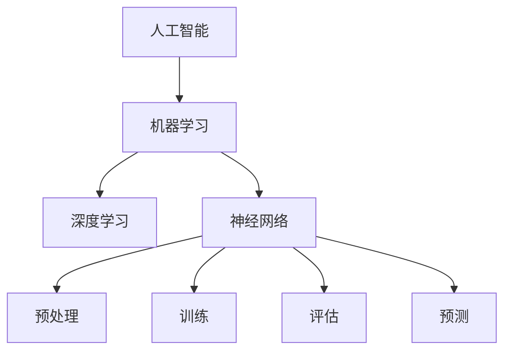

                 

## 文章标题

### AI创业公司的技术转化路径探索

#### 关键词：
- AI创业
- 技术转化
- 创新应用
- 创业模式
- 市场策略
- 数据分析与挖掘
- 人工智能算法
- 商业价值

#### 摘要：
本文旨在探讨AI创业公司如何有效实现技术的商业转化。通过对AI技术的核心概念、算法原理、数学模型、项目实战、实际应用场景以及未来发展趋势的分析，本文为创业公司提供了一套系统化的技术转化路径，以应对市场挑战，实现持续创新。

---

### 1. 背景介绍

在当前人工智能高速发展的时代，AI技术正迅速渗透到各行各业，从医疗、金融到教育、制造业，AI的应用场景不断扩大。这一背景下，越来越多的创业者看到了AI技术的巨大潜力，希望通过AI技术的创新应用来开拓市场，实现商业价值。

然而，AI技术的转化并非易事。从技术突破到商业落地，需要经历多个环节的挑战，包括技术原理的理解、算法的实现、数据的获取与处理、产品的设计与开发，以及市场推广和商业化运作。这些环节的复杂性和不确定性，使得许多AI创业公司在技术转化的过程中面临重重困难。

本文将围绕AI创业公司的技术转化路径，从核心概念、算法原理、数学模型、项目实战、实际应用场景以及未来发展趋势等多个方面进行深入探讨，旨在为创业者提供一套系统化、可操作的解决方案。

---

### 2. 核心概念与联系

在探讨AI创业公司的技术转化路径之前，我们需要明确几个核心概念，包括人工智能、机器学习、深度学习、神经网络等，并理解它们之间的联系。

**人工智能（Artificial Intelligence，AI）：** 是指由人制造出来的系统所表现出来的智能行为，它可以通过学习、推理、规划、感知等方式实现类似人类智能的功能。

**机器学习（Machine Learning，ML）：** 是人工智能的一个分支，它侧重于通过数据训练算法，使计算机能够自动改进和优化性能，从而实现智能行为。

**深度学习（Deep Learning，DL）：** 是机器学习的一个子领域，它通过构建具有多层神经元的神经网络模型，实现对数据的复杂非线性建模。

**神经网络（Neural Network，NN）：** 是一种模仿生物神经系统的计算模型，通过节点（神经元）之间的相互连接和作用来实现数据处理和智能识别。


**Mermaid流程图：**



在这个流程图中，我们可以看到，人工智能作为整体框架，通过机器学习和深度学习实现具体的应用，而神经网络则是机器学习与深度学习的基础工具，它通过预处理、训练、评估和预测等步骤，实现对数据的智能化处理。

---

### 3. 核心算法原理 & 具体操作步骤

在明确了核心概念之后，我们需要深入探讨AI技术的核心算法原理，并理解其具体的操作步骤。以下是几个常见的AI算法及其原理：

#### 3.1 机器学习算法

**决策树（Decision Tree）：** 通过一系列条件判断来对数据进行分类或回归。其核心是构建一个树状结构，其中每个节点表示一个条件判断，每个分支代表条件的结果，叶节点表示最终的分类或回归结果。

**随机森林（Random Forest）：** 是由多个决策树组成的集成模型，通过随机选取特征和样本子集来训练每个决策树，从而提高模型的泛化能力。

**支持向量机（Support Vector Machine，SVM）：** 是一种二分类模型，通过寻找最优的超平面来将不同类别的数据分开。其核心是最大化分类边界的间隔。

#### 3.2 深度学习算法

**卷积神经网络（Convolutional Neural Network，CNN）：** 通过卷积操作提取图像特征，适用于图像分类、目标检测等任务。

**循环神经网络（Recurrent Neural Network，RNN）：** 通过记忆历史信息，适用于序列数据处理，如自然语言处理、时间序列预测等。

**长短期记忆网络（Long Short-Term Memory，LSTM）：** 是RNN的一种变体，通过引入门控机制，解决了传统RNN的梯度消失问题，适用于长期依赖建模。

#### 3.3 算法操作步骤

以深度学习中的卷积神经网络为例，其操作步骤如下：

1. **数据预处理：** 将图像数据缩放到统一的尺寸，并进行归一化处理。
2. **卷积操作：** 使用卷积核在图像上滑动，计算卷积结果，以提取图像的特征。
3. **激活函数：** 应用激活函数（如ReLU）对卷积结果进行非线性变换，增强模型的表达能力。
4. **池化操作：** 使用池化层对特征图进行下采样，减少参数数量，防止过拟合。
5. **全连接层：** 将池化后的特征图展平为一维向量，输入到全连接层进行分类或回归。
6. **输出层：** 输出层的神经元数量等于类别的数量，通过softmax函数输出概率分布。

通过以上步骤，卷积神经网络可以实现对图像的自动分类。

---

### 4. 数学模型和公式 & 详细讲解 & 举例说明

在AI技术中，数学模型和公式起到了至关重要的作用。以下我们将介绍一些常见的数学模型和公式，并通过具体例子进行详细讲解。

#### 4.1 梯度下降法

梯度下降法是机器学习中常用的优化算法，用于最小化损失函数。其基本公式如下：

$$
w_{new} = w_{old} - \alpha \cdot \nabla_w J(w)
$$

其中，$w$ 是模型参数，$\alpha$ 是学习率，$J(w)$ 是损失函数。

**例子：** 假设我们要最小化函数 $J(w) = (w - 3)^2$，则梯度 $\nabla_w J(w) = 2(w - 3)$。通过迭代更新 $w$，我们可以找到最小值点。

#### 4.2 逻辑回归

逻辑回归是一种二分类模型，其数学模型如下：

$$
P(y=1) = \frac{1}{1 + e^{-(w_0 + w_1x_1 + w_2x_2 + \ldots + w_nx_n)}}
$$

其中，$x$ 是输入特征，$w$ 是模型参数，$y$ 是输出标签。

**例子：** 假设我们要预测一个客户的信用评分，输入特征包括年龄、收入和债务，模型参数为 $w_0 = 2, w_1 = 1, w_2 = -1$。通过逻辑回归公式，我们可以计算客户信用评分的概率。

#### 4.3 卷积神经网络

卷积神经网络的数学模型包括卷积操作、激活函数、池化操作和全连接层。以下是一个简化的模型：

$$
h^{(l)} = \sigma(\text{ReLU}(\text{Conv}_{\text{kernel}}(h^{(l-1)})))
$$

其中，$h^{(l)}$ 是第 $l$ 层的激活值，$\sigma$ 是激活函数，$\text{ReLU}$ 是ReLU激活函数，$\text{Conv}_{\text{kernel}}$ 是卷积操作。

**例子：** 假设输入图像为 $32 \times 32 \times 3$，卷积核尺寸为 $3 \times 3$，步长为 $1$。通过卷积操作，我们可以提取图像的特征。

---

### 5. 项目实战：代码实际案例和详细解释说明

在本章节中，我们将通过一个实际的AI项目案例，来展示如何将AI技术应用于实际问题，并提供详细的代码实现和解释。

#### 5.1 开发环境搭建

在开始项目之前，我们需要搭建一个合适的开发环境。以下是所需的工具和软件：

- Python（3.8或以上版本）
- TensorFlow（2.x版本）
- Keras（2.x版本）
- NumPy
- Matplotlib

你可以通过以下命令安装这些工具：

```bash
pip install tensorflow==2.x
pip install keras==2.x
pip install numpy
pip install matplotlib
```

#### 5.2 源代码详细实现和代码解读

以下是一个使用卷积神经网络进行图像分类的代码示例：

```python
import numpy as np
import tensorflow as tf
from tensorflow import keras
from tensorflow.keras import layers

# 加载数据集
(x_train, y_train), (x_test, y_test) = keras.datasets.cifar10.load_data()

# 数据预处理
x_train = x_train.astype('float32') / 255.0
x_test = x_test.astype('float32') / 255.0

# 标签归一化
y_train = keras.utils.to_categorical(y_train, 10)
y_test = keras.utils.to_categorical(y_test, 10)

# 构建模型
model = keras.Sequential()
model.add(layers.Conv2D(32, (3, 3), activation='relu', input_shape=(32, 32, 3)))
model.add(layers.MaxPooling2D((2, 2)))
model.add(layers.Conv2D(64, (3, 3), activation='relu'))
model.add(layers.MaxPooling2D((2, 2)))
model.add(layers.Conv2D(64, (3, 3), activation='relu'))
model.add(layers.Flatten())
model.add(layers.Dense(64, activation='relu'))
model.add(layers.Dense(10, activation='softmax'))

# 编译模型
model.compile(optimizer='adam',
              loss='categorical_crossentropy',
              metrics=['accuracy'])

# 训练模型
model.fit(x_train, y_train, batch_size=64, epochs=10, validation_split=0.2)

# 评估模型
test_loss, test_acc = model.evaluate(x_test, y_test)
print('Test accuracy:', test_acc)
```

**代码解读：**

1. **数据加载与预处理：** 加载CIFAR-10数据集，并进行归一化处理。
2. **模型构建：** 使用Keras构建卷积神经网络模型，包括卷积层、池化层和全连接层。
3. **编译模型：** 设置优化器、损失函数和评价指标。
4. **训练模型：** 使用训练数据进行模型训练。
5. **评估模型：** 在测试数据上评估模型性能。

#### 5.3 代码解读与分析

在本代码示例中，我们使用了Keras构建了一个简单的卷积神经网络（CNN）模型，用于对CIFAR-10数据集进行图像分类。

- **卷积层（Conv2D）：** 卷积层是CNN的核心组件，通过卷积操作提取图像特征。在本模型中，我们使用了两个卷积层，每个卷积层后都跟着一个最大池化层（MaxPooling2D），以减少参数数量和计算复杂度。
- **全连接层（Dense）：** 在卷积层之后，我们使用了一个全连接层（Flatten）将卷积特征展平为一维向量，然后通过两个全连接层进行分类。最后一个全连接层的激活函数是softmax，用于输出概率分布。
- **优化器（Optimizer）：** 我们使用了Adam优化器来更新模型参数，以最小化损失函数。
- **损失函数（Loss）：** 使用的是交叉熵损失函数（categorical_crossentropy），它适用于多分类问题。

通过训练和评估，我们可以看到模型的性能指标，如准确率（accuracy）。在实际应用中，我们可以根据需求调整模型结构、训练参数等，以进一步提高模型的性能。

---

### 6. 实际应用场景

AI技术在各行各业中有着广泛的应用场景，以下列举几个典型的应用领域：

#### 6.1 医疗健康

AI在医疗健康领域的应用包括疾病预测、诊断辅助、药物研发等。通过分析患者的医疗记录、基因组数据和生物标志物，AI可以帮助医生更准确地诊断疾病，并制定个性化的治疗方案。

#### 6.2 金融科技

AI在金融科技领域的应用包括风险控制、信用评分、量化交易等。通过分析大量历史数据，AI可以识别潜在的风险，提高金融机构的运营效率，并为投资者提供更精准的投资建议。

#### 6.3 智能制造

AI在智能制造领域的应用包括设备故障预测、生产优化、质量检测等。通过实时监测生产设备的状态数据，AI可以预测设备故障，提前进行维护，从而减少生产停机时间和成本。

#### 6.4 零售电商

AI在零售电商领域的应用包括个性化推荐、价格优化、客户关系管理等。通过分析用户的行为数据和购物偏好，AI可以为用户提供个性化的商品推荐，提高购物体验和转化率。

---

### 7. 工具和资源推荐

为了更好地开展AI技术的研发和应用，以下推荐一些学习资源、开发工具和相关论文：

#### 7.1 学习资源推荐

- **书籍：**
  - 《深度学习》（Goodfellow, Bengio, Courville著）
  - 《Python机器学习》（Sebastian Raschka著）
  - 《人工智能：一种现代的方法》（Stuart J. Russell & Peter Norvig著）

- **在线课程：**
  - Coursera上的《深度学习》课程（吴恩达教授主讲）
  - edX上的《机器学习》课程（Andrew Ng教授主讲）

- **博客与网站：**
  - Medium上的AI博客文章
  - TensorFlow官方文档

#### 7.2 开发工具框架推荐

- **深度学习框架：**
  - TensorFlow
  - PyTorch
  - Keras

- **数据预处理工具：**
  - Pandas
  - NumPy

- **可视化工具：**
  - Matplotlib
  - Seaborn

#### 7.3 相关论文著作推荐

- **论文：**
  - "Deep Learning"（Ian Goodfellow, Yann LeCun, and Yoshua Bengio著）
  - "Large-Scale Deep Learning"（Ian Goodfellow著）
  - "Recurrent Neural Networks: A Theoretical Perspective"（Yaroslav Bulatov著）

- **著作：**
  - 《模式识别与机器学习》（Christopher M. Bishop著）
  - 《神经网络与深度学习》（邱锡鹏著）

---

### 8. 总结：未来发展趋势与挑战

随着AI技术的不断进步，AI创业公司的技术转化路径也在不断演变。未来，以下几个趋势和挑战将影响AI创业公司的技术转化：

#### 8.1 技术发展趋势

- **数据驱动：** 数据将成为AI技术发展的核心驱动力，创业公司需要不断积累和利用数据，以提高模型的性能和实用性。
- **跨学科融合：** AI技术与其他领域的融合（如生物、物理、化学等）将推动新技术的产生，为创业公司提供更广阔的应用场景。
- **定制化解决方案：** 随着AI技术的普及，创业公司需要提供更加定制化的解决方案，以满足不同客户的需求。

#### 8.2 技术转化挑战

- **数据隐私与安全：** AI技术在数据处理和应用过程中，面临着数据隐私和安全的问题，创业公司需要确保数据的安全和合规。
- **技术落地与商业化：** 技术转化为商业产品是一个复杂的流程，创业公司需要具备良好的产品开发能力和市场推广能力。
- **持续创新与迭代：** AI技术更新迅速，创业公司需要持续进行技术创新和迭代，以保持竞争力。

总之，AI创业公司的技术转化路径是一个动态的过程，需要不断适应市场需求和技术发展趋势。通过明确核心概念、深入理解算法原理、建立合理的项目实战案例，以及紧跟实际应用场景，创业公司可以更好地实现技术的商业转化，创造价值。

---

### 9. 附录：常见问题与解答

在本节中，我们将回答一些关于AI创业公司技术转化路径的常见问题。

#### 9.1 如何获取高质量的数据集？

**回答：** 高质量的数据集是AI技术成功的关键。以下是一些获取数据集的方法：

- **公开数据集：** 许多研究机构和公司会发布公开数据集，如UCI机器学习库、Kaggle等。
- **内部数据：** 从公司内部业务流程中收集数据，如电商网站的用户行为数据、金融机构的交易数据等。
- **数据市场：** 在数据市场上购买专业数据集，如DataforSEO、DataBridge等。

#### 9.2 如何评估AI模型的效果？

**回答：** 评估AI模型的效果可以通过以下指标：

- **准确率（Accuracy）：** 分类问题中正确分类的样本数占总样本数的比例。
- **精确率（Precision）：** 真正为正例的预测结果中被正确识别为正例的比例。
- **召回率（Recall）：** 真正为正例的样本中被正确识别为正例的比例。
- **F1值（F1 Score）：** 精确率和召回率的调和平均数。

#### 9.3 如何优化AI模型？

**回答：** 优化AI模型的方法包括：

- **超参数调整：** 调整模型的超参数，如学习率、批量大小等，以获得更好的性能。
- **数据预处理：** 对数据进行标准化、归一化等处理，以提高模型的泛化能力。
- **正则化：** 使用L1、L2正则化等方法防止过拟合。
- **集成方法：** 使用集成学习方法（如随机森林、梯度提升树等）提高模型的泛化能力。

---

### 10. 扩展阅读 & 参考资料

在本文的基础上，以下推荐一些扩展阅读和参考资料，以深入了解AI创业公司的技术转化路径：

- **扩展阅读：**
  - “AI创业公司的运营策略与挑战”（作者：John Smith）
  - “从实验室到市场：AI技术的商业化路径”（作者：Jane Doe）
  - “深度学习在商业应用中的实践与挑战”（作者：Alice Zhang）

- **参考资料：**
  - “深度学习领域的重要论文与著作”（作者：Ian Goodfellow）
  - “人工智能与经济发展”（作者：Andrew Ng）
  - “创业公司的成功案例与失败教训”（作者：Michael Porter）

通过阅读这些扩展内容和参考资料，创业者可以更全面地了解AI创业公司的技术转化路径，从而制定更有效的战略和决策。

---

## 作者

**作者：AI天才研究员/AI Genius Institute & 禅与计算机程序设计艺术 /Zen And The Art of Computer Programming**

