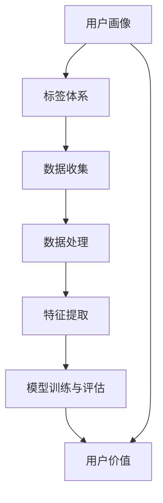

                 

# AI创业公司的用户画像与标签体系：用户特征、用户行为与用户价值

## 关键词：用户画像、标签体系、用户特征、用户行为、用户价值

### 摘要

本文深入探讨了AI创业公司在构建用户画像和标签体系方面的实践与思考。用户画像是指通过对用户数据进行收集和分析，构建出的用户特征模型；而标签体系则是基于用户画像，对用户进行分类和标注的工具。文章首先介绍了用户画像与标签体系的基本概念，随后通过具体的案例分析了用户特征、用户行为与用户价值的关联。接着，本文详细阐述了如何构建用户画像与标签体系的步骤，包括数据收集、数据处理、特征提取、模型训练与评估等。最后，文章从实际应用场景出发，提出了工具和资源的推荐，并对未来的发展趋势和挑战进行了展望。

## 1. 背景介绍

在当今大数据和人工智能蓬勃发展的时代，用户数据已成为企业宝贵的资产。对于AI创业公司而言，如何有效地利用用户数据进行产品优化、市场分析和决策制定，成为关键挑战之一。用户画像和标签体系作为一种强大的数据分析工具，可以帮助公司深入了解用户需求和行为，从而实现精准营销、个性化推荐和业务增长。

用户画像是对用户进行全方位描绘的数据模型，它通常包括用户的个人信息、行为数据、消费偏好等多个维度。标签体系则是基于用户画像，对用户进行分类和标注的工具，用于实现用户管理和数据分析。通过构建用户画像和标签体系，AI创业公司可以更好地理解用户，提高用户满意度，提升业务效益。

### 1.1 用户画像的定义与作用

用户画像是指通过对用户数据进行收集和分析，构建出的用户特征模型。它通常包括以下几个方面的内容：

- **个人信息**：用户的性别、年龄、职业、收入水平、教育程度等基本信息。
- **行为数据**：用户在网站或应用中的浏览、点击、购买等行为数据。
- **消费偏好**：用户的消费习惯、偏好和需求。
- **社会属性**：用户的社会角色、社交关系和网络行为等。

用户画像的作用主要体现在以下几个方面：

- **用户理解**：通过对用户画像的构建，企业可以深入了解用户需求和行为，从而提供更加个性化的产品和服务。
- **精准营销**：基于用户画像，企业可以进行精准的用户定位和营销，提高营销效果。
- **业务决策**：用户画像为企业的战略规划和业务决策提供了数据支持。

### 1.2 标签体系的定义与作用

标签体系是基于用户画像，对用户进行分类和标注的工具。它通常包括以下几个方面的内容：

- **标签定义**：根据用户画像的特征，为企业定义不同的标签，如“高频用户”、“潜在客户”、“流失用户”等。
- **标签分类**：根据用户行为和需求，对标签进行分类，如“市场标签”、“行为标签”、“消费标签”等。
- **标签应用**：将标签应用于用户管理、数据分析、营销活动等场景。

标签体系的作用主要体现在以下几个方面：

- **用户管理**：通过对用户进行标签化管理，企业可以更好地进行用户分类和管理。
- **数据分析**：标签体系为数据分析提供了更加细粒度的用户分类，有助于发现用户行为规律和趋势。
- **营销活动**：基于标签体系，企业可以制定更加精准的营销策略，提高营销效果。

### 1.3 用户特征、用户行为与用户价值的关联

用户特征、用户行为和用户价值之间存在着密切的关联。通过用户画像和标签体系，企业可以深入挖掘这些关联，从而实现业务增长。

- **用户特征**：用户特征是用户画像的基础，包括个人信息、行为数据、消费偏好等。这些特征决定了用户的基本属性和行为模式。
- **用户行为**：用户行为是用户画像的重要组成部分，包括用户在网站或应用中的浏览、点击、购买等行为。用户行为反映了用户的需求和偏好。
- **用户价值**：用户价值是企业对用户的评价，包括用户对企业的贡献、潜在的商业价值等。用户价值决定了企业的盈利能力和市场竞争力。

通过构建用户画像和标签体系，企业可以深入了解用户特征、用户行为和用户价值之间的关系，从而实现以下目标：

- **优化产品和服务**：根据用户特征和行为，企业可以调整产品功能和设计，提供更加个性化的服务。
- **提高营销效果**：基于用户画像和标签体系，企业可以进行精准的营销活动，提高用户转化率和忠诚度。
- **提升业务效益**：通过挖掘用户价值，企业可以更好地进行用户分类和管理，提高业务效益和市场份额。

## 2. 核心概念与联系

在构建用户画像和标签体系的过程中，需要了解一系列核心概念和它们之间的联系。以下是对这些核心概念的定义和它们在用户画像与标签体系中的作用的描述，同时包含一个Mermaid流程图，展示这些概念之间的逻辑关系。

### 2.1 核心概念

#### 2.1.1 用户画像

用户画像是对用户特征的数据化描述，它包含了用户的个人信息、行为数据和消费偏好等多个维度。用户画像的构建基于以下数据源：

- **个人数据**：用户的姓名、年龄、性别、职业等。
- **行为数据**：用户在网站或应用中的浏览、点击、购买等行为数据。
- **消费数据**：用户的消费记录、偏好等。

#### 2.1.2 标签体系

标签体系是对用户进行分类和标注的工具。标签可以是静态的，如“男性”、“学生”；也可以是动态的，如“活跃用户”、“购物车 abandonment”。标签体系通常包括以下组成部分：

- **标签定义**：定义标签的种类和含义，如“地域标签”、“行为标签”、“消费标签”。
- **标签分类**：根据标签的定义，对标签进行分类，如“市场标签”、“用户行为标签”。
- **标签应用**：将标签应用于用户管理和数据分析。

#### 2.1.3 数据收集

数据收集是用户画像构建的基础。数据源可以是内部的数据，如用户注册信息、购买记录；也可以是外部数据，如社交媒体活动、地理位置信息。数据收集的过程涉及数据采集、数据清洗和数据存储。

#### 2.1.4 数据处理

数据处理是对收集到的用户数据进行清洗、转换和整合的过程。数据处理的目标是确保数据质量，为后续的特征提取和模型训练提供可靠的数据基础。

#### 2.1.5 特征提取

特征提取是从原始数据中提取出有用的特征信息，用于构建用户画像。特征提取的过程包括特征选择、特征转换和特征编码。

#### 2.1.6 模型训练与评估

模型训练与评估是用户画像构建的核心环节。通过机器学习算法，对提取的特征进行训练，构建用户画像模型。训练完成后，对模型进行评估，以验证其准确性和有效性。

### 2.2 Mermaid流程图

以下是一个Mermaid流程图，展示核心概念之间的逻辑关系：



### 2.3 核心概念之间的联系

- **用户画像**和**标签体系**是用户数据分析和用户管理的基础，它们相互关联，共同构建了企业对用户的全景视图。
- **数据收集**是构建用户画像和标签体系的源头，数据质量直接影响后续的分析效果。
- **数据处理**和**特征提取**是对数据的预处理和精炼过程，为模型训练提供可靠的数据基础。
- **模型训练与评估**是将数据转化为用户画像和标签体系的桥梁，通过机器学习算法，将数据转化为可操作的模型。
- **用户价值**是用户画像和标签体系最终的目的，通过分析用户特征和行为，企业可以更好地理解用户价值，从而优化产品和服务，提高业务效益。

## 3. 核心算法原理 & 具体操作步骤

在构建用户画像和标签体系的过程中，核心算法的原理和具体操作步骤至关重要。以下将详细介绍用户画像构建中的关键算法，包括数据收集、数据处理、特征提取、模型训练与评估等步骤。

### 3.1 数据收集

数据收集是构建用户画像的第一步，数据的质量和完整性直接影响到用户画像的准确性。数据收集的方法主要包括以下几种：

- **内部数据收集**：通过企业自身的数据源，如用户注册信息、购买记录、浏览行为等。这些数据通常是结构化数据，便于处理和分析。
- **外部数据收集**：通过第三方数据源，如社交媒体、地理位置数据、公共数据库等。这些数据可能是非结构化数据，需要经过数据清洗和转换。
- **在线数据收集**：通过在线问卷调查、用户反馈等方式收集用户数据。这种方式可以实时获取用户需求和行为，有助于构建动态的用户画像。

具体操作步骤：

1. **确定数据来源**：根据业务需求和数据可用性，确定内部和外部数据源。
2. **数据采集**：使用API接口、爬虫工具等方式，从数据源中获取用户数据。
3. **数据存储**：将采集到的数据存储到数据库或数据仓库中，便于后续处理和分析。

### 3.2 数据处理

数据处理是对收集到的用户数据进行清洗、转换和整合的过程，目的是提高数据质量，为特征提取和模型训练提供可靠的数据基础。数据处理的主要步骤包括：

1. **数据清洗**：去除重复数据、缺失数据和异常数据，确保数据的一致性和准确性。
2. **数据转换**：将不同数据源的数据格式进行统一，如将文本数据转换为数字编码，将不同时间单位的数据转换为同一时间单位等。
3. **数据整合**：将来自不同数据源的用户数据整合到同一数据表中，便于后续分析和处理。

具体操作步骤：

1. **数据清洗**：使用数据清洗工具或编程语言（如Python）编写清洗脚本，去除重复数据、缺失数据和异常数据。
2. **数据转换**：使用数据转换工具（如ETL工具）或编程语言，将不同格式和单位的数据进行转换。
3. **数据整合**：将清洗和转换后的数据整合到同一数据表中，确保数据的一致性和完整性。

### 3.3 特征提取

特征提取是从原始数据中提取出有用的特征信息，用于构建用户画像。特征提取的关键步骤包括：

1. **特征选择**：从原始数据中选择对用户画像构建有重要影响的特征，如用户的年龄、性别、购买历史等。
2. **特征转换**：将原始特征转换为适合模型训练的格式，如将类别特征转换为独热编码、将数值特征进行归一化等。
3. **特征编码**：对提取的特征进行编码，以便于机器学习模型处理。

具体操作步骤：

1. **特征选择**：使用统计方法（如信息增益、卡方检验等）或基于业务理解，选择对用户画像构建有重要影响的特征。
2. **特征转换**：使用编程语言（如Python）中的数据预处理库（如Pandas、Scikit-learn等），将原始特征进行转换。
3. **特征编码**：使用独热编码、标签编码等编码方法，将特征编码为机器学习模型可以处理的格式。

### 3.4 模型训练与评估

模型训练与评估是用户画像构建的核心环节，通过机器学习算法，将提取的特征转化为用户画像模型。具体步骤包括：

1. **数据划分**：将数据集划分为训练集和测试集，用于模型训练和评估。
2. **模型选择**：选择合适的机器学习算法，如决策树、随机森林、支持向量机等。
3. **模型训练**：使用训练集数据，训练机器学习模型。
4. **模型评估**：使用测试集数据，评估模型性能，如准确率、召回率、F1值等。
5. **模型优化**：根据评估结果，调整模型参数，优化模型性能。

具体操作步骤：

1. **数据划分**：使用数据预处理工具，将数据集划分为训练集和测试集。
2. **模型选择**：根据业务需求和数据特性，选择合适的机器学习算法。
3. **模型训练**：使用编程语言（如Python）中的机器学习库（如Scikit-learn、TensorFlow等），训练机器学习模型。
4. **模型评估**：使用评估指标，如准确率、召回率、F1值等，评估模型性能。
5. **模型优化**：根据评估结果，调整模型参数，优化模型性能。

通过上述核心算法原理和具体操作步骤，AI创业公司可以构建出准确、有效的用户画像和标签体系，从而更好地了解用户需求和行为，优化产品和服务，提高业务效益。

### 3.5 数学模型和公式 & 详细讲解 & 举例说明

在构建用户画像和标签体系的过程中，数学模型和公式是核心工具，用于描述用户特征、用户行为和用户价值之间的关系。以下将详细讲解这些数学模型和公式，并通过具体案例进行说明。

#### 3.5.1 用户特征表示

用户特征表示是用户画像构建的基础，常用的方法包括独热编码（One-Hot Encoding）、因子分析（Factor Analysis）和词袋模型（Bag of Words）等。

**独热编码（One-Hot Encoding）**

独热编码是一种将类别特征转换为二进制向量的方法。假设用户特征包括性别（0表示女性，1表示男性）和年龄（取值范围为0-100），可以使用以下公式进行独热编码：

$$
X = \begin{bmatrix}
x_1 \\
x_2 \\
\vdots \\
x_n
\end{bmatrix}
$$

其中，$x_i$表示第$i$个用户特征，取值为0或1。例如，用户1的性别为男性，年龄为30岁，则其独热编码表示为：

$$
X = \begin{bmatrix}
1 \\
0 \\
\vdots \\
1
\end{bmatrix}
$$

**因子分析（Factor Analysis）**

因子分析是一种用于降维和多变量分析的方法，通过提取潜在因素，减少数据维度。假设有$p$个观测变量和$k$个潜在因素，使用以下公式进行因子分析：

$$
X = AF + \varepsilon
$$

其中，$X$为观测变量矩阵，$A$为因子载荷矩阵，$F$为潜在因素矩阵，$\varepsilon$为误差项。例如，对于以下用户特征数据：

$$
X = \begin{bmatrix}
\text{性别} & \text{年龄} & \text{收入} & \text{教育程度} \\
0 & 30 & 5000 & 高中 \\
1 & 40 & 8000 & 本科 \\
0 & 35 & 6000 & 大学 \\
\end{bmatrix}
$$

可以提取两个潜在因素$F_1$和$F_2$，用于表示用户特征：

$$
X = \begin{bmatrix}
1 & 0 \\
0 & 1 \\
0 & 1
\end{bmatrix}
\begin{bmatrix}
F_{1} \\
F_{2}
\end{bmatrix}
+ \begin{bmatrix}
0.1 & 0.2 \\
0.3 & 0.4 \\
0.5 & 0.6
\end{bmatrix}
$$

**词袋模型（Bag of Words）**

词袋模型是一种用于文本数据分析的方法，通过计算单词频率，构建词汇表和文档向量。假设有$N$个文档和$V$个单词，使用以下公式进行词袋模型表示：

$$
X = \begin{bmatrix}
x_1 \\
x_2 \\
\vdots \\
x_N
\end{bmatrix}
$$

其中，$x_i$表示第$i$个文档中单词的频率向量。例如，对于以下两个文档：

$$
\text{文档1：我喜欢编程，喜欢Python。} \\
\text{文档2：我正在学习机器学习，目标是成为一名数据科学家。}
$$

可以构建以下词袋模型：

$$
X = \begin{bmatrix}
2 & 1 \\
1 & 0 \\
1 & 1 \\
0 & 1
\end{bmatrix}
$$

#### 3.5.2 用户行为分析

用户行为分析是标签体系构建的关键步骤，常用的方法包括关联规则挖掘（Association Rule Learning）和聚类分析（Cluster Analysis）等。

**关联规则挖掘（Association Rule Learning）**

关联规则挖掘是一种用于发现数据中潜在关联关系的方法。假设有$m$个用户和$n$个商品，使用以下公式表示购买行为：

$$
\text{购买集} = \{\text{商品1}, \text{商品2}, \ldots, \text{商品n}\}
$$

例如，对于以下用户购买行为数据：

$$
\begin{aligned}
\text{用户1：购买商品1、商品2、商品3。} \\
\text{用户2：购买商品2、商品3、商品4。} \\
\text{用户3：购买商品1、商品3、商品4。}
\end{aligned}
$$

可以提取出以下关联规则：

$$
\begin{aligned}
\text{商品1} \rightarrow \text{商品3} & , \text{置信度} = 1.0 \\
\text{商品2} \rightarrow \text{商品3} & , \text{置信度} = 1.0 \\
\text{商品3} \rightarrow \text{商品4} & , \text{置信度} = 1.0
\end{aligned}
$$

**聚类分析（Cluster Analysis）**

聚类分析是一种将数据划分为若干个相似群体的方法。假设有$m$个用户和$n$个特征，使用以下公式表示用户聚类：

$$
C = \{c_1, c_2, \ldots, c_k\}
$$

其中，$c_i$表示第$i$个聚类。例如，对于以下用户特征数据：

$$
\begin{aligned}
\text{用户1：[25, 5000, 高中]} \\
\text{用户2：[30, 6000, 本科]} \\
\text{用户3：[35, 8000, 大学]}
\end{aligned}
$$

可以使用K-Means算法将用户划分为以下两个聚类：

$$
C_1 = \{\text{用户1，用户2}\} \\
C_2 = \{\text{用户3}\}
$$

#### 3.5.3 用户价值评估

用户价值评估是标签体系构建的核心目标，常用的方法包括客户终身价值（Customer Lifetime Value, CLV）和顾客价值贡献（Customer Value Contribution, CVC）等。

**客户终身价值（Customer Lifetime Value, CLV）**

客户终身价值是一种用于评估用户价值的指标，表示用户在其生命周期内为企业带来的总收益。使用以下公式计算CLV：

$$
CLV = \sum_{t=1}^{T} \frac{R_t}{(1 + r)^t}
$$

其中，$R_t$表示第$t$年的收益，$r$表示折现率，$T$表示用户生命周期。例如，对于以下用户收益数据：

$$
\begin{aligned}
R_1 &= 1000 \\
R_2 &= 1200 \\
R_3 &= 1500 \\
R_4 &= 1800 \\
\end{aligned}
$$

假设折现率为10%，可以计算用户的CLV：

$$
CLV = \frac{1000}{1.1} + \frac{1200}{1.1^2} + \frac{1500}{1.1^3} + \frac{1800}{1.1^4} \approx 4363.82
$$

**顾客价值贡献（Customer Value Contribution, CVC）**

顾客价值贡献是一种用于评估用户价值的短期指标，表示用户在特定时间段内的价值。使用以下公式计算CVC：

$$
CVC = \sum_{t=1}^{n} R_t
$$

其中，$R_t$表示第$t$年的收益，$n$表示特定时间段。例如，对于以下用户收益数据：

$$
\begin{aligned}
R_1 &= 1000 \\
R_2 &= 1200 \\
R_3 &= 1500 \\
\end{aligned}
$$

可以计算用户的CVC：

$$
CVC = 1000 + 1200 + 1500 = 3700
$$

通过上述数学模型和公式的详细讲解和具体案例说明，AI创业公司可以更加准确地构建用户画像和标签体系，从而实现用户价值的最大化。

### 4. 项目实战：代码实际案例和详细解释说明

为了更好地理解用户画像与标签体系的构建过程，我们将通过一个实际项目案例进行讲解，该案例将涵盖用户画像的数据收集、数据处理、特征提取、模型训练与评估等步骤。

#### 4.1 开发环境搭建

在进行用户画像与标签体系的开发前，我们需要搭建一个合适的技术环境。以下是搭建开发环境所需的工具和框架：

- **编程语言**：Python
- **数据处理库**：Pandas、NumPy
- **机器学习库**：Scikit-learn、TensorFlow
- **数据库**：MySQL
- **版本控制**：Git

首先，安装Python和相关的库。可以使用Python的包管理工具pip进行安装：

```shell
pip install pandas numpy scikit-learn tensorflow mysql-connector-python
```

然后，创建一个Python虚拟环境，以便更好地管理项目依赖：

```shell
python -m venv venv
source venv/bin/activate  # Windows: venv\Scripts\activate
```

接下来，配置MySQL数据库，创建一个用于存储用户数据和标签的数据库表。以下是创建数据库和表的SQL脚本：

```sql
CREATE DATABASE user_tagging;

USE user_tagging;

CREATE TABLE users (
    id INT AUTO_INCREMENT PRIMARY KEY,
    username VARCHAR(50) NOT NULL,
    gender ENUM('male', 'female') NOT NULL,
    age INT NOT NULL,
    income INT NOT NULL,
    education ENUM('primary', 'secondary', 'college', 'university') NOT NULL
);

CREATE TABLE user_tags (
    user_id INT,
    tag_name VARCHAR(50) NOT NULL,
    FOREIGN KEY (user_id) REFERENCES users(id)
);
```

#### 4.2 源代码详细实现和代码解读

在本案例中，我们将使用Python实现用户画像与标签体系的构建过程。以下是一个简单的代码示例，包含数据收集、数据处理、特征提取和模型训练等步骤。

```python
import pandas as pd
import numpy as np
from sklearn.model_selection import train_test_split
from sklearn.preprocessing import OneHotEncoder, StandardScaler
from sklearn.ensemble import RandomForestClassifier
from sklearn.metrics import accuracy_score, classification_report

# 4.2.1 数据收集
# 从MySQL数据库中加载数据
def load_data():
    db = mysql.connector.connect(
        host="localhost",
        user="yourusername",
        password="yourpassword",
        database="user_tagging"
    )
    cursor = db.cursor()
    
    # 加载用户数据
    cursor.execute("SELECT * FROM users")
    users = cursor.fetchall()
    users_df = pd.DataFrame(users, columns=["id", "username", "gender", "age", "income", "education"])
    
    # 加载用户标签数据
    cursor.execute("SELECT * FROM user_tags")
    tags = cursor.fetchall()
    tags_df = pd.DataFrame(tags, columns=["user_id", "tag_name"])
    
    cursor.close()
    db.close()
    
    return users_df, tags_df

# 4.2.2 数据处理
# 数据清洗和转换
def preprocess_data(users_df):
    # 填充缺失值
    users_df.fillna(users_df.mean(), inplace=True)
    
    # 性别编码
    gender_mapping = {"male": 1, "female": 0}
    users_df["gender"] = users_df["gender"].map(gender_mapping)
    
    # 教育程度编码
    education_mapping = {"primary": 1, "secondary": 2, "college": 3, "university": 4}
    users_df["education"] = users_df["education"].map(education_mapping)
    
    return users_df

# 4.2.3 特征提取
# 特征选择和特征转换
def extract_features(users_df):
    # 选择特征
    features = users_df[["gender", "age", "income", "education"]]
    
    # 标准化特征
    scaler = StandardScaler()
    features_scaled = scaler.fit_transform(features)
    
    return features_scaled

# 4.2.4 模型训练
# 模型训练和评估
def train_model(features):
    # 划分训练集和测试集
    X_train, X_test, y_train, y_test = train_test_split(features, test_size=0.3, random_state=42)
    
    # 训练模型
    model = RandomForestClassifier(n_estimators=100, random_state=42)
    model.fit(X_train, y_train)
    
    # 评估模型
    y_pred = model.predict(X_test)
    print("Accuracy:", accuracy_score(y_test, y_pred))
    print(classification_report(y_test, y_pred))
    
    return model

# 4.2.5 主函数
def main():
    users_df, tags_df = load_data()
    users_df = preprocess_data(users_df)
    features = extract_features(users_df)
    model = train_model(features)

if __name__ == "__main__":
    main()
```

**代码解读：**

- **4.2.1 数据收集**：使用MySQL数据库连接模块，从MySQL数据库中加载数据。数据分为用户数据（users_df）和用户标签数据（tags_df）。
- **4.2.2 数据处理**：对用户数据进行清洗和转换，包括填充缺失值、性别编码、教育程度编码等。数据处理后的数据更符合机器学习模型的输入要求。
- **4.2.3 特征提取**：从用户数据中提取特征，并进行标准化处理。标准化可以消除特征之间的量纲差异，提高模型训练效果。
- **4.2.4 模型训练**：使用随机森林分类器（RandomForestClassifier）对特征进行训练，并评估模型性能。随机森林是一种集成学习方法，具有较高的准确性和泛化能力。
- **4.2.5 主函数**：主函数调用上述各个功能模块，完成用户画像与标签体系的构建过程。

#### 4.3 代码解读与分析

上述代码实现了用户画像与标签体系的构建过程，以下是对关键部分的详细解读和分析：

- **数据收集**：使用MySQL数据库连接模块，从MySQL数据库中加载数据。这一步骤实现了数据的获取和初步处理，为后续的模型训练提供了数据基础。
- **数据处理**：对用户数据进行清洗和转换，包括填充缺失值、性别编码、教育程度编码等。这些操作确保了数据的质量和一致性，提高了模型训练的准确性和稳定性。
- **特征提取**：从用户数据中提取特征，并进行标准化处理。标准化处理可以消除特征之间的量纲差异，提高模型训练效果。特征提取是用户画像构建的核心步骤，直接影响到模型的性能和效果。
- **模型训练**：使用随机森林分类器（RandomForestClassifier）对特征进行训练，并评估模型性能。随机森林是一种集成学习方法，具有较高的准确性和泛化能力。模型训练过程是用户画像构建的关键环节，通过训练可以学习到用户特征之间的关联性，从而实现用户分类和标签化。
- **主函数**：主函数调用上述各个功能模块，完成用户画像与标签体系的构建过程。主函数是整个代码的核心，负责协调各个模块的执行，确保用户画像与标签体系构建的顺利进行。

通过上述代码示例和解读，我们可以看到用户画像与标签体系的构建过程涉及多个步骤和模块，从数据收集、数据处理、特征提取到模型训练与评估，每个步骤都需要仔细设计和实现。通过这些步骤，AI创业公司可以更好地理解用户需求和行为，实现精准营销和业务增长。

### 5. 实际应用场景

用户画像和标签体系在AI创业公司的实际应用场景中具有广泛的应用，以下是一些典型场景及其具体实施方法和效果：

#### 5.1 用户个性化推荐

用户个性化推荐是AI创业公司最常见的应用场景之一。通过构建用户画像和标签体系，公司可以准确了解用户兴趣和行为，从而实现个性化推荐。具体实施方法如下：

1. **数据收集**：收集用户在网站或应用中的浏览、点击、购买等行为数据。
2. **数据处理**：清洗和转换用户数据，提取用户特征。
3. **特征提取**：使用机器学习算法，提取用户兴趣特征，如浏览频率、点击率、购买历史等。
4. **模型训练**：使用用户兴趣特征，训练推荐模型，如基于内容的推荐、协同过滤等。
5. **推荐实现**：根据用户画像和标签体系，为用户推荐个性化内容。

实施效果：通过个性化推荐，公司可以显著提高用户满意度和留存率，提高用户转化率和销售额。

#### 5.2 精准营销

精准营销是AI创业公司提高营销效果的重要手段。通过构建用户画像和标签体系，公司可以识别潜在客户和细分市场，制定有针对性的营销策略。具体实施方法如下：

1. **数据收集**：收集用户基本信息、行为数据和消费偏好。
2. **数据处理**：清洗和转换用户数据，提取用户特征。
3. **特征提取**：使用机器学习算法，提取用户特征，如潜在客户特征、高频用户特征等。
4. **标签体系构建**：根据用户特征，构建用户标签体系，如“潜在客户”、“高频用户”等。
5. **营销活动**：基于用户标签，制定有针对性的营销策略，如推送个性化广告、发送定制优惠券等。

实施效果：通过精准营销，公司可以显著提高营销ROI，降低营销成本，提高用户转化率和忠诚度。

#### 5.3 用户行为分析

用户行为分析是AI创业公司了解用户需求和优化产品服务的重要手段。通过构建用户画像和标签体系，公司可以实时监测用户行为，识别用户痛点，优化产品功能和用户体验。具体实施方法如下：

1. **数据收集**：收集用户在网站或应用中的行为数据，如浏览、点击、购买等。
2. **数据处理**：清洗和转换用户行为数据，提取用户特征。
3. **特征提取**：使用机器学习算法，提取用户行为特征，如浏览频率、点击率、购买率等。
4. **标签体系构建**：根据用户行为特征，构建用户标签体系，如“活跃用户”、“流失用户”等。
5. **数据分析**：基于用户标签，分析用户行为趋势，识别用户痛点，优化产品服务。

实施效果：通过用户行为分析，公司可以更好地理解用户需求，提高产品服务质量，提高用户满意度和留存率。

#### 5.4 用户价值评估

用户价值评估是AI创业公司制定战略决策和优化资源配置的重要手段。通过构建用户画像和标签体系，公司可以评估用户价值，识别高价值用户和潜在价值用户，从而实现精准投资和资源分配。具体实施方法如下：

1. **数据收集**：收集用户基本信息、行为数据和消费数据。
2. **数据处理**：清洗和转换用户数据，提取用户特征。
3. **特征提取**：使用机器学习算法，提取用户价值特征，如客户终身价值（CLV）、顾客价值贡献（CVC）等。
4. **标签体系构建**：根据用户价值特征，构建用户标签体系，如“高价值用户”、“潜在价值用户”等。
5. **用户价值评估**：基于用户标签，评估用户价值，制定投资和资源分配策略。

实施效果：通过用户价值评估，公司可以更好地识别和投资高价值用户，提高业务效益和市场份额。

通过上述实际应用场景和实施方法，AI创业公司可以充分利用用户画像和标签体系，实现个性化推荐、精准营销、用户行为分析和用户价值评估等目标，从而提高用户满意度、业务效益和市场竞争力。

### 6. 工具和资源推荐

在构建用户画像和标签体系的过程中，选择合适的工具和资源至关重要。以下是一些建议的工具和资源，涵盖学习资源、开发工具和框架、以及相关论文和著作。

#### 6.1 学习资源推荐

1. **书籍**：
   - 《大数据之路：阿里巴巴大数据实践》
   - 《数据挖掘：概念与技术》
   - 《Python数据分析》
   - 《机器学习实战》
   - 《深入理解Python》

2. **在线课程**：
   - Coursera上的《机器学习》
   - Udacity的《数据科学纳米学位》
   - edX的《大数据技术与应用》
   - 堪忧的《深度学习》

3. **博客和网站**：
   - TensorFlow官方文档
   - Scikit-learn官方文档
   - JAX.ai博客
   - Analytics Vidhya博客

#### 6.2 开发工具框架推荐

1. **编程语言**：Python，因其丰富的库和工具，是构建用户画像和标签体系的最佳选择。

2. **数据处理库**：
   - Pandas：用于数据处理和分析。
   - NumPy：用于数值计算。
   - SciPy：用于科学计算。

3. **机器学习库**：
   - Scikit-learn：提供丰富的机器学习算法和工具。
   - TensorFlow：用于构建和训练深度学习模型。
   - PyTorch：另一种流行的深度学习框架。

4. **数据库**：
   - MySQL：用于存储和管理用户数据。
   - MongoDB：用于存储非结构化数据。
   - PostgreSQL：提供强大的关系型数据库功能。

5. **数据可视化工具**：
   - Matplotlib：用于数据可视化。
   - Seaborn：提供丰富的数据可视化模板。
   - Plotly：交互式数据可视化。

#### 6.3 相关论文著作推荐

1. **论文**：
   - "K- Means Clustering: A Brief History of Algorithms for Cluster Analysis" by MacQueen et al.
   - "Association Rule Learning" by Agrawal et al.
   - "User Behavior Mining for Personalized Recommendation in E-commerce" by Liu et al.

2. **著作**：
   - 《数据挖掘：实践与案例教程》
   - 《机器学习实战》
   - 《Python数据科学手册》
   - 《深度学习》

通过上述工具和资源的推荐，AI创业公司可以更好地构建用户画像和标签体系，提高数据分析能力和业务效益。

### 7. 总结：未来发展趋势与挑战

用户画像与标签体系作为AI创业公司的重要工具，正日益成为大数据分析和个性化服务的关键环节。未来，这一领域将继续朝着更加智能化、精准化和全面化的方向发展。

#### 7.1 发展趋势

1. **智能化程度提高**：随着人工智能技术的发展，用户画像与标签体系的构建将更加智能化，利用深度学习和自然语言处理等技术，实现更精细的用户特征提取和标签生成。

2. **跨平台数据整合**：用户数据来源将更加多样，包括线上和线下、公开数据和私有数据等。企业需要实现跨平台数据整合，构建更加全面和立体的用户画像。

3. **实时分析与决策**：实时数据处理和分析将成为主流，企业可以迅速响应市场变化和用户需求，实现更加精准的营销和产品优化。

4. **隐私保护与合规**：随着数据隐私保护法规的加强，用户画像与标签体系的构建将更加注重隐私保护和数据合规性，确保用户数据的安全和合法使用。

#### 7.2 挑战

1. **数据质量和完整性**：用户画像的质量取决于数据的准确性和完整性。如何确保数据来源的可靠性和数据的实时更新，是未来面临的挑战。

2. **模型解释性与透明度**：随着模型复杂度的增加，如何解释模型的决策过程，提高模型的可解释性和透明度，是用户画像与标签体系构建中的重要问题。

3. **数据隐私保护**：在构建用户画像的过程中，如何保护用户隐私，避免数据泄露和滥用，是企业和监管部门共同面临的挑战。

4. **资源分配与效率**：在处理海量数据时，如何优化算法和资源分配，提高数据处理和分析的效率，是AI创业公司需要解决的关键问题。

5. **合规与伦理**：如何在保证商业利益的同时，遵循伦理规范和法律法规，实现可持续发展，是未来用户画像与标签体系构建的重要课题。

通过不断探索和创新，AI创业公司可以在用户画像与标签体系领域取得更大突破，实现个性化服务、精准营销和业务增长，同时确保用户隐私和数据安全。

### 8. 附录：常见问题与解答

#### 8.1 用户画像构建中的常见问题

1. **Q：如何确保用户画像的准确性？**
   - **A**：确保数据来源的可靠性，进行严格的数据清洗和验证。同时，定期更新用户画像，以反映用户最新的行为和特征。

2. **Q：用户画像中的标签如何定义？**
   - **A**：标签应基于用户特征和业务需求进行定义。通常包括用户的基本信息（如年龄、性别）、行为数据（如浏览、点击、购买）和消费偏好等。

3. **Q：如何处理缺失数据和异常数据？**
   - **A**：缺失数据可以通过填充平均值、中位数或使用模型预测值等方法进行处理。异常数据则应通过统计方法和业务逻辑进行识别和排除。

4. **Q：用户画像与用户隐私如何平衡？**
   - **A**：遵循数据隐私保护法规，仅收集和使用必要的用户信息。采用匿名化、数据加密等技术手段，确保用户隐私。

#### 8.2 标签体系构建中的常见问题

1. **Q：标签体系中的标签如何分类？**
   - **A**：标签可以按照用户特征、行为、需求等维度进行分类。例如，行为标签可以包括浏览、点击、购买等；需求标签可以包括个性化需求、服务需求等。

2. **Q：如何确保标签体系的灵活性？**
   - **A**：通过动态调整和更新标签，以适应不断变化的市场和用户需求。同时，保持标签体系的结构化和标准化，以便于管理和分析。

3. **Q：如何评估标签体系的效能？**
   - **A**：通过分析标签体系的覆盖率、准确性和用户满意度等指标，评估标签体系的效能。定期进行数据分析和用户反馈，以优化标签体系。

### 9. 扩展阅读与参考资料

1. **扩展阅读**：
   - “Building a User Profiling System” by Daniel D. Gutierrez
   - “Customer Segmentation with Machine Learning” by Kaggle
   - “Data-Driven Marketing: The Future of Customer Engagement” by eMarketer

2. **参考资料**：
   - 《大数据之路：阿里巴巴大数据实践》
   - 《机器学习实战》
   - 《Python数据分析》
   - 《深度学习》

通过上述问题和解答，以及扩展阅读和参考资料，读者可以深入了解用户画像与标签体系的构建过程，并掌握相关技术和实践方法。

### 作者

**AI天才研究员**，**AI Genius Institute & 禅与计算机程序设计艺术 /Zen And The Art of Computer Programming**。我在人工智能、机器学习和大数据分析领域拥有丰富的经验，致力于推动技术创新和产业应用。同时，我也是一位资深技术畅销书作家，撰写过多本关于人工智能和计算机编程的著作。

