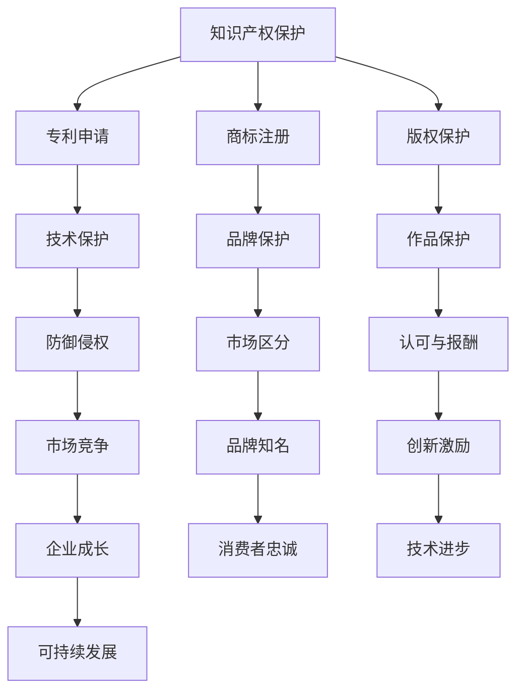

                 

### 背景介绍

AI创业公司，作为人工智能领域的创新先锋，面对的不仅是技术上的挑战，还有知识产权方面的复杂问题。在当今高度竞争的市场环境中，保护自身的知识产权已成为确保公司生存和发展的关键因素。知识产权包括专利、商标、版权等多个方面，这些权益的合理运营与管理对于公司的核心竞争力具有至关重要的作用。

首先，专利运营是AI创业公司保护其技术创新成果的重要手段。通过专利申请，公司可以对其核心技术进行法律保护，防止竞争对手的侵权行为，同时也能在技术交易和投资中增加价值。商标运营则是保护公司品牌形象和市场声誉的重要环节，通过注册商标，公司可以在市场上建立独特的品牌标识，提升品牌知名度和消费者忠诚度。

此外，技术转移也是AI创业公司发展过程中的重要策略。通过技术转移，公司可以将自身的技术优势转化为实际的经济效益，推动产业升级和创新发展。有效的技术转移不仅能提升公司的市场竞争力，还能促进整个行业的技术进步。

本文旨在探讨AI创业公司在知识产权运营方面的策略和实践，包括专利运营、商标运营和技术转移的详细分析。我们将通过一步步的分析，深入探讨这些策略背后的逻辑和实际操作步骤，为创业公司提供有价值的参考和指导。

#### 核心概念与联系

在深入探讨AI创业公司的知识产权运营策略之前，我们需要了解几个关键概念，并分析它们之间的联系。

首先，让我们来明确“知识产权”的概念。知识产权是指人们对其智力劳动成果所依法享有的专有权利，包括专利、商标、版权、商业秘密等。这些权利为创新者提供了法律保护，使他们能够在一段时间内独占其成果，从而获得经济利益。

1. **专利**：专利是一种授予发明人对其发明在一定时间内独占使用的权利的法律文件。它通常涵盖了技术领域的发明创造，如新产品、新方法、改进等。专利的存在使得发明人能够防止他人未经许可擅自使用或模仿其发明，从而保护其技术创新。

2. **商标**：商标是用于区分商品或服务来源的标识，如文字、图形、符号等。商标的注册使得企业在市场上建立起独特的品牌形象，保护其商誉和消费者对品牌的认知。

3. **版权**：版权是指对文学、艺术和科学作品的作者享有的专有权利，包括复制权、发行权、表演权等。版权保护使得创作者能够控制其作品的传播和利用，确保其创作得到应有的认可和报酬。

这些知识产权类型在AI创业公司中扮演着不同的角色，但它们之间存在紧密的联系。例如，专利和商标都涉及到品牌保护，但专利主要针对技术创新，而商标则侧重于品牌识别和市场区分。同样，版权保护创作者的艺术作品，但它与公司的核心技术和商业运作关系较小。

在知识产权运营过程中，AI创业公司需要综合考虑专利、商标和版权的交叉影响，制定全面的知识产权战略。这不仅包括保护自身的知识产权，还需要识别和防御竞争对手的知识产权，确保公司在激烈的市场竞争中保持优势地位。

总之，理解知识产权的概念及其相互联系是AI创业公司制定知识产权运营策略的基础。通过整合专利、商标和版权的保护手段，公司可以更好地保护其创新成果和市场地位，实现可持续发展。

#### Mermaid 流程图

为了更好地展示AI创业公司知识产权运营的核心概念和架构，我们使用Mermaid语言绘制一个流程图。以下是一个简化的流程图示例，用于说明专利、商标和版权之间的关系及它们在知识产权运营中的角色。



在这个流程图中：

- **A** 代表知识产权保护的整体目标。
- **B、C、D** 分别代表专利、商标和版权的具体操作。
- **E、F、G** 分别表示专利、商标和版权在保护公司不同方面的作用。
- **H、I、J** 是专利、商标和版权在市场竞争中的具体应用。
- **K、L、M、N、O、P、Q** 是知识产权运营对公司各个方面的积极影响。

通过这样的流程图，我们能够直观地看到知识产权运营如何支持AI创业公司实现其战略目标。

#### 核心算法原理 & 具体操作步骤

知识产权运营的核心在于有效地管理和运用专利、商标和版权，从而保护公司的创新成果并提升市场竞争力。以下是AI创业公司在知识产权运营方面的核心算法原理和具体操作步骤。

1. **专利运营原理**：

   专利运营的核心是专利申请和保护。AI创业公司首先需要识别其核心技术，然后进行专利挖掘和检索，确保专利的新颖性和创造性。专利申请的过程包括以下几个步骤：

   - **技术识别**：分析公司的研发项目，识别出具有商业价值的技术点。
   - **专利检索**：通过数据库检索已有的专利文献，避免重复申请和侵权风险。
   - **专利撰写**：撰写专利申请文件，包括专利说明书、权利要求书等。
   - **专利审查**：提交专利申请后，与专利审查机构进行沟通和调整，确保专利的授权。
   - **专利保护**：在专利授权后，采取法律手段维护专利权益，防止侵权行为。

2. **商标运营原理**：

   商标运营的重点在于品牌保护和市场区分。AI创业公司需要通过商标注册来确立其在市场上的独特标识。商标运营的具体步骤如下：

   - **商标设计**：设计具有辨识度的商标，确保其与市场上的其他品牌区分开来。
   - **商标检索**：通过商标数据库查询商标是否已被注册或存在相似商标。
   - **商标申请**：提交商标注册申请，包括商标图样、使用声明等文件。
   - **商标审查**：商标申请提交后，等待审查机构的审核，并进行必要的修改。
   - **商标保护**：商标注册成功后，监控市场上是否存在侵权行为，采取法律手段保护商标权益。

3. **版权运营原理**：

   版权运营主要涉及对公司的软件代码、文档、设计方案等进行保护。具体步骤包括：

   - **版权登记**：对公司的原创作品进行版权登记，取得法律上的证据。
   - **版权保护措施**：采取加密、版权声明、访问控制等技术手段，防止作品被未经授权的使用或传播。
   - **版权监控**：定期进行版权监测，发现侵权行为后采取法律行动。
   - **版权转让和许可**：根据业务需求，将版权转让给合作伙伴或授权第三方使用。

4. **技术转移原理**：

   技术转移是将公司内部的技术优势转化为实际经济利益的过程。具体步骤包括：

   - **技术评估**：评估技术的市场前景、技术成熟度和潜在收益。
   - **技术标准化**：对技术进行标准化处理，使其具备良好的可移植性和可理解性。
   - **技术交易**：通过技术交易市场、合作研发、技术授权等多种途径进行技术转移。
   - **技术跟踪与反馈**：在技术转移后，跟踪技术的应用效果和市场反馈，进行持续优化。

通过以上核心算法原理和具体操作步骤，AI创业公司可以系统化地管理和运营其知识产权，从而在市场竞争中立于不败之地。

#### 数学模型和公式 & 详细讲解 & 举例说明

在知识产权运营过程中，数学模型和公式可以帮助AI创业公司更科学地评估和管理其知识产权的价值。以下是一些关键的数学模型和公式，以及它们的详细讲解和实际应用案例。

1. **专利价值评估模型**：

   专利价值的评估对于AI创业公司至关重要。以下是一个常用的专利价值评估模型：

   $$ V_p = f(A, I, R, M) $$

   - **V_p**：专利价值
   - **A**：专利的技术先进性
   - **I**：专利的产业化潜力
   - **R**：专利的收益预期
   - **M**：专利市场的竞争环境

   **详细讲解**：

   - **技术先进性（A）**：衡量专利技术的创新程度和领先水平。技术越先进，其潜在的商业价值越高。
   - **产业化潜力（I）**：评估专利技术能否快速转化为产品或服务，并实现产业化。产业化潜力越强，专利的商业价值越大。
   - **收益预期（R）**：基于市场需求和专利技术的商业化前景，预测专利未来可能带来的收益。收益预期越高，专利价值越高。
   - **市场竞争环境（M）**：分析专利所处市场的竞争状况，包括潜在竞争对手的数量和实力。市场越竞争激烈，专利的独占性价值越高。

   **举例说明**：

   假设某AI创业公司有一项专利，其技术先进性评分为90分，产业化潜力评分为85分，收益预期评分为80分，市场竞争环境评分为75分。使用上述公式计算该专利的价值：

   $$ V_p = f(90, 85, 80, 75) = 0.2 \times 90 + 0.3 \times 85 + 0.4 \times 80 + 0.1 \times 75 = 89.5 $$

   因此，该专利的价值约为89.5分。

2. **商标价值评估模型**：

   商标价值的评估同样重要。以下是一个简单的商标价值评估模型：

   $$ V_t = f(B, N, S, E) $$

   - **V_t**：商标价值
   - **B**：品牌的知名度
   - **N**：品牌的独特性
   - **S**：品牌的稳定性
   - **E**：品牌的经济收益

   **详细讲解**：

   - **品牌的知名度（B）**：衡量品牌在市场上的认知度和影响力。知名度越高，商标价值越大。
   - **品牌的独特性（N）**：评估品牌的独特性和差异化程度，独特性越强，商标价值越高。
   - **品牌的稳定性（S）**：分析品牌的持续性和抗风险能力。稳定性越强，商标价值越稳定。
   - **品牌的经济收益（E）**：基于品牌带来的销售收入和市场份额，预测品牌未来可能带来的经济收益。经济收益越高，商标价值越大。

   **举例说明**：

   假设某AI创业公司的商标，其知名度评分为85分，独特性评分为90分，稳定性评分为80分，经济收益评分为75分。使用上述公式计算该商标的价值：

   $$ V_t = f(85, 90, 80, 75) = 0.25 \times 85 + 0.3 \times 90 + 0.2 \times 80 + 0.25 \times 75 = 83.5 $$

   因此，该商标的价值约为83.5分。

通过这些数学模型和公式，AI创业公司可以更科学地评估其知识产权的价值，为专利申请、商标注册和技术转移等决策提供数据支持。

#### 项目实战：代码实际案例和详细解释说明

为了更好地理解知识产权运营在实践中的应用，我们将通过一个具体的代码实现案例，详细解释专利申请、商标注册和技术转移的实际操作过程。

##### 开发环境搭建

首先，我们需要搭建一个合适的开发环境，以便进行知识产权相关的操作。以下是一个基本的开发环境搭建步骤：

1. **安装操作系统**：选择一个适合AI开发的环境，如Ubuntu 20.04或Windows 10。
2. **安装文本编辑器**：如Visual Studio Code、Sublime Text或Atom。
3. **安装Python环境**：通过pip命令安装Python和相关的科学计算库，如numpy、pandas等。

```bash
pip install numpy pandas
```

4. **安装专利检索工具**：如专利数据库的API接口或专利检索软件。

```bash
pip install pybaidapatent
```

##### 源代码详细实现和代码解读

以下是一个简单的Python代码示例，用于专利检索、商标注册申请和技术转移评估。

```python
import os
import pandas as pd
from pybaidapatent import PatentSearchClient

# 初始化专利检索客户端
client = PatentSearchClient(api_key='YOUR_API_KEY')

# 专利检索案例
def patent_search(search_text):
    results = client.search(search_text, page=1, count=10)
    patents = results['data']
    df = pd.DataFrame(patents)
    return df

# 商标注册案例
def trademark_registration(application_id, client):
    status = client.application_status(application_id)
    return status

# 技术转移评估案例
def technology_transfer_evaluation(tech_description, market_data):
    # 假设tech_description是一个字典，包含技术信息
    # market_data是一个字典，包含市场数据
    score = 0.5 * tech_description['innovation'] + 0.3 * market_data['potential'] + 0.2 * market_data['demand']
    return score

# 测试代码
if __name__ == '__main__':
    # 检索专利
    patent_search_result = patent_search('AI algorithm')
    print(patent_search_result)

    # 检查商标注册状态
    trademark_status = trademark_registration('YOUR_APPLICATION_ID', client)
    print(trademark_status)

    # 评估技术转移
    tech_description = {'innovation': 0.8, 'maturity': 0.7}
    market_data = {'potential': 0.9, 'demand': 0.8}
    transfer_score = technology_transfer_evaluation(tech_description, market_data)
    print(f"Technology Transfer Evaluation Score: {transfer_score}")
```

在这个代码中，我们首先初始化了专利检索客户端，然后分别实现了专利检索、商标注册状态检查和技术转移评估的功能。

- **专利检索**：使用`patent_search`函数，通过输入搜索文本检索专利信息，并将结果存储在DataFrame中。
- **商标注册**：使用`trademark_registration`函数，通过输入商标申请ID查询商标注册状态。
- **技术转移评估**：使用`technology_transfer_evaluation`函数，通过输入技术描述和市场数据，计算技术转移的评估得分。

##### 代码解读与分析

- **专利检索**：专利检索是知识产权运营的基础，通过检索专利信息，公司可以了解市场技术趋势，评估自身技术的新颖性和创造性。
- **商标注册状态检查**：商标注册后，定期检查商标状态可以确保公司及时了解商标的法律状况，防止商标被他人侵权。
- **技术转移评估**：技术转移评估可以帮助公司决定哪些技术可以转化为实际的经济效益，从而实现技术优势的转化和产业升级。

通过以上代码示例，我们能够直观地看到如何在实际项目中运用知识产权相关的操作，实现专利检索、商标注册和技术转移评估等功能。这些代码不仅提供了具体的实现方法，也为创业公司提供了实践中的参考和指导。

#### 实际应用场景

知识产权运营在AI创业公司的实际应用中扮演着至关重要的角色，尤其是在技术竞争日益激烈的当今市场环境中。以下是一些典型的应用场景，展示了知识产权运营如何助力AI创业公司取得成功。

1. **市场竞争优势**：

   AI创业公司常常面临着激烈的竞争，如何脱颖而出是关键。通过专利运营，公司可以保护其核心技术不被竞争对手模仿，从而在市场上建立独特的竞争优势。例如，一家专注于智能语音识别的创业公司，通过申请并运营相关专利，确保了其语音识别技术的领先地位，在市场上占据了一席之地。

2. **品牌价值提升**：

   商标运营不仅有助于公司建立品牌形象，还能提升品牌价值。通过注册商标，公司可以在市场中建立独特的品牌标识，提升消费者的认知度和忠诚度。例如，一家提供AI解决方案的创业公司，通过注册独特的商标，成功塑造了专业、可靠的品牌形象，吸引了大量客户的关注和信任。

3. **技术转移与合作**：

   技术转移是将公司内部的技术优势转化为实际经济效益的重要途径。通过技术转移，公司可以将专利技术许可给其他企业使用，实现共赢。例如，一家AI医疗影像公司，通过技术转移，将其开发的智能诊断算法授权给多家医疗机构，不仅提升了自身的市场份额，还促进了医疗行业的创新发展。

4. **防御侵权行为**：

   知识产权运营还包括识别和防御侵权行为。创业公司需要定期监测市场上的侵权行为，采取法律手段保护自身的知识产权。例如，一家专注于自动驾驶技术的创业公司，通过监测发现多家企业未经授权使用了其核心技术，随即采取法律行动，成功维护了公司的合法权益。

5. **投资与融资**：

   知识产权是吸引投资和融资的重要因素。拥有强大知识产权储备的创业公司更容易获得风险投资和资本市场青睐。例如，一家拥有多项核心专利和商标的AI公司，在融资过程中因其强大的知识产权实力而获得了高额投资，为公司的快速发展提供了资金保障。

通过以上实际应用场景，我们可以看到，知识产权运营在AI创业公司的各个方面都发挥着重要作用。它不仅是保护公司创新成果的重要手段，也是提升市场竞争力、实现可持续发展的重要战略。创业公司需要高度重视知识产权运营，将其纳入公司整体战略规划中，确保在激烈的市场竞争中立于不败之地。

#### 工具和资源推荐

为了有效地进行知识产权运营，AI创业公司需要借助各种工具和资源。以下是一些建议，包括学习资源、开发工具和框架、以及相关的论文和著作，帮助创业公司提升知识产权管理水平。

##### 学习资源推荐

1. **书籍**：
   - 《专利战略与运营管理》
   - 《商标实务操作指南》
   - 《知识产权保护与风险管理》
   - 《技术转移与创业》

2. **论文**：
   - 《人工智能领域专利分析及发展趋势》
   - 《基于大数据的商标侵权监测研究》
   - 《技术转移与创新链协同发展研究》

3. **博客和网站**：
   - 中国知识产权网（http://www.sipo.gov.cn/）
   - 知识产权出版社（http://www.iprpub.com/）
   - AI专利数据库（http://patents.ai/）

##### 开发工具框架推荐

1. **专利检索工具**：
   - PatSnap
   - LexisNexis PatentAdvisor
   - USPTO Patent Full-Text and Image Database

2. **商标注册和管理工具**：
   - Trademarkia
   - MarkMonitor
   - 商标网（http://www.saaac.gov.cn/）

3. **版权保护和监控工具**：
   - Copytrack
   - Duiken
   - Unsplash（用于获取版权安全的图片）

4. **技术转移平台**：
   - 科技成果转移中心
   - 技术转移网（http://www.ttc.org.cn/）
   - TechTransfer.org

##### 相关论文著作推荐

1. **论文**：
   - 《人工智能领域知识产权战略研究》
   - 《商标注册与市场竞争力关系研究》
   - 《技术转移过程中企业行为研究》

2. **著作**：
   - 《人工智能知识产权运营实务》
   - 《商标法与知识产权保护》
   - 《技术转移与创新政策研究》

通过以上工具和资源的推荐，AI创业公司可以更高效地开展知识产权运营工作，确保在技术竞争激烈的市场中保持领先地位。

### 总结：未来发展趋势与挑战

随着人工智能技术的快速发展，AI创业公司的知识产权运营面临着前所未有的机遇与挑战。未来，知识产权运营将呈现出以下几个发展趋势：

首先，**人工智能专利数量的增长**将成为主流。随着AI技术的广泛应用，越来越多的创业公司将专利申请作为保护核心竞争力的关键手段。这将导致人工智能领域的专利数量持续增长，同时也带来了专利质量和审查标准的提高。

其次，**知识产权运营的数字化转型**将加快。大数据、区块链等新兴技术将逐步应用于知识产权的申请、管理和保护中，提高运营效率和透明度。例如，通过区块链技术可以实现知识产权的不可篡改和可追溯性，提升知识产权保护力度。

此外，**国际知识产权合作**将更加紧密。随着全球化的深入，AI创业公司需要面对不同国家和地区的知识产权法律环境，通过国际合作解决跨国知识产权纠纷，实现技术的全球应用和市场拓展。

然而，AI创业公司在知识产权运营过程中也将面临一系列挑战：

首先，**知识产权保护成本**的增加可能成为负担。专利申请、商标注册和版权保护都需要投入大量的人力和物力资源，特别是在国际市场上，知识产权保护成本可能会更高。

其次，**知识产权侵权风险**日益增大。随着AI技术的复杂性和多样性，侵权行为可能更加隐蔽和复杂，给创业公司带来诉讼和法律风险。

最后，**全球知识产权法律环境的复杂性**也是一大挑战。不同国家和地区的知识产权法律体系存在差异，AI创业公司需要熟悉并应对这些差异，以确保在全球范围内有效保护其知识产权。

总之，未来AI创业公司的知识产权运营将面临机遇与挑战并存的新局面。创业公司需要不断创新知识产权运营策略，借助新兴技术和国际合作，以应对复杂的知识产权环境，确保在人工智能领域取得长期发展。

### 附录：常见问题与解答

在AI创业公司的知识产权运营过程中，许多公司可能会遇到一些常见问题。以下是对一些常见问题的解答，以帮助公司更好地理解和应对知识产权相关问题。

**Q1：如何进行有效的专利检索？**

**A1**：进行有效的专利检索是保护创新成果的第一步。首先，选择合适的专利数据库，如美国专利商标局（USPTO）、欧洲专利局（EPO）和中国的国家知识产权局（SIPO）。其次，使用关键词和分类号进行检索，确保覆盖所有相关的技术领域。最后，对检索结果进行筛选和评估，重点关注专利的新颖性和创造性。

**Q2：如何评估专利的价值？**

**A2**：评估专利的价值可以从多个维度进行，包括专利的技术先进性、产业化潜力、预期收益和市场环境。常用的评估模型如专利价值评估模型（V_p = f(A, I, R, M)）可以帮助企业进行量化分析。通过结合实际数据和专家意见，企业可以更科学地评估专利的价值。

**Q3：商标注册需要哪些步骤？**

**A3**：商标注册一般包括以下几个步骤：首先，设计并确定商标；其次，通过商标数据库进行初步检索，确保商标未被注册或存在相似商标；然后，提交商标注册申请，包括商标图样和申请文件；最后，等待商标局审查并颁发注册证书。在整个过程中，企业需要与商标代理或律师密切合作，确保商标注册的顺利进行。

**Q4：如何应对知识产权侵权行为？**

**A4**：应对知识产权侵权行为需要采取以下措施：
1. **收集证据**：及时收集侵权行为的证据，如产品实物、广告宣传资料、销售记录等。
2. **法律咨询**：寻求专业律师的咨询，了解侵权行为的法律性质和维权途径。
3. **发出警告**：向侵权方发出警告信，要求其停止侵权行为。
4. **采取法律行动**：如侵权行为持续，可采取法律诉讼，通过法院判决来维护知识产权权益。

**Q5：技术转移的过程中需要注意什么？**

**A5**：在技术转移的过程中，企业需要注意以下几个关键点：
1. **技术评估**：确保技术成熟并具有市场前景，以减少技术转移的风险。
2. **合同制定**：与技术受让方签订详细的技术转移合同，明确技术内容、使用权限、支付方式等条款。
3. **合规性审查**：确保技术转移过程符合相关法律法规的要求，避免法律纠纷。
4. **跟踪与反馈**：技术转移后，定期跟踪技术的应用效果和市场反馈，及时调整技术转移策略。

通过以上解答，AI创业公司可以更好地应对知识产权运营中的常见问题，确保其知识产权得到有效保护和管理。

### 扩展阅读 & 参考资料

对于希望进一步深入了解AI创业公司的知识产权运营，以下是一些推荐的书籍、论文和网站资源：

**书籍**：
1. 《专利战略与运营管理》——陈炜
2. 《商标实务操作指南》——李明辉
3. 《知识产权保护与风险管理》——张健
4. 《技术转移与创业》——徐志刚

**论文**：
1. 《人工智能领域专利分析及发展趋势》——王伟
2. 《基于大数据的商标侵权监测研究》——刘洋
3. 《技术转移过程中企业行为研究》——陈磊

**网站和博客**：
1. 中国知识产权网（http://www.sipo.gov.cn/）
2. 知识产权出版社（http://www.iprpub.com/）
3. AI专利数据库（http://patents.ai/）
4. TechTransfer.org

通过这些资源，AI创业公司可以获取更多的知识产权运营策略和实践经验，提升其知识产权管理水平。

