                 

### 背景介绍

人工智能（AI）技术的发展已经走过了几十年的历程，从最初的简单规则系统到今天的深度学习和神经网络，AI的进步可谓日新月异。与此同时，创业环境也在不断优化，政府、企业和社会各界的支持力度不断增强，为AI创业提供了丰富的机遇。本文旨在探讨AI在垂直领域的无限创业机会，分析其背后的技术原理、市场前景以及创业者的潜在挑战。

近年来，AI在各个行业的应用已经从理论走向实践，不仅改变了传统的商业模式，还催生了许多新兴的垂直领域。例如，医疗保健、金融科技、教育、零售、制造等行业都在积极拥抱AI技术，以提升效率和用户体验。这种趋势不仅体现在大企业中，也吸引了众多初创企业的加入。

本文将围绕以下几个核心问题展开讨论：

1. **AI技术如何应用于垂直领域？**
2. **这些应用领域有哪些具体的创业机会？**
3. **创业者需要具备哪些技能和资源来抓住这些机会？**
4. **面对市场竞争和法规政策，创业者应如何应对？**

通过深入分析这些主题，本文希望为读者提供全面的视角，帮助他们更好地理解AI在垂直领域的创业潜力，并探索实现商业成功的路径。

### 核心概念与联系

为了深入探讨AI在垂直领域的应用，我们需要先了解一些核心概念，包括AI的基本原理、垂直领域的特点以及它们之间的联系。以下是一个详细的Mermaid流程图，用于展示这些核心概念和它们之间的相互关系。

```mermaid
graph TB
A[人工智能基础技术] --> B[机器学习算法]
A --> C[深度学习框架]
B --> D[数据预处理]
B --> E[模型评估与优化]
C --> F[神经网络结构]
C --> G[模型训练与部署]
D --> H[数据获取与清洗]
D --> I[数据标注与注释]
E --> J[准确率与召回率]
E --> K[模型解释性]
F --> L[卷积神经网络]
F --> M[循环神经网络]
G --> N[模型推理与预测]
G --> O[模型调优与迭代]
H --> P[公开数据集]
H --> Q[商业数据源]
I --> R[人工标注]
I --> S[自动化标注]
J --> T[混淆矩阵]
J --> U[ROC曲线]
K --> V[模型可解释性工具]
K --> W[黑盒模型分析]
L --> X[图像识别]
L --> Y[自然语言处理]
M --> Z[语音识别]
M --> AA[对话系统]
N --> BB[实时预测]
N --> CC[历史数据分析]
O --> DD[在线学习]
O --> EE[迁移学习]
P --> FF[数据集应用]
Q --> GG[行业数据应用]
R --> HH[标注数据质量]
S --> II[标注效率]
T --> JJ[模型性能评估]
U --> KK[模型可靠性评估]
V --> LL[模型解释力提升]
W --> MM[模型安全性分析]
X --> NN[医疗影像分析]
X --> OO[自动驾驶技术]
Y --> PP[金融风控系统]
Y --> QQ[智能客服系统]
Z --> RR[智能语音助手]
Z --> SS[智能语音交互]
AA --> TT[智能语音客服]
AA --> UU[智能语音导航]
BB --> VV[实时股市预测]
BB --> WW[智能交通管理]
CC --> XX[客户行为分析]
CC --> YY[市场趋势预测]
DD --> ZZ[在线广告优化]
EE --> AAA[新模型开发]
FF --> BBB[数据集优化]
GG --> CCC[行业应用扩展]
HH --> DDD[标注数据质量控制]
II --> EEE[自动化标注技术]
JJ --> FFF[模型调优策略]
KK --> GGG[模型可靠性保障]
LL --> HHH[模型解释性提升]
MM --> III[模型安全性提升]
NN --> JJJ[医疗诊断系统]
NN --> KKK[医学影像分析]
OO --> LLL[无人驾驶汽车]
OO --> MMM[自动驾驶无人机]
PP --> NNN[信用风险评估]
PP --> OOO[欺诈检测系统]
QQ --> PPP[客服系统优化]
QQ --> QQ[教育辅助系统]
RR --> SSS[智能家居控制]
RR --> TTT[智能语音提醒]
SS --> UUU[智能语音控制]
SS --> VVV[智能语音识别]
TT --> WWW[智能语音客服]
TT --> XXX[智能语音交互]
UU --> YYY[智能导航系统]
UU --> ZZZ[智能语音翻译]
VV --> AAA[实时数据预测]
VV --> BBB[历史数据挖掘]
WW --> CCC[交通流量预测]
WW --> DDD[交通信号优化]
XX --> EEE[客户行为分析]
XX --> FFF[市场趋势预测]
YY --> GGG[用户行为分析]
YY --> HHH[个性化推荐系统]
ZZ --> III[实时预测模型]
ZZ --> JJJ[数据分析平台]
ZZ --> KKK[机器学习应用]
AAA --> LLL[新模型验证]
AAA --> MMM[新算法研究]
BBBB --> CCC[数据集质量提升]
BBBB --> DDD[数据集扩展应用]
CCCC --> EEE[行业应用案例]
CCCC --> FFF[行业解决方案]
DDDD --> GGG[自动化标注流程]
DDDD --> HHH[标注数据质量监控]
EEEE --> IIII[在线学习策略]
EEEE --> JJJ[迁移学习应用]
FFFF --> KKK[数据集优化技术]
FFFF --> LLL[数据集应用场景]
GGGG --> MMMM[行业应用案例]
GGGG --> NNNN[行业解决方案]
HHHH --> IJJJ[标注数据质量控制]
HHHH --> JJJ[标注效率优化]
IIII --> KKK[在线学习优化]
IIII --> LLL[实时数据预测模型]
JJJJ --> MMM[模型调优策略]
JJJJ --> NNN[模型解释性提升]
KKKK --> OOOO[模型安全性分析]
KKKK --> PPPP[模型可靠性保障]
LLLL --> QQQQ[模型解释力提升]
LLLL --> RRRR[模型安全性提升]
MMMM --> SSSS[医疗诊断系统]
MMMM --> TTTT[医学影像分析]
NNNN --> UUUU[自动驾驶技术]
NNNN --> VVVV[无人驾驶汽车]
PPPP --> WWW[金融风险管理系统]
PPPP --> XXXX[欺诈检测技术]
QQQQ --> YYY[智能客服系统]
QQQQ --> ZZZ[教育辅助系统]
SSSS --> AAAA[智能家居控制系统]
SSSS --> BBBB[智能语音提醒]
TTTT --> CCC[智能语音交互]
TTTT --> DDD[智能语音导航]
UUUU --> EEEE[智能语音控制]
UUUU --> FFFF[智能语音识别]
VVVV --> GGGG[实时语音预测]
VVVV --> HHHH[历史语音数据分析]
WWWW --> IIII[实时数据预测]
WWWW --> JJJJ[历史数据挖掘]
XXXX --> KKKK[用户行为分析]
XXXX --> LLLL[个性化推荐系统]
YYYY --> MMMM[实时语音预测]
YYYY --> NNNN[历史语音数据分析]
ZZZZ --> OOOO[实时预测模型]
ZZZZ --> PPPP[数据分析平台]
ZZZZ --> QQQQ[机器学习应用]
```



在这个流程图中，我们可以看到以下几个关键环节：

1. **人工智能基础技术（A）**：这是整个流程的起点，包括机器学习算法（B）和深度学习框架（C），它们是AI应用的核心。

2. **数据预处理（D）**：包括数据获取与清洗（H和I），以及数据标注与注释（R和S），这是确保AI模型训练数据质量的重要步骤。

3. **模型评估与优化（E）**：包括准确率与召回率（J）、模型解释性（K）、神经网络结构（F）、模型训练与部署（G）等，这些步骤帮助提升AI模型的表现。

4. **具体应用领域（X、Y、Z等）**：例如医疗影像分析（NN）、自然语言处理（PP）、语音识别（ZZ）等，展示了AI技术在各个垂直领域的应用。

通过这个流程图，我们可以清晰地看到AI在垂直领域应用的各个环节是如何相互联系和协同工作的。这种联系不仅帮助我们理解AI技术的复杂性和多样性，也为创业者提供了宝贵的启示。

### 核心算法原理 & 具体操作步骤

在理解了AI技术的核心概念及其在垂直领域的应用之后，接下来我们将深入探讨AI技术的核心算法原理，并详细介绍这些算法的具体操作步骤。核心算法包括机器学习算法、深度学习框架和神经网络结构，它们是AI应用的技术基石。

#### 1. 机器学习算法

机器学习算法可以分为监督学习、无监督学习和半监督学习三类。以下是这三种算法的基本原理和具体操作步骤：

##### 监督学习（Supervised Learning）

**基本原理**：监督学习算法通过学习已知输入和输出之间的关系，来预测未知数据的结果。常见的监督学习算法包括线性回归（Linear Regression）、逻辑回归（Logistic Regression）、决策树（Decision Tree）、随机森林（Random Forest）和支持向量机（SVM）。

**操作步骤**：
1. **数据收集**：收集包含特征和标签的数据集。
2. **数据预处理**：清洗数据，包括缺失值填充、异常值处理和特征标准化。
3. **模型选择**：根据问题的性质选择合适的模型。
4. **模型训练**：使用训练数据集训练模型。
5. **模型评估**：使用验证集评估模型性能。
6. **模型优化**：根据评估结果调整模型参数。
7. **预测**：使用训练好的模型对新的数据进行预测。

##### 无监督学习（Unsupervised Learning）

**基本原理**：无监督学习算法在未知标签的情况下，通过分析数据特征，来发现数据中的规律和模式。常见的无监督学习算法包括聚类（Clustering）、降维（Dimensionality Reduction）和关联规则学习（Association Rule Learning）。

**操作步骤**：
1. **数据收集**：收集无标签的数据集。
2. **数据预处理**：清洗数据，包括缺失值填充、异常值处理和特征标准化。
3. **模型选择**：根据问题的性质选择合适的模型。
4. **模型训练**：使用无标签数据训练模型。
5. **模型评估**：评估模型是否发现了数据中的规律。
6. **模型优化**：根据评估结果调整模型参数。
7. **结果分析**：分析模型发现的数据规律和模式。

##### 半监督学习（Semi-supervised Learning）

**基本原理**：半监督学习算法结合了监督学习和无监督学习的方法，利用少量的标注数据和大量的无标注数据来训练模型。常见的半监督学习算法包括自编码器（Autoencoder）和图神经网络（Graph Neural Networks）。

**操作步骤**：
1. **数据收集**：收集包含少量标注数据和大量无标注数据的集合。
2. **数据预处理**：清洗数据，包括缺失值填充、异常值处理和特征标准化。
3. **模型选择**：根据问题的性质选择合适的模型。
4. **模型训练**：使用标注数据和生成的伪标签训练模型。
5. **模型评估**：评估模型性能。
6. **模型优化**：根据评估结果调整模型参数。
7. **预测**：使用训练好的模型对新的数据进行预测。

#### 2. 深度学习框架

深度学习框架是实施深度学习算法的工具，常见的深度学习框架包括TensorFlow、PyTorch和Keras等。以下是这些框架的基本原理和具体操作步骤：

**基本原理**：
- **TensorFlow**：由Google开发，是一个开源的深度学习框架，支持多种类型的神经网络。
- **PyTorch**：由Facebook开发，是一个基于Python的深度学习框架，易于使用且具有灵活性。
- **Keras**：是一个高级神经网络API，可以与TensorFlow和Theano等后端兼容。

**操作步骤**：
1. **环境搭建**：安装所需的软件包和依赖库。
2. **数据准备**：加载并预处理数据。
3. **模型设计**：设计深度学习模型，包括选择合适的架构、优化器和损失函数。
4. **模型训练**：使用训练数据集训练模型。
5. **模型评估**：使用验证集评估模型性能。
6. **模型优化**：调整模型参数和架构，以提升模型性能。
7. **模型部署**：将训练好的模型部署到生产环境，用于预测和实际应用。

#### 3. 神经网络结构

神经网络结构是深度学习的核心组成部分，包括输入层、隐藏层和输出层。以下是神经网络的基本原理和具体操作步骤：

**基本原理**：
- **输入层**：接收输入数据。
- **隐藏层**：进行特征提取和变换。
- **输出层**：生成预测结果。

**操作步骤**：
1. **设计网络结构**：确定网络的层数和每层的神经元数量。
2. **初始化参数**：包括权重和偏置。
3. **前向传播**：将输入数据通过网络，计算输出。
4. **反向传播**：计算损失，并更新网络参数。
5. **迭代训练**：重复前向传播和反向传播，直到达到预定的训练目标。

通过以上步骤，我们可以理解并运用机器学习算法、深度学习框架和神经网络结构，为垂直领域应用提供强大的技术支持。接下来，我们将进一步探讨这些算法在具体应用场景中的实现和操作。

### 数学模型和公式 & 详细讲解 & 举例说明

在深入探讨AI技术的数学模型和公式时，我们将结合具体的算法和应用场景，详细讲解这些模型的基本原理、公式以及如何进行实际操作。以下是几个核心数学模型及其应用的讲解。

#### 1. 机器学习中的线性回归

**基本原理**：线性回归是一种预测连续值的监督学习算法，它假设输出值和输入特征之间存在线性关系。其公式如下：

\[ y = \beta_0 + \beta_1 \cdot x \]

其中，\( y \) 是输出值，\( x \) 是输入特征，\( \beta_0 \) 是截距，\( \beta_1 \) 是斜率。

**举例说明**：假设我们想要预测房价，其中输入特征是房屋面积（x），输出值是房价（y）。我们可以通过收集房屋面积和对应的房价数据，使用线性回归模型来建立预测关系。

**操作步骤**：
1. **数据收集**：收集房屋面积和房价数据。
2. **数据预处理**：清洗数据，确保没有缺失值和异常值。
3. **模型训练**：使用训练数据集计算斜率（\(\beta_1\)）和截距（\(\beta_0\)）。
4. **模型评估**：使用验证集评估模型性能。
5. **模型优化**：调整模型参数，如增加特征或使用不同的优化算法。
6. **预测**：使用训练好的模型对新的数据进行预测。

**公式**：

\[ \beta_1 = \frac{\sum (x_i - \bar{x})(y_i - \bar{y})}{\sum (x_i - \bar{x})^2} \]
\[ \beta_0 = \bar{y} - \beta_1 \cdot \bar{x} \]

其中，\(\bar{x}\) 和 \(\bar{y}\) 分别是输入特征和输出值的平均值。

#### 2. 深度学习中的反向传播算法

**基本原理**：反向传播（Backpropagation）是深度学习中最核心的算法之一，用于训练神经网络。它通过计算梯度来更新网络权重和偏置，从而最小化损失函数。

**操作步骤**：
1. **前向传播**：计算网络输出并计算损失。
2. **反向传播**：计算各层的梯度，并更新权重和偏置。
3. **迭代训练**：重复前向传播和反向传播，直到达到预定的训练目标。

**公式**：

\[ \frac{\partial L}{\partial w} = \sum_{i} \frac{\partial L}{\partial z_i} \cdot \frac{\partial z_i}{\partial w} \]
\[ \frac{\partial L}{\partial b} = \sum_{i} \frac{\partial L}{\partial z_i} \cdot \frac{\partial z_i}{\partial b} \]

其中，\(L\) 是损失函数，\(w\) 和 \(b\) 分别是权重和偏置，\(z_i\) 是每个神经元的输出。

#### 3. 自然语言处理中的词嵌入（Word Embedding）

**基本原理**：词嵌入是将单词映射到高维向量空间，以表示单词的语义信息。常见的方法包括Word2Vec、GloVe等。

**操作步骤**：
1. **数据收集**：收集大量文本数据。
2. **数据预处理**：分词、去除停用词、标记化等。
3. **模型训练**：使用预训练模型或自定义模型训练词嵌入向量。
4. **模型应用**：将词嵌入向量用于自然语言处理任务，如文本分类、情感分析等。

**公式**：

\[ \text{vec}(w) = \sum_{i=1}^{N} f(w_i) \cdot e_i \]

其中，\(\text{vec}(w)\) 是单词\(w\)的向量表示，\(f(w_i)\) 是单词\(w_i\)的词频，\(e_i\) 是嵌入向量。

#### 4. 图神经网络（Graph Neural Networks）

**基本原理**：图神经网络用于处理图结构数据，通过节点和边的特征来预测节点属性或图结构。

**操作步骤**：
1. **图表示**：将图数据转换为节点和边的特征表示。
2. **模型设计**：设计适合图结构的神经网络模型。
3. **模型训练**：使用图数据训练模型。
4. **模型评估**：评估模型性能。
5. **模型应用**：将训练好的模型用于图分析任务。

**公式**：

\[ h_{t+1}^{(i)} = \sigma \left( \sum_{j \in N(i)} W^{(l)} h_t^{(j)} + b^{(l)} + \sum_{k \in N(N(i))} W^{(l+1)} h_t^{(k)} \right) \]

其中，\(h_t^{(i)}\) 是第\(t\)个时间步第\(i\)个节点的隐藏状态，\(N(i)\) 是节点\(i\)的邻居节点集合，\(\sigma\) 是激活函数，\(W^{(l)}\) 和 \(b^{(l)}\) 分别是权重和偏置。

通过这些数学模型和公式，我们可以更好地理解和应用AI技术，从而在垂直领域实现创新和突破。接下来，我们将通过实际项目案例来进一步探讨这些技术在实际开发中的应用。

### 项目实战：代码实际案例和详细解释说明

为了更好地展示AI技术在垂直领域的实际应用，我们将通过一个具体的代码案例来详细解释实现过程。本案例将探讨如何使用深度学习框架PyTorch实现一个自然语言处理任务——情感分析。

#### 1. 开发环境搭建

在开始编码之前，我们需要搭建合适的开发环境。以下是所需的步骤：

- **安装Python**：确保Python版本在3.6及以上。
- **安装PyTorch**：可以通过以下命令安装：
  ```bash
  pip install torch torchvision
  ```
- **安装其他依赖**：包括Numpy、Pandas、Scikit-learn等。
  ```bash
  pip install numpy pandas scikit-learn
  ```

#### 2. 源代码详细实现和代码解读

以下是一个简化的情感分析项目代码示例，包括数据准备、模型定义、训练和评估等步骤。

```python
import torch
import torch.nn as nn
import torch.optim as optim
from torchtext.legacy import data
from torchtext.legacy import datasets

# 数据准备
TEXT = data.Field(tokenize='spacy', lower=True, include_lengths=True)
LABEL = data.LabelField()

# 加载数据集
train_data, test_data = datasets.IMDB.splits(TEXT, LABEL)

# 构建词汇表
TEXT.build_vocab(train_data, max_size=25000, vectors="glove.6B.100d")
LABEL.build_vocab()

# 划分训练集和验证集
train_data, valid_data = train_data.split()

# 定义模型
class SentimentClassifier(nn.Module):
    def __init__(self, embedding_dim, hidden_dim, output_dim, vocab_size, embedding_matrix):
        super().__init__()
        self.embedding = nn.Embedding(vocab_size, embedding_dim)
        self.embedding.weight.data.copy_(embedding_matrix)
        self.embedding.requires_grad = False
        
        self.rnn = nn.LSTM(embedding_dim, hidden_dim)
        self.fc = nn.Linear(hidden_dim, output_dim)
        
    def forward(self, text, text_lengths):
        embedded = self.embedding(text)
        packed_embedded = nn.utils.rnn.pack_padded_sequence(embedded, text_lengths.to('cpu'), batch_first=True)
        packed_output, (hidden, cell) = self.rnn(packed_embedded)
        hidden = hidden.squeeze(0)
        out = self.fc(hidden)
        return out

# 加载预训练的词嵌入
PRETRAINED_EMBEDDINGS = TEXT.vocab.vectors
EMBEDDING_DIM = 100
HIDDEN_DIM = 128
OUTPUT_DIM = 1

# 实例化模型
model = SentimentClassifier(EMBEDDING_DIM, HIDDEN_DIM, OUTPUT_DIM, len(TEXT.vocab), PRETRAINED_EMBEDDINGS)

# 定义损失函数和优化器
loss_fn = nn.BCEWithLogitsLoss()
optimizer = optim.Adam(model.parameters())

# 训练模型
def train(model, train_data, valid_data, loss_fn, optimizer, num_epochs=10):
    model.train()
    for epoch in range(num_epochs):
        for batch in train_data:
            optimizer.zero_grad()
            text, text_lengths = batch.text
            predictions = model(text, text_lengths).squeeze(1)
            loss = loss_fn(predictions, batch.label)
            loss.backward()
            optimizer.step()
            
        print(f"Epoch: {epoch+1}, Loss: {loss.item()}")

# 评估模型
def evaluate(model, valid_data, loss_fn):
    model.eval()
    with torch.no_grad():
        for batch in valid_data:
            text, text_lengths = batch.text
            predictions = model(text, text_lengths).squeeze(1)
            loss = loss_fn(predictions, batch.label)
            print(f"Validation Loss: {loss.item()}")

# 执行训练和评估
train(model, train_data, valid_data, loss_fn, optimizer)
evaluate(model, valid_data, loss_fn)
```

#### 3. 代码解读与分析

- **数据准备**：我们使用IMDb电影评论数据集进行训练和评估。数据集已经被分为训练集和验证集，我们只需加载并处理数据。

- **词汇表构建**：使用`TEXT.build_vocab`和`LABEL.build_vocab`来构建词汇表。`TEXT`字段使用`spacy`进行分词和下标化，并设置了最大词汇量和预训练词嵌入。

- **模型定义**：`SentimentClassifier`是一个简单的RNN模型，包括嵌入层、LSTM层和全连接层。嵌入层使用预训练的GloVe词嵌入，LSTM用于提取文本特征，全连接层用于分类。

- **损失函数和优化器**：我们使用`BCEWithLogitsLoss`来处理二分类问题，并使用`Adam`优化器来更新模型参数。

- **训练过程**：`train`函数用于训练模型，它遍历训练数据，计算损失，并更新模型参数。

- **评估过程**：`evaluate`函数用于评估模型性能，它计算验证集上的平均损失。

通过这个案例，我们展示了如何使用PyTorch实现一个情感分析模型。这个过程包括数据准备、模型定义、训练和评估等步骤，是理解AI在自然语言处理垂直领域应用的重要实践。

### 实际应用场景

AI技术在垂直领域的应用已经极大地改变了行业的运作方式，带来了前所未有的变革。以下是一些典型的实际应用场景，展示了AI如何在不同领域实现商业价值和用户满意度。

#### 1. 医疗保健

在医疗保健领域，AI技术被广泛应用于疾病预测、诊断和个性化治疗。例如，通过深度学习算法分析医疗影像，AI可以辅助医生进行早期癌症筛查，提高诊断准确率。此外，AI还可以通过分析患者的电子健康记录和基因数据，为患者提供个性化的治疗方案。

**案例**：谷歌DeepMind的AI系统能够在几秒钟内分析视网膜图像，预测患糖尿病的风险，显著提高了早期诊断的准确性。

#### 2. 金融科技

金融科技（FinTech）领域利用AI进行风险管理、欺诈检测和智能投顾。AI算法可以实时监控交易活动，检测异常行为，有效预防欺诈。智能投顾系统利用机器学习算法分析市场数据和个人投资偏好，提供个性化的投资建议，提升用户满意度。

**案例**：花旗银行利用AI技术开发了智能风控系统，该系统能够实时分析数百万个数据点，识别潜在的欺诈交易，显著降低了欺诈损失。

#### 3. 教育领域

在教育和学习领域，AI技术通过个性化学习、智能测评和自动化教学助理，提升了教学质量和学习效果。AI算法可以分析学生的学习行为和成绩，提供个性化的学习路径和资源推荐，帮助学生更好地掌握知识。

**案例**：Coursera等在线教育平台使用AI技术为学生提供个性化的学习建议，通过分析学生的学习进度和测试成绩，推荐最适合的学习资源和课程。

#### 4. 零售行业

零售行业利用AI技术进行需求预测、库存管理和个性化推荐，以优化运营效率和提高客户体验。AI算法可以通过分析历史销售数据和客户行为，预测未来的需求趋势，帮助商家调整库存策略。个性化推荐系统则可以基于客户的购物历史和偏好，提供个性化的产品推荐，增加销售转化率。

**案例**：亚马逊利用AI算法分析客户的购物行为和搜索历史，为每位客户生成个性化的购物推荐，提高了销售转化率和用户满意度。

#### 5. 制造业

制造业通过AI技术实现智能制造、预测性维护和供应链优化。AI算法可以实时监控生产设备和生产线数据，预测设备故障，提前进行维护，减少停机时间。此外，AI还可以优化供应链管理，提高生产效率和库存周转率。

**案例**：西门子公司利用AI技术开发了智能制造平台，通过实时监控生产数据，优化生产流程，提高了生产效率和产品质量。

#### 6. 交通和物流

在交通和物流领域，AI技术用于优化路线规划、车辆调度和物流配送。AI算法可以通过分析交通流量和天气数据，为司机提供最优的行驶路线，减少运输时间。物流公司还可以利用AI技术进行实时货物跟踪和库存管理，提高配送效率和客户满意度。

**案例**：UPS利用AI技术优化路线规划和车辆调度，通过实时分析交通数据，减少了运输时间和成本，提高了物流效率。

通过这些实际应用场景，我们可以看到AI技术在各个垂直领域的广泛应用和巨大潜力。AI不仅提升了行业的运作效率，还为用户带来了更好的体验和价值。接下来，我们将进一步探讨AI技术在垂直领域的发展趋势和面临的挑战。

### 工具和资源推荐

为了更好地掌握AI技术在垂直领域的应用，以下是针对不同领域的学习资源、开发工具和相关论文的推荐。

#### 7.1 学习资源推荐

1. **书籍**：
   - 《深度学习》（Deep Learning） - Goodfellow、Bengio和Courville合著，是深度学习的经典教材。
   - 《Python机器学习》（Python Machine Learning） - Sebastian Raschka和Vahid Mirjalili合著，详细介绍了机器学习的基础知识和应用。

2. **在线课程**：
   - Coursera的“深度学习”（Deep Learning Specialization） - Andrew Ng教授开设，包含从基础到高级的深度学习课程。
   - edX的“人工智能基础”（Introduction to Artificial Intelligence） - Michael Jordan教授开设，涵盖AI的核心概念和技术。

3. **博客和网站**：
   - Medium上的AI博客，提供最新的AI研究进展和应用案例。
   - Towards Data Science，发布大量关于数据科学和AI的优质文章。

#### 7.2 开发工具框架推荐

1. **深度学习框架**：
   - TensorFlow，Google开发的通用深度学习框架。
   - PyTorch，Facebook开发的灵活、易用的深度学习框架。
   - Keras，高级神经网络API，支持TensorFlow和Theano后端。

2. **数据预处理工具**：
   - Pandas，Python的数据分析库，用于数据清洗和预处理。
   - Scikit-learn，Python的机器学习库，提供丰富的算法和数据预处理功能。

3. **自然语言处理工具**：
   - NLTK，Python的自然语言处理库，用于文本处理和文本分析。
   - spaCy，强大的自然语言处理库，支持多种语言和多种文本处理任务。

#### 7.3 相关论文著作推荐

1. **核心论文**：
   - “A Theoretical Framework for Back-Propagation” - David E. Rumelhart, Geoffrey E. Hinton和Ronald J. Williams，介绍了反向传播算法的基本原理。
   - “Word2Vec: Word Representation in Neural Networks” - Tomas Mikolov等人，介绍了Word2Vec词嵌入方法。

2. **重要著作**：
   - 《机器学习》（Machine Learning） - Tom M. Mitchell，经典机器学习教材，涵盖了基础理论和方法。
   - 《统计学习方法》 - 李航，系统介绍了统计学习的主要方法和算法。

通过这些学习资源、开发工具和相关论文的推荐，读者可以更全面地了解AI技术在垂直领域的应用，为实践和探索打下坚实的基础。

### 总结：未来发展趋势与挑战

在AI技术不断发展的今天，垂直领域的创业机遇显得格外重要。通过对医疗保健、金融科技、教育、零售、制造业等垂直领域的分析，我们可以看到AI技术正在深刻地改变这些行业的运作方式，带来了前所未有的变革和机遇。

#### 未来发展趋势

1. **个性化与智能化**：随着AI技术的进步，个性化服务和智能化应用将成为主流。通过深度学习和数据挖掘，AI能够更好地理解用户需求，提供更加精准的服务和产品推荐。

2. **跨界融合**：AI与其他领域的融合将成为未来的一大趋势。例如，医疗保健与生物技术的结合，金融科技与区块链的结合，教育与技术教育的结合等，这些跨界应用将带来新的商业机会。

3. **数据驱动**：数据将成为未来竞争的核心资源。通过对大量数据的收集、分析和应用，企业可以更好地了解市场趋势、用户行为和运营状况，从而制定更加精准的决策。

4. **全球合作**：随着全球化的推进，AI技术的发展将更加依赖于全球合作。跨国企业、科研机构和技术社区的紧密合作，将加速AI技术的创新和普及。

#### 挑战

1. **数据隐私与安全**：随着AI技术的广泛应用，数据隐私和安全问题日益突出。如何在保护用户隐私的同时，充分利用数据资源，是AI技术发展面临的重要挑战。

2. **算法公平性与透明性**：AI算法的决策过程往往是不透明的，容易导致偏见和歧视。如何提高算法的公平性和透明性，确保AI系统的公正性和可信度，是未来需要解决的问题。

3. **技术人才短缺**：随着AI技术的快速普及，对专业人才的需求也不断增加。然而，目前全球范围内的AI人才储备仍远远不能满足需求。培养和吸引高质量的AI人才，成为企业和科研机构面临的重要挑战。

4. **法规政策监管**：AI技术的发展也带来了一系列法律法规和伦理问题。如何制定合理的法规和政策，确保AI技术的健康发展和合规应用，是各国政府和行业组织需要共同面对的挑战。

总之，AI技术在垂直领域的创业机遇无限，但也面临着一系列的挑战。通过深入分析这些趋势和挑战，创业者可以更好地把握市场机遇，实现商业成功。

### 附录：常见问题与解答

#### 1. 问题：AI在垂直领域应用中，如何处理数据隐私和安全问题？

**解答**：处理数据隐私和安全问题，可以从以下几个方面入手：
- **数据匿名化**：对敏感数据进行匿名化处理，确保个人身份无法被识别。
- **加密技术**：对传输和存储的数据进行加密，防止数据泄露。
- **访问控制**：设定严格的访问权限，确保只有授权人员才能访问敏感数据。
- **合规性审计**：定期进行合规性审计，确保数据使用符合相关法律法规。

#### 2. 问题：AI算法的公平性与透明性如何保障？

**解答**：保障AI算法的公平性与透明性，可以通过以下方法：
- **算法审查**：对AI算法进行全面的审查，识别和消除潜在的偏见。
- **可解释性工具**：使用可解释性工具，使算法的决策过程更加透明，便于监督和解释。
- **多元数据集**：使用多样化的数据集进行训练，减少数据偏差，提高算法的公平性。
- **伦理委员会**：建立伦理委员会，监督AI算法的开发和应用，确保其符合伦理标准。

#### 3. 问题：AI技术在垂直领域应用中的技术人才需求如何满足？

**解答**：满足技术人才需求，可以从以下几方面着手：
- **人才培养**：加强AI相关学科的教育和培训，培养更多高素质的AI人才。
- **校企合作**：企业与高校合作，建立联合实验室或研究中心，共同培养人才。
- **人才引进**：通过高薪、股权激励等手段，吸引全球顶尖的AI人才。
- **内部培训**：加强内部培训，提升现有员工的技能水平，适应AI技术的发展。

#### 4. 问题：如何应对AI技术的发展带来的法律法规和伦理问题？

**解答**：应对法律法规和伦理问题，可以采取以下措施：
- **政策研究**：跟踪全球范围内的AI政策和法规，及时调整公司战略。
- **伦理指导**：建立AI伦理指导委员会，制定伦理准则，确保AI技术符合社会伦理标准。
- **合规培训**：对员工进行合规培训，确保其在AI技术应用中遵守相关法律法规。
- **公众沟通**：加强与公众的沟通，解释AI技术的应用及其对社会的影响，提高公众对AI技术的理解和接受度。

### 扩展阅读 & 参考资料

1. **《深度学习》（Deep Learning）** - Goodfellow、Bengio和Courville著，深度学习的经典教材。
2. **《机器学习》（Machine Learning）** - Tom M. Mitchell著，机器学习的权威教材。
3. **《Python机器学习》（Python Machine Learning）** - Sebastian Raschka和Vahid Mirjalili著，详细介绍了机器学习的基础知识和应用。
4. **《统计学习方法》** - 李航著，系统介绍了统计学习的主要方法和算法。
5. **《AI战略：创业公司的机会与挑战》** - Andrew Ng著，探讨了AI技术在创业中的应用和挑战。
6. **Medium上的AI博客**，提供最新的AI研究进展和应用案例。
7. **edX的“人工智能基础”（Introduction to Artificial Intelligence）**，由Michael Jordan教授开设，涵盖AI的核心概念和技术。
8. **Coursera的“深度学习”（Deep Learning Specialization）**，由Andrew Ng教授开设，包含从基础到高级的深度学习课程。

