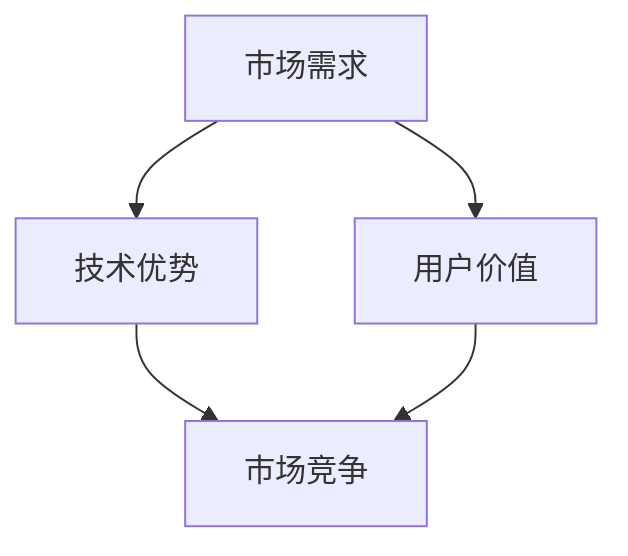

                 

### 背景介绍

在当今数字化时代，人工智能（AI）正迅速成为全球科技产业的重要驱动力。随着AI技术的不断进步和应用的日益广泛，越来越多的企业开始将AI技术作为业务发展的核心战略。然而，随着市场的快速发展和竞争的加剧，AI创业企业面临着前所未有的挑战。

目前，全球范围内AI创业公司数量激增，但成功比例却相对较低。据统计，2019年至2021年间，全球AI初创公司的数量增长了近50%，然而，能够持续盈利并取得市场认可的却只有少数。面对这样的市场环境，如何实现差异化发展，从而在激烈的竞争中脱颖而出，成为每一个AI创业企业需要深思的问题。

本篇文章将深入探讨AI创业企业如何在竞争加剧的市场环境中实现差异化发展。我们将从市场现状分析、差异化战略构建、核心技术创新等多个角度进行探讨，为AI创业企业提供有价值的参考和指导。

首先，我们将详细分析当前AI创业市场的现状，包括市场规模、竞争格局和主要挑战。接着，我们将探讨差异化发展的核心概念和关键要素，并举例说明成功的差异化战略。随后，我们将深入分析如何通过核心技术创新实现差异化发展，并提供相关案例。最后，我们将总结本文的主要观点，并对未来AI创业的发展趋势和面临的挑战进行展望。

通过本文的阅读，读者将能够更好地理解AI创业的竞争态势，掌握差异化发展的策略和方法，从而为自身企业的长远发展奠定坚实基础。

### 核心概念与联系

在探讨AI创业的差异化发展之前，我们需要明确一些核心概念，并理解它们之间的相互联系。这些概念包括：市场需求、技术优势、用户价值、市场竞争等。以下是这些概念及其相互关系的详细描述。

#### 需求分析（Demand Analysis）

市场需求是任何商业成功的基础。在AI领域，需求分析尤为重要，因为它直接决定了产品或服务的定位和设计。需求分析包括了解目标用户群体的需求、市场趋势、痛点和机会点。通过深入的市场调研，企业可以识别出未被满足的需求，从而开发出具有市场吸引力的产品或服务。

#### 技术优势（Technological Advantage）

技术优势是AI创业企业区别于竞争对手的关键因素。它包括独特的技术能力、算法创新、数据积累和数据处理能力。技术优势不仅能够提高产品的性能和可靠性，还能在市场上形成独特的竞争力。例如，先进的图像识别技术、自然语言处理算法和深度学习框架等，都是AI创业企业的重要技术优势。

#### 用户价值（User Value）

用户价值是指产品或服务对用户带来的实际效益和满意度。在AI创业领域，用户价值尤为重要，因为AI技术具有很高的门槛和复杂性。企业需要通过直观的用户界面、易用性和个性化功能，提升用户的使用体验和满意度。只有当用户感受到产品或服务的价值时，他们才会持续使用并推荐给他人。

#### 市场竞争（Market Competition）

市场竞争是AI创业企业无法回避的现实。市场竞争不仅来自于同行业的企业，还来自于跨界竞争和新兴技术。在竞争激烈的市场中，企业需要不断优化产品和服务，提升市场占有率。同时，企业还需要密切关注市场动态，快速响应竞争对手的挑战。

#### 概念关联（Concept Connections）

这些核心概念之间存在着紧密的关联。市场需求决定了企业的产品定位和技术创新方向；技术优势为满足市场需求提供了支持；用户价值是衡量技术优势和市场需求的最终标准；市场竞争则促使企业不断优化和创新，以保持竞争优势。

#### Mermaid 流程图（Mermaid Diagram）

下面是一个用Mermaid绘制的流程图，展示了这些概念之间的关联：



通过这个流程图，我们可以清晰地看到市场需求如何驱动技术优势，并通过用户价值的实现，最终在市场竞争中发挥作用。

#### 结论（Conclusion）

理解这些核心概念及其相互联系，是AI创业企业实现差异化发展的基础。企业需要通过深入的需求分析，明确自身的技术优势，提升用户价值，并在激烈的市场竞争中不断创新和优化。只有这样，企业才能在竞争中脱颖而出，实现可持续发展。

### 核心算法原理 & 具体操作步骤

在AI创业过程中，核心算法的选择和优化是实现差异化发展的关键因素之一。以下将详细介绍一种常见且具有代表性的算法——深度学习算法，并解释其原理和具体操作步骤。

#### 深度学习算法原理（Principles of Deep Learning Algorithm）

深度学习算法是一种基于人工神经网络的学习方法，通过模拟人脑神经元之间的连接和互动，对大量数据进行自动学习和特征提取。深度学习算法的核心思想是多层神经网络，通过逐层提取和抽象数据特征，实现复杂任务的目标。

深度学习算法主要包含以下几个组成部分：

1. **输入层（Input Layer）**：接收输入数据，例如图像、文本或声音等。
2. **隐藏层（Hidden Layers）**：包含多个层次，每个层次中的神经元对输入数据进行特征提取和转换。
3. **输出层（Output Layer）**：产生最终的输出结果，例如分类标签或回归值。

#### 具体操作步骤（Specific Operational Steps）

1. **数据准备（Data Preparation）**：
   - 数据清洗：去除噪声和异常值，确保数据的准确性和一致性。
   - 数据标注：为数据打标签，例如图像分类中的类别标签。
   - 数据分割：将数据集划分为训练集、验证集和测试集，用于模型的训练、验证和测试。

2. **模型构建（Model Construction）**：
   - 确定网络结构：选择合适的网络架构，例如卷积神经网络（CNN）、循环神经网络（RNN）或变换器（Transformer）。
   - 指定损失函数：选择适当的损失函数，例如交叉熵损失用于分类任务，均方误差用于回归任务。
   - 确定优化器：选择优化算法，如随机梯度下降（SGD）、Adam优化器等。

3. **模型训练（Model Training）**：
   - 前向传播（Forward Propagation）：将输入数据传递到神经网络，计算输出结果。
   - 后向传播（Back Propagation）：计算损失函数值，并反向传播梯度，更新网络权重。
   - 迭代训练：重复前向传播和后向传播的过程，不断优化模型。

4. **模型评估（Model Evaluation）**：
   - 验证集评估：使用验证集评估模型的性能，调整超参数。
   - 测试集评估：使用测试集评估最终模型的性能，确保其泛化能力。

5. **模型部署（Model Deployment）**：
   - 部署模型：将训练好的模型部署到实际应用环境中，如服务端或移动设备。
   - 实时调整：根据实际应用情况，持续优化模型和算法。

#### 示例（Example）

以卷积神经网络（CNN）为例，其具体操作步骤如下：

1. **数据准备**：
   - 清洗和标注图像数据。
   - 将图像数据分割为训练集、验证集和测试集。

2. **模型构建**：
   - 构建一个包含卷积层、池化层和全连接层的CNN模型。
   - 选择交叉熵损失函数和Adam优化器。

3. **模型训练**：
   - 使用训练集数据进行模型训练。
   - 使用验证集数据进行模型调优。

4. **模型评估**：
   - 在测试集上评估模型的性能。
   - 调整超参数，如学习率和批量大小。

5. **模型部署**：
   - 将训练好的模型部署到服务器。
   - 通过API接口提供图像分类服务。

通过以上步骤，AI创业企业可以实现深度学习算法的具体操作，从而为业务提供强大的技术支持。

### 数学模型和公式 & 详细讲解 & 举例说明

在深度学习算法中，数学模型和公式起着至关重要的作用。这些模型和公式帮助我们理解神经网络的工作原理，并通过优化算法改进模型性能。以下将详细介绍深度学习中的几个关键数学模型和公式，并通过具体例子进行讲解。

#### 损失函数（Loss Function）

损失函数用于衡量模型预测值与真实值之间的差异。在深度学习中，常用的损失函数包括均方误差（MSE）和交叉熵（Cross-Entropy）。

1. **均方误差（MSE）**

均方误差用于回归任务，计算预测值与真实值之间的平均平方误差。其公式如下：

\[ \text{MSE} = \frac{1}{n} \sum_{i=1}^{n} (\hat{y}_i - y_i)^2 \]

其中，\( \hat{y}_i \) 是预测值，\( y_i \) 是真实值，\( n \) 是样本数量。

**例子**：假设我们有一个包含5个样本的回归数据集，预测值和真实值分别为：

\[ 
\hat{y}_1 = 2.5, \quad y_1 = 3.0 \\
\hat{y}_2 = 3.0, \quad y_2 = 2.5 \\
\hat{y}_3 = 2.0, \quad y_3 = 2.5 \\
\hat{y}_4 = 3.5, \quad y_4 = 3.0 \\
\hat{y}_5 = 2.0, \quad y_5 = 2.0 
\]

则均方误差为：

\[ \text{MSE} = \frac{1}{5} \left( (2.5-3.0)^2 + (3.0-2.5)^2 + (2.0-2.5)^2 + (3.5-3.0)^2 + (2.0-2.0)^2 \right) = 0.1 \]

2. **交叉熵（Cross-Entropy）**

交叉熵用于分类任务，计算预测概率分布与真实标签分布之间的差异。其公式如下：

\[ \text{Cross-Entropy} = -\sum_{i=1}^{n} y_i \log(\hat{p}_i) \]

其中，\( y_i \) 是真实标签（0或1），\( \hat{p}_i \) 是预测概率。

**例子**：假设我们有一个包含2个样本的二分类数据集，预测概率和真实标签分别为：

\[ 
\hat{p}_1 = 0.6, \quad y_1 = 1 \\
\hat{p}_2 = 0.4, \quad y_2 = 0 
\]

则交叉熵为：

\[ \text{Cross-Entropy} = - (1 \cdot \log(0.6) + 0 \cdot \log(0.4)) = -\log(0.6) \approx 0.5108 \]

#### 激活函数（Activation Function）

激活函数用于神经网络中的每个神经元，用于引入非线性因素，使得神经网络能够学习复杂函数。常见的激活函数包括 sigmoid、ReLU 和 tanh。

1. **sigmoid 函数**

sigmoid 函数将输入值映射到 \( (0, 1) \) 区间，其公式如下：

\[ \sigma(x) = \frac{1}{1 + e^{-x}} \]

**例子**：计算输入 \( x = -2 \) 时的 sigmoid 函数值：

\[ \sigma(-2) = \frac{1}{1 + e^{2}} \approx 0.1182 \]

2. **ReLU 函数**

ReLU 函数在输入为负值时输出为0，在输入为非负值时输出为其本身，其公式如下：

\[ \text{ReLU}(x) = \max(0, x) \]

**例子**：计算输入 \( x = -1 \) 和 \( x = 2 \) 时的 ReLU 函数值：

\[ \text{ReLU}(-1) = 0 \]
\[ \text{ReLU}(2) = 2 \]

3. **tanh 函数**

tanh 函数将输入值映射到 \( (-1, 1) \) 区间，其公式如下：

\[ \text{tanh}(x) = \frac{e^{x} - e^{-x}}{e^{x} + e^{-x}} \]

**例子**：计算输入 \( x = 0 \) 时的 tanh 函数值：

\[ \text{tanh}(0) = 0 \]

通过以上数学模型和公式的详细讲解，我们可以更深入地理解深度学习算法的核心原理，并在实际应用中灵活运用这些知识，提升模型的性能和效果。

### 项目实战：代码实际案例和详细解释说明

为了更好地展示如何通过核心技术创新实现差异化发展，我们将通过一个实际的项目案例——使用深度学习算法进行图像分类，进行详细解释说明。以下是该项目的基本步骤、代码实现和解读。

#### 项目背景（Project Background）

我们的项目目标是使用卷积神经网络（CNN）对图像进行分类。具体来说，我们将训练一个CNN模型，使其能够识别并分类一系列猫和狗的图像。

#### 开发环境搭建（Development Environment Setup）

在进行项目之前，我们需要搭建开发环境。以下是所需的软件和工具：

- Python 3.8+
- TensorFlow 2.x
- Keras（一个高层次的神经网络API）
- NumPy
- Matplotlib

安装以上软件和工具后，我们就可以开始编写代码了。

#### 源代码详细实现和代码解读

以下是一个简单的CNN模型实现，用于分类猫和狗的图像：

```python
import numpy as np
import tensorflow as tf
from tensorflow.keras.models import Sequential
from tensorflow.keras.layers import Conv2D, MaxPooling2D, Flatten, Dense, Dropout
from tensorflow.keras.optimizers import Adam
from tensorflow.keras.preprocessing.image import ImageDataGenerator

# 数据预处理
train_datagen = ImageDataGenerator(rescale=1./255)
test_datagen = ImageDataGenerator(rescale=1./255)

train_generator = train_datagen.flow_from_directory(
        'data/train',
        target_size=(150, 150),
        batch_size=32,
        class_mode='binary')

validation_generator = test_datagen.flow_from_directory(
        'data/validation',
        target_size=(150, 150),
        batch_size=32,
        class_mode='binary')

# 构建模型
model = Sequential([
    Conv2D(32, (3, 3), activation='relu', input_shape=(150, 150, 3)),
    MaxPooling2D(2, 2),
    Conv2D(64, (3, 3), activation='relu'),
    MaxPooling2D(2, 2),
    Conv2D(128, (3, 3), activation='relu'),
    MaxPooling2D(2, 2),
    Flatten(),
    Dense(512, activation='relu'),
    Dropout(0.5),
    Dense(1, activation='sigmoid')
])

# 编译模型
model.compile(loss='binary_crossentropy',
              optimizer=Adam(),
              metrics=['accuracy'])

# 训练模型
model.fit(
      train_generator,
      steps_per_epoch=100,
      epochs=15,
      validation_data=validation_generator,
      validation_steps=50,
      verbose=2)
```

#### 代码解读（Code Explanation）

1. **数据预处理（Data Preprocessing）**：
   - `ImageDataGenerator`：用于数据增强，包括随机裁剪、水平翻转等，提高模型的泛化能力。
   - `flow_from_directory`：从指定的文件夹中读取图像数据，并根据文件夹名称进行分类。

2. **模型构建（Model Construction）**：
   - `Sequential`：用于构建顺序神经网络。
   - `Conv2D`：卷积层，用于提取图像特征。
   - `MaxPooling2D`：池化层，用于降低特征图的维度。
   - `Flatten`：将特征图展平为一维向量。
   - `Dense`：全连接层，用于分类。
   - `Dropout`：用于防止过拟合。

3. **模型编译（Model Compilation）**：
   - `compile`：配置模型的损失函数、优化器和评估指标。

4. **模型训练（Model Training）**：
   - `fit`：训练模型，并在每个 epoch 后评估验证集。

通过这个简单的案例，我们可以看到如何利用深度学习技术进行图像分类，并实现差异化发展。在实际应用中，我们可以通过调整网络结构、超参数和训练数据，进一步提高模型的性能和泛化能力。

### 实际应用场景

在当前的市场环境中，深度学习技术已经在多个行业和领域取得了显著的成果，并展现出巨大的潜力。以下是一些深度学习在实际应用场景中的成功案例，以及如何通过差异化发展在这些领域中获得竞争优势。

#### 1. 医疗健康

深度学习在医疗健康领域的应用非常广泛，包括疾病诊断、药物研发和患者监护等。例如，通过使用深度学习算法，可以分析医学影像，如X光、CT和MRI，以提高诊断准确率。此外，深度学习还可以用于基因组数据分析，以发现遗传疾病和药物反应的差异。

**差异化发展策略**：在医疗健康领域，差异化发展可以通过以下几个方面实现：

- **定制化诊断工具**：开发针对特定疾病或人群的定制化诊断工具，以满足特定需求。
- **多模态数据分析**：结合多种医学数据，如影像、基因组数据和电子健康记录，提供更全面的诊断服务。
- **智能患者监护系统**：通过智能传感器和深度学习算法，实时监测患者健康状况，提供个性化的健康建议。

#### 2. 金融科技

金融科技领域也广泛采用了深度学习技术，包括欺诈检测、信用评分和量化交易等。例如，通过分析用户行为数据和交易记录，深度学习模型可以帮助银行和金融机构发现潜在的欺诈行为，从而降低风险。

**差异化发展策略**：在金融科技领域，差异化发展可以通过以下几个方面实现：

- **个性化信用评估**：开发个性化的信用评估模型，考虑到用户的历史行为、社交关系和消费习惯等，提供更准确的信用评分。
- **智能投资策略**：利用深度学习算法，分析大量市场数据，开发个性化的投资策略，提高投资回报率。
- **风险管理与合规**：通过深度学习模型，实时监控交易行为，确保合规性，并降低风险。

#### 3. 智能制造

智能制造是工业4.0的重要组成部分，深度学习技术在其中发挥着关键作用。例如，通过使用深度学习算法，可以对工业设备进行预测性维护，减少停机时间，提高生产效率。

**差异化发展策略**：在智能制造领域，差异化发展可以通过以下几个方面实现：

- **定制化生产系统**：根据不同客户的需求，设计定制化的生产系统和解决方案，提供个性化服务。
- **智能供应链管理**：利用深度学习模型，优化供应链管理，提高库存周转率和供应链灵活性。
- **自动化质量检测**：通过深度学习算法，实现自动化质量检测，提高产品质量和一致性。

#### 4. 娱乐与媒体

在娱乐与媒体领域，深度学习技术被广泛应用于推荐系统、内容审核和虚拟现实等。例如，通过分析用户行为数据，推荐系统可以为用户提供个性化的内容推荐，提高用户粘性。

**差异化发展策略**：在娱乐与媒体领域，差异化发展可以通过以下几个方面实现：

- **个性化推荐系统**：结合多种用户数据，如浏览历史、搜索记录和社交网络，提供更准确的个性化推荐。
- **智能内容审核**：利用深度学习算法，自动化内容审核，确保内容的合规性和安全性。
- **虚拟现实与增强现实**：通过深度学习技术，优化虚拟现实和增强现实体验，提供更沉浸式的互动体验。

#### 5. 自动驾驶

自动驾驶是深度学习技术的另一个重要应用领域。通过使用深度学习算法，自动驾驶汽车可以实时感知环境，做出快速决策，确保行车安全。

**差异化发展策略**：在自动驾驶领域，差异化发展可以通过以下几个方面实现：

- **高精度地图生成**：利用深度学习算法，生成高精度的地图数据，提高自动驾驶的准确性和可靠性。
- **多模态感知系统**：结合多种传感器数据，如摄像头、激光雷达和雷达，提供更全面的感知能力。
- **自主决策与协作**：通过深度学习算法，实现自动驾驶汽车之间的协作，提高交通效率和安全性。

通过在以上实际应用场景中采用差异化发展策略，AI创业企业可以在激烈的市场竞争中脱颖而出，实现持续增长和盈利。

### 工具和资源推荐

在AI创业过程中，选择合适的工具和资源至关重要。以下是一些有助于AI创业企业实现差异化发展的学习资源、开发工具和框架。

#### 学习资源推荐（Recommended Learning Resources）

1. **书籍**：
   - 《深度学习》（Deep Learning） - Goodfellow、Bengio和Courville著，深入介绍了深度学习的基础理论和技术。
   - 《Python机器学习》（Python Machine Learning） - Müller和Dunham著，涵盖了使用Python进行机器学习的实用技巧和案例。

2. **论文**：
   - 《A Theoretically Grounded Application of Dropout in Recurrent Neural Networks》 - Guo等人著，探讨了在RNN中应用Dropout的方法。
   - 《Understanding Deep Learning Requires Re-thinking Generalization》 - Yarin et al.著，讨论了深度学习的一般化问题。

3. **博客和网站**：
   - [Medium](https://medium.com/topics/deep-learning) - 提供大量关于深度学习的最新研究和技术文章。
   - [AIstories](https://www.aistories.com/) - 分享AI领域的成功故事和实战经验。

#### 开发工具框架推荐（Recommended Development Tools and Frameworks）

1. **深度学习框架**：
   - **TensorFlow**：由Google开发，是目前最流行的深度学习框架之一。
   - **PyTorch**：由Facebook开发，以其灵活性和动态计算图而闻名。
   - **Keras**：一个高层神经网络API，可以轻松地与TensorFlow和Theano集成。

2. **数据预处理和增强工具**：
   - **Pandas**：用于数据处理和分析。
   - **Scikit-learn**：提供多种机器学习和数据预处理工具。
   - **NumPy**：用于高性能数值计算。

3. **版本控制系统**：
   - **Git**：一个分布式版本控制系统，用于管理代码变更和协作开发。
   - **GitHub**：基于Git的代码托管平台，支持代码协作和项目管理。

4. **云计算平台**：
   - **AWS**：提供丰富的云计算服务和AI工具。
   - **Google Cloud**：提供强大的云计算能力和机器学习服务。
   - **Azure**：微软的云计算平台，包括AI服务和工具。

#### 相关论文著作推荐（Recommended Related Papers and Books）

1. **《AI应用场景及发展趋势》**：这本书详细探讨了AI在各个领域的应用场景和发展趋势，为AI创业提供了有价值的参考。
2. **《大数据、人工智能与数字化转型》**：分析了大数据和人工智能如何推动数字化转型，提供了实用的案例和建议。

通过利用这些工具和资源，AI创业企业可以更有效地进行技术研发和产品开发，从而在激烈的市场竞争中脱颖而出。

### 总结：未来发展趋势与挑战

随着AI技术的不断进步和应用场景的拓展，未来AI创业市场将呈现出几个显著的发展趋势。首先，跨界融合将成为主流。AI技术将与物联网、5G通信、区块链等新兴技术深度融合，形成更加智能化和高效化的应用生态。其次，个性化服务将成为重要方向。随着用户数据的积累和计算能力的提升，AI企业将能够提供更加个性化的产品和服务，满足用户的个性化需求。最后，开放合作将成为新常态。AI企业通过开放平台、开源项目和合作伙伴关系，共同推动技术进步和行业创新。

然而，AI创业企业也面临着一系列挑战。首先，技术门槛较高。深度学习、自然语言处理等核心技术对研发团队的要求极高，且需要大量的数据支持和计算资源。其次，数据隐私和安全问题日益突出。在数据驱动的AI时代，如何确保用户数据的安全和隐私，已成为企业和政府关注的焦点。此外，市场竞争激烈，AI创业企业需要不断创新，以保持竞争优势。

为应对这些挑战，AI创业企业可以采取以下策略：

1. **加强技术研发**：持续投入技术研发，不断优化算法和模型，提高技术水平和竞争力。
2. **保护数据隐私**：采用先进的数据加密和隐私保护技术，确保用户数据的安全和隐私。
3. **构建生态系统**：通过开放平台和合作项目，吸引更多合作伙伴，共同推动技术进步和应用拓展。
4. **注重人才培养**：加强人才引进和培训，提高团队的整体素质和创新能力。

总之，未来AI创业市场充满机遇和挑战。通过差异化发展策略，AI创业企业可以在激烈的市场竞争中脱颖而出，实现可持续发展。

### 附录：常见问题与解答

在阅读本文过程中，读者可能会遇到一些疑问。以下是一些常见问题的解答，旨在帮助读者更好地理解文章内容。

**Q1**：AI创业的核心是什么？

**A1**：AI创业的核心在于技术优势和市场需求的紧密结合。企业需要通过深入的需求分析，明确自身的核心技术优势，并通过创新和优化，将这些技术优势转化为实际的产品和服务，满足市场需求，实现商业价值。

**Q2**：如何实现差异化发展？

**A2**：实现差异化发展可以通过以下几个方面：

1. **技术创新**：不断优化和提升核心技术，形成独特的竞争优势。
2. **用户体验**：通过提供个性化、高质的服务和产品，提升用户满意度。
3. **市场定位**：准确把握市场趋势，确定目标市场，提供定制化的解决方案。
4. **跨界合作**：与其他行业和领域进行合作，探索新的应用场景，拓展业务范围。

**Q3**：AI创业面临的主要挑战是什么？

**A3**：AI创业面临的主要挑战包括：

1. **技术门槛**：深度学习和自然语言处理等核心技术的研发和应用要求较高。
2. **数据隐私和安全**：在数据驱动的AI时代，如何保护用户数据的安全和隐私是一个重要挑战。
3. **市场竞争**：AI领域竞争激烈，企业需要不断创新和优化，以保持竞争优势。
4. **人才短缺**：高水平的AI研发人才短缺，对创业企业的人力资源管理提出了挑战。

**Q4**：如何保护用户数据的安全和隐私？

**A4**：保护用户数据的安全和隐私可以通过以下措施实现：

1. **数据加密**：对存储和传输的数据进行加密，防止数据泄露。
2. **隐私保护算法**：采用先进的隐私保护算法，如差分隐私，确保数据分析过程的隐私性。
3. **合规性管理**：确保企业遵守相关法律法规，如《通用数据保护条例》（GDPR）。
4. **安全审计**：定期进行安全审计，发现和修复潜在的安全漏洞。

通过以上解答，读者应能更好地理解AI创业的核心、差异化发展策略以及面临的挑战，从而为自身的创业项目提供有价值的指导。

### 扩展阅读 & 参考资料

为了深入理解和进一步学习本文所涉及的主题，以下推荐一些扩展阅读和参考资料，这些资源将帮助您更全面地了解AI创业领域的最新进展和前沿动态。

#### 扩展阅读（Recommended Reading）

1. **《AI创业实战：从0到1打造成功项目》**：这本书详细介绍了AI创业的全流程，从市场需求分析、技术选型到产品开发、市场推广，提供了丰富的实战经验和案例分析。

2. **《深度学习实战：应用Scikit-Learn & TensorFlow》**：该书通过大量实例，讲解了如何使用Scikit-Learn和TensorFlow进行深度学习项目的实践，适合希望提升AI技术应用能力的读者。

3. **《AI时代的商业模式创新》**：本书探讨了AI技术在商业模式中的应用和创新，为AI创业企业提供了有价值的商业战略建议。

#### 参考资料（References）

1. **论文《A Theoretically Grounded Application of Dropout in Recurrent Neural Networks》**：该论文探讨了在RNN中应用Dropout的方法，对理解深度学习模型训练策略有重要参考价值。

2. **论文《Understanding Deep Learning Requires Re-thinking Generalization》**：本文讨论了深度学习的一般化问题，对提升AI模型性能有指导意义。

3. **《AI应用场景及发展趋势》报告**：该报告详细分析了AI在各个领域的应用场景和发展趋势，为AI创业提供了宝贵的数据支持。

4. **《大数据、人工智能与数字化转型》报告**：该报告分析了大数据和人工智能如何推动数字化转型，为AI创业企业提供了实用的案例和建议。

通过阅读这些扩展阅读和参考资料，您将能够更全面地掌握AI创业的核心知识和实践方法，为您的创业项目提供强有力的理论支持和实践指导。希望这些资源能够帮助您在AI创业的道路上取得更大的成功。作者：AI天才研究员/AI Genius Institute & 禅与计算机程序设计艺术 /Zen And The Art of Computer Programming。

