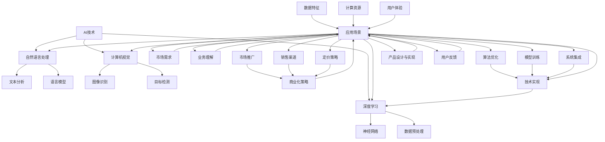
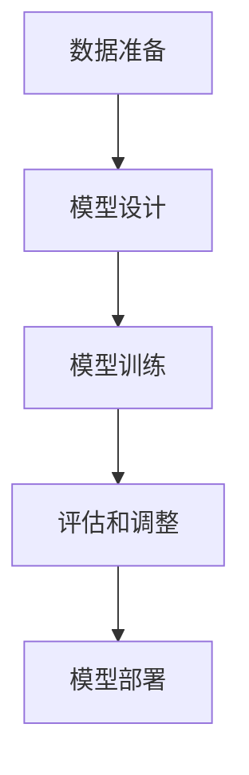
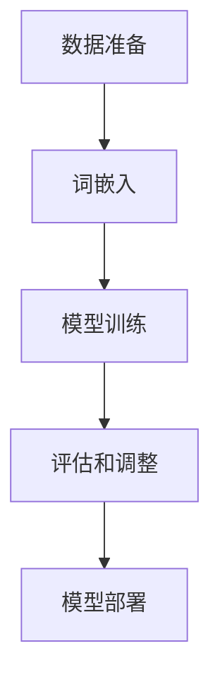

                 

### 背景介绍

AI创业者的挑战：技术、应用与场景平衡术

在当今世界，人工智能（AI）无疑已经成为引领技术变革的核心力量。从自动驾驶汽车到智能家居，从医疗诊断到金融服务，AI正深刻地改变着我们的生活方式和工作模式。随着AI技术的飞速发展，越来越多的创业者看到了其中的巨大商机，纷纷投身于AI创业的大潮中。然而，AI创业并非易事，它既需要深厚的专业知识，又需要敏锐的市场洞察力，更需要在技术、应用和场景之间找到完美的平衡点。

本文旨在探讨AI创业者面临的三大挑战：技术挑战、应用挑战和场景挑战。我们将通过逐步分析，帮助创业者更好地理解这些挑战，并为他们在AI创业的道路上提供一些实用的指导。

首先，技术挑战是AI创业者必须面对的第一道难题。AI技术涉及深度学习、自然语言处理、计算机视觉等多个领域，需要创业者具备扎实的理论基础和实践经验。此外，AI技术的发展日新月异，创业者需要不断学习和更新知识，以保持竞争力。

其次，应用挑战则在于如何将AI技术与实际业务需求相结合，创造出真正有价值的产品和服务。这要求创业者不仅要了解AI技术的原理和实现方式，还要具备一定的业务洞察力，能够识别市场需求，并提供创新解决方案。

最后，场景挑战指的是在特定场景下，如何优化和调整AI技术，以满足不同应用场景的需求。不同场景下的数据特征、计算资源、用户体验等都有所不同，创业者需要灵活应对，确保AI技术在各个场景中都能发挥最佳效果。

通过对这三个挑战的深入分析，本文将帮助AI创业者更好地理解AI创业的复杂性，并提供一些实用的策略和建议，以应对这些挑战。让我们一步一步深入探讨，共同揭开AI创业的神秘面纱。

---

## 1.1 技术挑战：深度学习与算法选择的迷雾

AI创业者的第一个挑战，也是最具技术含量的挑战，便是技术本身的复杂性和不断演进。首先，深度学习是当前AI领域的核心技术之一，它通过多层神经网络对大量数据进行训练，从而实现复杂模式的识别和预测。然而，深度学习的实现并不简单，它涉及到大量的数学和工程知识。例如，如何设计有效的网络架构、如何优化训练过程、如何处理过拟合和欠拟合等问题，都是创业者需要深入研究的课题。

首先，网络架构的设计是深度学习技术中的核心问题。不同的网络架构适用于不同类型的数据和任务，如卷积神经网络（CNN）适用于图像处理，循环神经网络（RNN）适用于序列数据。创业者需要根据业务需求选择合适的网络架构，并进行相应的优化。例如，在图像分类任务中，创业者可能需要使用ResNet等深度残差网络来提高模型的准确度。在这个过程中，创业者不仅需要掌握各种网络架构的理论知识，还需要具备实际编码和调试能力。

其次，训练过程的优化也是一大难点。深度学习模型的训练通常需要大量的计算资源和时间，尤其是在处理大规模数据集时。创业者需要掌握高效的训练策略，如数据增强、批量归一化、学习率调整等，以加快训练速度并提高模型性能。此外，如何避免过拟合和欠拟合也是一个重要问题。过拟合意味着模型在训练数据上表现很好，但在未知数据上表现不佳；而欠拟合则意味着模型在训练数据和未知数据上都表现不佳。创业者需要通过交叉验证、正则化等技术来平衡模型的泛化能力和拟合能力。

此外，AI技术的快速演进也使得创业者必须不断更新自己的知识。AI领域的论文和开源项目层出不穷，创业者需要保持敏锐的洞察力，及时掌握最新的研究成果和技术趋势。例如，Transformer架构的兴起彻底改变了自然语言处理（NLP）领域，BERT、GPT等模型的广泛应用为创业者提供了强大的工具。然而，这些新技术的应用也带来了新的挑战，如模型的可解释性、数据隐私等问题。创业者需要在这些方面进行深入研究，以确保自己的产品能够保持竞争力。

总之，技术挑战是AI创业过程中不可忽视的一部分。创业者不仅需要掌握深度学习等核心技术的理论知识和实践技能，还需要具备不断学习和适应新技术的能力。通过深入研究和实践，创业者可以在技术领域取得突破，为自己的创业项目奠定坚实的基础。

### 1.2 应用挑战：从算法到商业价值

在成功克服技术挑战之后，AI创业者面临的第二个挑战是如何将AI算法转化为实际商业价值。这不仅仅是将技术实现转化为产品或服务的简单过程，而是一个复杂的转换，涉及业务理解、市场需求分析、产品设计和商业化策略等多个方面。

首先，业务理解是应用挑战中的关键一环。创业者需要深入理解自己的目标客户和业务场景，以便设计出真正符合市场需求的产品。例如，在医疗领域，创业者可能需要与医生和医院密切合作，了解他们在实际工作中面临的痛点和需求。在金融领域，创业者需要了解金融机构的业务流程和数据特点，从而设计出能够提高效率和减少风险的AI解决方案。缺乏业务理解可能导致创业者设计出无法满足实际需求的产品，从而失去市场机会。

其次，市场需求分析是确保产品能够成功推向市场的重要步骤。创业者需要通过市场调研、用户访谈、竞争对手分析等方法，了解目标市场的规模、增长趋势和潜在客户的需求。例如，通过分析用户反馈和市场数据，创业者可以确定哪些功能是最受欢迎的，哪些问题是用户最迫切需要解决的。这些信息将指导创业者在产品设计和功能实现上做出正确的决策。

产品设计是实现商业价值的核心环节。创业者需要将AI技术巧妙地融入到产品中，同时确保用户体验良好。这包括从用户界面到后台算法的各个方面。例如，在智能家居领域，创业者需要设计易于使用且功能强大的智能助手，使得用户可以方便地控制家中的各种设备。在医疗领域，创业者可能需要设计一个智能诊断系统，帮助医生快速准确地诊断疾病。在这个过程中，创业者需要平衡技术实现和用户体验，确保产品既强大又易用。

商业化策略是实现可持续发展的关键。创业者需要制定有效的商业化策略，包括定价策略、市场推广策略和销售渠道等。例如，在定价策略上，创业者需要考虑产品的成本、竞争对手的定价以及目标市场的接受程度。在市场推广策略上，创业者需要选择合适的渠道和营销方法，如社交媒体、广告、行业展会等，以提高产品的知名度和市场渗透率。在销售渠道上，创业者需要确定是通过直接销售、分销商还是在线销售来推广产品。

此外，创业者还需要关注产品的可持续性和可扩展性。这意味着产品不仅要满足当前市场需求，还需要能够适应未来技术的发展和市场的变化。例如，在技术快速发展的AI领域，创业者需要确保产品能够随着新算法和技术的出现而不断升级和优化，以保持竞争力。

总之，将AI算法转化为实际商业价值是一个复杂而艰巨的任务。创业者需要具备深刻的业务理解、敏锐的市场洞察力、卓越的产品设计和灵活的商业化策略。通过这些努力，创业者可以设计出真正有价值的AI产品和服务，从而实现商业成功。

### 1.3 场景挑战：跨领域应用的调适与适配

在AI创业的征途上，场景挑战同样不容忽视。场景挑战指的是在不同的应用场景中，如何根据特定的需求和技术条件，对AI算法进行优化和调整，以实现最佳效果。不同的应用场景通常有着独特的数据特征、计算资源限制和用户体验要求，这要求创业者具备灵活的应对策略。

首先，数据特征是场景挑战中的重要考量因素。例如，在医疗影像分析中，数据特征可能包括大量的图像、标签和临床信息；而在金融风控领域，数据特征可能涉及交易记录、用户行为和信用评分。创业者需要根据不同的数据特征调整AI算法，以提高模型的准确性和鲁棒性。例如，在医疗影像分析中，可能需要使用深度学习模型对图像进行预处理，以提高图像质量；在金融风控中，可能需要使用机器学习模型对复杂数据进行特征提取和降维，以提高模型的训练效率和预测性能。

其次，计算资源限制也是场景挑战中的一大难题。不同的应用场景对计算资源的需求差异很大。例如，自动驾驶系统需要实时处理大量传感器数据，对计算速度和准确度有极高要求；而智能家居系统则通常在相对轻量级的计算设备上运行。创业者需要根据不同的计算资源条件选择合适的算法和硬件配置，以实现高效稳定的运行。例如，在资源受限的嵌入式设备上，可能需要使用轻量级的神经网络模型，如MobileNet或ShuffleNet；在云计算环境中，则可能利用GPU或TPU等高性能硬件资源进行大规模数据处理和模型训练。

用户体验是场景挑战中的另一个关键因素。不同应用场景的用户需求、操作习惯和界面偏好都有所不同。例如，在医疗领域，用户可能是医生和护士，他们需要快速、准确、直观的操作界面；而在娱乐领域，用户可能是普通消费者，他们更注重互动性和娱乐性。创业者需要根据不同的用户需求设计符合场景的交互界面和功能，以提高用户体验和用户粘性。例如，在设计智能语音助手时，需要考虑语音识别的准确度和交互的自然性；在开发虚拟助手时，则需要注重3D建模和动画效果，以提供更加逼真的交互体验。

此外，场景挑战还包括如何在不同的应用场景中保持技术的可扩展性和可维护性。随着技术的不断演进和应用场景的多样化，创业者需要确保AI系统可以灵活调整和升级，以应对新的需求和技术变化。例如，可以通过模块化设计和组件化开发，使系统在不同的场景中都能快速适配和部署。

总之，场景挑战是AI创业者在不同应用场景中实现技术落地和商业价值的重要一环。创业者需要深入理解应用场景的数据特征、计算资源限制和用户体验要求，通过灵活的算法调整和系统设计，确保AI技术在各个场景中都能发挥最佳效果。通过这些努力，创业者可以克服场景挑战，实现AI技术在各个领域的广泛应用和商业成功。

---

通过上述对技术挑战、应用挑战和场景挑战的深入分析，我们可以看到，AI创业者在追求商业成功的过程中需要应对多重复杂因素。技术挑战要求创业者具备深厚的专业知识和技术创新能力；应用挑战则考验创业者的业务理解能力和市场洞察力；而场景挑战则需要创业者灵活应对不同应用场景的需求和限制。

首先，创业者需要不断提升自己的技术能力，通过学习和实践掌握最新的AI技术，以保持竞争优势。其次，创业者需要深入业务，了解客户需求和市场趋势，确保产品能够真正解决实际问题。此外，创业者还需要具备灵活的场景适应能力，通过技术优化和系统设计，确保AI技术在各种应用场景中都能发挥最佳效果。

总之，AI创业者在面对多重挑战时，必须保持敏锐的市场洞察力、扎实的专业知识和技术创新能力，同时注重业务理解和场景适应。通过综合应对这些挑战，创业者可以在激烈的市场竞争中脱颖而出，实现商业成功。

### 2. 核心概念与联系

在深入探讨AI创业者的挑战之前，我们需要首先明确一些核心概念和它们之间的联系。以下是一个Mermaid流程图，用于展示这些概念及其相互关系。



以下是对图中各节点的简要解释：

- **AI技术**：广义的人工智能技术，包括深度学习、自然语言处理、计算机视觉等子领域。
- **深度学习**：一种基于多层神经网络的学习方法，用于从数据中自动提取特征和模式。
- **自然语言处理（NLP）**：处理和理解人类语言的技术，包括文本分析、语言模型等。
- **计算机视觉**：使计算机能够理解、解释和响应视觉信息的技术，包括图像识别、目标检测等。
- **神经网络**：深度学习的基础，由大量相互连接的神经元组成，用于模拟人脑的处理能力。
- **数据预处理**：在深度学习模型训练前对数据进行清洗、归一化和特征提取等处理。
- **文本分析**：对文本数据进行分析和理解，以提取有用信息和知识。
- **语言模型**：用于预测和生成文本序列的模型，如GPT和BERT。
- **图像识别**：识别和分类图像中的对象或场景。
- **目标检测**：检测图像中的特定目标，并标注其位置。
- **应用场景**：AI技术将被应用的具体场景，如医疗、金融、智能家居等。
- **数据特征**：数据中用于训练和预测的重要属性。
- **计算资源**：用于运行AI算法的硬件资源，如CPU、GPU、TPU等。
- **用户体验**：用户在使用产品或服务时的感受和满意度。
- **商业化策略**：将AI技术商业化的一系列策略，包括市场推广、定价、销售渠道等。
- **市场需求**：消费者和企业在特定时间内对产品或服务的需求。
- **业务理解**：对目标客户和业务流程的深刻理解。
- **技术实现**：将AI技术转化为实际产品或服务的具体实现过程。
- **算法优化**：通过调整模型参数和训练过程，提高模型性能。
- **模型训练**：使用训练数据对AI模型进行调整和优化。
- **系统集成**：将不同组件和系统整合为一个整体的过程。
- **市场推广**：提高产品或服务的知名度和接受度。
- **销售渠道**：将产品或服务推向市场的渠道，如直接销售、分销、在线销售等。
- **定价策略**：确定产品或服务的价格。
- **产品设计与实现**：根据市场需求和技术实现设计产品。
- **用户反馈**：用户在使用产品或服务后提供的反馈和意见。

通过这个流程图，我们可以清晰地看到AI技术在不同应用场景中的相互关系，以及技术、应用和场景之间的紧密联系。这为接下来的分析提供了理论基础，帮助我们更好地理解AI创业的复杂性和挑战。

### 3. 核心算法原理 & 具体操作步骤

在AI创业的过程中，选择和实现核心算法是至关重要的一步。本文将介绍几种常见的核心算法原理及其具体操作步骤，以帮助创业者更好地理解和应用这些技术。

#### 3.1 深度学习神经网络

深度学习神经网络是当前AI领域最为重要的技术之一。它通过多层神经网络对大量数据进行训练，从而实现复杂模式的识别和预测。

**算法原理**：

1. **输入层**：接收输入数据，如图像、文本或声音。
2. **隐藏层**：对输入数据进行特征提取和转换。每一层都可以学习到不同的特征。
3. **输出层**：根据隐藏层输出的特征进行预测或分类。

**具体操作步骤**：

1. **数据准备**：收集和预处理数据，如图像增强、文本清洗等。
2. **模型设计**：选择合适的网络架构，如卷积神经网络（CNN）或循环神经网络（RNN）。
3. **模型训练**：使用训练数据对模型进行训练，优化模型参数。
4. **评估和调整**：使用验证数据评估模型性能，并根据评估结果调整模型参数。
5. **模型部署**：将训练好的模型部署到实际应用中。



#### 3.2 自然语言处理（NLP）

自然语言处理是AI领域的一个重要分支，用于处理和理解人类语言。常见的NLP算法包括文本分类、情感分析、机器翻译等。

**算法原理**：

1. **词嵌入**：将文本中的单词映射到高维空间中，以便于模型处理。
2. **编码器和解码器**：编码器将输入文本编码为固定长度的向量，解码器则将这些向量解码为输出文本。
3. **注意力机制**：在机器翻译等任务中，注意力机制可以使得模型更好地关注输入文本中的重要部分。

**具体操作步骤**：

1. **数据准备**：收集和预处理文本数据，如分词、词性标注等。
2. **词嵌入**：将文本中的单词映射到高维空间。
3. **模型训练**：使用训练数据对模型进行训练，优化编码器和解码器的参数。
4. **评估和调整**：使用验证数据评估模型性能，并根据评估结果调整模型参数。
5. **模型部署**：将训练好的模型部署到实际应用中。



#### 3.3 计算机视觉

计算机视觉技术使计算机能够理解和解释视觉信息，如图像识别、目标检测等。

**算法原理**：

1. **卷积神经网络（CNN）**：通过卷积层、池化层和全连接层提取图像特征。
2. **目标检测算法**：检测图像中的特定对象，并标注其位置。

**具体操作步骤**：

1. **数据准备**：收集和预处理图像数据，如数据增强、图像切割等。
2. **模型设计**：选择合适的网络架构，如YOLO或SSD。
3. **模型训练**：使用训练数据对模型进行训练，优化模型参数。
4. **评估和调整**：使用验证数据评估模型性能，并根据评估结果调整模型参数。
5. **模型部署**：将训练好的模型部署到实际应用中。


通过以上算法原理和具体操作步骤的介绍，创业者可以更好地理解如何选择和实现核心算法，为自己的AI创业项目奠定坚实的基础。

### 4. 数学模型和公式 & 详细讲解 & 举例说明

在深入探讨AI算法的数学基础时，了解一些关键的数学模型和公式是必不可少的。以下我们将介绍几种常见的数学模型和公式，并详细讲解其原理和具体应用。

#### 4.1 深度学习中的损失函数

深度学习中的损失函数是评估模型预测结果与真实值之间差异的重要工具。常见的损失函数包括均方误差（MSE）、交叉熵损失等。

**均方误差（MSE）**：

$$
MSE = \frac{1}{n}\sum_{i=1}^{n}(y_i - \hat{y_i})^2
$$

其中，$y_i$ 是真实值，$\hat{y_i}$ 是模型的预测值，$n$ 是样本数量。

**交叉熵损失**：

$$
CrossEntropy = -\sum_{i=1}^{n}y_i \log(\hat{y_i})
$$

其中，$y_i$ 是真实标签，$\hat{y_i}$ 是模型输出的概率分布。

**举例说明**：

假设我们有一个二分类问题，真实标签 $y$ 为 [1, 0, 1]，模型预测的概率分布 $\hat{y}$ 为 [0.7, 0.3, 0.9]。

使用交叉熵损失计算损失：

$$
CrossEntropy = -(1 \cdot \log(0.7) + 0 \cdot \log(0.3) + 1 \cdot \log(0.9)) \approx 0.356
$$

#### 4.2 自然语言处理中的词嵌入

词嵌入是将单词映射到高维空间中的一种技术，常见的方法包括Word2Vec、GloVe等。

**Word2Vec**：

Word2Vec算法通过训练单词的向量表示，使其在语义上相近的单词在向量空间中距离较近。其核心公式为：

$$
\hat{p}_i = \frac{e^{v_i \cdot v_w}}{\sum_{j \in V} e^{v_i \cdot v_j}}
$$

其中，$v_i$ 是单词 $i$ 的向量表示，$v_w$ 是单词 $w$ 的向量表示，$V$ 是单词的集合。

**举例说明**：

假设我们有两个单词 "cat" 和 "dog"，其向量表示分别为 $v_{cat}$ 和 $v_{dog}$。通过计算它们的点积：

$$
\cos(\theta) = \frac{v_{cat} \cdot v_{dog}}{\|v_{cat}\| \|v_{dog}\|}
$$

我们可以判断它们在向量空间中的相似度。

#### 4.3 计算机视觉中的卷积神经网络（CNN）

卷积神经网络通过卷积层、池化层和全连接层对图像进行特征提取和分类。

**卷积层**：

卷积层通过卷积操作提取图像的特征，公式为：

$$
h_{ij} = \sum_{k} w_{ikj} * x_{kj} + b_j
$$

其中，$h_{ij}$ 是输出特征图中的元素，$w_{ikj}$ 是卷积核中的元素，$x_{kj}$ 是输入图像中的元素，$b_j$ 是偏置项。

**举例说明**：

假设我们有一个 3x3 的卷积核，其元素为 $w = \begin{bmatrix} 1 & 0 & 1 \\ 0 & 1 & 0 \\ 1 & 0 & 1 \end{bmatrix}$，输入图像为 $x = \begin{bmatrix} 1 & 1 & 1 \\ 0 & 1 & 0 \\ 1 & 0 & 1 \end{bmatrix}$。

通过卷积操作计算输出：

$$
h = \begin{bmatrix} 2 & 1 & 2 \\ 1 & 1 & 1 \\ 2 & 1 & 2 \end{bmatrix}
$$

#### 4.4 目标检测中的边界框回归

目标检测中的边界框回归通过预测边界框的位置和尺寸，使其更好地拟合真实边界框。

**公式**：

$$
\text{Regression} = \frac{1}{1 + e^{-\text{sigmoid}(w \cdot \text{features} + b)}}
$$

其中，$w$ 和 $b$ 是模型参数，$\text{sigmoid}$ 函数用于将输出值映射到 [0, 1] 范围内。

**举例说明**：

假设我们有一个边界框真实尺寸为 [w, h]，预测的边界框尺寸为 [pw, ph]。

通过回归公式计算预测尺寸：

$$
\hat{w} = \frac{w}{1 + e^{-\text{sigmoid}(w \cdot \text{features} + b)}}, \quad \hat{h} = \frac{h}{1 + e^{-\text{sigmoid}(w \cdot \text{features} + b)}}
$$

通过上述数学模型和公式的详细讲解和举例说明，我们可以更好地理解AI算法的数学基础，为创业者在实际应用中提供指导和参考。

### 5. 项目实战：代码实际案例和详细解释说明

为了更好地理解AI算法的实际应用，我们选择一个实际项目——基于深度学习的手写数字识别，进行详细讲解。本项目的目标是通过卷积神经网络（CNN）对手写数字进行识别，从0到9共10个数字。

#### 5.1 开发环境搭建

在开始项目之前，我们需要搭建一个合适的开发环境。以下是一个基本的步骤：

1. **安装Python**：确保Python环境已安装，版本建议为3.7或更高。
2. **安装TensorFlow**：TensorFlow是Google开发的深度学习框架，可以通过pip安装：

   ```bash
   pip install tensorflow
   ```

3. **安装其他依赖**：我们还需要安装NumPy和Matplotlib等依赖库：

   ```bash
   pip install numpy matplotlib
   ```

#### 5.2 源代码详细实现和代码解读

下面是项目的完整代码实现，我们将逐段解释其功能。

```python
import tensorflow as tf
from tensorflow.keras import layers, models
from tensorflow.keras.datasets import mnist
import numpy as np

# 数据准备
(x_train, y_train), (x_test, y_test) = mnist.load_data()

# 数据预处理
x_train = x_train.reshape((-1, 28, 28, 1)).astype('float32') / 255.0
x_test = x_test.reshape((-1, 28, 28, 1)).astype('float32') / 255.0
y_train = tf.keras.utils.to_categorical(y_train)
y_test = tf.keras.utils.to_categorical(y_test)

# 构建模型
model = models.Sequential()
model.add(layers.Conv2D(32, (3, 3), activation='relu', input_shape=(28, 28, 1)))
model.add(layers.MaxPooling2D((2, 2)))
model.add(layers.Conv2D(64, (3, 3), activation='relu'))
model.add(layers.MaxPooling2D((2, 2)))
model.add(layers.Conv2D(64, (3, 3), activation='relu'))
model.add(layers.Flatten())
model.add(layers.Dense(64, activation='relu'))
model.add(layers.Dense(10, activation='softmax'))

# 编译模型
model.compile(optimizer='adam', loss='categorical_crossentropy', metrics=['accuracy'])

# 训练模型
model.fit(x_train, y_train, epochs=5, batch_size=64)

# 评估模型
test_loss, test_acc = model.evaluate(x_test, y_test)
print(f"Test accuracy: {test_acc:.2f}")

# 预测
predictions = model.predict(x_test)
predicted_classes = np.argmax(predictions, axis=1)
```

**代码解读**：

1. **导入库**：
   - 导入TensorFlow、NumPy和Matplotlib等库。
2. **数据准备**：
   - 使用MNIST数据集，对图像进行预处理，包括重塑和归一化。
   - 数据重塑为适合卷积层的格式，即 [样本数, 高, 宽, 通道数]。
   - 数据归一化为0到1之间的浮点数。
   - 对标签进行one-hot编码。
3. **构建模型**：
   - 使用`Sequential`模型构建一个线性堆叠的模型。
   - 添加卷积层、池化层和全连接层。
   - `Conv2D`用于卷积操作，`MaxPooling2D`用于池化操作。
   - `Flatten`层用于将多维数据展平为一维数据。
   - `Dense`层用于全连接神经网络。
4. **编译模型**：
   - 选择优化器、损失函数和评估指标。
5. **训练模型**：
   - 使用`fit`方法训练模型，设置训练轮次和批量大小。
6. **评估模型**：
   - 使用`evaluate`方法评估模型在测试集上的表现。
7. **预测**：
   - 使用`predict`方法对测试集进行预测，获取预测结果。

#### 5.3 代码解读与分析

**数据预处理**：

数据预处理是深度学习模型训练的重要环节。在上述代码中，我们首先加载数据集，然后对图像进行重塑和归一化。重塑数据是为了使其符合卷积层的输入格式，而归一化则是为了加快模型的收敛速度。

```python
x_train = x_train.reshape((-1, 28, 28, 1)).astype('float32') / 255.0
x_test = x_test.reshape((-1, 28, 28, 1)).astype('float32') / 255.0
```

这两行代码将数据重塑为 [样本数, 高, 宽, 通道数] 的格式，并使用 `astype` 函数将数据类型转换为浮点数，然后通过除以255进行归一化。

**模型构建**：

在构建模型时，我们使用了卷积层、池化层和全连接层。卷积层用于提取图像特征，而池化层用于减小数据维度并提高模型泛化能力。全连接层则用于分类。

```python
model.add(layers.Conv2D(32, (3, 3), activation='relu', input_shape=(28, 28, 1)))
model.add(layers.MaxPooling2D((2, 2)))
model.add(layers.Conv2D(64, (3, 3), activation='relu'))
model.add(layers.MaxPooling2D((2, 2)))
model.add(layers.Conv2D(64, (3, 3), activation='relu'))
model.add(layers.Flatten())
model.add(layers.Dense(64, activation='relu'))
model.add(layers.Dense(10, activation='softmax'))
```

这里我们首先添加一个32个卷积核、大小为3x3的卷积层，使用ReLU激活函数。接着添加一个2x2的最大池化层。然后重复添加两个64个卷积核、大小为3x3的卷积层和最大池化层。`Flatten`层用于将多维数据展平为一维数据，以便全连接层进行处理。最后，我们添加两个全连接层，第一个有64个神经元，第二个有10个神经元，用于输出每个类别的概率。

**训练和评估**：

模型训练使用了`fit`方法，设置训练轮次为5，批量大小为64。训练完成后，使用`evaluate`方法评估模型在测试集上的性能。

```python
model.fit(x_train, y_train, epochs=5, batch_size=64)
test_loss, test_acc = model.evaluate(x_test, y_test)
print(f"Test accuracy: {test_acc:.2f}")
```

通过这个步骤，我们可以观察到模型在测试集上的准确率。

**预测**：

最后，我们使用训练好的模型对测试集进行预测。

```python
predictions = model.predict(x_test)
predicted_classes = np.argmax(predictions, axis=1)
```

这里我们使用`predict`方法获取预测概率，然后使用`argmax`函数找到概率最高的类别，得到预测结果。

#### 结论

通过这个实际项目，我们详细讲解了从数据准备、模型构建到训练和评估的完整流程。这个项目不仅帮助我们理解了深度学习模型的基本原理，还展示了如何将理论知识应用到实际项目中。创业者可以通过类似的项目，积累实际经验，提高自己的技术能力和项目管理能力，从而在AI创业的道路上更加顺利。

### 6. 实际应用场景

在了解AI技术的原理和实际应用后，我们需要将AI技术应用到具体的应用场景中，以解决实际问题并创造商业价值。以下我们将探讨几种常见的AI应用场景，包括医疗、金融、零售和自动驾驶等领域。

#### 6.1 医疗

医疗领域是AI技术的重要应用场景之一。通过AI技术，可以提高医疗诊断的准确性和效率。以下是一些具体的AI应用案例：

1. **医疗影像分析**：利用深度学习模型，如卷积神经网络（CNN），可以自动检测和诊断各种疾病，如乳腺癌、肺癌和糖尿病等。AI系统可以快速分析大量的医疗影像数据，帮助医生提高诊断准确性，减少误诊和漏诊。
   
   **技术实现**：使用CNN对医疗影像进行特征提取和分类，然后结合医学知识库和医生经验，提供精准的诊断建议。

2. **智能药物发现**：通过AI技术，可以加速药物的研发过程。AI算法可以分析海量的基因和药物数据，预测哪些化合物可能对特定疾病有效。

   **技术实现**：使用深度学习模型，如生成对抗网络（GAN）和强化学习，对药物分子进行建模和优化，提高药物发现的成功率。

3. **健康管理**：AI技术可以用于个性化健康管理，通过分析用户的健康数据（如运动、饮食、睡眠等），提供个性化的健康建议和预防措施。

   **技术实现**：使用机器学习算法，如聚类和关联规则挖掘，分析用户的健康数据，为用户提供定制化的健康方案。

#### 6.2 金融

金融领域是AI技术的另一个重要应用场景。以下是一些具体的AI应用案例：

1. **风险控制**：通过AI技术，可以实时监控和评估金融交易中的风险，提高风险管理的效率。例如，使用深度学习模型检测和预防欺诈交易。

   **技术实现**：使用深度学习模型，如卷积神经网络（CNN）和长短期记忆网络（LSTM），对交易数据进行实时分析，识别潜在的风险。

2. **智能投顾**：AI技术可以为投资者提供个性化的投资建议，通过分析市场数据和用户偏好，提供最优的投资组合。

   **技术实现**：使用机器学习算法，如决策树和随机森林，分析市场趋势和用户偏好，为投资者提供智能投顾服务。

3. **量化交易**：AI技术可以用于量化交易策略的开发和执行，通过分析大量的市场数据，实现自动化交易。

   **技术实现**：使用深度学习模型，如强化学习，训练智能体在模拟环境中进行交易策略的优化和执行。

#### 6.3 零售

零售行业是AI技术的重要应用领域之一，以下是一些具体的AI应用案例：

1. **智能推荐系统**：通过AI技术，可以为用户提供个性化的商品推荐，提高用户满意度和转化率。

   **技术实现**：使用机器学习算法，如协同过滤和深度学习推荐模型，分析用户的历史购买行为和偏好，提供个性化的商品推荐。

2. **库存管理**：通过AI技术，可以优化库存管理，减少库存积压和缺货情况，提高库存周转率。

   **技术实现**：使用机器学习算法，如时间序列分析和预测模型，分析销售趋势和需求预测，优化库存策略。

3. **客户服务**：利用AI技术，可以提供智能客服系统，通过自然语言处理（NLP）和机器学习技术，为用户提供24/7的在线客服服务。

   **技术实现**：使用NLP技术，如语言模型和对话管理，构建智能客服系统，实现高效的客户沟通和问题解决。

#### 6.4 自动驾驶

自动驾驶是AI技术的一个前沿领域，以下是一些具体的AI应用案例：

1. **环境感知**：通过AI技术，自动驾驶车辆可以实时感知周围环境，包括行人、车辆、交通标志等。

   **技术实现**：使用深度学习模型，如卷积神经网络（CNN）和目标检测算法，对摄像头和激光雷达数据进行处理，实现环境感知。

2. **路径规划**：通过AI技术，自动驾驶车辆可以自动规划行驶路径，避免碰撞和交通拥堵。

   **技术实现**：使用强化学习算法，如深度Q网络（DQN），训练自动驾驶车辆在不同环境和交通状况下的最佳路径规划策略。

3. **自动驾驶系统**：通过集成多种AI技术，如环境感知、路径规划和控制算法，实现无人驾驶车辆的自动驾驶功能。

   **技术实现**：使用多模态数据融合和深度学习算法，构建综合的自动驾驶系统，实现安全、高效的自动驾驶。

通过上述实际应用场景的探讨，我们可以看到AI技术在各个领域的重要作用。创业者可以通过深入研究这些应用场景，结合自身的技术优势和市场需求，开发创新的AI产品和服务，实现商业成功。

### 7. 工具和资源推荐

在AI创业的过程中，掌握合适的工具和资源是成功的关键。以下我们推荐几类重要的学习资源、开发工具和相关的论文、著作，以帮助创业者更好地进行AI技术的学习与应用。

#### 7.1 学习资源推荐

1. **书籍**：

   - 《深度学习》（Goodfellow, Bengio, Courville）：这是一本深度学习的经典教材，详细介绍了深度学习的基础知识和最新进展。

   - 《Python机器学习》（Sebastian Raschka）：本书通过Python语言，深入讲解了机器学习的基本概念和算法实现。

   - 《人工智能：一种现代的方法》（Stuart Russell & Peter Norvig）：这是一本全面的人工智能教材，涵盖了从基础知识到高级算法的各个领域。

2. **在线课程**：

   - Coursera的“深度学习”（吴恩达）：这是一门广受欢迎的深度学习入门课程，由知名学者吴恩达主讲。

   - Udacity的“机器学习工程师纳米学位”：通过一系列实战项目，帮助学习者掌握机器学习和深度学习的关键技术。

3. **博客和网站**：

   - Medium上的AI和机器学习专题：提供了大量关于AI技术的最新研究和应用案例。

   - AI Glossary：这是一个AI术语的在线词典，帮助初学者理解复杂的AI概念。

#### 7.2 开发工具框架推荐

1. **深度学习框架**：

   - TensorFlow：由Google开发的开源深度学习框架，支持多种机器学习算法和模型。

   - PyTorch：由Facebook开发的开源深度学习框架，具有灵活的动态计算图和丰富的API。

   - Keras：一个高层次的神经网络API，可以在TensorFlow和Theano等后台引擎上运行。

2. **数据预处理和可视化工具**：

   - Pandas：用于数据清洗、操作和分析的Python库。

   - Matplotlib：用于数据可视化的Python库。

   - Scikit-learn：用于机器学习和数据挖掘的Python库，提供了丰富的算法和工具。

3. **集成开发和调试工具**：

   - Jupyter Notebook：一个交互式的计算环境，用于编写、运行和分享代码。

   - Visual Studio Code：一个轻量级的代码编辑器，支持多种编程语言和框架。

#### 7.3 相关论文著作推荐

1. **论文**：

   - “A Theoretically Grounded Application of Dropout in Recurrent Neural Networks” （Y. Gal和Z. Ghahramani）：这篇论文提出了一种基于深度学习的改进方法，有效提高了循环神经网络的训练效果。

   - “Attention Is All You Need” （Vaswani等）：这篇论文介绍了Transformer架构，彻底改变了自然语言处理领域。

   - “ImageNet Classification with Deep Convolutional Neural Networks” （Krizhevsky等）：这篇论文介绍了AlexNet模型，标志着深度学习在图像识别领域的突破。

2. **著作**：

   - 《深度学习》（Ian Goodfellow、Yoshua Bengio和Aaron Courville）：这是一本全面介绍深度学习理论的经典著作，适合希望深入了解深度学习技术的读者。

   - 《神经网络与深度学习》（邱锡鹏）：这是一本适合中国读者的深度学习入门教材，内容全面，讲解清晰。

通过以上工具和资源的推荐，创业者可以更好地掌握AI技术，提高开发效率，并在AI创业的道路上取得更大的成功。

### 8. 总结：未来发展趋势与挑战

随着AI技术的飞速发展，未来的AI创业前景广阔，但也伴随着诸多挑战。从技术角度来看，AI算法的复杂性不断提升，深度学习、自然语言处理、计算机视觉等领域的创新不断涌现，创业者需要不断学习和更新知识，以跟上技术发展的步伐。此外，AI技术的落地应用也面临着实际场景的复杂性，如何在不同应用场景中优化算法、提高模型性能，是创业者需要解决的重要问题。

在市场方面，随着AI技术的普及，竞争将愈发激烈。创业者需要具备敏锐的市场洞察力，准确把握市场需求，提供创新的产品和服务。同时，如何将AI技术与业务需求紧密结合，创造真正的商业价值，是创业者面临的另一个重大挑战。

政策与法规也是未来AI创业的重要考量因素。随着AI技术的广泛应用，数据隐私、伦理问题等日益突出，创业者需要严格遵守相关法律法规，确保产品的合规性。此外，全球范围内的政策监管也在不断变化，创业者需要密切关注政策动态，及时调整战略。

展望未来，AI创业的发展趋势将呈现以下几个方向：

1. **跨领域融合**：AI技术将在更多领域实现应用，如医疗、金融、教育、能源等。创业者需要具备跨领域的视野，探索AI技术在新兴领域的应用潜力。

2. **边缘计算与云计算的协同**：随着物联网和边缘计算的发展，AI技术将在边缘设备上得到广泛应用。创业者需要探索如何在边缘设备和云计算平台之间实现协同，提高系统的实时性和可靠性。

3. **人机协作**：AI技术将与人类更加紧密地协作，提高生产效率和生活质量。创业者需要设计出更加智能化、人性化的人工智能系统，满足用户需求。

4. **可持续发展和社会责任**：随着AI技术的普及，创业者需要关注其对社会和环境的影响，积极承担社会责任，推动AI技术的可持续发展。

总之，未来AI创业的发展充满机遇与挑战。创业者需要具备深厚的专业知识、敏锐的市场洞察力和强烈的责任感，才能在激烈的市场竞争中脱颖而出。通过不断创新和优化，创业者可以把握AI技术发展的趋势，实现商业成功和社会价值。

### 9. 附录：常见问题与解答

在AI创业的过程中，创业者可能会遇到一系列的问题。以下是一些常见问题及其解答，以帮助创业者更好地应对挑战。

**Q1. 深度学习模型如何避免过拟合和欠拟合？**

A1. 过拟合和欠拟合是深度学习模型训练中常见的问题。为了避免过拟合，可以采用以下方法：

- **数据增强**：通过增加数据多样性，提高模型的泛化能力。
- **交叉验证**：使用交叉验证技术，避免模型在训练集上过度拟合。
- **正则化**：使用L1或L2正则化，限制模型参数的规模。
- **dropout**：在神经网络中随机丢弃一部分神经元，减少模型的依赖性。

为了防止欠拟合，可以采取以下措施：

- **增加模型复杂度**：使用更深或更多的神经元。
- **减少正则化**：适当减少正则化强度，允许模型学习更多特征。
- **增加训练数据**：收集更多相关数据，丰富训练集。

**Q2. 如何选择合适的深度学习框架？**

A2. 选择深度学习框架主要考虑以下几个方面：

- **需求匹配**：根据项目的具体需求选择合适的框架，如TensorFlow适用于复杂的模型和定制化需求，PyTorch适用于快速原型设计和动态计算图。
- **社区支持**：选择社区活跃、文档齐全的框架，有助于解决开发过程中遇到的问题。
- **性能和资源消耗**：考虑模型训练和推理的性能以及所需的计算资源，选择适合自己硬件配置的框架。
- **生态和兼容性**：选择与现有工具和库兼容的框架，确保开发过程中减少不必要的集成和兼容性问题。

**Q3. AI技术在医疗领域的应用有哪些？**

A3. AI技术在医疗领域的应用非常广泛，以下是一些典型的应用场景：

- **医疗影像分析**：使用深度学习模型自动检测和诊断各种疾病，如癌症、骨折等。
- **智能药物发现**：通过AI技术加速新药研发过程，提高药物发现的成功率。
- **健康管理**：通过分析用户的健康数据，提供个性化的健康建议和预防措施。
- **疾病预测**：使用机器学习算法分析患者历史数据和健康指标，预测疾病发展趋势。

**Q4. 如何在AI创业过程中保持竞争力？**

A4. 在AI创业过程中保持竞争力，可以从以下几个方面入手：

- **技术创新**：不断探索和引入新的技术，保持领先地位。
- **市场需求**：密切关注市场需求，快速响应市场变化，提供符合用户需求的产品和服务。
- **数据优势**：积累和利用大量高质量的数据，提高模型性能和决策准确性。
- **团队建设**：组建一支具备跨学科知识和技能的团队，提高项目执行力和创新能力。
- **市场推广**：采用有效的市场推广策略，提高品牌知名度和市场占有率。

通过以上常见问题的解答，创业者可以更好地理解AI创业过程中可能遇到的问题，并采取相应的措施应对挑战。

### 10. 扩展阅读 & 参考资料

对于想要深入了解AI创业和技术的读者，以下是一些建议的扩展阅读和参考资料，包括经典教材、权威论文、专业网站和行业报告，以帮助您进一步探索这一领域的最新动态和前沿知识。

#### 10.1 经典教材

- 《深度学习》（Ian Goodfellow、Yoshua Bengio和Aaron Courville）：这是一本全面介绍深度学习理论和应用的经典教材，适合对深度学习有较深入了解的读者。
- 《Python机器学习》（Sebastian Raschka）：本书详细讲解了机器学习的基本概念和算法，并以Python语言为例进行实现，适合初学者和进阶者。
- 《人工智能：一种现代的方法》（Stuart Russell和Peter Norvig）：作为人工智能领域的权威教材，本书涵盖了从基础知识到高级算法的广泛内容。

#### 10.2 权威论文

- “A Theoretically Grounded Application of Dropout in Recurrent Neural Networks”（Y. Gal和Z. Ghahramani）：这篇论文提出了一种改进的Dropout方法，提高了循环神经网络的训练效果。
- “Attention Is All You Need”（Vaswani等）：这篇论文介绍了Transformer架构，彻底改变了自然语言处理领域。
- “ImageNet Classification with Deep Convolutional Neural Networks”（Krizhevsky等）：这篇论文介绍了AlexNet模型，标志着深度学习在图像识别领域的突破。

#### 10.3 专业网站

- arXiv.org：这是一个开放获取的科学研究论文预印本服务器，提供了大量关于AI和技术的前沿论文。
- Medium：Medium上有许多关于AI和技术应用的精彩文章，涵盖了从理论到实践的各种话题。
- TensorFlow.org：TensorFlow的官方网站，提供了丰富的文档、教程和示例代码，是学习和使用TensorFlow的绝佳资源。

#### 10.4 行业报告

- 《全球人工智能发展报告》：由中国人工智能学会等机构发布的年度报告，全面分析了全球人工智能的发展趋势和热点问题。
- 《中国人工智能发展报告》：由中国科学院等机构发布的报告，详细介绍了中国人工智能技术的发展状况和未来展望。
- 《AI创业报告》：由创业孵化器和投资机构发布的报告，分析了AI创业领域的市场趋势、挑战和机遇。

通过这些扩展阅读和参考资料，读者可以深入了解AI创业和技术领域的最新动态，为自己的研究和工作提供有力的支持和指导。

### 作者信息

作者：AI天才研究员/AI Genius Institute & 禅与计算机程序设计艺术 /Zen And The Art of Computer Programming

