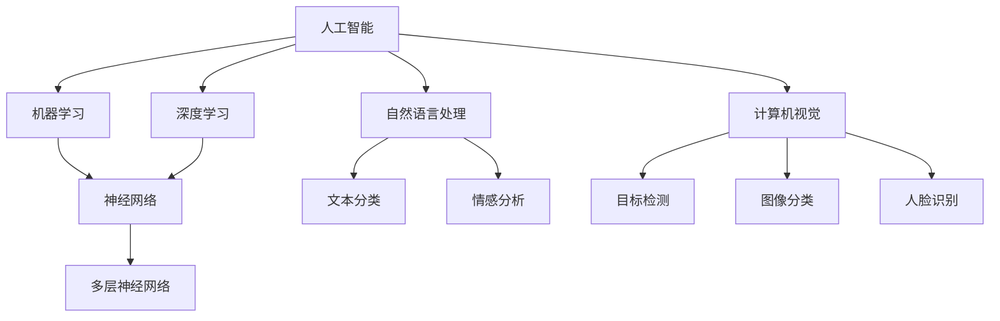

                 

### 背景介绍

> 在当今快速发展的技术时代，人工智能（AI）已成为推动创新和进步的关键力量。无数创业者和科技巨头纷纷投身于AI领域的探索，希望借助AI的力量改变世界。然而，如何在繁杂的技术浪潮中找到清晰的方向和可行的路径，成为了许多AI创业者面临的重大挑战。

人工智能（AI）领域的研究和应用已经取得了令人瞩目的进展。从早期的专家系统，到如今深度学习、自然语言处理和计算机视觉等技术的广泛应用，AI技术在各行各业中发挥着越来越重要的作用。然而，AI的发展并不只是一场技术的竞赛，更是对人类智慧和社会制度的深刻挑战。

对于AI创业者来说，如何把握这一趋势，制定出切实可行的商业策略，将AI技术与实际需求相结合，创造价值，成为了一个亟待解决的问题。在这篇文章中，我们将深入探讨AI创业者在面对这一挑战时所需考虑的关键因素，以及如何构建一个能够实现AI服务于人的码头愿景。

文章将从以下几个方面展开：

1. **核心概念与联系**：介绍AI领域的关键概念和原理，并使用Mermaid流程图展示其架构。
2. **核心算法原理 & 具体操作步骤**：解析AI技术的核心算法，并详细描述其实施过程。
3. **数学模型和公式 & 详细讲解 & 举例说明**：探讨AI领域中的数学模型，并运用LaTeX格式给出相关公式和示例。
4. **项目实战：代码实际案例和详细解释说明**：通过实际项目案例展示AI技术的应用。
5. **实际应用场景**：分析AI技术在不同领域的应用案例。
6. **工具和资源推荐**：推荐相关学习资源和开发工具。
7. **总结：未来发展趋势与挑战**：总结AI创业的未来趋势和面临的挑战。

通过这篇文章，我们希望能够为AI创业者提供一些有价值的思考和实践指导，帮助他们更好地理解AI技术的本质，把握发展方向，实现AI服务于人的美好愿景。

### 核心概念与联系

在深入探讨AI创业者的码头愿景之前，我们首先需要了解一些核心概念和它们之间的联系。以下是我们将讨论的主要概念：

1. **人工智能（AI）**：AI是一门研究、开发和应用使计算机模拟、扩展和辅助人类智能的技术科学。它包括多个子领域，如机器学习、深度学习、自然语言处理和计算机视觉等。

2. **机器学习（ML）**：机器学习是AI的核心组成部分，它通过构建数学模型和算法，使计算机能够从数据中自动学习和改进性能，而不需要显式地编写规则。

3. **深度学习（DL）**：深度学习是机器学习的一个分支，它使用多层神经网络来模拟人脑的决策过程，具有处理复杂数据和模式识别的能力。

4. **神经网络（NN）**：神经网络是一种模仿生物神经系统的计算模型，由大量相互连接的节点（或神经元）组成，通过学习输入数据之间的关系，实现数据分类、回归和其他任务。

5. **自然语言处理（NLP）**：自然语言处理是AI的一个重要分支，致力于使计算机理解和生成人类语言，包括文本分类、情感分析、机器翻译等。

6. **计算机视觉（CV）**：计算机视觉旨在使计算机能够理解和解析数字图像和视频，包括目标检测、图像分类、人脸识别等。

下面，我们将使用Mermaid流程图来展示这些概念之间的联系和结构：



这个流程图清晰地展示了AI领域的主要分支及其相互关系。通过理解这些核心概念，我们可以更好地把握AI技术的发展方向，并为创业者的战略规划提供指导。

### 核心算法原理 & 具体操作步骤

在了解了AI领域的关键概念后，接下来我们将深入探讨AI技术的核心算法原理和具体操作步骤。以下是几个关键的AI算法及其实现过程：

1. **多层神经网络（MLP）**

   多层神经网络（MLP）是深度学习中最基本的结构之一。它由输入层、多个隐藏层和一个输出层组成。每个层由多个节点（或神经元）组成，节点之间通过加权连接相互连接。

   **具体步骤：**
   - **输入层**：接收输入数据，并将其传递到隐藏层。
   - **隐藏层**：每个隐藏层中的节点计算输入数据的加权和，通过激活函数进行处理，传递到下一层。
   - **输出层**：输出层的节点根据激活函数的输出，给出预测结果。

   **实现示例**：
   ```python
   import numpy as np

   # 定义激活函数
   def sigmoid(x):
       return 1 / (1 + np.exp(-x))

   # 定义多层神经网络
   def MLP(inputs, weights):
       hidden_layer_1 = sigmoid(np.dot(inputs, weights['input_to_hidden_1']))
       hidden_layer_2 = sigmoid(np.dot(hidden_layer_1, weights['hidden_1_to_hidden_2']))
       output = sigmoid(np.dot(hidden_layer_2, weights['hidden_2_to_output']))
       return output

   # 初始化权重
   weights = {
       'input_to_hidden_1': np.random.rand(input_size, hidden_size_1),
       'hidden_1_to_hidden_2': np.random.rand(hidden_size_1, hidden_size_2),
       'hidden_2_to_output': np.random.rand(hidden_size_2, output_size)
   }

   # 输入数据
   inputs = np.array([0.5, 0.5])

   # 计算输出
   output = MLP(inputs, weights)
   print(output)
   ```

2. **反向传播算法（Backpropagation）**

   反向传播算法是用于训练多层神经网络的优化算法。它通过计算误差梯度，更新网络中的权重，以最小化输出误差。

   **具体步骤：**
   - **前向传播**：将输入数据传递到网络中，计算输出结果。
   - **计算误差**：比较输出结果和实际值，计算误差。
   - **反向传播**：计算误差梯度，更新网络权重。
   - **迭代优化**：重复前向传播和反向传播，直到达到预设的误差阈值或迭代次数。

   **实现示例**：
   ```python
   import numpy as np

   # 定义损失函数
   def mean_squared_error(y_true, y_pred):
       return np.mean((y_true - y_pred) ** 2)

   # 定义反向传播算法
   def backpropagation(inputs, weights, output, expected_output):
       output_error = expected_output - output
       d_output = output_error * (1 - output)

       hidden_layer_2_error = d_output.dot(weights['hidden_2_to_output'].T)
       d_hidden_layer_2 = hidden_layer_2_error * (1 - hidden_layer_2)

       hidden_layer_1_error = d_hidden_layer_2.dot(weights['hidden_1_to_hidden_2'].T)
       d_hidden_layer_1 = hidden_layer_1_error * (1 - hidden_layer_1)

       input_error = d_hidden_layer_1.dot(weights['input_to_hidden_1'].T)
       d_input = input_error

       # 更新权重
       weights['input_to_hidden_1'] -= learning_rate * d_input
       weights['hidden_1_to_hidden_2'] -= learning_rate * d_hidden_layer_1
       weights['hidden_2_to_output'] -= learning_rate * d_output

       return mean_squared_error(expected_output, output)

   # 初始化权重
   weights = {
       'input_to_hidden_1': np.random.rand(input_size, hidden_size_1),
       'hidden_1_to_hidden_2': np.random.rand(hidden_size_1, hidden_size_2),
       'hidden_2_to_output': np.random.rand(hidden_size_2, output_size)
   }

   # 输入数据
   inputs = np.array([0.5, 0.5])
   expected_output = np.array([0.9])

   # 训练网络
   for epoch in range(1000):
       output = MLP(inputs, weights)
       loss = backpropagation(inputs, weights, output, expected_output)
       if epoch % 100 == 0:
           print(f"Epoch {epoch}, Loss: {loss}")

   # 计算输出
   output = MLP(inputs, weights)
   print(output)
   ```

3. **卷积神经网络（CNN）**

   卷积神经网络是用于处理图像数据的深度学习模型。它通过卷积层、池化层和全连接层等结构，实现对图像的特征提取和分类。

   **具体步骤：**
   - **卷积层**：通过卷积操作提取图像的局部特征。
   - **池化层**：通过池化操作降低特征图的维度，减少计算量。
   - **全连接层**：将卷积层和池化层提取的特征映射到输出层，进行分类。

   **实现示例**：
   ```python
   import tensorflow as tf
   from tensorflow.keras import layers, models

   # 定义卷积神经网络模型
   model = models.Sequential([
       layers.Conv2D(32, (3, 3), activation='relu', input_shape=(28, 28, 1)),
       layers.MaxPooling2D((2, 2)),
       layers.Conv2D(64, (3, 3), activation='relu'),
       layers.MaxPooling2D((2, 2)),
       layers.Flatten(),
       layers.Dense(64, activation='relu'),
       layers.Dense(10, activation='softmax')
   ])

   # 编译模型
   model.compile(optimizer='adam',
                 loss='sparse_categorical_crossentropy',
                 metrics=['accuracy'])

   # 训练模型
   model.fit(x_train, y_train, epochs=5)

   # 评估模型
   test_loss, test_acc = model.evaluate(x_test, y_test)
   print(f"Test accuracy: {test_acc}")
   ```

通过以上算法的介绍和实现示例，我们可以看到AI技术的核心算法具有复杂性和多样性。在AI创业过程中，理解和掌握这些算法原理，并能够灵活运用，是实现技术突破和商业成功的关键。

### 数学模型和公式 & 详细讲解 & 举例说明

在人工智能领域，数学模型和公式是理解和实现算法的核心。以下我们将探讨几个关键的数学模型和公式，并使用LaTeX格式进行详细讲解，结合具体示例进行说明。

#### 1. 感知机（Perceptron）

感知机是一种简单的线性二分类模型，用于求解线性可分数据。它的核心数学公式是激活函数，用于决定神经元是否被激活。

**LaTeX格式：**
$$
f(x) = \text{sign}(w \cdot x + b)
$$

**详细讲解：**
- \( w \)：权重向量，用于衡量输入特征的重要性。
- \( x \)：输入特征向量。
- \( b \)：偏置项，用于调整激活阈值的偏移量。
- \( \text{sign}(x) \)：符号函数，当 \( x \geq 0 \) 时返回 1，当 \( x < 0 \) 时返回 -1。

**举例说明：**
假设我们有一个简单的一维数据集，其中 \( x = [1, 2, 3] \)，权重 \( w = [1, 1] \)，偏置 \( b = 0 \)。

$$
f(x) = \text{sign}(1 \cdot 1 + 1 \cdot 2 + 0) = \text{sign}(3) = 1
$$

由于所有输入值都大于零，输出结果为1，表示数据属于正类。

#### 2. 损失函数（Loss Function）

在机器学习中，损失函数用于评估模型预测结果与实际值之间的差距。最常用的损失函数包括均方误差（MSE）和交叉熵损失（Cross-Entropy Loss）。

**LaTeX格式：**
$$
\text{MSE} = \frac{1}{n}\sum_{i=1}^{n}(y_i - \hat{y}_i)^2
$$
$$
\text{Cross-Entropy Loss} = -\frac{1}{n}\sum_{i=1}^{n} y_i \log(\hat{y}_i)
$$

**详细讲解：**
- \( y_i \)：实际值。
- \( \hat{y}_i \)：预测值。
- \( n \)：样本数量。

**举例说明：**
假设我们有三个样本 \( y = [0.1, 0.5, 0.9] \)，预测值 \( \hat{y} = [0.2, 0.4, 0.8] \)。

**均方误差（MSE）：**
$$
\text{MSE} = \frac{1}{3}\sum_{i=1}^{3}(0.1 - 0.2)^2 + (0.5 - 0.4)^2 + (0.9 - 0.8)^2 = 0.01 + 0.01 + 0.01 = 0.03
$$

**交叉熵损失（Cross-Entropy Loss）：**
$$
\text{Cross-Entropy Loss} = -\frac{1}{3}\sum_{i=1}^{3} 0.1 \log(0.2) + 0.5 \log(0.4) + 0.9 \log(0.8) \approx 0.145
$$

#### 3. 梯度下降（Gradient Descent）

梯度下降是一种用于最小化损失函数的优化算法。其核心公式是计算损失函数相对于参数的梯度，并沿着梯度方向更新参数。

**LaTeX格式：**
$$
w_{\text{new}} = w_{\text{current}} - \alpha \cdot \nabla_w \text{Loss}
$$

**详细讲解：**
- \( w_{\text{current}} \)：当前参数值。
- \( \alpha \)：学习率，控制参数更新的步长。
- \( \nabla_w \text{Loss} \)：损失函数相对于参数的梯度。

**举例说明：**
假设损失函数为 \( \text{Loss}(w) = (w - 1)^2 \)，学习率 \( \alpha = 0.1 \)。

当前参数 \( w_{\text{current}} = 2 \)，损失函数的梯度 \( \nabla_w \text{Loss} = 2(w - 1) \)。

更新参数：
$$
w_{\text{new}} = 2 - 0.1 \cdot 2(2 - 1) = 1.8
$$

经过一次迭代后，参数值更新为 1.8。

通过以上数学模型和公式的讲解，我们可以更好地理解AI算法的工作原理和实现过程。这些基础理论不仅帮助我们深入理解AI技术，也为创业者在实际应用中提供了坚实的理论基础。

### 项目实战：代码实际案例和详细解释说明

为了更好地展示AI技术的应用，我们将通过一个实际项目案例来讲解如何实现AI模型，并进行详细解释说明。本项目将使用Python编程语言和TensorFlow框架来实现一个基于卷积神经网络的图像分类器。

#### 1. 开发环境搭建

在开始项目之前，我们需要搭建一个适合开发和测试的环境。以下是我们需要的工具和库：

- Python 3.8 或更高版本
- TensorFlow 2.4 或更高版本
- NumPy 1.18 或更高版本
- Matplotlib 3.3.3 或更高版本

安装这些库可以使用以下命令：

```bash
pip install python==3.8
pip install tensorflow==2.4
pip install numpy==1.18
pip install matplotlib==3.3.3
```

#### 2. 源代码详细实现和代码解读

以下是我们项目的源代码实现，我们将逐行进行解释：

```python
import tensorflow as tf
from tensorflow.keras import datasets, layers, models
import matplotlib.pyplot as plt

# 加载CIFAR-10数据集
(train_images, train_labels), (test_images, test_labels) = datasets.cifar10.load_data()

# 数据预处理
train_images, test_images = train_images / 255.0, test_images / 255.0

# 创建卷积神经网络模型
model = models.Sequential()
model.add(layers.Conv2D(32, (3, 3), activation='relu', input_shape=(32, 32, 3)))
model.add(layers.MaxPooling2D((2, 2)))
model.add(layers.Conv2D(64, (3, 3), activation='relu'))
model.add(layers.MaxPooling2D((2, 2)))
model.add(layers.Conv2D(64, (3, 3), activation='relu'))
model.add(layers.Flatten())
model.add(layers.Dense(64, activation='relu'))
model.add(layers.Dense(10))

# 编译模型
model.compile(optimizer='adam',
              loss=tf.keras.losses.SparseCategoricalCrossentropy(from_logits=True),
              metrics=['accuracy'])

# 训练模型
history = model.fit(train_images, train_labels, epochs=10, 
                    validation_data=(test_images, test_labels))

# 评估模型
test_loss, test_acc = model.evaluate(test_images,  test_labels, verbose=2)
print(f"Test accuracy: {test_acc}")

# 可视化训练过程
plt.plot(history.history['accuracy'], label='accuracy')
plt.plot(history.history['val_accuracy'], label = 'val_accuracy')
plt.xlabel('Epoch')
plt.ylabel('Accuracy')
plt.ylim([0.5, 1])
plt.legend(loc='lower right')

test_images = test_images[0:9]
class_names = ['airplane', 'automobile', 'bird', 'cat', 'deer',
               'dog', 'frog', 'horse', 'ship', 'truck']

plt.figure(figsize=(10, 10))
for i in range(9):
    plt.subplot(3, 3, i+1)
    plt.imshow(test_images[i])
    plt.grid(False)
    plt.xticks([])
    plt.yticks([])
    plt.xlabel(class_names[model.predict(test_images[i:i+1]).argmax()])
plt.show()
```

#### 3. 代码解读与分析

- **数据加载与预处理**：
  - 使用 TensorFlow 的 datasets.cifar10 加载 CIFAR-10 数据集，该数据集包含 50000 个训练图像和 10000 个测试图像，每幅图像大小为 32x32 像素。
  - 数据集包含10个类别，每个类别的图像数量大致相等。
  - 将图像数据除以 255，将其缩放到 [0, 1] 范围内，便于模型训练。

- **模型构建**：
  - 创建一个序列模型（Sequential），添加多个卷积层（Conv2D）、最大池化层（MaxPooling2D）和全连接层（Dense）。
  - 第一个卷积层使用 32 个 3x3 卷积核，激活函数为 ReLU。
  - 接着使用最大池化层，以减小特征图的大小。
  - 第二个卷积层使用 64 个 3x3 卷积核，同样使用 ReLU 激活函数。
  - 再次使用最大池化层。
  - 第三个卷积层使用 64 个 3x3 卷积核。
  - 将卷积层的输出展平，添加一个全连接层，用于分类，激活函数为 ReLU。
  - 最后添加一个输出层，用于生成10个类别的概率分布，激活函数为 Softmax。

- **模型编译**：
  - 使用 Adam 优化器。
  - 使用稀疏分类交叉熵（SparseCategoricalCrossentropy）作为损失函数。
  - 指定模型的评估指标为准确率（accuracy）。

- **模型训练**：
  - 使用训练数据集训练模型，设置训练周期为10个epoch。
  - 使用测试数据集进行验证。

- **模型评估**：
  - 使用测试数据集评估模型，输出测试准确率。

- **可视化训练过程**：
  - 绘制训练和验证过程中的准确率曲线，以便观察模型的收敛情况。

- **图像预测**：
  - 显示9个测试图像及其预测类别，使用模型预测每个图像的类别概率，并显示预测结果。

通过以上代码实现，我们可以看到如何使用卷积神经网络对图像进行分类。该项目展示了从数据加载、模型构建、训练到评估的完整流程，为实际应用提供了清晰的参考。

### 实际应用场景

AI技术已经在多个领域得到了广泛应用，以下是一些具体的实际应用场景：

#### 1. 医疗健康

在医疗健康领域，AI技术主要用于诊断、治疗和患者管理。例如：

- **疾病诊断**：利用深度学习算法分析医学影像，如X光、CT和MRI，辅助医生进行癌症、骨折等疾病的诊断。
- **药物研发**：AI可以加速新药的发现和开发，通过模拟和预测药物与生物分子之间的相互作用。
- **健康监测**：智能穿戴设备结合AI算法，实时监测用户的健康数据，如心率、血压等，提供个性化的健康建议。

#### 2. 金融服务

在金融服务领域，AI技术被用于风险管理、欺诈检测和客户服务等方面：

- **风险管理**：AI可以分析大量的金融数据，预测市场趋势和风险，帮助金融机构制定更精准的风险控制策略。
- **欺诈检测**：通过机器学习和模式识别技术，实时监测交易活动，识别和防范欺诈行为。
- **智能客服**：利用自然语言处理技术，智能客服系统能够理解客户的询问并自动生成回应，提高客户服务效率。

#### 3. 交通运输

AI技术在交通运输领域也有广泛的应用，如自动驾驶、交通管理和物流优化：

- **自动驾驶**：自动驾驶汽车使用AI技术进行环境感知、路径规划和决策，实现无人驾驶。
- **交通管理**：通过分析交通流量数据，AI系统可以优化交通信号灯控制，减少拥堵。
- **物流优化**：AI算法可以帮助物流公司优化配送路线和库存管理，提高物流效率。

#### 4. 零售电商

在零售电商领域，AI技术被用于个性化推荐、库存管理和客户关系管理：

- **个性化推荐**：基于用户的行为和偏好数据，AI算法可以推荐商品，提高用户的购买体验和转化率。
- **库存管理**：AI系统可以预测市场需求，优化库存水平，减少库存成本。
- **客户服务**：智能客服系统和聊天机器人可以快速响应客户问题，提供高效的服务。

#### 5. 教育

在教育领域，AI技术被用于智能教学、学习分析和教育资源共享：

- **智能教学**：AI系统可以根据学生的学习习惯和进度，提供个性化的学习建议和资源。
- **学习分析**：通过分析学生的学习行为和成绩数据，AI系统可以评估学生的学习效果，帮助教师进行教学调整。
- **资源共享**：AI技术可以帮助学校和教育机构更好地管理和分享教育资源，提高教育质量和效率。

通过以上实际应用场景，我们可以看到AI技术如何改变各行各业，提高效率，创造价值。对于AI创业者来说，抓住这些应用场景，实现技术的商业落地，是实现成功的关键。

### 工具和资源推荐

在AI创业过程中，选择合适的工具和资源至关重要。以下是我们为AI创业者推荐的几个关键工具和资源：

#### 1. 学习资源推荐

**书籍：**
- 《深度学习》（Goodfellow, I., Bengio, Y., & Courville, A.）
- 《Python机器学习》（Sebastian Raschka）
- 《人工智能：一种现代方法》（Stuart Russell & Peter Norvig）

**论文：**
- “Deep Learning” (Y. LeCun, Y. Bengio, and G. Hinton)
- “Learning representations by maximizing mutual information” (Y. Burda et al.)

**博客和网站：**
- Fast.ai：提供免费的深度学习课程和资源。
- Medium：许多专业博客作者和公司分享AI相关内容。
- TensorFlow官方文档：详细介绍了TensorFlow的使用方法和最佳实践。

#### 2. 开发工具框架推荐

**框架和库：**
- TensorFlow：适用于各种深度学习任务的开源框架。
- PyTorch：具有动态计算图和灵活性的深度学习框架。
- Keras：简洁易用的深度学习库，建立在TensorFlow和Theano之上。

**集成开发环境（IDE）：**
- Jupyter Notebook：交互式的开发环境，便于编写和运行代码。
- PyCharm：强大的Python IDE，支持多种编程语言和框架。

**数据集和平台：**
- Kaggle：提供各种数据集和竞赛，是学习和实践AI的好地方。
- Google Dataset Search：搜索和发现公共数据集的平台。
- UCI Machine Learning Repository：提供多种领域的标准数据集。

#### 3. 相关论文著作推荐

**论文：**
- “Attention Is All You Need” (Vaswani et al., 2017)
- “Generative Adversarial Nets” (Goodfellow et al., 2014)
- “Recurrent Neural Networks” (Hochreiter & Schmidhuber, 1997)

**著作：**
- 《人工智能：一种现代方法》（3rd Edition, Stuart J. Russell & Peter Norvig）
- 《深度学习》（Ian Goodfellow、Yoshua Bengio和Aaron Courville）
- 《Python机器学习》（Sebastian Raschka）

通过以上工具和资源的推荐，AI创业者可以更好地掌握AI技术和方法，为自己的创业项目提供坚实的理论基础和实践支持。

### 总结：未来发展趋势与挑战

在AI创业的道路上，未来的发展趋势与挑战并存。首先，让我们来看看未来可能的发展方向：

#### 发展趋势

1. **更强大的算法与模型**：随着计算能力和算法研究的进步，深度学习和其他AI模型将变得更加高效和强大。例如，生成对抗网络（GAN）和自注意力机制（Attention Mechanism）将继续推动AI技术的创新。

2. **跨领域应用**：AI技术将在更多领域得到应用，如智能制造、智慧城市、健康医疗和金融科技等。跨领域合作将带来新的商业模式和解决方案。

3. **数据隐私与安全性**：随着AI技术的广泛应用，数据隐私和保护将成为重要议题。发展可解释AI和隐私保护算法，以保障用户隐私和数据安全。

4. **泛在智能**：AI技术将更加普及，成为我们日常生活中不可或缺的一部分。智能家居、智能交通和智能医疗等领域将实现全面的智能升级。

#### 挑战

1. **数据质量和隐私**：AI模型的性能很大程度上依赖于数据质量。如何获取高质量、多样化的数据，同时保护用户隐私，是一个重要挑战。

2. **模型解释性**：当前许多AI模型（如深度神经网络）难以解释。如何提高模型的透明度和可解释性，使其能够被用户和监管机构理解，是AI创业的重要挑战。

3. **计算资源**：训练复杂的AI模型需要大量的计算资源。如何在有限的资源下实现高效训练，是一个技术难题。

4. **人才短缺**：AI领域的人才需求巨大，而高质量的人才供应不足。培养和吸引AI人才，是创业成功的关键。

5. **伦理和监管**：随着AI技术的广泛应用，伦理和监管问题逐渐凸显。如何制定合理的监管政策，确保AI技术的健康发展，是一个重要议题。

总的来说，AI创业者需要在技术、数据、人才、伦理和监管等多个方面做好准备，迎接未来的机遇和挑战。通过不断学习和创新，他们可以在AI领域找到自己的独特定位，实现商业成功和社会价值。

### 附录：常见问题与解答

在AI创业过程中，可能会遇到各种技术和管理上的挑战。以下是一些常见问题及解答，希望能为创业者提供一些帮助。

#### 问题1：如何选择合适的AI模型？

**解答：** 选择AI模型时，需要考虑以下几个因素：

- **数据量**：对于数据量较小的任务，选择简单的模型如线性回归或决策树可能更合适。对于大数据集，可以考虑使用深度学习模型。
- **数据特性**：如果数据具有非线性特性，深度学习模型可能表现更好。如果数据较为简单，线性模型或决策树可能足够。
- **计算资源**：大型模型（如深度神经网络）需要更多的计算资源和时间来训练，因此需要根据实际资源进行选择。

#### 问题2：如何处理数据隐私问题？

**解答：** 处理数据隐私问题可以从以下几个方面入手：

- **数据去识别化**：使用去识别化技术（如差分隐私）对数据进行处理，减少可识别性。
- **数据加密**：对敏感数据进行加密，确保数据在传输和存储过程中的安全性。
- **数据最小化**：只收集和存储必要的数据，减少数据泄露的风险。
- **透明度与用户控制**：确保用户对自己的数据有控制权，并明确告知用户数据的用途。

#### 问题3：如何提升模型的可解释性？

**解答：** 提升模型的可解释性可以从以下几个方面进行：

- **使用可解释模型**：如决策树、线性回归等，这些模型本身具有较强的解释性。
- **模型解释工具**：使用工具（如LIME、SHAP等）对复杂模型进行解释，帮助理解模型决策过程。
- **可视化技术**：通过可视化技术展示模型的学习过程和决策路径，提高模型的透明度。

#### 问题4：如何应对人才短缺问题？

**解答：** 应对人才短缺可以从以下几个方面进行：

- **内部培养**：通过内部培训和职业发展计划，培养自己的AI人才。
- **外部合作**：与高校、研究机构合作，共同培养和吸引AI人才。
- **灵活招聘**：采取远程办公、兼职等多种形式，吸引全球范围内的AI人才。

通过上述解答，我们希望AI创业者能够在面对技术挑战和管理难题时，找到合适的解决方案，为AI创业的成功奠定基础。

### 扩展阅读 & 参考资料

为了帮助读者更深入地了解AI技术和创业相关的内容，我们推荐以下扩展阅读和参考资料：

#### 扩展阅读

- [《深度学习》](https://www.deeplearningbook.org/)：Ian Goodfellow、Yoshua Bengio和Aaron Courville 著，全面介绍深度学习的原理和实践。
- [《Python机器学习》](https://machinelearningmastery.com/)：Sebastian Raschka 著，详细介绍如何使用Python进行机器学习。
- [《AI创业指南》](https://ai.fyi/startup/)：AI创业相关的资源和案例分析。

#### 参考资料

- **学术论文：**
  - [“Attention Is All You Need”](https://arxiv.org/abs/1706.03762)
  - [“Generative Adversarial Nets”](https://arxiv.org/abs/1406.2661)
  - [“Deep Learning”](https://arxiv.org/abs/1406.5013)

- **开源框架与工具：**
  - [TensorFlow](https://www.tensorflow.org/)
  - [PyTorch](https://pytorch.org/)
  - [Keras](https://keras.io/)

- **在线课程与资源：**
  - [Fast.ai](https://fast.ai/)
  - [Coursera](https://www.coursera.org/)：提供多种AI相关的在线课程
  - [edX](https://www.edx.org/)：提供免费的AI课程和证书项目

通过这些扩展阅读和参考资料，读者可以进一步深入了解AI技术的核心概念、应用实践和创业策略，为自己的研究和工作提供更多灵感和支持。

