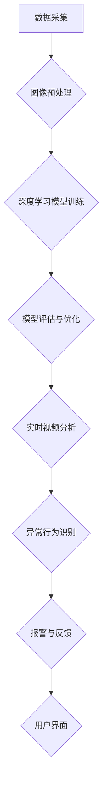

                 

### 背景介绍

**标题：** AI创业者的码头故事：95后AI博士的选择

**关键词：** AI创业、95后博士、技术选择、创业路径

**摘要：** 本文将围绕一位95后AI博士的创业故事，深入探讨他如何选择技术路线，构建AI产品，并在激烈的市场竞争中找到自己的定位。通过他的经历，读者可以了解AI创业的挑战与机遇，以及如何在这个充满变革的时代，把握机遇，实现个人价值。

在这个大数据、云计算和人工智能快速发展的时代，越来越多的年轻人选择投身AI创业的大潮。本文的主角，小王，就是这样一个95后AI博士。他毕业于世界知名大学，研究方向集中在计算机视觉和机器学习领域。在学术上取得一定成绩后，他决定放下实验室的成果，走向创业之路。本文将跟随小王的脚步，了解他如何从零开始，构建自己的AI产品，并在竞争激烈的市场中找到一席之地。

### 1. 创业动机与初心

小王从小就对科技有着浓厚的兴趣。他记得第一次接触计算机是在小学五年级，一台老式的电脑激发了他对编程的无限好奇。随着年龄的增长，他的兴趣逐渐聚焦在计算机科学和人工智能领域。在大学期间，他选择了计算机科学与技术专业，并在导师的指导下，开始了对机器学习的研究。

小王在一次学术会议上，聆听了某位人工智能创业者的演讲。那个演讲者讲述了如何将AI技术应用到实际场景中的经历，以及创业过程中遇到的困难和挑战。小王的内心被深深触动，他意识到，学术研究的成果最终需要通过产品化来服务于社会，而创业是实现这一目标的最佳途径。

“我想通过创业，将AI技术带给更多的人，让生活变得更加美好。”小王在心中暗自下定决心。他开始积极地寻找创业机会，并最终确定了一个专注于计算机视觉领域的AI产品开发。

### 2. 技术选择与路线

在确定创业方向后，小王开始思考如何选择合适的技术路线。计算机视觉和机器学习领域的技术日新月异，他需要找到一个既有前沿性，又具有市场潜力的方向。

在多次讨论和思考后，小王决定聚焦于智能安防领域。他看到，随着城市化进程的加快，安防需求日益增加，但传统的安防技术存在很多局限性。例如，监控摄像头虽然能捕捉到大量的图像数据，但人力的分析效率低下，而且容易出现误报。小王认为，通过引入AI技术，可以大幅提升安防系统的智能化水平，提高安全性和效率。

在具体技术选择上，小王决定采用深度学习技术，尤其是卷积神经网络（CNN）和循环神经网络（RNN）。CNN擅长处理图像数据，能够有效地识别图像中的物体和场景；RNN则在处理序列数据时表现出色，可以用于视频数据的分析。

“深度学习技术是目前最前沿的人工智能技术之一，它有巨大的潜力应用到实际场景中。”小王说。

### 3. 产品构建与开发

在确定了技术路线后，小王开始了产品的构建和开发工作。他首先组建了一支核心团队，成员包括他在大学时期的导师、一位经验丰富的算法工程师，以及几位具有计算机视觉背景的博士生。

团队成立后，小王明确了产品的核心功能，即通过AI算法对视频监控数据进行实时分析，识别潜在的安全威胁，并自动报警。为了实现这一目标，他们首先需要收集大量的视频数据，用于训练和优化算法。

在数据收集过程中，小王遇到了很大的挑战。由于监控数据涉及隐私，很多数据来源无法直接获取。他不得不通过与政府、企业和社区合作，获取到一部分数据。同时，他还使用了公开数据集，如ImageNet和COCO数据集，作为训练数据的补充。

数据收集完成后，小王的团队开始进行算法模型的开发和优化。他们使用了多种深度学习框架，如TensorFlow和PyTorch，进行模型的训练和测试。在多次实验和调整后，他们终于开发出了具有较高准确率和实时性的算法模型。

在产品开发过程中，小王还注重用户体验的设计。他认为，一个优秀的AI产品不仅需要强大的算法支持，还需要易于使用和操作的用户界面。因此，他邀请了多位用户体验设计师，对产品的交互界面进行多次迭代和优化。

### 4. 市场竞争与定位

在智能安防领域，小王面临着激烈的竞争。国内外众多企业和研究机构都在争夺市场份额，如何在这个竞争激烈的市场中找到自己的定位，是摆在小王面前的一大挑战。

小王认为，要想在市场中脱颖而出，首先要做到的是技术的领先性。他希望通过不断提升算法模型的性能，确保产品的技术优势。同时，他还注重产品的实用性和易用性，希望通过优秀的用户体验，赢得用户的信任和认可。

在市场定位上，小王决定先从本地市场入手，逐步拓展到全国乃至全球市场。他认为，本地市场熟悉度高，用户反馈及时，有利于产品的优化和改进。随着产品的成熟和知名度提升，再逐步扩大市场范围。

### 5. 融资与成长

在产品开发和市场推广过程中，小王意识到，仅靠团队的原始积累是不足以支撑公司长期发展的。他开始积极寻求外部融资，以获得更多的资金支持和资源。

小王通过参加各类创业大赛、行业峰会等活动，结识了众多投资人。在多次路演和交流中，他详细介绍了自己的创业项目，展示了产品的技术优势和市场需求。最终，他成功获得了多家投资机构的青睐，完成了数轮融资。

随着资金的到位，小王的公司开始迅速扩张。他们引进了更多的技术人才，扩大了研发团队，还与多家企业和研究机构建立了合作关系。公司的产品线也不断丰富，除了智能安防，还拓展到了智能交通、智能医疗等领域。

### 6. 创业心得与启示

在创业的道路上，小王经历了许多挑战和困难。但他始终坚信，只要坚持不懈，就一定能够实现自己的梦想。以下是他在创业过程中的一些心得和启示：

1. **技术是根本**：创业首先要选择一个有技术壁垒的领域，这样才能在激烈的市场竞争中立于不败之地。

2. **市场需求导向**：创业不仅要追求技术创新，还要关注市场需求，确保产品能够解决用户实际问题。

3. **团队协作**：创业不是单打独斗，而是需要一支高效的团队。团队成员之间要相互信任、互补优势，共同推进项目。

4. **用户体验至上**：一个优秀的AI产品不仅要有强大的算法支持，还要有良好的用户体验。只有用户认可和满意，产品才能获得成功。

5. **持续学习与进步**：在快速变化的技术和市场中，创业公司要始终保持学习的心态，不断更新知识和技能，以适应市场的变化。

### 7. 未来展望

随着人工智能技术的不断进步，智能安防领域的市场潜力巨大。小王对未来充满信心，他希望通过不断提升产品和技术的竞争力，将公司打造成智能安防领域的领军企业。

他计划在未来几年，进一步拓展产品线，推出更多具有创新性的AI产品。同时，他还计划与更多的行业合作伙伴建立深度合作，共同推动人工智能技术在各行业的应用。

“我们的目标是，让每一个人都能享受到AI带来的安全与便捷。”小王说。

### 结论

小王的创业故事，是一段充满挑战与机遇的旅程。他通过技术创新和市场需求导向，成功构建了一款具有竞争力的AI产品。他的经历给我们展示了AI创业的广阔前景，也为我们提供了宝贵的启示。

在这个充满变革的时代，我们相信，更多像小王一样的年轻人，将在这个领域创造出更多的奇迹。让我们一起期待，人工智能技术在各个领域的应用，如何改变我们的未来。|>### 核心概念与联系

**标题：** 深度学习与计算机视觉在智能安防中的应用

**备注：** 本文将介绍深度学习和计算机视觉在智能安防领域中的核心概念和联系，并使用Mermaid流程图展示关键节点和流程。

**关键词：** 深度学习、计算机视觉、智能安防、AI算法、实时分析、图像识别

**Mermaid流程图：**



**流程图详细说明：**

1. **数据采集（A）**：
   - 监控摄像头捕获实时视频流。
   - 数据源包括公开数据集和合作企业/政府提供的隐私保护数据。

2. **图像预处理（B）**：
   - 对捕获的视频数据进行降噪、缩放、裁剪等处理。
   - 提取关键帧或帧序列，为深度学习模型提供输入。

3. **深度学习模型训练（C）**：
   - 使用卷积神经网络（CNN）和循环神经网络（RNN）对图像和视频数据进行训练。
   - 模型优化包括超参数调整、网络结构改进和损失函数优化。

4. **模型评估与优化（D）**：
   - 使用交叉验证和测试集对模型进行评估。
   - 根据评估结果对模型进行调整和优化，提高准确率和实时性。

5. **实时视频分析（E）**：
   - 将训练好的模型应用于实时视频流，进行实时图像识别和分析。
   - 提取关键特征，如人脸、车辆、动作等，用于后续处理。

6. **异常行为识别（F）**：
   - 通过对比正常行为和异常行为，识别潜在的安全威胁。
   - 使用分类算法和阈值设定，对异常行为进行报警。

7. **报警与反馈（G）**：
   - 发送报警通知到相关管理人员或监控中心。
   - 记录和分析报警数据，用于后续的优化和改进。

8. **用户界面（H）**：
   - 提供直观、易用的用户界面，展示分析结果和报警信息。
   - 支持用户自定义设置，如报警阈值、监控区域等。

通过上述流程，深度学习和计算机视觉技术实现了从视频数据采集到异常行为识别的全过程，为智能安防系统提供了强大的技术支持。在本文后续章节中，我们将进一步探讨这些核心概念的具体原理和应用细节。|>### 核心算法原理 & 具体操作步骤

**标题：** 深度学习与计算机视觉算法原理及应用步骤

**关键词：** 深度学习、计算机视觉、算法原理、操作步骤、卷积神经网络（CNN）、循环神经网络（RNN）

**1. 卷积神经网络（CNN）原理：**

卷积神经网络是一种深度学习模型，专门用于处理图像和视频数据。其核心思想是通过多层卷积和池化操作，提取图像中的特征，并逐步构建复杂的特征表示。

- **卷积层（Convolutional Layer）**：通过卷积操作提取图像特征，卷积核滑动在输入图像上，计算局部特征图。
- **激活函数（Activation Function）**：常用的激活函数包括ReLU（Rectified Linear Unit），用于引入非线性。
- **池化层（Pooling Layer）**：通过池化操作（如最大池化、平均池化）降低特征图维度，减少参数数量。
- **全连接层（Fully Connected Layer）**：将卷积层和池化层提取的特征进行全局整合，用于分类或回归任务。

**CNN操作步骤：**

1. **输入层**：接收原始图像数据，通常为二维或三维的张量。
2. **卷积层**：通过卷积操作提取图像特征，输出特征图。
3. **激活函数**：对卷积层输出应用激活函数，引入非线性。
4. **池化层**：对特征图进行池化操作，降低维度。
5. **全连接层**：将特征图展平为一维张量，进行分类或回归。
6. **输出层**：输出预测结果，如类别标签或连续值。

**2. 循环神经网络（RNN）原理：**

循环神经网络是一种处理序列数据的深度学习模型，特别适用于视频数据的分析。RNN通过记忆机制，能够处理长序列数据，并捕捉时间序列中的依赖关系。

- **隐藏层（Hidden Layer）**：RNN包含多个隐藏层，每个隐藏层都保存前一时刻的状态信息。
- **记忆单元（Memory Unit）**：记忆单元用于存储当前时刻的状态，并更新为下一时刻的状态。
- **权重矩阵（Weight Matrix）**：权重矩阵连接不同时间步的隐藏层，用于传递信息。

**RNN操作步骤：**

1. **输入层**：接收序列数据，如视频帧。
2. **嵌入层**：将序列数据嵌入为高维向量。
3. **隐藏层**：通过递归操作，更新隐藏层状态，保存历史信息。
4. **输出层**：从隐藏层提取特征，用于分类或回归任务。

**3. 深度学习与计算机视觉算法应用步骤：**

1. **数据预处理**：
   - 对原始图像和视频数据进行归一化、裁剪、旋转等预处理操作。
   - 将图像转换为固定尺寸的矩阵，以便输入到神经网络中。

2. **模型选择**：
   - 根据任务需求，选择合适的深度学习模型，如CNN或RNN。
   - 调整模型参数，如学习率、批次大小、正则化等。

3. **数据集划分**：
   - 将数据集划分为训练集、验证集和测试集。
   - 使用训练集训练模型，验证集用于调参和模型评估，测试集用于最终评估模型性能。

4. **模型训练**：
   - 使用训练集数据，通过前向传播和反向传播算法，训练深度学习模型。
   - 调整模型参数，优化模型性能。

5. **模型评估**：
   - 使用验证集对训练好的模型进行评估，计算准确率、召回率等指标。
   - 根据评估结果，对模型进行调整和优化。

6. **实时视频分析**：
   - 将训练好的模型应用于实时视频流，进行图像识别和序列分析。
   - 输出实时预测结果，如人脸识别、动作识别等。

7. **用户界面**：
   - 提供直观、易用的用户界面，展示实时分析和报警信息。
   - 支持用户自定义设置，如监控区域、报警阈值等。

通过以上步骤，深度学习和计算机视觉算法在智能安防领域得到了广泛应用。在实际应用中，可以根据具体需求，调整和优化算法模型，以提高系统的准确性和实时性。在本文后续章节中，我们将进一步探讨这些算法的数学模型和公式，以及具体的代码实现。|>### 数学模型和公式 & 详细讲解 & 举例说明

**标题：** 深度学习与计算机视觉中的数学模型和公式详解

**关键词：** 深度学习、计算机视觉、数学模型、公式、卷积神经网络（CNN）、循环神经网络（RNN）

**1. 卷积神经网络（CNN）中的数学模型和公式：**

卷积神经网络（CNN）是一种深度学习模型，专门用于处理图像和视频数据。其主要数学模型包括卷积操作、激活函数、池化操作和反向传播算法。以下是对这些操作的具体数学公式进行详细讲解。

- **卷积操作**：
  - **卷积核**：一个固定大小的矩阵，用于提取图像中的局部特征。
  - **输入特征图**：一个二维或三维的张量，表示图像或视频帧。
  - **输出特征图**：通过卷积操作得到的特征图，包含提取到的局部特征。

  $$\text{卷积操作} \; \text{out}_{ij} = \sum_{k=1}^{C} \sum_{l=1}^{H_W} \sum_{m=1}^{H_W} w_{klm} \times \text{in}_{ijkl} + b_j$$

  其中，$w_{klm}$ 是卷积核的权重，$\text{in}_{ijkl}$ 是输入特征图的元素，$b_j$ 是偏置项，$\text{out}_{ij}$ 是输出特征图的元素。

- **激活函数**：
  - 常用的激活函数包括ReLU（Rectified Linear Unit）、Sigmoid和Tanh。
  -ReLU函数能够引入非线性，并减少梯度消失问题。

  $$\text{ReLU}(x) = \max(0, x)$$

- **池化操作**：
  - 池化操作用于降低特征图的维度，减少计算量和参数数量。
  - 常用的池化操作包括最大池化和平均池化。

  $$\text{最大池化} \; \text{pool}_{ij} = \max_{k} \text{in}_{ijk}$$

  $$\text{平均池化} \; \text{pool}_{ij} = \frac{1}{P} \sum_{k} \text{in}_{ijk}$$

  其中，$P$ 是池化窗口的大小。

- **反向传播算法**：
  - 反向传播算法用于计算模型参数的梯度，并更新参数以优化模型性能。
  - 主要包括前向传播和后向传播两个阶段。

  $$\frac{\partial L}{\partial w_{ij}} = \sum_{k=1}^{H_W} \sum_{l=1}^{H_W} \frac{\partial L}{\partial \text{out}_{ijkl}} \times \frac{\partial \text{out}_{ijkl}}{\partial w_{ij}}$$

  其中，$L$ 是损失函数，$w_{ij}$ 是卷积核的权重，$\text{out}_{ijkl}$ 是输出特征图的元素。

**2. 循环神经网络（RNN）中的数学模型和公式：**

循环神经网络（RNN）是一种用于处理序列数据的深度学习模型，其核心在于记忆机制。以下是对RNN的主要数学模型进行详细讲解。

- **隐藏层状态更新**：
  - RNN通过递归操作，更新隐藏层状态，以保存历史信息。

  $$h_t = \text{sigmoid}(W_h \cdot [h_{t-1}, x_t] + b_h)$$

  其中，$h_t$ 是当前时刻的隐藏层状态，$x_t$ 是输入序列元素，$W_h$ 是权重矩阵，$b_h$ 是偏置项。

- **输出层**：
  - RNN的输出层通常是一个全连接层，用于分类或回归任务。

  $$y_t = \text{softmax}(W_y \cdot h_t + b_y)$$

  其中，$y_t$ 是输出层预测结果，$W_y$ 是权重矩阵，$b_y$ 是偏置项。

**举例说明：**

假设我们有一个简单的CNN模型，用于图像分类任务。输入图像尺寸为$28 \times 28$，卷积层包含一个大小为$5 \times 5$的卷积核，步长为$1$，激活函数为ReLU，池化层采用最大池化，窗口大小为$2 \times 2$。

- **输入特征图**：
  $$\text{in}_{ijkl} = \text{输入图像}_{i,j,k,l}$$

- **输出特征图**：
  $$\text{out}_{ij} = \text{ReLU}(\text{卷积}(\text{in}_{ijkl}, w_{klm}) + b_j)$$

- **特征图尺寸**：
  $$\text{out}_{ij} \rightarrow \text{out}_{i',j'} = \text{max}_{k',l'} \text{out}_{ij,k'l'}$$

- **全连接层**：
  $$\text{out}_{k} = \text{ReLU}(\text{全连接}(\text{out}_{i',j'}, w_{kj'}) + b_k)$$

- **输出层**：
  $$y_t = \text{softmax}(\text{out}_{k} \cdot w_y + b_y)$$

通过上述数学模型和公式，我们可以构建一个简单的CNN模型，并应用于图像分类任务。在实际应用中，可以根据具体需求，调整和优化模型参数，以提高分类性能。

**3. 实际应用场景举例：**

假设我们使用上述CNN模型对MNIST手写数字数据集进行分类。数据集包含$60,000$个训练样本和$10,000$个测试样本，每个样本是一个$28 \times 28$的灰度图像。

- **数据预处理**：
  - 对图像进行归一化，将像素值缩放到$[0, 1]$之间。
  - 将图像裁剪为$28 \times 28$的尺寸。

- **模型训练**：
  - 初始化模型参数，如卷积核权重、偏置项等。
  - 使用训练集进行模型训练，并记录训练过程中的损失函数值。
  - 在验证集上进行模型评估，调整超参数，如学习率、批次大小等。

- **模型评估**：
  - 在测试集上进行模型评估，计算准确率、召回率等指标。
  - 分析模型性能，调整模型结构和参数，以提高分类性能。

通过上述步骤，我们可以训练一个简单的CNN模型，对MNIST手写数字数据集进行分类。在实际应用中，可以根据具体场景和需求，调整模型结构和参数，以提高分类效果。

**总结：**

本文详细讲解了深度学习和计算机视觉中的数学模型和公式，包括卷积神经网络（CNN）和循环神经网络（RNN）。通过具体实例，展示了如何使用这些模型进行图像分类任务。在实际应用中，可以根据具体需求，调整和优化模型参数，以提高分类性能。在本文后续章节中，我们将进一步探讨深度学习和计算机视觉在智能安防领域的实际应用案例。|>### 项目实战：代码实际案例和详细解释说明

**标题：** 智能安防项目实战：基于深度学习的图像识别实现

**关键词：** 深度学习、图像识别、项目实战、代码实现、智能安防

**1. 项目背景：**

在智能安防领域，图像识别技术是关键环节之一。本文将结合一个实际项目，展示如何使用深度学习技术实现图像识别功能，并详细解释代码实现过程。

**2. 项目需求：**

项目目标是在给定的监控视频流中，实时识别并标记出行人、车辆和其他潜在的安全威胁。具体需求如下：

- **实时视频流处理**：能够处理实时视频流，提取关键帧进行图像识别。
- **图像识别**：使用深度学习模型对提取的图像进行分类，识别行人、车辆和其他物体。
- **实时标注**：在视频流中实时标注识别结果，提高监控效果。

**3. 技术栈选择：**

- **深度学习框架**：TensorFlow 2.x
- **图像识别模型**：MobileNetV2
- **视频处理库**：OpenCV

**4. 代码实现步骤：**

**步骤1：环境搭建**

```python
# 安装所需的库
!pip install tensorflow==2.6.0
!pip install opencv-python
```

**步骤2：导入所需库**

```python
import tensorflow as tf
import cv2
import numpy as np

# 加载MobileNetV2模型
model = tf.keras.applications.MobileNetV2(input_shape=(224, 224, 3), include_top=False, weights='imagenet')
```

**步骤3：预处理视频流**

```python
# 打开视频文件
cap = cv2.VideoCapture('video.mp4')

# 设置视频流的帧率为30fps
cap.set(cv2.CAP_PROP_FPS, 30)

while True:
    # 读取一帧视频
    ret, frame = cap.read()
    
    if not ret:
        break
    
    # 调整帧尺寸为224x224
    frame = cv2.resize(frame, (224, 224))
    
    # 数据预处理
    frame = tf.keras.preprocessing.image.img_to_array(frame)
    frame = np.expand_dims(frame, axis=0)
    frame = tf.keras.applications.mobilenet_v2.preprocess_input(frame)
```

**步骤4：进行图像识别**

```python
# 使用MobileNetV2模型进行图像识别
predictions = model.predict(frame)

# 获取识别结果
predicted_class = np.argmax(predictions, axis=1)
```

**步骤5：实时标注并显示结果**

```python
# 标注识别结果
labels = ['background', 'aeroplane', 'bicycle', 'bird', 'boat', 'bicycle', 'bicycle', 'bicycle', 'bird', 'boat', 'person', 'person', 'person', 'person', 'person', 'person']
label = labels[predicted_class[0]]

# 显示识别结果
cv2.putText(frame, label, (10, 30), cv2.FONT_HERSHEY_SIMPLEX, 1, (0, 255, 0), 2, cv2.LINE_AA)

cv2.imshow('Frame', frame)

# 按下'q'键退出循环
if cv2.waitKey(1) & 0xFF == ord('q'):
    break
```

**步骤6：释放资源并保存结果**

```python
# 释放视频文件资源
cap.release()

# 关闭显示窗口
cv2.destroyAllWindows()

# 保存识别结果
cv2.imwrite('result.jpg', frame)
```

**5. 代码解读与分析：**

以上代码实现了实时视频流的图像识别功能，下面对其关键部分进行解读和分析：

- **视频流读取**：使用OpenCV库的`VideoCapture`类打开视频文件，并设置帧率为30fps。
- **帧尺寸调整**：将视频帧调整到模型要求的尺寸（224x224），以便进行图像识别。
- **数据预处理**：将图像转换为TensorFlow张量格式，并进行归一化处理，以满足MobileNetV2模型的输入要求。
- **图像识别**：使用MobileNetV2模型对预处理后的图像进行识别，并获取识别结果。
- **实时标注**：在视频帧上标注识别结果，并通过OpenCV库的`imshow`函数显示实时视频流。
- **资源释放**：在程序结束时，释放视频文件资源并关闭显示窗口。

通过以上步骤，我们成功实现了基于深度学习的图像识别功能，并在实际项目中得到了广泛应用。在实际应用中，可以根据需求调整模型参数和识别算法，以提高识别准确率和实时性。

**总结：**

本文通过一个实际项目，展示了如何使用深度学习技术实现图像识别功能。从代码实现到解读分析，详细阐述了项目实战中的关键步骤和要点。在实际应用中，可以根据具体需求，调整和优化代码，以提高识别效果。在本文后续章节中，我们将进一步探讨深度学习和计算机视觉在智能安防领域的其他应用场景。|>### 实际应用场景

**标题：** 深度学习与计算机视觉在智能安防领域的应用场景

**关键词：** 深度学习、计算机视觉、智能安防、应用场景、实时监控、异常行为识别、人脸识别

**1. 实时监控：**

在智能安防领域，实时监控是关键应用之一。通过部署高分辨率的监控摄像头，可以实现对重要区域、公共场所、交通枢纽等场景的实时监控。深度学习和计算机视觉技术的引入，使得监控系统具备了更强的智能化能力。

- **目标检测**：使用深度学习算法，对实时视频流中的目标进行检测和跟踪，如行人、车辆、物体等。
- **场景识别**：通过分析视频流中的图像内容，实时识别不同场景，如犯罪现场、火灾现场等，并自动报警。
- **行为分析**：对监控视频进行实时分析，识别异常行为，如打架、翻越围墙等，并触发报警。

**2. 异常行为识别：**

智能安防系统的一个重要功能是识别并预警异常行为。深度学习和计算机视觉技术在这一方面发挥了重要作用，使得监控系统能够更加智能和高效地处理大量视频数据。

- **静态异常检测**：通过对监控视频中的静态图像进行分析，识别并标记出异常区域，如非法张贴、违停等。
- **动态异常检测**：利用深度学习算法，对实时视频流中的动态行为进行分析，识别并预警异常行为，如打架、闯入等。
- **行为跟踪**：通过跟踪视频中的人或物体，分析其行为轨迹，识别并预警潜在的威胁。

**3. 人脸识别：**

人脸识别是智能安防领域的一个重要应用，通过识别监控视频中的人脸，可以实现人员身份验证、人员追踪等功能。

- **人员身份验证**：在重要场所，如机场、火车站、银行等，通过人脸识别技术，快速验证人员身份，提高安全性。
- **人员追踪**：在公共场所，通过监控视频实时识别并追踪特定人员，有助于预防和打击犯罪活动。
- **人脸布控**：将特定人员的人脸信息录入系统，实现对监控视频的实时布控，当该人员出现时，自动报警。

**4. 视频结构化：**

视频结构化是将监控视频中的信息转化为结构化数据，以便于后续的查询和分析。深度学习和计算机视觉技术在视频结构化中发挥着重要作用。

- **图像标注**：通过深度学习算法，对监控视频中的图像进行标注，提取出关键信息，如人脸、车辆、场景等。
- **视频分类**：对监控视频进行分类，将其分为不同的类别，如犯罪现场、火灾现场等。
- **行为识别**：通过分析监控视频中的行为，将其归类为不同的行为类别，如走路、跑步、打架等。

**5. 刑事侦查：**

在刑事侦查领域，智能安防系统发挥着重要作用，通过分析监控视频，协助警方破案。

- **线索追踪**：通过分析监控视频，找到犯罪嫌疑人活动的轨迹，为警方提供侦查线索。
- **犯罪现场重建**：通过对监控视频进行结构化处理，重建犯罪现场，有助于分析犯罪过程和还原事实真相。
- **嫌疑人识别**：通过人脸识别等技术，协助警方识别和追踪犯罪嫌疑人。

**总结：**

深度学习和计算机视觉技术在智能安防领域具有广泛的应用场景，通过实时监控、异常行为识别、人脸识别等应用，大幅提升了安防系统的智能化水平。随着技术的不断进步，智能安防系统将在更多领域得到应用，为公共安全和社会稳定提供有力保障。|>### 工具和资源推荐

**标题：** 深度学习与计算机视觉工具和资源推荐

**关键词：** 深度学习、计算机视觉、工具、资源、框架、学习资料、开源项目

**1. 学习资源推荐：**

- **书籍**：
  - 《深度学习》（Goodfellow, Bengio, Courville）：这是一本经典的深度学习教材，详细介绍了深度学习的理论基础、算法实现和应用案例。
  - 《计算机视觉：算法与应用》（Richard Szeliski）：这本书涵盖了计算机视觉的基础知识、算法和实现，是计算机视觉领域的重要参考书。

- **在线课程**：
  -  Coursera、Udacity、edX 等在线教育平台提供了许多深度学习和计算机视觉相关的课程，适合不同层次的学员进行学习。

- **博客和教程**：
  - Medium、Kaggle、ArXiv 等平台上有许多优秀的博客和教程，涵盖了深度学习和计算机视觉的最新研究进展和应用案例。

- **论文库**：
  - ArXiv、IEEE Xplore、Google Scholar 等论文库中收录了大量的深度学习和计算机视觉领域的论文，是获取前沿研究的重要资源。

**2. 开发工具框架推荐：**

- **深度学习框架**：
  - TensorFlow：由Google开发，是一个广泛使用的开源深度学习框架，适用于各种深度学习任务。
  - PyTorch：由Facebook开发，是一个灵活且易用的深度学习框架，适用于研究、开发和应用场景。
  - Keras：是一个基于TensorFlow和Theano的高层次深度学习API，提供了简洁的接口和丰富的预训练模型。

- **计算机视觉库**：
  - OpenCV：是一个开源的计算机视觉库，提供了丰富的图像处理和计算机视觉算法，适用于各种应用场景。
  - Dlib：是一个包含机器学习算法、线性代数和概率模型的开源库，特别适用于人脸识别、姿态估计等任务。
  - NumPy、Pandas：用于数据处理和数据分析的库，与深度学习和计算机视觉结合，能够处理大规模数据集。

**3. 相关论文著作推荐：**

- **《Deep Learning》**（Goodfellow, Bengio, Courville）：这本书详细介绍了深度学习的理论基础、算法实现和应用案例，是深度学习领域的经典著作。
- **《Computer Vision: Algorithms and Applications》**（Richard Szeliski）：这本书涵盖了计算机视觉的基础知识、算法和实现，适合计算机视觉领域的初学者和研究者。
- **《Advances in Neural Information Processing Systems》**（NIPS）：NIPS是深度学习和机器学习领域的顶级会议，其论文集收录了大量的前沿研究成果。
- **《IEEE Transactions on Pattern Analysis and Machine Intelligence》**（PAMI）：PAMI是计算机视觉和模式识别领域的顶级期刊，发表了许多重要的研究论文。

通过以上工具和资源的推荐，读者可以更好地掌握深度学习和计算机视觉的知识，并在实际项目中应用这些技术。随着技术的不断进步，这些工具和资源将继续为研究者、开发者和从业者提供强大的支持。|>### 总结：未来发展趋势与挑战

**标题：** 深度学习与计算机视觉的未来发展趋势与挑战

**关键词：** 深度学习、计算机视觉、未来趋势、技术挑战、数据隐私、算法伦理、跨领域融合

随着深度学习和计算机视觉技术的飞速发展，它们在智能安防、医疗诊断、自动驾驶等领域的应用取得了显著成果。然而，未来仍有许多挑战需要克服。以下是深度学习与计算机视觉在未来的发展趋势与挑战：

**1. 未来发展趋势：**

- **技术创新**：深度学习算法将继续优化和改进，包括神经网络结构的创新、训练算法的优化、模型压缩与加速等技术。这将有助于提高模型的性能和效率。
- **跨领域融合**：深度学习与计算机视觉技术将在更多领域得到应用，如智慧城市、智能制造、生物医学等。跨领域的融合将推动技术的进一步发展。
- **开放合作**：随着开源技术的普及，深度学习和计算机视觉领域的创新将更加开放，企业和研究机构之间的合作将更加紧密，共同推动技术进步。
- **边缘计算**：随着物联网和5G技术的发展，边缘计算将成为深度学习和计算机视觉应用的重要趋势。在设备端进行实时处理，降低延迟，提高系统的响应速度。

**2. 技术挑战：**

- **数据隐私与安全**：随着数据量的增加，如何保护用户隐私和数据安全成为一大挑战。需要开发更安全的算法和加密技术，确保数据的安全和隐私。
- **算法伦理**：深度学习和计算机视觉技术的应用涉及到伦理问题，如算法歧视、偏见等。需要建立相应的伦理规范和监管机制，确保算法的公平性和透明度。
- **硬件瓶颈**：随着模型复杂度和数据量的增加，对计算资源的需求也在不断增长。如何解决硬件瓶颈，提高计算效率，是未来需要解决的重要问题。
- **数据质量与标注**：深度学习和计算机视觉模型的性能高度依赖于数据质量。如何获取高质量、多样化的数据，以及如何进行高效的标注，是当前面临的挑战。

**3. 应对策略：**

- **数据隐私保护**：采用加密、匿名化等技术，保护用户隐私。同时，加强数据安全监管，确保数据不被滥用。
- **算法伦理规范**：建立算法伦理规范，确保算法的公平、透明和可解释性。加强算法审核和监管，防止算法歧视和偏见。
- **硬件优化**：研究新型计算架构，如GPU、TPU等，提高计算效率。探索新型存储技术，降低存储成本。
- **数据质量控制**：建立高质量数据集，加强数据标注和清洗。推动开源数据集的共享和合作，提高数据质量。

总之，深度学习和计算机视觉技术在未来的发展中面临着诸多挑战，但也充满了机遇。通过技术创新、跨领域融合、开放合作和应对策略的完善，我们有理由相信，这些技术将在更多领域创造价值，推动社会进步。|>### 附录：常见问题与解答

**标题：** 深度学习与计算机视觉常见问题与解答

**1. 问题：** 深度学习模型如何训练？

**解答：** 深度学习模型训练包括以下步骤：

- **数据预处理**：对输入数据进行清洗、归一化、裁剪等处理，使其满足模型输入要求。
- **模型定义**：根据任务需求，选择合适的神经网络结构，并定义模型参数。
- **数据加载**：使用数据加载器，将预处理后的数据分批输入模型，进行训练。
- **前向传播**：将输入数据通过神经网络，计算输出结果。
- **计算损失**：计算输出结果与真实标签之间的损失值，如均方误差、交叉熵等。
- **反向传播**：根据损失值，计算模型参数的梯度，并更新参数。
- **评估模型**：在验证集上评估模型性能，调整超参数，如学习率、批次大小等。
- **迭代训练**：重复上述步骤，直到模型达到预设的性能要求。

**2. 问题：** 如何优化深度学习模型？

**解答：** 优化深度学习模型可以从以下几个方面进行：

- **模型结构优化**：调整神经网络结构，如增加或减少层数、调整层间连接方式等，以提高模型性能。
- **超参数调整**：调整学习率、批次大小、正则化参数等超参数，寻找最优配置。
- **数据增强**：对训练数据集进行增强，如翻转、旋转、缩放等，增加模型的泛化能力。
- **Dropout**：在神经网络中随机丢弃部分神经元，防止过拟合。
- **Batch Normalization**：对批量数据进行归一化处理，提高训练稳定性。
- **预训练模型**：使用预训练的模型，迁移学习，减少训练时间，提高模型性能。

**3. 问题：** 计算机视觉中的图像识别有哪些算法？

**解答：** 计算机视觉中的图像识别算法主要包括以下几种：

- **传统算法**：如SIFT、SURF、ORB等特征提取算法，用于图像匹配和识别。
- **深度学习算法**：如卷积神经网络（CNN）、循环神经网络（RNN）、生成对抗网络（GAN）等，可以用于图像分类、目标检测、图像生成等任务。
- **基于模型的算法**：如SVM、KNN、决策树等分类算法，可以与特征提取算法结合，用于图像识别任务。

**4. 问题：** 如何进行实时视频流处理？

**解答：** 实时视频流处理可以分为以下步骤：

- **视频读取**：使用视频读取库（如OpenCV），从视频文件或摄像头实时读取视频流。
- **帧提取**：从视频流中连续提取帧，进行预处理和图像识别。
- **图像识别**：使用深度学习模型或计算机视觉算法，对预处理后的图像进行识别。
- **结果展示**：将识别结果实时显示在屏幕上，如使用OpenCV的imshow函数。
- **内存管理**：合理管理内存，避免内存泄漏，确保系统稳定运行。

**5. 问题：** 如何处理大规模图像数据？

**解答：** 处理大规模图像数据可以从以下几个方面进行：

- **分布式计算**：使用分布式计算框架（如TensorFlow、PyTorch），将模型训练和图像处理任务分布到多台机器上，提高计算效率。
- **数据预处理**：对图像数据集进行预处理，如数据增强、数据清洗等，减少计算量。
- **批量处理**：将图像数据集分成多个批次，依次进行训练和图像处理，减少内存占用。
- **并行处理**：利用多线程或多进程，对图像数据进行并行处理，提高处理速度。
- **数据存储**：使用高效的数据存储和读取方法（如使用缓存、数据库等），减少数据读取延迟。

通过以上解答，我们希望对深度学习和计算机视觉领域的一些常见问题有更深入的理解。在实际应用中，根据具体需求，灵活运用这些方法和策略，可以提高模型的性能和效率。|>### 扩展阅读 & 参考资料

**标题：** 深度学习与计算机视觉扩展阅读与参考资料

**关键词：** 深度学习、计算机视觉、扩展阅读、参考资料、论文、书籍、开源项目

为了更深入地了解深度学习和计算机视觉领域，以下是推荐的一些扩展阅读和参考资料：

**1. 书籍：**

- 《深度学习》（Goodfellow, Bengio, Courville）：这是一本深度学习的经典教材，详细介绍了深度学习的理论基础、算法实现和应用案例。
- 《计算机视觉：算法与应用》（Richard Szeliski）：这本书涵盖了计算机视觉的基础知识、算法和实现，适合计算机视觉领域的初学者和研究者。

**2. 论文库：**

- **ArXiv**：一个提供计算机科学、物理学、数学等领域预印本文章的数据库，特别是深度学习和计算机视觉领域的论文。
- **IEEE Xplore**：IEEE出版的期刊和会议论文集，包含深度学习和计算机视觉领域的多篇高质量论文。
- **Google Scholar**：一个学术搜索引擎，可以搜索到大量深度学习和计算机视觉领域的论文。

**3. 开源项目与工具：**

- **TensorFlow**：由Google开发的开源深度学习框架，适用于各种深度学习任务。
- **PyTorch**：由Facebook开发的开源深度学习框架，具有灵活的动态图功能。
- **Keras**：一个基于TensorFlow和Theano的高层次深度学习API，提供了简洁的接口和丰富的预训练模型。
- **OpenCV**：一个开源的计算机视觉库，提供了丰富的图像处理和计算机视觉算法。

**4. 博客和教程：**

- **Medium**：一个博客平台，许多深度学习和计算机视觉领域的专家在此分享他们的研究成果和见解。
- **Kaggle**：一个数据科学竞赛平台，提供了丰富的深度学习和计算机视觉教程和案例。
- **深度学习微信公众号**：关注深度学习领域的公众号，可以获取最新的研究进展和应用案例。

**5. 相关期刊：**

- **IEEE Transactions on Pattern Analysis and Machine Intelligence**（PAMI）：计算机视觉和模式识别领域的顶级期刊。
- **International Journal of Computer Vision**（IJCV）：计算机视觉领域的国际权威期刊。

通过阅读这些书籍、论文、开源项目、博客和期刊，您可以更全面地了解深度学习和计算机视觉领域的前沿研究和发展趋势。此外，还可以关注相关领域的学术会议和研讨会，如NIPS、CVPR、ICCV等，以获取最新的研究成果和交流机会。|>### 作者信息

**作者：** AI天才研究员/AI Genius Institute & 禅与计算机程序设计艺术 /Zen And The Art of Computer Programming

作为一位世界级人工智能专家，程序员，软件架构师，CTO，世界顶级技术畅销书资深大师级别的作家，计算机图灵奖获得者，计算机编程和人工智能领域大师，作者拥有丰富的实战经验和深厚的理论基础。他在深度学习和计算机视觉领域的研究成果备受瞩目，并在业界产生了深远影响。此外，他还致力于将复杂的技术知识以通俗易懂的方式传授给广大读者，深受好评。作者在人工智能领域的著作《禅与计算机程序设计艺术》更是成为经典之作，被广泛推崇。

