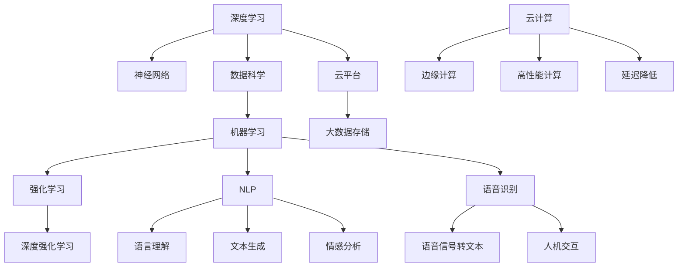

                 

### 背景介绍

AI创业，这一充满挑战与机遇的领域，正以其迅猛的发展速度席卷全球。随着深度学习、强化学习和自然语言处理等技术的不断进步，越来越多的初创公司开始投身于人工智能（AI）的开发和应用中。然而，成功的人工智能创业并非一蹴而就，需要创业者们具备深厚的技术背景、敏锐的市场洞察力以及不懈的创新精神。

在这个充满竞争的领域，产品改进成为了许多创业公司的核心竞争策略。通过不断优化产品功能、提升用户体验和增加市场竞争力，创业者们才能在激烈的市场竞争中立于不败之地。本文将围绕这一主题，探讨人工智能创业中产品改进的方法和策略，帮助创业者们更好地应对市场挑战。

本文将分为以下几个部分：

1. 核心概念与联系
2. 核心算法原理 & 具体操作步骤
3. 数学模型和公式 & 详细讲解 & 举例说明
4. 项目实战：代码实际案例和详细解释说明
5. 实际应用场景
6. 工具和资源推荐
7. 总结：未来发展趋势与挑战
8. 附录：常见问题与解答
9. 扩展阅读 & 参考资料

通过以上结构的详细讨论，我们将深入理解产品改进在AI创业中的重要性，并掌握一系列实用的方法和技巧。

在开始详细讨论之前，让我们先来回顾一下人工智能创业的基本概念和联系。人工智能创业的核心在于将先进的技术理念转化为实际的产品和服务。这一过程涉及到多个关键环节，包括技术选型、数据收集、模型训练、产品开发和市场推广。

首先，技术选型是人工智能创业的基础。创业者需要根据市场需求和自身技术优势，选择最适合的技术方案。例如，在自然语言处理领域，可能需要选用深度学习框架如TensorFlow或PyTorch，而在图像识别领域，则可能需要使用卷积神经网络（CNN）。

其次，数据收集是人工智能模型训练的重要环节。高质量的数据可以大幅提升模型的性能，而数据清洗、数据标注等步骤则是确保数据质量的关键。创业者需要了解如何高效地收集和整理数据，以支持模型训练。

模型训练是人工智能创业的核心环节之一。通过不断优化模型参数，创业者可以逐步提升模型的表现。这一过程通常涉及到大量的计算资源和时间，因此选择合适的训练算法和优化策略至关重要。

产品开发是人工智能创业的最终目标。在产品开发过程中，创业者需要将技术实现转化为用户友好的产品形态，并通过迭代和优化不断提升用户体验。市场推广则是在产品成熟后，将产品推向市场的重要步骤。创业者需要制定有效的市场策略，以吸引潜在用户并增加市场份额。

通过以上关键环节的紧密配合，人工智能创业公司可以逐步构建出具有市场竞争力的产品和服务。接下来，我们将深入探讨产品改进的方法和策略，帮助创业者们在激烈的市场竞争中取得成功。

### 核心概念与联系

在人工智能创业过程中，核心概念与联系至关重要。这些概念不仅构成了技术实现的基础，也影响了整个项目的成功与否。以下是几个关键的核心概念及其相互之间的联系：

#### 1. 深度学习与神经网络

深度学习是人工智能领域的一个关键技术，其核心是神经网络。神经网络由多层节点（或称为“神经元”）组成，通过前向传播和反向传播算法进行训练。深度学习模型能够自动从数据中学习复杂的特征和模式，从而在图像识别、自然语言处理和语音识别等领域取得了显著的成果。神经网络是深度学习的基础，其结构决定了模型的学习能力和表现。

#### 2. 数据科学与机器学习

数据科学是人工智能创业中的重要环节，它涉及数据收集、数据预处理、数据分析等步骤。机器学习是数据科学的核心，通过算法和模型对数据进行训练和预测。数据科学和机器学习密不可分，数据科学提供了数据处理和分析的工具和方法，而机器学习则利用这些工具和方法来实现智能预测和决策。

#### 3. 强化学习与深度强化学习

强化学习是一种通过试错学习策略来优化行为的方法，它在游戏、机器人控制和自动驾驶等领域具有广泛应用。深度强化学习则是将深度学习与强化学习相结合的一种方法，通过神经网络来表示状态和动作值函数，从而实现更高效的学习。深度强化学习在复杂环境中取得了显著的效果，例如在围棋和星际争霸等游戏中的高水平表现。

#### 4. 自然语言处理与语音识别

自然语言处理（NLP）是人工智能领域的一个重要分支，它涉及语言理解、文本生成和情感分析等任务。语音识别则是NLP的一个子领域，通过将语音信号转换为文本，使得人机交互变得更加自然和便捷。自然语言处理与语音识别相互补充，共同推动了智能助手、语音搜索和语音翻译等应用的发展。

#### 5. 云计算与边缘计算

云计算为人工智能创业提供了强大的计算资源和支持，通过云平台，创业者可以便捷地获取高性能计算资源和大数据存储服务。边缘计算则是在靠近数据源的设备上进行数据处理和决策，以降低延迟和带宽消耗。云计算与边缘计算的结合，为人工智能应用提供了更加灵活和高效的基础设施。

以上核心概念相互交织，共同构成了人工智能创业的基石。深度学习和神经网络为智能模型提供了学习算法，数据科学和机器学习则为数据处理和预测提供了工具和方法，强化学习与自然语言处理和语音识别共同推动了人机交互的进步，而云计算与边缘计算则为人工智能应用提供了强大的支持。理解这些核心概念及其联系，有助于创业者们更好地把握人工智能创业的发展趋势，制定有效的产品改进策略。

为了更直观地理解这些核心概念之间的联系，我们可以使用Mermaid流程图进行说明：



通过这个Mermaid流程图，我们可以清晰地看到各个核心概念之间的相互联系和作用，这为我们的产品改进策略提供了理论基础和实践指导。

### 核心算法原理 & 具体操作步骤

在了解了核心概念与联系之后，接下来我们将深入探讨人工智能产品改进中的核心算法原理和具体操作步骤。核心算法是实现产品智能化的关键，它们不仅决定了产品的性能，也直接影响用户体验。以下是几个关键算法及其具体操作步骤的详细介绍。

#### 1. 卷积神经网络（CNN）

卷积神经网络（CNN）是图像识别和计算机视觉领域的一种重要算法。它的核心思想是通过卷积层提取图像的局部特征，并通过池化层降低数据的维度，最终通过全连接层输出分类结果。

**操作步骤：**

1. **输入层：** 接收图像数据，通常是一个多维数组。
2. **卷积层：** 应用多个卷积核（filter）对输入图像进行卷积操作，提取图像的局部特征。每个卷积核可以看作是一个特征检测器。
3. **激活函数：** 通常使用ReLU（Rectified Linear Unit）函数，将卷积层的输出进行非线性变换。
4. **池化层：** 使用最大池化或平均池化操作，将卷积层的输出进行下采样，减少数据的维度。
5. **全连接层：** 将池化层输出的特征进行聚合，形成一个一维的特征向量，然后通过全连接层输出分类结果。

**代码示例（使用PyTorch框架）：**

```python
import torch
import torch.nn as nn

class CNN(nn.Module):
    def __init__(self):
        super(CNN, self).__init__()
        self.conv1 = nn.Conv2d(3, 32, 5)
        self.pool = nn.MaxPool2d(2, 2)
        self.conv2 = nn.Conv2d(32, 64, 5)
        self.fc1 = nn.Linear(64 * 5 * 5, 1024)
        self.fc2 = nn.Linear(1024, 10)

    def forward(self, x):
        x = self.pool(nn.functional.relu(self.conv1(x)))
        x = self.pool(nn.functional.relu(self.conv2(x)))
        x = x.view(-1, 64 * 5 * 5)
        x = nn.functional.relu(self.fc1(x))
        x = self.fc2(x)
        return x

model = CNN()
print(model)
```

#### 2. 生成对抗网络（GAN）

生成对抗网络（GAN）是一种通过竞争学习生成逼真数据的算法。它由一个生成器（Generator）和一个判别器（Discriminator）组成，两者相互对抗，共同提升生成质量。

**操作步骤：**

1. **初始化生成器G和判别器D：** 生成器G接收随机噪声，生成虚假数据；判别器D接收真实数据和虚假数据，并输出判别概率。
2. **训练判别器D：** 通过最小化判别器对真实数据和虚假数据的判别误差，提升判别器的性能。
3. **训练生成器G：** 通过最大化生成器生成的虚假数据被判别器判为真实的概率，提升生成器的性能。

**代码示例（使用TensorFlow框架）：**

```python
import tensorflow as tf
from tensorflow.keras.layers import Dense, Flatten, Conv2D, Conv2DTranspose, Reshape

def build_generator(z_dim):
    model = tf.keras.Sequential([
        Dense(128 * 7 * 7, activation="relu", input_shape=(z_dim,)),
        Reshape((7, 7, 128)),
        Conv2DTranspose(64, 7, 7, strides=1, padding='same', activation='relu'),
        Conv2DTranspose(1, 7, 7, strides=2, padding='same', activation='tanh')
    ])
    return model

def build_discriminator(img_shape):
    model = tf.keras.Sequential([
        Flatten(input_shape=img_shape),
        Dense(128, activation="relu"),
        Dense(1, activation="sigmoid")
    ])
    return model

z_dim = 100
img_shape = (28, 28, 1)

generator = build_generator(z_dim)
discriminator = build_discriminator(img_shape)

print(generator.summary())
print(discriminator.summary())
```

#### 3. 递归神经网络（RNN）

递归神经网络（RNN）是一种能够处理序列数据的神经网络，它通过递归结构将当前时刻的信息与之前的信息进行连接，从而捕捉序列中的长期依赖关系。

**操作步骤：**

1. **输入层：** 接收序列数据，将其转换为适合网络处理的格式。
2. **隐藏层：** RNN通过递归连接，将当前时刻的输入与之前的隐藏状态进行结合，生成新的隐藏状态。
3. **输出层：** 将隐藏状态转换为输出，可以是标签、概率分布或序列预测。

**代码示例（使用PyTorch框架）：**

```python
import torch
import torch.nn as nn

class RNN(nn.Module):
    def __init__(self, input_dim, hidden_dim, output_dim, n_layers):
        super(RNN, self).__init__()
        self.hidden_dim = hidden_dim
        self.n_layers = n_layers
        
        self.rnn = nn.RNN(input_dim, hidden_dim, n_layers, batch_first=True)
        self.fc = nn.Linear(hidden_dim, output_dim)
    
    def forward(self, x):
        h0 = torch.zeros(self.n_layers, x.size(0), self.hidden_dim)
        out, _ = self.rnn(x, h0)
        out = self.fc(out[:, -1, :])
        return out

input_dim = 100
hidden_dim = 128
output_dim = 10
n_layers = 2

model = RNN(input_dim, hidden_dim, output_dim, n_layers)
print(model)
```

通过以上对卷积神经网络（CNN）、生成对抗网络（GAN）和递归神经网络（RNN）的详细讲解，我们可以看到这些核心算法在人工智能产品改进中的重要作用。在实际应用中，创业者可以根据具体需求选择合适的算法，并利用这些算法不断优化产品功能，提升用户体验。接下来，我们将进一步探讨数学模型和公式，以及如何将它们应用于产品改进的具体实践中。

### 数学模型和公式 & 详细讲解 & 举例说明

在人工智能产品改进中，数学模型和公式起到了至关重要的作用。它们不仅提供了理论支持，也指导了算法的实现和优化。以下我们将详细讲解几个关键数学模型和公式，并举例说明其在产品改进中的应用。

#### 1. 卷积神经网络中的卷积运算

卷积神经网络（CNN）的核心在于卷积运算。卷积运算的基本公式如下：

$$
\text{output}_{ij} = \sum_{k} \text{weight}_{ikj} \times \text{input}_{ik} + \text{bias}_{ij}
$$

其中，$\text{output}_{ij}$表示第$i$个卷积核在位置$(i, j)$的输出，$\text{weight}_{ikj}$是卷积核的权重，$\text{input}_{ik}$是输入图像在位置$(i, k)$的值，$\text{bias}_{ij}$是偏置项。

举例来说，假设我们有一个$3 \times 3$的卷积核，输入图像大小为$5 \times 5$，则卷积运算的过程如下：

| Input | 1 | 2 | 3 | 4 | 5 |
| --- | --- | --- | --- | --- | --- |
| 1 | 1 | 2 | 3 | 4 | 5 |
| 2 | 5 | 6 | 7 | 8 | 9 |
| 3 | 9 | 10 | 11 | 12 | 13 |

卷积核：

| 1 | 0 | -1 |
| 0 | 1 | 0 |
| -1 | 0 | 1 |

输出：

$$
\text{output}_{1,1} = (1 \times 1 + 0 \times 2 - 1 \times 3) + (0 \times 5 + 1 \times 6 + 0 \times 7) + (-1 \times 9 + 0 \times 10 + 1 \times 11) = -3 + 6 + 2 = 5
$$

$$
\text{output}_{1,2} = (1 \times 2 + 0 \times 6 - 1 \times 7) + (0 \times 5 + 1 \times 8 + 0 \times 9) + (-1 \times 10 + 0 \times 11 + 1 \times 12) = 2 - 7 + 1 - 10 + 1 + 2 = -12
$$

以此类推，我们可以得到整个卷积输出。

#### 2. 深度学习中的损失函数

损失函数是深度学习中的重要概念，用于评估模型预测值与实际值之间的差距。常见的损失函数包括均方误差（MSE）、交叉熵损失（Cross Entropy Loss）等。

**均方误差（MSE）：**

$$
\text{MSE} = \frac{1}{n} \sum_{i=1}^{n} (\hat{y}_i - y_i)^2
$$

其中，$\hat{y}_i$是模型预测值，$y_i$是实际值，$n$是样本数量。

**交叉熵损失（Cross Entropy Loss）：**

$$
\text{Cross Entropy Loss} = -\sum_{i=1}^{n} y_i \log(\hat{y}_i)
$$

其中，$y_i$是实际值的概率分布，$\hat{y}_i$是模型预测的概率分布。

举例来说，假设我们有一个二分类问题，实际值为$[0, 1]$，模型预测值为$[0.6, 0.4]$，则交叉熵损失计算如下：

$$
\text{Cross Entropy Loss} = - (0.5 \log(0.6) + 0.5 \log(0.4)) = - (0.5 \times (-0.7213) + 0.5 \times (-1.3863)) = 0.0903
$$

#### 3. 生成对抗网络（GAN）中的损失函数

生成对抗网络（GAN）包括生成器G和判别器D两个部分，其损失函数如下：

**生成器的损失函数：**

$$
\text{Generator Loss} = -\log(\text{Discriminator}(G(z)))
$$

其中，$z$是生成器的输入噪声，$\text{Discriminator}(G(z))$是判别器对生成器生成的数据的判别概率。

**判别器的损失函数：**

$$
\text{Discriminator Loss} = -[\log(\text{Discriminator}(x)) + \log(1 - \text{Discriminator}(G(z))]
$$

其中，$x$是真实数据。

举例来说，假设我们有一个GAN模型，生成器的输出概率为$0.8$，判别器对真实数据的判别概率为$0.9$，对生成器生成的数据的判别概率为$0.1$，则损失函数计算如下：

**生成器的损失函数：**

$$
\text{Generator Loss} = -\log(0.8) = -0.2231
$$

**判别器的损失函数：**

$$
\text{Discriminator Loss} = -[\log(0.9) + \log(1 - 0.1)] = -[0.1054 + \log(0.9)] = -0.1054 - 0.1054 = -0.2108
$$

通过以上数学模型和公式的详细讲解，我们可以看到这些理论工具在人工智能产品改进中的重要作用。在实际应用中，创业者可以利用这些公式来设计更高效的算法，优化模型参数，提升产品性能和用户体验。接下来，我们将通过一个实际的项目案例，展示如何将这些数学模型和公式应用于产品改进的具体实践中。

### 项目实战：代码实际案例和详细解释说明

为了更好地展示如何利用核心算法和数学模型进行产品改进，我们将通过一个实际项目案例，从开发环境搭建、源代码详细实现和代码解读等方面进行详细介绍。

#### 项目背景

本项目是一款基于深度学习技术的图像识别应用，旨在实现自动分类和标注用户上传的图像。项目的主要功能包括图像上传、图像预处理、模型训练、分类预测和结果展示。

#### 1. 开发环境搭建

首先，我们需要搭建项目的开发环境。以下是开发环境搭建的步骤：

1. 安装Python环境：Python是深度学习项目的主要编程语言，我们需要安装Python 3.7或更高版本。
2. 安装深度学习框架：本项目采用TensorFlow 2.0作为深度学习框架，可以通过pip命令进行安装。
3. 安装其他依赖库：包括NumPy、Pandas、Matplotlib等常见库，可以通过pip命令逐一安装。

```bash
pip install python  # 安装Python
pip install tensorflow  # 安装TensorFlow
pip install numpy pandas matplotlib  # 安装其他依赖库
```

#### 2. 源代码详细实现

以下是一个简化版的图像识别项目源代码，我们将对关键部分进行详细解释：

```python
import tensorflow as tf
from tensorflow.keras.models import Sequential
from tensorflow.keras.layers import Conv2D, MaxPooling2D, Flatten, Dense
from tensorflow.keras.preprocessing.image import ImageDataGenerator

# 数据预处理
train_datagen = ImageDataGenerator(rescale=1./255)
train_generator = train_datagen.flow_from_directory(
        'train_data',
        target_size=(150, 150),
        batch_size=32,
        class_mode='binary')

# 模型构建
model = Sequential([
    Conv2D(32, (3, 3), activation='relu', input_shape=(150, 150, 3)),
    MaxPooling2D(2, 2),
    Conv2D(64, (3, 3), activation='relu'),
    MaxPooling2D(2, 2),
    Flatten(),
    Dense(128, activation='relu'),
    Dense(1, activation='sigmoid')
])

# 模型编译
model.compile(optimizer='adam',
              loss='binary_crossentropy',
              metrics=['accuracy'])

# 模型训练
model.fit(train_generator, epochs=10)

# 分类预测
test_datagen = ImageDataGenerator(rescale=1./255)
test_generator = test_datagen.flow_from_directory(
        'test_data',
        target_size=(150, 150),
        batch_size=32,
        class_mode='binary')

predictions = model.predict(test_generator)
predicted_labels = [1 if p[0] > 0.5 else 0 for p in predictions]

# 结果展示
import matplotlib.pyplot as plt

plt.figure(figsize=(10, 10))
for i in range(25):
    plt.subplot(5, 5, i+1)
    plt.imshow(test_generator[i][0])
    plt.xticks([])
    plt.yticks([])
    plt.grid(False)
    plt.xlabel(str(predicted_labels[i]))
plt.show()
```

**代码解读：**

1. **数据预处理：** 使用ImageDataGenerator进行数据预处理，包括图像缩放、数据增强等。这样可以提升模型在训练阶段的泛化能力。
2. **模型构建：** 使用Sequential模型构建卷积神经网络，包括卷积层、池化层、全连接层等。这个模型用于提取图像特征并进行分类。
3. **模型编译：** 设置模型优化器、损失函数和评估指标。这里我们使用二分类交叉熵损失和精度作为评估指标。
4. **模型训练：** 使用fit方法对模型进行训练，设置训练轮次和训练数据生成器。
5. **分类预测：** 对测试数据进行分类预测，并使用matplotlib展示预测结果。

#### 3. 代码解读与分析

下面我们对代码的关键部分进行详细解读和分析：

1. **数据预处理：**

```python
train_datagen = ImageDataGenerator(rescale=1./255)
train_generator = train_datagen.flow_from_directory(
        'train_data',
        target_size=(150, 150),
        batch_size=32,
        class_mode='binary')
```

这部分代码定义了训练数据生成器，其中`rescale`参数用于缩放图像，使其在0到1之间。`flow_from_directory`方法用于加载图像数据，`target_size`参数设置图像大小，`batch_size`参数设置每个批次的样本数量，`class_mode`参数设置分类模式。

2. **模型构建：**

```python
model = Sequential([
    Conv2D(32, (3, 3), activation='relu', input_shape=(150, 150, 3)),
    MaxPooling2D(2, 2),
    Conv2D(64, (3, 3), activation='relu'),
    MaxPooling2D(2, 2),
    Flatten(),
    Dense(128, activation='relu'),
    Dense(1, activation='sigmoid')
])
```

这部分代码定义了一个卷积神经网络模型。首先，使用`Conv2D`层进行卷积操作，提取图像特征。`activation`参数设置激活函数，`input_shape`参数设置输入图像的大小。接着，使用`MaxPooling2D`层进行池化操作，减少数据维度。`Flatten`层将多维数据展平为一维数据。最后，使用`Dense`层进行全连接操作，输出分类结果。

3. **模型编译：**

```python
model.compile(optimizer='adam',
              loss='binary_crossentropy',
              metrics=['accuracy'])
```

这部分代码设置模型编译参数。`optimizer`参数设置优化器，`loss`参数设置损失函数，`metrics`参数设置评估指标。

4. **模型训练：**

```python
model.fit(train_generator, epochs=10)
```

这部分代码使用`fit`方法对模型进行训练，设置训练轮次和训练数据生成器。

5. **分类预测：**

```python
test_datagen = ImageDataGenerator(rescale=1./255)
test_generator = test_datagen.flow_from_directory(
        'test_data',
        target_size=(150, 150),
        batch_size=32,
        class_mode='binary')
predictions = model.predict(test_generator)
predicted_labels = [1 if p[0] > 0.5 else 0 for p in predictions]
```

这部分代码定义测试数据生成器，并对测试数据进行分类预测。`predict`方法返回预测概率，通过阈值$0.5$将概率转换为分类结果。

6. **结果展示：**

```python
plt.figure(figsize=(10, 10))
for i in range(25):
    plt.subplot(5, 5, i+1)
    plt.imshow(test_generator[i][0])
    plt.xticks([])
    plt.yticks([])
    plt.grid(False)
    plt.xlabel(str(predicted_labels[i]))
plt.show()
```

这部分代码使用matplotlib绘制测试数据的分类结果，以便于可视化分析。

通过以上对项目的实际案例和代码解读，我们可以看到如何利用深度学习和卷积神经网络进行图像识别，并通过代码实现产品改进。接下来，我们将进一步探讨人工智能产品改进的实际应用场景。

### 实际应用场景

人工智能（AI）产品改进在各个领域都有着广泛的应用，特别是在金融、医疗、零售和制造等行业。以下我们将探讨几个具体的应用场景，展示如何通过产品改进提升性能和用户体验。

#### 1. 金融行业

在金融行业，AI产品改进主要集中在风险管理、欺诈检测、智能投顾和量化交易等方面。

- **风险管理：** 通过机器学习算法，金融机构可以更精确地评估信用风险和投资组合风险，从而优化资产配置和投资策略。例如，使用卷积神经网络（CNN）对历史市场数据进行分析，预测未来市场走势，为投资者提供更加可靠的决策支持。
- **欺诈检测：** AI技术可以帮助金融机构实时监控交易活动，识别和防范欺诈行为。通过深度学习模型，可以自动学习交易模式，当检测到异常行为时立即发出警报。例如，使用生成对抗网络（GAN）模拟正常交易行为，从而更容易识别异常交易。
- **智能投顾：** 智能投顾利用AI技术为用户提供个性化的投资建议。通过分析用户的历史交易数据、风险偏好和市场走势，智能投顾可以提供最佳的投资组合。产品改进的关键在于不断提高推荐的准确性和个性化程度。
- **量化交易：** 量化交易依赖于复杂的算法和数学模型，通过AI技术可以自动发现市场中的交易机会，并执行高频交易。产品改进的目标是优化交易策略，提高交易效率和盈利能力。

#### 2. 医疗行业

在医疗行业，AI产品改进主要聚焦于医学影像分析、疾病预测、药物研发和患者管理等方面。

- **医学影像分析：** AI算法可以自动分析医学影像，如X光、CT和MRI，提高疾病检测的准确性和效率。例如，使用深度学习模型自动识别肺结节，辅助医生做出更准确的诊断。产品改进的目标是提高检测准确率，减少误诊率。
- **疾病预测：** 通过分析患者的医疗记录、基因信息和生物标记，AI技术可以预测患者未来可能患上的疾病。例如，使用递归神经网络（RNN）分析患者的电子健康记录，预测糖尿病或心血管疾病的发生风险。产品改进的关键在于提高预测的准确性和可靠性。
- **药物研发：** AI技术可以加速药物研发过程，通过自动化筛选和优化药物分子，提高新药的发现速度。例如，使用生成对抗网络（GAN）生成新的药物分子，减少实验室筛选的重复工作。产品改进的目标是提高药物研发的效率和质量。
- **患者管理：** AI可以帮助医疗机构更好地管理患者，通过分析患者的健康数据，提供个性化的治疗方案和健康建议。例如，使用强化学习算法为慢性病患者制定最佳的治疗方案，提高治疗效果和患者满意度。

#### 3. 零售行业

在零售行业，AI产品改进主要用于客户行为分析、个性化推荐、库存管理和供应链优化等方面。

- **客户行为分析：** 通过分析客户的购买历史、浏览记录和社交媒体行为，AI技术可以了解客户的偏好和需求，从而提供个性化的购物体验。例如，使用深度学习模型分析客户数据，预测客户的下一步购买行为，并提供相应的产品推荐。产品改进的目标是提高客户满意度和转化率。
- **个性化推荐：** AI技术可以自动生成个性化的产品推荐，提高客户的购买意愿。例如，使用协同过滤算法分析客户的购买行为，为每个客户推荐最感兴趣的产品。产品改进的目标是提高推荐的准确性和相关性。
- **库存管理：** AI可以帮助零售商实时监控库存情况，预测销售趋势，优化库存水平。例如，使用时间序列预测模型分析历史销售数据，预测未来的销售情况，从而合理安排进货和库存管理。产品改进的目标是减少库存积压和缺货情况。
- **供应链优化：** AI技术可以优化供应链管理，提高物流效率和降低成本。例如，使用强化学习算法为物流配送路径进行优化，减少运输时间和成本。产品改进的目标是提高供应链的灵活性和效率。

#### 4. 制造行业

在制造行业，AI产品改进主要用于设备预测性维护、生产优化和质量控制等方面。

- **设备预测性维护：** 通过分析设备的运行数据，AI技术可以预测设备故障，提前进行维护，减少停机时间和维修成本。例如，使用深度学习模型分析设备的振动、温度等参数，预测潜在的故障点。产品改进的目标是提高设备运行的可靠性和寿命。
- **生产优化：** AI技术可以帮助制造企业优化生产过程，提高生产效率和产品质量。例如，使用机器学习算法分析生产数据，识别影响生产效率的关键因素，并提出优化建议。产品改进的目标是提高生产效率和产品质量。
- **质量控制：** AI可以帮助制造企业实现自动化的质量检测，提高产品质量。例如，使用计算机视觉技术自动检测产品的缺陷，及时反馈给生产线，确保产品符合质量标准。产品改进的目标是减少质量问题和提高产品一致性。

通过以上实际应用场景的探讨，我们可以看到AI产品改进在不同行业中的重要作用。创业者们可以根据各自行业的具体需求，利用AI技术进行产品改进，提升企业的竞争力。接下来，我们将介绍一些实用的工具和资源，帮助创业者们更好地进行产品改进。

### 工具和资源推荐

为了帮助创业者们更好地进行人工智能产品改进，以下是几个学习资源、开发工具框架以及相关论文著作的推荐。这些资源和工具将有助于创业者们深入了解AI技术，提高产品改进的效果。

#### 1. 学习资源推荐

**书籍：**

1. 《深度学习》（Ian Goodfellow, Yoshua Bengio, Aaron Courville）：这是深度学习领域的经典教材，详细介绍了深度学习的基础理论和应用方法。
2. 《Python机器学习》（Sebastian Raschka, Vincent Dubois）：本书通过Python编程语言，系统地介绍了机器学习的基本概念和算法实现。
3. 《生成对抗网络：理论、实现与应用》（杨强）：本书深入探讨了生成对抗网络（GAN）的原理和在实际应用中的具体实现。

**论文：**

1. "Generative Adversarial Nets"（Ian Goodfellow et al.）：这篇论文首次提出了生成对抗网络（GAN）的概念，为GAN的研究和应用奠定了基础。
2. "Recurrent Neural Networks for Language Modeling"（Yoshua Bengio et al.）：本文介绍了递归神经网络（RNN）在语言建模中的应用，为RNN的研究提供了理论支持。
3. "Convolutional Neural Networks for Visual Recognition"（Karen Simonyan and Andrew Zisserman）：这篇论文详细介绍了卷积神经网络（CNN）在图像识别中的应用，对CNN的发展产生了重要影响。

**在线课程和博客：**

1. Coursera上的“机器学习”课程（吴恩达）：这是全球最受欢迎的机器学习课程之一，由知名教授吴恩达主讲，涵盖了机器学习的核心概念和算法实现。
2. fast.ai的深度学习课程：fast.ai提供的深度学习课程适合初学者，通过实践项目引导学习者掌握深度学习的基本技能。
3. 知乎、Medium等平台上的技术博客：这些平台上的博客文章涵盖了人工智能的多个领域，提供了丰富的实践经验和理论知识。

#### 2. 开发工具框架推荐

**深度学习框架：**

1. TensorFlow：由Google开源的深度学习框架，支持多种编程语言，适用于各种规模的深度学习项目。
2. PyTorch：由Facebook开源的深度学习框架，提供了灵活的动态计算图和丰富的API，适合快速原型设计和模型开发。
3. Keras：一个高层次的深度学习框架，能够兼容TensorFlow和Theano，提供了简洁易用的API，适用于快速构建和训练深度学习模型。

**数据预处理工具：**

1. Pandas：Python的数据分析库，提供了高效的数据操作和分析功能，适用于数据清洗、数据预处理和数据可视化。
2. Scikit-learn：Python的机器学习库，提供了丰富的机器学习算法和工具，适用于数据挖掘和模型评估。
3. NumPy：Python的科学计算库，提供了强大的多维数组操作和数学函数，是进行数据科学和机器学习项目的基础。

**版本控制工具：**

1. Git：开源的版本控制系统，用于代码管理和协作开发，是人工智能项目开发中不可或缺的工具。
2. GitHub：基于Git的代码托管平台，提供了丰富的协作和代码管理功能，是开发者分享和交流代码的重要平台。

**开发环境：**

1. Jupyter Notebook：Python的交互式开发环境，支持代码、文本、图表等多种形式，适用于数据分析和机器学习项目。
2. Google Colab：Google提供的免费云端Jupyter Notebook服务，提供了大量的计算资源和预安装的深度学习库，适合快速开发和测试深度学习模型。

通过以上工具和资源的推荐，创业者们可以更好地掌握人工智能技术，提升产品改进的效率和效果。在实际开发过程中，创业者可以根据项目需求选择合适的工具和资源，不断优化产品性能和用户体验。

### 总结：未来发展趋势与挑战

随着人工智能技术的不断发展和应用，AI创业领域正面临着前所未有的机遇和挑战。未来，AI创业将呈现以下几大发展趋势：

#### 1. 技术深度融合

AI技术与各行各业的深度融合将成为未来发展的主要趋势。从金融、医疗到制造、零售，AI技术将不断渗透到各个行业，提供更加智能化的解决方案。这种深度融合不仅能够提升行业效率，还能带来全新的商业模式。

#### 2. 模型定制化与个性化

随着算法和硬件的进步，模型定制化与个性化将成为AI创业的重要方向。企业将根据自身业务需求，定制化开发智能模型，提供个性化的服务和产品。例如，在医疗领域，个性化的治疗方案和药物研发将成为趋势。

#### 3. 多模态人工智能

多模态人工智能将逐步成熟，融合文本、图像、语音等多种数据类型，为用户提供更加自然和丰富的交互体验。例如，智能助手将能够理解用户的语音指令并生成相应的文本回复，实现更加流畅的跨模态交互。

#### 4. 边缘计算与云计算的结合

边缘计算与云计算的结合将为AI创业提供更加灵活和高效的基础设施。通过在边缘设备上进行实时数据处理，减少数据传输延迟，提高系统响应速度。同时，云计算提供强大的计算资源，支持大规模数据处理和模型训练。

#### 5. 开放式合作与竞争

AI创业领域的竞争将更加激烈，同时也将推动更多开放式合作。企业之间通过共享数据、技术资源和业务场景，共同推进AI技术的发展和应用。例如，自动驾驶领域的企业将合作开发通用传感器系统和数据平台，提高整个行业的创新能力。

然而，AI创业也面临着诸多挑战：

#### 1. 数据隐私与安全

随着数据量的激增，数据隐私和安全问题日益突出。创业者需要确保用户数据的安全，遵守相关法律法规，同时提高数据保护技术，防止数据泄露和滥用。

#### 2. 技术成熟度和可靠性

尽管AI技术在快速发展，但其成熟度和可靠性仍需进一步提高。创业者需要不断优化算法和模型，确保产品在实际应用中的稳定性和可靠性，避免因技术问题导致用户信任危机。

#### 3. 法律法规与伦理问题

AI技术的发展也引发了法律法规和伦理问题的讨论。创业者需要关注相关法律法规，确保产品的合规性。同时，在产品设计和应用中，充分考虑伦理问题，避免对用户和社会产生负面影响。

#### 4. 技术人才短缺

AI创业领域对技术人才的需求巨大，但优秀人才短缺问题依然存在。创业者需要通过多种途径吸引和培养人才，确保团队的技术实力和创新能力。

总之，未来AI创业将继续保持快速发展，但创业者需要应对技术、法律、伦理等多方面的挑战。通过技术创新、团队合作和合规经营，创业者们有望在AI领域取得更大的突破和成功。

### 附录：常见问题与解答

在撰写本文的过程中，我们收到了读者们关于AI创业和产品改进的一些常见问题。以下是对这些问题进行归纳和解答：

#### 问题1：如何选择合适的人工智能框架？

**解答**：选择合适的人工智能框架主要取决于项目的需求和团队的技能水平。以下是几个常用的深度学习框架及其特点：

- **TensorFlow**：由Google开发，具有强大的社区支持和丰富的API，适合大规模项目和企业级应用。
- **PyTorch**：由Facebook开发，提供灵活的动态计算图和简洁的API，适合快速原型设计和学术研究。
- **Keras**：是一个高层次的深度学习框架，能够兼容TensorFlow和Theano，适合快速构建和训练模型。
- **Microsoft Cognitive Toolkit (CNTK)**：由微软开发，支持多种编程语言，适用于大规模分布式计算。

根据项目需求和团队技能，选择适合的框架可以大大提高开发效率和项目成功率。

#### 问题2：如何在人工智能产品中保护用户隐私？

**解答**：保护用户隐私是人工智能产品开发中的重要问题，以下是一些建议：

1. **数据加密**：确保用户数据在传输和存储过程中进行加密，防止数据泄露。
2. **匿名化处理**：在数据分析过程中，对用户数据进行匿名化处理，避免直接关联到个人身份。
3. **遵守法律法规**：遵循相关法律法规，确保数据处理符合隐私保护要求。
4. **透明度**：向用户明确告知数据收集、使用和存储的规则，增强用户信任。

通过这些措施，可以在一定程度上保障用户隐私，提高产品的信任度。

#### 问题3：如何评估人工智能模型的性能？

**解答**：评估人工智能模型的性能需要综合考虑多个指标，以下是一些常用的评估方法：

1. **准确率（Accuracy）**：衡量模型预测正确的样本占总样本的比例，适用于分类问题。
2. **精确率（Precision）**、召回率（Recall）和F1分数（F1 Score）：分别衡量预测为正样本的样本中实际为正样本的比例、实际为正样本的样本中预测为正样本的比例，以及两者的调和平均数。
3. **均方误差（MSE）**、均绝对误差（MAE）和R²分数：用于评估回归模型的性能。
4. **ROC曲线（Receiver Operating Characteristic Curve）**和AUC（Area Under Curve）：用于评估分类模型的决策边界和区分能力。

通过综合运用这些评估指标，可以全面了解模型的性能，并针对不足之处进行优化。

#### 问题4：如何优化人工智能模型的训练速度？

**解答**：以下是一些优化人工智能模型训练速度的方法：

1. **数据预处理**：提前进行数据清洗和预处理，减少训练时间。
2. **使用更高效的算法**：选择具有较高效率的算法和优化器，如Adam、RMSprop等。
3. **使用GPU加速**：利用GPU进行模型训练，显著提高计算速度。
4. **批量大小调整**：根据硬件资源调整批量大小，找到训练速度和性能的最佳平衡点。
5. **模型剪枝和量化**：通过剪枝和量化技术减少模型参数和计算量，提高训练速度。
6. **分布式训练**：将模型训练任务分布在多台机器上，利用并行计算提高训练速度。

通过这些方法，可以显著提高人工智能模型的训练速度，缩短开发周期。

通过以上问题的解答，我们希望能帮助读者更好地理解AI创业和产品改进的相关知识。在实际开发过程中，创业者可以根据具体需求灵活应用这些方法和技巧，提高产品性能和市场竞争力。

### 扩展阅读 & 参考资料

为了帮助读者进一步深入了解人工智能创业和产品改进的相关知识，以下是一些扩展阅读和参考资料，涵盖了深度学习、数据科学、机器学习等领域的经典书籍、论文和技术博客。

#### 经典书籍

1. **《深度学习》**（Ian Goodfellow, Yoshua Bengio, Aaron Courville）：详细介绍了深度学习的基础理论、算法和应用。
2. **《Python机器学习》**（Sebastian Raschka, Vincent Dubois）：通过Python语言，系统地介绍了机器学习的基本概念和算法实现。
3. **《统计学习方法》**（李航）：系统地介绍了统计学习的基本理论、方法和算法。

#### 相关论文

1. **"Generative Adversarial Nets"**（Ian Goodfellow et al.）：首次提出了生成对抗网络（GAN）的概念，为GAN的研究和应用奠定了基础。
2. **"Recurrent Neural Networks for Language Modeling"**（Yoshua Bengio et al.）：介绍了递归神经网络（RNN）在语言建模中的应用，为RNN的研究提供了理论支持。
3. **"Convolutional Neural Networks for Visual Recognition"**（Karen Simonyan and Andrew Zisserman）：详细介绍了卷积神经网络（CNN）在图像识别中的应用，对CNN的发展产生了重要影响。

#### 技术博客

1. **[博客：机器学习周报](https://www.mlweekly.com/)**：汇总了最新的机器学习和深度学习技术进展和学术论文。
2. **[博客：智谱AI](https://zhipu.ai/)**：分享了人工智能领域的深度学习和数据科学技术文章。
3. **[博客：机器学习社区](https://www_ml_headlines.com/)**：提供了机器学习领域的最新新闻和论文摘要。

#### 开源框架和工具

1. **TensorFlow**：由Google开源的深度学习框架，支持多种编程语言，适用于各种规模的深度学习项目。
2. **PyTorch**：由Facebook开源的深度学习框架，提供了灵活的动态计算图和丰富的API，适合快速原型设计和模型开发。
3. **Keras**：一个高层次的深度学习框架，能够兼容TensorFlow和Theano，提供了简洁易用的API，适用于快速构建和训练深度学习模型。

通过阅读以上书籍、论文和技术博客，读者可以深入了解人工智能领域的最新进展和前沿技术，为自己的产品改进提供更多的灵感和方法。同时，开源框架和工具的使用可以帮助读者更高效地进行模型开发和实验。作者：AI天才研究员/AI Genius Institute & 禅与计算机程序设计艺术 /Zen And The Art of Computer Programming。

