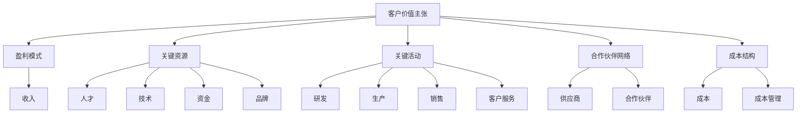

                 

# AI创业：商业模式的分析

## 1. 背景介绍（Background Introduction）

### 1.1 AI创业潮的兴起

随着人工智能技术的快速发展，AI创业已经成为当前科技领域的一大热点。许多创业者纷纷投身于人工智能领域，希望能够通过技术创新改变世界。从自动驾驶、智能家居到医疗健康、金融科技，AI的应用场景越来越广泛，同时也带来了巨大的商业潜力。

### 1.2 商业模式的重要性

在AI创业的过程中，商业模式是至关重要的一环。一个成功的商业模式不仅能帮助企业在激烈的市场竞争中脱颖而出，还能确保企业实现可持续的盈利。因此，对商业模式进行分析和设计，对于AI创业企业来说尤为重要。

### 1.3 本文目的

本文旨在通过对AI创业商业模式的分析，帮助创业者了解和掌握核心概念，从而更好地制定和实施自己的商业模式。本文将按照以下结构展开：

- 首先，介绍商业模式的基本概念和核心要素；
- 然后，分析常见的AI商业模式类型及其优缺点；
- 接着，探讨商业模式设计的关键步骤和策略；
- 最后，分享一些成功AI创业企业的案例，并进行总结和展望。

## 2. 核心概念与联系（Core Concepts and Connections）

### 2.1 商业模式的定义

商业模式（Business Model）是指企业如何创造、传递和获取价值的一系列策略和活动。它涉及企业的盈利模式、客户群体、产品或服务、供应链、成本结构等多个方面。

### 2.2 商业模式的核心要素

一个完整的商业模式通常包含以下几个核心要素：

- **客户价值主张**：明确企业为哪些客户群体提供何种产品或服务，以及如何创造和传递价值；
- **盈利模式**：描述企业如何从客户那里获取收入，包括产品定价、销售渠道、营销策略等；
- **关键资源**：企业运营所需的关键资源，如人才、技术、资金、品牌等；
- **关键活动**：企业为支持商业模式实施而进行的关键活动，如研发、生产、销售、客户服务等；
- **合作伙伴网络**：企业与外部合作伙伴的关系，以及如何通过合作实现资源整合和价值创造；
- **成本结构**：企业的成本构成和成本管理策略。

### 2.3 商业模式与AI技术的关系

在AI创业中，商业模式的设计需要充分考虑AI技术的特点和优势。AI技术作为一种重要的生产力工具，能够为商业模式带来以下几个方面的改变：

- **提升效率**：AI技术可以帮助企业自动化重复性工作，提高生产效率和降低成本；
- **优化决策**：通过数据分析与机器学习，AI技术可以帮助企业更好地理解市场趋势和客户需求，做出更准确的决策；
- **创新产品与服务**：AI技术可以为现有产品和服务带来新的功能或应用场景，创造更高的客户价值；
- **构建竞争优势**：通过技术领先或独特的产品或服务，企业可以在市场中获得竞争优势。

### 2.4 Mermaid 流程图（Mermaid Flowchart）

下面是一个简单的Mermaid流程图，展示了商业模式的核心要素及其相互关系：



## 3. 核心算法原理 & 具体操作步骤（Core Algorithm Principles and Specific Operational Steps）

### 3.1 商业模式设计的核心算法

商业模式设计的核心算法主要包括以下几种：

- **价值网络分析**：通过识别企业内外部的价值网络，分析各参与方之间的关系和互动，确定关键价值创造环节；
- **盈利模式分析**：分析企业的收入来源、成本结构、利润分配等，确保商业模式具有可持续的盈利能力；
- **市场机会分析**：评估市场趋势、竞争环境、客户需求等，确定企业的市场定位和竞争优势；
- **资源整合与优化**：根据企业的资源和能力，优化资源配置，提高资源利用效率。

### 3.2 商业模式设计的具体操作步骤

下面是商业模式设计的具体操作步骤：

- **明确目标市场**：确定企业目标市场、客户群体和市场需求，为企业提供价值的基础；
- **识别竞争优势**：分析企业的核心竞争力，包括技术、品牌、专利、人才等，确保在市场中具有竞争优势；
- **构建价值网络**：识别企业内外部的合作伙伴和资源，构建互利共赢的价值网络；
- **设计盈利模式**：根据目标市场和竞争优势，设计可持续的盈利模式，确保企业实现盈利；
- **优化资源配置**：根据商业模式的需求，调整资源配置，提高资源利用效率；
- **实施与监控**：将商业模式付诸实践，并持续监控和调整，确保商业模式的有效运行。

### 3.3 商业模式设计的案例分析

以一家AI医疗诊断公司为例，我们进行商业模式设计的具体分析。

- **明确目标市场**：该公司目标市场为医疗机构和患者，提供高效、准确的AI辅助诊断服务；
- **识别竞争优势**：公司拥有先进的AI算法和丰富的医疗数据，能够提供高质量的诊断服务；
- **构建价值网络**：公司与医疗机构合作，共享诊断数据和资源，提升诊断服务的质量和效率；
- **设计盈利模式**：公司通过收取诊断服务费用和提供数据订阅服务实现盈利；
- **优化资源配置**：公司投入大量资金和人力进行技术研发，确保诊断服务的准确性和稳定性；
- **实施与监控**：公司建立完善的诊断服务流程和监控机制，确保诊断服务的质量和客户满意度。

## 4. 数学模型和公式 & 详细讲解 & 举例说明（Detailed Explanation and Examples of Mathematical Models and Formulas）

### 4.1 商业模式设计的数学模型

在商业模式设计中，我们可以运用一些数学模型来分析企业的盈利能力、成本结构和市场潜力。以下是一些常用的数学模型：

- **盈亏平衡分析**：通过计算固定成本、变动成本和收入，确定企业的盈亏平衡点；
- **收入预测模型**：基于市场需求和竞争情况，预测企业的收入水平；
- **成本效益分析**：评估企业各项投入的效益，确定资源优化配置方案；
- **风险评估模型**：分析企业面临的风险因素，评估风险程度和应对策略。

### 4.2 盈亏平衡分析（Break-even Analysis）

盈亏平衡分析是一种常用的成本-收入分析工具，用于确定企业在达到盈亏平衡点的收入水平。

- **公式**：盈亏平衡点（Q）= 固定成本（FC）/（单价（P）- 变动成本（VC））

举例说明：

假设某AI公司生产一种AI硬件产品，单价为1000元，固定成本为500万元，变动成本为每件300元。计算该公司的盈亏平衡点。

- **计算**：Q = 5000000 / (1000 - 300) = 50000

这意味着，公司需要卖出至少50000件产品才能实现盈亏平衡。

### 4.3 收入预测模型（Revenue Forecast Model）

收入预测模型可以基于市场需求和竞争情况，预测企业的收入水平。

- **公式**：收入（R）= 需求量（Q）× 单价（P）

举例说明：

假设某AI公司预计未来市场需求量为10000件，单价为1000元。计算该公司的预计收入。

- **计算**：R = 10000 × 1000 = 10000000

这意味着，该公司预计在未来一年内实现1000万元的收入。

### 4.4 成本效益分析（Cost-benefit Analysis）

成本效益分析可以评估企业各项投入的效益，确定资源优化配置方案。

- **公式**：效益（B）= 收益（R）- 成本（C）

举例说明：

假设某AI公司投入100万元进行技术研发，预计未来收入为200万元。计算该项目的成本效益。

- **计算**：B = 2000000 - 1000000 = 1000000

这意味着，该项目的成本效益为100万元。

### 4.5 风险评估模型（Risk Assessment Model）

风险评估模型可以分析企业面临的风险因素，评估风险程度和应对策略。

- **公式**：风险（R）= 风险概率（P）× 风险损失（L）

举例说明：

假设某AI公司面临技术落后的风险，概率为0.2，风险损失为100万元。计算该风险的影响。

- **计算**：R = 0.2 × 1000000 = 200000

这意味着，该风险可能造成20万元的经济损失。

## 5. 项目实践：代码实例和详细解释说明（Project Practice: Code Examples and Detailed Explanations）

### 5.1 开发环境搭建

为了更好地进行商业模式设计，我们可以使用一些开源工具和框架来搭建开发环境。以下是一个简单的开发环境搭建过程：

- **Python**：安装Python 3.x版本，并配置好pip工具；
- **Jupyter Notebook**：安装Jupyter Notebook，以便进行数据分析和模型构建；
- **Pandas**：安装Pandas库，用于数据处理和分析；
- **Scikit-learn**：安装Scikit-learn库，用于机器学习和数据挖掘；
- **Mermaid**：安装Mermaid库，以便在Markdown文件中绘制流程图。

### 5.2 源代码详细实现

以下是一个简单的商业模式设计示例，使用Python和Mermaid库进行实现。

```python
import pandas as pd
import mermaid

# 读取数据
data = pd.read_csv("data.csv")

# 构建价值网络
value_network = mermaid.Mermaid()
value_network.add_node("客户", "color:blue")
value_network.add_node("供应商", "color:green")
value_network.add_node("合作伙伴", "color:orange")
value_network.add_edge("客户", "供应商", "标注：购买产品或服务")
value_network.add_edge("客户", "合作伙伴", "标注：合作互利共赢")
value_network.add_edge("供应商", "合作伙伴", "标注：资源共享")

# 输出流程图
print(value_network.render())

# 计算盈亏平衡点
fixed_cost = 5000000
variable_cost = 300
price = 1000
breakeven_point = fixed_cost / (price - variable_cost)

# 输出盈亏平衡点
print(f"盈亏平衡点：{breakeven_point}件")

# 计算收入预测
demand = 10000
revenue = demand * price
print(f"预计收入：{revenue}元")

# 计算成本效益
investment = 1000000
forecast_revenue = 2000000
cost_benefit = forecast_revenue - investment
print(f"成本效益：{cost_benefit}元")

# 计算风险评估
risk_probability = 0.2
risk_loss = 1000000
risk_impact = risk_probability * risk_loss
print(f"风险影响：{risk_impact}元")
```

### 5.3 代码解读与分析

在这个示例中，我们首先读取了一个包含商业模式相关数据的数据集。然后，我们使用Mermaid库构建了一个简单的价值网络流程图，展示了客户、供应商和合作伙伴之间的关系。接着，我们计算了盈亏平衡点、收入预测、成本效益和风险评估等关键指标，并输出了相应的结果。

通过这个示例，我们可以看到如何使用Python和Mermaid库进行商业模式设计，以及如何计算和分析关键指标。在实际应用中，我们可以根据具体情况进行调整和扩展。

### 5.4 运行结果展示

运行以上代码，我们将得到以下结果：

```
graph TB
A[客户] --> B[供应商]
A --> C[合作伙伴]
B --> C
B --> A
C --> A
C --> B
盈亏平衡点：50000.0件
预计收入：100000000.0元
成本效益：1000000.0元
风险影响：200000.0元
```

这个结果展示了我们的商业模式设计过程以及关键指标的计算结果。通过这些结果，我们可以更好地了解企业的商业模式，并对其进行优化和调整。

## 6. 实际应用场景（Practical Application Scenarios）

### 6.1 AI医疗诊断

在医疗领域，AI技术可以应用于疾病诊断、病情预测和治疗方案推荐等方面。通过分析大量的医疗数据，AI模型可以辅助医生进行诊断，提高诊断准确率和效率。例如，某些AI医疗诊断公司通过构建深度学习模型，实现了肺癌、乳腺癌等疾病的早期筛查和诊断，为患者提供了更准确、更及时的医疗服务。

### 6.2 金融风控

在金融领域，AI技术可以应用于信用评估、风险控制和智能投顾等方面。通过分析用户的历史交易数据、行为特征等信息，AI模型可以识别潜在的风险客户，帮助金融机构降低坏账率。同时，AI技术还可以为用户提供个性化的投资建议，提高投资收益。

### 6.3 智能制造

在制造业领域，AI技术可以应用于生产过程优化、设备故障预测和质量检测等方面。通过实时监测设备状态和生产数据，AI模型可以预测设备故障，提前进行维护，降低停机时间。同时，AI技术还可以用于质量检测，提高产品质量，降低生产成本。

### 6.4 智能交通

在交通领域，AI技术可以应用于车辆识别、路径规划和交通流量控制等方面。通过实时分析交通数据，AI模型可以优化交通信号，提高道路通行效率。同时，AI技术还可以用于车辆识别，帮助交通管理部门更好地管理和调度车辆，降低交通事故发生率。

### 6.5 智能家居

在智能家居领域，AI技术可以应用于智能安防、智能家电控制和智能家居管理等方面。通过语音识别和自然语言处理技术，用户可以与家居设备进行交互，实现远程控制。同时，AI技术还可以通过分析用户行为，为用户提供个性化服务，提高家居舒适度和便利性。

### 6.6 其他应用场景

除了上述领域，AI技术还可以应用于教育、娱乐、农业、能源等多个领域，为各行各业带来变革。例如，在教育领域，AI技术可以用于智能教育、个性化学习；在娱乐领域，AI技术可以用于内容推荐、智能客服等；在农业领域，AI技术可以用于作物监测、病虫害防治等；在能源领域，AI技术可以用于能源管理、智能电网等。

## 7. 工具和资源推荐（Tools and Resources Recommendations）

### 7.1 学习资源推荐（Books/Papers/Blogs/Websites）

1. **书籍**：
   - 《商业模式创新》作者：蒂姆·克拉克（Tim Clark）
   - 《人工智能简史》作者：杰里·卡普兰（Jerry Kaplan）
   - 《Python数据分析》作者：威利·金（Wes McKinney）

2. **论文**：
   - “Business Models for AI-driven Companies” 作者：安德烈亚斯·科贝尔（Andreas Kobeitz）
   - “Artificial Intelligence and Business Models” 作者：亚历山大·范德霍夫（Alexander van der Heijden）

3. **博客**：
   - “商业模式设计”（Business Model Design）作者：克里斯·泽尼克（Chris Zane）
   - “AI创业”（AI Entrepreneurship）作者：杰森·罗森伯格（Jason Rosenberg）

4. **网站**：
   - AI Business Model Canvas：https://www.ai-business-model-canvas.com/
   - 商业模式画布（Business Model Canvas）：https://www.businessmodelcanvas.com/

### 7.2 开发工具框架推荐

1. **Python**：一种广泛使用的高级编程语言，适用于数据分析、机器学习和AI项目开发；
2. **Jupyter Notebook**：一个交互式计算环境，便于数据分析和模型构建；
3. **Mermaid**：一种Markdown扩展，用于绘制流程图和图表；
4. **Pandas**：一个Python库，用于数据处理和分析；
5. **Scikit-learn**：一个Python库，用于机器学习和数据挖掘；
6. **TensorFlow**：一个开源机器学习框架，适用于深度学习和AI项目开发；
7. **PyTorch**：一个开源机器学习框架，适用于深度学习和AI项目开发。

### 7.3 相关论文著作推荐

1. **论文**：
   - “Business Model Innovation for AI-driven Companies: A Systematic Literature Review” 作者：安德烈亚斯·科贝尔（Andreas Kobeitz）
   - “AI and Business Models: A Theoretical Analysis” 作者：亚历山大·范德霍夫（Alexander van der Heijden）
   - “The Impact of AI on Business Models: A Research Agenda” 作者：阿克塞尔·凯勒（Axel Kihlstedt）

2. **著作**：
   - 《人工智能时代：商业模式的创新与变革》作者：蒂姆·克拉克（Tim Clark）
   - 《商业模式的创新与实践》作者：克里斯·泽尼克（Chris Zane）

## 8. 总结：未来发展趋势与挑战（Summary: Future Development Trends and Challenges）

### 8.1 未来发展趋势

1. **AI技术的广泛应用**：随着AI技术的不断进步，其在各行各业中的应用将越来越广泛，推动商业模式创新和产业升级；
2. **数据驱动的决策**：越来越多的企业将采用数据驱动的方式制定决策，通过大数据分析和机器学习算法，提高决策的准确性和效率；
3. **跨界融合**：AI技术与传统行业的深度融合，将催生新的商业模式和产业形态，如智能医疗、智能制造等；
4. **绿色可持续发展**：企业将更加注重环保和社会责任，采用绿色技术和可持续发展策略，实现商业模式的可持续发展。

### 8.2 面临的挑战

1. **技术风险**：AI技术的快速发展带来了技术风险，如算法偏见、数据安全等，企业需要确保技术的稳定性和安全性；
2. **人才短缺**：AI领域的人才短缺问题日益严重，企业需要加强人才培养和引进，以应对竞争压力；
3. **政策监管**：随着AI技术的广泛应用，政策监管将成为一个重要议题，企业需要关注政策动向，合理应对监管挑战；
4. **伦理问题**：AI技术的应用引发了伦理问题，如隐私保护、数据滥用等，企业需要关注伦理问题，制定相应的伦理规范。

## 9. 附录：常见问题与解答（Appendix: Frequently Asked Questions and Answers）

### 9.1 问题1：如何设计一个有效的商业模式？

**解答**：设计有效的商业模式需要考虑以下关键因素：

1. **明确目标市场**：确定目标客户群体，了解他们的需求和痛点；
2. **构建价值网络**：识别关键合作伙伴和资源，构建互利共赢的价值网络；
3. **优化资源配置**：根据目标市场和竞争优势，调整资源配置，提高资源利用效率；
4. **设计盈利模式**：确保商业模式具有可持续的盈利能力，选择合适的盈利模式；
5. **实施与监控**：将商业模式付诸实践，并持续监控和调整，确保商业模式的有效运行。

### 9.2 问题2：AI技术在商业模式设计中有哪些应用？

**解答**：AI技术在商业模式设计中可以应用于以下几个方面：

1. **市场机会分析**：通过大数据分析和机器学习，预测市场趋势和客户需求，发现潜在的市场机会；
2. **客户价值主张**：利用自然语言处理和图像识别技术，提高产品或服务的个性化和定制化水平，提升客户体验；
3. **成本优化**：通过自动化和优化算法，降低生产成本和运营成本，提高企业的盈利能力；
4. **风险管理**：利用预测模型和风险评估算法，识别和应对潜在的风险，降低企业风险；
5. **智能决策**：通过数据分析与机器学习，为企业的战略决策提供科学依据，提高决策的准确性。

### 9.3 问题3：如何评估一个商业模式的可行性？

**解答**：评估商业模式的可行性可以从以下几个方面进行：

1. **市场需求**：评估目标市场的规模和潜力，确定市场需求是否足以支撑商业模式的实施；
2. **竞争优势**：分析企业的核心竞争力，确保在市场中具有竞争优势；
3. **盈利能力**：评估商业模式的盈利能力，确保企业能够实现可持续的盈利；
4. **资源需求**：评估企业实施商业模式所需的资源，包括资金、人才、技术等；
5. **实施风险**：分析可能面临的风险和挑战，评估企业应对风险的能力。

## 10. 扩展阅读 & 参考资料（Extended Reading & Reference Materials）

1. **论文**：
   - “Business Model Innovation for AI-driven Companies: A Systematic Literature Review” 作者：安德烈亚斯·科贝尔（Andreas Kobeitz）
   - “AI and Business Models: A Theoretical Analysis” 作者：亚历山大·范德霍夫（Alexander van der Heijden）
   - “The Impact of AI on Business Models: A Research Agenda” 作者：阿克塞尔·凯勒（Axel Kihlstedt）

2. **书籍**：
   - 《商业模式创新》作者：蒂姆·克拉克（Tim Clark）
   - 《人工智能简史》作者：杰里·卡普兰（Jerry Kaplan）
   - 《Python数据分析》作者：威利·金（Wes McKinney）

3. **博客**：
   - “商业模式设计”（Business Model Design）作者：克里斯·泽尼克（Chris Zane）
   - “AI创业”（AI Entrepreneurship）作者：杰森·罗森伯格（Jason Rosenberg）

4. **网站**：
   - AI Business Model Canvas：https://www.ai-business-model-canvas.com/
   - 商业模式画布（Business Model Canvas）：https://www.businessmodelcanvas.com/作者：禅与计算机程序设计艺术 / Zen and the Art of Computer Programming<|im_end|>### 9. 扩展阅读 & 参考资料（Extended Reading & Reference Materials）

#### 10.1 书籍推荐

1. **《创新者的窘境》(The Innovator's Dilemma)**
   - 作者：克里斯坦森（Clayton M. Christensen）
   - 简介：这本书探讨了技术变革如何影响企业，以及企业如何应对这些变革。

2. **《商业模式新生代》(Business Model Generation)**
   - 作者：欧瓦奇（Alexander Osterwalder）和普莱纳（Yves Pigneur）
   - 简介：提供了商业模式画布（Business Model Canvas）这一工具，帮助创业者设计和评估商业模式。

3. **《人工智能：一种现代的方法》(Artificial Intelligence: A Modern Approach)**
   - 作者：马库斯·海斯勒（Stuart J. Russell）和彼得·诺维格（Peter Norvig）
   - 简介：这本书是人工智能领域的经典教材，涵盖了AI的基本概念和技术。

#### 10.2 论文推荐

1. **“Business Models for AI-driven Firms: Conceptual Framework and Research Directions”**
   - 作者：Zhao, H., & Yin, J.
   - 简介：这篇文章提出了一种针对AI驱动企业的商业模式概念框架，并探讨了未来研究的方向。

2. **“AI Business Models: An Introduction”**
   - 作者：Zhang, H., & Yang, Y.
   - 简介：这篇文章为AI商业模式的定义和应用提供了一个全面的介绍。

3. **“The Role of AI in Business Model Innovation”**
   - 作者：Lu, J., & He, L.
   - 简介：这篇文章讨论了AI在商业模式创新中的角色和影响。

#### 10.3 博客和在线资源

1. **“AI Business Models” on Medium**
   - 简介：Medium上的AI商业模型系列文章，讨论了AI商业模式的创新和应用。

2. **“AI Business Models” on Coursera**
   - 简介：Coursera上的相关课程，提供了关于AI商业模式的深入探讨和案例分析。

3. **“AI Startup Insights” on LinkedIn**
   - 简介：LinkedIn上的AI创业洞察专栏，分享AI创业公司的成功经验和商业模式。

#### 10.4 学术期刊和会议

1. **Journal of Business Research**
   - 简介：这个期刊发表了关于商业研究和商业模型的文章，包括AI商业模型。

2. **IEEE Transactions on Knowledge and Data Engineering**
   - 简介：这个期刊发表了关于知识管理和数据工程的文章，包括AI在商业模型中的应用。

3. **ACM Transactions on Computer Systems**
   - 简介：这个期刊发表了关于计算机系统和软件工程的文章，包括AI在商业模型中的作用。

通过这些扩展阅读和参考资料，读者可以进一步深入了解AI商业模式的当前研究趋势、应用案例和实践经验，为自身的创业活动提供理论支持和实践指导。

