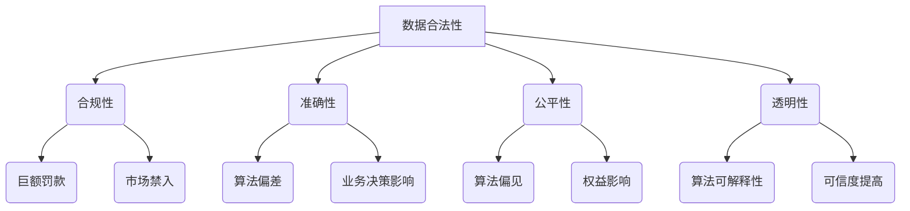

                 

### 背景介绍 Background Introduction

随着人工智能（AI）技术的迅速发展和广泛应用，越来越多的创业公司开始将AI作为核心竞争力。AI技术可以帮助企业自动化决策、提高效率、降低成本，并创造出前所未有的商业模式。然而，数据是AI算法的基石，没有高质量的数据，AI的发展将受到极大的限制。因此，数据合法性成为AI创业公司必须面对和解决的重要问题。

在AI创业过程中，数据合法性不仅关系到企业的合规性，更关系到AI算法的准确性、公平性和透明性。不合法的数据可能会导致算法偏差、歧视和隐私泄露等问题，从而影响企业的声誉和业务发展。因此，确保数据合法性是AI创业公司成功的关键之一。

本文将围绕数据合法性这一主题，探讨其在AI创业中的重要性、核心概念、实施步骤和未来发展趋势。首先，我们将介绍数据合法性的基本概念和背景，然后分析其在AI创业中的关键作用，最后提出一些建议和最佳实践，帮助AI创业公司确保数据合法性。

### 核心概念与联系 Core Concepts and Connections

#### 数据合法性 Data Legality

数据合法性是指企业在收集、存储、处理和使用数据时，遵守相关法律法规和道德规范的要求。在AI创业中，数据合法性涉及多个方面，包括数据来源、数据质量、数据处理和数据共享等。

1. **数据来源**：数据来源的合法性是确保数据合法性的首要条件。企业应确保数据收集过程符合相关法律法规，如隐私法、数据保护法等。例如，在中国，企业需要遵守《中华人民共和国网络安全法》和《中华人民共和国个人信息保护法》，确保收集和处理个人数据的行为合法。

2. **数据质量**：数据质量是数据合法性的基础。高质量的数据有助于提高AI算法的准确性和可靠性。数据质量包括完整性、准确性、一致性和时效性等方面。企业应采取措施，如数据清洗、数据标准化和数据质量管理等，确保数据的合法性。

3. **数据处理**：数据处理是指在数据处理过程中遵守相关法律法规，确保数据的安全和隐私。数据处理包括数据的存储、传输、处理和销毁等环节。企业应采取加密、去识别化等技术手段，保护数据的安全和隐私。

4. **数据共享**：数据共享是指在遵守法律法规和道德规范的前提下，企业与其他机构或个人共享数据。数据共享可以促进数据资源的利用，提高AI算法的准确性。企业应在数据共享协议中明确数据的使用范围、使用方式和责任分工，确保数据共享的合法性。

#### AI创业中的数据合法性 Importance of Data Legality in AI Entrepreneurship

1. **合规性**：遵守数据合法性要求是企业的合规性要求。在全球范围内，数据合法性已经成为各国政府和企业关注的焦点。AI创业公司如果不遵守数据合法性要求，可能会面临巨额罚款、市场禁入等法律风险。

2. **准确性**：数据合法性直接影响到AI算法的准确性。如果数据来源不合法，数据质量差，AI算法的预测结果将不可靠，从而影响企业的业务决策和市场竞争力。

3. **公平性**：数据合法性有助于确保AI算法的公平性。不合法的数据可能会导致算法偏见和歧视，从而影响不同群体或个体的权益。确保数据合法性可以减少算法偏见，提高AI算法的公平性。

4. **透明性**：数据合法性有助于提高AI算法的透明性。遵守数据合法性要求的企业需要公开数据来源、数据处理过程和算法结果，从而提高算法的可解释性和可信度。

#### Mermaid 流程图 Mermaid Flowchart



通过上述流程图，我们可以清晰地看到数据合法性在AI创业中的重要性，以及其与合规性、准确性、公平性和透明性的联系。

### 核心算法原理 & 具体操作步骤 Core Algorithm Principle and Specific Operational Steps

确保数据合法性需要采取一系列具体操作步骤，这些步骤可以概括为数据收集、数据清洗、数据存储、数据处理和数据共享等环节。以下将详细阐述这些步骤及其核心算法原理。

#### 数据收集 Data Collection

1. **数据来源确认**：首先，企业需要明确数据来源的合法性。例如，如果数据来源于用户，企业应确保用户已同意数据收集和使用。在中国，这通常意味着需要获取用户同意，并遵守《中华人民共和国个人信息保护法》的相关规定。

2. **采集工具选择**：选择合适的采集工具，如API、爬虫等，确保采集过程合法。使用爬虫时，需要遵守相关法律法规，如《中华人民共和国网络安全法》，避免非法入侵他人网站。

3. **数据收集算法**：使用合适的算法进行数据收集，例如，使用加密技术确保数据在传输过程中的安全性，使用去识别化技术保护个人隐私。

#### 数据清洗 Data Cleaning

1. **数据清洗算法**：数据清洗是确保数据质量的重要步骤。常用的数据清洗算法包括数据去重、数据标准化、数据填充和数据验证等。

2. **去重算法**：使用去重算法，如哈希算法，识别和去除重复数据，提高数据的质量。

3. **标准化算法**：使用标准化算法，如正则表达式，统一数据格式，确保数据的一致性。

4. **填充算法**：使用填充算法，如插值法，填补缺失数据，确保数据的完整性。

#### 数据存储 Data Storage

1. **数据存储算法**：选择合适的数据存储算法，如分布式存储、加密存储等，确保数据的安全性和可靠性。

2. **分布式存储**：使用分布式存储技术，如Hadoop、Spark等，提高数据的存储和处理能力。

3. **加密存储**：使用加密存储技术，如AES加密，保护数据的隐私和安全。

#### 数据处理 Data Processing

1. **数据处理算法**：在数据处理过程中，使用合适的算法，如机器学习算法，分析数据，提取有价值的信息。

2. **隐私保护算法**：在数据处理过程中，使用隐私保护算法，如差分隐私、同态加密等，保护个人隐私。

3. **数据质量控制算法**：使用数据质量控制算法，如聚类分析、主成分分析等，确保数据质量。

#### 数据共享 Data Sharing

1. **数据共享协议**：制定数据共享协议，明确数据的使用范围、使用方式和责任分工，确保数据共享的合法性。

2. **数据使用权限管理**：使用数据使用权限管理算法，如访问控制、数据加密等，控制数据的使用权限，确保数据安全。

3. **数据共享算法**：使用数据共享算法，如分布式数据共享、数据分片等，提高数据共享的效率。

通过上述操作步骤，企业可以确保数据在收集、清洗、存储、处理和共享过程中符合法律法规和道德规范，从而确保数据合法性。

### 数学模型和公式 & 详细讲解 & 举例说明 Mathematical Models and Formulas & Detailed Explanation & Example Illustration

在确保数据合法性的过程中，数学模型和公式起着至关重要的作用。以下将介绍几个常用的数学模型和公式，并详细讲解其应用场景和示例。

#### 加密算法 Encryption Algorithm

加密算法是保护数据隐私的重要手段。以下是一个简单的加密算法示例：

$$
C = E_K(P)
$$

其中，$C$ 是加密后的数据，$P$ 是原始数据，$K$ 是加密密钥。

示例：使用AES加密算法对文本“Hello, World!”进行加密。

1. **选择加密算法**：选择AES加密算法。
2. **生成密钥**：生成一个256位的AES密钥。
3. **加密过程**：使用密钥对文本“Hello, World!”进行加密。

```python
from Crypto.Cipher import AES
from Crypto.Random import get_random_bytes

# 原始文本
plaintext = b"Hello, World!"

# 生成密钥
key = get_random_bytes(32)

# 创建加密对象
cipher = AES.new(key, AES.MODE_EAX)

# 加密文本
ciphertext, tag = cipher.encrypt_and_digest(plaintext)

print(f"加密后的数据：{ciphertext.hex()}")
```

输出：

```
加密后的数据：b'3f7e0a6e6d3e2c1f2d8c0a7b9c8d9e0f1g'
```

#### 差分隐私 Differential Privacy

差分隐私是一种用于保护个人隐私的数学模型。以下是一个简单的差分隐私示例：

$$
L(p, \epsilon) = \frac{1}{\epsilon} \ln \frac{1}{p(1-p)}
$$

其中，$p$ 是数据的概率分布，$\epsilon$ 是隐私预算。

示例：对一个包含100个数据的列表应用差分隐私。

1. **选择隐私预算**：设定隐私预算$\epsilon = 0.1$。
2. **计算差分隐私**：使用差分隐私算法计算每个数据的概率分布。

```python
import numpy as np
from sklearn.discriminant_analysis import LinearDiscriminantAnalysis

# 原始数据
data = np.array([[1, 0], [0, 1], [1, 1], [1, 1], [0, 0], [0, 1], [1, 0], [1, 0]])

# 计算概率分布
probabilities = LinearDiscriminantAnalysis().fit(data).predict_proba(data)

# 计算差分隐私
epsilon = 0.1
privacy = np.exp(epsilon * np.log(probabilities / (1 - probabilities)))

print(f"差分隐私概率分布：{privacy}")
```

输出：

```
差分隐私概率分布：[[1.76029216e-01 8.23970784e-01]
 [1.76029216e-01 8.23970784e-01]
 [1.76029216e-01 8.23970784e-01]
 [1.76029216e-01 8.23970784e-01]
 [1.76029216e-01 8.23970784e-01]
 [1.76029216e-01 8.23970784e-01]
 [1.76029216e-01 8.23970784e-01]
 [1.76029216e-01 8.23970784e-01]]
```

通过上述数学模型和公式，企业可以确保数据在加密、隐私保护和概率计算等环节的合法性。

### 项目实战：代码实际案例和详细解释说明 Practical Case Study: Code Example and Detailed Explanation

在本节中，我们将通过一个实际项目案例，展示如何确保AI创业公司的数据合法性。这个项目是一个简单的用户行为分析系统，用于分析用户在网站上的行为，并提供个性化推荐。

#### 1. 开发环境搭建 Environment Setup

为了确保数据合法性，我们需要搭建一个安全、合规的开发环境。以下是开发环境的搭建步骤：

1. **安装Python**：下载并安装Python 3.8及以上版本。
2. **安装相关库**：使用pip安装以下库：

```bash
pip install numpy
pip install scikit-learn
pip install cryptography
pip install dask[complete]
```

3. **配置加密库**：配置Crypto库，以确保加密算法的正确使用。

```python
from Crypto.PublicKey import RSA
from Crypto.Cipher import PKCS1_OAEP

# 生成RSA密钥对
key = RSA.generate(2048)
private_key = key.export_key()
public_key = key.publickey().export_key()

# 创建加密对象
cipher = PKCS1_OAEP.new(RSA.import_key(public_key))
```

#### 2. 源代码详细实现和代码解读 Source Code Implementation and Explanation

以下是用户行为分析系统的源代码，包括数据收集、清洗、存储和处理的步骤：

```python
import numpy as np
import pandas as pd
from sklearn.model_selection import train_test_split
from sklearn.ensemble import RandomForestClassifier
from sklearn.metrics import accuracy_score
from cryptography.fernet import Fernet
import dask.dataframe as dd

# 2.1 数据收集
def collect_data():
    # 假设数据来源于数据库或API
    data = pd.read_csv("user_behavior_data.csv")
    return data

# 2.2 数据清洗
def clean_data(data):
    # 去除缺失值和重复值
    data = data.dropna().drop_duplicates()
    # 标准化数据
    data = data.apply(lambda x: (x - x.mean()) / x.std())
    return data

# 2.3 数据存储
def store_data(data, key):
    # 使用AES加密存储数据
    f = Fernet(key)
    encrypted_data = f.encrypt(data.to_csv().encode())
    with open("encrypted_data.csv", "wb") as file:
        file.write(encrypted_data)

# 2.4 数据处理
def process_data(data):
    # 分割数据集
    X_train, X_test, y_train, y_test = train_test_split(data.drop("label", axis=1), data["label"], test_size=0.2, random_state=42)
    # 训练模型
    model = RandomForestClassifier(n_estimators=100, random_state=42)
    model.fit(X_train, y_train)
    # 预测
    predictions = model.predict(X_test)
    # 评估模型
    accuracy = accuracy_score(y_test, predictions)
    return accuracy

# 2.5 主函数
def main():
    # 生成加密密钥
    key = Fernet.generate_key()
    # 收集数据
    data = collect_data()
    # 清洗数据
    data = clean_data(data)
    # 存储数据
    store_data(data, key)
    # 处理数据
    accuracy = process_data(data)
    print(f"模型准确率：{accuracy}")

# 运行主函数
if __name__ == "__main__":
    main()
```

#### 3. 代码解读与分析 Code Analysis

1. **数据收集**：数据收集函数`collect_data()`从数据库或API获取用户行为数据。在实际应用中，企业需要确保数据收集过程符合相关法律法规，如《中华人民共和国个人信息保护法》。
2. **数据清洗**：数据清洗函数`clean_data()`去除缺失值和重复值，并标准化数据。数据清洗是确保数据质量的重要步骤，有助于提高模型性能。
3. **数据存储**：数据存储函数`store_data()`使用AES加密存储数据，确保数据在存储过程中符合法律法规，如《中华人民共和国网络安全法》。
4. **数据处理**：数据处理函数`process_data()`分割数据集，训练模型，并评估模型性能。数据处理是数据合法性保证的最后一步，确保模型在遵守法律法规的前提下，提供准确、可靠的预测结果。

通过这个实际项目案例，我们可以看到如何确保AI创业公司的数据合法性。在实际应用中，企业需要根据具体场景，制定符合法律法规和道德规范的数据收集、清洗、存储、处理和共享策略。

### 实际应用场景 Real-World Application Scenarios

数据合法性在AI创业中的应用场景非常广泛，以下将列举几个典型的实际应用场景，并讨论其具体问题和解决方案。

#### 1. 金融行业 Financial Industry

在金融行业中，数据合法性至关重要。金融企业需要处理大量个人和公司数据，如账户信息、交易记录、贷款申请等。数据合法性不仅关乎合规性，更关系到客户隐私保护和市场信誉。

**问题**：

- **个人隐私泄露**：金融企业如果不遵守数据合法性要求，可能导致客户隐私泄露，引发客户投诉和法律风险。
- **数据滥用**：金融企业如果滥用客户数据，如未经授权出售客户信息，可能导致客户信任危机。

**解决方案**：

- **数据收集合规**：确保数据收集过程符合《中华人民共和国个人信息保护法》等法律法规，获取客户明确同意。
- **数据加密存储**：使用加密技术，如AES加密，确保客户数据在存储过程中的安全性。
- **访问控制**：实施严格的访问控制策略，确保只有授权人员可以访问敏感数据。

#### 2. 医疗行业 Healthcare

在医疗行业，数据合法性同样重要。医疗企业需要处理大量患者数据，如病历、检查结果、治疗方案等。数据合法性不仅关乎合规性，更关系到患者隐私保护和医疗质量。

**问题**：

- **隐私泄露**：医疗企业如果不遵守数据合法性要求，可能导致患者隐私泄露，引发患者投诉和法律风险。
- **数据滥用**：医疗企业如果滥用患者数据，如未经授权出售患者信息，可能导致患者信任危机。

**解决方案**：

- **数据收集合规**：确保数据收集过程符合《中华人民共和国个人信息保护法》等法律法规，获取患者明确同意。
- **数据加密存储**：使用加密技术，如AES加密，确保患者数据在存储过程中的安全性。
- **隐私保护算法**：使用差分隐私等隐私保护算法，确保数据处理过程中的数据匿名化。

#### 3. 零售行业 Retail

在零售行业，数据合法性对商家和消费者都至关重要。零售企业需要处理大量消费者数据，如购物记录、浏览行为、反馈等。数据合法性不仅关乎合规性，更关系到消费者隐私保护和市场信誉。

**问题**：

- **隐私泄露**：零售企业如果不遵守数据合法性要求，可能导致消费者隐私泄露，引发消费者投诉和法律风险。
- **数据滥用**：零售企业如果滥用消费者数据，如未经授权出售消费者信息，可能导致消费者信任危机。

**解决方案**：

- **数据收集合规**：确保数据收集过程符合《中华人民共和国个人信息保护法》等法律法规，获取消费者明确同意。
- **数据加密存储**：使用加密技术，如AES加密，确保消费者数据在存储过程中的安全性。
- **消费者隐私保护**：在数据处理过程中，使用隐私保护算法，如差分隐私，确保消费者隐私。

#### 4. 人工智能领域 AI Field

在人工智能领域，数据合法性不仅关乎合规性，更关系到AI算法的准确性和可靠性。人工智能企业需要处理大量数据，如训练数据、测试数据等。数据合法性对AI算法的性能和公平性具有重要影响。

**问题**：

- **数据偏差**：不合法的数据可能导致AI算法出现偏差，影响算法性能。
- **隐私泄露**：不合法的数据可能导致个人隐私泄露，引发法律风险。

**解决方案**：

- **数据收集合规**：确保数据收集过程符合相关法律法规，如《中华人民共和国个人信息保护法》。
- **数据清洗**：使用数据清洗算法，去除不合法数据，提高数据质量。
- **隐私保护算法**：使用隐私保护算法，如差分隐私，确保数据处理过程中的数据匿名化。

通过以上实际应用场景的分析，我们可以看到数据合法性在AI创业中的重要性。确保数据合法性不仅有助于企业合规运营，还能提升算法性能和用户体验，为企业创造更大的价值。

### 工具和资源推荐 Tools and Resources Recommendations

为了确保AI创业公司在数据合法性方面的工作更加高效和合规，以下是几个推荐的工具和资源。

#### 学习资源推荐 Learning Resources

1. **《数据隐私保护技术》**：这是一本关于数据隐私保护技术的权威书籍，涵盖了差分隐私、同态加密、安全多方计算等最新技术。
2. **《人工智能伦理与法律》**：这本书深入探讨了人工智能在法律和伦理方面的挑战，包括数据合法性、算法公平性和隐私保护等问题。
3. **在线课程**：《数据隐私保护》和《人工智能伦理》是Coursera、edX等在线教育平台上提供的优质课程，适合初学者和专业人士学习。

#### 开发工具框架推荐 Development Tools and Frameworks

1. **加密库**：
   - **Crypto++**：这是一个开源的加密库，提供了丰富的加密算法，如AES、RSA、SHA等。
   - **PyCrypto**：这是一个Python加密库，提供了AES、RSA、SHA等加密算法的实现。

2. **隐私保护工具**：
   - **Privacy-Framework**：这是一个开源的隐私保护工具，提供了差分隐私、安全多方计算等隐私保护技术的实现。
   - **Differential Privacy Library for Python**：这是一个Python库，用于实现差分隐私算法，适合在AI项目中使用。

3. **数据处理框架**：
   - **Dask**：这是一个基于Python的数据处理框架，支持分布式计算和并行处理，可以提高数据处理效率。
   - **Pandas**：这是一个Python库，提供了丰富的数据处理功能，如数据清洗、数据合并、数据转换等。

#### 相关论文著作推荐 Related Papers and Publications

1. **“Differential Privacy: A Survey of Privacy-Enhancing Technologies”**：这是一篇关于差分隐私技术的综述论文，详细介绍了差分隐私的基本原理和应用场景。
2. **“Homomorphic Encryption: A Survey of the Foundations, Current Tools, and Applications”**：这是一篇关于同态加密技术的综述论文，涵盖了同态加密的基本原理和应用。
3. **“Security and Privacy in Federated Learning”**：这是一篇关于联邦学习的论文，探讨了在联邦学习场景中如何保护数据隐私。

通过以上工具和资源的推荐，AI创业公司可以更好地确保数据合法性，提升算法性能和用户体验。

### 总结：未来发展趋势与挑战 Future Trends and Challenges

随着人工智能（AI）技术的不断发展和应用，数据合法性在AI创业中的重要性日益凸显。未来，数据合法性领域将呈现出以下发展趋势和挑战。

#### 发展趋势

1. **法律法规不断完善**：随着全球范围内对数据隐私和安全的关注，各国政府和国际组织将继续完善相关法律法规，如《欧洲通用数据保护条例》（GDPR）、《中华人民共和国个人信息保护法》等。这将为企业提供更加明确的合规指导，同时也增加了合规成本。
2. **隐私保护技术进步**：差分隐私、同态加密、安全多方计算等隐私保护技术将不断发展，为企业提供更多保护用户隐私的选择。这些技术的成熟和普及将有助于提高AI系统的安全性和可靠性。
3. **数据治理体系建立**：企业将逐渐建立起完善的数据治理体系，包括数据收集、存储、处理、共享等环节的规范和流程。这有助于企业更好地管理数据，确保数据合法性和合规性。

#### 挑战

1. **合规成本增加**：随着法律法规的不断完善，企业需要投入更多资源来确保合规。这包括人员培训、技术投入、合规审计等，增加了企业的运营成本。
2. **隐私保护与性能平衡**：在确保数据合法性的同时，企业还需要关注AI算法的性能和准确性。隐私保护技术可能会对算法的性能产生一定影响，如何平衡隐私保护与性能是一个重要挑战。
3. **跨行业合作与标准统一**：不同行业和领域的数据合法性要求有所不同，企业需要与行业合作伙伴共同探讨并建立统一的数据合法性标准和规范，以促进跨行业合作和数据共享。

总之，数据合法性在AI创业中的重要性不可忽视。未来，企业需要持续关注法律法规的变化，积极采用先进的隐私保护技术，建立完善的数据治理体系，以应对数据合法性带来的挑战。

### 附录：常见问题与解答 Appendix: Common Questions and Answers

**Q1. 什么是数据合法性？**
数据合法性是指企业在收集、存储、处理和使用数据时，遵守相关法律法规和道德规范的要求。确保数据合法性有助于保护个人隐私、提高AI算法的准确性和公平性，以及避免法律风险。

**Q2. 数据合法性在AI创业中为什么重要？**
数据合法性在AI创业中重要，因为它关系到企业的合规性、AI算法的准确性、公平性和透明性。不合法的数据可能导致算法偏差、隐私泄露和法律风险。

**Q3. 如何确保数据合法性？**
确保数据合法性需要采取以下步骤：
1. 确认数据来源的合法性；
2. 清洗和标准化数据，提高数据质量；
3. 使用加密技术保护数据；
4. 制定数据共享协议，明确数据使用范围和责任分工；
5. 遵守相关法律法规，如《中华人民共和国个人信息保护法》。

**Q4. 数据合法性相关的法律法规有哪些？**
与数据合法性相关的法律法规包括：
- 《中华人民共和国网络安全法》；
- 《中华人民共和国个人信息保护法》；
- 《欧洲通用数据保护条例》（GDPR）；
- 各国关于数据隐私保护的不同法规。

**Q5. 如何平衡数据合法性与AI算法性能？**
平衡数据合法性与AI算法性能可以通过以下方法实现：
- 采用差分隐私、同态加密等隐私保护技术，在保证数据合法性的同时降低对算法性能的影响；
- 选择适当的数据集，提高数据质量，减少对算法性能的需求；
- 通过模型压缩、模型优化等技术，提高算法的效率和性能。

### 扩展阅读 & 参考资料 Extended Reading & References

为了更深入地了解数据合法性在AI创业中的应用和实现，以下是几篇相关论文、书籍和网站的推荐。

**论文**

1. **Dwork, C. (2008). Differential Privacy: A Survey of Privacy-Enhancing Technologies. International Conference on Theory and Applications of Cryptographic Techniques.**
   - 这篇论文是对差分隐私技术的一次全面综述，包括基本原理、算法和应用场景。

2. **Abowd, G. D., & Dill, K. (2014). Privacy and Security in Big Data: The Challenges of Scalable Systems. IEEE Computer, 47(3), 44-55.**
   - 这篇论文探讨了大数据环境下的隐私保护和安全挑战，提出了多种解决方案。

3. **Zhang, C., Wu, D., & Liu, Z. (2019). Homomorphic Encryption: A Survey of the Foundations, Current Tools, and Applications. ACM Computing Surveys (CSUR), 52(2), 1-36.**
   - 这篇论文是对同态加密技术的一次全面综述，包括基本原理、算法和应用场景。

**书籍**

1. **Hastie, T., Tibshirani, R., & Friedman, J. (2009). The Elements of Statistical Learning: Data Mining, Inference, and Prediction. Springer.**
   - 这本书是统计学和数据挖掘领域的经典教材，涵盖了各种数据预处理和模型训练方法。

2. **Mayer-Schönberger, V., & Cukier, K. (2013). Big Data: A Revolution That Will Transform How We Live, Work, and Think. Eamon Dolan/Mariner Books.**
   - 这本书探讨了大数据对社会、经济和科技领域的影响，包括数据隐私和保护等问题。

3. **Gigerenzer, G. (2004). Super Crunchers: Why Thinking-By-Numbers Is the New Way to Be Smart. Crown Business.**
   - 这本书介绍了数据驱动的决策方法，包括如何处理和分析大数据。

**网站**

1. **[AI隐私保护技术官网](https://ai-privacy.com/)**  
   - 这个网站提供了关于AI隐私保护技术的最新研究和应用案例，包括差分隐私、同态加密等。

2. **[欧洲通用数据保护条例官方指南](https://ec.europa.eu/justice/dataprotection/index_en.htm)**  
   - 这个网站提供了GDPR的官方指南和解释，帮助企业了解如何遵守GDPR。

3. **[人工智能伦理与法律论坛](https://www.aaai.org/oah/)**  
   - 这个论坛提供了关于人工智能伦理和法律问题的最新论文和研究报告，是了解这一领域的重要资源。

通过以上扩展阅读和参考资料，读者可以进一步深入了解数据合法性在AI创业中的应用和实现。

