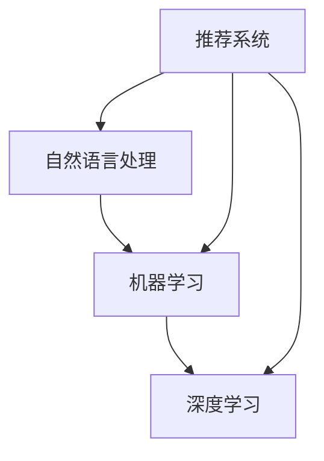

                 

### 背景介绍

随着互联网的迅速发展和电商行业的崛起，用户在购物过程中对于搜索导购的需求日益增长。传统的电商搜索导购方式依赖于关键字匹配和简单的推荐算法，这种模式在用户数量和商品种类不断扩大的背景下逐渐暴露出诸多问题，如搜索结果不准确、推荐不精准等。为了解决这些问题，人工智能（AI）技术的引入成为了一种新的解决方案。

首先，AI技术能够通过机器学习和深度学习算法，对用户的购物行为和偏好进行深入分析。通过收集用户的历史购买记录、浏览记录、搜索历史等数据，AI系统可以构建出用户的个性化购物画像，从而实现更精准的搜索和推荐结果。

其次，AI技术还具备自然语言处理（NLP）能力，可以理解和解析用户在搜索框中输入的自然语言查询。通过对查询意图的识别和理解，AI系统能够提供更加符合用户需求的搜索结果，从而提升用户的购物体验。

此外，AI技术还可以通过图像识别和语音识别技术，实现视觉搜索和语音搜索功能。这些技术的引入，使得用户可以通过图片或语音来搜索商品，大大提高了搜索的便捷性和趣味性。

总的来说，AI技术在电商搜索导购中的应用，不仅能够提升搜索效率和推荐效果，还能为用户提供更加智能化、个性化、沉浸式的购物体验。本文将围绕AI技术在电商搜索导购中的核心概念、算法原理、应用场景、工具和资源等方面进行详细探讨。

### 核心概念与联系

在探讨AI技术在电商搜索导购中的应用之前，我们需要先了解几个核心概念，包括自然语言处理（NLP）、机器学习（ML）、深度学习（DL）和推荐系统（RS）。这些概念不仅构成了AI技术的基础，也直接影响了电商搜索导购的智能化水平。

**自然语言处理（NLP）**：NLP是AI领域的一个重要分支，旨在使计算机能够理解和处理人类自然语言。在电商搜索导购中，NLP技术可以用于理解用户的查询意图，提取关键词，并进行语义分析，从而提高搜索的准确性和效率。

**机器学习（ML）**：ML是一种通过数据驱动的方法，让计算机从数据中学习并做出预测或决策的技术。在电商搜索导购中，ML算法可以用来分析用户的购物行为，构建用户画像，并预测用户的潜在需求。

**深度学习（DL）**：DL是ML的一种特殊形式，它通过模拟人脑的神经网络结构，对大量数据进行自动特征提取和学习。在电商搜索导购中，DL算法可以用于处理复杂的用户行为数据，实现更加精准的推荐和搜索结果。

**推荐系统（RS）**：推荐系统是一种通过预测用户可能感兴趣的项目，向用户推荐内容或项目的系统。在电商搜索导购中，推荐系统可以根据用户的购物历史和行为，提供个性化的商品推荐。

为了更好地理解这些概念之间的关系，我们可以使用Mermaid流程图来展示它们的联系。



**流程说明**：

1. **自然语言处理（NLP）**：用户的搜索查询首先经过NLP的处理，提取出关键词和语义。
2. **机器学习（ML）**：提取出的关键词和语义通过ML算法进行处理，用于构建用户画像和搜索意图识别。
3. **深度学习（DL）**：ML算法中的复杂模型可以通过DL算法进一步优化和改进，以提升模型的性能。
4. **推荐系统（RS）**：用户画像和搜索意图识别的结果用于推荐系统的决策，推荐出符合用户需求的商品。

通过这种流程，AI技术能够有效地将用户的需求转化为具体的搜索和推荐结果，从而实现电商搜索导购的智能化和个性化。

### 核心算法原理 & 具体操作步骤

在AI技术应用于电商搜索导购中，核心算法包括自然语言处理（NLP）、机器学习（ML）、深度学习（DL）和推荐系统（RS）。这些算法共同作用，实现了更精准、更智能的用户搜索和推荐。以下将详细阐述这些算法的基本原理和具体操作步骤。

#### 自然语言处理（NLP）

**1. 基本原理**：
NLP的核心任务是使计算机能够理解、解析和生成自然语言。在电商搜索导购中，NLP主要用于理解用户的查询意图和提取关键词。

**2. 具体操作步骤**：
- **文本预处理**：对用户的查询进行清洗和标准化，如去除停用词、进行词干提取等。
- **词向量表示**：将文本转换为词向量，常用的词向量模型有Word2Vec、GloVe等。
- **命名实体识别（NER）**：识别文本中的特定实体，如人名、地名、产品名等。
- **语义分析**：使用词向量模型或转移矩阵等工具，分析文本的语义关系，提取关键词。

**3. 示例**：
假设用户在搜索框中输入“想要购买一款黑色的iPhone 13”，NLP算法将进行以下步骤：
- 清洗和标准化文本，去除无意义的词如“一款”、“想要”等。
- 将文本转换为词向量。
- 通过NER识别出“iPhone 13”为产品名。
- 分析语义关系，提取关键词“黑色”、“iPhone 13”。

#### 机器学习（ML）

**1. 基本原理**：
ML是一种通过数据驱动的方式，使计算机从数据中学习并做出预测或决策的技术。在电商搜索导购中，ML算法主要用于构建用户画像和预测用户行为。

**2. 具体操作步骤**：
- **数据收集**：收集用户的历史购买记录、浏览记录、搜索历史等数据。
- **特征工程**：对收集到的数据进行分析，提取出有意义的特征，如用户购买频率、浏览时长等。
- **模型训练**：使用特征数据和标签数据，通过ML算法训练模型。
- **模型评估**：评估模型的性能，如准确率、召回率等。

**3. 示例**：
假设我们使用逻辑回归（Logistic Regression）算法来预测用户是否会在未来30天内购买某个商品：
- 收集用户的历史购买记录、浏览记录等数据。
- 提取特征，如用户购买频率、浏览时长等。
- 使用训练集数据训练逻辑回归模型。
- 使用测试集数据评估模型性能。

#### 深度学习（DL）

**1. 基本原理**：
DL是ML的一种特殊形式，通过神经网络结构对大量数据进行自动特征提取和学习。在电商搜索导购中，DL算法可以用于处理复杂的用户行为数据，实现更加精准的推荐。

**2. 具体操作步骤**：
- **数据预处理**：对用户数据进行清洗、标准化和分割。
- **构建神经网络**：使用卷积神经网络（CNN）、循环神经网络（RNN）等构建深度学习模型。
- **模型训练**：使用预处理后的数据训练深度学习模型。
- **模型评估**：评估模型的性能，如准确率、F1值等。

**3. 示例**：
假设我们使用卷积神经网络（CNN）来预测用户对某个商品的喜好：
- 收集用户的历史购买记录、浏览记录等数据，进行预处理。
- 使用预处理后的数据构建CNN模型。
- 使用训练集数据训练CNN模型。
- 使用测试集数据评估模型性能。

#### 推荐系统（RS）

**1. 基本原理**：
RS是一种通过预测用户可能感兴趣的项目，向用户推荐内容或项目的系统。在电商搜索导购中，推荐系统可以根据用户的购物历史和行为，提供个性化的商品推荐。

**2. 具体操作步骤**：
- **用户画像构建**：根据用户的购物历史、浏览记录等数据，构建用户的个性化画像。
- **商品画像构建**：根据商品的特征，如价格、品牌、类型等，构建商品的个性化画像。
- **相似度计算**：计算用户画像和商品画像之间的相似度，常用的相似度计算方法有余弦相似度、欧氏距离等。
- **推荐算法**：根据相似度计算结果，使用推荐算法（如基于内容的推荐、协同过滤等）生成推荐列表。

**3. 示例**：
假设我们使用基于协同过滤的推荐算法来推荐商品：
- 根据用户的历史购买记录和浏览记录，构建用户的个性化画像。
- 根据商品的特征，如价格、品牌、类型等，构建商品的个性化画像。
- 计算用户画像和商品画像之间的相似度。
- 使用相似度结果生成推荐列表。

通过上述算法的应用，AI技术能够有效地提升电商搜索导购的智能化和个性化水平，为用户提供更好的购物体验。

### 数学模型和公式 & 详细讲解 & 举例说明

在AI技术应用于电商搜索导购的过程中，数学模型和公式起到了至关重要的作用。以下将详细讲解几个核心的数学模型和公式，并通过具体实例说明其应用。

#### 1. 余弦相似度

**基本概念**：余弦相似度是一种衡量两个向量相似度的方法，其值介于-1和1之间，1表示两个向量完全相似，-1表示完全相反，0表示没有相似性。

**公式**：
$$
\cos(\theta) = \frac{\vec{A} \cdot \vec{B}}{|\vec{A}| \cdot |\vec{B}|}
$$

其中，$\vec{A}$和$\vec{B}$是两个向量，$\theta$是它们之间的夹角。

**应用实例**：
假设我们有两个用户画像向量$\vec{A} = (1, 2, 3)$和$\vec{B} = (4, 5, 6)$，计算它们的余弦相似度：

首先计算点积：
$$
\vec{A} \cdot \vec{B} = 1 \cdot 4 + 2 \cdot 5 + 3 \cdot 6 = 4 + 10 + 18 = 32
$$

然后计算向量的模：
$$
|\vec{A}| = \sqrt{1^2 + 2^2 + 3^2} = \sqrt{14}
$$
$$
|\vec{B}| = \sqrt{4^2 + 5^2 + 6^2} = \sqrt{77}
$$

最后计算余弦相似度：
$$
\cos(\theta) = \frac{32}{\sqrt{14} \cdot \sqrt{77}} \approx 0.81
$$

这表示用户画像$\vec{A}$和$\vec{B}$之间的相似度较高。

#### 2. 逻辑回归

**基本概念**：逻辑回归是一种用于二分类问题的统计模型，通过输入特征预测目标变量的概率。在电商搜索导购中，逻辑回归可以用于预测用户是否会在未来30天内购买某个商品。

**公式**：
$$
\text{logit}(p) = \ln\left(\frac{p}{1-p}\right)
$$

其中，$p$是目标变量为1的概率。

**推导**：
$$
p = \frac{1}{1 + e^{-z}}
$$
$$
\text{logit}(p) = \ln\left(\frac{p}{1-p}\right) = \ln\left(\frac{1}{1 + e^{-z}}\right) - \ln\left(1 + e^{-z}\right)
$$

**应用实例**：
假设我们有一个逻辑回归模型，输入特征向量$\vec{X} = (1, 2, 3)$，权重向量$\vec{w} = (0.1, 0.2, 0.3)$，计算目标变量的概率：

首先计算输入特征和权重向量的点积：
$$
z = \vec{X} \cdot \vec{w} = 1 \cdot 0.1 + 2 \cdot 0.2 + 3 \cdot 0.3 = 1.1
$$

然后计算概率：
$$
p = \frac{1}{1 + e^{-1.1}} \approx 0.75
$$

这表示用户在未来30天内购买该商品的概率约为75%。

#### 3. 卷积神经网络（CNN）

**基本概念**：CNN是一种用于图像识别的深度学习模型，其核心是卷积层，可以自动提取图像的特征。

**公式**：
$$
\text{conv}(\vec{I}, \vec{K}) = \sum_{i=1}^{C} \sum_{j=1}^{H} \vec{K}_{ij} \cdot \vec{I}_{ij}
$$

其中，$\vec{I}$是输入图像，$\vec{K}$是卷积核，$C$是卷积核的数量，$H$是卷积核的高度。

**应用实例**：
假设我们有一个输入图像$\vec{I} = (1, 1, 1, 1, 1)$和一个卷积核$\vec{K} = (1, 0, -1)$，计算卷积结果：

首先计算每个卷积核的位置的乘积：
$$
\text{conv}(\vec{I}, \vec{K}) = (1 \cdot 1) + (1 \cdot 0) + (1 \cdot -1) = 1
$$

这表示卷积核在输入图像上的卷积结果为1。

通过上述数学模型和公式的应用，AI技术能够在电商搜索导购中实现更精确的预测和推荐，提升用户体验。

### 项目实战：代码实际案例和详细解释说明

为了更好地理解AI技术在电商搜索导购中的应用，我们将通过一个实际项目案例来展示如何实现一个简单的电商搜索导购系统。以下将介绍项目环境搭建、源代码详细实现和代码解读。

#### 1. 开发环境搭建

**工具和库**：
- Python 3.8及以上版本
- TensorFlow 2.6及以上版本
- Keras 2.6及以上版本
- Pandas 1.3及以上版本
- NumPy 1.21及以上版本

**环境配置**：
1. 安装Python 3.8及以上版本。
2. 通过pip命令安装TensorFlow、Keras、Pandas和NumPy：
```bash
pip install tensorflow==2.6
pip install keras==2.6
pip install pandas==1.3
pip install numpy==1.21
```

#### 2. 源代码详细实现

以下是一个简单的电商搜索导购系统的源代码实现，主要包括数据预处理、模型训练和预测三个部分。

```python
import numpy as np
import pandas as pd
from tensorflow.keras.models import Sequential
from tensorflow.keras.layers import Dense, Conv1D, Flatten
from tensorflow.keras.optimizers import Adam
from tensorflow.keras.metrics import Accuracy

# 数据预处理
# 假设数据集为CSV文件，包含用户画像和购买标签
data = pd.read_csv('ecommerce_data.csv')

# 特征提取
X = data.drop('purchase', axis=1)
y = data['purchase']

# 数据标准化
X_normalized = (X - X.mean()) / X.std()

# 划分训练集和测试集
from sklearn.model_selection import train_test_split
X_train, X_test, y_train, y_test = train_test_split(X_normalized, y, test_size=0.2, random_state=42)

# 模型训练
model = Sequential()
model.add(Conv1D(filters=64, kernel_size=3, activation='relu', input_shape=(X_train.shape[1], 1)))
model.add(Flatten())
model.add(Dense(1, activation='sigmoid'))

model.compile(optimizer=Adam(), loss='binary_crossentropy', metrics=['accuracy'])
model.fit(X_train, y_train, epochs=10, batch_size=32, validation_split=0.1)

# 模型评估
test_loss, test_acc = model.evaluate(X_test, y_test)
print(f"Test Accuracy: {test_acc:.2f}")

# 预测
predictions = model.predict(X_test)
predicted_classes = (predictions > 0.5).astype(int)

# 评估预测结果
from sklearn.metrics import classification_report
print(classification_report(y_test, predicted_classes))
```

#### 3. 代码解读与分析

**1. 数据预处理**：
- 从CSV文件读取数据集，包含用户画像和购买标签。
- 提取特征数据$X$和标签数据$y$。
- 对特征数据$X$进行标准化处理，以消除不同特征之间的尺度差异。

**2. 模型训练**：
- 使用Keras构建序列模型（Sequential），添加卷积层（Conv1D）、展平层（Flatten）和全连接层（Dense）。
- 编译模型，指定优化器、损失函数和评价指标。
- 使用训练数据训练模型，并设置验证集比例。

**3. 模型评估**：
- 使用测试数据评估模型性能，打印测试准确率。

**4. 预测**：
- 使用训练好的模型对测试数据进行预测，获取预测结果。
- 使用分类报告（classification report）评估预测结果的准确性。

通过这个实际案例，我们展示了如何使用AI技术实现一个简单的电商搜索导购系统。这个系统通过机器学习和深度学习算法，对用户画像进行特征提取和分类，从而预测用户是否会在未来购买商品。这只是一个简单的示例，实际应用中还需要考虑更多的特征、更复杂的模型和优化策略。

### 实际应用场景

AI技术在电商搜索导购中的实际应用场景丰富多样，下面我们将探讨几个典型应用场景，以及如何通过AI技术提升用户体验和运营效率。

#### 1. 智能推荐系统

智能推荐系统是AI技术在电商搜索导购中应用最广泛的场景之一。通过分析用户的购物历史、浏览记录、搜索行为等数据，智能推荐系统能够为用户提供个性化的商品推荐，从而提升用户的购物体验。例如，阿里巴巴的“淘宝推荐”系统通过深度学习算法分析用户的行为数据，实现基于内容的推荐和协同过滤推荐，为用户推荐符合其兴趣的商品。

**AI技术如何提升**：
- 使用深度学习模型自动提取用户画像和商品特征，实现更精准的推荐。
- 结合用户的实时行为数据，动态调整推荐策略，提高推荐的时效性和准确性。

#### 2. 搜索引擎优化

AI技术可以帮助电商网站优化搜索引擎，提高搜索结果的准确性和用户体验。通过自然语言处理（NLP）和机器学习算法，搜索引擎可以理解用户的查询意图，提供更加精确的搜索结果。例如，谷歌的搜索引擎利用NLP技术，对用户的查询进行语义分析，提供与查询意图高度相关的结果。

**AI技术如何提升**：
- 利用NLP技术对用户的查询进行语义分析，提取关键词和意图。
- 使用机器学习算法对搜索结果进行排序，提高相关性和用户体验。

#### 3. 用户行为分析

AI技术可以分析用户的购物行为，了解用户的兴趣和需求，为电商企业提供有价值的用户洞察。通过机器学习和深度学习算法，电商企业可以识别出用户的购买趋势、偏好和潜在需求，从而制定更加有效的营销策略。

**AI技术如何提升**：
- 收集并分析用户的历史购买记录、浏览记录等数据，构建用户画像。
- 使用聚类算法和关联规则挖掘技术，发现用户的购买模式和偏好。

#### 4. 沉浸式购物体验

AI技术可以帮助电商企业构建沉浸式的购物体验，通过虚拟现实（VR）和增强现实（AR）等技术，为用户提供更加直观、互动的购物体验。例如，亚马逊的“AR购物体验”允许用户通过手机摄像头查看商品的3D模型，并在虚拟环境中进行试穿试戴。

**AI技术如何提升**：
- 利用计算机视觉技术对用户的环境进行识别和建模，实现真实的购物场景还原。
- 结合用户的行为数据，动态调整购物场景，提高用户的沉浸感和互动性。

#### 5. 库存管理和供应链优化

AI技术可以优化电商企业的库存管理和供应链，通过预测用户需求、优化库存配置，减少库存成本和商品缺货率。例如，京东利用AI技术进行需求预测和库存管理，实现了高效的供应链运作。

**AI技术如何提升**：
- 使用机器学习和深度学习算法对用户需求进行预测，优化库存配置。
- 结合实时数据，动态调整库存策略，实现库存的最优管理。

通过上述应用场景，我们可以看到AI技术在电商搜索导购中的重要作用。它不仅提升了用户体验，还为企业提供了更加精准的数据分析和决策支持，推动了电商行业的智能化发展。

### 工具和资源推荐

在AI技术应用于电商搜索导购的过程中，选择合适的工具和资源对于项目的成功至关重要。以下将推荐一些学习资源、开发工具框架和相关论文著作，以帮助读者深入了解和掌握相关技术。

#### 1. 学习资源推荐

**书籍**：
- 《深度学习》（Deep Learning） - 作者：Ian Goodfellow、Yoshua Bengio、Aaron Courville
- 《机器学习实战》（Machine Learning in Action） - 作者：Peter Harrington
- 《Python机器学习》（Python Machine Learning） - 作者：Aurélien Géron

**论文**：
- 《Recurrent Neural Networks for Language Modeling》 - 作者：Yoshua Bengio et al.
- 《Convolutional Neural Networks for Sentence Classification》 - 作者：Yoon Kim
- 《A Theoretical Analysis of the Context Encoders》 - 作者：Rico Sennrich et al.

**博客/网站**：
- [Kaggle](https://www.kaggle.com/)：提供丰富的数据集和竞赛，适合实践和挑战。
- [Medium](https://medium.com/)：有许多AI和机器学习的优秀文章和教程。
- [TensorFlow官方文档](https://www.tensorflow.org/)：详细介绍了TensorFlow的使用方法和最佳实践。

#### 2. 开发工具框架推荐

**框架**：
- **TensorFlow**：由谷歌开发，是当前最流行的深度学习框架之一，适用于各种AI应用。
- **PyTorch**：由Facebook开发，具有灵活的动态计算图和丰富的API，适合快速原型开发和研究。
- **Scikit-learn**：是Python中最常用的机器学习库，提供了丰富的算法和工具。

**集成开发环境（IDE）**：
- **Jupyter Notebook**：适用于数据分析和机器学习的交互式开发环境。
- **Visual Studio Code**：支持Python和多种AI框架，是开发者广泛使用的IDE。

#### 3. 相关论文著作推荐

**论文**：
- 《Deep Learning for Text Classification》 - 作者：Anirudh Koul et al.
- 《Natural Language Inference with Neural Networks》 - 作者：Alon Halevy et al.
- 《Contextual Bandits with Diverse Recommendations》 - 作者：Aydn Winstanley et al.

**著作**：
- 《推荐系统实践》（Recommender Systems Handbook） - 作者：Gary William Flake et al.
- 《对话系统设计与实现》（Dialogue Systems: Design, Implementation, and Evaluation） - 作者：Colin Cherry

通过上述推荐的学习资源、开发工具框架和相关论文著作，读者可以系统地学习和掌握AI技术在电商搜索导购中的应用，为项目实践提供坚实的理论基础和实用工具。

### 总结：未来发展趋势与挑战

随着AI技术的不断进步，电商搜索导购正朝着更加智能化、个性化和沉浸式的方向发展。未来，AI技术在电商搜索导购中的应用将呈现以下几个趋势：

首先，个性化推荐将更加精准。通过深度学习和自然语言处理技术的结合，推荐系统将能够更好地理解用户的个性化需求，提供更加符合用户兴趣和购买偏好的商品推荐。

其次，多模态搜索将成为主流。随着语音识别和图像识别技术的不断发展，用户可以通过语音、图片等多种方式进行搜索，实现更加便捷和直观的购物体验。

此外，沉浸式购物体验将逐渐普及。虚拟现实（VR）和增强现实（AR）技术的应用将使购物过程更加生动和互动，提升用户的购物乐趣和满意度。

然而，AI技术在电商搜索导购中也面临着一些挑战：

首先是数据隐私问题。随着用户数据量的增加，如何保护用户隐私成为了一个重要议题。需要采取有效的数据保护措施，确保用户数据的安全和隐私。

其次是算法透明度和公平性问题。AI算法的决策过程可能存在偏见和不透明，需要加强对算法的监督和评估，确保其公平性和可解释性。

最后是技术实现和落地问题。虽然AI技术发展迅速，但在实际应用中，仍然面临着技术实现和落地过程中的种种挑战，如数据处理、模型优化和系统部署等。

总的来说，AI技术在电商搜索导购中的应用前景广阔，但也需要面对一系列挑战。未来，随着技术的不断发展和完善，AI技术将为电商行业带来更加智能化和个性化的购物体验。

### 附录：常见问题与解答

#### 1. 电商搜索导购中的AI技术有哪些应用？

AI技术在电商搜索导购中的应用主要包括智能推荐系统、搜索引擎优化、用户行为分析、沉浸式购物体验和库存管理等方面。

**智能推荐系统**：通过深度学习和自然语言处理技术，分析用户的历史行为和偏好，提供个性化的商品推荐。

**搜索引擎优化**：利用自然语言处理技术理解用户查询意图，提高搜索结果的准确性和相关性。

**用户行为分析**：通过机器学习算法分析用户的购物行为，了解用户兴趣和需求，为营销策略提供数据支持。

**沉浸式购物体验**：结合虚拟现实（VR）和增强现实（AR）技术，提供更加直观和互动的购物体验。

**库存管理**：使用机器学习和深度学习技术预测用户需求，优化库存配置，减少库存成本和商品缺货率。

#### 2. 电商搜索导购中的AI算法是如何工作的？

电商搜索导购中的AI算法通常包括以下步骤：

**数据收集**：收集用户的历史购买记录、浏览记录、搜索历史等数据。

**数据预处理**：对数据进行清洗、标准化和分割，提取有用特征。

**模型训练**：使用机器学习算法（如逻辑回归、决策树、深度学习等）训练模型。

**模型评估**：评估模型性能，调整模型参数。

**模型部署**：将训练好的模型部署到生产环境中，进行实时预测和推荐。

#### 3. 如何保护用户隐私？

保护用户隐私是AI技术在电商搜索导购中面临的重要挑战。以下是一些常见的隐私保护措施：

**数据匿名化**：对用户数据进行匿名化处理，去除可识别信息。

**数据加密**：对存储和传输的数据进行加密，确保数据安全。

**隐私政策**：明确告知用户数据收集和使用的目的，获得用户同意。

**数据最小化**：仅收集必要的数据，避免过度收集。

**数据访问控制**：对数据访问进行严格控制，确保只有授权人员可以访问敏感数据。

### 扩展阅读 & 参考资料

以下是一些关于AI技术在电商搜索导购领域的重要参考资料，供读者进一步学习和研究：

1. **书籍**：
   - 《深度学习》（Deep Learning） - 作者：Ian Goodfellow、Yoshua Bengio、Aaron Courville
   - 《机器学习实战》（Machine Learning in Action） - 作者：Peter Harrington
   - 《推荐系统实践》（Recommender Systems Handbook） - 作者：Gary William Flake et al.

2. **论文**：
   - 《Recurrent Neural Networks for Language Modeling》 - 作者：Yoshua Bengio et al.
   - 《Convolutional Neural Networks for Sentence Classification》 - 作者：Yoon Kim
   - 《A Theoretical Analysis of the Context Encoders》 - 作者：Rico Sennrich et al.

3. **在线资源**：
   - [TensorFlow官方文档](https://www.tensorflow.org/)
   - [Kaggle](https://www.kaggle.com/)
   - [Medium](https://medium.com/)

4. **相关博客**：
   - [深度学习与电商推荐系统](https://towardsdatascience.com/deep-learning-for-ecommerce-recommendation-systems-8861d8a76a3b)
   - [如何构建一个电商推荐系统？](https://www.datacamp.com/courses/how-to-build-an-ecommerce-recommendation-system)

通过上述扩展阅读和参考资料，读者可以更深入地了解AI技术在电商搜索导购领域的应用和发展趋势。

