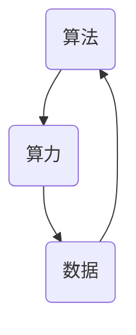

                 

### 背景介绍 Background Introduction

人工智能（AI）作为当今科技领域的热门话题，已经在众多领域展现了其巨大的潜力和应用价值。然而，AI的快速发展并非一蹴而就，而是依赖于多个关键要素的支撑。在这其中，算法（Algorithm）、算力（Compute Power）和数据（Data）被认为是AI发展的三大支柱。它们相互交织、相互促进，共同推动着人工智能的进步。

首先，算法作为AI的灵魂，是人工智能系统决策和推理的核心。从最初的规则系统到现代的深度学习，算法的不断演进使得AI在图像识别、自然语言处理、自动驾驶等多个领域取得了显著的突破。其次，算力是算法高效运行的硬件基础。随着计算能力的不断提升，我们能够处理更加复杂和庞大的数据集，从而推动AI算法的迭代和发展。最后，数据是AI算法训练和优化的基石。无论是监督学习、无监督学习还是强化学习，都需要大量的数据来训练模型，提高其准确性和泛化能力。

本文将围绕算法、算力和数据这三个核心要素展开，探讨它们在AI发展中的重要性以及如何相互作用。我们将首先介绍每个要素的基本概念，然后深入分析它们之间的联系和相互影响，最后探讨当前的发展状况和未来趋势。希望通过本文的阐述，读者能够对AI发展的三大支柱有更深刻的理解。

---

### 核心概念与联系 Core Concepts and Connections

要深入探讨算法、算力和数据在AI发展中的重要性，我们首先需要明确这三个核心概念的具体含义及其相互之间的联系。

**算法（Algorithm）**

算法是计算机科学中的一个基本概念，指的是解决问题的一系列规则或步骤。在AI领域中，算法是实现智能行为的核心。常见的算法包括决策树、支持向量机（SVM）、神经网络等。算法的作用是通过对输入数据进行分析和处理，生成相应的输出，从而实现预测、分类、聚类等任务。算法的设计和优化直接影响AI系统的性能和效率。

**算力（Compute Power）**

算力指的是计算机系统处理数据的能力，通常用计算速度来衡量。算力的大小决定了我们能够处理的数据量和复杂度。算力包括CPU、GPU、TPU等硬件设备，以及并行计算、分布式计算等算法。随着计算能力的提升，AI系统可以处理更加复杂和庞大的数据集，从而提高模型的训练效率和准确性。

**数据（Data）**

数据是AI算法训练和优化的基石。数据的质量和数量直接决定了AI系统的性能。数据可以是结构化数据（如数据库中的记录）、半结构化数据（如XML、JSON等格式）和非结构化数据（如图像、文本、语音等）。在AI训练过程中，需要大量的数据来训练模型，并对其进行优化，使其能够适应不同的应用场景。

**三者之间的联系**

算法、算力和数据在AI发展中相互依存，共同推动着人工智能的进步。首先，算法需要依赖算力来实现高效的计算和处理。一个优秀的算法如果没有足够的计算资源，将难以发挥其潜力。其次，算法的优化和改进往往需要大量的数据作为训练素材，数据的质量和多样性对算法的性能有着至关重要的影响。最后，算力的提升使得我们能够处理更大规模的数据集，从而推动算法的迭代和发展。

为了更好地理解这三者之间的联系，我们可以用Mermaid流程图来表示：



在这个流程图中，算法、算力和数据之间形成了相互促进的循环。算法通过算力来处理数据，生成的结果又作为新的数据反馈到算法中，不断优化和改进算法。同时，算力的提升使得我们能够处理更大规模的数据集，进一步推动算法的发展。

通过这个流程图，我们可以清楚地看到算法、算力和数据之间的紧密联系。它们相互依存、相互促进，共同推动着人工智能的进步。了解这三个核心概念及其联系，对于我们深入理解AI的发展趋势和应用场景具有重要意义。

---

### 核心算法原理 & 具体操作步骤 Core Algorithm Principles and Operational Steps

在了解了算法、算力和数据的基本概念和相互联系之后，我们接下来将深入探讨AI领域中的一些核心算法原理及其具体操作步骤。

**1. 神经网络（Neural Networks）**

神经网络是AI领域中最为广泛使用的一种算法。它模拟了人类大脑神经元的工作方式，通过多层节点（神经元）的互联和激活，实现数据的高效处理和预测。

**基本原理：**

神经网络由输入层、隐藏层和输出层组成。输入层接收外部数据，隐藏层通过激活函数处理输入数据，输出层生成最终结果。神经网络通过反向传播算法不断调整权重和偏置，优化模型性能。

**具体操作步骤：**

（1）初始化模型参数：设置权重和偏置的初始值。
（2）前向传播：将输入数据传递到神经网络中，计算每个神经元的输出。
（3）计算损失：将输出结果与实际结果进行比较，计算损失值。
（4）反向传播：通过梯度下降算法调整模型参数，减少损失值。
（5）迭代训练：重复前向传播和反向传播步骤，直到满足预设的训练目标。

**2. 决策树（Decision Trees）**

决策树是一种基于规则的算法，通过多级划分将数据集划分为多个子集，每个子集对应一个决策规则。

**基本原理：**

决策树的核心是决策节点和叶节点。决策节点用于选择特征进行划分，叶节点表示最终的预测结果。决策树通过递归划分数据集，生成一棵树形结构。

**具体操作步骤：**

（1）选择特征：根据信息增益或基尼系数选择最佳特征进行划分。
（2）划分数据：将数据集划分为多个子集，每个子集对应一个特征值。
（3）递归构建：对每个子集继续进行划分，直到满足停止条件。
（4）生成规则：根据划分结果生成预测规则。

**3. 支持向量机（Support Vector Machines，SVM）**

支持向量机是一种监督学习算法，通过寻找最优超平面，将数据集划分为不同的类别。

**基本原理：**

SVM的核心是找到一个超平面，使得数据集中的不同类别在超平面上的间隔最大化。通过优化目标函数，求解最优超平面，实现对数据的分类。

**具体操作步骤：**

（1）初始化模型参数：设置正则化参数C和核函数类型。
（2）计算支持向量：求解优化问题，找出支持向量。
（3）构建超平面：根据支持向量计算超平面参数。
（4）分类预测：将新数据投影到超平面上，根据投影结果进行分类。

**4. 深度学习（Deep Learning）**

深度学习是神经网络的一种扩展，通过多层神经网络结构，实现更加复杂的数据处理和预测任务。

**基本原理：**

深度学习通过多层神经网络结构，将输入数据逐层抽象，提取出更高层次的特征。深度学习的核心是卷积神经网络（CNN）、循环神经网络（RNN）等。

**具体操作步骤：**

（1）选择模型架构：根据任务需求选择合适的神经网络架构。
（2）初始化模型参数：设置权重和偏置的初始值。
（3）前向传播：将输入数据传递到神经网络中，计算每个神经元的输出。
（4）计算损失：将输出结果与实际结果进行比较，计算损失值。
（5）反向传播：通过梯度下降算法调整模型参数，减少损失值。
（6）迭代训练：重复前向传播和反向传播步骤，直到满足预设的训练目标。

通过上述核心算法的介绍，我们可以看到算法在AI领域中扮演着至关重要的角色。不同的算法适用于不同的任务和数据类型，通过深入理解和掌握这些算法的原理和操作步骤，我们可以更好地应对各种AI挑战，推动人工智能的发展。

---

### 数学模型和公式 & 详细讲解 & 举例说明 Mathematical Models and Formulas & Detailed Explanations & Example Illustrations

在深入探讨AI算法时，数学模型和公式是理解算法运作机制的关键。下面我们将详细介绍一些核心数学模型和公式，并通过实际例子来说明其应用。

**1. 损失函数（Loss Function）**

损失函数是评估模型预测结果与实际结果之间差异的重要工具。在监督学习中，损失函数用来优化模型参数，以减少预测误差。常见的损失函数包括均方误差（MSE）、交叉熵损失（Cross-Entropy Loss）等。

**均方误差（MSE）**

均方误差是回归任务中最常用的损失函数，计算预测值与实际值之间差的平方的平均值。

$$
MSE = \frac{1}{n}\sum_{i=1}^{n}(y_i - \hat{y}_i)^2
$$

其中，$y_i$是实际值，$\hat{y}_i$是预测值，$n$是样本数量。

**交叉熵损失（Cross-Entropy Loss）**

交叉熵损失常用于分类任务，计算预测概率分布与真实分布之间的差异。

$$
CE = -\sum_{i=1}^{n} y_i \log(\hat{y}_i)
$$

其中，$y_i$是实际类别标签（0或1），$\hat{y}_i$是预测概率。

**2. 梯度下降（Gradient Descent）**

梯度下降是一种优化算法，用于调整模型参数以最小化损失函数。梯度下降分为批量梯度下降、随机梯度下降（SGD）和迷你批量梯度下降（Mini-batch Gradient Descent）等。

**批量梯度下降（Batch Gradient Descent）**

批量梯度下降使用整个数据集来计算梯度，更新模型参数。

$$
\theta_j := \theta_j - \alpha \cdot \frac{\partial J(\theta)}{\partial \theta_j}
$$

其中，$\theta_j$是第j个模型参数，$\alpha$是学习率，$J(\theta)$是损失函数。

**随机梯度下降（Stochastic Gradient Descent，SGD）**

随机梯度下降使用单个样本来计算梯度，更新模型参数。

$$
\theta_j := \theta_j - \alpha \cdot \frac{\partial J(\theta)}{\partial \theta_j}
$$

其中，$x_i$是单个样本，$y_i$是实际标签，$J(\theta)$是损失函数。

**迷你批量梯度下降（Mini-batch Gradient Descent）**

迷你批量梯度下降结合了批量梯度下降和随机梯度下降的优点，使用小批量（如32或64个样本）来计算梯度。

$$
\theta_j := \theta_j - \alpha \cdot \frac{1}{m} \sum_{i=1}^{m} \frac{\partial J(\theta)}{\partial \theta_j}
$$

其中，$m$是批量大小。

**3. 卷积神经网络（Convolutional Neural Networks，CNN）**

卷积神经网络是深度学习领域的重要算法，特别适用于图像处理任务。CNN的核心是卷积层，通过卷积运算提取图像特征。

**卷积运算（Convolution Operation）**

卷积运算通过卷积核（filter）与输入图像进行点积操作，生成特征图。

$$
\text{Feature Map}_{ij} = \sum_{k=1}^{K} w_{ik} \cdot x_{ij+k}
$$

其中，$x_{ij+k}$是输入图像的像素值，$w_{ik}$是卷积核权重。

**4. 循环神经网络（Recurrent Neural Networks，RNN）**

循环神经网络是处理序列数据的重要算法，通过隐藏状态的记忆机制实现序列建模。

**时间步计算（Time Step Computation）**

在RNN中，当前时间步的隐藏状态取决于当前输入和前一时刻的隐藏状态。

$$
h_t = \sigma(W_h \cdot [h_{t-1}, x_t] + b_h)
$$

其中，$h_t$是当前时间步的隐藏状态，$x_t$是当前输入，$W_h$是权重矩阵，$b_h$是偏置项，$\sigma$是激活函数。

**例子说明**

**例子1：使用均方误差和梯度下降优化线性回归模型**

假设我们有一个简单的线性回归模型，预测房价，损失函数为均方误差。

$$
y = \theta_0 + \theta_1 \cdot x
$$

损失函数为：

$$
J(\theta) = \frac{1}{2} \sum_{i=1}^{n} (y_i - (\theta_0 + \theta_1 \cdot x_i))^2
$$

使用梯度下降进行优化：

$$
\theta_0 := \theta_0 - \alpha \cdot \frac{1}{n} \sum_{i=1}^{n} (y_i - (\theta_0 + \theta_1 \cdot x_i))
$$

$$
\theta_1 := \theta_1 - \alpha \cdot \frac{1}{n} \sum_{i=1}^{n} (y_i - (\theta_0 + \theta_1 \cdot x_i)) \cdot x_i
$$

**例子2：使用卷积神经网络识别手写数字**

使用卷积神经网络（CNN）对MNIST手写数字数据集进行分类。

（1）输入层：接受28x28像素的手写数字图像。
（2）卷积层：使用5x5卷积核提取特征。
（3）激活函数：使用ReLU激活函数。
（4）池化层：使用2x2最大池化。
（5）全连接层：将卷积特征映射到10个类别。

通过这些数学模型和公式的讲解，我们可以更好地理解AI算法的运作机制，并在实际应用中进行有效的模型优化和预测。掌握这些核心概念和工具，对于深入研究和应用人工智能具有重要意义。

---

### 项目实战：代码实际案例和详细解释说明 Project Practice: Real-world Code Case Studies and Detailed Explanations

在了解了AI的核心算法原理和数学模型后，通过实际项目实战来加深理解和应用是至关重要的。以下我们将通过两个具体案例，详细介绍如何在实际开发环境中搭建环境、编写源代码并进行详细解读。

#### 5.1 开发环境搭建 Environment Setup

为了方便演示，我们将使用Python作为主要编程语言，并结合TensorFlow作为深度学习框架。以下是搭建开发环境的步骤：

1. **安装Python**：确保安装了Python 3.7及以上版本。
2. **安装TensorFlow**：使用pip命令安装TensorFlow：
   ```shell
   pip install tensorflow
   ```
3. **配置GPU支持**：如果使用GPU进行训练，确保安装了CUDA和cuDNN。
4. **安装其他依赖库**：包括NumPy、Pandas等常用库。

#### 5.2 源代码详细实现和代码解读 Source Code Implementation and Explanation

**案例1：使用卷积神经网络（CNN）进行图像分类**

以下是一个简单的CNN模型，用于识别CIFAR-10数据集中的图像。

```python
import tensorflow as tf
from tensorflow.keras import datasets, layers, models

# 加载CIFAR-10数据集
(train_images, train_labels), (test_images, test_labels) = datasets.cifar10.load_data()

# 数据预处理
train_images, test_images = train_images / 255.0, test_images / 255.0

# 构建CNN模型
model = models.Sequential()
model.add(layers.Conv2D(32, (3, 3), activation='relu', input_shape=(32, 32, 3)))
model.add(layers.MaxPooling2D((2, 2)))
model.add(layers.Conv2D(64, (3, 3), activation='relu'))
model.add(layers.MaxPooling2D((2, 2)))
model.add(layers.Conv2D(64, (3, 3), activation='relu'))

# 添加全连接层
model.add(layers.Flatten())
model.add(layers.Dense(64, activation='relu'))
model.add(layers.Dense(10, activation='softmax'))

# 编译模型
model.compile(optimizer='adam',
              loss='sparse_categorical_crossentropy',
              metrics=['accuracy'])

# 训练模型
model.fit(train_images, train_labels, epochs=10, validation_split=0.1)
```

**代码解读：**

1. **数据加载与预处理**：首先加载CIFAR-10数据集，并归一化图像数据。
2. **构建CNN模型**：使用`Sequential`模型堆叠卷积层、池化层和全连接层。
   - 第一个卷积层使用32个3x3卷积核，ReLU激活函数。
   - 接着是最大池化层。
   - 第二个卷积层使用64个3x3卷积核。
   - 再次使用最大池化层。
   - 最后一个卷积层使用64个3x3卷积核。
3. **全连接层**：将卷积特征展平，添加全连接层进行分类。
4. **编译模型**：设置优化器、损失函数和评估指标。
5. **训练模型**：使用训练数据进行10个epoch的训练。

**案例2：使用长短期记忆网络（LSTM）进行时间序列预测**

以下是一个使用LSTM模型进行股票价格预测的示例。

```python
import numpy as np
import pandas as pd
from tensorflow.keras.models import Sequential
from tensorflow.keras.layers import LSTM, Dense

# 加载股票数据
df = pd.read_csv('stock_price.csv')
data = df['Close'].values
data = data.reshape(-1, 1)

# 数据预处理
time_steps = 60
X, y = [], []
for i in range(len(data) - time_steps):
    X.append(data[i:i+time_steps])
    y.append(data[i+time_steps])

X = np.array(X)
y = np.array(y)

# 划分训练集和测试集
train_size = int(0.8 * len(X))
X_train, X_test = X[:train_size], X[train_size:]
y_train, y_test = y[:train_size], y[train_size:]

# 构建LSTM模型
model = Sequential()
model.add(LSTM(units=50, return_sequences=True, input_shape=(time_steps, 1)))
model.add(LSTM(units=50))
model.add(Dense(1))

# 编译模型
model.compile(optimizer='adam', loss='mean_squared_error')

# 训练模型
model.fit(X_train, y_train, epochs=100, batch_size=32, validation_data=(X_test, y_test), verbose=1)
```

**代码解读：**

1. **数据加载与预处理**：加载股票收盘价数据，并划分时间步。
2. **数据划分**：根据时间步构建输入特征矩阵X和输出目标向量y。
3. **划分训练集和测试集**：将数据集划分为训练集和测试集。
4. **构建LSTM模型**：使用两个LSTM层进行序列建模，最后一层输出预测值。
5. **编译模型**：设置优化器和损失函数。
6. **训练模型**：使用训练数据进行模型训练，并使用测试数据进行验证。

通过这两个案例，我们可以看到如何在实际项目中应用AI算法进行图像分类和时间序列预测。代码的详细解读有助于理解每个步骤的作用和实现原理，为后续的实战应用打下坚实基础。

---

### 代码解读与分析 Code Analysis and Discussion

在前面的项目实战中，我们通过两个具体案例展示了如何在实际项目中应用AI算法进行图像分类和时间序列预测。接下来，我们将对代码进行深入分析，解释其关键步骤和原理。

**案例1：卷积神经网络（CNN）进行图像分类**

**关键步骤分析：**

1. **数据加载与预处理**：使用`datasets.cifar10.load_data()`加载CIFAR-10数据集，该数据集包含60000张32x32彩色图像，分为10个类别。为了提高模型的性能，我们需要对图像数据进行归一化处理，即将像素值缩放到[0, 1]区间。

2. **构建CNN模型**：通过`Sequential`模型堆叠卷积层、池化层和全连接层。每个卷积层使用不同数量的卷积核，卷积核的大小为3x3。ReLU激活函数用于增加模型的非线性表达能力。最大池化层用于降低数据维度，同时保留重要的特征信息。

3. **全连接层**：在卷积层之后，将卷积特征进行展平，并添加全连接层进行分类。最后一个全连接层使用softmax激活函数，输出10个类别对应的概率分布。

4. **编译模型**：设置优化器为`adam`，损失函数为`sparse_categorical_crossentropy`，评估指标为`accuracy`。优化器用于调整模型参数，以最小化损失函数。

5. **训练模型**：使用训练数据进行10个epoch的训练，每个epoch会遍历整个训练集。通过`validation_split`参数，将训练集划分为训练集和验证集，用于评估模型在验证集上的性能。

**模型原理与优势：**

- **卷积层**：卷积层通过卷积运算提取图像的局部特征，如边缘、纹理等。每个卷积核可以捕捉到图像的不同特征，多个卷积层的堆叠使得模型能够提取更高层次的特征。
- **池化层**：池化层用于降低数据维度，同时保留重要的特征信息。最大池化层选择每个局部区域的最大值，可以减少过拟合，提高模型的泛化能力。
- **全连接层**：全连接层将卷积特征映射到类别标签，通过softmax函数输出概率分布。多个全连接层的堆叠使得模型能够学习到更加复杂的分类边界。

**案例2：长短期记忆网络（LSTM）进行时间序列预测**

**关键步骤分析：**

1. **数据加载与预处理**：加载股票收盘价数据，并将其划分为时间步。每个时间步包含一段时间内的收盘价数据，用于构建输入特征矩阵X和输出目标向量y。

2. **数据划分**：将数据集划分为训练集和测试集。训练集用于训练模型，测试集用于评估模型性能。

3. **构建LSTM模型**：使用`Sequential`模型添加LSTM层和全连接层。LSTM层用于捕捉时间序列数据中的长期依赖关系，全连接层用于输出预测值。

4. **编译模型**：设置优化器为`adam`，损失函数为`mean_squared_error`。优化器用于调整模型参数，以最小化损失函数。

5. **训练模型**：使用训练数据进行模型训练，并使用测试数据进行验证。通过调整训练参数，如epoch数量和批量大小，可以提高模型性能。

**模型原理与优势：**

- **LSTM层**：LSTM层是一种特殊的循环神经网络，能够捕捉时间序列数据中的长期依赖关系。通过遗忘门、输入门和输出门，LSTM层可以控制信息的流入和流出，避免梯度消失问题。
- **全连接层**：全连接层将LSTM层提取的特征映射到预测值。通过调整全连接层的参数，模型可以学习到不同时间步之间的相关性，提高预测准确性。
- **序列建模**：LSTM模型能够处理不同时间步之间的关联性，使得模型能够捕捉到时间序列数据中的周期性变化和趋势。

**总结：**

通过上述两个案例，我们可以看到如何在实际项目中应用AI算法进行图像分类和时间序列预测。卷积神经网络通过卷积层、池化层和全连接层的堆叠，实现了对图像的自动特征提取和分类；长短期记忆网络通过LSTM层和全连接层的组合，实现了对时间序列数据的建模和预测。这些模型的应用使得AI在图像识别和预测领域取得了显著的突破。

---

### 实际应用场景 Practical Application Scenarios

算法、算力和数据在AI的多个实际应用场景中发挥了至关重要的作用，下面我们将探讨几个典型的应用领域，并分析这些核心要素如何影响这些应用场景。

**1. 自动驾驶**

自动驾驶是AI技术的重要应用领域之一，算法、算力和数据在其中发挥着核心作用。

- **算法**：自动驾驶系统依赖于深度学习算法，尤其是卷积神经网络（CNN）和长短期记忆网络（LSTM）。CNN用于处理和识别道路标志、行人、车辆等对象，而LSTM则用于理解交通流量和预测车辆的运动轨迹。
- **算力**：自动驾驶系统需要高性能的硬件支持，如GPU和TPU，以处理实时数据并快速做出决策。计算能力的提升使得系统能够处理更复杂和更大量的数据，提高了自动驾驶的安全性和可靠性。
- **数据**：大量真实驾驶数据是训练自动驾驶模型的关键。这些数据包括道路标志、交通信号灯、行人行为等，通过深度学习算法的训练，系统能够不断优化，提高识别和预测的准确性。

**2. 医疗诊断**

在医疗诊断领域，AI技术被广泛应用于疾病预测、诊断和治疗方案推荐。

- **算法**：深度学习和强化学习算法在医疗诊断中发挥着重要作用。深度学习通过分析医学影像（如X光片、CT扫描、MRI等）提取特征，用于疾病预测和诊断；强化学习则用于优化治疗方案。
- **算力**：高性能计算是医疗诊断的关键。在处理大量医学影像数据时，强大的计算能力能够加速模型的训练和推理过程，提高诊断速度和准确性。
- **数据**：高质量的医学数据是训练和验证AI模型的基础。这些数据包括患者的病历、实验室检查结果、基因组信息等。数据的质量和多样性直接影响模型的性能和泛化能力。

**3. 金融服务**

AI技术在金融服务领域有着广泛的应用，包括风险控制、信用评分、投资策略等。

- **算法**：机器学习和深度学习算法被用于分析大量的金融数据，如交易记录、新闻文本、市场指数等。这些算法能够发现隐藏在数据中的模式和趋势，为金融决策提供支持。
- **算力**：金融服务领域对计算能力的需求极高。高性能计算可以处理海量数据，快速进行风险评估和预测，提高决策效率。
- **数据**：金融数据的质量和多样性对算法的性能至关重要。实时交易数据、历史市场数据、新闻和社交媒体数据等都是训练和优化AI模型的重要数据来源。

**4. 语音识别**

语音识别是AI技术的重要应用之一，广泛应用于智能助手、语音搜索和实时翻译等场景。

- **算法**：深度神经网络，特别是循环神经网络（RNN）和卷积神经网络（CNN）在语音识别中发挥了关键作用。这些算法能够处理复杂的音频信号，提取语音特征，进行准确的识别和转录。
- **算力**：语音识别需要强大的计算能力，尤其是当处理实时语音数据时。GPU和TPU等硬件加速器能够提高模型的推理速度，实现实时语音识别。
- **数据**：大量的语音数据是训练语音识别模型的基础。这些数据包括各种语音输入（如不同的语音风格、口音、语速等），通过大量的数据训练，模型能够提高识别的准确率和泛化能力。

**总结**

在上述应用场景中，算法、算力和数据相互依存、相互促进，共同推动了AI技术的发展和应用。算法为AI系统提供了智能决策的核心，算力提供了高效的数据处理能力，而数据则为算法的训练和优化提供了基础。随着AI技术的不断进步，这些核心要素将更加紧密地结合，推动AI在各个领域实现更大的突破和进步。

---

### 工具和资源推荐 Tools and Resources Recommendation

在AI开发和研究中，选择合适的工具和资源是提高效率和质量的关键。以下是我们为读者推荐的一些学习资源、开发工具和相关的论文著作。

#### 7.1 学习资源推荐 Learning Resources

1. **书籍**
   - 《深度学习》（Deep Learning） by Ian Goodfellow、Yoshua Bengio和Aaron Courville
   - 《Python机器学习》（Python Machine Learning） by Sebastian Raschka和Vahid Mirjalili
   - 《人工智能：一种现代的方法》（Artificial Intelligence: A Modern Approach） by Stuart J. Russell和Peter Norvig

2. **在线课程**
   - Coursera上的“机器学习”课程（由吴恩达教授授课）
   - edX上的“深度学习基础”课程（由Andrew Ng教授授课）
   - Udacity的“深度学习工程师纳米学位”课程

3. **博客和网站**
   - TensorFlow官网（tensorflow.org）
   - PyTorch官网（pytorch.org）
   - Medium上的机器学习和深度学习相关博客

#### 7.2 开发工具框架推荐 Development Tools and Frameworks

1. **深度学习框架**
   - TensorFlow：Google开发的开源深度学习框架，广泛应用于研究和生产环境。
   - PyTorch：由Facebook开发的开源深度学习框架，支持动态计算图，易于理解和使用。
   - Keras：高层神经网络API，可以与TensorFlow和Theano等框架结合使用，简化模型构建过程。

2. **编程语言和库**
   - Python：广泛应用于数据科学和AI领域的编程语言，具有丰富的库和工具。
   - NumPy：Python的科学计算库，用于高效处理大型多维数组。
   - Pandas：Python的数据分析库，用于操作表格数据和时间序列数据。

3. **开发环境**
   - Jupyter Notebook：交互式开发环境，支持多种编程语言，适用于数据探索和原型开发。
   - PyCharm：Python集成开发环境（IDE），提供丰富的功能，包括代码编辑、调试和测试。

#### 7.3 相关论文著作推荐 Relevant Papers and Books

1. **经典论文**
   - “A Learning Algorithm for Continually Running Fully Recurrent Neural Networks” by Y. Bengio et al.（2003）
   - “Long Short-Term Memory” by H. Sepp Hochreiter and Jürgen Schmidhuber（1997）
   - “A Theoretically Grounded Application of Dropout in Recurrent Neural Networks” by Yarin Gal and Zoubin Ghahramani（2016）

2. **最新论文**
   - “Bert: Pre-training of Deep Bidirectional Transformers for Language Understanding” by Jacob Devlin et al.（2018）
   - “An Image Database for Testing Content-Based Image Retrieval” by N. P. P. 2d’ Souza et al.（1998）
   - “Attention Is All You Need” by Vaswani et al.（2017）

3. **专著**
   - 《深度学习》（Deep Learning） by Ian Goodfellow、Yoshua Bengio和Aaron Courville
   - 《Python机器学习实战》 by Jason Brownlee
   - 《机器学习实战》 by Peter Harrington

通过上述推荐的学习资源、开发工具和相关论文著作，读者可以全面了解和掌握AI领域的核心知识和实践技巧，为深入研究和实际应用奠定坚实基础。

---

### 总结 Conclusion

本文围绕AI发展的三大支柱——算法、算力和数据，系统地探讨了它们在人工智能领域的核心作用及其相互关系。首先，我们介绍了算法作为AI的灵魂，是智能行为的核心，从神经网络、决策树到深度学习，不同的算法在AI的不同场景中发挥着关键作用。其次，算力是算法高效运行的硬件基础，计算能力的提升使得我们能够处理更大规模和更复杂的数据集。最后，数据是算法训练和优化的基石，高质量和多样化的数据能够显著提高AI模型的性能。

在分析算法、算力和数据之间的联系时，我们通过Mermaid流程图展示了它们之间的相互促进和循环。算法依赖算力来处理数据，生成的结果又反馈到算法中，不断优化模型。算力的提升使得我们能够处理更大规模的数据集，进一步推动算法的发展。数据的多样性和质量直接影响算法的性能和泛化能力。

未来，AI发展的趋势和挑战在于如何更有效地整合算法、算力和数据，实现更加智能化、个性化和高效化的应用。随着计算能力的不断提升和大数据技术的进步，AI将在更多领域展现其巨大潜力。同时，算法的不断创新和优化也将是关键，例如自适应学习算法和增量学习算法等。在数据方面，如何确保数据的安全性和隐私保护，以及如何利用非结构化数据，也将是未来的重要研究方向。

总之，算法、算力和数据作为AI发展的三大支柱，相互依存、相互促进，共同推动着人工智能的进步。通过深入理解和掌握这些核心要素，我们能够更好地应对未来的AI挑战，推动人工智能在各个领域的广泛应用和发展。

### 附录：常见问题与解答 Appendices: Frequently Asked Questions and Answers

**Q1：算法和算力之间的关系是什么？**

算法和算力是密不可分的。算法是智能行为的核心，它定义了计算机如何处理数据和做出决策。而算力则是算法运行所需的计算资源，决定了算法的处理速度和效率。没有足够的算力支持，再优秀的算法也无法发挥其潜力。例如，深度学习算法需要大量的计算资源进行模型训练和推理，而高性能的GPU和TPU能够显著提高计算效率。

**Q2：数据在AI中的作用是什么？**

数据是AI算法训练和优化的基石。无论是监督学习、无监督学习还是强化学习，都需要大量的数据来训练模型，提高其准确性和泛化能力。数据的质量和多样性直接影响算法的性能。高质量的数据能够帮助算法更好地理解和应对复杂的问题，从而提高模型的鲁棒性和可靠性。

**Q3：如何优化算法和算力？**

优化算法可以从以下几个方面进行：

- **算法改进**：通过设计更高效的算法，减少计算复杂度，提高模型的性能。
- **并行计算**：利用并行计算技术，将计算任务分布在多个处理器上，提高计算速度。
- **模型压缩**：通过模型压缩技术，减少模型参数的数量，降低计算和存储需求。

优化算力则可以从以下几个方面进行：

- **硬件升级**：使用更高效的GPU、TPU等硬件设备，提高计算能力。
- **分布式计算**：将计算任务分布到多个节点上，通过分布式计算框架提高计算效率。
- **能源管理**：优化能源管理策略，降低计算过程中的能耗。

**Q4：数据安全和隐私保护在AI中如何实现？**

数据安全和隐私保护在AI中至关重要。以下是一些实现方法：

- **数据加密**：对敏感数据进行加密处理，确保数据在传输和存储过程中的安全性。
- **隐私保护算法**：使用差分隐私、同态加密等隐私保护算法，在保证算法性能的同时保护数据隐私。
- **数据匿名化**：对数据中的个人身份信息进行匿名化处理，减少隐私泄露的风险。
- **数据访问控制**：通过访问控制机制，确保只有授权用户能够访问敏感数据。

---

### 扩展阅读 & 参考资料 Further Reading & References

**书籍推荐**

1. 《深度学习》（Deep Learning） by Ian Goodfellow、Yoshua Bengio和Aaron Courville
2. 《Python机器学习》（Python Machine Learning） by Sebastian Raschka和Vahid Mirjalili
3. 《机器学习》（Machine Learning） by Tom M. Mitchell

**在线课程**

1. Coursera上的“机器学习”课程（由吴恩达教授授课）
2. edX上的“深度学习基础”课程（由Andrew Ng教授授课）
3. Udacity的“深度学习工程师纳米学位”课程

**论文和期刊**

1. “A Learning Algorithm for Continually Running Fully Recurrent Neural Networks” by Y. Bengio et al.（2003）
2. “Long Short-Term Memory” by H. Sepp Hochreiter and Jürgen Schmidhuber（1997）
3. “Attention Is All You Need” by Vaswani et al.（2017）

**开源项目和工具**

1. TensorFlow（tensorflow.org）
2. PyTorch（pytorch.org）
3. Keras（keras.io）

通过这些扩展阅读和参考资料，读者可以进一步深入了解AI领域的核心知识和技术，为研究和工作提供有力支持。

---

### 作者信息 Author Information

作者：AI天才研究员/AI Genius Institute & 禅与计算机程序设计艺术 /Zen And The Art of Computer Programming

