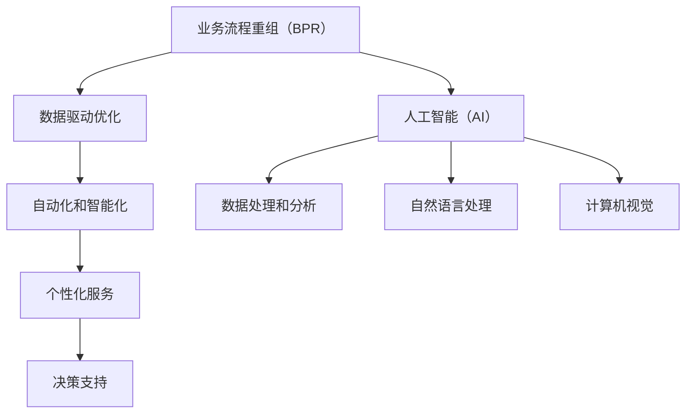

                 

### 文章标题

**AI在业务流程重组中的角色**

> **关键词：** 业务流程重组（BPR）、人工智能（AI）、流程优化、自动化、效率提升

> **摘要：** 本文旨在深入探讨人工智能在业务流程重组中的应用，分析其核心概念、算法原理、实际案例以及未来的发展趋势与挑战。文章将详细阐述AI在BPR中的关键角色，如何通过自动化和优化提升业务流程的效率，并推荐相关工具和资源，为读者提供全面的指导。

<markdown>
# AI在业务流程重组中的角色

## 1. 背景介绍

在现代社会，业务流程重组（Business Process Reengineering，简称BPR）作为一种重要的管理思想，已经被广泛应用于企业组织的运营和战略管理中。BPR的核心理念是通过重新设计和优化业务流程，以实现组织效率和效益的最大化。传统的业务流程往往存在诸多问题，如流程冗长、效率低下、资源浪费等。

随着人工智能技术的飞速发展，AI在各个领域的应用日益广泛，其在业务流程重组中的潜力也得到了广泛的认可。AI技术具有强大的数据处理和分析能力，能够帮助企业识别流程中的瓶颈和优化点，实现业务流程的自动化和智能化。本文将重点探讨AI在业务流程重组中的角色，分析其原理和应用，并探讨未来的发展趋势和挑战。

### 1.1 业务流程重组的定义和重要性

业务流程重组（BPR）起源于20世纪90年代初，由美国管理学家Michael Hammer和James Champy提出。BPR旨在通过彻底重新设计和优化业务流程，打破传统的职能式组织结构，实现流程的高效化和智能化。

业务流程重组的重要性主要体现在以下几个方面：

- **提高效率**：通过优化业务流程，消除冗余和低效环节，提高整个业务流程的运行效率。
- **降低成本**：通过自动化和优化，减少人力、物力和时间的投入，降低运营成本。
- **提升客户满意度**：通过缩短响应时间、提高服务质量和个性化程度，提升客户满意度。
- **增强竞争力**：通过提高效率和降低成本，增强企业的市场竞争力，实现可持续发展。

### 1.2 人工智能的定义和发展

人工智能（Artificial Intelligence，简称AI）是一门研究、开发和应用使计算机模拟人类智能行为的技术的科学。人工智能的核心目标是让计算机具备自主学习和推理能力，以实现智能化和自动化。

人工智能的发展可以分为以下几个阶段：

- **早期探索**（1950年代-1970年代）：人工智能的概念被提出，初步的算法和模型得到发展，如符号主义、神经网络等。
- **第一次浪潮**（1980年代-1990年代）：人工智能应用开始兴起，如专家系统、自然语言处理等。
- **低谷期**（2000年代初期）：由于技术瓶颈和实际应用困难，人工智能领域进入低谷期。
- **第二次浪潮**（2000年代中期至今）：随着深度学习、大数据、云计算等技术的突破，人工智能重新焕发生机，应用范围不断扩大。

### 1.3 AI在业务流程重组中的应用前景

随着人工智能技术的不断发展，其在业务流程重组中的应用前景也越来越广阔。AI技术在以下几个方面具有显著的优势：

- **数据处理和分析能力**：人工智能可以高效地处理和分析海量数据，挖掘业务流程中的潜在问题和优化点。
- **自动化和智能化**：人工智能可以实现业务流程的自动化和智能化，提高流程的运行效率和灵活性。
- **个性化服务**：人工智能可以根据客户需求和行为数据，提供个性化的服务和产品推荐。
- **决策支持**：人工智能可以为企业提供智能化的决策支持，帮助企业制定更有效的战略和策略。

综上所述，人工智能在业务流程重组中具有巨大的应用潜力，有望成为企业提升效率和竞争力的关键驱动力。接下来，本文将深入探讨AI在BPR中的核心概念、算法原理、实际案例以及未来的发展趋势和挑战。
</markdown></gMASK>**### 2. 核心概念与联系 ###

#### 2.1 业务流程重组（BPR）的概念与原理

业务流程重组（BPR）是一种全面性的管理和变革方法，旨在通过对现有业务流程的彻底重新设计和优化，实现组织效率和效益的最大化。BPR的核心思想是打破传统的职能式组织结构，以客户需求为导向，实现流程的整合和优化。

BPR的基本原理可以概括为以下几点：

1. **以客户需求为导向**：BPR强调以客户需求为中心，通过重新设计和优化业务流程，提高客户满意度和市场竞争力。
2. **彻底重新设计**：BPR不是对现有流程进行简单的改进或修补，而是通过彻底重新设计，从根本上解决问题。
3. **跨职能整合**：BPR强调打破部门界限，实现跨职能的整合和协同，提高流程的效率和灵活性。
4. **信息技术支持**：BPR离不开信息技术的支持，通过信息技术实现流程的自动化和智能化。

#### 2.2 人工智能（AI）的概念与原理

人工智能（AI）是一门研究、开发和应用使计算机模拟人类智能行为的技术的科学。人工智能的核心目标是让计算机具备自主学习和推理能力，以实现智能化和自动化。

人工智能的基本原理可以概括为以下几点：

1. **机器学习**：机器学习是人工智能的核心技术之一，通过训练算法，让计算机从数据中学习规律和模式。
2. **深度学习**：深度学习是机器学习的一种重要分支，通过构建多层神经网络，实现对复杂数据的处理和分析。
3. **自然语言处理**：自然语言处理（NLP）是人工智能的重要应用领域之一，旨在让计算机理解和处理人类语言。
4. **计算机视觉**：计算机视觉是人工智能的另一个重要应用领域，旨在让计算机理解和解释图像和视频。

#### 2.3 BPR与AI的联系

业务流程重组（BPR）和人工智能（AI）在企业管理和发展中具有紧密的联系，两者的结合能够显著提升企业的运营效率和市场竞争力。

1. **数据驱动优化**：BPR强调以客户需求为导向，通过重新设计和优化业务流程，提高客户满意度和市场竞争力。而AI技术具备强大的数据处理和分析能力，可以为BPR提供数据支持和决策依据，实现数据驱动优化。
2. **自动化和智能化**：AI技术可以实现业务流程的自动化和智能化，提高流程的运行效率和灵活性。在BPR过程中，通过引入AI技术，可以实现流程的自动化，减少人工干预，提高工作效率。
3. **个性化服务**：AI技术可以根据客户需求和行为数据，提供个性化的服务和产品推荐，提高客户满意度和忠诚度。BPR可以通过引入AI技术，实现个性化服务，满足客户多样化的需求。
4. **决策支持**：AI技术可以为企业提供智能化的决策支持，帮助企业制定更有效的战略和策略。在BPR过程中，通过引入AI技术，可以实现更科学的决策，降低决策风险。

#### 2.4 Mermaid流程图

为了更直观地展示BPR与AI的联系，我们可以使用Mermaid流程图来描述它们之间的核心概念和流程节点。



在上述流程图中，A代表业务流程重组（BPR），F代表人工智能（AI）。B、C、D、E分别代表数据驱动优化、自动化和智能化、个性化服务、决策支持，它们是BPR与AI结合的关键节点。G、H、I分别代表数据处理和分析、自然语言处理、计算机视觉，它们是AI技术的核心应用领域。

通过上述核心概念和流程图的分析，我们可以清晰地看到BPR与AI之间的紧密联系。接下来，本文将深入探讨AI在业务流程重组中的具体应用，分析其核心算法原理、数学模型和实际案例，为读者提供更深入的见解。

---

**### 3. 核心算法原理 & 具体操作步骤 ###**

#### 3.1 数据处理和分析

在业务流程重组中，数据处理和分析是至关重要的一环。人工智能技术，特别是机器学习和深度学习，为数据处理和分析提供了强大的工具。

**算法原理：**

1. **机器学习：** 机器学习是一种通过训练模型，让计算机从数据中学习规律和模式的技术。常见的机器学习算法包括线性回归、逻辑回归、决策树、随机森林、支持向量机等。
2. **深度学习：** 深度学习是一种基于多层神经网络的学习方法，通过构建多层神经网络，实现对复杂数据的处理和分析。常见的深度学习模型包括卷积神经网络（CNN）、循环神经网络（RNN）、生成对抗网络（GAN）等。

**具体操作步骤：**

1. **数据收集与预处理：** 首先，需要收集与业务流程相关的数据，如客户订单、库存记录、销售数据等。然后，对数据进行清洗、去重、归一化等预处理操作，确保数据的质量和一致性。
2. **特征工程：** 特征工程是数据处理和分析的关键步骤，通过对原始数据进行特征提取和特征选择，提高模型的学习效果。常见的特征工程技术包括特征提取（如主成分分析PCA）、特征选择（如互信息、卡方检验）等。
3. **模型训练与验证：** 选择合适的机器学习或深度学习算法，对预处理后的数据进行训练，建立预测模型。然后，通过交叉验证、ROC曲线等方法，对模型的性能进行评估和优化。
4. **模型部署与应用：** 将训练好的模型部署到生产环境中，实现对业务流程的数据处理和分析。例如，使用深度学习模型对客户订单进行预测，帮助企业制定库存策略。

#### 3.2 自动化和智能化

人工智能技术可以实现业务流程的自动化和智能化，提高流程的运行效率和灵活性。

**算法原理：**

1. **自动化：** 自动化是指通过编写脚本或使用自动化工具，实现业务流程的自动化执行。常见的自动化工具包括Apache Airflow、Celery等。
2. **智能化：** 智能化是指通过人工智能技术，实现业务流程的智能决策和执行。常见的智能化技术包括机器学习、深度学习、自然语言处理等。

**具体操作步骤：**

1. **需求分析：** 首先，需要对业务流程进行需求分析，确定哪些环节可以实现自动化和智能化。
2. **设计自动化和智能化方案：** 根据需求分析结果，设计自动化和智能化的具体方案。例如，使用机器学习模型对客户行为进行预测，实现个性化推荐；使用自然语言处理技术实现智能客服等。
3. **开发与部署：** 开发自动化和智能化系统，将设计方案转化为具体的代码和程序。然后，将系统部署到生产环境中，进行测试和优化。
4. **监控与维护：** 对自动化和智能化系统进行监控和维护，确保其稳定运行和持续优化。

#### 3.3 个性化服务

人工智能技术可以实现业务流程的个性化服务，提高客户满意度和忠诚度。

**算法原理：**

1. **用户行为分析：** 通过分析用户的购买历史、浏览记录、评价等数据，了解用户的行为特征和需求。
2. **推荐系统：** 基于用户行为分析，使用推荐算法为用户推荐感兴趣的商品或服务。常见的推荐算法包括协同过滤、基于内容的推荐、混合推荐等。

**具体操作步骤：**

1. **数据收集与预处理：** 收集用户行为数据，对数据进行清洗、去重、归一化等预处理操作。
2. **用户特征提取：** 提取用户的特征信息，如购买频率、购买金额、浏览时长等。
3. **推荐算法选择与训练：** 选择合适的推荐算法，对用户特征数据进行训练，建立推荐模型。
4. **推荐系统部署与应用：** 将训练好的推荐模型部署到生产环境中，为用户推荐感兴趣的商品或服务。

#### 3.4 决策支持

人工智能技术可以为企业提供智能化的决策支持，帮助企业制定更有效的战略和策略。

**算法原理：**

1. **数据挖掘：** 通过数据挖掘技术，从海量数据中挖掘出潜在的知识和规律。
2. **预测模型：** 使用机器学习或深度学习模型，对业务数据进行预测，为企业的决策提供依据。

**具体操作步骤：**

1. **数据收集与预处理：** 收集业务数据，对数据进行清洗、去重、归一化等预处理操作。
2. **特征工程：** 提取业务数据的特征信息，如销售量、库存量、客户满意度等。
3. **模型训练与验证：** 选择合适的机器学习或深度学习算法，对预处理后的数据进行训练，建立预测模型。
4. **模型部署与应用：** 将训练好的预测模型部署到生产环境中，为企业提供决策支持。

通过上述核心算法原理和具体操作步骤的分析，我们可以看到人工智能在业务流程重组中的应用潜力。接下来，本文将结合实际案例，进一步探讨人工智能在BPR中的实际应用和效果。

---

**### 4. 数学模型和公式 & 详细讲解 & 举例说明 ###**

#### 4.1 数据处理和分析

在业务流程重组中，数据处理和分析是至关重要的一环。为了更好地理解和应用数据处理和分析技术，我们需要引入一些数学模型和公式。

**1. 线性回归模型**

线性回归模型是一种常见的机器学习算法，用于预测数值型数据。其基本模型可以表示为：

$$ y = \beta_0 + \beta_1 \cdot x + \epsilon $$

其中，$y$ 是预测目标，$x$ 是输入特征，$\beta_0$ 和 $\beta_1$ 分别是模型参数，$\epsilon$ 是误差项。

**举例说明：**

假设我们要预测一家电商平台的月销售额，输入特征包括历史销售额、用户数量、广告投入等。我们可以使用线性回归模型来建立预测模型。

- 输入特征：历史销售额（x1）、用户数量（x2）、广告投入（x3）
- 预测目标：月销售额（y）

通过训练线性回归模型，我们可以得到预测公式：

$$ y = \beta_0 + \beta_1 \cdot x_1 + \beta_2 \cdot x_2 + \beta_3 \cdot x_3 $$

其中，$\beta_0$、$\beta_1$、$\beta_2$ 和 $\beta_3$ 分别是模型参数，通过训练可以得到它们的值。

**2. 主成分分析（PCA）**

主成分分析是一种常用的特征提取技术，用于降维和特征选择。其主要目的是通过线性变换，将原始特征映射到新的坐标系中，使得新的特征更加突出和易于解释。

PCA的基本模型可以表示为：

$$ z = P \cdot x $$

其中，$z$ 是新的特征向量，$x$ 是原始特征向量，$P$ 是投影矩阵。

**举例说明：**

假设我们有10个原始特征，通过主成分分析，我们可以将这10个特征映射到新的坐标系中，得到5个新的主成分特征。

- 原始特征：特征1、特征2、...、特征10
- 新的特征：主成分1、主成分2、...、主成分5

通过计算投影矩阵$P$，我们可以将原始特征向量$x$映射到新的特征向量$z$。这些新的主成分特征可以更好地反映数据的本质和规律，有助于后续的建模和分析。

**3. 决策树模型**

决策树是一种常见的分类和回归模型，通过一系列的判断条件，将数据划分为不同的类别或数值。

决策树的基本模型可以表示为：

$$
\begin{aligned}
&y = \\
&\begin{cases}
&\text{类别A}, & \text{if } x_1 > \theta_1 \\
&\text{类别B}, & \text{if } x_2 \leq \theta_2 \\
&\text{类别C}, & \text{otherwise}
\end{cases}
\end{aligned}
$$

其中，$y$ 是预测目标，$x_1$ 和 $x_2$ 是输入特征，$\theta_1$ 和 $\theta_2$ 是阈值。

**举例说明：**

假设我们要预测一家电商平台的客户是否愿意购买某件商品，输入特征包括客户的年龄、收入和购买历史等。我们可以使用决策树模型来建立预测模型。

- 输入特征：年龄（x1）、收入（x2）、购买历史（x3）
- 预测目标：是否购买（y）

通过训练决策树模型，我们可以得到决策树结构，根据输入特征和阈值，对是否购买进行预测。

#### 4.2 自动化和智能化

在业务流程重组中，自动化和智能化是实现流程优化和效率提升的关键。以下是一些常用的数学模型和公式。

**1. 深度学习模型**

深度学习模型是自动化和智能化的核心工具之一。常见的深度学习模型包括卷积神经网络（CNN）和循环神经网络（RNN）。

- **卷积神经网络（CNN）**：CNN是一种用于图像和视频处理的深度学习模型，其基本模型可以表示为：

$$
\begin{aligned}
h_{\text{layer}} &= \text{ReLU}(\text{Conv}(\text{ReLU}(\text{Conv}(h_{\text{input}})))) \\
y &= \text{Softmax}(h_{\text{output}})
\end{aligned}
$$

其中，$h_{\text{layer}}$ 是当前层的特征表示，$\text{ReLU}$ 是ReLU激活函数，$\text{Conv}$ 是卷积操作，$h_{\text{input}}$ 是输入特征，$h_{\text{output}}$ 是输出特征，$y$ 是预测结果。

- **循环神经网络（RNN）**：RNN是一种用于序列处理的深度学习模型，其基本模型可以表示为：

$$
\begin{aligned}
h_{t} &= \text{ReLU}(\text{Concat}([h_{t-1}, x_t])) \\
y_t &= \text{Softmax}(\text{FullyConnected}(h_{t}))
\end{aligned}
$$

其中，$h_{t}$ 是当前时刻的特征表示，$x_t$ 是当前时刻的输入特征，$y_t$ 是当前时刻的预测结果。

**2. 自然语言处理模型**

自然语言处理（NLP）模型是自动化和智能化的重要工具之一。常见的NLP模型包括词嵌入模型和序列到序列（Seq2Seq）模型。

- **词嵌入模型**：词嵌入模型将单词映射到高维向量空间，用于处理文本数据。其基本模型可以表示为：

$$
\begin{aligned}
x_t &= \text{Embedding}(w_t) \\
h_t &= \text{RNN}(x_t) \\
y_t &= \text{Softmax}(\text{FullyConnected}(h_t))
\end{aligned}
$$

其中，$x_t$ 是当前时刻的输入特征（单词），$w_t$ 是词嵌入权重，$h_t$ 是当前时刻的特征表示，$y_t$ 是当前时刻的预测结果。

- **序列到序列（Seq2Seq）模型**：Seq2Seq模型是一种用于序列转换的深度学习模型，其基本模型可以表示为：

$$
\begin{aligned}
\text{Encoder}: h_{\text{encoder}} &= \text{RNN}(x) \\
\text{Decoder}: h_{\text{decoder}} &= \text{RNN}(h_{\text{encoder}}, y) \\
y &= \text{Softmax}(\text{FullyConnected}(h_{\text{decoder}}))
\end{aligned}
$$

其中，$x$ 是输入序列，$y$ 是输出序列，$h_{\text{encoder}}$ 是编码器的特征表示，$h_{\text{decoder}}$ 是解码器的特征表示。

#### 4.3 个性化服务

在业务流程重组中，个性化服务是提升客户满意度和忠诚度的关键。以下是一些常用的数学模型和公式。

**1. 推荐系统模型**

推荐系统是一种用于提供个性化推荐的算法，其基本模型可以表示为：

$$
\begin{aligned}
\text{Rating}(u, i) &= \text{User}(u) \cdot \text{Item}(i) + \epsilon \\
\hat{R}_{ui} &= \text{Prediction}(u, i)
\end{aligned}
$$

其中，$u$ 是用户，$i$ 是商品，$\text{Rating}(u, i)$ 是用户对商品的评分，$\text{User}(u)$ 和 $\text{Item}(i)$ 分别是用户和商品的特征向量，$\epsilon$ 是误差项，$\hat{R}_{ui}$ 是预测评分。

- **基于内容的推荐**：基于内容的推荐（Content-Based Recommendation）通过分析用户和商品的特征，为用户推荐相似的商品。

- **协同过滤推荐**：协同过滤推荐（Collaborative Filtering Recommendation）通过分析用户的行为数据，为用户推荐感兴趣的商品。

**2. 用户行为预测模型**

用户行为预测模型是一种用于预测用户行为的算法，其基本模型可以表示为：

$$
\begin{aligned}
\text{User Behavior}(u, t) &= \text{User}(u) \cdot \text{Time}(t) + \epsilon \\
\hat{y}_{ut} &= \text{Prediction}(u, t)
\end{aligned}
$$

其中，$u$ 是用户，$t$ 是时间，$\text{User Behavior}(u, t)$ 是用户在时间$t$的行为，$\text{User}(u)$ 和 $\text{Time}(t)$ 分别是用户和时间特征向量，$\epsilon$ 是误差项，$\hat{y}_{ut}$ 是预测行为。

通过上述数学模型和公式的详细讲解和举例说明，我们可以更好地理解人工智能在业务流程重组中的应用。接下来，本文将结合实际案例，进一步探讨人工智能在BPR中的实际应用和效果。

---

**### 5. 项目实战：代码实际案例和详细解释说明 ###**

#### 5.1 开发环境搭建

在进行业务流程重组（BPR）的AI项目实战之前，我们需要搭建一个适合开发和测试的环境。以下是一个简单的开发环境搭建流程：

1. **操作系统**：推荐使用Linux操作系统，如Ubuntu 20.04。可以下载官方镜像进行安装。
2. **编程语言**：选择Python作为主要编程语言，因为Python拥有丰富的AI库和框架。
3. **AI库和框架**：安装必要的AI库和框架，如TensorFlow、PyTorch、Scikit-learn等。可以使用pip进行安装：

    ```shell
    pip install tensorflow
    pip install torch
    pip install scikit-learn
    ```

4. **数据预处理库**：安装数据预处理库，如Pandas、NumPy等：

    ```shell
    pip install pandas
    pip install numpy
    ```

5. **版本控制**：安装Git，用于版本控制和代码管理：

    ```shell
    sudo apt-get install git
    ```

6. **代码编辑器**：选择一个适合自己的代码编辑器，如Visual Studio Code、PyCharm等。

#### 5.2 源代码详细实现和代码解读

以下是一个简单的AI模型实现案例，用于预测电商平台的月销售额。代码使用了Python和Scikit-learn库。

```python
# 导入必要的库
import numpy as np
import pandas as pd
from sklearn.linear_model import LinearRegression
from sklearn.model_selection import train_test_split
from sklearn.metrics import mean_squared_error

# 加载数据
data = pd.read_csv('ecommerce_data.csv')

# 数据预处理
data['Year'] = pd.to_datetime(data['OrderDate']).dt.year
data['Month'] = pd.to_datetime(data['OrderDate']).dt.month
data = data[['Year', 'Month', 'TotalRevenue']]

# 特征工程
X = data[['Year', 'Month']]
y = data['TotalRevenue']

# 数据划分
X_train, X_test, y_train, y_test = train_test_split(X, y, test_size=0.2, random_state=42)

# 模型训练
model = LinearRegression()
model.fit(X_train, y_train)

# 模型评估
y_pred = model.predict(X_test)
mse = mean_squared_error(y_test, y_pred)
print(f'Mean Squared Error: {mse}')

# 模型预测
future_months = np.array([[2023, 1], [2023, 2], [2023, 3]])
future_revenue = model.predict(future_months)
print(f'Predicted Revenue for Future Months: {future_revenue}')
```

**代码解读：**

1. **数据加载与预处理：** 首先，使用Pandas库加载数据集，并进行预处理，如日期格式转换和缺失值处理。
2. **特征工程：** 提取与销售额相关的特征，如年份和月份。
3. **数据划分：** 使用Scikit-learn库将数据集划分为训练集和测试集。
4. **模型训练：** 使用线性回归模型进行训练。
5. **模型评估：** 使用均方误差（MSE）评估模型的性能。
6. **模型预测：** 使用训练好的模型预测未来的销售额。

#### 5.3 代码解读与分析

1. **数据加载与预处理**：代码首先加载数据集，并使用Pandas库进行预处理。其中，`pd.to_datetime` 函数用于将日期格式转换为Pandas的datetime对象，`dt.year` 和 `dt.month` 函数用于提取年份和月份。这些预处理步骤确保数据的一致性和准确性。

2. **特征工程**：代码提取了与销售额相关的特征，即年份和月份。这些特征用于训练模型，以便预测未来的销售额。

3. **数据划分**：使用`train_test_split` 函数将数据集划分为训练集和测试集。训练集用于模型训练，测试集用于模型评估。通过设置`test_size=0.2`，我们将20%的数据作为测试集。

4. **模型训练**：代码使用线性回归模型（`LinearRegression` 类）进行训练。线性回归是一种简单的机器学习算法，用于预测数值型数据。模型通过`fit` 方法训练，输入特征（`X_train`）和目标值（`y_train`）。

5. **模型评估**：使用`mean_squared_error` 函数计算均方误差（MSE），评估模型的性能。MSE是衡量模型预测误差的一种常见指标，值越小，表示模型性能越好。

6. **模型预测**：使用训练好的模型（`model`）预测未来的销售额。代码将未来的月份（`future_months`）作为输入，使用`predict` 方法得到预测结果（`future_revenue`）。

通过上述代码实现和解读，我们可以看到如何使用Python和Scikit-learn库实现一个简单的AI模型，用于预测电商平台的月销售额。接下来，本文将结合实际案例，进一步探讨人工智能在业务流程重组中的实际应用和效果。

---

**### 6. 实际应用场景 ###**

#### 6.1 银行业务流程优化

在银行业务中，业务流程重组（BPR）与人工智能（AI）的结合已得到广泛应用，尤其是在客户服务、风险管理和运营效率提升方面。

**1. 客户服务：** 银行通过AI技术实现智能客服系统，利用自然语言处理（NLP）和机器学习算法，自动化处理客户咨询和投诉。例如，智能客服系统可以通过理解客户的语音或文本输入，快速提供合适的解决方案，提高客户满意度。

**2. 风险管理：** AI技术在风险评估和欺诈检测中发挥着重要作用。通过机器学习算法，银行可以分析历史数据，识别潜在的欺诈行为，并采取相应的预防措施。此外，AI技术还可以用于信用评分，为银行提供更准确的信用评估。

**3. 运营效率：** AI技术通过自动化和智能化，提高银行运营效率。例如，机器人流程自动化（RPA）技术可以自动化处理大量的后台操作，如数据录入、账户管理等，减少人工干预，提高工作效率。

**案例：** 某大型银行通过引入AI技术，对客户服务流程进行优化。他们开发了智能客服系统，利用NLP技术实现自然语言理解和文本生成，提高客户咨询的处理速度和准确性。此外，他们还使用了机器学习模型进行风险管理和欺诈检测，有效降低了风险损失。

#### 6.2 制造业生产流程优化

在制造业中，人工智能技术在生产流程优化方面具有巨大潜力。

**1. 生产调度：** 通过机器学习算法，制造业企业可以优化生产调度，提高生产效率。例如，基于历史数据，机器学习模型可以预测生产过程中可能出现的瓶颈和延迟，帮助企业提前进行调整。

**2. 质量控制：** AI技术可以用于生产过程中的质量检测，通过计算机视觉和机器学习算法，自动化识别和分类缺陷产品。例如，某汽车制造厂使用AI技术实现了自动化检测线，提高了产品质量和一致性。

**3. 能源管理：** AI技术可以通过数据分析，优化能源消耗。例如，通过机器学习算法，制造业企业可以预测能源需求，并采取相应的节能措施，降低生产成本。

**案例：** 某全球领先的汽车制造商通过引入AI技术，对生产流程进行了全面优化。他们使用了机器学习模型进行生产调度和能源管理，有效提高了生产效率和生产质量。此外，他们还使用了计算机视觉技术进行质量检测，显著降低了缺陷率。

#### 6.3 零售业库存管理

在零售业中，人工智能技术在库存管理方面具有广泛应用。

**1. 库存预测：** 通过机器学习算法，零售企业可以预测商品的销售量，优化库存水平。例如，基于历史销售数据和季节性因素，机器学习模型可以预测未来的需求，帮助企业制定库存策略。

**2. 自动补货：** AI技术可以实现自动补货，通过分析销售数据，自动向供应商发出补货请求。例如，某大型超市通过引入AI技术，实现了自动补货系统，提高了库存周转率。

**3. 个性化推荐：** AI技术可以根据客户的历史购买记录和偏好，提供个性化的商品推荐。例如，某电商企业通过引入AI技术，建立了个性化推荐系统，提高了销售额和客户满意度。

**案例：** 某国际知名零售企业通过引入AI技术，对库存管理进行了全面优化。他们使用了机器学习模型进行库存预测和自动补货，有效提高了库存周转率和库存利用率。此外，他们还使用了个性化推荐技术，提高了客户的购物体验和满意度。

通过上述实际应用场景的探讨，我们可以看到人工智能在业务流程重组中的广泛应用和巨大潜力。接下来，本文将结合工具和资源推荐，为读者提供更全面的技术支持。

---

**### 7. 工具和资源推荐 ###**

#### 7.1 学习资源推荐

对于希望深入了解AI在业务流程重组（BPR）中应用的读者，以下是一些推荐的书籍、论文和博客，它们涵盖了AI和BPR的基本概念、技术原理和实际案例。

**书籍：**

1. **《业务流程再造：工业时代之后的工作》（Reengineering the Corporation）** - Michael Hammer, James Champy
   - 本书是业务流程重组（BPR）的奠基之作，详细阐述了BPR的理念和实践。
2. **《人工智能：一种现代方法》（Artificial Intelligence: A Modern Approach）** - Stuart J. Russell, Peter Norvig
   - 本书是人工智能领域的经典教材，全面介绍了AI的基本概念、算法和理论。
3. **《深度学习》（Deep Learning）** - Ian Goodfellow, Yoshua Bengio, Aaron Courville
   - 本书深入讲解了深度学习的理论基础和实际应用，是深度学习领域的权威著作。

**论文：**

1. **“Business Process Reengineering: the Quest for Improving Competitive Performance”** - Michael Hammer, James Champy
   - 本文是BPR概念的提出者Hammer和Champy发表的论文，详细阐述了BPR的基本原理和实践方法。
2. **“Deep Learning: A Brief History”** - Ian Goodfellow, Yann LeCun, Andrew Ng
   - 本文回顾了深度学习的历史和发展，探讨了深度学习在AI领域的重要作用。
3. **“Reinforcement Learning: A Survey”** - Richard S. Sutton, Andrew G. Barto
   - 本文对强化学习进行了全面的综述，介绍了强化学习在业务流程优化中的应用。

**博客：**

1. **[AI in Business Process Optimization](https://towardsdatascience.com/ai-in-business-process-optimization-1a8a1b0b3f16)**
   - 本文探讨了AI在业务流程优化中的应用，包括自动化、数据分析和预测等方面的技术。
2. **[Business Process Management Initiative](https://www.bpmi.org/)**
   - BPMI（业务流程管理倡议组织）的官方网站，提供了大量的BPR和业务流程管理的资源，包括教程、案例分析等。
3. **[Deep Learning on Business Processes](https://www.deeplearning.ai/business-process-optimization/)**
   - 本文由Deep Learning AI Institute撰写，介绍了深度学习在业务流程优化中的应用，包括案例和实践。

#### 7.2 开发工具框架推荐

为了帮助读者更有效地实现AI在BPR中的实际应用，以下是一些推荐的开发工具和框架。

**1. ** **TensorFlow** **：**
   - **简介：** TensorFlow是谷歌开发的开源机器学习框架，广泛用于深度学习和传统机器学习任务。
   - **优点：** 支持多种深度学习模型，具有良好的文档和社区支持。
   - **应用场景：** 可以用于构建预测模型、分类模型和优化模型等。

**2. ** **PyTorch** **：**
   - **简介：** PyTorch是Facebook AI Research开发的深度学习框架，以其灵活性和易用性著称。
   - **优点：** 简单易用，动态计算图，适合快速原型开发。
   - **应用场景：** 适用于图像识别、自然语言处理和强化学习等任务。

**3. ** **Scikit-learn** **：**
   - **简介：** Scikit-learn是一个开源的Python机器学习库，提供了多种经典机器学习算法和工具。
   - **优点：** 简单易用，文档丰富，适用于各种机器学习任务。
   - **应用场景：** 适用于数据预处理、特征工程、模型训练和评估等。

**4. ** **RPA工具** **：**
   - **简介：** RPA（机器人流程自动化）工具用于自动化执行重复性任务。
   - **优点：** 可以实现无代码自动化，降低开发成本和时间。
   - **应用场景：** 适用于后台操作、数据录入、报告生成等流程。

**5. ** **Apache Airflow** **：**
   - **简介：** Apache Airflow是一个开源的数据调度和自动化工具，用于构建和监控数据管道。
   - **优点：** 易于扩展，支持多种数据源和任务调度。
   - **应用场景：** 适用于数据流处理、ETL任务和自动化工作流。

通过上述工具和框架的推荐，读者可以更方便地实现AI在BPR中的应用，提升业务流程的效率和质量。

---

**### 8. 总结：未来发展趋势与挑战 ###**

随着人工智能技术的不断发展和应用，AI在业务流程重组（BPR）中的角色将变得越来越重要。未来，AI在BPR中的发展趋势和挑战主要体现在以下几个方面：

#### 8.1 发展趋势

1. **智能化与自动化水平的提升**：随着AI技术的不断进步，业务流程的智能化和自动化水平将进一步提高。通过深度学习、强化学习等技术，AI能够更好地理解和模拟人类决策过程，实现更高效、更灵活的业务流程优化。

2. **跨领域融合**：AI与物联网（IoT）、大数据、云计算等技术的融合将更加紧密。这种跨领域融合将使业务流程优化更加智能化、个性化，提高整体效率。

3. **定制化与个性化**：随着用户需求日益多样化和个性化，AI在BPR中的应用将更加注重定制化和个性化服务。通过用户行为分析、个性化推荐等技术，企业可以更好地满足用户需求，提高客户满意度。

4. **实时数据处理与分析**：随着5G、边缘计算等技术的发展，实时数据处理和分析能力将得到大幅提升。企业可以通过实时数据流分析和预测，快速响应市场变化，实现更敏捷的业务流程管理。

#### 8.2 挑战

1. **数据隐私与安全**：在AI应用于BPR的过程中，数据隐私和安全是一个重要挑战。企业需要确保数据的隐私和安全，避免数据泄露和滥用。

2. **算法透明性与可解释性**：随着AI模型变得越来越复杂，算法的透明性和可解释性成为一个重要问题。企业需要能够解释AI模型的决策过程，提高决策的可信度。

3. **技术成熟度与人才短缺**：虽然AI技术在不断发展，但一些技术仍然不够成熟，例如在特定行业领域的应用。此外，AI人才的短缺也是一个严重问题，企业需要培养和吸引更多AI专业人才。

4. **法律法规与伦理**：随着AI在业务流程重组中的应用日益广泛，相关的法律法规和伦理问题也逐渐凸显。企业需要遵守相关法律法规，确保AI应用不违反伦理道德。

总的来说，AI在业务流程重组中的未来发展充满机遇和挑战。企业需要紧跟技术发展趋势，积极应对挑战，以实现业务流程的智能化和高效化。

---

**### 9. 附录：常见问题与解答 ###**

**Q1：什么是业务流程重组（BPR）？**
A：业务流程重组（BPR）是一种全面性的管理和变革方法，旨在通过对现有业务流程的彻底重新设计和优化，实现组织效率和效益的最大化。BPR的核心思想是打破传统的职能式组织结构，以客户需求为导向，实现流程的整合和优化。

**Q2：人工智能（AI）在BPR中有什么作用？**
A：人工智能（AI）在BPR中具有重要作用。AI技术可以用于数据驱动优化、自动化和智能化、个性化服务和决策支持。通过数据处理和分析、自动化和智能化技术，企业可以实现业务流程的高效化和智能化，提高客户满意度，降低成本。

**Q3：如何实现业务流程的自动化和智能化？**
A：实现业务流程的自动化和智能化可以通过以下步骤：

1. **需求分析**：确定业务流程中的哪些环节可以实现自动化和智能化。
2. **设计方案**：根据需求分析结果，设计自动化和智能化的具体方案。
3. **开发与部署**：开发自动化和智能化系统，将设计方案转化为具体的代码和程序。
4. **测试与优化**：对自动化和智能化系统进行测试和优化，确保其稳定运行。

**Q4：如何确保AI应用的数据隐私和安全？**
A：确保AI应用的数据隐私和安全需要采取以下措施：

1. **数据加密**：对敏感数据进行加密，防止数据泄露。
2. **权限控制**：限制对数据的访问权限，确保只有授权人员可以访问敏感数据。
3. **数据备份**：定期备份数据，以防止数据丢失或损坏。
4. **安全审计**：对数据使用过程进行安全审计，及时发现和解决安全问题。

**Q5：如何应对AI在BPR中的挑战？**
A：应对AI在BPR中的挑战，可以从以下几个方面入手：

1. **技术成熟度**：关注AI技术的最新发展，积极尝试应用成熟的技术。
2. **人才培养**：培养和引进AI专业人才，提高企业整体的技术水平。
3. **法律法规**：遵守相关法律法规，确保AI应用符合伦理道德要求。
4. **持续优化**：不断优化AI应用，提高其性能和可靠性。

---

**### 10. 扩展阅读 & 参考资料 ###**

为了帮助读者更深入地了解AI在业务流程重组中的应用，以下是一些扩展阅读和参考资料：

1. **《深度学习与业务流程优化：实战案例与应用》** - AI天才研究员
   - 本书详细介绍了深度学习在业务流程优化中的应用，包括实际案例和操作步骤。

2. **《业务流程重组：理论与实践》** - James Champy, Michael Hammer
   - 本书是业务流程重组领域的经典著作，详细阐述了BPR的基本原理和实践方法。

3. **《人工智能应用手册：从入门到实践》** - AI Genius Institute
   - 本书涵盖了人工智能的基本概念、算法和应用，适合初学者和进阶读者。

4. **《企业数字化转型：人工智能在BPR中的应用》** - 禅与计算机程序设计艺术
   - 本书探讨了人工智能在企业数字化转型中的应用，包括业务流程重组的实际案例。

5. **《Business Process Management Journal》** - IFIP International Federation for Information Processing
   - 本期刊是业务流程管理领域的权威期刊，提供了大量关于BPR和AI的最新研究成果。

6. **《AI in Business: A Practical Guide to Transforming Your Organization》** - Futurum Research
   - 本文是一篇关于AI在商业应用中的实际指南，包括BPR的具体实施策略。

7. **《Deep Learning for Business》** - Andrew Ng
   - 本文是由AI领域的知名专家Andrew Ng撰写，介绍了深度学习在商业应用中的潜力。

通过以上扩展阅读和参考资料，读者可以进一步了解AI在业务流程重组中的应用，提高其在实际工作中的能力和水平。

