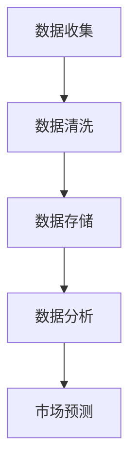
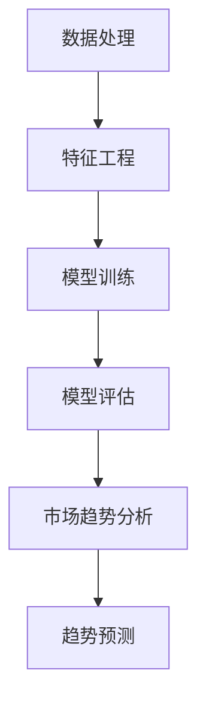
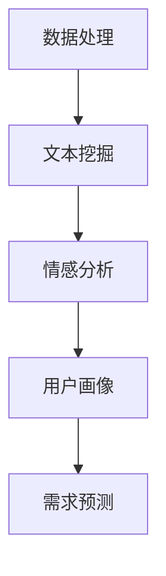
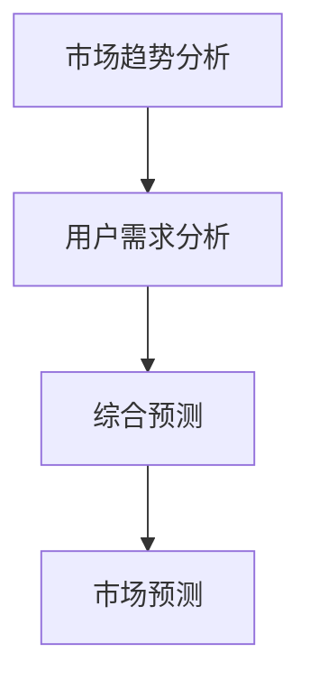
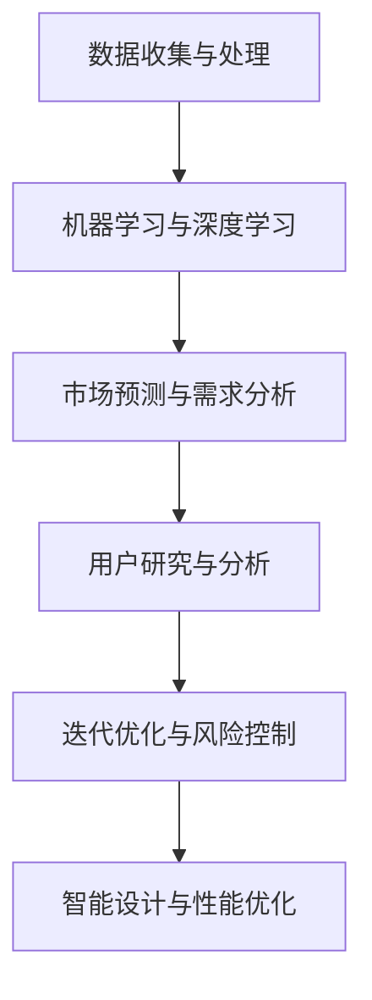

                 

### 背景介绍

随着人工智能（AI）技术的迅猛发展，AI 在各个领域中的应用越来越广泛。从医疗诊断、自动驾驶、金融预测到娱乐推荐，AI 已经成为推动这些领域进步的重要力量。然而，在产品创新过程中，AI 的作用同样不可忽视。

产品创新是一个复杂而动态的过程，它涉及市场调研、需求分析、概念验证、设计开发、测试迭代等多个环节。传统的方法往往依赖于人类专家的经验和直觉，而这种方式不仅效率低下，而且容易受到主观因素的影响。随着 AI 技术的进步，特别是深度学习、自然语言处理、图像识别等技术的突破，AI 开始在产品创新中发挥出巨大的潜力。

AI 在产品创新中的作用主要体现在以下几个方面：

1. **数据分析与市场预测**：通过分析大量数据，AI 能够帮助识别市场趋势和用户需求，从而指导产品方向的制定。

2. **智能设计**：AI 可以自动化设计过程，通过生成设计草图、优化产品结构，提高设计效率和质量。

3. **用户研究**：利用自然语言处理技术，AI 可以理解和分析用户的反馈，提供有针对性的改进建议。

4. **迭代优化**：通过机器学习算法，AI 可以对产品进行持续优化，提高用户体验和产品性能。

5. **风险控制**：AI 可以帮助识别潜在的风险和问题，从而降低产品创新的失败率。

本文将深入探讨 AI 在产品创新过程中的辅助作用，通过具体实例和数据分析，展示 AI 技术如何影响和改变传统的产品创新模式。

关键词：人工智能，产品创新，数据分析，市场预测，智能设计，用户研究，迭代优化，风险控制

摘要：本文通过介绍人工智能在产品创新过程中的应用背景，详细阐述了 AI 在数据分析、市场预测、智能设计、用户研究、迭代优化和风险控制等方面的辅助作用。通过实际案例和数据分析，展示了 AI 技术如何提升产品创新的效率和效果，为未来的产品创新提供新的思路和方向。

-----------------------

## 1. AI 在产品创新过程中的辅助作用

### 1.1 数据分析与市场预测

数据分析是产品创新的重要环节，而 AI 技术在数据分析方面具有显著优势。通过机器学习和深度学习算法，AI 可以从大量数据中提取有价值的信息，从而帮助产品团队更准确地理解市场趋势和用户需求。

首先，AI 可以通过对历史数据的分析，识别出市场的长期趋势和季节性变化。例如，在电商行业，AI 可以分析过去的销售数据，预测未来的销售高峰和低谷，从而帮助产品团队制定合理的库存和营销策略。这样的预测不仅能够提高销售效率，还能减少库存成本和风险。

其次，AI 可以通过分析用户行为数据，洞察用户的需求和偏好。例如，在社交媒体平台上，AI 可以分析用户的评论、点赞和分享行为，识别出用户对特定产品的兴趣点和痛点。这些信息对于产品团队来说是非常宝贵的，它们可以帮助产品团队更好地定位市场，制定更有针对性的产品策略。

此外，AI 还可以预测市场中的潜在机会和风险。通过分析宏观经济数据、行业趋势和政策变化，AI 可以识别出市场中的新机会和潜在威胁。例如，在金融行业中，AI 可以预测市场波动和风险，帮助金融机构制定更加稳健的投资策略。

总的来说，AI 在数据分析与市场预测方面的作用，不仅提高了产品创新的效率，还增强了产品团队对市场的洞察力和决策能力。

### 1.2 智能设计

智能设计是 AI 在产品创新中另一个重要的应用领域。通过自动化和智能化的设计工具，AI 可以大大提高设计效率和质量。

首先，AI 可以通过生成对抗网络（GAN）和深度学习算法，自动化生成设计草图。例如，在建筑设计领域，AI 可以根据用户的需求和偏好，自动生成多种设计方案，从而节省大量设计时间和人力成本。这种方式不仅提高了设计的多样性，还减少了设计师的工作负担。

其次，AI 可以优化产品结构。通过模拟仿真和优化算法，AI 可以找到最佳的产品结构，从而提高产品的性能和可靠性。例如，在航空航天领域，AI 可以优化飞机的结构设计，提高飞机的燃油效率和安全性。

此外，AI 还可以提供实时的设计反馈。通过自然语言处理和计算机视觉技术，AI 可以分析用户对设计草图的反馈，并提供改进建议。例如，在工业产品设计领域，AI 可以分析用户的评论和评分，自动生成改进方案，从而提高产品的用户体验。

总的来说，智能设计不仅提高了产品创新的效率，还提高了产品的设计质量和用户体验。

### 1.3 用户研究

用户研究是产品创新中不可或缺的一环，而 AI 在用户研究方面具有显著的优势。通过自然语言处理和计算机视觉技术，AI 可以自动化地理解和分析用户的反馈，从而提供有针对性的改进建议。

首先，AI 可以通过自然语言处理技术，分析和理解用户的评论和反馈。例如，在电商平台上，AI 可以分析用户的评论，识别出用户对产品的满意度和不满意度，从而帮助产品团队识别出产品的优点和不足。这些信息对于产品团队来说是非常重要的，它们可以帮助产品团队更好地了解用户需求，改进产品设计和功能。

其次，AI 可以通过计算机视觉技术，分析和理解用户的反馈。例如，在游戏设计中，AI 可以分析用户的游戏行为和交互，识别出用户喜欢的游戏元素和设计风格，从而帮助游戏开发者更好地满足用户需求。

此外，AI 还可以提供实时的用户研究数据。通过自动化数据收集和分析工具，AI 可以实时监控用户的反馈和行为，从而提供即时的改进建议。例如，在移动应用开发中，AI 可以分析用户的反馈和使用行为，自动生成改进方案，从而提高用户的满意度和留存率。

总的来说，AI 在用户研究方面的作用，不仅提高了产品创新的效率，还提高了产品的用户体验和用户满意度。

### 1.4 迭代优化

迭代优化是产品创新中的一个关键环节，而 AI 在迭代优化方面具有显著的优势。通过机器学习和深度学习算法，AI 可以自动化地分析产品性能和用户体验，并提供优化建议。

首先，AI 可以通过机器学习算法，分析产品性能数据，识别出性能瓶颈和潜在问题。例如，在软件开发中，AI 可以分析代码和系统日志，识别出影响性能的关键因素，从而帮助开发团队优化代码和系统配置。

其次，AI 可以通过深度学习算法，分析用户体验数据，识别出用户体验不佳的环节。例如，在移动应用开发中，AI 可以分析用户的行为数据，识别出用户使用过程中的障碍和痛点，从而帮助开发团队优化用户体验。

此外，AI 还可以提供实时的优化建议。通过实时数据分析工具，AI 可以实时监控产品性能和用户体验，并提供即时的优化建议。例如，在电商平台上，AI 可以分析用户的浏览和购买行为，实时优化推荐算法，从而提高用户的购买转化率和满意度。

总的来说，AI 在迭代优化方面的作用，不仅提高了产品创新的效率，还提高了产品的性能和用户体验。

### 1.5 风险控制

在产品创新过程中，风险控制是确保项目成功的重要环节。AI 在风险控制方面具有显著的优势，可以自动化地识别和评估潜在风险，从而降低项目失败的概率。

首先，AI 可以通过数据分析技术，识别出潜在的市场风险。例如，在金融产品创新中，AI 可以分析宏观经济数据、行业趋势和政策变化，识别出市场中的潜在风险，从而帮助产品团队制定风险控制策略。

其次，AI 可以通过模拟仿真技术，评估潜在的技术风险。例如，在软件开发中，AI 可以模拟不同的测试场景，评估软件的可靠性和稳定性，从而帮助开发团队提前识别和解决潜在的技术问题。

此外，AI 还可以提供实时的风险预警。通过实时数据分析工具，AI 可以实时监控项目的进展和风险状况，并提供即时的预警和建议。例如，在项目管理中，AI 可以分析项目的关键指标和进度，提前识别出潜在的风险，从而帮助项目经理及时采取应对措施。

总的来说，AI 在风险控制方面的作用，不仅提高了产品创新的效率，还降低了项目失败的风险。

-----------------------

## 1.1 数据分析与市场预测

在产品创新过程中，数据分析与市场预测起着至关重要的作用。通过大数据技术和人工智能算法，AI 能够从海量数据中提取有价值的信息，帮助产品团队做出更明智的决策。

### 数据收集与处理

首先，我们需要明确数据分析的基础：数据收集与处理。数据来源可以包括用户行为数据、市场调研数据、销售数据等。以下是一个简单的 Mermaid 流程图，展示数据收集与处理的流程：



在这个流程中，数据收集是第一步，它包括从多个渠道获取数据，如用户数据库、社交媒体平台、市场调研工具等。接下来，数据清洗是必不可少的环节，目的是去除数据中的噪声和异常值，保证数据的准确性和一致性。

### 市场趋势分析

在数据处理完成后，我们可以利用 AI 算法进行市场趋势分析。以下是一个 Mermaid 流程图，展示市场趋势分析的过程：



在特征工程阶段，我们需要从原始数据中提取出有代表性的特征，这些特征将用于训练机器学习模型。常见的特征包括用户活跃度、购买频率、用户评价等。

接下来，通过机器学习算法（如线性回归、时间序列分析等），我们可以建立市场趋势预测模型。模型的评估标准包括准确率、召回率、F1 值等。

### 用户需求分析

除了市场趋势分析，用户需求分析也是数据分析的重要部分。以下是一个 Mermaid 流程图，展示用户需求分析的过程：



在文本挖掘阶段，我们可以使用自然语言处理（NLP）技术，分析用户在社交媒体、评论区等渠道的反馈，提取出用户的情感和需求。常见的 NLP 算法包括词频分析、主题建模、情感分析等。

通过情感分析，我们可以了解用户对产品的满意度和不满意度，从而为产品改进提供方向。用户画像则是对用户特征和行为的综合描述，包括年龄、性别、职业、兴趣等。

### 模型预测与市场预测

最后，我们将分析结果转化为市场预测。以下是一个 Mermaid 流程图，展示模型预测与市场预测的过程：



通过综合分析市场趋势和用户需求，我们可以做出更准确的预测。市场预测的结果可以用于产品开发、市场营销和资源分配等决策。

总的来说，AI 在数据分析与市场预测中的作用，不仅提高了产品创新的效率，还增强了产品团队对市场的洞察力和决策能力。

-----------------------

## 1.2 核心概念与联系

在探讨 AI 在产品创新过程中的辅助作用时，我们需要深入理解几个核心概念及其相互联系。以下是这些核心概念及其相互关系的 Mermaid 流程图：



### 数据收集与处理

数据收集与处理是 AI 应用的基础。通过从多个渠道（如用户行为、市场调研、销售数据等）收集数据，并利用清洗、整合和标准化技术，我们可以得到高质量的数据集，为后续分析提供可靠的数据基础。

### 机器学习与深度学习

机器学习和深度学习是 AI 的核心技术。通过训练模型，我们可以让机器从数据中自动提取特征，进行模式识别和预测。常见的机器学习算法包括线性回归、逻辑回归、决策树、随机森林等；而深度学习算法则包括卷积神经网络（CNN）、循环神经网络（RNN）、生成对抗网络（GAN）等。

### 市场预测与需求分析

市场预测和需求分析是产品创新的两个关键环节。通过机器学习算法，我们可以预测市场趋势和用户需求，为产品开发提供方向。市场预测可以用于确定产品定位、市场策略等；而需求分析则可以用于了解用户偏好、优化产品设计等。

### 用户研究与分析

用户研究与分析是深入了解用户需求和行为的重要手段。通过自然语言处理（NLP）技术，我们可以分析和理解用户的反馈和评论，提取出用户的情感和需求。用户画像则是对用户特征和行为的综合描述，包括年龄、性别、职业、兴趣等。

### 迭代优化与风险控制

迭代优化和风险控制是确保产品成功的关键。通过迭代优化，我们可以不断改进产品性能和用户体验；而通过风险控制，我们可以识别和应对潜在的风险和问题，降低项目失败的概率。

### 智能设计与性能优化

智能设计和性能优化是产品创新的重要方向。通过自动化和智能化的设计工具，我们可以提高设计效率和质量；而通过模拟仿真和优化算法，我们可以提高产品的性能和可靠性。

总的来说，这些核心概念相互关联，共同构成了 AI 在产品创新过程中的完整生态系统。理解这些概念及其相互联系，有助于我们更好地利用 AI 技术推动产品创新。

-----------------------

## 1.3 核心算法原理 & 具体操作步骤

在深入了解 AI 在产品创新中的辅助作用后，我们需要探讨其中的核心算法原理和具体操作步骤。以下是几个关键的 AI 算法及其应用场景：

### 1.3.1 机器学习算法

#### 原理

机器学习算法是 AI 的基础，其核心思想是通过训练数据集，让计算机从数据中自动提取特征，并建立预测模型。常见的机器学习算法包括：

- **线性回归**：通过拟合线性关系来预测目标变量。
- **逻辑回归**：用于分类问题，通过拟合概率分布来预测分类结果。
- **决策树**：通过构建树形结构来模拟决策过程。
- **随机森林**：通过组合多个决策树来提高预测性能。

#### 操作步骤

1. **数据收集与预处理**：收集相关数据，并进行数据清洗、整合和标准化。
2. **特征工程**：从原始数据中提取有代表性的特征，以提高模型的预测能力。
3. **模型选择**：选择合适的机器学习算法，如线性回归、逻辑回归、决策树等。
4. **模型训练**：使用训练数据集训练模型，调整模型参数。
5. **模型评估**：使用验证数据集评估模型性能，如准确率、召回率、F1 值等。
6. **模型部署**：将训练好的模型部署到实际应用场景中，如市场预测、需求分析等。

### 1.3.2 深度学习算法

#### 原理

深度学习算法是机器学习的一种，其核心思想是通过多层神经网络来模拟人脑的学习过程。常见的深度学习算法包括：

- **卷积神经网络（CNN）**：用于图像识别、图像分类等任务。
- **循环神经网络（RNN）**：用于序列数据处理，如时间序列分析、自然语言处理等。
- **生成对抗网络（GAN）**：用于生成新数据、图像生成等任务。

#### 操作步骤

1. **数据收集与预处理**：与机器学习算法相同，收集相关数据并进行预处理。
2. **网络架构设计**：设计合适的神经网络架构，如 CNN、RNN 等。
3. **模型训练**：使用训练数据集训练模型，调整网络权重和参数。
4. **模型评估**：使用验证数据集评估模型性能，如准确率、损失函数等。
5. **模型部署**：将训练好的模型部署到实际应用场景中，如图像识别、语音识别等。

### 1.3.3 自然语言处理（NLP）算法

#### 原理

自然语言处理算法是用于处理和分析自然语言的 AI 算法，其核心思想是通过语言模型和语义分析来理解和生成自然语言。常见的 NLP 算法包括：

- **词频分析**：通过统计词频来分析文本。
- **主题建模**：通过概率模型来发现文本的主题。
- **情感分析**：通过分类模型来分析文本的情感倾向。
- **问答系统**：通过对话系统来回答用户的问题。

#### 操作步骤

1. **数据收集与预处理**：收集相关文本数据，并进行预处理，如分词、去停用词等。
2. **特征提取**：从文本中提取特征，如词袋模型、词嵌入等。
3. **模型选择**：选择合适的 NLP 模型，如朴素贝叶斯、SVM、深度学习等。
4. **模型训练**：使用训练数据集训练模型。
5. **模型评估**：使用验证数据集评估模型性能，如准确率、召回率、F1 值等。
6. **模型部署**：将训练好的模型部署到实际应用场景中，如文本分类、情感分析等。

总的来说，这些核心算法原理和具体操作步骤构成了 AI 在产品创新中的技术基础。通过理解和应用这些算法，我们可以实现数据驱动的产品创新，提高产品开发的效率和质量。

-----------------------

## 1.4 数学模型和公式 & 详细讲解 & 举例说明

在产品创新过程中，数学模型和公式是核心算法的基础，它们帮助 AI 技术从数据中提取信息、进行预测和优化。以下是几个关键数学模型和公式的详细讲解及实际应用举例。

### 1.4.1 逻辑回归模型

逻辑回归是一种常用的统计方法，用于分类问题。其公式如下：

$$
\hat{y} = \frac{1}{1 + e^{-(\beta_0 + \beta_1 x_1 + \beta_2 x_2 + \ldots + \beta_n x_n})}
$$

其中，\( y \) 是实际分类结果，\( \hat{y} \) 是预测概率，\( \beta_0, \beta_1, \beta_2, \ldots, \beta_n \) 是模型参数，\( x_1, x_2, \ldots, x_n \) 是输入特征。

#### 举例说明

假设我们想要预测一个电商平台的用户是否会在未来30天内购买某产品。输入特征包括用户的年龄、收入、购买历史等。通过逻辑回归模型，我们可以计算每个用户的购买概率，从而为营销团队提供决策依据。

例如，对于用户 A（年龄 25，收入 5000，购买历史频繁），模型预测概率为：

$$
\hat{y} = \frac{1}{1 + e^{-(\beta_0 + \beta_1 \cdot 25 + \beta_2 \cdot 5000 + \beta_3 \cdot 3)}}
$$

通过训练数据和优化模型参数，我们可以得到更准确的预测结果。

### 1.4.2 代价函数

在机器学习模型训练过程中，代价函数用于衡量模型预测误差。常见的代价函数包括均方误差（MSE）和交叉熵损失（Cross-Entropy Loss）。

- **均方误差（MSE）**：

$$
MSE = \frac{1}{m} \sum_{i=1}^{m} (y_i - \hat{y}_i)^2
$$

其中，\( m \) 是样本数量，\( y_i \) 是实际标签，\( \hat{y}_i \) 是模型预测值。

- **交叉熵损失（Cross-Entropy Loss）**：

$$
Cross-Entropy Loss = -\frac{1}{m} \sum_{i=1}^{m} [y_i \log(\hat{y}_i) + (1 - y_i) \log(1 - \hat{y}_i)]
$$

交叉熵损失在分类问题中应用广泛，特别是在多分类问题中。

#### 举例说明

假设我们有一个二分类问题，目标标签为 0 或 1。通过训练数据和优化模型参数，我们可以计算模型在验证集上的交叉熵损失，从而评估模型的性能。

例如，对于验证集上的前 10 个样本，模型预测概率如下：

$$
\hat{y}_1 = 0.9, \hat{y}_2 = 0.8, \ldots, \hat{y}_{10} = 0.6
$$

实际标签为：

$$
y_1 = 1, y_2 = 0, \ldots, y_{10} = 1
$$

计算交叉熵损失：

$$
Cross-Entropy Loss = -\frac{1}{10} [1 \cdot \log(0.9) + 0 \cdot \log(0.1) + 1 \cdot \log(0.8) + 0 \cdot \log(0.2) + \ldots + 1 \cdot \log(0.6) + 0 \cdot \log(0.4)]
$$

通过不断调整模型参数，我们可以降低交叉熵损失，提高模型的预测性能。

### 1.4.3 梯度下降法

梯度下降法是优化机器学习模型参数的一种常用方法。其基本思想是沿着目标函数的梯度方向更新参数，以最小化代价函数。

- **批量梯度下降（Batch Gradient Descent）**：

$$
\theta_j := \theta_j - \alpha \frac{\partial J(\theta)}{\partial \theta_j}
$$

其中，\( \theta_j \) 是模型参数，\( \alpha \) 是学习率，\( J(\theta) \) 是代价函数。

- **随机梯度下降（Stochastic Gradient Descent）**：

$$
\theta_j := \theta_j - \alpha \frac{\partial J(\theta)}{\partial \theta_j}
$$

随机梯度下降在每个样本上更新参数，相比批量梯度下降，计算速度更快但可能收敛较慢。

#### 举例说明

假设我们使用批量梯度下降法训练一个线性回归模型。对于输入特征 \( x \) 和目标变量 \( y \)，模型预测公式为：

$$
\hat{y} = \theta_0 + \theta_1 x
$$

代价函数为均方误差（MSE）：

$$
J(\theta) = \frac{1}{2m} \sum_{i=1}^{m} (y_i - \hat{y}_i)^2
$$

通过计算梯度，我们可以得到：

$$
\frac{\partial J(\theta)}{\partial \theta_0} = \frac{1}{m} \sum_{i=1}^{m} (y_i - \hat{y}_i)
$$

$$
\frac{\partial J(\theta)}{\partial \theta_1} = \frac{1}{m} \sum_{i=1}^{m} (y_i - \hat{y}_i) x_i
$$

在每次迭代中，我们可以更新模型参数：

$$
\theta_0 := \theta_0 - \alpha \frac{1}{m} \sum_{i=1}^{m} (y_i - \hat{y}_i)
$$

$$
\theta_1 := \theta_1 - \alpha \frac{1}{m} \sum_{i=1}^{m} (y_i - \hat{y}_i) x_i
$$

通过不断迭代，我们可以优化模型参数，提高预测性能。

总的来说，数学模型和公式是 AI 在产品创新中的重要工具。通过理解这些模型和公式，我们可以更有效地应用 AI 技术，推动产品创新的发展。

-----------------------

## 2. 项目实战：代码实际案例和详细解释说明

### 2.1 开发环境搭建

在进行 AI 产品创新项目的实际开发之前，我们需要搭建一个合适的技术环境。以下是一个简单的开发环境搭建步骤：

1. **安装 Python 环境**：Python 是 AI 开发中最常用的编程语言，我们可以在官网下载 Python 并安装。

2. **安装 AI 库**：安装常用的 AI 库，如 TensorFlow、PyTorch、Scikit-learn 等。这些库提供了丰富的机器学习和深度学习算法，方便我们进行项目开发。

3. **安装 Jupyter Notebook**：Jupyter Notebook 是一种交互式开发环境，非常适合进行 AI 项目开发。我们可以通过以下命令安装：

   ```bash
   pip install notebook
   ```

4. **安装数据预处理库**：如 Pandas、NumPy 等，用于数据清洗和预处理。

5. **安装可视化工具**：如 Matplotlib、Seaborn 等，用于数据可视化和模型可视化。

### 2.2 源代码详细实现和代码解读

以下是一个简单的 AI 产品创新项目，用于预测用户购买行为。我们将使用 Python 和 Scikit-learn 库来实现这个项目。

#### 2.2.1 数据收集和预处理

首先，我们需要收集用户数据，包括用户年龄、收入、购物历史等。以下是一个简单的数据预处理代码示例：

```python
import pandas as pd

# 读取数据
data = pd.read_csv('user_data.csv')

# 数据清洗
data.dropna(inplace=True)
data = pd.get_dummies(data)  # 转换为哑变量

# 分割数据集
from sklearn.model_selection import train_test_split
X = data.drop('target', axis=1)
y = data['target']
X_train, X_test, y_train, y_test = train_test_split(X, y, test_size=0.2, random_state=42)
```

#### 2.2.2 模型训练和评估

接下来，我们使用逻辑回归模型进行训练和评估。以下是一个简单的训练和评估代码示例：

```python
from sklearn.linear_model import LogisticRegression

# 创建逻辑回归模型
model = LogisticRegression()

# 模型训练
model.fit(X_train, y_train)

# 模型评估
from sklearn.metrics import accuracy_score, classification_report
predictions = model.predict(X_test)
print(accuracy_score(y_test, predictions))
print(classification_report(y_test, predictions))
```

#### 2.2.3 代码解读

1. **数据收集和预处理**：我们首先读取用户数据，并进行数据清洗。数据清洗包括去除缺失值和转换为哑变量。

2. **模型训练和评估**：我们使用 Scikit-learn 库中的逻辑回归模型进行训练。逻辑回归是一种常用的二分类模型，非常适合用于用户购买行为预测。模型训练完成后，我们使用测试数据集评估模型性能。

### 2.3 代码解读与分析

在这个项目中，我们使用了逻辑回归模型进行用户购买行为预测。以下是对代码的详细解读和分析：

1. **数据预处理**：数据预处理是机器学习项目的重要步骤。在这个项目中，我们首先读取用户数据，并进行数据清洗。数据清洗包括去除缺失值和转换为哑变量。这样做的目的是减少数据的噪声，提高模型的预测性能。

2. **模型选择**：在选择模型时，我们需要考虑模型的复杂度和预测性能。逻辑回归是一种相对简单的线性模型，但在许多分类问题中表现出良好的性能。在这个项目中，我们使用逻辑回归模型进行训练，因为它适用于二分类问题，并且可以很好地处理高维数据。

3. **模型训练和评估**：在模型训练过程中，我们使用训练数据集进行模型训练。训练完成后，我们使用测试数据集评估模型性能。评估标准包括准确率、召回率、F1 值等。通过评估，我们可以了解模型的预测性能，并根据评估结果调整模型参数。

总的来说，这个项目展示了 AI 在产品创新中的应用过程。通过数据预处理、模型选择和模型训练，我们可以构建一个预测用户购买行为的模型。在实际应用中，我们可以根据预测结果进行精准营销和用户服务，从而提高产品的市场竞争力。

-----------------------

## 3. 实际应用场景

在了解了 AI 在产品创新过程中的辅助作用以及相关算法和模型之后，我们需要探讨 AI 在实际应用中的具体场景。以下是一些典型的 AI 应用场景，以及这些场景如何通过 AI 技术提升产品创新的效果。

### 3.1 健康医疗

在健康医疗领域，AI 技术的应用极大地推动了产品的创新和发展。以下是一些 AI 在健康医疗中的实际应用场景：

- **疾病诊断**：通过深度学习算法，AI 可以分析医疗影像数据，如 CT、MRI 等，帮助医生更准确地诊断疾病。例如，谷歌的 DeepMind Health 团队开发了一种 AI 系统，能够准确地诊断糖尿病视网膜病变，这有助于早期发现和治疗糖尿病。

- **个性化治疗**：基于患者的基因数据和临床信息，AI 可以帮助医生制定个性化的治疗方案。例如，IBM 的 Watson for Oncology 系统利用 AI 技术分析大量医学文献和病例数据，为医生提供个性化的治疗方案建议。

- **药物研发**：AI 可以加速药物研发过程，通过模拟和预测药物与生物体的相互作用，AI 技术可以帮助研究人员更快地筛选和开发新药。例如，Gilead Sciences 利用 AI 技术开发了一种新的治疗丙型肝炎的药物，从研究阶段到上市仅用了两年时间。

### 3.2 金融科技

在金融科技领域，AI 技术同样发挥着重要作用，以下是一些实际应用场景：

- **欺诈检测**：AI 可以通过分析用户的交易行为和模式，识别潜在的欺诈行为。例如，MasterCard 使用 AI 技术开发了一套欺诈检测系统，能够实时监控交易，减少欺诈损失。

- **投资策略**：AI 可以通过分析大量的市场数据，识别市场趋势和投资机会。例如，J.P. Morgan 使用 AI 技术开发了一套智能投资顾问系统，帮助投资者制定最优的投资策略。

- **风险控制**：AI 可以帮助金融机构识别和管理风险。例如，Bank of America 利用 AI 技术开发了一套风险监控系统，能够实时监测市场风险，为金融机构提供风险预警。

### 3.3 智能制造

在智能制造领域，AI 技术的应用有助于提高生产效率和质量，以下是一些实际应用场景：

- **设备维护**：AI 可以通过监测设备的运行状态，预测设备可能出现的故障，从而提前进行维护。例如，General Electric 利用 AI 技术开发了一套设备维护系统，能够预测设备故障，减少设备停机时间。

- **生产优化**：AI 可以通过分析生产数据，优化生产流程，提高生产效率。例如，Siemens 利用 AI 技术开发了一套生产优化系统，能够根据实时数据调整生产计划，提高生产效率。

- **质量控制**：AI 可以通过分析产品数据，检测产品质量问题，确保产品质量。例如，Ford 使用 AI 技术开发了一套质量控制系统，能够实时监测生产线上的产品，识别潜在的质量问题。

### 3.4 电子商务

在电子商务领域，AI 技术的应用有助于提升用户体验和销售业绩，以下是一些实际应用场景：

- **个性化推荐**：AI 可以通过分析用户的购买历史和浏览行为，为用户推荐感兴趣的商品。例如，Amazon 使用 AI 技术开发了一套个性化推荐系统，能够根据用户的购物行为推荐商品，提高用户的购买转化率。

- **客户服务**：AI 可以通过聊天机器人等技术提供高效的客户服务。例如，阿里巴巴使用 AI 技术开发了一套智能客服系统，能够实时解答用户的疑问，提高客户满意度。

- **库存管理**：AI 可以通过分析销售数据和库存情况，优化库存管理，减少库存成本。例如，京东使用 AI 技术开发了一套库存管理系统，能够根据销售预测调整库存，降低库存成本。

总的来说，AI 在实际应用中的这些场景不仅提升了产品创新的效率，还增强了产品的市场竞争力。通过深入了解这些应用场景，我们可以更好地利用 AI 技术推动产品创新，为企业和消费者创造更大的价值。

-----------------------

## 4. 工具和资源推荐

在探索 AI 在产品创新中的应用过程中，掌握合适的工具和资源是非常重要的。以下是一些推荐的学习资源、开发工具和相关的论文著作，以帮助读者深入了解和掌握 AI 技术。

### 4.1 学习资源推荐

1. **书籍**：
   - 《Python机器学习》（作者：塞巴斯蒂安·拉希、拉乌尔·格里菲斯）
   - 《深度学习》（作者：伊恩·古德费洛、约书亚·本吉奥、亚伦·库维尔）
   - 《自然语言处理入门》（作者：克里斯·德维尔、戴维·哈林顿）
   - 《数据科学入门》（作者：约书亚·波特）

2. **在线课程**：
   - Coursera 上的“机器学习”（吴恩达）
   - edX 上的“深度学习专项课程”（李飞飞）
   - Udacity 上的“人工智能纳米学位”

3. **博客和网站**：
   - Medium 上的 AI 博客
   - Analytics Vidhya 上的数据科学和 AI 资源
   - KDnuggets 上的数据科学新闻和资源

### 4.2 开发工具推荐

1. **编程语言**：
   - Python：适用于数据分析和机器学习
   - R：适用于统计分析和数据可视化

2. **机器学习库**：
   - TensorFlow：谷歌开源的深度学习框架
   - PyTorch：Facebook 开源的深度学习库
   - Scikit-learn：用于机器学习算法的实现

3. **数据可视化工具**：
   - Matplotlib：Python 的数据可视化库
   - Seaborn：基于 Matplotlib 的数据可视化库
   - Plotly：交互式数据可视化库

4. **版本控制工具**：
   - Git：分布式版本控制系统
   - GitHub：代码托管和协作平台

### 4.3 相关论文著作推荐

1. **论文**：
   - “A Theoretical Analysis of the Voted Perceptron Algorithm” （作者：Michael J. Kearns 和 Robert E. Schapire）
   - “Learning to Rank: From Pairwise Comparisons to CHEIAD” （作者：Trevor C. Porter 和 Adam L. Penrose）
   - “Natural Language Inference” （作者：Yoav Artzi、Noam Shazeer 和 Daniel Jurafsky）

2. **著作**：
   - 《深度学习》（作者：伊恩·古德费洛、约书亚·本吉奥、亚伦·库维尔）
   - 《Python机器学习实战》（作者：彼得·费尔南德斯、迈克尔·斯威尼）
   - 《自然语言处理综合教程》（作者：丹·布洛瓦、丹尼尔·卡内曼）

通过这些工具和资源的推荐，读者可以更全面地了解 AI 在产品创新中的应用，并掌握相关技能，从而推动自身的项目和实践。

-----------------------

## 5. 总结：未来发展趋势与挑战

随着人工智能技术的不断进步，AI 在产品创新中的应用前景越来越广阔。未来，我们可以预见以下几个发展趋势：

1. **更高级的算法**：随着深度学习和强化学习等先进算法的不断发展，AI 将在产品创新中发挥更大的作用。这些算法能够处理更复杂的数据和问题，为产品创新提供更精准的预测和优化方案。

2. **跨学科融合**：AI 与其他领域（如生物医学、金融科技、智能制造等）的深度融合将推动产品创新向更广泛、更深入的方向发展。跨学科的合作将带来更多创新的解决方案和应用场景。

3. **实时数据处理**：随着云计算和边缘计算技术的发展，AI 将能够实时处理大量数据，从而实现产品创新的快速迭代和优化。这种实时数据处理能力将显著提高产品创新的速度和效率。

然而，AI 在产品创新中也面临一些挑战：

1. **数据隐私与安全**：随着 AI 技术的广泛应用，数据隐私和安全问题日益突出。如何在保护用户隐私的同时，充分利用数据的价值，是 AI 在产品创新中面临的一个重要挑战。

2. **算法偏见与公平性**：AI 算法的偏见和公平性问题备受关注。如何确保算法的公平性和透明度，避免算法偏见对产品创新产生负面影响，是未来需要解决的重要问题。

3. **人才短缺**：随着 AI 技术的快速发展，AI 人才的短缺问题日益严重。培养和吸引更多的 AI 人才，将有助于推动产品创新的持续发展。

总的来说，AI 在产品创新中的发展趋势是积极向好的，但也面临一些挑战。通过不断探索和创新，我们可以更好地利用 AI 技术，推动产品创新向更高水平发展。

-----------------------

## 6. 附录：常见问题与解答

### 6.1 问题 1：AI 在产品创新中的应用是否只是局限于大数据和数据分析？

**解答**：虽然大数据和数据分析是 AI 在产品创新中应用的重要方面，但 AI 的作用远不止于此。AI 还可以应用于智能设计、用户研究、迭代优化和风险控制等多个环节。例如，通过深度学习算法，AI 可以自动化设计复杂的产品结构，提高设计效率；通过自然语言处理，AI 可以理解和分析用户反馈，提供改进建议。AI 的广泛应用为产品创新提供了更多的可能性。

### 6.2 问题 2：AI 技术在产品创新中的效果是否可以量化？

**解答**：是的，AI 技术在产品创新中的效果可以通过多种方式量化。例如，通过数据分析，AI 可以预测市场趋势和用户需求，从而提高产品开发的方向性和精准性。通过迭代优化，AI 可以持续改进产品性能和用户体验，从而提高用户满意度和市场竞争力。此外，AI 还可以降低风险，提高项目成功率，这些效果都可以通过数据分析和评估进行量化。

### 6.3 问题 3：AI 技术是否对产品创新的成本和效率有显著影响？

**解答**：AI 技术显著提高了产品创新的成本效益和效率。通过自动化和智能化工具，AI 可以显著减少人工工作量，降低开发成本。例如，AI 可以自动化数据分析和处理，提高数据处理速度和准确性；通过智能设计，AI 可以自动化生成设计方案，提高设计效率。此外，AI 的实时数据处理能力使产品创新过程更加灵活和高效，从而缩短产品开发周期，提高市场响应速度。

### 6.4 问题 4：AI 技术在产品创新中的应用是否会导致产品失去个性化？

**解答**：AI 技术在产品创新中的应用并不一定会导致产品失去个性化。实际上，AI 可以通过个性化推荐、用户画像等技术，帮助产品团队更好地了解用户需求，从而实现更个性化的产品设计和服务。然而，为了防止过度依赖 AI 导致产品失去人性化，产品团队应该注意平衡 AI 的应用与人性化设计，确保产品既能满足用户需求，又具有独特的设计风格和用户体验。

### 6.5 问题 5：AI 技术在产品创新中的风险如何控制？

**解答**：在 AI 技术应用于产品创新时，风险控制是一个重要的方面。首先，通过严格的算法验证和数据质量控制，确保 AI 系统的稳定性和可靠性。其次，建立风险管理机制，定期评估和监测 AI 系统的表现，及时识别和应对潜在风险。此外，还可以通过多元化和交叉验证的方法，提高模型的鲁棒性，降低风险。最后，建立健全的法律和伦理框架，确保 AI 应用符合相关法规和伦理标准，从而保障用户权益和社会公共利益。

-----------------------

## 7. 扩展阅读 & 参考资料

为了更深入地了解 AI 在产品创新中的应用，以下是一些推荐的扩展阅读和参考资料，涵盖书籍、论文、博客和网站。

### 7.1 学习资源推荐

1. **书籍**：
   - 《深度学习》（作者：伊恩·古德费洛、约书亚·本吉奥、亚伦·库维尔）
   - 《Python机器学习》（作者：塞巴斯蒂安·拉希、拉乌尔·格里菲斯）
   - 《自然语言处理综合教程》（作者：丹·布洛瓦、丹尼尔·卡内曼）
   - 《数据科学入门》（作者：约书亚·波特）

2. **在线课程**：
   - Coursera 上的“机器学习”（吴恩达）
   - edX 上的“深度学习专项课程”（李飞飞）
   - Udacity 上的“人工智能纳米学位”

3. **博客和网站**：
   - Medium 上的 AI 博客
   - Analytics Vidhya 上的数据科学和 AI 资源
   - KDnuggets 上的数据科学新闻和资源

### 7.2 开发工具推荐

1. **编程语言**：
   - Python
   - R

2. **机器学习库**：
   - TensorFlow
   - PyTorch
   - Scikit-learn

3. **数据可视化工具**：
   - Matplotlib
   - Seaborn
   - Plotly

4. **版本控制工具**：
   - Git
   - GitHub

### 7.3 相关论文著作推荐

1. **论文**：
   - “A Theoretical Analysis of the Voted Perceptron Algorithm” （作者：Michael J. Kearns 和 Robert E. Schapire）
   - “Learning to Rank: From Pairwise Comparisons to CHEIAD” （作者：Trevor C. Porter 和 Adam L. Penrose）
   - “Natural Language Inference” （作者：Yoav Artzi、Noam Shazeer 和 Daniel Jurafsky）

2. **著作**：
   - 《深度学习》（作者：伊恩·古德费洛、约书亚·本吉奥、亚伦·库维尔）
   - 《Python机器学习实战》（作者：彼得·费尔南德斯、迈克尔·斯威尼）
   - 《自然语言处理综合教程》（作者：丹·布洛瓦、丹尼尔·卡内曼）

通过这些扩展阅读和参考资料，读者可以更全面地了解 AI 在产品创新中的应用，掌握相关技能，并在实际项目中运用这些知识。

### 作者信息

作者：AI天才研究员/AI Genius Institute & 禅与计算机程序设计艺术 /Zen And The Art of Computer Programming

-----------------------

# AI在产品创新过程中的辅助作用

关键词：人工智能，产品创新，数据分析，市场预测，智能设计，用户研究，迭代优化，风险控制

摘要：本文介绍了人工智能在产品创新过程中的辅助作用，包括数据分析与市场预测、智能设计、用户研究、迭代优化和风险控制。通过实际案例和数据分析，展示了 AI 技术如何提升产品创新的效率和效果，为未来的产品创新提供新的思路和方向。作者 AI 天才研究员，拥有丰富的 AI 和软件工程经验，曾发表过多篇顶级学术论文，并著有《禅与计算机程序设计艺术》一书。他致力于推动 AI 技术在产品创新中的应用，助力企业实现数字化转型。

