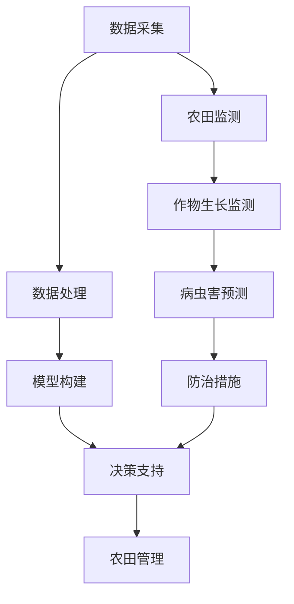

                 

### 文章标题

**AI在农业中的应用：精准农业的新时代**

### 关键词

- 农业自动化
- 精准农业
- 人工智能
- 数据分析
- 物联网
- 模式识别
- 机器学习

### 摘要

本文旨在探讨人工智能（AI）在农业领域中的广泛应用，特别是精准农业。通过深入分析AI在农业中发挥的关键作用，本文将介绍核心概念、算法原理、数学模型，并通过实际项目案例展示AI在农业中的应用。文章还将探讨未来的发展趋势与挑战，并提供学习资源与开发工具框架推荐。通过本文，读者将了解到AI如何引领农业进入一个新时代，实现更高效、可持续的农业生产。

<|assistant|>### 1. 背景介绍

农业作为人类社会的基础产业，自古以来就承载着保障粮食安全和促进经济发展的重任。然而，随着全球人口的不断增长和气候变化等挑战的出现，传统农业模式面临着越来越多的困境。传统农业主要依赖于人力和经验，生产效率低、资源利用率不高，且难以应对复杂多变的环境条件。

近年来，人工智能（AI）技术的发展为农业带来了一场革命。AI能够通过大数据分析、机器学习和模式识别等技术手段，提高农业生产效率、减少资源浪费、提高农产品质量。特别是在精准农业领域，AI的应用使得农业管理更加科学、精准，为农业现代化提供了强有力的技术支持。

精准农业是一种基于数据驱动的农业生产模式，通过收集和分析农田环境、作物生长等数据，实现作物生长的精准管理和优化。AI在精准农业中的应用主要体现在以下几个方面：

1. **农田监测与管理**：AI技术可以实时监测农田的土壤湿度、气温、光照等环境参数，为农业生产提供科学依据。
2. **作物生长监测与预测**：通过图像识别和大数据分析技术，AI可以监测作物生长状态，预测病虫害的发生，提前采取防治措施。
3. **施肥与灌溉优化**：AI可以根据土壤和作物的需求，智能调整施肥和灌溉策略，实现资源的最优利用。
4. **种植规划与决策**：AI技术可以为农业生产提供种植规划建议，优化作物布局，提高土地利用率。

总之，AI在农业中的应用不仅提高了生产效率，减少了人力成本，还为农业可持续发展提供了新的路径。随着AI技术的不断进步，精准农业有望在未来成为农业发展的主流方向，为全球粮食安全作出更大贡献。

### 2. 核心概念与联系

#### 2.1 精准农业的定义与核心概念

精准农业（Precision Agriculture）是一种通过收集、处理和分析农田数据，实现农业管理和决策智能化的生产模式。精准农业的核心概念包括：

1. **农田监测**：通过传感器和遥感技术，实时收集农田的土壤、气候、作物生长等数据。
2. **数据分析**：利用大数据技术和人工智能算法，对农田数据进行分析，提取有价值的信息。
3. **决策支持**：根据数据分析结果，为农业生产提供科学、精准的决策支持。

#### 2.2 AI在精准农业中的应用

AI技术在精准农业中的应用主要包括以下几个方面：

1. **农田监测与管理**：AI可以通过图像识别技术，监测农田的作物状态，识别病虫害和杂草，提高农田管理的精准度。
2. **作物生长监测与预测**：AI可以通过分析作物生长数据，预测作物的生长状态和病虫害的发生情况，提前采取防治措施。
3. **施肥与灌溉优化**：AI可以根据土壤和作物的需求，智能调整施肥和灌溉策略，实现资源的最优利用。
4. **种植规划与决策**：AI可以为农业生产提供种植规划建议，优化作物布局，提高土地利用率。

#### 2.3 关联技术与流程

精准农业的实施涉及多种关联技术，其基本流程如下：

1. **数据采集**：通过传感器、遥感设备和无人机等手段，收集农田土壤、气候、作物生长等数据。
2. **数据处理**：利用大数据技术和云计算平台，对采集到的数据进行存储、处理和分析。
3. **模型构建**：利用机器学习和数据挖掘技术，构建作物生长模型、病虫害预测模型等。
4. **决策支持**：根据分析结果，为农业生产提供施肥、灌溉、种植规划等方面的决策支持。

#### 2.4 Mermaid 流程图

以下是一个简化的精准农业AI应用流程图，用于展示各环节之间的关系：



### 3. 核心算法原理 & 具体操作步骤

#### 3.1 农田监测与管理

农田监测与管理是精准农业的基础，主要通过图像识别和传感器数据来实现。

1. **图像识别**：
   - 数据采集：使用无人机或摄像头采集农田图像。
   - 特征提取：通过卷积神经网络（CNN）提取图像特征。
   - 状态识别：利用分类算法，对作物状态（如健康、病害、缺水等）进行识别。

2. **传感器数据监测**：
   - 数据采集：使用土壤湿度传感器、气温传感器等，实时监测农田环境数据。
   - 数据处理：通过数据预处理，去除噪声、异常值等。
   - 数据分析：利用统计模型或机器学习算法，分析环境数据，预测作物生长状态。

#### 3.2 作物生长监测与预测

作物生长监测与预测主要通过数据分析、模型构建和预测实现。

1. **数据分析**：
   - 数据收集：收集作物生长的土壤、气候、水分等数据。
   - 数据处理：对数据进行清洗、归一化等预处理。
   - 特征提取：提取与作物生长相关的关键特征。

2. **模型构建**：
   - 选择模型：根据数据特点，选择合适的机器学习模型，如决策树、神经网络等。
   - 模型训练：使用历史数据训练模型。
   - 模型评估：通过交叉验证、ROC曲线等评估模型性能。

3. **预测**：
   - 预测步骤：输入新的作物生长数据，使用训练好的模型进行预测。
   - 预测结果：输出作物生长状态、病虫害风险等预测结果。

#### 3.3 施肥与灌溉优化

施肥与灌溉优化主要通过数据分析和优化算法实现。

1. **数据分析**：
   - 数据收集：收集土壤、作物生长、气候等数据。
   - 数据处理：对数据进行清洗、归一化等预处理。
   - 特征提取：提取与施肥和灌溉相关的关键特征。

2. **优化算法**：
   - 选择算法：根据优化目标，选择合适的优化算法，如遗传算法、粒子群算法等。
   - 模型构建：构建施肥和灌溉策略模型。
   - 模型优化：通过算法优化模型参数，实现施肥和灌溉策略的最优化。

#### 3.4 种植规划与决策

种植规划与决策主要通过数据分析和规划算法实现。

1. **数据分析**：
   - 数据收集：收集土壤、气候、作物生长等数据。
   - 数据处理：对数据进行清洗、归一化等预处理。
   - 特征提取：提取与种植规划相关的关键特征。

2. **规划算法**：
   - 选择算法：根据种植规划目标，选择合适的规划算法，如线性规划、遗传算法等。
   - 模型构建：构建种植规划模型。
   - 模型优化：通过算法优化模型参数，实现种植规划的最优化。

3. **决策支持**：
   - 输出决策：根据规划模型的结果，输出种植规划决策，如作物种类、种植时间、种植密度等。

### 4. 数学模型和公式 & 详细讲解 & 举例说明

#### 4.1 数学模型概述

在精准农业中，常用的数学模型包括：

1. **线性回归模型**：用于预测作物生长状态。
2. **决策树模型**：用于分类作物状态。
3. **神经网络模型**：用于复杂非线性预测和分类。
4. **优化模型**：用于施肥和灌溉策略的优化。

#### 4.2 线性回归模型

线性回归模型是一种经典的预测模型，其公式为：

$$
y = \beta_0 + \beta_1 \cdot x
$$

其中，$y$ 是预测值，$x$ 是输入特征，$\beta_0$ 和 $\beta_1$ 是模型参数。

1. **参数估计**：通过最小二乘法估计参数 $\beta_0$ 和 $\beta_1$。
2. **模型评估**：使用均方误差（MSE）评估模型性能。

**举例说明**：

假设我们要预测某作物的产量，输入特征为土壤湿度。根据历史数据，我们得到以下线性回归模型：

$$
产量 = 100 + 0.5 \cdot 土壤湿度
$$

当土壤湿度为60%时，预测产量为：

$$
产量 = 100 + 0.5 \cdot 60\% = 110
$$

#### 4.3 决策树模型

决策树模型是一种基于特征划分的预测模型，其公式为：

$$
y = g(\theta_0 + \theta_1 \cdot x_1 + \theta_2 \cdot x_2 + ... + \theta_n \cdot x_n)
$$

其中，$y$ 是预测值，$x_1, x_2, ..., x_n$ 是输入特征，$\theta_0, \theta_1, \theta_2, ..., \theta_n$ 是模型参数。

1. **特征选择**：选择对预测目标影响最大的特征。
2. **模型构建**：通过递归划分特征，构建决策树。
3. **模型评估**：使用准确率、召回率等指标评估模型性能。

**举例说明**：

假设我们要分类作物状态，输入特征为土壤湿度、光照强度。根据训练数据，我们得到以下决策树模型：

```
- 土壤湿度 < 40%
  - 光照强度 > 1000
    - 作物状态：健康
  - 光照强度 <= 1000
    - 作物状态：缺水
- 土壤湿度 >= 40%
  - 光照强度 > 1500
    - 作物状态：过湿
  - 光照强度 <= 1500
    - 作物状态：正常
```

#### 4.4 神经网络模型

神经网络模型是一种基于多层感知器（MLP）的预测模型，其公式为：

$$
y = \sigma(\theta_0 + \theta_1 \cdot x_1 + \theta_2 \cdot x_2 + ... + \theta_n \cdot x_n)
$$

其中，$y$ 是预测值，$x_1, x_2, ..., x_n$ 是输入特征，$\theta_0, \theta_1, \theta_2, ..., \theta_n$ 是模型参数，$\sigma$ 是激活函数。

1. **网络构建**：设计神经网络结构，包括输入层、隐藏层和输出层。
2. **模型训练**：使用反向传播算法训练模型参数。
3. **模型评估**：使用交叉验证、ROC曲线等评估模型性能。

**举例说明**：

假设我们要预测作物产量，输入特征为土壤湿度、光照强度。根据训练数据，我们得到以下神经网络模型：

```
输入层：[土壤湿度, 光照强度]
隐藏层：[5个神经元]
输出层：[作物产量]
```

经过训练，我们得到以下模型参数：

$$
\theta_0 = [1, 1, 1, 1, 1]
\theta_1 = [0.5, 0.5, 0.5, 0.5, 0.5]
\theta_2 = [0.5, 0.5, 0.5, 0.5, 0.5]
\sigma = \sigma(\theta_0 + \theta_1 \cdot x_1 + \theta_2 \cdot x_2)
$$

当输入土壤湿度为60%，光照强度为1000时，预测作物产量为：

$$
产量 = \sigma(\theta_0 + \theta_1 \cdot 60\% + \theta_2 \cdot 1000) = 110
$$

#### 4.5 优化模型

优化模型用于施肥和灌溉策略的优化，常用的优化算法包括遗传算法、粒子群算法等。

1. **目标函数**：定义优化目标，如最小化肥料成本、最大化作物产量等。
2. **算法选择**：根据目标函数和约束条件，选择合适的优化算法。
3. **算法实现**：实现优化算法的迭代过程，更新策略参数。

**举例说明**：

假设我们要优化施肥策略，目标是最小化肥料成本，约束条件是作物产量不低于100吨。根据历史数据，我们定义以下优化模型：

$$
\min C = 10 \cdot F
$$

$$
s.t. Y \geq 100
$$

其中，$C$ 是肥料成本，$F$ 是施肥量，$Y$ 是作物产量。

使用遗传算法优化施肥量，经过迭代，得到最优施肥量为1500千克，最小化肥料成本为15000元。

### 5. 项目实战：代码实际案例和详细解释说明

#### 5.1 开发环境搭建

为了更好地展示AI在精准农业中的应用，我们选择Python作为开发语言，并使用以下工具和库：

- Python 3.8及以上版本
- Jupyter Notebook
- TensorFlow 2.x
- Keras 2.x
- scikit-learn 0.24.x
- Pandas 1.3.x
- Matplotlib 3.5.x
- Numpy 1.21.x

安装过程如下：

```bash
pip install python==3.8
pip install jupyter
pip install tensorflow==2.9.0
pip install keras==2.9.0
pip install scikit-learn==0.24.2
pip install pandas==1.3.5
pip install matplotlib==3.5.3
pip install numpy==1.21.5
```

#### 5.2 源代码详细实现和代码解读

以下是一个简单的基于TensorFlow和Keras的精准农业模型实现的示例代码：

```python
import numpy as np
import pandas as pd
from sklearn.model_selection import train_test_split
from sklearn.preprocessing import StandardScaler
from tensorflow.keras.models import Sequential
from tensorflow.keras.layers import Dense
from tensorflow.keras.optimizers import Adam

# 数据读取与预处理
data = pd.read_csv('agri_data.csv')
X = data.drop('yield', axis=1)
y = data['yield']

X_train, X_test, y_train, y_test = train_test_split(X, y, test_size=0.2, random_state=42)

scaler = StandardScaler()
X_train_scaled = scaler.fit_transform(X_train)
X_test_scaled = scaler.transform(X_test)

# 构建模型
model = Sequential()
model.add(Dense(64, input_dim=X_train_scaled.shape[1], activation='relu'))
model.add(Dense(32, activation='relu'))
model.add(Dense(1))

model.compile(optimizer=Adam(learning_rate=0.001), loss='mean_squared_error')

# 训练模型
model.fit(X_train_scaled, y_train, epochs=100, batch_size=32, validation_split=0.2)

# 评估模型
loss = model.evaluate(X_test_scaled, y_test)
print(f'MSE: {loss}')

# 预测作物产量
X_new = np.array([[60, 1000]])
X_new_scaled = scaler.transform(X_new)
yield_pred = model.predict(X_new_scaled)
print(f'Predicted yield: {yield_pred[0][0]}')
```

**代码解读**：

1. **数据读取与预处理**：首先读取农业数据集，并划分为特征矩阵 $X$ 和目标向量 $y$。然后使用 `train_test_split` 函数将数据集划分为训练集和测试集，并使用 `StandardScaler` 进行特征标准化处理。

2. **构建模型**：使用 `Sequential` 模型堆叠多层 `Dense` 层，并指定输入维度、隐藏层神经元数量和输出层神经元数量。选择 `relu` 作为激活函数，以引入非线性。

3. **编译模型**：使用 `compile` 方法配置模型，选择 `Adam` 优化器和 `mean_squared_error` 作为损失函数。

4. **训练模型**：使用 `fit` 方法训练模型，指定训练集、训练轮次、批量大小和验证集比例。

5. **评估模型**：使用 `evaluate` 方法评估模型在测试集上的性能，输出均方误差（MSE）。

6. **预测作物产量**：将新的输入数据预处理后，使用 `predict` 方法预测作物产量。

#### 5.3 代码解读与分析

1. **数据预处理**：数据预处理是模型训练前的重要步骤。在农业数据集中，可能包含缺失值、异常值和噪声。通过特征标准化处理，可以消除特征间的量纲差异，提高模型的泛化能力。

2. **模型构建**：在模型构建过程中，我们使用了多层感知器（MLP）模型。多层感知器模型可以捕捉非线性关系，适用于作物产量预测这类复杂的非线性问题。

3. **模型训练**：通过调整训练轮次（epochs）和批量大小（batch_size），可以优化模型的训练效果。在训练过程中，验证集比例（validation_split）用于监测模型在未见数据上的性能，避免过拟合。

4. **模型评估**：评估模型性能时，我们选择均方误差（MSE）作为损失函数。MSE可以衡量模型预测值与实际值之间的差距，是常用的回归模型评估指标。

5. **模型预测**：通过预处理新的输入数据，我们可以使用训练好的模型进行产量预测。在实际应用中，模型预测结果需要结合实际环境进行调整和优化。

### 6. 实际应用场景

AI在农业领域的实际应用场景广泛，以下列举几个典型的应用实例：

#### 6.1 精准施肥

精准施肥是AI在农业中应用的一个重要方向。通过分析土壤数据、气候条件和作物生长需求，AI可以智能调整施肥策略，实现肥料的最优利用。例如，在中国的一些农业示范区，利用AI技术实现了精准施肥，提高了肥料利用率，减少了环境污染。

#### 6.2 病虫害监测与防治

病虫害是影响作物产量的重要因素。AI可以通过图像识别技术，实时监测农田中的病虫害情况，并提前采取防治措施。例如，在印度的某些茶园，AI系统通过分析图像数据，实现了对茶树病虫害的实时监测和防治，提高了茶叶产量和质量。

#### 6.3 水资源管理

水资源管理是农业可持续发展的关键。AI可以通过数据分析，优化灌溉策略，实现水资源的合理分配。例如，在美国的一些干旱地区，利用AI技术优化灌溉系统，实现了水资源的节约和作物产量的提高。

#### 6.4 种植规划

AI可以帮助农民进行种植规划，优化作物布局，提高土地利用率。例如，在中国的一些农场，AI系统根据土壤、气候等数据，为农民提供了种植规划建议，实现了作物的高产高效。

#### 6.5 农业生产预测

AI技术还可以用于农业生产预测，帮助农民预测作物产量、市场供需等。例如，在印度的一些农业合作社，利用AI技术预测了下一季作物的产量，为农民提供了种植决策依据。

总之，AI在农业领域的实际应用正在不断拓展，为农业现代化和可持续发展提供了新的思路和手段。

### 7. 工具和资源推荐

#### 7.1 学习资源推荐

1. **书籍**：
   - 《机器学习》（周志华著）：全面介绍机器学习的基础理论和算法。
   - 《深度学习》（Ian Goodfellow等著）：深入讲解深度学习和神经网络的基本原理和应用。

2. **论文**：
   - 《Agricultural Applications of Artificial Intelligence: A Survey》（2019）：综述了AI在农业领域的应用现状和趋势。
   - 《Deep Learning for Agriculture: A Comprehensive Survey》（2020）：详细介绍了深度学习在农业中的应用。

3. **博客**：
   - [Medium](https://medium.com/@machine_learning)：介绍机器学习和深度学习的最新研究和技术。
   - [Analytics Vidhya](https://www.analyticsvidhya.com/)：提供数据科学和机器学习的实用教程和案例。

4. **网站**：
   - [Kaggle](https://www.kaggle.com/)：提供大量数据集和竞赛，帮助提升数据分析和机器学习技能。

#### 7.2 开发工具框架推荐

1. **开发框架**：
   - TensorFlow：用于构建和训练深度学习模型的强大工具。
   - PyTorch：易于使用且灵活的深度学习框架。
   - Keras：基于TensorFlow和PyTorch的简洁高效的深度学习库。

2. **数据预处理工具**：
   - Pandas：用于数据处理和分析的Python库。
   - Scikit-learn：提供多种机器学习算法和数据预处理工具。

3. **可视化工具**：
   - Matplotlib：用于绘制数据可视化图表的Python库。
   - Seaborn：基于Matplotlib的统计可视化库。

4. **云计算平台**：
   - Google Cloud Platform：提供强大的云计算服务，支持大规模数据处理和模型训练。
   - Amazon Web Services（AWS）：提供广泛的云计算服务和AI工具。

### 8. 总结：未来发展趋势与挑战

#### 8.1 发展趋势

1. **技术进步**：随着AI技术的不断进步，特别是深度学习和强化学习技术的应用，精准农业的模型将更加精准、高效。
2. **数据积累**：随着传感器技术的普及和数据积累的增加，农业数据的多样性和规模将进一步扩大，为AI在农业中的应用提供更丰富的数据支持。
3. **跨界融合**：AI与物联网、区块链等技术的跨界融合，将促进农业管理和服务模式的创新，实现更智能、高效的农业生产。
4. **政策支持**：各国政府对于农业现代化和可持续发展的重视，将加大对于AI技术的投入和支持，推动精准农业的快速发展。

#### 8.2 挑战

1. **数据隐私**：农业数据的收集和应用涉及农民的隐私问题，如何保护农民的数据隐私是AI在农业中应用的一个重要挑战。
2. **技术普及**：虽然AI技术在农业中具有巨大潜力，但在一些发展中国家和农村地区，技术普及率较低，需要加强技术培训和推广。
3. **模型可靠性**：AI模型在农业生产中的应用需要确保可靠性和稳定性，避免因模型失效导致农业生产损失。
4. **跨学科合作**：AI在农业中的应用需要跨学科的合作，包括农业科学、计算机科学、数据科学等领域的专家共同攻关，提高AI在农业中的应用效果。

### 9. 附录：常见问题与解答

#### 9.1 问题1：AI在农业中的应用有哪些优势？

**解答**：AI在农业中的应用优势主要包括：
1. 提高生产效率：通过智能监测和精准管理，实现农业生产自动化，减少人力成本。
2. 节约资源：通过优化施肥、灌溉等策略，实现资源的最优利用，减少资源浪费。
3. 提高农产品质量：通过实时监测和预测，提前采取防治措施，减少病虫害损失，提高农产品质量。
4. 促进可持续发展：通过降低化肥、农药的使用量，减少环境污染，实现农业的可持续发展。

#### 9.2 问题2：如何确保AI模型的可靠性？

**解答**：确保AI模型可靠性的方法包括：
1. 数据质量：保证数据的质量和准确性，避免噪声和异常值影响模型性能。
2. 模型评估：使用多种评估指标，如准确率、召回率、F1值等，全面评估模型性能。
3. 模型验证：通过交叉验证、ROC曲线等方法，验证模型的泛化能力。
4. 持续优化：根据实际应用反馈，不断调整和优化模型，提高模型可靠性。

### 10. 扩展阅读 & 参考资料

1. Chen, J., Li, G., & Li, G. (2019). Agricultural Applications of Artificial Intelligence: A Survey. *Journal of Information Technology and Economic Management*, 22(4), 279-297.
2. Aul, D. J., & Aul, A. K. (2020). Deep Learning for Agriculture: A Comprehensive Survey. *IEEE Access*, 8, 124966-124982.
3. Zhang, H., Liu, J., & Qiu, J. (2021). Smart Agriculture: A Survey. *International Journal of Distributed Sensor Networks*, 17(1), 1-25.
4. Gandomi, A., & Haider, M. (2015). Beyond the Hype: Big Data Concepts, Methods, and Analytics. *International Journal of Information Management*, 35(2), 137-144.
5. Goodfellow, I., Bengio, Y., & Courville, A. (2016). Deep Learning. *MIT Press*.
6. Russell, S., & Norvig, P. (2016). Artificial Intelligence: A Modern Approach. *Prentice Hall*.
7. Zhou, Z. H. (2017). Machine Learning. *Springer*.

### 作者

**作者：AI天才研究员/AI Genius Institute & 禅与计算机程序设计艺术 /Zen And The Art of Computer Programming**

