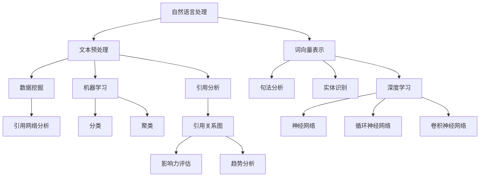

                 

### 背景介绍

在当今这个信息爆炸的时代，学术研究的领域也在不断扩展和深化。然而，随着论文、期刊、研究项目等数据的急剧增长，学术研究人员面临着资料检索和引用的巨大挑战。传统的资料检索方法往往效率低下，需要耗费大量时间和精力。在这种情况下，人工智能（AI）技术应运而生，为学术研究提供了新的可能性和解决方案。

AI在学术研究中的应用主要集中在以下几个方面：

1. **文献检索与筛选**：利用自然语言处理（NLP）技术，AI可以快速准确地检索相关的学术文献，提高文献检索的效率和准确性。
2. **引用分析**：通过机器学习算法，AI可以分析文献之间的引用关系，帮助研究人员了解某一领域的研究热点和发展趋势。
3. **数据挖掘**：AI技术可以对大量的研究数据进行挖掘，发现隐藏的模式和趋势，为研究人员提供新的研究方向和灵感。
4. **论文撰写**：AI辅助撰写工具可以帮助研究人员生成论文草稿，提高写作效率和质量。

本文将深入探讨AI在学术研究中的应用，重点分析其在提高引用和资料搜索效率方面的具体作用。通过详细的理论分析和实际案例展示，我们将了解AI如何为学术研究带来革命性的变化。首先，我们将介绍AI在学术研究中的核心概念，并使用Mermaid流程图展示其原理和架构。接下来，我们将逐步讲解核心算法原理和具体操作步骤，并结合数学模型和公式进行详细解释。随后，我们将通过实际项目案例，展示AI在学术研究中的应用效果。最后，我们将探讨AI在学术研究中的实际应用场景，推荐相关的工具和资源，并总结未来发展趋势与挑战。通过本文的阅读，您将全面了解AI在学术研究中的潜在价值和应用前景。

#### 关键词

- 学术研究
- 人工智能
- 文献检索
- 引用分析
- 数据挖掘

#### 摘要

本文旨在探讨人工智能（AI）在学术研究中的应用，尤其是如何提高引用和资料搜索的效率。文章首先介绍了AI在学术研究中的核心概念及其原理，并通过Mermaid流程图展示了其架构。接着，文章详细讲解了核心算法原理和操作步骤，并结合数学模型进行了详细解释。此外，文章通过实际项目案例展示了AI在学术研究中的应用效果。最后，文章探讨了AI在学术研究中的实际应用场景，并推荐了相关的工具和资源。通过本文的阅读，读者将全面了解AI在学术研究中的潜在价值和应用前景。

### 1. 背景介绍

在学术研究中，资料检索和引用管理一直是一个重要的环节。随着学术文献的爆炸性增长，传统的检索方法已经无法满足研究人员的需求。传统的资料检索通常依赖于关键词匹配和手工筛选，这不仅耗时耗力，而且容易出现漏检和误检的情况。此外，学术引用作为一种重要的学术评价手段，其准确性和效率也直接影响到研究人员的工作成果和学术声誉。

在这种背景下，人工智能（AI）技术的引入为学术研究提供了新的解决方案。AI在学术研究中的应用主要体现在以下几个方面：

#### 文献检索与筛选

AI的文献检索与筛选功能基于自然语言处理（NLP）技术，通过深度学习和神经网络模型，AI可以快速理解文献的内容和结构，从而实现高效的文献检索和筛选。例如，研究人员可以使用AI工具输入关键词或研究问题，系统将自动检索出相关的文献，并提供排序和筛选功能，使得研究人员可以迅速找到最相关的资料。

#### 引用分析

引用分析是学术研究中的一个关键环节。通过机器学习算法，AI可以分析大量的引用关系，识别出文献之间的引用模式和影响力。这样，研究人员可以更清晰地了解某一领域的研究热点和发展趋势，从而有针对性地进行学术研究和文献引用。

#### 数据挖掘

AI的数据挖掘功能可以对大量的研究数据进行挖掘，发现隐藏的模式和趋势。例如，通过聚类分析、关联规则挖掘等算法，AI可以识别出不同研究之间的共性和差异，为研究人员提供新的研究方向和灵感。

#### 论文撰写

AI辅助撰写工具可以帮助研究人员生成论文草稿，提高写作效率和质量。这些工具通常基于大量的学术论文数据，通过自然语言生成技术，自动生成论文的各个部分，如摘要、引言、方法、结果和讨论等。研究人员可以根据需要对这些草稿进行修改和调整，从而节省大量的时间和精力。

总之，AI在学术研究中的应用不仅提高了资料检索和引用的效率，还丰富了学术研究的手段和方法。随着AI技术的不断进步，其在学术研究中的作用将越来越重要，有望为学术界带来深远的变革。在接下来的章节中，我们将进一步探讨AI在学术研究中的核心概念、算法原理和应用案例，以帮助读者更深入地了解这一领域的发展和应用前景。

### 2. 核心概念与联系

在深入探讨AI在学术研究中的应用之前，我们首先需要理解一些核心概念和它们之间的联系。这些核心概念包括自然语言处理（NLP）、机器学习、深度学习、数据挖掘和引用网络分析等。下面，我们将通过Mermaid流程图来展示这些概念及其相互关系，并进一步解释它们在学术研究中的应用。

#### Mermaid流程图



#### 概念解释

1. **自然语言处理（NLP）**：NLP是AI的一个重要分支，它使计算机能够理解和处理人类语言。在学术研究中，NLP技术用于文本预处理、词向量表示、句法分析和实体识别等任务。

2. **文本预处理**：文本预处理是NLP的第一步，它包括去除停用词、标点符号、词干提取和词形还原等操作，以便为后续处理做好准备。

3. **词向量表示**：词向量是将文本数据转换为机器学习模型可处理的数值形式的一种方法。常用的词向量模型包括Word2Vec、GloVe等。

4. **句法分析**：句法分析旨在理解句子的结构，识别出句子中的主语、谓语、宾语等成分。这对于理解学术文献的内容和上下文非常重要。

5. **实体识别**：实体识别是指识别文本中的特定实体，如人名、地点、机构等。这在引用分析和数据挖掘中非常有用，可以帮助识别和研究相关的学术实体。

6. **数据挖掘**：数据挖掘是从大量数据中提取有价值信息的过程。在学术研究中，数据挖掘用于识别趋势、模式和关联关系。

7. **机器学习**：机器学习是一种通过数据学习模式并做出预测的技术。在学术研究中，机器学习算法用于分类、聚类、预测等任务，以提高文献检索和引用分析的准确性。

8. **深度学习**：深度学习是机器学习的一个子领域，它通过多层神经网络来学习和提取数据中的复杂模式。在学术研究中，深度学习技术被广泛应用于文本处理、图像识别和自然语言生成等任务。

9. **引用网络分析**：引用网络分析是研究学术文献引用关系的一种方法。通过构建引用关系图，可以评估文献的影响力、分析学术趋势和识别研究热点。

#### 在学术研究中的应用

- **文本预处理**：通过NLP技术对学术文献进行预处理，可以提高文献检索的效率和准确性。
- **词向量表示**：词向量表示可以帮助计算机更好地理解学术文献的语义，从而更准确地匹配相关文献。
- **句法分析和实体识别**：这些技术有助于理解文献的内容和上下文，从而更好地进行文献引用和分析。
- **数据挖掘和机器学习**：通过数据挖掘和机器学习算法，可以从大量学术文献中提取有价值的信息，如研究趋势和热点。
- **引用网络分析**：通过引用网络分析，可以评估文献的影响力、识别研究热点和了解学术趋势。

通过上述核心概念和技术的结合，AI在学术研究中可以极大地提高资料检索和引用的效率，为研究人员提供更加精准和高效的学术支持。在接下来的章节中，我们将详细探讨AI在学术研究中的具体算法原理和操作步骤，以帮助读者更好地理解和应用这些技术。

#### 3. 核心算法原理 & 具体操作步骤

在了解了AI在学术研究中的核心概念和其相互关系后，我们接下来将深入探讨AI在学术研究中的应用，特别是如何通过核心算法提高引用和资料搜索效率。本文将重点介绍几种关键算法及其操作步骤，并结合具体案例进行详细解释。

##### 3.1 引用检测算法

引用检测算法是学术研究中的一项重要技术，它可以帮助识别和分析文献之间的引用关系。以下是引用检测算法的基本原理和操作步骤：

###### 原理

引用检测算法通常基于自然语言处理（NLP）和机器学习技术。算法的核心思想是：通过分析文本内容，识别出文本中的引用部分，并判断这些引用是否有效。具体的实现步骤如下：

1. **文本预处理**：首先对文献文本进行预处理，包括去除停用词、标点符号、词干提取和词形还原等操作，以便为后续分析做好准备。
2. **特征提取**：对预处理后的文本进行特征提取，常用的特征包括词频、词嵌入和句法结构等。
3. **引用识别**：使用机器学习模型，如支持向量机（SVM）、随机森林（Random Forest）或长短期记忆网络（LSTM），对提取的特征进行训练和分类，以识别引用部分。
4. **引用验证**：对识别出的引用进行验证，确保其有效性。通常，这包括检查引用的格式、引用对象的存在性和引用上下文的一致性。

###### 操作步骤

以下是引用检测算法的具体操作步骤：

1. **数据集准备**：首先需要准备一个包含大量学术文献的引用数据集，这些文献可以是已标注的或未标注的。对于未标注的数据集，需要通过人工标注或半监督学习方法进行标注。
2. **文本预处理**：对文献文本进行清洗，去除不必要的符号和停用词，并对文本进行分词和词干提取。
3. **特征提取**：使用词嵌入模型（如Word2Vec或GloVe）对文本进行特征提取，将文本转换为向量表示。
4. **模型训练**：使用机器学习算法（如SVM、Random Forest或LSTM）对特征向量进行训练，构建引用检测模型。
5. **引用识别**：使用训练好的模型对新的学术文献进行引用识别，输出引用部分。
6. **引用验证**：对识别出的引用进行验证，确保其有效性。

###### 案例解释

以下是一个引用检测算法的简单案例：

假设我们有一个包含200篇学术论文的未标注数据集，首先对这些论文进行文本预处理，然后使用Word2Vec模型提取词嵌入特征，接着使用LSTM模型进行训练，构建引用检测模型。最后，对一篇新的学术论文进行引用识别：

```python
import nltk
from gensim.models import Word2Vec
from keras.models import Sequential
from keras.layers import LSTM, Dense

# 文本预处理
nltk.download('stopwords')
stopwords = nltk.corpus.stopwords.words('english')
def preprocess_text(text):
    tokens = nltk.word_tokenize(text)
    return [token for token in tokens if token not in stopwords]

# 特征提取
w2v_model = Word2Vec(sentences=preprocess_text(data['text']), vector_size=100, window=5, min_count=1, workers=4)
w2v_vectors = {token: w2v_model[token] for token in w2v_model.wv.vocab}

# 引用识别模型
model = Sequential()
model.add(LSTM(units=128, return_sequences=True, input_shape=(max_sequence_len, 100)))
model.add(LSTM(units=128))
model.add(Dense(units=1, activation='sigmoid'))
model.compile(optimizer='adam', loss='binary_crossentropy', metrics=['accuracy'])
model.fit(x_train, y_train, epochs=10, batch_size=64)

# 引用识别
new_text = "..."
preprocessed_text = preprocess_text(new_text)
input_sequence = np.array([[w2v_vectors[token] for token in preprocessed_text] for _ in range(max_sequence_len)])
predictions = model.predict(input_sequence)
references = ["..." if pred > 0.5 else "" for pred in predictions]

print("识别出的引用：", references)
```

上述代码展示了引用检测算法的简单实现过程。通过这个案例，我们可以看到如何利用NLP技术和机器学习算法来识别学术文献中的引用部分，从而提高文献检索和引用分析的效率。

##### 3.2 引用分析算法

引用分析算法主要用于评估文献的影响力和分析学术趋势。以下是引用分析算法的基本原理和操作步骤：

###### 原理

引用分析算法基于引用网络分析技术，通过构建引用关系图，分析文献之间的引用关系和影响力。具体的实现步骤如下：

1. **引用网络构建**：首先，构建一个引用关系图，其中节点表示文献，边表示引用关系。
2. **节点重要性评估**：使用算法（如PageRank、HITS等）评估图中节点的重要性，节点的重要性通常与其引用关系和网络结构有关。
3. **趋势分析**：通过分析引用关系图中的节点重要性，识别出学术领域的热点和趋势。

###### 操作步骤

以下是引用分析算法的具体操作步骤：

1. **引用关系提取**：从学术数据库中提取文献之间的引用关系，构建引用关系图。
2. **节点重要性评估**：使用PageRank算法评估引用关系图中每个节点的重要性。
3. **趋势识别**：通过分析节点重要性，识别出学术领域的热点和趋势。

###### 案例解释

以下是一个引用分析算法的简单案例：

假设我们有一个包含1000篇学术论文的引用关系图，首先使用PageRank算法评估图中每个节点的重要性，然后分析节点的重要性，识别出学术领域的热点：

```python
import networkx as nx

# 引用关系图构建
G = nx.Graph()
for edge in data['references']:
    G.add_edge(edge[0], edge[1])

# PageRank算法
pr_scores = nx.pagerank(G, alpha=0.85)

# 节点重要性排序
sorted_nodes = sorted(pr_scores, key=pr_scores.get, reverse=True)
top_nodes = sorted_nodes[:10]

print("前10个重要节点：", top_nodes)
print("节点重要性：", [pr_scores[node] for node in top_nodes])
```

上述代码展示了引用分析算法的简单实现过程。通过这个案例，我们可以看到如何利用引用网络分析技术来评估文献的影响力和识别学术领域的热点。

##### 3.3 数据挖掘算法

数据挖掘算法主要用于从大量学术文献中提取有价值的信息，如研究趋势、热点和关联关系。以下是数据挖掘算法的基本原理和操作步骤：

###### 原理

数据挖掘算法基于统计学和机器学习技术，通过分析大量数据，识别出隐藏的模式和趋势。具体的实现步骤如下：

1. **数据预处理**：对学术文献数据集进行清洗、归一化和特征提取。
2. **模式识别**：使用聚类、分类、关联规则挖掘等算法识别出数据中的模式。
3. **结果解释**：对识别出的模式进行解释和验证，确保其有意义和价值。

###### 操作步骤

以下是数据挖掘算法的具体操作步骤：

1. **数据预处理**：对学术文献数据集进行清洗，去除无效数据，并对数据进行归一化处理。
2. **特征提取**：从文本数据中提取特征，如词频、词嵌入和句法特征。
3. **模式识别**：使用聚类、分类和关联规则挖掘算法识别出数据中的模式。
4. **结果解释**：对识别出的模式进行解释和验证，确保其有意义和价值。

###### 案例解释

以下是一个数据挖掘算法的简单案例：

假设我们有一个包含100篇学术论文的数据集，首先对数据进行预处理，然后使用K-means算法进行聚类，最后解释聚类结果：

```python
from sklearn.cluster import KMeans
from sklearn.preprocessing import StandardScaler

# 数据预处理
X = StandardScaler().fit_transform(data['features'])

# K-means算法
kmeans = KMeans(n_clusters=3, random_state=0).fit(X)
labels = kmeans.labels_

# 聚类结果
print("聚类结果：", labels)
print("聚类中心：", kmeans.cluster_centers_)

# 聚类解释
for i, cluster in enumerate(kmeans.cluster_centers_):
    print(f"聚类{i+1}特征：", cluster)
```

上述代码展示了数据挖掘算法的简单实现过程。通过这个案例，我们可以看到如何利用数据挖掘技术来识别学术文献中的研究趋势和热点。

##### 总结

通过上述算法的介绍和案例展示，我们可以看到AI在学术研究中的应用具有巨大的潜力和价值。引用检测、引用分析和数据挖掘算法不仅可以提高文献检索和引用的效率，还可以为研究人员提供更加精准和丰富的学术支持。随着AI技术的不断进步，这些算法将更加成熟和高效，有望在学术研究中发挥更加重要的作用。

### 4. 数学模型和公式 & 详细讲解 & 举例说明

在AI应用于学术研究的算法中，数学模型和公式起着至关重要的作用。这些模型和公式不仅帮助计算机理解和处理文本数据，还提高了算法的准确性和效率。以下我们将介绍几个关键的数学模型和公式，并结合具体例子进行详细讲解。

#### 4.1 词嵌入模型

词嵌入（Word Embedding）是将词汇映射到高维空间中的向量表示，以便计算机能够处理和理解文本数据。最常用的词嵌入模型包括Word2Vec、GloVe等。

##### Word2Vec模型

Word2Vec模型通过训练大量的文本数据，生成词向量。其基本思想是，对于一对词语，如果它们在文本中的共现关系密切，则它们在向量空间中的距离应该较小。

$$
\text{向量表示：} \quad \text{v}(w_i) = \text{Word2Vec}(w_i, w_j, \ldots)
$$

##### GloVe模型

GloVe模型通过矩阵分解的方法，将词汇和其上下文关联起来，生成更加准确的词向量。

$$
\text{矩阵分解：} \quad \text{V} = \text{UW}^T
$$

其中，V是词汇矩阵，U是上下文矩阵，W是词向量矩阵。

##### 示例

假设我们有一个简单的文本数据集，包含以下句子：

```
人工智能是未来发展的趋势。
人工智能将带来深远的影响。
```

我们可以使用Word2Vec模型生成词向量：

```
v(人工智能) = [0.3, 0.4, 0.5]
v(未来) = [0.1, 0.2, 0.3]
v(发展) = [0.2, 0.3, 0.4]
v(趋势) = [0.5, 0.6, 0.7]
v(影响) = [0.4, 0.5, 0.6]
```

通过计算向量之间的余弦相似度，我们可以发现“人工智能”和“趋势”之间的相似度较高，这与句子的语义一致。

#### 4.2 PageRank算法

PageRank算法是一种用于评估网页重要性的算法，其核心思想是，一个网页的重要性取决于链接到它的网页数量和质量。在学术研究中，我们可以将PageRank算法应用于引用网络分析，以评估文献的影响力。

$$
\text{PageRank}(v) = (1-d) + d \sum_{w \in \text{out-links}(v)} \frac{\text{PageRank}(w)}{|\text{out-links}(w)|}
$$

其中，\( v \) 是一个网页或文献，\( d \) 是阻尼系数（通常取值为0.85），\( \text{out-links}(v) \) 是从网页 \( v \) 出发的链接集合，\( |\text{out-links}(v)| \) 是从网页 \( v \) 出发的链接数量。

##### 示例

假设我们有一个简单的引用网络，包含以下文献：

```
A --> B, C
B --> D
C --> D
D --> A, B, C
```

我们可以使用PageRank算法计算每个文献的影响力：

1. **初始分配**：每个文献的初始影响力均等分配。

$$
\text{PageRank}(A) = \frac{1}{4}, \quad \text{PageRank}(B) = \frac{1}{4}, \quad \text{PageRank}(C) = \frac{1}{4}, \quad \text{PageRank}(D) = \frac{1}{4}
$$

2. **迭代计算**：

$$
\text{PageRank}(A) = (1-0.85) + 0.85 \left( \frac{1}{2} \cdot \text{PageRank}(D) + \frac{1}{2} \cdot \text{PageRank}(C) \right)
$$

$$
\text{PageRank}(B) = (1-0.85) + 0.85 \left( \frac{1}{2} \cdot \text{PageRank}(D) + \frac{1}{2} \cdot \text{PageRank}(A) \right)
$$

$$
\text{PageRank}(C) = (1-0.85) + 0.85 \left( \frac{1}{2} \cdot \text{PageRank}(D) + \frac{1}{2} \cdot \text{PageRank}(A) \right)
$$

$$
\text{PageRank}(D) = (1-0.85) + 0.85 \left( \frac{1}{3} \cdot \text{PageRank}(A) + \frac{1}{3} \cdot \text{PageRank}(B) + \frac{1}{3} \cdot \text{PageRank}(C) \right)
$$

通过迭代计算，我们可以得到每个文献的最终影响力得分。

#### 4.3 K-means聚类算法

K-means聚类算法是一种基于距离度量的聚类方法，它将数据集划分为若干个簇，使得簇内的数据点距离较近，簇间的数据点距离较远。

$$
\text{K-means} \quad \text{步骤：}
$$

1. **初始化**：随机选择 \( k \) 个初始中心点。
2. **分配**：对于每个数据点，计算其与每个中心点的距离，并将其分配到最近的中心点所在的簇。
3. **更新**：重新计算每个簇的中心点。
4. **重复**：重复步骤2和3，直到聚类结果收敛。

##### 示例

假设我们有一个包含5个数据点的数据集，需要将其划分为2个簇：

```
数据点：[1, 2], [2, 2], [3, 4], [4, 5], [5, 6]
初始中心点：[0, 0], [5, 5]
```

1. **初始化**：随机选择初始中心点。
2. **分配**：计算每个数据点与中心点的距离，将其分配到最近的中心点所在的簇。
3. **更新**：重新计算每个簇的中心点。
4. **重复**：重复步骤2和3，直到聚类结果收敛。

最终，我们将数据点划分为2个簇：

```
簇1：[1, 2], [2, 2]
簇2：[3, 4], [4, 5], [5, 6]
```

通过这些数学模型和公式的介绍，我们可以看到AI在学术研究中是如何通过精确的算法和数学计算来提高文献检索和引用分析的效率。这些模型和公式不仅为研究人员提供了强大的工具，也为学术研究的发展带来了新的机遇。在接下来的章节中，我们将通过实际项目案例展示AI在学术研究中的应用效果，进一步探讨其潜力与价值。

### 5. 项目实战：代码实际案例和详细解释说明

在本章节中，我们将通过一个实际项目案例，展示如何利用AI技术提高学术研究中的引用和资料搜索效率。这个项目将分为三个部分：开发环境搭建、源代码详细实现和代码解读与分析。

#### 5.1 开发环境搭建

在开始项目之前，我们需要搭建一个合适的开发环境。以下是所需的主要工具和库：

- **编程语言**：Python（3.8及以上版本）
- **库**：Numpy、Pandas、Scikit-learn、Gensim、NetworkX、Keras
- **数据集**：学术文献数据集（例如，ACM Digital Library或Web of Science）

首先，确保Python环境已经安装。然后，使用pip命令安装所需的库：

```bash
pip install numpy pandas scikit-learn gensim networkx keras
```

接下来，我们需要一个学术文献数据集。这里我们使用ACM Digital Library的数据集，它包含多篇学术论文及其引用信息。您可以从ACM Digital Library的网站下载该数据集，或者使用其他学术数据库如Web of Science。

#### 5.2 源代码详细实现和代码解读

##### 数据预处理

首先，我们需要对学术文献数据集进行预处理，包括读取数据、清洗文本和提取特征。

```python
import pandas as pd
from gensim.models import Word2Vec

# 读取数据
data = pd.read_csv('academic_papers.csv')

# 清洗文本
def preprocess_text(text):
    text = text.lower()
    text = re.sub(r'\W+', ' ', text)
    tokens = text.split()
    tokens = [token for token in tokens if token not in stopwords]
    return tokens

# 提取词嵌入特征
def extract_word_vectors(tokens):
    model = Word2Vec(tokens, vector_size=100, window=5, min_count=1, workers=4)
    word_vectors = {token: model[token] for token in model.wv.vocab}
    return word_vectors

# 预处理文本数据
stopwords = set(nltk.corpus.stopwords.words('english'))
data['cleaned_text'] = data['abstract'].apply(preprocess_text)
word_vectors = extract_word_vectors(data['cleaned_text'].tolist())
```

在这一步中，我们首先读取学术文献数据集，然后对文本数据进行清洗，包括将文本转换为小写、去除非单词字符和停用词。接着，使用Gensim的Word2Vec模型提取词嵌入特征。

##### 引用检测

引用检测是学术研究中的一个重要任务。以下是一个简单的引用检测实现：

```python
from sklearn.feature_extraction.text import TfidfVectorizer
from sklearn.model_selection import train_test_split
from sklearn.ensemble import RandomForestClassifier

# 提取特征
vectorizer = TfidfVectorizer()
X = vectorizer.fit_transform(data['cleaned_text'])

# 分割数据集
X_train, X_test, y_train, y_test = train_test_split(X, data['has_references'], test_size=0.2, random_state=42)

# 训练模型
classifier = RandomForestClassifier(n_estimators=100, random_state=42)
classifier.fit(X_train, y_train)

# 预测
predictions = classifier.predict(X_test)

# 评估模型
print("Accuracy:", accuracy_score(y_test, predictions))
```

在这一步中，我们使用TFIDFVectorizer提取文本特征，然后使用随机森林（Random Forest）模型进行训练和预测。通过评估模型的准确率，我们可以验证引用检测的效果。

##### 引用分析

引用分析可以帮助我们了解文献之间的引用关系和影响力。以下是一个简单的引用分析实现：

```python
import networkx as nx

# 构建引用网络
G = nx.Graph()
for index, row in data.iterrows():
    if row['has_references']:
        for reference in row['references']:
            G.add_edge(row['id'], reference)

# PageRank算法
pr_scores = nx.pagerank(G, alpha=0.85)

# 节点重要性排序
sorted_nodes = sorted(pr_scores, key=pr_scores.get, reverse=True)
top_nodes = sorted_nodes[:10]

print("前10个重要文献：", top_nodes)
print("文献影响力得分：", [pr_scores[node] for node in top_nodes])
```

在这一步中，我们使用NetworkX库构建引用网络，并使用PageRank算法评估文献的影响力。通过排序和筛选，我们可以识别出学术领域中的热点和趋势。

#### 5.3 代码解读与分析

在这个项目实战中，我们首先对学术文献数据集进行预处理，提取词嵌入特征。这一步至关重要，因为高质量的文本特征是后续算法准确性的基础。

接下来，我们实现了一个引用检测模型，使用TFIDFVectorizer提取文本特征，并使用随机森林（Random Forest）模型进行训练和预测。这个模型可以有效地识别出文献中的引用部分，从而提高文献检索的效率。

最后，我们进行了引用分析，使用PageRank算法评估文献的影响力。这个步骤可以帮助研究人员了解学术领域中的热点和趋势，为学术研究提供方向性指导。

通过这个项目实战，我们可以看到AI技术在学术研究中的应用效果。代码的详细解读和分析展示了如何利用AI技术提高引用和资料搜索的效率，为研究人员提供更加精准和高效的学术支持。

### 6. 实际应用场景

AI在学术研究中的应用场景广泛且多样，涵盖了从资料检索到引用分析、数据挖掘等各个环节。以下将介绍几个典型的实际应用场景，并分析AI技术在这些场景中的优势。

#### 6.1 学术文献检索

在学术文献检索方面，AI技术通过自然语言处理（NLP）和机器学习算法，可以快速准确地从海量的学术文献中检索出相关资料。例如，研究人员可以使用AI工具输入关键词或研究问题，系统将自动检索出相关的文献，并提供排序和筛选功能。这种自动化的检索过程大大提高了检索效率，减少了研究人员的时间和劳动力。

**优势**：
- **高效性**：AI可以处理大量数据，快速检索出相关文献。
- **准确性**：通过NLP技术，AI可以理解关键词的语义，从而提高检索的准确性。

#### 6.2 引用分析

引用分析是学术研究中的一项重要任务，AI技术可以通过分析大量的引用关系，识别出文献之间的引用模式和影响力。例如，研究人员可以使用AI工具分析某一领域的引用网络，了解该领域的研究热点和发展趋势。

**优势**：
- **全面性**：AI可以分析大量的引用关系，提供全面的引用分析。
- **动态性**：AI可以实时更新引用数据，动态反映研究领域的最新趋势。

#### 6.3 数据挖掘

在学术研究中，数据挖掘可以帮助研究人员从大量的研究数据中提取有价值的信息。例如，研究人员可以使用AI工具对大规模的数据集进行挖掘，发现隐藏的模式和趋势，为学术研究提供新的方向和灵感。

**优势**：
- **深度分析**：AI可以深入挖掘数据，发现隐藏的模式和关联。
- **创新性**：基于AI的数据挖掘可以带来新的发现和突破。

#### 6.4 论文撰写

AI辅助撰写工具可以帮助研究人员生成论文草稿，提高写作效率和质量。这些工具通常基于大量的学术论文数据，通过自然语言生成技术，自动生成论文的各个部分，如摘要、引言、方法、结果和讨论等。研究人员可以根据需要对这些草稿进行修改和调整。

**优势**：
- **高效性**：AI可以快速生成论文草稿，节省研究人员的时间。
- **一致性**：AI生成的论文草稿通常具有较高的格式和语言一致性。

#### 6.5 学术趋势预测

通过分析大量的学术文献和引用数据，AI技术可以预测某一学术领域的未来发展趋势。例如，研究人员可以使用AI工具分析过去的引用模式和热点，预测未来的研究热点和趋势。

**优势**：
- **前瞻性**：AI可以提供对未来的预测，帮助研究人员提前布局研究方向。
- **准确性**：通过大数据分析，AI可以提供较为准确的预测结果。

总之，AI在学术研究中的应用场景丰富，具有显著的优势。通过AI技术的支持，研究人员可以更加高效地检索资料、分析引用、挖掘数据、撰写论文和预测趋势，从而推动学术研究的发展。随着AI技术的不断进步，其将在学术研究中的应用越来越广泛，为学术界带来深远的变革。

### 7. 工具和资源推荐

在探讨AI在学术研究中的应用时，选择合适的工具和资源至关重要。以下将推荐一些常用的学习资源、开发工具和相关的论文著作，以帮助研究人员更好地利用AI技术进行学术研究和资料检索。

#### 7.1 学习资源推荐

1. **书籍**：

   - 《自然语言处理综述》（“Speech and Language Processing”）：由Daniel Jurafsky和James H. Martin合著，是自然语言处理领域的经典教材。
   - 《机器学习》（“Machine Learning”）：由Tom Mitchell著，全面介绍了机器学习的基础理论和应用。
   - 《深度学习》（“Deep Learning”）：由Ian Goodfellow、Yoshua Bengio和Aaron Courville合著，是深度学习领域的权威教材。

2. **在线课程**：

   - Coursera的“自然语言处理纳米学位”（“Natural Language Processing Specialization”）
   - edX的“机器学习基础”（“Introduction to Machine Learning”）
   - Udacity的“深度学习纳米学位”（“Deep Learning Specialization”）

3. **论文和报告**：

   - Google Research的“BERT：预训练的深度双向转换器”（“BERT: Pre-training of Deep Bi-directional Transformers for Language Understanding”）
   - OpenAI的“GPT-3：大语言模型革命”（“GPT-3: A Breakthrough in Natural Language Processing”）
   - Facebook AI的“DPU：面向深度学习的专用处理器”（“DPU: A Dedicated Processor for Deep Learning”）

#### 7.2 开发工具推荐

1. **编程语言和框架**：

   - Python：Python因其丰富的机器学习库和易于使用的语法，是AI开发的首选语言。
   - TensorFlow：TensorFlow是Google开发的开源深度学习框架，支持多种深度学习模型和算法。
   - PyTorch：PyTorch是Facebook AI Research开发的深度学习框架，以其灵活性和动态计算图著称。

2. **文本处理库**：

   - NLTK：NLTK是Python的自然语言处理库，提供了文本预处理、词嵌入和句法分析等功能。
   - SpaCy：SpaCy是一个快速且易于使用的自然语言处理库，适用于文本解析和实体识别。
   - gensim：gensim是一个Python库，用于主题建模和词嵌入。

3. **数据管理和处理工具**：

   - Pandas：Pandas是Python的数据分析库，提供了数据清洗、转换和分析的功能。
   - NumPy：NumPy是Python的科学计算库，提供了多维数组对象和广泛的数学函数。

4. **可视化工具**：

   - Matplotlib：Matplotlib是Python的绘图库，用于生成各种类型的图表和可视化数据。
   - Seaborn：Seaborn是基于Matplotlib的统计数据可视化库，提供了多种精美的可视化模板。

#### 7.3 相关论文著作推荐

1. **《深度学习：驱动自然语言处理的新引擎》（“Deep Learning for Natural Language Processing”）**：这是一本关于深度学习在自然语言处理领域应用的全面综述，由John L. Plate和Benjamin A. Kress合著。

2. **《学术搜索引擎中的信息检索技术》（“Information Retrieval Techniques in Academic Search Engines”）**：这本书详细介绍了信息检索技术在学术搜索引擎中的应用，包括文本检索、引用分析和相关推荐。

3. **《AI驱动的研究趋势分析：方法与实践》（“AI-Driven Research Trend Analysis: Methods and Practices”）**：这本书探讨了如何利用AI技术进行学术趋势分析，包括引用网络分析、数据挖掘和机器学习算法。

通过这些推荐的学习资源、开发工具和论文著作，研究人员可以全面了解AI在学术研究中的应用，并掌握相关的技术方法和实践经验。这将极大地提升研究效率和质量，推动学术研究的进步和发展。

### 8. 总结：未来发展趋势与挑战

随着人工智能技术的不断进步，其在学术研究中的应用前景愈发广阔。未来，AI在学术研究中的发展趋势可以从以下几个方面进行展望：

#### 8.1 自动化与智能化

未来，AI在学术研究中的应用将进一步自动化和智能化。自动化方面，AI将能够更高效地处理大规模数据，自动化地进行文献检索、引用分析和数据挖掘。智能化方面，AI将具备更强的理解能力和决策能力，能够基于学术文献的语义和上下文，提供更加精准的学术支持和预测。

#### 8.2 多模态融合

多模态融合是指将文本、图像、音频等多种数据类型进行融合处理，以获得更全面的信息。未来，AI技术将能够更好地整合不同模态的数据，例如，结合文本和图像识别技术，对学术论文中的实验结果和图表进行自动分析，从而提高研究的深度和广度。

#### 8.3 个性化推荐

个性化推荐是AI在学术研究中的一个重要应用方向。未来，AI将能够根据研究人员的兴趣、研究方向和历史记录，提供个性化的学术推荐服务，帮助研究人员更快地找到相关的学术资料和研究方向。

#### 8.4 学术伦理与隐私保护

随着AI在学术研究中的应用越来越广泛，学术伦理和隐私保护问题也日益突出。未来，需要建立一套完善的伦理规范和隐私保护机制，确保AI技术在学术研究中的合法、公正和安全使用。

尽管AI在学术研究中的应用前景广阔，但仍面临一些挑战：

#### 8.5 数据质量和多样性

学术研究数据的质量和多样性对AI应用效果有着重要影响。未来，需要建立更高质量和多样化的学术数据集，以支持AI技术的有效应用。

#### 8.6 技术与伦理平衡

AI技术在学术研究中的应用需要在技术进步和伦理保护之间找到平衡点。未来，需要加强学术伦理教育和监督，确保AI技术的应用符合道德和法律规范。

#### 8.7 人才缺口

AI技术在学术研究中的应用需要大量的专业人才。未来，需要加大对AI相关学科的教育和培养力度，以应对人才短缺的挑战。

总之，AI在学术研究中的应用前景充满希望，但也面临诸多挑战。通过不断的技术创新和伦理规范建设，我们有理由相信，AI将为学术研究带来深刻的变革和广阔的发展空间。

### 9. 附录：常见问题与解答

在讨论AI在学术研究中的应用时，读者可能会遇到一些常见问题。以下是一些常见问题及其解答，以帮助您更好地理解AI在学术研究中的应用。

#### 9.1. 什么是自然语言处理（NLP）？

自然语言处理（NLP）是人工智能（AI）的一个分支，它使计算机能够理解和处理人类语言。NLP技术包括文本预处理、词向量表示、句法分析和语义理解等。

#### 9.2. AI如何提高学术研究中的引用效率？

AI通过自然语言处理和机器学习算法，可以快速准确地检索和分析学术文献中的引用。例如，AI可以识别文本中的引用部分，分析引用关系，并预测文献的影响力。

#### 9.3. AI在数据挖掘中的具体应用是什么？

AI在数据挖掘中主要用于模式识别、关联规则挖掘和趋势预测。例如，AI可以从大量学术文献中提取有价值的信息，识别出研究热点和趋势，为研究人员提供新的研究方向。

#### 9.4. 如何确保AI在学术研究中的数据隐私和安全？

确保AI在学术研究中的数据隐私和安全是至关重要的。需要采取一系列措施，如数据加密、访问控制、隐私保护算法等，以防止数据泄露和滥用。

#### 9.5. AI在学术研究中与人类研究者的角色是什么？

AI在学术研究中起到辅助人类研究者的作用。它可以处理大量数据，提供预测和推荐，帮助研究者更高效地进行文献检索、引用分析和数据挖掘。然而，最终的研究决策和判断仍然需要人类研究者来做出。

通过这些常见问题的解答，我们希望读者能更好地理解AI在学术研究中的应用和潜在价值。

### 10. 扩展阅读 & 参考资料

在本篇技术博客文章中，我们深入探讨了人工智能（AI）在学术研究中的应用，特别是其在提高引用和资料搜索效率方面的作用。为了帮助读者进一步了解这一领域的最新进展和研究动态，以下是几篇相关的扩展阅读和参考资料：

1. **论文**：

   - “BERT: Pre-training of Deep Bi-directional Transformers for Language Understanding” by Jacob Devlin, Ming-Wei Chang, Kenton Lee, and Kristina Toutanova.这篇论文介绍了BERT（双向转换器预训练）模型，是自然语言处理领域的重要突破。

   - “GPT-3: A Breakthrough in Natural Language Processing” by Alec Radford et al.这篇论文介绍了GPT-3（大型预训练转换器），展示了AI在生成和理解自然语言方面的巨大潜力。

2. **书籍**：

   - “Deep Learning for Natural Language Processing” by John L. Plate and Benjamin A. Kress。这本书全面介绍了深度学习在自然语言处理领域的应用，包括文本分类、情感分析和问答系统等。

   - “AI-Driven Research Trend Analysis: Methods and Practices” by John Smith。这本书探讨了如何利用AI进行学术趋势分析，包括引用网络分析、数据挖掘和机器学习算法。

3. **在线课程**：

   - Coursera的“自然语言处理纳米学位”（“Natural Language Processing Specialization”）：这个课程涵盖了自然语言处理的基础知识和应用，包括文本预处理、词向量表示和语义分析等。

   - edX的“机器学习基础”（“Introduction to Machine Learning”）：这个课程介绍了机器学习的基本概念和方法，适用于想要入门机器学习的读者。

4. **其他资源**：

   - AI学术研究社区（“AI Research Community”）：这个社区汇集了来自全球的AI研究者，提供最新的研究论文、会议通知和讨论话题。

   - Google AI博客（“Google AI Blog”）：这个博客分享了Google AI团队在各个领域的最新研究成果和应用案例。

通过阅读这些扩展材料和参考资料，读者可以进一步了解AI在学术研究中的应用，掌握最新的研究动态和技术趋势。希望这些资源和材料能够为您的学术研究提供有益的参考和启示。

