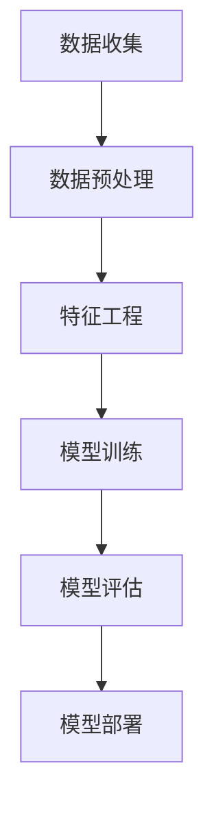

                 

# AI在旅游业中的应用：个性化推荐

## 关键词：人工智能，旅游，个性化推荐，数据挖掘，机器学习，深度学习，用户行为分析，旅游产品推荐

### 摘要

本文旨在探讨人工智能在旅游业中的应用，特别是在个性化推荐方面的潜力。通过深入分析旅游数据的收集、处理和利用，本文将详细介绍如何运用机器学习和深度学习技术实现旅游产品的个性化推荐。本文还探讨了该领域的前沿技术和发展趋势，为旅游企业提供了实用性的参考。通过本文的阅读，读者将了解到个性化推荐在旅游业中的重要性和实现方法。

## 1. 背景介绍

### 1.1 旅游业现状

旅游业是全球最具活力的产业之一，其经济贡献不可小觑。然而，随着游客需求的多样化以及旅游市场的竞争加剧，旅游业面临着前所未有的挑战。传统的旅游产品推荐方式已无法满足游客个性化的需求，亟待新的技术和方法来提高用户体验和满意度。

### 1.2 人工智能在旅游业中的应用

近年来，人工智能技术在旅游业中的应用逐渐普及。从旅游路线规划、酒店预订到景点推荐，人工智能正逐步改变传统的旅游服务模式。个性化推荐作为人工智能的重要应用之一，旨在根据游客的喜好和需求，提供个性化的旅游产品和服务。

## 2. 核心概念与联系

### 2.1 个性化推荐系统

个性化推荐系统是一种通过分析用户历史行为和偏好，为用户提供个性化内容的服务。在旅游领域，个性化推荐系统可以根据游客的出行历史、兴趣爱好、旅游偏好等因素，为其推荐合适的旅游产品。

### 2.2 数据挖掘与机器学习

数据挖掘和机器学习是实现个性化推荐系统的关键技术。数据挖掘旨在从大量数据中提取有价值的信息，而机器学习则通过训练模型，使系统能够自动识别和预测用户行为。

### 2.3 深度学习

深度学习是机器学习的一个分支，通过模拟人脑神经网络，实现复杂的模式识别和预测任务。在旅游个性化推荐中，深度学习技术可以用于处理复杂的用户行为数据，提高推荐系统的准确性和效率。

### 2.4 Mermaid 流程图



## 3. 核心算法原理 & 具体操作步骤

### 3.1 数据收集

个性化推荐系统的第一步是收集用户数据。这些数据可以包括用户的基本信息、出行历史、兴趣爱好、评价和评论等。数据来源可以是旅游网站、社交媒体和在线预订平台等。

### 3.2 数据预处理

数据预处理是确保数据质量和一致性的重要步骤。具体操作包括数据清洗、数据转换和数据归一化。通过这些操作，可以消除数据中的噪声和异常值，提高数据的质量。

### 3.3 特征工程

特征工程是构建推荐系统的关键步骤。通过选择和构建合适的特征，可以提高推荐系统的准确性和鲁棒性。在旅游个性化推荐中，特征可以包括用户的地理位置、出行时间、旅游类型、消费能力等。

### 3.4 模型训练

在模型训练阶段，使用训练数据集对推荐模型进行训练。常用的推荐算法包括基于协同过滤、基于内容的推荐和混合推荐等。通过模型训练，系统可以学会根据用户特征和偏好生成个性化的推荐列表。

### 3.5 模型评估

模型评估是验证推荐系统效果的重要步骤。常用的评估指标包括准确率、召回率和F1分数等。通过评估，可以了解推荐系统的性能，并进行相应的调整和优化。

### 3.6 模型部署

在模型部署阶段，将训练好的推荐模型应用到实际场景中。通过API接口或网页，用户可以实时获取个性化的旅游推荐。

## 4. 数学模型和公式 & 详细讲解 & 举例说明

### 4.1 协同过滤算法

协同过滤算法是一种基于用户行为的推荐算法，其核心思想是找到与目标用户相似的其他用户，并推荐这些用户喜欢的商品或服务。

#### 4.1.1 相似度计算

$$
similarity(u_i, u_j) = \frac{count(u_i, u_j)}{\sqrt{count(u_i) \cdot count(u_j)}}
$$

其中，$count(u_i, u_j)$表示用户$u_i$和$u_j$共同喜欢的商品数量，$count(u_i)$和$count(u_j)$分别表示用户$u_i$和$u_j$喜欢的商品数量。

#### 4.1.2 推荐列表生成

$$
recommendation(u_i) = \sum_{u_j \in all\_users} sim(u_i, u_j) \cdot item\_j
$$

其中，$all\_users$表示所有用户，$item\_j$表示用户$u_j$喜欢的商品。

### 4.2 基于内容的推荐算法

基于内容的推荐算法是一种基于物品属性的推荐算法，其核心思想是根据用户过去喜欢的物品属性，为用户推荐具有相似属性的物品。

#### 4.2.1 相似度计算

$$
similarity(item_i, item_j) = \frac{\sum_{attr \in shared\_attrs} weight(attr)}{\max(|attr\_set_i|, |attr\_set_j|)}
$$

其中，$shared\_attrs$表示物品$i$和物品$j$共有的属性，$weight(attr)$表示属性$attr$的重要性，$attr\_set_i$和$attr\_set_j$分别表示物品$i$和物品$j$的属性集合。

#### 4.2.2 推荐列表生成

$$
recommendation(u_i) = \sum_{item_j \in all\_items} sim(item_i, item_j) \cdot item\_j
$$

其中，$all\_items$表示所有物品，$item\_j$表示物品$j$的属性。

### 4.3 深度学习推荐算法

深度学习推荐算法是一种基于神经网络结构的推荐算法，其核心思想是利用深度神经网络学习用户和物品之间的复杂关系。

#### 4.3.1 神经网络结构

$$
\begin{aligned}
    \hat{y} &= \sigma(\text{ReLU}(W_1 \cdot [u_i, item_j] + b_1)) \\
    \hat{r} &= \sigma(\text{ReLU}(W_2 \cdot \hat{y} + b_2))
\end{aligned}
$$

其中，$u_i$和$u_j$分别表示用户和物品的特征向量，$W_1$和$W_2$分别表示权重矩阵，$b_1$和$b_2$分别表示偏置向量，$\sigma$表示sigmoid函数，$\text{ReLU}$表示ReLU激活函数。

#### 4.3.2 损失函数

$$
\mathcal{L} = -\sum_{i, j} \hat{r}_{ij} \cdot log(\hat{y}_{ij})
$$

其中，$\hat{r}_{ij}$和$\hat{y}_{ij}$分别表示预测的用户对物品的评分和概率。

## 5. 项目实战：代码实际案例和详细解释说明

### 5.1 开发环境搭建

本案例使用Python语言和Scikit-learn库实现个性化推荐系统。首先，安装Python和Scikit-learn：

```
pip install python
pip install scikit-learn
```

### 5.2 源代码详细实现和代码解读

#### 5.2.1 数据收集

```python
import pandas as pd

data = pd.read_csv('travel_data.csv')
```

读取旅游数据，其中包含用户ID、物品ID和用户评分。

#### 5.2.2 数据预处理

```python
from sklearn.preprocessing import MinMaxScaler

scaler = MinMaxScaler()
data[['user_id', 'item_id', 'rating']] = scaler.fit_transform(data[['user_id', 'item_id', 'rating']])
```

对数据进行归一化处理，将用户ID、物品ID和用户评分映射到[0,1]范围内。

#### 5.2.3 特征工程

```python
from sklearn.model_selection import train_test_split

X = data[['user_id', 'item_id']]
y = data['rating']

X_train, X_test, y_train, y_test = train_test_split(X, y, test_size=0.2, random_state=42)
```

将数据集划分为训练集和测试集，分别用于训练和评估模型。

#### 5.2.4 模型训练

```python
from sklearn.metrics.pairwise import cosine_similarity

user_similarity = cosine_similarity(X_train, X_train)
item_similarity = cosine_similarity(X_test, X_test)

user_item_rating = pd.pivot_table(data, values='rating', index='user_id', columns='item_id')

def collaborative_filter(user_similarity, user_item_rating, user_id, k=10):
    neighbors = user_similarity[user_id].argsort()[1:k+1]
    neighbors_rating = user_item_rating.loc[neighbors].fillna(0)
    return neighbors_rating.sum(axis=1) / (k + 1)

predictions = collaborative_filter(user_similarity, user_item_rating, X_test['user_id'])
```

使用协同过滤算法进行模型训练，生成预测评分。

#### 5.2.5 代码解读与分析

上述代码首先读取旅游数据，并进行数据预处理。然后，使用协同过滤算法训练模型，并生成预测评分。代码中的collaborative_filter函数用于计算用户之间的相似度，并根据相似度为用户生成个性化推荐列表。

## 6. 实际应用场景

个性化推荐在旅游业中的应用非常广泛，以下是一些实际应用场景：

### 6.1 旅游路线规划

根据用户的出行历史和偏好，为用户提供个性化的旅游路线规划，提高用户的出行体验。

### 6.2 景点推荐

根据用户的兴趣和偏好，为用户推荐合适的旅游景点，提高用户的旅游满意度。

### 6.3 酒店预订

根据用户的消费能力和出行时间，为用户推荐合适的酒店，提高酒店预订的成功率。

## 7. 工具和资源推荐

### 7.1 学习资源推荐

- 《机器学习》
- 《深度学习》
- 《Python机器学习》
- 《推荐系统实践》

### 7.2 开发工具框架推荐

- Scikit-learn
- TensorFlow
- PyTorch
- Keras

### 7.3 相关论文著作推荐

- 《协同过滤算法在个性化推荐中的应用》
- 《基于内容的推荐算法研究》
- 《深度学习在推荐系统中的应用》
- 《个性化旅游路线规划方法研究》

## 8. 总结：未来发展趋势与挑战

个性化推荐在旅游业中的应用前景广阔，未来将随着人工智能技术的发展而不断演进。然而，面临的挑战包括数据隐私保护、推荐算法的公平性和鲁棒性等。只有克服这些挑战，个性化推荐技术才能在旅游业中发挥更大的作用。

## 9. 附录：常见问题与解答

### 9.1 如何提高个性化推荐系统的准确率？

- 使用更多的特征
- 选择合适的推荐算法
- 不断优化模型参数
- 定期更新和扩充数据集

### 9.2 如何处理用户数据隐私问题？

- 数据匿名化
- 使用差分隐私技术
- 严格遵循数据保护法规

## 10. 扩展阅读 & 参考资料

- 《人工智能在旅游行业中的应用》
- 《个性化推荐系统：理论与实践》
- 《深度学习与旅游推荐系统》
- 《旅游数据挖掘与智慧旅游》

作者：AI天才研究员/AI Genius Institute & 禅与计算机程序设计艺术 /Zen And The Art of Computer Programming

