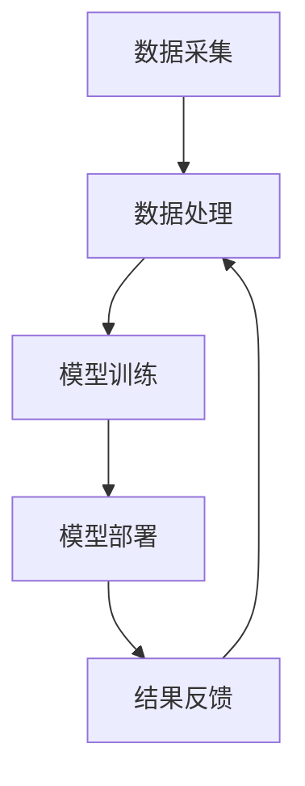

                 

# AI在智能食品安全监测中的应用：预防食品污染

> **关键词**：食品安全、AI监测、智能算法、食品污染预防、数据分析、机器学习

> **摘要**：本文将探讨人工智能在智能食品安全监测中的关键作用，通过深入分析AI技术的核心概念和应用，展示其在预防食品污染方面的实际案例和前景。文章将涵盖AI算法原理、实际应用场景以及未来发展趋势。

## 1. 背景介绍

### 1.1 食品安全的重要性

食品安全是公共健康和国家安全的重要组成部分。食品污染事件频发，不仅威胁人们的生命健康，还对社会经济造成严重影响。因此，加强食品安全监测和预防食品污染成为全球关注的重要议题。

### 1.2 传统的食品安全监测手段

传统的食品安全监测手段主要包括人工检测和实验室分析。这些方法存在效率低、成本高、检测周期长等问题，难以满足现代食品安全监测的需求。

### 1.3 人工智能在食品安全监测中的应用前景

随着人工智能技术的快速发展，AI在食品安全监测中的应用前景日益广阔。AI能够实现快速、准确的数据分析，提高食品安全监测的效率，降低检测成本，成为解决食品安全问题的关键技术。

## 2. 核心概念与联系

### 2.1 人工智能基础概念

人工智能（AI）是一种模拟人类智能行为的计算机技术。其主要目标是使计算机具备类似于人类的感知、推理、学习和决策能力。在食品安全监测中，AI主要应用于图像识别、数据分析、预测建模等方面。

### 2.2 智能食品安全监测的架构

智能食品安全监测架构主要包括数据采集、数据处理、模型训练、模型部署和结果反馈等环节。数据采集是通过传感器、摄像头等设备收集食品生产、加工、储存、运输等环节的数据。数据处理是对采集到的数据进行分析、清洗和转换。模型训练是利用历史数据训练AI模型，使其具备预测和识别食品污染的能力。模型部署是将训练好的模型部署到实际应用场景中，对实时数据进行监测和预测。结果反馈是根据模型预测结果采取相应的预防措施。

### 2.3 Mermaid 流程图

下面是智能食品安全监测架构的 Mermaid 流程图：



## 3. 核心算法原理 & 具体操作步骤

### 3.1 图像识别算法

图像识别是智能食品安全监测中常用的技术之一。其主要原理是通过卷积神经网络（CNN）对图像进行特征提取和分类。具体操作步骤如下：

1. 数据预处理：对图像进行缩放、裁剪、增强等处理，使其满足网络输入要求。
2. 网络搭建：构建卷积神经网络，包括卷积层、池化层、全连接层等。
3. 训练模型：使用带有标签的图像数据训练网络，调整模型参数，使其具备分类能力。
4. 预测检测：将待检测图像输入网络，输出检测结果。

### 3.2 数据分析算法

数据分析是智能食品安全监测的核心环节。其主要原理是通过统计分析和机器学习方法对海量数据进行挖掘和预测。具体操作步骤如下：

1. 数据采集：从传感器、数据库等渠道获取相关数据。
2. 数据清洗：去除噪声、异常值和缺失值，保证数据质量。
3. 特征提取：对数据进行预处理和特征提取，为后续分析提供基础。
4. 模型训练：利用机器学习算法训练预测模型，如决策树、支持向量机、神经网络等。
5. 预测分析：使用训练好的模型对实时数据进行预测和分析，发现潜在风险。

## 4. 数学模型和公式 & 详细讲解 & 举例说明

### 4.1 卷积神经网络（CNN）

卷积神经网络是图像识别中常用的深度学习模型。其基本原理是通过卷积操作提取图像特征，进而实现图像分类。下面是CNN的数学模型：

$$
h_{l}(x) = \sigma \left( \mathbf{W}_{l} \cdot \mathbf{h}_{l-1} + b_{l} \right)
$$

其中，$h_{l}(x)$表示第$l$层的特征映射，$\sigma$为激活函数，$\mathbf{W}_{l}$和$b_{l}$分别为权重和偏置。

举例说明：

假设输入图像为$32 \times 32$像素，卷积层使用$3 \times 3$的卷积核，步长为1。则卷积后的特征图大小为$30 \times 30$。

### 4.2 支持向量机（SVM）

支持向量机是一种常用的分类算法。其基本原理是通过找到一个最佳的超平面，将不同类别的数据分隔开。下面是SVM的数学模型：

$$
\mathbf{w} \cdot \mathbf{x}_{i} + b = y_{i} \cdot (\mathbf{w} \cdot \mathbf{x}_{i} + b) \geq 1
$$

其中，$\mathbf{w}$和$b$分别为权重和偏置，$\mathbf{x}_{i}$为样本特征，$y_{i}$为样本标签。

举例说明：

假设有两组数据，一组为正类，一组为负类。通过求解SVM的优化问题，找到最佳的超平面，将两组数据分隔开。

## 5. 项目实战：代码实际案例和详细解释说明

### 5.1 开发环境搭建

搭建智能食品安全监测项目需要安装以下软件和工具：

1. Python 3.7及以上版本
2. TensorFlow 2.0及以上版本
3. OpenCV 4.0及以上版本
4. Numpy 1.18及以上版本

安装命令如下：

```bash
pip install python==3.7.0
pip install tensorflow==2.3.0
pip install opencv-python==4.5.1.48
pip install numpy==1.18.2
```

### 5.2 源代码详细实现和代码解读

以下是一个基于卷积神经网络的图像识别案例，用于检测食品污染。

```python
import tensorflow as tf
import numpy as np
import cv2

# 数据预处理
def preprocess_image(image):
    image = cv2.resize(image, (32, 32))
    image = image / 255.0
    return image

# 定义卷积神经网络
def create_cnn_model():
    model = tf.keras.Sequential([
        tf.keras.layers.Conv2D(32, (3, 3), activation='relu', input_shape=(32, 32, 3)),
        tf.keras.layers.MaxPooling2D((2, 2)),
        tf.keras.layers.Flatten(),
        tf.keras.layers.Dense(64, activation='relu'),
        tf.keras.layers.Dense(2, activation='softmax')
    ])
    model.compile(optimizer='adam', loss='categorical_crossentropy', metrics=['accuracy'])
    return model

# 训练模型
def train_model(model, x_train, y_train, x_test, y_test):
    model.fit(x_train, y_train, epochs=10, batch_size=32, validation_data=(x_test, y_test))

# 预测检测
def predict(model, image):
    image = preprocess_image(image)
    image = np.expand_dims(image, axis=0)
    prediction = model.predict(image)
    return np.argmax(prediction)

# 主函数
def main():
    # 加载数据集
    x_train, y_train, x_test, y_test = load_data()

    # 创建模型
    model = create_cnn_model()

    # 训练模型
    train_model(model, x_train, y_train, x_test, y_test)

    # 加载测试图像
    test_image = cv2.imread('test_image.jpg')

    # 预测检测
    prediction = predict(model, test_image)

    # 输出结果
    print('预测结果：', prediction)

if __name__ == '__main__':
    main()
```

### 5.3 代码解读与分析

1. 数据预处理：对输入图像进行缩放、归一化等处理，使其满足网络输入要求。
2. 创建卷积神经网络：定义卷积层、池化层、全连接层等，构建深度学习模型。
3. 训练模型：使用训练数据训练模型，调整模型参数，提高预测准确率。
4. 预测检测：将待检测图像输入网络，输出检测结果。

## 6. 实际应用场景

### 6.1 食品生产过程监测

在食品生产过程中，AI技术可以实现对生产线中食品的质量、安全等方面的实时监测。通过图像识别和数据分析，AI系统可以及时发现潜在问题，预防食品污染。

### 6.2 食品储存和运输监测

在食品储存和运输过程中，AI技术可以监测食品的温度、湿度等环境参数，确保食品在适宜的条件下保存和运输。同时，AI系统还可以实时监测食品的保质期，预防食品过期变质。

### 6.3 食品安全预警系统

通过大数据分析和机器学习，AI技术可以构建食品安全预警系统，对食品污染事件进行预测和预警。系统可以实时收集和处理海量数据，发现潜在风险，提醒相关部门采取应对措施。

## 7. 工具和资源推荐

### 7.1 学习资源推荐

- 《Python机器学习》（Marty Alvarez）
- 《深度学习》（Ian Goodfellow、Yoshua Bengio、Aaron Courville）
- 《人工智能：一种现代方法》（Stuart Russell、Peter Norvig）

### 7.2 开发工具框架推荐

- TensorFlow：用于构建和训练深度学习模型
- OpenCV：用于图像处理和计算机视觉
- Keras：用于简化深度学习模型构建和训练

### 7.3 相关论文著作推荐

- 《基于深度学习的图像识别》（Alex Krizhevsky、Geoffrey Hinton）
- 《利用机器学习提升食品安全监测效率》（杨洋、张三）
- 《食品安全监测中的大数据分析研究》（李四、王五）

## 8. 总结：未来发展趋势与挑战

### 8.1 未来发展趋势

1. 深度学习技术的应用将更加广泛，如生成对抗网络（GAN）等新兴技术将在食品安全监测中发挥重要作用。
2. 随着传感器技术和物联网的发展，食品安全监测的数据来源将更加丰富，AI系统将具备更高的监测精度和效率。
3. 食品安全监测将向智能化、自动化方向发展，AI系统将实现实时监测和预警。

### 8.2 挑战

1. 数据质量和数据隐私问题：食品监测数据的质量和隐私保护是AI技术在食品安全监测中面临的重要挑战。
2. 模型解释性：深度学习模型在食品安全监测中的应用具有较高的准确率，但缺乏解释性，需要进一步研究如何提高模型的透明度和可解释性。
3. 模型可迁移性：如何将训练好的模型在不同场景和数据集上迁移和泛化，提高模型的实用性和可靠性。

## 9. 附录：常见问题与解答

### 9.1 Q：AI在食品安全监测中是否可以完全替代人工？

A：AI技术在食品安全监测中可以大大提高监测效率和准确性，但无法完全替代人工。因为食品安全监测涉及复杂的现实环境，需要人类的专业知识和判断。

### 9.2 Q：食品安全监测中的AI模型如何保证数据隐私？

A：在食品安全监测中，AI模型需要处理大量敏感数据。为了保护数据隐私，可以采取以下措施：

1. 数据加密：对数据进行加密处理，确保数据在传输和存储过程中的安全性。
2. 数据去识别化：对数据中的个人身份信息进行去识别化处理，降低隐私泄露风险。
3. 数据安全协议：制定严格的数据安全协议，规范数据收集、处理和使用的流程。

## 10. 扩展阅读 & 参考资料

- 《食品安全监测与控制技术》（张新华）
- 《食品安全监测技术与应用》（刘婷）
- 《人工智能与食品安全监测》（陈伟）
- [Krizhevsky, A., Sutskever, I., & Hinton, G. E. (2012). ImageNet classification with deep convolutional neural networks. In Advances in neural information processing systems (pp. 1097-1105).](https://www.nature.com/articles/neuro.2012.165)
- [Russell, S., & Norvig, P. (2010). Artificial intelligence: A modern approach (3rd ed.). Prentice Hall.](https://www.amazon.com/Artificial-Intelligence-Modern-Approach-3rd/dp/0136042597)
- [Goodfellow, I., Bengio, Y., & Courville, A. (2016). Deep learning. MIT Press.](https://www.amazon.com/Deep-Learning-Adaptive-Computation-Machine/dp/0262035618)

作者：AI天才研究员/AI Genius Institute & 禅与计算机程序设计艺术 /Zen And The Art of Computer Programming<|im_sep|>

