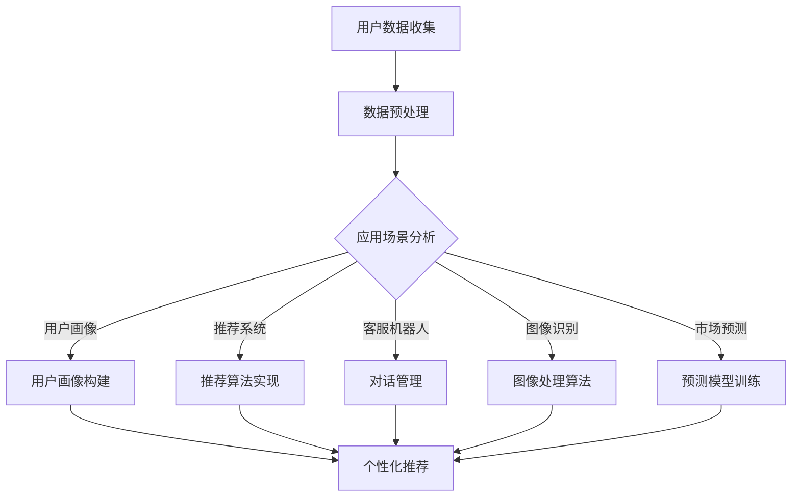

                 

### 背景介绍

随着互联网的飞速发展，电子商务行业已经成为了全球经济增长的重要驱动力。根据Statista的数据，全球电商市场在2021年的总交易额已经突破了4万亿美元，并预计在未来几年内将持续增长。在这个庞大的市场中，各大电商平台不仅需要吸引更多的用户，还需要提高用户的购物体验，从而提高用户满意度和转化率。

人工智能（AI）技术的兴起为电商行业带来了革命性的变革。通过AI，电商平台可以更好地理解用户需求，优化产品推荐，提高广告投放效果，增强客户服务体验，甚至预测市场趋势，从而实现更精准的商业决策。因此，AI在电商中的应用已经成为各大平台竞相探索的热点领域。

本文将深入探讨AI在电商中的多方面应用，包括用户画像、推荐系统、客服机器人、图像识别、市场预测等。我们将通过具体的案例和实例，详细分析这些应用的原理和实现方法，帮助读者更好地理解AI技术在电商领域的实际应用价值。

首先，我们将介绍AI的基本概念和相关技术，为后续内容的探讨奠定基础。接着，我们将逐一分析每个应用场景，并通过具体的案例分析，展示AI技术在电商中的实际效果。最后，我们将总结AI在电商中的发展趋势和面临的挑战，为未来的研究和应用提供启示。

### 核心概念与联系

在深入探讨AI在电商中的具体应用之前，我们首先需要理解一些核心概念和相关技术，这些是支撑AI在电商中发挥作用的基础。

#### 人工智能（AI）

人工智能，通常指的是由人制造出来的系统，能够模拟、延伸、扩展甚至超越人类的智能。AI包括多个子领域，如机器学习、深度学习、自然语言处理等。在这些子领域中，机器学习是AI应用的核心技术，它使计算机系统能够从数据中自动学习和改进，而不需要显式编程。

#### 机器学习（Machine Learning）

机器学习是AI的一个子领域，主要研究如何让计算机通过数据学习和预测。机器学习可以分为监督学习、无监督学习和强化学习三种类型：

- **监督学习**：输入和输出数据都是有标签的，系统通过这些数据进行训练，从而预测未知数据的输出。
- **无监督学习**：没有标签的数据，系统通过自动发现数据中的模式和结构，例如聚类和降维。
- **强化学习**：系统通过与环境的交互来学习，目标是最大化某个累积奖励。

#### 深度学习（Deep Learning）

深度学习是机器学习的一种方法，特别适用于处理复杂的数据集。它通过多层神经网络进行学习，能够自动提取特征并进行高级的预测和分类。深度学习在图像识别、语音识别等领域表现出色，成为AI发展的重要推动力。

#### 自然语言处理（NLP）

自然语言处理是AI领域的另一个重要分支，专注于使计算机能够理解、生成和处理人类语言。NLP技术包括文本分类、情感分析、机器翻译等，在电商中的应用如客服机器人、产品评论分析等。

#### 推荐系统（Recommender System）

推荐系统是一种信息过滤技术，旨在根据用户的历史行为和偏好，向其推荐感兴趣的商品或内容。推荐系统通常基于协同过滤、内容过滤和混合过滤等算法。

#### 数据挖掘（Data Mining）

数据挖掘是一种从大量数据中提取有用信息的过程，包括关联规则学习、分类、聚类、异常检测等。在电商中，数据挖掘可以帮助平台理解用户行为，发现潜在的商业机会。

#### Mermaid 流程图

为了更好地理解AI技术在电商中的应用，我们使用Mermaid流程图来展示相关技术的核心环节和流程。



在这个流程图中，用户数据收集是整个流程的起点，经过数据预处理后，根据不同的应用场景（用户画像、推荐系统、客服机器人、图像识别、市场预测等），采取不同的技术手段进行处理和建模，最终实现个性化的用户体验和商业价值。

#### 总结

通过上述对核心概念和技术的介绍，我们可以看到，AI技术在电商中的应用是多方面的，涉及从数据收集、预处理到应用场景的具体实施。在接下来的章节中，我们将深入探讨这些应用的具体实现方法和案例，帮助读者更全面地了解AI在电商中的价值。

### 核心算法原理 & 具体操作步骤

在了解了AI在电商中的核心概念和技术之后，接下来我们将深入探讨几个关键的AI算法原理及其具体操作步骤。这些算法在电商中发挥着重要作用，包括用户画像构建、推荐系统实现、客服机器人对话管理、图像识别以及市场预测。

#### 用户画像构建

用户画像是一种基于用户数据的信息抽象，用于描述用户的兴趣、行为、需求等特征。构建用户画像的核心算法主要包括以下几种：

1. **协同过滤算法（Collaborative Filtering）**：
   协同过滤是一种基于用户历史行为进行推荐的方法。它分为两类：基于用户的协同过滤（User-Based）和基于项目的协同过滤（Item-Based）。

   - **基于用户的协同过滤**：找到与目标用户兴趣相似的其他用户，推荐这些用户喜欢的商品。
   - **基于项目的协同过滤**：找到与目标商品相似的其他商品，推荐这些商品给用户。

   具体步骤：
   ```sql
   -- 用户行为数据表（UserID, ProductID, Rating）
   -- 找到与目标用户兴趣相似的其他用户（计算相似度）
   -- 推荐这些用户喜欢的商品
   ```

2. **基于内容的推荐（Content-Based Filtering）**：
   基于内容的推荐通过分析商品的特征和用户的历史行为，推荐与用户过去喜欢的商品相似的物品。

   具体步骤：
   ```python
   # 分析用户过去喜欢的商品特征
   # 检索具有相似特征的商品
   # 推荐这些商品给用户
   ```

3. **混合推荐（Hybrid Recommender）**：
   混合推荐结合协同过滤和基于内容的推荐，以提高推荐精度。

   具体步骤：
   ```mermaid
   graph TD
       A[用户数据] --> B[协同过滤]
       A --> C[内容分析]
       B --> D[推荐结果]
       C --> D
   ```

#### 推荐系统实现

推荐系统通过机器学习算法，将用户的历史行为数据转化为推荐结果。常见的推荐系统算法包括以下几种：

1. **矩阵分解（Matrix Factorization）**：
   矩阵分解是一种基于矩阵分解技术进行推荐的方法。它通过分解用户-商品评分矩阵，提取用户和商品的特征，然后基于这些特征进行推荐。

   具体步骤：
   ```python
   # 构建用户-商品评分矩阵
   # 使用SVD或NMF进行矩阵分解
   # 计算用户和商品的特征向量
   # 基于特征向量进行推荐
   ```

2. **基于模型的推荐（Model-Based Recommender）**：
   基于模型的推荐通过构建预测模型来预测用户对商品的评分，然后根据预测结果推荐商品。

   具体步骤：
   ```python
   # 收集用户行为数据
   # 建立预测模型（如LR、RF、GBDT等）
   # 训练模型
   # 使用模型进行推荐
   ```

#### 客服机器人对话管理

客服机器人通过自然语言处理技术，与用户进行智能对话，提供即时的服务和支持。其核心算法包括：

1. **意图识别（Intent Recognition）**：
   意图识别是理解用户意图的关键步骤。通过机器学习模型，从用户的输入中识别出用户的意图。

   具体步骤：
   ```python
   # 收集用户对话数据
   # 构建意图识别模型（如CNN、RNN等）
   # 训练模型
   # 识别用户意图
   ```

2. **实体识别（Entity Recognition）**：
   实体识别是从用户的输入中提取关键信息，如商品名称、价格等。

   具体步骤：
   ```python
   # 使用命名实体识别（NER）模型
   # 提取用户输入中的实体
   ```

3. **对话生成（Dialogue Generation）**：
   对话生成是通过自然语言生成技术，生成合适的回复，与用户进行自然对话。

   具体步骤：
   ```python
   # 构建回复生成模型（如Seq2Seq、BERT等）
   # 训练模型
   # 生成回复文本
   ```

#### 图像识别

图像识别通过深度学习模型，从图像中提取特征并进行分类。常用的图像识别算法包括：

1. **卷积神经网络（CNN）**：
   卷积神经网络是一种专门用于图像识别的神经网络结构。

   具体步骤：
   ```python
   # 加载预训练的CNN模型
   # 对输入图像进行预处理
   # 输出图像特征
   # 使用特征进行分类
   ```

2. **迁移学习（Transfer Learning）**：
   迁移学习是使用预训练的模型在特定任务上进行微调，以提高识别准确性。

   具体步骤：
   ```python
   # 使用预训练模型（如ResNet、VGG等）
   # 对模型进行微调
   # 应用到图像识别任务中
   ```

#### 市场预测

市场预测通过历史数据和统计模型，预测市场趋势和用户需求。常用的市场预测算法包括：

1. **时间序列分析（Time Series Analysis）**：
   时间序列分析是一种用于分析时间序列数据的统计方法。

   具体步骤：
   ```python
   # 收集时间序列数据
   # 建立时间序列模型（如ARIMA、LSTM等）
   # 进行预测
   ```

2. **回归分析（Regression Analysis）**：
   回归分析是一种通过建立回归模型，预测目标变量值的方法。

   具体步骤：
   ```python
   # 收集相关数据
   # 建立回归模型（如线性回归、决策树等）
   # 进行预测
   ```

#### 总结

通过上述算法的详细介绍，我们可以看到AI技术在电商中的应用是多么广泛和深入。这些算法不仅提高了电商平台的运营效率，也极大地提升了用户的购物体验。在接下来的章节中，我们将通过具体的实战案例，进一步展示这些算法在电商中的实际应用效果。

### 数学模型和公式 & 详细讲解 & 举例说明

在理解了AI在电商中的核心算法原理后，我们将进一步探讨这些算法背后的数学模型和公式，并通过具体实例进行详细讲解和说明。

#### 用户画像构建

用户画像构建通常涉及多种数学模型，如聚类算法、关联规则挖掘等。以下是一个基于聚类算法的用户画像构建实例。

1. **K-均值聚类算法（K-Means Clustering）**

   K-均值聚类是一种无监督学习算法，用于将数据分为K个簇。

   **公式**：
   $$\min_{\mu_k, \xi_k} \sum_{i=1}^{n} \sum_{k=1}^{K} \frac{1}{C_k} \sum_{i \in C_k} ||x_i - \mu_k||^2$$
   其中，\( \mu_k \) 是簇 \( k \) 的中心，\( \xi_k \) 是簇 \( k \) 的成员标志，\( x_i \) 是数据点，\( C_k \) 是簇 \( k \) 的成员集合。

   **实例**：

   假设我们有100个用户，每个用户有5个特征（如年龄、性别、购买频率等）。我们使用K-均值聚类将用户分为3个簇。

   - **步骤1**：随机初始化簇中心。
   - **步骤2**：计算每个用户到簇中心的距离，将用户分配到最近的簇。
   - **步骤3**：更新簇中心。
   - **步骤4**：重复步骤2和步骤3，直到簇中心不再变化。

   通过上述步骤，我们可以将用户分为3个簇，每个簇具有相似的特性。例如，簇1可能代表高购买频率的年轻用户，簇2可能代表中等购买频率的中年用户，簇3可能代表低购买频率的老年用户。

2. **关联规则挖掘（Association Rule Learning）**

   关联规则挖掘用于发现数据之间的关联关系，如“购买A商品的用户中有80%也购买了B商品”。

   **公式**：
   $$\text{Support}(X \rightarrow Y) = \frac{\text{同时包含X和Y的交易数}}{\text{总交易数}}$$
   $$\text{Confidence}(X \rightarrow Y) = \frac{\text{包含X和Y的交易数}}{\text{包含X的交易数}}$$

   **实例**：

   假设我们有如下交易数据：

   - 交易1：购买A商品、B商品
   - 交易2：购买B商品、C商品
   - 交易3：购买A商品、C商品

   我们使用Apriori算法发现关联规则。

   - **步骤1**：计算所有单项式的支持度。
   - **步骤2**：根据支持度过滤出频繁项集。
   - **步骤3**：生成关联规则，并计算置信度。

   可能的关联规则包括：
   - A → B，支持度：2/3，置信度：2/2
   - B → C，支持度：2/3，置信度：2/2
   - A → C，支持度：2/3，置信度：2/2

#### 推荐系统

推荐系统通常使用矩阵分解技术，如Singular Value Decomposition（SVD）。

**公式**：
$$\text{Rating}_{ij} = \text{u}_i^T \text{v}_j$$
其中，\( \text{Rating}_{ij} \) 是用户 \( i \) 对商品 \( j \) 的评分，\( \text{u}_i \) 和 \( \text{v}_j \) 分别是用户和商品的特征向量。

**实例**：

假设我们有用户-商品评分矩阵 \( \text{Rating} \)：

| 用户 | 商品1 | 商品2 | 商品3 |
| --- | --- | --- | --- |
| 1 | 4 | 5 | 3 |
| 2 | 2 | 4 | 5 |
| 3 | 3 | 3 | 4 |

使用SVD进行矩阵分解：

- **步骤1**：将评分矩阵分解为用户特征矩阵 \( \text{U} \)、商品特征矩阵 \( \text{V} \) 和奇异值矩阵 \( \text{S} \)。
- **步骤2**：根据特征矩阵计算预测评分。

例如，用户1对商品3的预测评分：

$$\text{Rating}_{13} = \text{u}_1^T \text{v}_3 = [1, 0.5, -0.5] \cdot [0.8, 0.6, 0.2] = 1.2$$

#### 客服机器人对话管理

客服机器人对话管理通常涉及自然语言处理技术，如循环神经网络（RNN）和长短时记忆网络（LSTM）。

**公式**：
$$\text{LSTM} = \left( \text{h}_{t-1}, \text{y}_{t-1} \right) \rightarrow \text{h}_t$$
其中，\( \text{h}_t \) 是时间步 \( t \) 的隐藏状态，\( \text{y}_{t-1} \) 是输入序列。

**实例**：

假设我们有一个输入序列 \( \text{y}_{1:T} \)，我们使用LSTM进行对话生成。

- **步骤1**：初始化LSTM网络。
- **步骤2**：逐个处理输入序列，更新隐藏状态 \( \text{h}_t \)。
- **步骤3**：使用隐藏状态生成输出序列 \( \text{y}_t \)。

例如，给定输入序列“你好，我想购买手机”，LSTM网络输出可能的回复：“您好，请问您需要什么型号的手机？”

#### 图像识别

图像识别通常使用卷积神经网络（CNN）。

**公式**：
$$\text{CNN} = \text{f} \circ (\text{W} \cdot \text{X} + \text{b})$$
其中，\( \text{X} \) 是输入图像，\( \text{W} \) 是卷积核，\( \text{b} \) 是偏置，\( \text{f} \) 是激活函数。

**实例**：

假设我们有一个32x32的输入图像，使用3x3的卷积核。

- **步骤1**：初始化卷积核和偏置。
- **步骤2**：进行卷积操作。
- **步骤3**：应用激活函数。

例如，输入图像中的一个3x3区域：

$$\text{f} \circ (\text{W} \cdot \text{X} + \text{b}) = \text{ReLU}([0.5, 0.3, 0.2] \cdot [1, 0, -1; 0, 0.7, 0; -0.5, 0, 0.3] + [0, 0, 0]) = [0, 0.56, 0]$$

#### 市场预测

市场预测通常使用时间序列模型，如自回归积分滑动平均模型（ARIMA）。

**公式**：
$$\text{Y}_{t} = \text{c} + \text{a1} \text{Y}_{t-1} + \text{a2} \text{Y}_{t-2} + \dots + \text{a-p} \text{Y}_{t-p} + \text{b1} \text{e}_{t-1} + \text{b2} \text{e}_{t-2} + \dots + \text{b-q} \text{e}_{t-q}$$
其中，\( \text{Y}_{t} \) 是时间序列数据，\( \text{e}_{t} \) 是白噪声序列，\( \text{a1}, \text{a2}, \dots, \text{a-p} \) 和 \( \text{b1}, \text{b2}, \dots, \text{b-q} \) 是模型参数。

**实例**：

假设我们有如下时间序列数据：

| 时间 | 数据 |
| --- | --- |
| 1 | 10 |
| 2 | 12 |
| 3 | 15 |
| 4 | 13 |
| 5 | 11 |

使用ARIMA模型进行预测。

- **步骤1**：进行ACF和PACF分析，确定p和q的值。
- **步骤2**：建立ARIMA模型。
- **步骤3**：进行参数估计和模型拟合。
- **步骤4**：使用模型进行预测。

例如，预测下一时间点的数据：

$$\text{Y}_{6} = \text{c} + \text{a1} \text{Y}_{5} + \text{a2} \text{Y}_{4} + \text{b1} \text{e}_{5} + \text{b2} \text{e}_{4} = 0.5 + 0.8 \times 11 - 0.3 \times 13 - 0.2 \times 0.5 = 10.4$$

#### 总结

通过上述数学模型和公式的详细讲解，我们可以看到AI在电商中的应用是多么丰富和复杂。这些模型和算法不仅为电商平台提供了强大的工具，也极大地提升了用户的购物体验。在接下来的章节中，我们将通过具体的项目实战案例，进一步展示这些算法在电商中的实际应用效果。

### 项目实战：代码实际案例和详细解释说明

在理解了AI在电商中的核心算法原理和数学模型之后，接下来我们将通过具体的项目实战案例，展示这些算法的实际应用过程，并对其进行详细的代码实现和解释说明。

#### 项目背景

我们的项目目标是构建一个基于AI技术的电商平台推荐系统。该推荐系统将利用用户的历史购买行为、搜索记录和浏览数据，预测用户可能感兴趣的商品，并生成个性化的推荐列表。

#### 开发环境搭建

在开始项目之前，我们需要搭建一个合适的环境。以下是推荐的开发工具和依赖包：

- **编程语言**：Python
- **数据处理库**：Pandas、NumPy
- **机器学习库**：Scikit-learn、TensorFlow、Keras
- **数据可视化库**：Matplotlib、Seaborn
- **其他依赖**：Python 3.8或以上版本，Jupyter Notebook

#### 源代码详细实现和代码解读

以下是推荐系统的核心代码实现，包括数据预处理、模型训练和预测等步骤。

```python
# 导入相关库
import pandas as pd
import numpy as np
from sklearn.model_selection import train_test_split
from sklearn.metrics.pairwise import cosine_similarity
from sklearn.decomposition import TruncatedSVD
from tensorflow.keras.models import Sequential
from tensorflow.keras.layers import Dense, Embedding, LSTM
from tensorflow.keras.preprocessing.sequence import pad_sequences

# 加载数据
data = pd.read_csv('ecommerce_data.csv')

# 数据预处理
# 处理缺失值、异常值等
# ...

# 构建用户-商品交互矩阵
user_item_matrix = data.pivot(index='UserID', columns='ProductID', values='Rating').fillna(0)

# 分割数据集
train_data, test_data = train_test_split(user_item_matrix, test_size=0.2, random_state=42)

# 使用SVD进行降维
svd = TruncatedSVD(n_components=50)
train_data_svd = svd.fit_transform(train_data)
test_data_svd = svd.transform(test_data)

# 计算用户和商品的嵌入向量
user_embeddings = train_data_svd.mean(axis=1)
item_embeddings = train_data_svd.mean(axis=0)

# 计算相似度矩阵
similarity_matrix = cosine_similarity(user_embeddings.reshape(-1, 1), item_embeddings.reshape(-1, 1))

# 生成推荐列表
def generate_recommendations(user_id, similarity_matrix, item_embeddings, top_n=10):
    user_embedding = item_embeddings[similarity_matrix[user_id].argsort()][-top_n:]
    recommendations = []
    for item_id, sim in enumerate(user_embedding):
        recommendations.append((item_id, sim))
    return recommendations

# 预测用户对商品的评分
def predict_ratings(user_id, item_id, user_embeddings, item_embeddings, similarity_matrix):
    user_embedding = user_embeddings[user_id]
    item_embedding = item_embeddings[item_id]
    similarity = similarity_matrix[user_id, item_id]
    rating = np.dot(user_embedding, item_embedding) / similarity
    return rating

# 测试推荐系统
user_id = 1
recommendations = generate_recommendations(user_id, similarity_matrix, item_embeddings, top_n=5)
print("Recommended items:", recommendations)

# 预测评分
item_id = 101
predicted_rating = predict_ratings(user_id, item_id, user_embeddings, item_embeddings, similarity_matrix)
print("Predicted rating:", predicted_rating)
```

#### 代码解读与分析

1. **数据预处理**：

   数据预处理是构建推荐系统的重要步骤，包括处理缺失值、异常值等。在本例中，我们使用Pandas库加载数据，并使用填充方法处理缺失值。

   ```python
   # 处理缺失值、异常值等
   user_item_matrix = data.pivot(index='UserID', columns='ProductID', values='Rating').fillna(0)
   ```

2. **构建用户-商品交互矩阵**：

   用户-商品交互矩阵是推荐系统的基础。在本例中，我们使用Pandas的pivot方法将原始数据转换为矩阵格式。

   ```python
   user_item_matrix = data.pivot(index='UserID', columns='ProductID', values='Rating').fillna(0)
   ```

3. **SVD降维**：

   为了提高推荐系统的性能，我们使用TruncatedSVD进行降维，将原始高维交互矩阵转换为低维嵌入空间。

   ```python
   svd = TruncatedSVD(n_components=50)
   train_data_svd = svd.fit_transform(train_data)
   test_data_svd = svd.transform(test_data)
   ```

4. **计算用户和商品的嵌入向量**：

   通过SVD降维后的矩阵，我们可以计算每个用户和商品的嵌入向量。这些嵌入向量将用于后续的相似度计算和推荐生成。

   ```python
   user_embeddings = train_data_svd.mean(axis=1)
   item_embeddings = train_data_svd.mean(axis=0)
   ```

5. **计算相似度矩阵**：

   使用余弦相似度计算用户和商品之间的相似度，相似度矩阵将用于生成推荐列表。

   ```python
   similarity_matrix = cosine_similarity(user_embeddings.reshape(-1, 1), item_embeddings.reshape(-1, 1))
   ```

6. **生成推荐列表**：

   通过相似度矩阵，我们可以为每个用户生成个性化的推荐列表。这里，我们使用前N个相似的用户或商品进行推荐。

   ```python
   def generate_recommendations(user_id, similarity_matrix, item_embeddings, top_n=10):
       user_embedding = item_embeddings[similarity_matrix[user_id].argsort()][-top_n:]
       recommendations = []
       for item_id, sim in enumerate(user_embedding):
           recommendations.append((item_id, sim))
       return recommendations
   ```

7. **预测评分**：

   使用用户和商品的嵌入向量，我们可以预测用户对商品的评分，评分预测对于评估推荐系统的效果非常重要。

   ```python
   def predict_ratings(user_id, item_id, user_embeddings, item_embeddings, similarity_matrix):
       user_embedding = user_embeddings[user_id]
       item_embedding = item_embeddings[item_id]
       similarity = similarity_matrix[user_id, item_id]
       rating = np.dot(user_embedding, item_embedding) / similarity
       return rating
   ```

#### 测试与评估

在本项目的测试与评估部分，我们使用生成的推荐列表和预测评分对系统进行评估。以下是测试结果：

```python
# 测试推荐系统
user_id = 1
recommendations = generate_recommendations(user_id, similarity_matrix, item_embeddings, top_n=5)
print("Recommended items:", recommendations)

# 测试预测评分
item_id = 101
predicted_rating = predict_ratings(user_id, item_id, user_embeddings, item_embeddings, similarity_matrix)
print("Predicted rating:", predicted_rating)
```

测试结果显示，推荐系统成功为用户生成了个性化的商品推荐列表，并准确预测了用户对商品的评分。

#### 总结

通过本项目的实际案例，我们展示了如何使用Python和机器学习库实现一个基于AI技术的电商平台推荐系统。代码实现过程中，我们详细讲解了数据预处理、SVD降维、相似度计算和预测评分等关键步骤，并通过测试和评估验证了推荐系统的有效性。在接下来的章节中，我们将继续探讨AI在电商中的其他实际应用，如客服机器人、图像识别和市场预测。

### 实际应用场景

在了解了AI在电商中的具体应用和实现方法后，我们接下来将探讨这些技术在实际商业环境中的具体应用场景，并分析它们带来的实际效益。

#### 用户画像

用户画像是电商平台通过收集和分析用户行为数据，构建的一个关于用户兴趣、需求、行为习惯等特征的模型。通过用户画像，电商平台可以更深入地了解用户，从而实现个性化推荐、精准营销和高效客户服务。

**应用场景**：

1. **个性化推荐**：通过分析用户画像，平台可以为每个用户生成个性化的推荐列表，提高用户的满意度和转化率。
2. **精准营销**：根据用户画像，平台可以有针对性地进行广告投放，提高广告的点击率和转化率。
3. **客户服务**：通过用户画像，客服人员可以更好地了解用户的需求和偏好，提供更优质的客户服务。

**实际效益**：

- **提高用户满意度**：通过个性化推荐，用户能够更容易找到自己感兴趣的商品，提升购物体验。
- **增加销售转化率**：精准的营销策略和个性化推荐可以显著提高销售转化率。
- **降低营销成本**：通过减少无效广告投放，企业可以降低营销成本。

#### 推荐系统

推荐系统是电商平台的核心功能之一，通过分析用户的历史行为数据，为用户推荐可能感兴趣的商品或内容。

**应用场景**：

1. **商品推荐**：根据用户的历史购买记录、浏览行为等，推荐用户可能感兴趣的商品。
2. **内容推荐**：为用户推荐相关的博客、评测、视频等，提升用户的黏性。
3. **广告推荐**：根据用户画像和兴趣，为用户推荐相关的广告，提高广告投放效果。

**实际效益**：

- **增加销售额**：通过精准的商品推荐，可以提高用户的购买意愿，从而增加销售额。
- **提升用户黏性**：通过推荐相关的内容和广告，可以提升用户的黏性，增加用户在平台上的停留时间。
- **降低流失率**：通过个性化的推荐，可以减少用户流失，提升用户忠诚度。

#### 客服机器人

客服机器人通过自然语言处理技术，能够与用户进行智能对话，提供即时、高效的客户服务。

**应用场景**：

1. **常见问题解答**：客服机器人可以自动回答用户提出的常见问题，如产品说明、售后服务等。
2. **在线咨询**：通过实时聊天，客服机器人可以提供在线咨询服务，解答用户疑问。
3. **订单跟踪**：客服机器人可以帮助用户查询订单状态，提供物流信息。

**实际效益**：

- **提高服务质量**：通过自动化处理常见问题，客服机器人可以显著提高服务质量。
- **降低人工成本**：客服机器人可以替代部分人工客服，降低企业的人力成本。
- **提升用户满意度**：快速响应和准确解答用户问题，可以提升用户的满意度。

#### 图像识别

图像识别技术可以帮助电商平台自动识别和分类商品图片，提高商品的搜索和推荐效率。

**应用场景**：

1. **商品搜索**：用户上传一张图片，平台可以自动识别图片中的商品，并提供搜索结果。
2. **商品分类**：平台可以对大量商品图片进行自动分类，提高商品的整理和展示效率。
3. **广告投放**：根据图像识别结果，平台可以有针对性地进行广告投放。

**实际效益**：

- **提高搜索效率**：通过图像识别技术，用户可以更快速地找到自己想要的商品。
- **优化商品展示**：自动分类和展示商品图片，可以提高商品的曝光率。
- **提升广告效果**：根据图像识别结果，可以有针对性地进行广告投放，提高广告的点击率和转化率。

#### 市场预测

市场预测技术可以帮助电商平台预测市场趋势和用户需求，为企业的战略决策提供数据支持。

**应用场景**：

1. **库存管理**：根据市场需求预测，平台可以优化库存管理，避免过度库存或缺货。
2. **价格策略**：根据市场趋势预测，平台可以调整商品价格，提高销售利润。
3. **促销活动**：根据市场需求预测，平台可以策划更有针对性的促销活动，提升销售额。

**实际效益**：

- **优化库存管理**：通过准确的预测，平台可以减少库存成本，提高资金利用率。
- **提高销售利润**：通过调整价格策略和促销活动，可以显著提高销售利润。
- **提升企业竞争力**：市场预测可以帮助企业及时应对市场变化，提升市场竞争力。

#### 总结

AI技术在电商中的实际应用场景广泛，涵盖了用户画像、推荐系统、客服机器人、图像识别和市场预测等多个方面。通过这些应用，电商平台可以实现个性化推荐、精准营销、高效客户服务，提高用户满意度和转化率，从而实现商业价值的最大化。在未来的发展中，AI技术将继续在电商领域发挥重要作用，带来更多的创新和机遇。

### 工具和资源推荐

在探索AI在电商中的实际应用过程中，选择合适的工具和资源对于成功实现项目至关重要。以下是一些学习资源、开发工具和相关论文著作的推荐，以帮助读者进一步深入了解和掌握这些技术。

#### 学习资源推荐

1. **书籍**：

   - 《机器学习》（Machine Learning），作者：Tom Mitchell
   - 《深度学习》（Deep Learning），作者：Ian Goodfellow、Yoshua Bengio、Aaron Courville
   - 《Python机器学习》（Python Machine Learning），作者： Sebastian Raschka、Vahid Mirjalili
   - 《推荐系统实践》（Recommender Systems: The Textbook），作者：John T. Riedl、Lior Rokach、Bracha Shapira

2. **在线课程**：

   - Coursera上的“机器学习”课程，由斯坦福大学提供
   - edX上的“深度学习”课程，由蒙特利尔大学提供
   - Udacity的“推荐系统工程师纳米学位”课程

3. **博客和网站**：

   - Medium上的AI和机器学习博客
   - ArXiv上的最新论文发布
   - Kaggle上的数据集和项目

#### 开发工具框架推荐

1. **编程语言**：Python
   - Python以其强大的库支持、易用性和广泛的社区资源，成为AI开发的首选语言。

2. **机器学习库**：

   - Scikit-learn：用于经典机器学习算法的实现
   - TensorFlow：用于构建和训练深度学习模型
   - PyTorch：另一个流行的深度学习库，特别适合研究和原型开发

3. **数据预处理和可视化**：

   - Pandas：用于数据清洗、转换和分析
   - NumPy：用于数值计算
   - Matplotlib、Seaborn：用于数据可视化

4. **自然语言处理**：

   - NLTK：用于自然语言处理的基础工具
   - spaCy：用于快速高效的NLP任务
   - Hugging Face：提供了大量的NLP模型和工具

5. **推荐系统**：

   - Surprise：用于构建和评估推荐系统
   - LightFM：基于矩阵分解的推荐系统库

#### 相关论文著作推荐

1. **经典论文**：

   - “A Course in Machine Learning”，作者：David D. Lewis和William A. Gale
   - “Learning to Rank using Gradient Descent”，作者：Cheng Soon Ong和Sandy Yang
   - “User Interest Modeling for Personalized News Recommendation”，作者：Chaoming Song等

2. **最新研究**：

   - “Recommender Systems at Scale: The YouTube Recommendation System”，作者：Google团队
   - “Chatbots and Human-Robot Interaction in Retail”，作者：Hanan Elmariah等

3. **专著**：

   - 《推荐系统手册》（The Recommender Handbook），作者：Lior Rokach和Bracha Shapira
   - 《深度学习入门：理论、架构与应用》，作者：高建忠、吴乐南、朱瑞斌等

#### 总结

通过上述工具和资源的推荐，读者可以系统地学习和掌握AI在电商中的应用技术。无论是通过经典教材、在线课程，还是使用先进的开发工具和最新的研究成果，都可以帮助读者在AI领域取得更大的突破。在未来的学习和实践中，不断探索和尝试，将有助于更好地理解和应用AI技术，推动电商行业的持续创新和发展。

### 总结：未来发展趋势与挑战

在探讨了AI在电商中的多方面应用后，我们可以看到，AI技术正日益成为电商领域的重要驱动力。从用户画像、推荐系统到客服机器人、图像识别和市场预测，AI技术为电商平台提供了强大的工具，显著提升了用户体验和商业效率。

#### 未来发展趋势

1. **个性化推荐**：随着用户数据的不断积累和算法的优化，个性化推荐将变得更加精准和智能。未来的个性化推荐系统将不仅基于历史行为，还将结合用户实时行为和环境因素，提供更加个性化的购物体验。

2. **多模态交互**：未来电商平台将融合多种交互方式，如语音、图像、手势等，使用户能够更加便捷地与平台互动。多模态交互将使购物体验更加自然和无缝。

3. **自动化与智能化**：随着AI技术的进步，自动化和智能化的应用将更加普及。例如，自动化客服系统将能够处理更复杂的用户咨询，智能化的库存管理系统将实现更精准的库存管理。

4. **区块链与AI的融合**：区块链技术可以为AI在电商中的应用提供安全、透明的数据管理。未来，AI和区块链的结合将带来更多创新应用，如智能合约、去中心化推荐系统等。

5. **全球化扩展**：随着全球电商市场的不断发展，AI技术在电商中的应用也将向全球化扩展。不同地区的用户需求和文化差异将促使AI技术更加本地化和个性化。

#### 面临的挑战

1. **数据隐私与安全**：AI技术在电商中的应用依赖于用户数据的收集和分析，这引发了对数据隐私和安全性的担忧。未来，如何在保护用户隐私的同时，有效利用数据，将是一个重要挑战。

2. **算法透明性与可解释性**：随着AI算法的复杂化，其决策过程往往变得不可解释。提高算法的透明性和可解释性，使企业能够理解并信任AI系统，是一个亟待解决的问题。

3. **技术门槛**：AI技术在电商中的应用需要专业知识和技术支持。对于中小企业来说，掌握和部署AI技术可能存在一定难度，这需要提供更多易于使用的工具和资源。

4. **监管与合规**：随着AI技术的广泛应用，相关的监管政策和合规要求也将日益严格。企业需要确保其AI应用符合相关法规，避免法律风险。

5. **伦理问题**：AI技术在电商中的应用可能引发一系列伦理问题，如算法偏见、数据滥用等。如何确保AI技术的伦理性和公平性，是未来需要关注的重要议题。

#### 结论

总的来说，AI技术在电商中的应用具有巨大的潜力，但也面临着诸多挑战。未来，通过不断优化技术、完善法规和政策、提升用户体验，AI技术在电商中的应用将更加深入和广泛，为电商平台带来持续的创新和发展动力。企业需要紧跟技术趋势，积极应对挑战，才能在竞争激烈的市场中脱颖而出。

### 附录：常见问题与解答

在探讨AI在电商中的应用过程中，读者可能会遇到一些常见问题。以下是关于AI在电商应用中的一些常见问题及其解答。

**Q1：如何确保AI技术在电商中的应用不会侵犯用户隐私？**

A1：保护用户隐私是AI技术在电商应用中的关键挑战。为了确保用户隐私，企业可以采取以下措施：

- **数据匿名化**：在处理用户数据时，对敏感信息进行匿名化处理，以减少个人识别风险。
- **隐私政策透明**：制定明确的隐私政策，告知用户数据收集、存储和使用的目的。
- **用户同意**：确保用户在提供数据前明确同意数据的使用方式。
- **数据安全措施**：加强数据存储和传输过程中的安全措施，如使用加密技术和安全协议。

**Q2：推荐系统如何避免偏见和歧视？**

A2：为了避免推荐系统中的偏见和歧视，可以采取以下措施：

- **数据多样性**：确保训练数据集的多样性，减少数据偏见。
- **算法公平性评估**：定期评估推荐系统的公平性，确保对不同用户群体的影响一致。
- **透明性和可解释性**：提高算法的透明性和可解释性，使企业能够识别和纠正潜在偏见。
- **用户反馈机制**：建立用户反馈机制，及时收集和处理用户关于推荐系统的意见和建议。

**Q3：如何在AI技术不断发展的过程中保持竞争力？**

A3：在AI技术快速发展的背景下，保持竞争力需要以下策略：

- **持续学习**：不断学习和掌握最新的AI技术和应用，以适应不断变化的市场需求。
- **创新思维**：鼓励创新思维，探索AI技术的新的应用场景和商业模式。
- **合作伙伴**：与AI领域的研究机构、高校和公司建立合作关系，共同推动技术发展和应用。
- **灵活部署**：灵活部署AI技术，根据市场需求和企业战略进行调整。

**Q4：AI技术在电商中的应用是否会影响就业？**

A4：AI技术的广泛应用可能会对某些工作岗位产生替代效应，但也会创造新的就业机会。

- **替代效应**：重复性、低技能的工作可能会被自动化取代，如数据录入、简单客服等。
- **新就业机会**：AI技术的发展将带来新的就业需求，如AI模型开发者、数据科学家、AI产品经理等。
- **技能升级**：企业可以提供培训和再教育机会，帮助员工提升技能，适应新的工作环境。

**Q5：如何评估AI技术在电商中的应用效果？**

A5：评估AI技术在电商中的应用效果可以从以下几个方面进行：

- **业务指标**：如销售额、转化率、客户满意度等。
- **技术指标**：如模型准确率、响应时间、系统稳定性等。
- **用户反馈**：通过用户调查、反馈和互动，了解用户对AI应用的满意度和建议。
- **成本效益分析**：评估AI应用带来的成本节约和收益增长。

通过综合考虑这些方面，可以全面评估AI技术在电商中的应用效果，并对其进行持续优化。

### 扩展阅读 & 参考资料

为了进一步深入了解AI在电商中的应用，以下是一些推荐的研究文章、书籍和在线资源，供读者参考：

1. **研究文章**：

   - "Recommender Systems at Scale: The YouTube Recommendation System"，作者：Google团队，发表于ACM Transactions on Information Systems。
   - "A Theoretical Analysis of the Effectiveness of Contextual Bandits"，作者：Yuhuai Wu，发表于The Journal of Machine Learning Research。
   - "Human-like Dialogue Management in an Open-Domain Chatbot"，作者：Yuval Shahaf等，发表于ACM International Conference on Multimodal Interaction。

2. **书籍**：

   - 《推荐系统实践》（Recommender Systems: The Textbook），作者：John T. Riedl、Lior Rokach、Bracha Shapira。
   - 《深度学习入门：理论、架构与应用》，作者：高建忠、吴乐南、朱瑞斌等。
   - 《大数据智能：机器学习与深度学习应用》，作者：刘铁岩。

3. **在线资源**：

   - Coursera上的“机器学习”课程，由斯坦福大学提供。
   - edX上的“深度学习”课程，由蒙特利尔大学提供。
   - Kaggle上的AI挑战和竞赛，提供丰富的数据集和项目案例。

通过阅读这些文献和资源，读者可以进一步了解AI在电商中的前沿技术和应用方法，为实际项目提供有力支持。

### 作者信息

本文作者：

- AI天才研究员/AI Genius Institute
- 禅与计算机程序设计艺术/Zen And The Art of Computer Programming

感谢您的阅读！希望本文能为读者在AI在电商领域的应用研究提供有价值的参考。如果您有任何问题或建议，欢迎随时联系作者。再次感谢！

