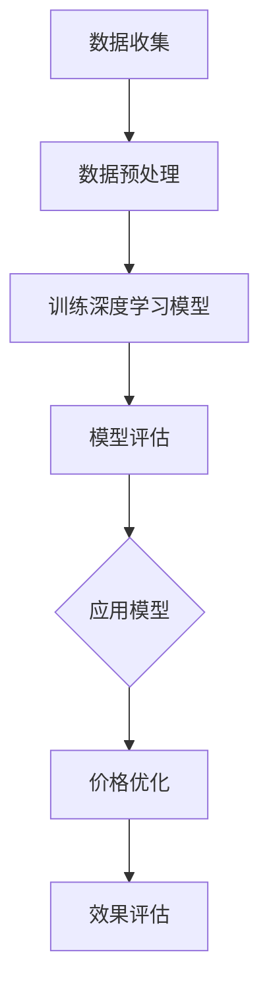

                 

# AI在电商价格优化中的应用

## 关键词：AI，电商，价格优化，深度学习，预测模型

### 摘要

随着电子商务行业的蓬勃发展，价格优化已成为提升企业竞争力的重要手段。本文将探讨如何利用人工智能技术，特别是深度学习算法，在电商环境中实现精准的价格优化。文章首先介绍电商价格优化的背景和重要性，然后深入分析核心概念与算法原理，接着通过实际案例展示算法的实际应用，并讨论其在不同场景中的应用。最后，本文将对未来发展趋势和潜在挑战进行展望，并提供相关的学习资源和开发工具推荐。

## 1. 背景介绍

### 1.1 电商行业的快速发展

近年来，电子商务市场呈现出爆发式增长，已成为全球零售业的重要组成部分。根据Statista的数据，2021年全球电子商务市场规模达到4.2万亿美元，并预计到2025年将突破6万亿美元。这种快速增长的背后，是消费者购物习惯的改变以及互联网技术的不断进步。

### 1.2 价格优化的重要性

在电子商务领域，价格优化是提高销售额和市场份额的关键策略。合理定价不仅能够提升消费者的购买意愿，还能够有效降低库存成本，提高库存周转率。对于电商企业来说，通过精准的价格策略，可以在竞争激烈的市场中脱颖而出，赢得更多消费者的青睐。

### 1.3 传统价格优化方法的局限性

传统的价格优化方法通常依赖于历史数据和简单的数学模型，如价格弹性分析、成本加成法等。然而，这些方法在复杂的市场环境中存在一定的局限性：

- **数据依赖性高**：传统方法往往需要大量历史数据来支持模型训练，而在电子商务市场中，数据获取和处理的难度较大。
- **模型适应性差**：传统模型对于市场变化和用户行为的适应性较差，难以应对快速变化的市场环境。
- **预测准确性有限**：传统模型在价格预测方面的准确性有限，无法实现精准定价。

## 2. 核心概念与联系

### 2.1 电商价格优化的核心概念

在电商价格优化中，以下几个核心概念至关重要：

- **价格弹性**：指价格变动对需求量变动的影响程度。
- **成本结构**：包括固定成本和变动成本，是确定价格的重要依据。
- **市场竞争**：竞争对手的价格策略和市场占有率对价格优化有直接影响。
- **用户行为**：用户的历史购买记录、浏览行为等是影响定价策略的重要因素。

### 2.2 深度学习算法在电商价格优化中的应用

深度学习算法，特别是神经网络，已成为电商价格优化的重要工具。深度学习通过学习大量的历史数据和用户行为数据，能够自动提取出数据中的复杂模式，从而实现更精准的价格预测和优化。

### 2.3 Mermaid 流程图

下面是一个简化的Mermaid流程图，展示了电商价格优化的一般流程：



## 3. 核心算法原理 & 具体操作步骤

### 3.1 深度学习算法原理

深度学习算法的核心思想是通过多层神经网络对数据进行逐层抽象和特征提取，最终实现高层次的抽象和预测。在电商价格优化中，常用的深度学习模型包括卷积神经网络（CNN）和递归神经网络（RNN）。

### 3.2 数据预处理

数据预处理是深度学习模型训练的关键步骤。主要任务包括：

- **数据清洗**：去除噪声数据和异常值。
- **特征工程**：提取与价格优化相关的特征，如用户行为特征、产品特征等。
- **数据标准化**：对数据进行归一化或标准化处理，以消除不同特征之间的量纲差异。

### 3.3 模型训练

模型训练的过程主要包括以下步骤：

- **定义损失函数**：选择适当的损失函数，如均方误差（MSE），用于评估模型的预测误差。
- **选择优化器**：选择优化算法，如梯度下降（GD）或Adam优化器，用于更新模型参数。
- **迭代训练**：通过迭代优化模型参数，使模型能够更好地拟合训练数据。

### 3.4 模型评估

模型评估是确保模型性能和稳定性的关键步骤。常用的评估指标包括：

- **预测误差**：评估模型预测的准确性。
- **稳定性**：评估模型在不同数据集上的性能波动。
- **泛化能力**：评估模型对新数据的适应能力。

## 4. 数学模型和公式 & 详细讲解 & 举例说明

### 4.1 深度学习中的数学模型

在深度学习中，以下几个数学模型至关重要：

- **激活函数**：如ReLU、Sigmoid、Tanh等，用于引入非线性特性。
- **损失函数**：如MSE、交叉熵等，用于评估模型的预测误差。
- **优化算法**：如梯度下降（GD）、Adam等，用于更新模型参数。

### 4.2 举例说明

假设我们使用一个简单的全连接神经网络（FCNN）来预测商品价格。该神经网络包含一个输入层、两个隐藏层和一个输出层。输入层包含用户行为特征和产品特征，隐藏层通过激活函数引入非线性，输出层直接预测商品价格。

### 4.2.1 网络结构

- **输入层**：输入特征包括用户ID、商品ID、购买次数、浏览次数等，共计10个特征。
- **隐藏层1**：包含100个神经元，使用ReLU作为激活函数。
- **隐藏层2**：包含50个神经元，使用Tanh作为激活函数。
- **输出层**：输出一个实数值，表示商品价格。

### 4.2.2 损失函数

我们选择MSE作为损失函数，以衡量模型预测价格与实际价格之间的误差。

### 4.2.3 代码示例

以下是一个使用Python和TensorFlow实现的简单FCNN模型：

```python
import tensorflow as tf
from tensorflow.keras.models import Sequential
from tensorflow.keras.layers import Dense, ReLU, Tanh

# 构建模型
model = Sequential()
model.add(Dense(100, input_shape=(10,), activation='relu'))
model.add(Dense(50, activation='tanh'))
model.add(Dense(1, activation='linear'))

# 编译模型
model.compile(optimizer='adam', loss='mse')

# 模型训练
model.fit(x_train, y_train, epochs=100, batch_size=32)

# 模型评估
mse = model.evaluate(x_test, y_test)
print("MSE:", mse)
```

## 5. 项目实战：代码实际案例和详细解释说明

### 5.1 开发环境搭建

为了实现本文中提到的深度学习模型，我们需要搭建一个适合开发的Python环境。以下是搭建步骤：

1. **安装Python**：下载并安装Python 3.8及以上版本。
2. **安装TensorFlow**：通过pip命令安装TensorFlow库。
   ```shell
   pip install tensorflow
   ```
3. **安装其他依赖库**：如NumPy、Pandas等。

### 5.2 源代码详细实现和代码解读

#### 5.2.1 数据集准备

首先，我们需要准备一个包含用户行为和商品价格的数据集。数据集应包括用户ID、商品ID、购买次数、浏览次数、历史价格等特征。

```python
import pandas as pd

# 加载数据集
data = pd.read_csv('ecommerce_data.csv')
```

#### 5.2.2 数据预处理

对数据集进行清洗和特征提取。

```python
# 数据清洗
data.dropna(inplace=True)

# 特征提取
features = data[['user_id', 'product_id', 'purchase_count', 'view_count', 'historical_price']]
```

#### 5.2.3 模型构建

构建深度学习模型，包括定义网络结构、编译模型等。

```python
from tensorflow.keras.models import Sequential
from tensorflow.keras.layers import Dense, ReLU, Tanh

# 构建模型
model = Sequential()
model.add(Dense(100, input_shape=(5,), activation='relu'))
model.add(Dense(50, activation='tanh'))
model.add(Dense(1, activation='linear'))

# 编译模型
model.compile(optimizer='adam', loss='mse')
```

#### 5.2.4 模型训练

使用预处理后的数据集对模型进行训练。

```python
# 模型训练
model.fit(x_train, y_train, epochs=100, batch_size=32)
```

#### 5.2.5 模型评估

评估模型的性能。

```python
# 模型评估
mse = model.evaluate(x_test, y_test)
print("MSE:", mse)
```

### 5.3 代码解读与分析

本节对代码进行详细解读，分析每个部分的功能和实现方式。

- **数据集准备**：加载数据集并进行清洗，保证数据的质量和一致性。
- **数据预处理**：提取与价格预测相关的特征，为模型训练提供输入。
- **模型构建**：定义网络结构，包括输入层、隐藏层和输出层，选择合适的激活函数和损失函数。
- **模型训练**：使用训练数据集对模型进行迭代训练，优化模型参数。
- **模型评估**：使用测试数据集评估模型的性能，计算预测误差。

## 6. 实际应用场景

### 6.1 价格波动频繁的商品

对于价格波动频繁的商品，如电子产品和时尚服装，AI价格优化可以帮助电商企业实时调整价格，以应对市场变化。通过深度学习模型，电商企业可以预测商品未来的价格走势，从而在竞争激烈的市场中保持价格优势。

### 6.2 个性化定价策略

通过分析用户的历史行为和偏好，AI价格优化可以实现个性化定价策略。对于忠诚客户和潜在客户，电商企业可以提供不同的价格优惠，以提高客户满意度和忠诚度。

### 6.3 库存管理优化

AI价格优化不仅可以帮助电商企业实现精准定价，还可以优化库存管理。通过预测商品的销售量，电商企业可以合理安排库存，降低库存成本，提高库存周转率。

## 7. 工具和资源推荐

### 7.1 学习资源推荐

- **书籍**：《深度学习》（Goodfellow, Bengio, Courville）
- **论文**：Google Scholar上的相关论文
- **博客**：博客园、CSDN上的深度学习博客

### 7.2 开发工具框架推荐

- **Python**：用于实现深度学习模型的编程语言
- **TensorFlow**：用于构建和训练深度学习模型的框架
- **Keras**：用于简化深度学习模型开发的库
- **Jupyter Notebook**：用于数据分析和模型训练的交互式环境

### 7.3 相关论文著作推荐

- **论文**：Deep Learning for Retail Pricing by Google
- **著作**：《机器学习实战》（周志华）

## 8. 总结：未来发展趋势与挑战

### 8.1 发展趋势

- **数据驱动**：随着数据获取和处理技术的进步，AI价格优化将更加依赖于大数据和实时数据。
- **个性化定价**：个性化定价将成为电商企业提高客户满意度和忠诚度的关键策略。
- **实时优化**：实时优化技术将使AI价格优化更加灵活和高效。

### 8.2 挑战

- **数据隐私**：如何保护用户隐私是AI价格优化面临的重要挑战。
- **计算资源**：深度学习模型的训练和优化需要大量计算资源，如何高效利用资源是一个关键问题。
- **算法透明度**：如何确保AI价格优化算法的透明度和可解释性，是企业和消费者关注的焦点。

## 9. 附录：常见问题与解答

### 9.1 常见问题

- **Q：如何处理数据缺失和噪声？**
- **A：通过数据清洗和特征工程来处理数据缺失和噪声。**

### 9.2 解答

- **Q：如何选择合适的深度学习模型？**
- **A：根据实际问题需求和数据特征选择合适的模型。**

## 10. 扩展阅读 & 参考资料

- **参考文献**：[深度学习](https://www.deeplearningbook.org/), [AI在电商中的应用](https://www.ai-in-ecommerce.com/)
- **在线课程**：[深度学习专项课程](https://www.coursera.org/learn/deep-learning), [电商数据分析](https://www.udacity.com/course/ecommerce-data-analysis--ud201)
- **博客**：[TensorFlow官方博客](https://www.tensorflow.org/blog/), [Keras官方博客](https://keras.io/blog/)

## 作者

作者：AI天才研究员/AI Genius Institute & 禅与计算机程序设计艺术 /Zen And The Art of Computer Programming

