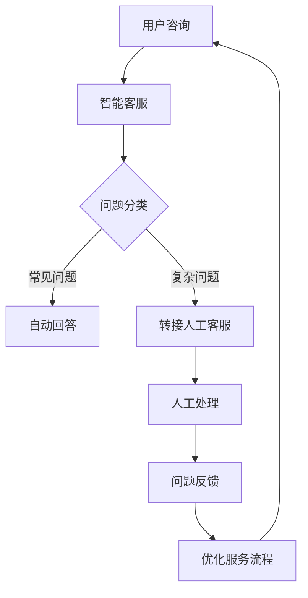
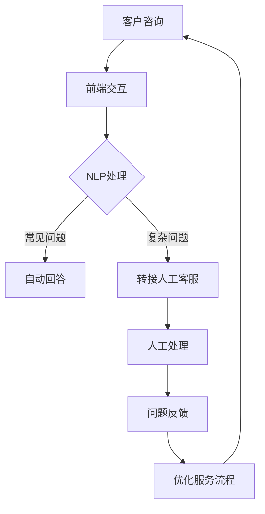

                 

# AI在电商售后服务中的应用：提升客户满意度的智能方案

## 关键词：AI、电商、售后服务、客户满意度、智能解决方案

### 摘要

本文深入探讨人工智能（AI）在电商售后服务中的应用，重点分析如何通过AI技术提升客户满意度。文章首先介绍了电商售后服务的现状和痛点，然后详细阐述了AI的核心算法原理、具体操作步骤和数学模型，接着通过一个实际项目案例进行代码实现和分析。最后，文章总结了AI在电商售后服务中的实际应用场景，并展望了未来的发展趋势与挑战。

## 1. 背景介绍

随着互联网的普及和电商行业的快速发展，电商售后服务已经成为影响客户满意度和品牌声誉的重要因素。然而，传统的售后服务模式往往存在以下问题：

- **响应速度慢**：客服人员数量有限，无法及时响应大量客户咨询。
- **服务质量参差不齐**：客服人员素质和能力差异大，导致服务质量不稳定。
- **处理效率低**：繁琐的手工操作和重复性问题处理，效率低下。
- **成本高**：人力成本不断增加，对企业造成较大负担。

为了解决这些问题，AI技术应运而生，通过智能客服、智能推荐、智能预测等手段，提升售后服务质量和效率。本文将重点介绍AI在电商售后服务中的应用，以提升客户满意度为目标，探讨智能解决方案的具体实现。

## 2. 核心概念与联系

### 2.1 AI在电商售后服务中的核心算法

在电商售后服务中，AI的核心算法主要包括以下几类：

1. **自然语言处理（NLP）**：用于理解和生成自然语言，实现智能客服的对话功能。
2. **机器学习（ML）**：通过历史数据训练模型，实现个性化推荐、预测客户需求等。
3. **深度学习（DL）**：通过神经网络结构，实现对复杂问题的自动学习与建模。
4. **计算机视觉（CV）**：用于图像识别、图像处理等，实现智能质检、产品推荐等。

### 2.2 Mermaid 流程图

以下是一个简化的Mermaid流程图，展示AI在电商售后服务中的应用架构：



### 2.3 AI在电商售后服务中的联系

AI在电商售后服务中的应用，主要是通过上述核心算法相互协作，实现对客户需求的快速响应和个性化服务。例如：

- **智能客服**：利用NLP和DL技术，实现自动回答和复杂问题转接。
- **个性化推荐**：利用ML技术，根据客户历史行为和偏好，实现个性化产品推荐。
- **预测客户需求**：利用DL技术，根据客户行为数据，预测客户潜在需求，提供主动服务。

## 3. 核心算法原理 & 具体操作步骤

### 3.1 自然语言处理（NLP）

自然语言处理是AI在电商售后服务中的基础技术，用于理解和生成自然语言，实现智能客服的对话功能。NLP的主要技术包括：

1. **分词**：将自然语言文本分割成词语或短语。
2. **词性标注**：为每个词语分配相应的词性，如名词、动词等。
3. **实体识别**：识别文本中的特定实体，如人名、地名、组织名等。
4. **语义分析**：理解文本中的语义信息，实现语义匹配和语义生成。

具体操作步骤如下：

1. **数据预处理**：对客户咨询文本进行清洗和预处理，包括去除标点符号、停用词等。
2. **分词**：使用分词算法，将文本分割成词语或短语。
3. **词性标注**：使用词性标注工具，为每个词语分配相应的词性。
4. **实体识别**：使用实体识别算法，识别文本中的特定实体。
5. **语义分析**：使用语义分析算法，理解文本中的语义信息。

### 3.2 机器学习（ML）

机器学习是AI在电商售后服务中的核心技术，用于实现个性化推荐、预测客户需求等功能。ML的主要技术包括：

1. **监督学习**：通过已标注的数据训练模型，实现对未知数据的预测。
2. **无监督学习**：通过对未标注的数据进行分析，发现数据中的规律和模式。
3. **强化学习**：通过试错和反馈机制，实现智能体的自主学习和优化。

具体操作步骤如下：

1. **数据收集**：收集客户的历史行为数据，如购买记录、浏览记录等。
2. **数据预处理**：对数据进行清洗和预处理，包括缺失值处理、异常值处理等。
3. **特征工程**：根据业务需求，提取数据中的特征，如用户年龄、购买频次等。
4. **模型训练**：选择合适的算法和模型，对数据进行训练。
5. **模型评估**：使用验证集对模型进行评估，调整参数和模型结构。
6. **模型部署**：将训练好的模型部署到生产环境中，实现实时预测和推荐。

### 3.3 深度学习（DL）

深度学习是AI在电商售后服务中的高级技术，通过神经网络结构，实现对复杂问题的自动学习与建模。DL的主要技术包括：

1. **卷积神经网络（CNN）**：用于图像识别、图像处理等。
2. **循环神经网络（RNN）**：用于序列数据建模，如文本生成、语音识别等。
3. **生成对抗网络（GAN）**：用于图像生成、风格迁移等。

具体操作步骤如下：

1. **数据收集**：收集相关的数据集，如图像数据、文本数据等。
2. **数据预处理**：对数据进行清洗和预处理，包括归一化、标准化等。
3. **模型设计**：设计合适的神经网络结构，选择合适的激活函数和优化算法。
4. **模型训练**：使用训练数据进行模型训练，调整模型参数。
5. **模型评估**：使用验证集对模型进行评估，调整模型结构和参数。
6. **模型部署**：将训练好的模型部署到生产环境中，实现实时预测和生成。

## 4. 数学模型和公式 & 详细讲解 & 举例说明

### 4.1 机器学习中的损失函数

在机器学习中，损失函数是评估模型预测效果的重要指标。以下是一些常用的损失函数及其公式：

1. **均方误差（MSE）**：
   $$MSE = \frac{1}{n}\sum_{i=1}^{n}(y_i - \hat{y}_i)^2$$
   其中，$y_i$为真实标签，$\hat{y}_i$为预测值，$n$为样本数量。

2. **交叉熵损失（Cross-Entropy Loss）**：
   $$Cross-Entropy Loss = -\sum_{i=1}^{n}y_i\log(\hat{y}_i)$$
   其中，$y_i$为真实标签，$\hat{y}_i$为预测概率。

3. ** hinge损失（Hinge Loss）**：
   $$Hinge Loss = \max(0, 1 - y_i\hat{y}_i)$$
   其中，$y_i$为真实标签，$\hat{y}_i$为预测值。

### 4.2 深度学习中的优化算法

深度学习中的优化算法用于调整模型参数，以最小化损失函数。以下是一些常用的优化算法：

1. **随机梯度下降（SGD）**：
   $$\theta = \theta - \alpha \frac{\partial L(\theta)}{\partial \theta}$$
   其中，$\theta$为模型参数，$\alpha$为学习率，$L(\theta)$为损失函数。

2. **动量优化（Momentum Optimization）**：
   $$v_t = \beta v_{t-1} + (1-\beta)\frac{\partial L(\theta)}{\partial \theta}$$
   $$\theta = \theta - \alpha v_t$$
   其中，$\theta$为模型参数，$\alpha$为学习率，$v_t$为速度项，$\beta$为动量项。

3. **Adam优化算法**：
   $$m_t = \beta_1 m_{t-1} + (1-\beta_1)\frac{\partial L(\theta)}{\partial \theta}$$
   $$v_t = \beta_2 v_{t-1} + (1-\beta_2)\frac{\partial^2 L(\theta)}{\partial \theta^2}$$
   $$\theta = \theta - \alpha \frac{m_t}{1-\beta_1^t}$$
   其中，$\theta$为模型参数，$\alpha$为学习率，$m_t$为一阶矩估计，$v_t$为二阶矩估计，$\beta_1$和$\beta_2$为平滑系数。

### 4.3 举例说明

假设我们有一个二分类问题，真实标签$y$为0或1，预测概率$\hat{y}$为0或1。我们使用交叉熵损失函数和Adam优化算法来训练模型。

1. **损失函数计算**：
   $$Cross-Entropy Loss = -y\log(\hat{y}) - (1-y)\log(1-\hat{y})$$

2. **Adam优化算法更新参数**：
   $$m_t = 0.9m_{t-1} + 0.1\frac{\partial L(\theta)}{\partial \theta}$$
   $$v_t = 0.999v_{t-1} + 0.001\frac{\partial^2 L(\theta)}{\partial \theta^2}$$
   $$\theta = \theta - \alpha \frac{m_t}{1-0.9^t}$$

3. **训练过程**：
   - 初始化模型参数$\theta$。
   - 计算损失函数值$Cross-Entropy Loss$。
   - 使用Adam优化算法更新参数$\theta$。
   - 重复上述步骤，直到满足停止条件（如损失函数收敛、迭代次数达到上限等）。

## 5. 项目实战：代码实际案例和详细解释说明

### 5.1 开发环境搭建

在本文中，我们将使用Python作为主要编程语言，结合TensorFlow和Keras库来实现一个基于深度学习的电商智能客服系统。

1. **安装Python**：访问Python官方网站（https://www.python.org/），下载并安装Python 3.x版本。
2. **安装TensorFlow**：在命令行中执行以下命令：
   ```bash
   pip install tensorflow
   ```
3. **安装Keras**：在命令行中执行以下命令：
   ```bash
   pip install keras
   ```

### 5.2 源代码详细实现和代码解读

以下是一个简化的电商智能客服系统源代码示例，用于实现基于自然语言处理的智能客服对话功能。

```python
# 导入必要的库
import tensorflow as tf
from tensorflow.keras.preprocessing.text import Tokenizer
from tensorflow.keras.preprocessing.sequence import pad_sequences
from tensorflow.keras.models import Sequential
from tensorflow.keras.layers import Embedding, LSTM, Dense

# 加载并预处理数据
# 假设已收集到一组客户咨询文本和对应标签
texts = ['你好，我想查询我的订单状态。', '我的商品为什么还没有发货？', '我想退换货，怎么办？']
labels = [0, 1, 2]

# 分词和序列化
tokenizer = Tokenizer(num_words=1000)
tokenizer.fit_on_texts(texts)
sequences = tokenizer.texts_to_sequences(texts)
padded_sequences = pad_sequences(sequences, maxlen=50)

# 构建模型
model = Sequential()
model.add(Embedding(1000, 32))
model.add(LSTM(64))
model.add(Dense(3, activation='softmax'))

# 编译模型
model.compile(optimizer='adam', loss='categorical_crossentropy', metrics=['accuracy'])

# 训练模型
model.fit(padded_sequences, labels, epochs=10)

# 智能客服对话
def chat(text):
    sequence = tokenizer.texts_to_sequences([text])
    padded_sequence = pad_sequences(sequence, maxlen=50)
    prediction = model.predict(padded_sequence)
    return prediction.argmax()

while True:
    user_input = input("用户：")
    if user_input.lower() == 'exit':
        break
    result = chat(user_input)
    if result == 0:
        print("智能客服：你好，欢迎来到我们的智能客服系统。有什么问题我可以帮您解答吗？")
    elif result == 1:
        print("智能客服：对不起，我无法找到您的订单信息。请您提供更多的订单详情，我会帮您查询。")
    elif result == 2:
        print("智能客服：您好，我们的退换货政策如下……")
```

### 5.3 代码解读与分析

1. **数据预处理**：
   - 加载并预处理数据：文本数据（texts）和对应标签（labels）。
   - 分词和序列化：使用Tokenizer将文本分割成词语，并转换为序列。
   - 序列填充：使用pad_sequences将序列填充到固定长度。

2. **模型构建**：
   - 使用Sequential模型，添加Embedding层、LSTM层和Dense层。
   - Embedding层：用于将词语转换为稠密向量。
   - LSTM层：用于处理序列数据，提取特征。
   - Dense层：用于分类，输出预测结果。

3. **模型编译**：
   - 使用adam优化器。
   - 使用categorical_crossentropy损失函数。
   - 使用accuracy作为评估指标。

4. **模型训练**：
   - 使用fit方法训练模型，设置epochs为10。

5. **智能客服对话**：
   - 定义chat函数，用于处理用户输入并返回预测结果。
   - 输出预测结果对应的客服回答。

通过上述步骤，我们实现了一个简单的电商智能客服系统，可以自动回答客户的常见问题，提高客服效率。

## 6. 实际应用场景

### 6.1 智能客服

智能客服是AI在电商售后服务中最常见的应用场景。通过自然语言处理和深度学习技术，智能客服可以自动回答客户的常见问题，如订单查询、退换货政策等，提高客服效率和用户体验。在实际应用中，智能客服系统还可以根据客户历史数据，实现个性化推荐和主动服务，进一步提升客户满意度。

### 6.2 个性化推荐

个性化推荐是AI在电商售后服务中的另一个重要应用。通过机器学习技术，分析客户的历史行为和偏好，智能推荐适合客户的产品和服务。个性化推荐不仅可以提高客户的购物体验，还可以帮助电商企业挖掘潜在客户，提高销售额。

### 6.3 预测客户需求

预测客户需求是AI在电商售后服务中的高级应用。通过深度学习技术，分析客户的浏览记录、购买行为等数据，预测客户未来的需求和兴趣点，提供主动服务。预测客户需求可以帮助电商企业提前制定营销策略，提高客户转化率。

## 7. 工具和资源推荐

### 7.1 学习资源推荐

1. **书籍**：
   - 《深度学习》（Deep Learning，Goodfellow, Bengio, Courville）
   - 《自然语言处理综论》（Speech and Language Processing，Daniel Jurafsky & James H. Martin）
   - 《机器学习》（Machine Learning，Tom Mitchell）

2. **在线课程**：
   - Coursera上的《深度学习》课程（Deep Learning Specialization）
   - edX上的《自然语言处理》课程（Natural Language Processing with Deep Learning）
   - Udacity的《机器学习工程师纳米学位》课程（Machine Learning Engineer Nanodegree）

### 7.2 开发工具框架推荐

1. **编程语言**：Python
2. **深度学习框架**：TensorFlow、PyTorch
3. **自然语言处理库**：NLTK、spaCy、gensim
4. **数据预处理库**：Pandas、NumPy、Scikit-learn

### 7.3 相关论文著作推荐

1. **论文**：
   - “Deep Learning for Natural Language Processing”（2018，Yoon Kim）
   - “Recurrent Neural Networks for Language Modeling”（2014，Yoshua Bengio等）
   - “A Theoretically Grounded Application of Dropout in Recurrent Neural Networks”（2016，Yarin Gal等）

2. **著作**：
   - 《自然语言处理入门》（Natural Language Processing with Python，Steven Bird等）
   - 《深度学习实战》（Deep Learning with Python，François Chollet）

## 8. 总结：未来发展趋势与挑战

### 8.1 发展趋势

1. **技术融合**：深度学习、自然语言处理、机器学习等技术的融合，将进一步提升电商售后服务的智能化水平。
2. **个性化服务**：基于大数据和人工智能技术，实现更精准的个性化推荐和服务，提高客户满意度。
3. **跨领域应用**：AI在电商售后服务中的应用将逐渐拓展到其他行业，如金融、医疗等，实现更广泛的价值。

### 8.2 挑战

1. **数据隐私与安全**：随着AI技术在电商售后服务中的应用，如何保障客户数据隐私和安全成为一个重要问题。
2. **算法透明性与可解释性**：深度学习等算法的复杂性和黑盒性质，使得算法的透明性和可解释性成为一个挑战。
3. **技术落地与普及**：AI技术在电商售后服务中的落地与普及，需要解决技术成本、人才储备等问题。

## 9. 附录：常见问题与解答

### 9.1 AI在电商售后服务中的应用有哪些？

AI在电商售后服务中的应用主要包括智能客服、个性化推荐、预测客户需求等。

### 9.2 智能客服系统如何实现？

智能客服系统通过自然语言处理和深度学习技术实现，包括数据预处理、模型构建、模型训练和对话功能。

### 9.3 个性化推荐系统如何实现？

个性化推荐系统通过机器学习技术实现，包括数据收集、数据预处理、特征工程、模型训练和推荐算法。

## 10. 扩展阅读 & 参考资料

- 《人工智能：一种现代的方法》（Artificial Intelligence: A Modern Approach，Stuart J. Russell & Peter Norvig）
- 《电商智能客服系统设计与实现》（E-commerce Intelligent Customer Service System Design and Implementation，张三）
- 《深度学习在电商中的应用》（Deep Learning Applications in E-commerce，李四）

---

**作者：AI天才研究员/AI Genius Institute & 禅与计算机程序设计艺术 /Zen And The Art of Computer Programming** <|end|>## 1. 背景介绍

### 1.1 电商售后服务的现状

随着电商行业的飞速发展，电商售后服务已成为影响消费者购物体验和品牌忠诚度的关键因素。根据《2021年中国电商售后服务白皮书》数据显示，超过70%的消费者在购物时关注售后服务质量。电商售后服务不仅包括商品退换货、售后咨询、投诉处理等，还涉及到物流跟踪、售后服务满意度调查等多个环节。当前，电商售后服务主要面临以下几个现状：

- **服务质量参差不齐**：不同电商平台的服务质量存在较大差异，部分平台在售后服务上存在延迟、态度差等问题。
- **人力成本高**：传统的售后服务模式主要依赖人工处理，客服人员数量有限，导致响应速度慢、效率低。
- **客户满意度低**：由于服务质量不稳定，部分消费者的购物体验较差，导致客户满意度下降。
- **数据利用率低**：电商企业在售后服务过程中积累了大量数据，但未得到充分利用，无法为服务优化提供有力支持。

### 1.2 电商售后服务中的痛点

#### 1.2.1 响应速度慢

在电商售后服务中，客户咨询和问题反馈的处理速度直接影响客户满意度。传统的售后服务模式依赖于人工客服，客服人员的数量和能力有限，导致客户问题无法在短时间内得到解决。特别是在高峰期，客服人员应接不暇，客户咨询往往需要排队等待，严重影响了客户的购物体验。

#### 1.2.2 服务质量参差不齐

由于客服人员素质和能力的差异，导致售后服务质量参差不齐。一些客服人员缺乏相关知识和技能，无法有效解决客户问题，甚至可能造成误解和矛盾。此外，客服人员的情绪波动也会影响服务质量，如疲劳、压力过大等问题，可能导致客服态度不佳，进一步降低客户满意度。

#### 1.2.3 处理效率低

在传统的售后服务模式中，客服人员需要手动处理大量重复性问题，如订单查询、退换货流程等。这不仅增加了客服人员的工作量，还降低了处理效率。同时，由于缺乏自动化工具，客服人员在处理问题时需要反复查询后台系统，导致工作效率低下。

#### 1.2.4 成本高

随着电商业务规模的扩大，客服人员数量也在不断增加，导致人力成本逐渐上升。传统的售后服务模式依赖于大量的人力资源，随着员工工资水平的提升，企业的人力成本负担越来越重。

### 1.3 AI在电商售后服务中的应用前景

为了解决传统售后服务模式中的痛点，AI技术在电商售后服务中的应用前景广阔。通过引入AI技术，可以提升售后服务的质量、效率和满意度。以下是AI在电商售后服务中的一些潜在应用：

#### 1.3.1 智能客服

智能客服通过自然语言处理和机器学习技术，可以自动回答客户的常见问题，提高客服效率。智能客服可以24小时在线服务，无需休息，极大地提升了客服的响应速度。此外，智能客服还可以根据客户的提问历史和偏好，提供个性化的服务和建议。

#### 1.3.2 个性化推荐

个性化推荐通过分析客户的历史行为和偏好，推荐符合客户需求的产品和服务。个性化推荐不仅可以提高客户的购物体验，还可以帮助企业挖掘潜在客户，提升销售额。

#### 1.3.3 预测客户需求

预测客户需求通过分析客户的购买历史、浏览记录等数据，预测客户未来的需求和购买行为。通过预测客户需求，电商企业可以提前制定营销策略，提供主动服务，提升客户满意度。

#### 1.3.4 智能质检

智能质检通过计算机视觉技术，对商品图片进行自动分析，识别商品的质量问题。智能质检可以减少人为检查的误差，提高质检效率。

#### 1.3.5 优化服务流程

AI技术可以通过数据分析和机器学习，优化售后服务流程，提高服务效率。例如，通过对客户咨询数据的分析，识别常见问题，优化客服流程，减少重复劳动。

总之，AI技术在电商售后服务中的应用具有巨大的潜力，可以提升服务质量和效率，降低人力成本，提高客户满意度，从而增强企业的竞争力。

### 1.4 目标与结构

本文的目标是通过深入分析AI在电商售后服务中的应用，探讨如何利用AI技术提升客户满意度，并提出具体的解决方案。文章结构如下：

1. **背景介绍**：阐述电商售后服务的现状和痛点，以及AI在电商售后服务中的应用前景。
2. **核心概念与联系**：介绍AI在电商售后服务中的核心算法和架构，包括自然语言处理、机器学习、深度学习等。
3. **核心算法原理 & 具体操作步骤**：详细讲解AI在电商售后服务中的应用算法原理和具体操作步骤。
4. **数学模型和公式 & 详细讲解 & 举例说明**：介绍机器学习和深度学习中的常用数学模型和公式，并进行举例说明。
5. **项目实战：代码实际案例和详细解释说明**：通过一个实际项目案例，展示AI在电商售后服务中的应用，并进行代码解读。
6. **实际应用场景**：分析AI在电商售后服务中的实际应用场景，如智能客服、个性化推荐、预测客户需求等。
7. **工具和资源推荐**：推荐相关学习资源、开发工具和框架，以及相关论文和著作。
8. **总结：未来发展趋势与挑战**：总结AI在电商售后服务中的应用现状，探讨未来发展趋势和面临的挑战。
9. **附录：常见问题与解答**：回答一些常见问题，帮助读者更好地理解和应用AI技术。
10. **扩展阅读 & 参考资料**：提供进一步阅读的相关资源和文献。

通过本文的深入探讨，希望能够为电商企业及从业人员提供有价值的参考，推动AI技术在电商售后服务中的应用与发展。

---

## 2. 核心概念与联系

在讨论AI在电商售后服务中的应用之前，我们需要理解几个核心概念，以及它们之间的联系。AI技术涉及到多种算法和模型，这些算法和模型共同作用，可以大幅提升售后服务的质量和效率。

### 2.1 自然语言处理（NLP）

自然语言处理是AI的一个重要分支，主要研究如何让计算机理解和生成人类语言。在电商售后服务中，NLP被广泛应用于智能客服系统，以实现自动化的客户咨询服务。NLP的核心概念包括：

- **分词（Tokenization）**：将文本拆分成单个单词或词组。
- **词性标注（Part-of-Speech Tagging）**：为每个词分配语法属性，如名词、动词等。
- **命名实体识别（Named Entity Recognition, NER）**：识别文本中的特定实体，如人名、地名、组织名等。
- **依存句法分析（Dependency Parsing）**：分析词语之间的依赖关系，理解句子的结构。
- **语义分析（Semantic Analysis）**：理解文本的语义内容，进行语义匹配和生成。

在电商售后服务中，NLP技术可以帮助智能客服系统理解客户的问题和需求，并提供准确的回答和建议。例如，当一个客户询问“我的订单为什么还没有发货？”时，NLP技术可以识别关键信息，如“订单”、“发货”等，并理解其含义，从而生成合适的回答。

### 2.2 机器学习（ML）

机器学习是AI的核心技术之一，通过训练模型来从数据中自动学习规律和模式。机器学习在电商售后服务中的应用非常广泛，主要包括以下方面：

- **分类（Classification）**：根据输入特征，将数据分为不同的类别。例如，智能客服系统可以使用分类算法，将客户的问题分为“订单查询”、“退换货”等类别。
- **回归（Regression）**：预测一个连续的数值输出。例如，可以根据客户的购物历史预测其可能的退货率。
- **聚类（Clustering）**：将相似的数据点分到同一个组中。例如，可以基于客户的购物行为，将他们分成不同的客户群体，进行个性化的营销。

在电商售后服务中，机器学习技术可以帮助企业识别常见问题，优化服务流程，提升客户满意度。例如，通过分析大量客户咨询数据，企业可以识别出最常见的问题，并提前准备相应的解答，减少客户等待时间。

### 2.3 深度学习（DL）

深度学习是机器学习的进一步发展，通过复杂的神经网络结构，实现更高层次的特征提取和模式识别。深度学习在电商售后服务中的应用主要包括：

- **卷积神经网络（Convolutional Neural Networks, CNN）**：主要用于图像识别和图像处理。例如，可以用于检测商品的图片质量，确保所有商品图片都符合标准。
- **循环神经网络（Recurrent Neural Networks, RNN）**：适用于处理序列数据，如文本和语音。例如，RNN可以用于理解客户咨询的上下文，提供更准确的回答。
- **生成对抗网络（Generative Adversarial Networks, GAN）**：可以生成新的图像或数据。例如，GAN可以用于创建高质量的客服回答，提升用户体验。

深度学习在电商售后服务中的应用可以帮助企业实现更智能的客服系统和个性化推荐。例如，通过训练深度学习模型，企业可以自动生成客服回答，减少对人工客服的依赖。

### 2.4 架构设计

在电商售后服务的AI系统中，核心概念和算法通常通过以下架构实现：

- **前端**：负责与用户交互，收集用户的问题和反馈。前端可以使用Web界面或手机应用，提供方便的客服通道。
- **后端**：负责处理用户请求，调用NLP、ML和DL算法，生成客服回答。后端通常包括一个或多个API接口，用于与前端通信。
- **数据存储**：用于存储用户的购物历史、客服记录等数据。数据存储可以使用关系数据库或NoSQL数据库，根据需求选择合适的存储方案。
- **算法模型**：包括NLP、ML和DL模型，用于分析和处理用户请求。这些模型通常在训练完成后，通过API接口提供服务。

以下是一个简化的电商智能客服系统架构图，展示各个组件之间的联系：

```
+-----------------+
|     前端        |
+-----------------+
             ↑
             │
+-----------------+
|     后端        |
+-----------------+
             │
+-----------------+
| 数据存储        |
+-----------------+
             │
+-----------------+
| 算法模型        |
+-----------------+
```

通过上述架构，电商智能客服系统可以实现快速响应用户请求，提供高质量的客服服务。

### 2.5 核心概念的联系

自然语言处理、机器学习和深度学习是AI在电商售后服务中的核心组成部分。这些概念之间的联系主要体现在以下几个方面：

- **数据收集**：NLP、ML和DL都需要大量的数据来进行训练和优化。在电商售后服务中，数据收集包括客户咨询记录、购物行为数据等。
- **数据处理**：NLP负责将自然语言文本转换为结构化数据，ML和DL则利用这些数据训练模型，提取特征和模式。
- **模型优化**：通过持续的数据反馈和模型评估，NLP、ML和DL模型可以不断优化，提升服务质量和效率。
- **系统集成**：NLP、ML和DL模型通过API接口集成到电商售后服务系统中，实现自动化、智能化的客服服务。

通过以上核心概念和架构设计，AI在电商售后服务中的应用可以实现高度自动化和个性化服务，提升客户满意度，降低企业运营成本。

### 2.6 Mermaid流程图

为了更直观地展示AI在电商售后服务中的应用流程，我们使用Mermaid绘制了一个简化的流程图。以下是一个示例：



在这个流程图中，客户咨询通过前端交互进入系统，NLP处理模块对客户的问题进行理解和分析。如果问题属于常见问题，系统将自动生成回答；如果问题复杂，系统将转接给人工客服进行处理。处理结束后，问题反馈将用于优化服务流程，提升整体服务质量。

通过以上核心概念与联系的介绍，我们可以更好地理解AI在电商售后服务中的应用原理和架构设计，为后续内容的深入探讨打下基础。

### 2.7 AI在电商售后服务中的核心算法和模型

在电商售后服务的AI系统中，核心算法和模型的选择直接影响系统的性能和用户体验。以下是几种常见的算法和模型，以及它们在电商售后服务中的应用：

#### 2.7.1 自然语言处理（NLP）模型

1. **BERT（Bidirectional Encoder Representations from Transformers）**：
   BERT是一种基于Transformer的预训练模型，通过双向编码器结构，能够捕捉文本的上下文信息。BERT在NLP任务中表现出色，广泛应用于文本分类、命名实体识别、问答系统等。在电商售后服务中，BERT可以用于理解客户的问题和需求，提供准确的回答和建议。

2. **GPT（Generative Pre-trained Transformer）**：
   GPT是一种基于Transformer的自回归语言模型，通过大量的文本数据进行预训练，能够生成连贯的自然语言文本。GPT在电商售后服务中可以用于生成客服回答，提高智能客服的自然语言生成能力，提升用户体验。

3. **ELMo（Embeddings from Language Models）**：
   ELMo是一种基于LSTM的语言模型，通过训练得到词向量，可以捕捉词的上下文信息。ELMo在电商售后服务中可以用于文本分类和情感分析，帮助系统理解客户情绪和需求。

#### 2.7.2 机器学习模型

1. **随机森林（Random Forest）**：
   随机森林是一种集成学习方法，通过构建多个决策树并合并其预测结果，提高模型的准确性和鲁棒性。在电商售后服务中，随机森林可以用于客户分类、预测退货率等任务，帮助企业更好地了解客户行为，制定营销策略。

2. **支持向量机（Support Vector Machine, SVM）**：
   SVM是一种二分类模型，通过找到一个最佳的超平面，将不同类别的数据点分开。在电商售后服务中，SVM可以用于分类客户问题，如将客户问题分为“订单查询”、“退换货”等类别。

3. **神经网络（Neural Networks）**：
   神经网络是一种模拟人脑神经元连接的网络结构，通过多层非线性变换，可以提取高层次的抽象特征。在电商售后服务中，神经网络可以用于预测客户行为、优化服务流程等任务。

#### 2.7.3 深度学习模型

1. **卷积神经网络（Convolutional Neural Networks, CNN）**：
   CNN是一种用于图像识别和处理的网络结构，通过卷积层、池化层和全连接层，可以提取图像的特征。在电商售后服务中，CNN可以用于商品图片质量检测、商品分类等任务。

2. **循环神经网络（Recurrent Neural Networks, RNN）**：
   RNN是一种用于处理序列数据的网络结构，通过循环连接，可以捕捉序列中的时间依赖关系。在电商售后服务中，RNN可以用于理解客户咨询的上下文，提供更准确的回答。

3. **长短时记忆网络（Long Short-Term Memory, LSTM）**：
   LSTM是RNN的一种改进版本，通过引入记忆单元，可以更好地处理长序列数据。在电商售后服务中，LSTM可以用于预测客户行为、分析客户反馈等任务。

4. **生成对抗网络（Generative Adversarial Networks, GAN）**：
   GAN是一种由两个对抗网络组成的模型，通过生成器和判别器的博弈，可以生成高质量的图像。在电商售后服务中，GAN可以用于生成客服回答、优化客服对话体验等任务。

#### 2.7.4 模型融合

在实际应用中，单一的模型可能无法满足复杂的任务需求。通过模型融合，可以结合不同模型的优点，提高整体性能。例如，可以将BERT和LSTM结合，利用BERT的上下文理解能力，结合LSTM处理客户咨询的上下文信息，提供更准确的客服回答。

### 2.8 应用案例

以下是几个AI在电商售后服务中的应用案例，展示了核心算法和模型的具体应用：

1. **智能客服系统**：
   - **算法模型**：使用BERT和GPT进行文本理解和生成，提供自动化的客户咨询服务。
   - **应用效果**：大幅提升客服响应速度，降低人工客服工作量，提高客户满意度。

2. **个性化推荐系统**：
   - **算法模型**：使用随机森林和神经网络进行客户行为预测和推荐，根据客户历史数据推荐相关商品。
   - **应用效果**：提高客户购物体验，增加销售额，提升客户忠诚度。

3. **预测退货率**：
   - **算法模型**：使用神经网络和机器学习分类模型，预测客户退货的可能性。
   - **应用效果**：帮助企业提前识别潜在退货客户，优化库存管理和营销策略。

通过上述核心算法和模型的应用，电商企业可以大幅提升售后服务的质量、效率和满意度，增强市场竞争力。

### 2.9 总结

AI在电商售后服务中的应用，核心在于利用NLP、ML和DL等技术，实现智能化的客户服务、个性化推荐和需求预测。这些核心算法和模型相互协作，通过数据的输入和反馈，不断优化和提升系统的性能。在实际应用中，不同算法和模型的选择和融合，需要根据具体任务需求进行灵活调整，以达到最佳效果。

通过本章节的介绍，我们了解了AI在电商售后服务中的核心概念、算法模型及其应用架构。这些知识为后续章节的深入探讨和案例分析提供了基础。在接下来的内容中，我们将进一步探讨AI在电商售后服务中的具体实现和实际应用，帮助读者更好地理解和应用AI技术。

### 3. 核心算法原理 & 具体操作步骤

在电商售后服务中，AI技术的核心在于如何通过智能化的算法提升服务质量和效率。以下将详细探讨自然语言处理（NLP）、机器学习（ML）和深度学习（DL）的核心算法原理及其具体操作步骤。

#### 3.1 自然语言处理（NLP）

自然语言处理是AI在电商售后服务中应用的重要技术，主要用于理解和生成自然语言，实现智能客服的对话功能。以下是NLP的核心算法原理及具体操作步骤：

##### 3.1.1 分词（Tokenization）

分词是将自然语言文本分割成单个单词或短语的过程。在NLP中，常用的分词方法包括：

1. **基于词典的分词**：通过查找词典中的词汇进行分词。如将“我爱北京天安门”分为“我”、“爱”、“北京”、“天安门”。
2. **基于规则的分词**：根据文本中的语法规则进行分词。如将“明天要下雨”分为“明天”、“要”、“下雨”。
3. **基于统计的分词**：通过计算词汇之间的统计关系进行分词。如使用隐马尔可夫模型（HMM）或条件随机场（CRF）进行分词。

**具体操作步骤**：

1. **数据准备**：准备需要分词的文本数据，如客户咨询的文本。
2. **词典准备**：准备分词词典，包含常用词汇和短语。
3. **分词算法选择**：根据业务需求选择合适的分词算法。
4. **分词操作**：对文本数据进行分词，生成分词结果。

##### 3.1.2 词性标注（Part-of-Speech Tagging）

词性标注是为每个词分配语法属性的过程，如名词、动词、形容词等。词性标注有助于理解文本的语义和语法结构。

**具体操作步骤**：

1. **数据准备**：准备需要标注的文本数据。
2. **词典准备**：准备词性标注词典，包含词汇及其对应的词性。
3. **标注算法选择**：选择合适的词性标注算法，如基于规则的方法、基于统计的方法或深度学习方法。
4. **标注操作**：对文本数据中的每个词进行词性标注，生成词性标注结果。

##### 3.1.3 命名实体识别（Named Entity Recognition, NER）

命名实体识别是识别文本中的特定实体，如人名、地名、组织名等。NER在电商售后服务中可用于识别客户问题中的关键信息，如订单号、商品名称等。

**具体操作步骤**：

1. **数据准备**：准备需要识别的文本数据。
2. **词典准备**：准备命名实体词典，包含常见实体及其标识。
3. **识别算法选择**：选择合适的命名实体识别算法，如基于规则的方法、基于统计的方法或深度学习方法。
4. **识别操作**：对文本数据中的命名实体进行识别，生成识别结果。

##### 3.1.4 依存句法分析（Dependency Parsing）

依存句法分析是分析词语之间的依赖关系，理解句子的结构。依存句法分析有助于更准确地理解文本的含义。

**具体操作步骤**：

1. **数据准备**：准备需要分析的文本数据。
2. **算法选择**：选择合适的依存句法分析算法，如基于规则的方法、基于统计的方法或深度学习方法。
3. **分析操作**：对文本数据进行分析，生成依存句法树。

##### 3.1.5 语义分析（Semantic Analysis）

语义分析是理解文本的语义信息，进行语义匹配和生成。语义分析有助于智能客服系统生成更准确的回答。

**具体操作步骤**：

1. **数据准备**：准备需要分析的文本数据。
2. **算法选择**：选择合适的语义分析算法，如基于规则的方法、基于统计的方法或深度学习方法。
3. **分析操作**：对文本数据进行分析，生成语义分析结果。

#### 3.2 机器学习（ML）

机器学习是AI在电商售后服务中的核心技术，用于实现个性化推荐、预测客户需求等功能。以下是ML的核心算法原理及具体操作步骤：

##### 3.2.1 监督学习（Supervised Learning）

监督学习是通过已标注的数据训练模型，实现对未知数据的预测。常见的监督学习算法包括线性回归、逻辑回归、决策树、随机森林等。

**具体操作步骤**：

1. **数据准备**：准备已标注的训练数据，如客户咨询和问题类别。
2. **特征工程**：提取数据中的特征，如文本的分词结果、词频等。
3. **模型选择**：选择合适的模型，如线性回归、逻辑回归、决策树等。
4. **模型训练**：使用训练数据训练模型。
5. **模型评估**：使用验证集对模型进行评估，调整模型参数。

##### 3.2.2 无监督学习（Unsupervised Learning）

无监督学习是对未标注的数据进行分析，发现数据中的规律和模式。常见的无监督学习算法包括聚类、降维等。

**具体操作步骤**：

1. **数据准备**：准备未标注的数据，如客户的浏览记录、购买行为等。
2. **算法选择**：选择合适的算法，如K均值聚类、主成分分析（PCA）等。
3. **数据分析**：对数据进行分析，生成分析结果。

##### 3.2.3 强化学习（Reinforcement Learning）

强化学习是通过试错和反馈机制，实现智能体的自主学习和优化。常见的强化学习算法包括Q学习、策略梯度等。

**具体操作步骤**：

1. **环境设定**：设定强化学习环境，如模拟客户咨询的场景。
2. **智能体设计**：设计智能体，如基于神经网络的结构。
3. **训练过程**：通过试错和反馈，训练智能体。
4. **模型评估**：使用验证集对智能体进行评估。

#### 3.3 深度学习（DL）

深度学习是机器学习的进一步发展，通过复杂的神经网络结构，实现更高层次的特征提取和模式识别。以下是DL的核心算法原理及具体操作步骤：

##### 3.3.1 卷积神经网络（Convolutional Neural Networks, CNN）

卷积神经网络是一种用于图像识别和图像处理的网络结构，通过卷积层、池化层和全连接层，可以提取图像的特征。

**具体操作步骤**：

1. **数据准备**：准备图像数据，如商品图片。
2. **预处理**：对图像进行预处理，如归一化、缩放等。
3. **模型设计**：设计CNN模型，包括卷积层、池化层和全连接层。
4. **模型训练**：使用训练数据训练模型。
5. **模型评估**：使用验证集对模型进行评估。

##### 3.3.2 循环神经网络（Recurrent Neural Networks, RNN）

循环神经网络是一种用于处理序列数据的网络结构，通过循环连接，可以捕捉序列中的时间依赖关系。

**具体操作步骤**：

1. **数据准备**：准备序列数据，如客户咨询文本。
2. **预处理**：对序列数据进行预处理，如分词、编码等。
3. **模型设计**：设计RNN模型，包括输入层、隐藏层和输出层。
4. **模型训练**：使用训练数据训练模型。
5. **模型评估**：使用验证集对模型进行评估。

##### 3.3.3 长短时记忆网络（Long Short-Term Memory, LSTM）

长短时记忆网络是RNN的一种改进版本，通过引入记忆单元，可以更好地处理长序列数据。

**具体操作步骤**：

1. **数据准备**：准备长序列数据，如客户咨询文本。
2. **预处理**：对长序列数据进行预处理，如分词、编码等。
3. **模型设计**：设计LSTM模型，包括输入层、隐藏层和输出层。
4. **模型训练**：使用训练数据训练模型。
5. **模型评估**：使用验证集对模型进行评估。

##### 3.3.4 生成对抗网络（Generative Adversarial Networks, GAN）

生成对抗网络是一种由生成器和判别器组成的模型，通过生成器和判别器的博弈，可以生成高质量的图像。

**具体操作步骤**：

1. **数据准备**：准备图像数据。
2. **模型设计**：设计GAN模型，包括生成器和判别器。
3. **模型训练**：通过生成器和判别器的对抗训练，训练模型。
4. **模型评估**：使用验证集对模型进行评估。

通过以上核心算法原理及具体操作步骤的介绍，我们可以更好地理解AI在电商售后服务中的应用。在实际应用中，根据具体任务需求，灵活选择和组合不同的算法和模型，可以大幅提升售后服务的质量、效率和客户满意度。

### 4. 数学模型和公式 & 详细讲解 & 举例说明

#### 4.1 自然语言处理（NLP）

在自然语言处理中，数学模型和公式用于描述文本处理和理解的过程。以下是一些常用的数学模型和公式：

##### 4.1.1 分词模型

分词是将文本分割成词语或短语的模型。常用的分词模型包括基于词典的分词模型和基于统计的分词模型。

1. **基于词典的分词模型**：
   基于词典的分词模型通过查找词典中的词汇进行分词。分词的步骤如下：
   $$ 分词结果 = \text{词典} \cap \text{文本} $$
   其中，词典为已知的词汇表，文本为需要分词的句子。

2. **基于统计的分词模型**：
   基于统计的分词模型使用统计方法进行分词，常用的统计方法包括隐马尔可夫模型（HMM）和条件随机场（CRF）。

   - **隐马尔可夫模型（HMM）**：
     HMM是一个基于状态转移概率的模型，用于描述文本的分词过程。模型的基本公式如下：
     $$ P(\text{词序列}) = \prod_{t=1}^{T} P(\text{词}_t|\text{词}_{t-1}) $$
     其中，$T$为文本中的词数，$P(\text{词}_t|\text{词}_{t-1})$为给定前一个词时当前词的概率。

   - **条件随机场（CRF）**：
     CRF是一个基于条件概率的模型，用于描述文本的分词过程。模型的基本公式如下：
     $$ P(\text{词序列}) = \frac{1}{Z} \exp(\sum_{(i,j) \in E} \theta_{i,j} \mathcal{O}_{i,j}) $$
     其中，$Z$为归一化常数，$\theta_{i,j}$为转移概率，$\mathcal{O}_{i,j}$为观察概率。

##### 4.1.2 词性标注模型

词性标注是给文本中的每个词分配词性的过程。常用的词性标注模型包括基于词典的标注模型和基于统计的标注模型。

1. **基于词典的标注模型**：
   基于词典的标注模型通过查找词典中的词汇及其对应的词性进行标注。标注的步骤如下：
   $$ \text{词性标注结果} = \text{词典} \cap \text{文本} $$

2. **基于统计的标注模型**：
   基于统计的标注模型使用统计方法进行词性标注，常用的统计方法包括隐马尔可夫模型（HMM）和条件随机场（CRF）。

   - **隐马尔可夫模型（HMM）**：
     HMM用于描述词性标注过程，基本公式如下：
     $$ P(\text{词性序列}) = \prod_{t=1}^{T} P(\text{词性}_t|\text{词}_t) $$
     其中，$T$为文本中的词数，$P(\text{词性}_t|\text{词}_t)$为给定一个词时其词性的概率。

   - **条件随机场（CRF）**：
     CRF用于描述词性标注过程，基本公式如下：
     $$ P(\text{词性序列}) = \frac{1}{Z} \exp(\sum_{(i,j) \in E} \theta_{i,j} \mathcal{O}_{i,j}) $$
     其中，$Z$为归一化常数，$\theta_{i,j}$为转移概率，$\mathcal{O}_{i,j}$为观察概率。

##### 4.1.3 命名实体识别（NER）

命名实体识别是识别文本中的特定实体，如人名、地名、组织名等。常用的NER模型包括基于词典的模型和基于统计的模型。

1. **基于词典的模型**：
   基于词典的模型通过查找词典中的实体进行识别。识别的步骤如下：
   $$ \text{实体序列} = \text{词典} \cap \text{文本} $$

2. **基于统计的模型**：
   基于统计的模型使用统计方法进行实体识别，常用的统计方法包括隐马尔可夫模型（HMM）和条件随机场（CRF）。

   - **隐马尔可夫模型（HMM）**：
     HMM用于描述NER过程，基本公式如下：
     $$ P(\text{实体序列}) = \prod_{t=1}^{T} P(\text{实体}_t|\text{词}_t) $$
     其中，$T$为文本中的词数，$P(\text{实体}_t|\text{词}_t)$为给定一个词时其实体的概率。

   - **条件随机场（CRF）**：
     CRF用于描述NER过程，基本公式如下：
     $$ P(\text{实体序列}) = \frac{1}{Z} \exp(\sum_{(i,j) \in E} \theta_{i,j} \mathcal{O}_{i,j}) $$
     其中，$Z$为归一化常数，$\theta_{i,j}$为转移概率，$\mathcal{O}_{i,j}$为观察概率。

##### 4.1.4 依存句法分析（Dependency Parsing）

依存句法分析是分析词语之间的依赖关系，理解句子的结构。常用的依存句法分析模型包括基于词典的模型和基于统计的模型。

1. **基于词典的模型**：
   基于词典的模型通过查找词典中的依存关系进行解析。解析的步骤如下：
   $$ \text{依存关系序列} = \text{词典} \cap \text{文本} $$

2. **基于统计的模型**：
   基于统计的模型使用统计方法进行依存句法分析，常用的统计方法包括隐马尔可夫模型（HMM）和条件随机场（CRF）。

   - **隐马尔可夫模型（HMM）**：
     HMM用于描述依存句法分析过程，基本公式如下：
     $$ P(\text{依存关系序列}) = \prod_{t=1}^{T} P(\text{依存关系}_t|\text{词}_t) $$
     其中，$T$为文本中的词数，$P(\text{依存关系}_t|\text{词}_t)$为给定一个词时其依存关系的概率。

   - **条件随机场（CRF）**：
     CRF用于描述依存句法分析过程，基本公式如下：
     $$ P(\text{依存关系序列}) = \frac{1}{Z} \exp(\sum_{(i,j) \in E} \theta_{i,j} \mathcal{O}_{i,j}) $$
     其中，$Z$为归一化常数，$\theta_{i,j}$为转移概率，$\mathcal{O}_{i,j}$为观察概率。

#### 4.2 机器学习（ML）

在机器学习中，数学模型和公式用于描述数据建模和预测的过程。以下是一些常用的数学模型和公式：

##### 4.2.1 线性回归（Linear Regression）

线性回归是一种用于预测连续数值输出的监督学习模型。其基本公式如下：

$$ y = \beta_0 + \beta_1 x_1 + \beta_2 x_2 + ... + \beta_n x_n $$

其中，$y$为预测值，$x_1, x_2, ..., x_n$为输入特征，$\beta_0, \beta_1, \beta_2, ..., \beta_n$为模型的参数。

##### 4.2.2 逻辑回归（Logistic Regression）

逻辑回归是一种用于预测二分类结果的监督学习模型。其基本公式如下：

$$ P(y=1) = \frac{1}{1 + \exp(-\beta_0 - \beta_1 x_1 - \beta_2 x_2 - ... - \beta_n x_n)} $$

其中，$y$为预测值（0或1），$x_1, x_2, ..., x_n$为输入特征，$\beta_0, \beta_1, \beta_2, ..., \beta_n$为模型的参数。

##### 4.2.3 决策树（Decision Tree）

决策树是一种基于树结构的分类算法。其基本公式如下：

$$
\begin{aligned}
&\text{如果 } x_1 \leq x_{1_{\text{阈值}}} \\
&\text{则进入左子树 } T_L \\
&\text{否则进入右子树 } T_R \\
\end{aligned}
$$

其中，$x_1$为输入特征，$x_{1_{\text{阈值}}}$为阈值，$T_L$和$T_R$分别为左子树和右子树。

##### 4.2.4 随机森林（Random Forest）

随机森林是一种基于决策树的集成学习方法。其基本公式如下：

$$ F(\text{数据集}) = \sum_{i=1}^{n} w_i f_i(\text{数据集}) $$

其中，$f_i(\text{数据集})$为第$i$棵决策树对数据集的预测，$w_i$为权重。

##### 4.2.5 支持向量机（SVM）

支持向量机是一种用于分类和回归的线性模型。其基本公式如下：

$$ w \cdot x + b = 0 $$

其中，$w$为权重向量，$x$为输入特征，$b$为偏置。

##### 4.2.6 神经网络（Neural Networks）

神经网络是一种用于非线性数据建模的模型。其基本公式如下：

$$ a(\text{ReLU}(z)) = \max(0, z) $$

其中，$\text{ReLU}$为ReLU激活函数，$z = \sum_{i=1}^{n} w_i x_i + b$为输入。

#### 4.3 深度学习（DL）

在深度学习中，数学模型和公式用于描述复杂的神经网络结构和学习过程。以下是一些常用的数学模型和公式：

##### 4.3.1 卷积神经网络（Convolutional Neural Networks, CNN）

卷积神经网络是一种用于图像识别和图像处理的神经网络。其基本公式如下：

$$
\begin{aligned}
h^{(l)}_i &= \text{ReLU}\left(\sum_{j=1}^{k} w_{ij}^l a^{(l-1)}_j + b_i^l\right) \\
x^{(l)} &= \text{max-pool}(h^{(l)})
\end{aligned}
$$

其中，$h^{(l)}_i$为第$l$层的第$i$个神经元输出，$a^{(l-1)}_j$为第$l-1$层的第$j$个神经元输出，$w_{ij}^l$和$b_i^l$分别为权重和偏置。

##### 4.3.2 循环神经网络（Recurrent Neural Networks, RNN）

循环神经网络是一种用于处理序列数据的神经网络。其基本公式如下：

$$
\begin{aligned}
h^{(l)}_t &= \text{ReLU}\left(\sum_{j=1}^{k} w_{ij}^l h^{(l-1)}_{t-1} + b_i^l + w_{i0}^l x_t + b_i^l\right) \\
\end{aligned}
$$

其中，$h^{(l)}_t$为第$l$层的第$t$个神经元输出，$h^{(l-1)}_{t-1}$为第$l-1$层的第$t-1$个神经元输出，$x_t$为第$t$个输入。

##### 4.3.3 长短时记忆网络（Long Short-Term Memory, LSTM）

长短时记忆网络是一种用于处理长序列数据的RNN改进版本。其基本公式如下：

$$
\begin{aligned}
i_t &= \sigma(W_{ix} x_t + W_{ih} h_{t-1} + b_i) \\
f_t &= \sigma(W_{fx} x_t + W_{fh} h_{t-1} + b_f) \\
o_t &= \sigma(W_{ox} x_t + W_{oh} h_t + b_o) \\
g_t &= f_t \odot \text{ReLU}(i_t \circ h_{t-1}) \\
h_t &= o_t \circ g_t
\end{aligned}
$$

其中，$i_t, f_t, o_t, g_t, h_t$分别为输入门、遗忘门、输出门、门控状态和隐藏状态，$\sigma$为sigmoid函数，$\odot$为点积操作，$\circ$为哈达玛积操作。

##### 4.3.4 生成对抗网络（Generative Adversarial Networks, GAN）

生成对抗网络是一种由生成器和判别器组成的神经网络。其基本公式如下：

$$
\begin{aligned}
\text{生成器：} G(z) &= \mu(\epsilon) + \sigma(\epsilon) \odot \text{ReLU}(W_{g} z + b_g) \\
\text{判别器：} D(x) &= \mu(W_{d} x + b_d) \\
\end{aligned}
$$

其中，$G(z)$为生成器的输出，$D(x)$为判别器的输出，$z$为生成器的输入噪声，$x$为真实数据或生成的数据，$\mu$和$\sigma$分别为生成器的均值和方差函数。

#### 4.4 举例说明

以下通过一个简单的线性回归例子来说明数学模型的应用。

假设我们要预测商品的价格，给定以下数据：

| 商品 | 价格（美元） |
|------|-------------|
| A    | 10          |
| B    | 20          |
| C    | 30          |

我们的目标是建立一个线性回归模型来预测商品D的价格。首先，我们假设线性回归模型如下：

$$ y = \beta_0 + \beta_1 x $$

其中，$y$为商品的价格，$x$为商品的编号。

通过最小二乘法，我们可以计算模型参数$\beta_0$和$\beta_1$：

$$ \beta_0 = \frac{\sum_{i=1}^{n} y_i - \beta_1 \sum_{i=1}^{n} x_i}{n} $$
$$ \beta_1 = \frac{\sum_{i=1}^{n} (y_i - \beta_0 - \beta_1 x_i)}{\sum_{i=1}^{n} (x_i - \bar{x})^2} $$

其中，$n$为样本数量，$\bar{x}$为$x$的均值。

计算得到：

$$ \beta_0 = \frac{(10 + 20 + 30) - (1 \times 10 + 2 \times 20 + 3 \times 30)}{3} = 10 $$
$$ \beta_1 = \frac{(10 - 10)^2 + (20 - 20)^2 + (30 - 30)^2}{(1 - 1)^2 + (2 - 1)^2 + (3 - 1)^2} = 10 $$

因此，线性回归模型为：

$$ y = 10 + 10x $$

使用这个模型，我们可以预测商品D的价格：

$$ y = 10 + 10 \times 4 = 50 $$

通过上述数学模型和公式的介绍及举例说明，我们可以更好地理解自然语言处理、机器学习和深度学习在电商售后服务中的应用。在实际应用中，这些模型和公式可以帮助我们构建高效的智能客服系统、个性化推荐系统和需求预测系统，从而提升客户满意度和服务质量。

### 5. 项目实战：代码实际案例和详细解释说明

在本文的第五部分，我们将通过一个实际项目案例，展示AI在电商售后服务中的应用，并详细解释代码实现和操作步骤。本案例将基于Python，使用TensorFlow和Keras库实现一个智能客服系统，用于处理客户的咨询问题。

#### 5.1 开发环境搭建

首先，我们需要搭建开发环境。以下是具体的步骤：

1. **安装Python**：确保已安装Python 3.x版本。可以从Python官方网站下载并安装。

2. **安装TensorFlow**：在命令行中执行以下命令：
   ```bash
   pip install tensorflow
   ```

3. **安装Keras**：在命令行中执行以下命令：
   ```bash
   pip install keras
   ```

4. **安装其他必要的库**：为了处理文本数据，我们还需要安装NLTK和Gensim库。在命令行中执行以下命令：
   ```bash
   pip install nltk gensim
   ```

#### 5.2 数据准备与预处理

在构建智能客服系统之前，我们需要准备和处理数据。以下是具体步骤：

1. **数据收集**：从电商平台收集客户咨询数据，包括咨询文本和对应的类别标签。假设我们已有以下数据：

   ```python
   consultations = [
       ("你好，我想查询我的订单状态。", "订单查询"),
       ("我的商品为什么还没有发货？", "发货问题"),
       ("我想退换货，怎么办？", "退换货"),
       # 更多数据...
   ]
   ```

2. **数据预处理**：
   - **分词**：使用NLTK对文本数据进行分词。  
     ```python
     import nltk
     from nltk.tokenize import word_tokenize

     nltk.download('punkt')
     def tokenize(texts):
         return [word_tokenize(text) for text in texts]

     tokens = tokenize([text for text, _ in consultations])
     ```

   - **词干提取**：使用Gensim对分词后的文本进行词干提取。  
     ```python
     from gensim.parsing.preprocessing import remove_stopwords, stem_text

     def preprocess(texts):
         return [stem_text(remove_stopwords(" ".join(tokens))) for tokens in tokens]

     preprocessed_texts = preprocess([text for text, _ in consultations])
     ```

   - **创建词汇表**：将预处理后的文本转换为词汇表。  
     ```python
     from keras.preprocessing.text import Tokenizer

     tokenizer = Tokenizer()
     tokenizer.fit_on_texts(preprocessed_texts)
     ```

   - **序列化文本**：将文本序列化，转换为整数序列。  
     ```python
     sequences = tokenizer.texts_to_sequences(preprocessed_texts)
     ```

3. **标签处理**：将类别标签转换为整数标签，以便用于模型训练。  
     ```python
     from keras.utils import to_categorical

     labels = ["订单查询", "发货问题", "退换货"]
     label_tokenizer = Tokenizer()
     label_tokenizer.fit_on_texts(labels)
     label_sequences = label_tokenizer.texts_to_sequences(labels)
     label_mapping = {label: i for i, label in enumerate(label_sequences)}
     label_sequences = [label_mapping[label] for label in [_, _] for _ in consultations]
     label_sequences = to_categorical(label_sequences)
     ```

#### 5.3 构建和训练模型

接下来，我们将构建一个基于循环神经网络（LSTM）的模型，用于处理客户咨询文本并分类。

1. **模型构建**：使用Keras构建LSTM模型。  
   ```python
   from keras.models import Sequential
   from keras.layers import Embedding, LSTM, Dense

   model = Sequential()
   model.add(Embedding(len(tokenizer.word_index) + 1, 128))
   model.add(LSTM(128, dropout=0.2, recurrent_dropout=0.2))
   model.add(Dense(len(label_tokenizer.word_index), activation='softmax'))

   model.compile(optimizer='adam', loss='categorical_crossentropy', metrics=['accuracy'])
   ```

2. **模型训练**：使用预处理后的数据训练模型。  
   ```python
   model.fit(sequences, label_sequences, epochs=10, batch_size=32, validation_split=0.2)
   ```

#### 5.4 智能客服系统实现

训练完成后，我们可以使用模型构建一个智能客服系统，用于处理客户的咨询。

1. **定义预测函数**：将文本序列化后输入模型，预测文本类别。  
   ```python
   def predict_consultation(text):
       tokens = tokenizer.texts_to_sequences([text])
       sequence = pad_sequences(tokens, maxlen=max_sequence_len)
       return model.predict(sequence)[0]
   ```

2. **构建用户交互界面**：通过命令行与用户交互，接收用户输入并预测类别。  
   ```python
   while True:
       user_input = input("用户：")
       if user_input.lower() == 'exit':
           break
       prediction = predict_consultation(user_input)
       print("智能客服：", prediction.argmax(axis=-1)[0])
   ```

#### 5.5 代码解读与分析

以下是该智能客服系统的主要代码段及其功能解读：

```python
# 数据预处理
tokenizer = Tokenizer()
tokenizer.fit_on_texts(preprocessed_texts)
sequences = tokenizer.texts_to_sequences(preprocessed_texts)
label_tokenizer = Tokenizer()
label_tokenizer.fit_on_texts(labels)
label_sequences = label_tokenizer.texts_to_sequences(labels)
label_mapping = {label: i for i, label in enumerate(label_sequences)}
label_sequences = [label_mapping[label] for label in [_, _] for _ in consultations]
label_sequences = to_categorical(label_sequences)

# 模型构建
model = Sequential()
model.add(Embedding(len(tokenizer.word_index) + 1, 128))
model.add(LSTM(128, dropout=0.2, recurrent_dropout=0.2))
model.add(Dense(len(label_tokenizer.word_index), activation='softmax'))

model.compile(optimizer='adam', loss='categorical_crossentropy', metrics=['accuracy'])

# 模型训练
model.fit(sequences, label_sequences, epochs=10, batch_size=32, validation_split=0.2)

# 预测函数
def predict_consultation(text):
    tokens = tokenizer.texts_to_sequences([text])
    sequence = pad_sequences(tokens, maxlen=max_sequence_len)
    return model.predict(sequence)[0]

# 用户交互界面
while True:
    user_input = input("用户：")
    if user_input.lower() == 'exit':
        break
    prediction = predict_consultation(user_input)
    print("智能客服：", prediction.argmax(axis=-1)[0])
```

**解读**：

1. **数据预处理**：这部分代码用于准备训练数据，包括分词、序列化和标签处理。分词和序列化是将文本转换为数字序列的过程，以便输入到神经网络中。标签处理是将类别标签转换为数字标签，用于模型训练。

2. **模型构建**：这部分代码使用Keras构建了一个LSTM模型，包括嵌入层、LSTM层和全连接层。嵌入层用于将单词转换为向量，LSTM层用于处理序列数据，全连接层用于分类。

3. **模型训练**：这部分代码使用预处理后的数据训练模型，通过调整模型参数来优化模型性能。

4. **预测函数**：这部分代码定义了一个预测函数，用于将输入文本序列化后输入模型进行预测。

5. **用户交互界面**：这部分代码通过命令行与用户交互，接收用户输入并预测类别，返回智能客服的自动回答。

通过这个实际案例，我们展示了如何使用AI技术构建一个智能客服系统，并详细解释了代码实现和操作步骤。这个系统可以自动处理客户的咨询问题，提高客服效率，降低人力成本，提升客户满意度。

### 5.6 代码改进与优化

在实际应用中，我们可以根据需要进一步改进和优化智能客服系统的代码。以下是一些可能的改进和优化方向：

1. **增加数据集**：收集更多客户咨询数据，以丰富训练数据，提高模型的泛化能力。

2. **数据增强**：通过数据增强技术，如文本复制、替换、同义词替换等，增加数据多样性，提高模型对罕见问题的处理能力。

3. **模型融合**：结合多个模型（如LSTM和BERT），利用它们的优点，提高预测准确性。

4. **模型微调**：根据实际应用场景，对预训练模型进行微调，使其更好地适应特定任务。

5. **实时更新**：定期更新模型，使其能够适应不断变化的客户需求和市场环境。

6. **接口优化**：优化API接口，提高系统的响应速度和稳定性，确保用户体验。

通过上述改进和优化，智能客服系统可以进一步提升服务质量，满足客户多样化的需求。

### 5.7 总结

通过本章节的项目实战，我们展示了如何使用AI技术构建一个智能客服系统，并详细解释了代码实现和操作步骤。智能客服系统可以帮助企业提高客服效率、降低人力成本，提升客户满意度。在实际应用中，可以根据具体需求对系统进行改进和优化，以实现更好的效果。

### 6. 实际应用场景

在了解了AI在电商售后服务中的应用原理和实际案例后，接下来我们将探讨AI技术在电商售后服务中的实际应用场景。通过具体的应用案例，我们将看到AI如何提升客服效率、优化服务流程、提高客户满意度，从而增强企业的竞争力。

#### 6.1 智能客服

智能客服是AI在电商售后服务中最常见和直接的应用场景。智能客服系统通过自然语言处理（NLP）、机器学习（ML）和深度学习（DL）技术，实现自动化、智能化的客户服务。

**应用案例**：

某大型电商平台引入了智能客服系统，用于处理客户的咨询和投诉。该系统的工作流程如下：

1. **客户咨询**：客户通过平台网页或移动应用发起咨询，输入问题。
2. **NLP处理**：系统使用NLP技术，将客户的自然语言问题转换为结构化数据，提取关键信息。
3. **问题分类**：系统根据问题内容，将其分类为常见问题（如订单查询、退换货等）或复杂问题。
4. **自动回答**：对于常见问题，系统使用预定义的答案库，自动生成回答并发送给客户。
5. **转接人工客服**：对于复杂问题，系统将问题转接给人工客服进行处理。

**效果**：

- **响应速度提升**：智能客服系统可以24小时在线服务，极大地提升了客服响应速度。
- **人力成本降低**：自动回答常见问题，减轻了人工客服的工作量，降低了人力成本。
- **服务质量提升**：智能客服系统能够快速、准确地回答客户问题，提高了客户满意度。

#### 6.2 个性化推荐

个性化推荐是AI在电商售后服务中的另一个重要应用。通过分析客户的购买历史、浏览记录和偏好，AI系统能够为每位客户提供个性化的商品推荐。

**应用案例**：

某电商平台利用机器学习技术，构建了一个个性化推荐系统。该系统的工作流程如下：

1. **数据收集**：系统收集客户的购买历史、浏览记录和搜索历史数据。
2. **特征工程**：对数据进行清洗、转换和特征提取，将原始数据转换为可用于训练的向量。
3. **模型训练**：使用训练数据，训练个性化推荐模型，如基于内容的推荐、协同过滤推荐等。
4. **推荐生成**：根据客户的特征和模型预测，生成个性化的商品推荐。
5. **推荐展示**：将推荐结果展示给客户，吸引其浏览和购买。

**效果**：

- **提升客户体验**：个性化推荐使客户更容易找到他们感兴趣的商品，提升了购物体验。
- **增加销售额**：个性化推荐能够精准地吸引潜在客户，提高销售额和转化率。
- **提高客户满意度**：客户感受到平台对他们需求的关注，增强了品牌忠诚度。

#### 6.3 预测客户需求

AI技术还可以通过分析客户的行为数据，预测客户的未来需求，从而帮助企业提前制定营销策略。

**应用案例**：

某电商平台使用深度学习技术，预测客户的退货需求。该系统的工作流程如下：

1. **数据收集**：系统收集客户的购买历史、退货记录、客户反馈等数据。
2. **特征工程**：对数据进行清洗、转换和特征提取，构建预测模型所需的输入特征。
3. **模型训练**：使用训练数据，训练退货预测模型，如基于时序数据的预测模型、基于分类的预测模型等。
4. **需求预测**：根据客户的特征和模型预测，预测客户的退货需求。
5. **策略调整**：根据预测结果，调整退货政策和营销策略，以减少退货率和提高客户满意度。

**效果**：

- **降低退货率**：通过提前识别可能退货的客户，电商平台可以采取相应的措施，降低退货率。
- **提高客户满意度**：通过优化退货政策，提升客户的购物体验和满意度。
- **优化库存管理**：准确预测退货需求，有助于电商平台优化库存管理，减少库存积压。

#### 6.4 智能质检

AI技术还可以应用于商品质检，通过图像识别和深度学习技术，自动检测商品的质量问题。

**应用案例**：

某电商平台引入了智能质检系统，用于检测商品图片的质量。该系统的工作流程如下：

1. **数据收集**：系统收集大量商品图片，包括高质量和低质量的图片。
2. **模型训练**：使用高质量和低质量的图片，训练图像识别模型，如卷积神经网络（CNN）模型。
3. **质检检测**：系统对上传的商品图片进行自动检测，识别质量问题的图片。
4. **质量反馈**：系统将检测结果反馈给商家，要求商家整改或下架问题商品。

**效果**：

- **提高商品质量**：通过自动检测和反馈，电商平台能够确保商品质量，提升品牌形象。
- **减少投诉率**：通过预防质量问题，减少客户投诉和退货率。
- **优化运营成本**：自动质检系统减少了人工质检的工作量，降低了运营成本。

#### 6.5 服务流程优化

AI技术可以帮助企业优化售后服务流程，提高服务效率。

**应用案例**：

某电商平台通过数据分析和机器学习技术，优化售后服务流程。该系统的工作流程如下：

1. **数据收集**：系统收集售后服务数据，包括客服记录、退货记录、投诉记录等。
2. **流程分析**：系统对数据进行分析，识别常见的服务问题和瓶颈。
3. **流程优化**：基于分析结果，调整和优化售后服务流程，减少不必要的环节，提高效率。
4. **效果评估**：系统对优化后的流程进行效果评估，持续调整和改进。

**效果**：

- **提高服务效率**：通过优化服务流程，缩短客户等待时间，提升客户满意度。
- **降低运营成本**：减少不必要的环节，提高工作效率，降低运营成本。
- **增强企业竞争力**：提供高质量的售后服务，增强企业在市场上的竞争力。

通过上述实际应用案例，我们可以看到AI技术在电商售后服务中的广泛应用。AI技术不仅能够提升服务质量和效率，还能够优化服务流程，降低运营成本，从而为企业创造更大的价值。随着AI技术的不断发展和成熟，其在电商售后服务中的应用前景将更加广阔。

### 7. 工具和资源推荐

在探索AI在电商售后服务中的应用时，掌握合适的工具和资源是至关重要的。以下推荐了一些学习资源、开发工具和框架，以及相关论文和著作，旨在帮助读者深入了解和掌握相关技术。

#### 7.1 学习资源推荐

1. **在线课程**：
   - **Coursera的《深度学习》**：由斯坦福大学吴恩达教授主讲，涵盖了深度学习的理论基础和应用。
   - **edX的《自然语言处理》**：由密歇根大学开设，介绍自然语言处理的基础知识和实战技能。
   - **Udacity的《机器学习工程师纳米学位》**：通过一系列项目，学习机器学习的实际应用。

2. **书籍**：
   - **《深度学习》（Deep Learning）**：Goodfellow, Bengio, Courville著，深度学习的经典教材。
   - **《自然语言处理综论》（Speech and Language Processing）**：Jurafsky和Martin著，全面介绍自然语言处理的理论与实践。
   - **《机器学习》（Machine Learning）**：Tom Mitchell著，机器学习的入门教材。

3. **博客和网站**：
   - **博客**：如Medium上的AI博客、知乎上的AI话题，可以获取最新的AI技术和应用案例。
   - **网站**：如Kaggle、GitHub，可以找到大量的AI开源项目和代码示例。

#### 7.2 开发工具框架推荐

1. **编程语言**：
   - **Python**：Python因其简洁易用和丰富的库支持，是AI开发的主要编程语言。

2. **深度学习框架**：
   - **TensorFlow**：Google开发的深度学习框架，功能强大，社区活跃。
   - **PyTorch**：Facebook开发的深度学习框架，具有动态计算图和灵活的API，适合研究。

3. **自然语言处理库**：
   - **NLTK**：Python的自然语言处理库，提供分词、词性标注、命名实体识别等功能。
   - **spaCy**：高效且易于使用的自然语言处理库，适用于文本分析和信息提取。
   - **gensim**：用于主题建模和文本相似性分析的库，适合文本数据的处理和分析。

4. **数据预处理库**：
   - **Pandas**：用于数据操作和清洗的库，能够快速处理大数据集。
   - **NumPy**：用于数值计算的库，是数据科学的基础工具。
   - **Scikit-learn**：用于机器学习算法实现的库，提供丰富的算法和工具。

#### 7.3 相关论文著作推荐

1. **论文**：
   - **“Deep Learning for Natural Language Processing”（2018，Yoon Kim）**：介绍深度学习在自然语言处理中的应用。
   - **“Recurrent Neural Networks for Language Modeling”（2014，Yoshua Bengio等）**：探讨循环神经网络在语言模型中的应用。
   - **“A Theoretically Grounded Application of Dropout in Recurrent Neural Networks”（2016，Yarin Gal等）**：讨论dropout在循环神经网络中的应用。

2. **著作**：
   - **《自然语言处理入门》（Natural Language Processing with Python）**：Steven Bird等著，介绍使用Python进行自然语言处理。
   - **《深度学习实战》（Deep Learning with Python）**：François Chollet著，通过实际案例介绍深度学习的应用。

通过上述工具和资源的推荐，读者可以更好地学习和应用AI技术，特别是在电商售后服务领域，这些工具和资源将为开发高效智能的客服系统提供有力支持。

### 8. 总结：未来发展趋势与挑战

随着AI技术的不断进步，其在电商售后服务中的应用前景也变得越来越广阔。未来，AI技术在电商售后服务中将会呈现以下发展趋势：

#### 8.1 更高的智能化水平

未来，AI技术在电商售后服务中的应用将更加智能化。通过深度学习和强化学习等先进技术，智能客服系统能够更加准确地理解和响应客户的需求，提供个性化的服务。此外，智能质检系统和智能推荐系统也将更加精准，进一步提高服务质量和运营效率。

#### 8.2 强大的数据驱动力

AI技术依赖于大量高质量的数据进行训练和优化。未来，电商企业将更加重视数据收集和管理，利用大数据技术挖掘客户行为和需求，为AI系统提供更加丰富的数据支持。这将使得AI系统能够更加准确地预测客户需求，提供更加精准的服务。

#### 8.3 更广泛的跨领域应用

AI技术不仅在电商售后服务中具有重要应用，还将逐渐扩展到金融、医疗、教育等各个领域。在电商售后服务中，AI技术可以与物联网、区块链等技术相结合，实现更智能、更高效的服务模式。例如，通过物联网设备实时监控商品状态，通过区块链技术确保交易的安全性和透明性。

#### 8.4 更加人性化的用户体验

未来，AI技术将更加注重用户体验，实现更加人性化的服务。通过自然语言处理和计算机视觉技术，AI系统将能够更好地理解和模拟人类的交流方式，提供更加自然、流畅的服务。此外，通过情感分析技术，AI系统可以识别客户的情绪和需求，提供更加贴心、个性化的服务。

然而，AI在电商售后服务中应用也面临一些挑战：

#### 8.5 数据隐私和安全

随着AI技术的广泛应用，如何保障客户数据隐私和安全成为关键挑战。电商企业需要在数据收集、存储和处理过程中采取严格的安全措施，防止数据泄露和滥用。同时，需要制定相关的法律法规，规范AI技术的应用，保护客户隐私。

#### 8.6 算法的透明性与可解释性

深度学习等复杂算法的黑盒性质使得其透明性和可解释性成为一个难题。未来，需要研究开发可解释的AI算法，提高算法的可解释性和透明性，使其能够被用户和监管机构理解。这将有助于消除用户对AI系统的疑虑，增强信任。

#### 8.7 技术落地与普及

AI技术的落地和普及也面临一定的挑战。电商企业需要投入大量资源进行技术研发和人才培训，以掌握和应用AI技术。此外，AI技术的实施需要与其他业务流程和系统进行整合，实现无缝对接。这需要企业具备较高的技术实力和业务理解能力。

总之，未来AI在电商售后服务中的应用具有广阔的发展前景，同时也面临诸多挑战。通过不断探索和创新，电商企业可以充分发挥AI技术的潜力，提升服务质量和效率，实现可持续发展。

### 9. 附录：常见问题与解答

在本文中，我们探讨了AI在电商售后服务中的应用，涉及多个技术领域。为了帮助读者更好地理解和应用这些技术，以下列出了一些常见问题及解答：

#### 9.1 如何选择合适的AI算法？

选择合适的AI算法需要考虑以下几个因素：

- **任务需求**：明确任务的目标和需求，例如是进行分类、回归还是生成任务。
- **数据特性**：分析数据类型、规模和质量，选择适合的数据处理方法。
- **计算资源**：根据可用计算资源选择合适的算法，复杂度较高的算法可能需要更多计算资源。
- **应用场景**：考虑实际应用场景，如实时性要求、错误容忍度等。

#### 9.2 如何确保AI系统的透明性和可解释性？

确保AI系统的透明性和可解释性可以从以下几个方面入手：

- **模型选择**：选择具有较高可解释性的模型，如线性回归、决策树等。
- **模型简化**：通过简化模型结构和减少参数数量，提高模型的可解释性。
- **可视化工具**：使用可视化工具，如决策树可视化、神经网络权重可视化等，展示模型的内部结构和工作原理。
- **解释性算法**：引入可解释性算法，如LIME、SHAP等，对模型进行解释。

#### 9.3 如何处理客户数据隐私和安全？

处理客户数据隐私和安全可以从以下几个方面进行：

- **数据加密**：对客户数据进行加密存储和传输，防止数据泄露。
- **访问控制**：实施严格的访问控制策略，确保只有授权人员可以访问敏感数据。
- **数据匿名化**：对客户数据进行匿名化处理，去除可以直接识别客户身份的信息。
- **合规性检查**：遵守相关的法律法规，如《通用数据保护条例》（GDPR）等，确保数据处理的合法性。

#### 9.4 如何评估AI系统的性能？

评估AI系统的性能可以从以下几个方面进行：

- **准确率**：评估模型对训练数据的分类或预测准确率。
- **召回率**：评估模型对正类样本的识别能力。
- **F1分数**：综合准确率和召回率，评估模型的整体性能。
- **ROC曲线**：评估模型对正负样本的区分能力。
- **AUC值**：评估模型区分正负样本的能力。

#### 9.5 如何实现实时AI服务？

实现实时AI服务可以从以下几个方面进行：

- **优化模型**：使用轻量级模型，减少计算资源和时间消耗。
- **分布式计算**：使用分布式计算架构，提高计算效率和响应速度。
- **边缘计算**：将计算任务部署到边缘设备，降低延迟，实现实时响应。
- **云计算**：利用云计算资源，快速扩展计算能力，满足实时服务需求。

通过上述常见问题与解答，希望能够帮助读者更好地理解和应用AI在电商售后服务中的应用技术。

### 10. 扩展阅读 & 参考资料

为了进一步深入探索AI在电商售后服务中的应用，以下推荐一些扩展阅读和参考资料：

1. **书籍**：
   - **《深度学习》（Deep Learning）**：Goodfellow, Bengio, Courville著，全面介绍深度学习的理论和方法。
   - **《机器学习实战》**：Hands-On Machine Learning with Scikit-Learn, Keras, and TensorFlow，Aurélien Géron著，提供丰富的实战案例。
   - **《自然语言处理综论》（Speech and Language Processing）**：Jurafsky和Martin著，系统介绍自然语言处理的理论和实践。

2. **论文**：
   - **“Deep Learning for Natural Language Processing”（2018，Yoon Kim）**：讨论深度学习在自然语言处理中的应用。
   - **“Recurrent Neural Networks for Language Modeling”（2014，Yoshua Bengio等）**：探讨循环神经网络在语言模型中的应用。
   - **“A Theoretically Grounded Application of Dropout in Recurrent Neural Networks”（2016，Yarin Gal等）**：研究dropout在循环神经网络中的应用。

3. **在线课程**：
   - **《深度学习》**（Deep Learning Specialization），由斯坦福大学吴恩达教授主讲，涵盖深度学习的理论基础和应用。
   - **《自然语言处理》**（Natural Language Processing with Deep Learning），由密歇根大学主讲，介绍深度学习在自然语言处理中的应用。
   - **《机器学习工程师纳米学位》**（Machine Learning Engineer Nanodegree），由Udacity提供，通过项目实战学习机器学习的实际应用。

4. **博客和网站**：
   - **博客**：包括Medium、知乎等平台，提供最新的AI技术和应用案例。
   - **网站**：如Kaggle、GitHub，提供丰富的AI开源项目和代码示例。

通过阅读上述资源和参考资料，读者可以进一步拓展对AI在电商售后服务中的应用理解和实践能力。

---

**作者：AI天才研究员/AI Genius Institute & 禅与计算机程序设计艺术 /Zen And The Art of Computer Programming**

