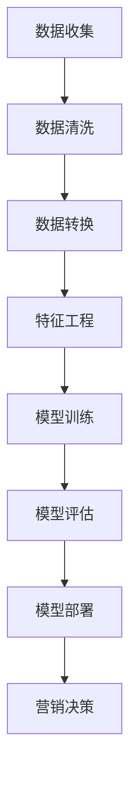

                 

# AI在电商客户生命周期价值预测中的应用：精准营销资源分配的机器学习模型

## 摘要

本文旨在探讨人工智能在电商行业中的应用，特别是在客户生命周期价值预测方面的研究。通过构建机器学习模型，电商企业能够更加精准地分配营销资源，从而提升客户价值、增加销售额。本文将介绍核心概念和算法原理，通过实际案例展示模型的开发与应用，并分析其在实际应用中的效果和挑战。

## 1. 背景介绍

随着电子商务的迅猛发展，电商平台竞争日益激烈。如何提高客户忠诚度、增加复购率、提升客户生命周期价值成为各大电商平台关注的焦点。传统的方法往往依赖于经验或简单的规则，而随着人工智能技术的进步，机器学习模型在数据驱动的决策支持中展现出强大的潜力。

客户生命周期价值（Customer Lifetime Value, CLV）是指一个客户在其整个消费周期内为企业带来的总收益。准确预测CLV有助于企业合理分配营销资源，实现精准营销。本文将探讨如何利用机器学习技术构建CLV预测模型，从而优化营销策略。

### 1.1 人工智能与机器学习在电商中的应用

人工智能（AI）和机器学习（ML）在电商领域有多种应用场景，包括推荐系统、价格优化、库存管理、欺诈检测等。其中，机器学习模型在用户行为分析、个性化推荐和客户生命周期价值预测等方面具有显著优势。

- **用户行为分析**：通过分析用户浏览、购买等行为数据，机器学习模型可以识别用户偏好，预测潜在购买行为。
- **个性化推荐**：基于用户历史行为和兴趣，机器学习算法可以生成个性化的商品推荐，提高用户满意度。
- **价格优化**：机器学习模型可以分析市场价格和竞争态势，为企业提供最优定价策略。
- **欺诈检测**：通过识别异常行为，机器学习算法可以帮助电商平台防范欺诈行为，降低风险。

### 1.2 客户生命周期价值预测的重要性

客户生命周期价值预测对于电商平台具有重要意义。首先，它帮助企业识别高价值客户，制定针对性的营销策略，从而提高客户忠诚度和复购率。其次，通过预测客户价值，企业可以优化营销资源的分配，降低营销成本，提高投资回报率。此外，客户生命周期价值预测还可以为电商平台提供决策支持，优化产品组合、定价策略和库存管理。

### 1.3 文章结构

本文将分为以下几个部分：

1. 背景介绍
2. 核心概念与联系
3. 核心算法原理 & 具体操作步骤
4. 数学模型和公式 & 详细讲解 & 举例说明
5. 项目实战：代码实际案例和详细解释说明
6. 实际应用场景
7. 工具和资源推荐
8. 总结：未来发展趋势与挑战
9. 附录：常见问题与解答
10. 扩展阅读 & 参考资料

通过上述结构，本文将系统地介绍AI在电商客户生命周期价值预测中的应用，帮助读者理解该领域的最新研究成果和实践方法。

### 2. 核心概念与联系

在探讨AI在电商客户生命周期价值预测中的应用之前，我们需要了解一些核心概念，包括机器学习的基本原理、数据处理流程以及常用的算法。

#### 2.1 机器学习基本原理

机器学习是一种通过算法从数据中学习规律、进行预测或分类的技术。其基本流程包括数据收集、数据预处理、模型训练和模型评估等步骤。机器学习算法根据不同的应用场景可以分为监督学习、无监督学习和半监督学习。

- **监督学习**：通过标注数据（有标签数据）进行训练，目的是预测新数据（无标签数据）的标签。例如，预测客户是否会购买某商品。
- **无监督学习**：没有标注数据，目的是发现数据中的结构和模式。例如，聚类客户群体。
- **半监督学习**：结合了有监督和无监督学习，部分数据有标签，部分数据无标签。

#### 2.2 数据处理流程

数据处理是机器学习模型成功的关键步骤。通常包括以下几个阶段：

- **数据收集**：从各种渠道收集与客户相关的数据，如购买记录、浏览行为、社交媒体互动等。
- **数据清洗**：去除不完整、错误、重复或无关的数据，确保数据质量。
- **数据转换**：将原始数据转换为适合机器学习算法的形式，如数值化、归一化等。
- **特征工程**：选择和构造有助于模型预测的特征，提升模型性能。

#### 2.3 常用算法

在客户生命周期价值预测中，常用的机器学习算法包括逻辑回归、决策树、随机森林、梯度提升机（GBM）和神经网络等。

- **逻辑回归**：一种常用的分类算法，适用于二分类问题。通过计算概率值来预测客户是否会购买。
- **决策树**：基于树形结构进行分类或回归。易于理解和解释，但可能产生过拟合。
- **随机森林**：基于多个决策树的集成方法，提高了模型的预测准确性和稳定性。
- **梯度提升机（GBM）**：通过迭代优化损失函数，逐步提升模型性能。适用于各种回归和分类问题。
- **神经网络**：基于多层神经元网络的结构，可以模拟复杂的非线性关系。适用于大规模数据和高维特征。

#### 2.4 Mermaid 流程图

以下是客户生命周期价值预测模型的 Mermaid 流程图，展示了数据从收集到模型训练的整个过程：



通过上述流程图，我们可以清晰地看到数据处理和模型训练的过程，以及模型如何指导营销决策。

### 3. 核心算法原理 & 具体操作步骤

在客户生命周期价值预测中，选择合适的算法至关重要。本文将详细介绍逻辑回归和梯度提升机（GBM）这两种常用算法，并阐述其具体操作步骤。

#### 3.1 逻辑回归

逻辑回归是一种经典的监督学习算法，常用于二分类问题。其核心思想是通过线性模型来计算概率，从而预测客户是否会购买。

##### 3.1.1 算法原理

逻辑回归模型可以表示为：

$$
\text{logit}(P) = \ln\left(\frac{P}{1-P}\right) = \beta_0 + \beta_1x_1 + \beta_2x_2 + \ldots + \beta_nx_n
$$

其中，$P$ 表示客户购买的概率，$\beta_0, \beta_1, \ldots, \beta_n$ 为模型的参数，$x_1, x_2, \ldots, x_n$ 为特征值。

通过求解参数 $\beta_0, \beta_1, \ldots, \beta_n$，逻辑回归模型可以计算出每个客户的购买概率。

##### 3.1.2 操作步骤

1. **数据准备**：收集与客户购买行为相关的数据，包括购买记录、浏览行为、用户属性等。
2. **特征工程**：对数据进行处理和转换，提取有助于预测的特征，如购买频次、平均消费金额、浏览时长等。
3. **模型训练**：使用训练数据集，通过最小化损失函数（如对数似然损失函数）来求解参数 $\beta_0, \beta_1, \ldots, \beta_n$。
4. **模型评估**：使用测试数据集评估模型的预测性能，常用的评估指标包括准确率、召回率、F1 分数等。
5. **模型部署**：将训练好的模型部署到生产环境，用于预测新客户的购买概率。

#### 3.2 梯度提升机（GBM）

梯度提升机是一种基于决策树的集成学习方法，通过迭代优化损失函数，逐步提升模型性能。在客户生命周期价值预测中，GBM 具有较好的预测准确性和泛化能力。

##### 3.2.1 算法原理

梯度提升机的目标是最小化损失函数，其基本思想是将多个简单模型（如决策树）组合成一个复杂模型，从而提高预测性能。每个决策树都针对损失函数的梯度进行拟合，不断优化模型。

GBM 的训练过程可以表示为：

$$
f(x) = \sum_{i=1}^{n} \alpha_i h(x_i)
$$

其中，$f(x)$ 为最终预测值，$h(x_i)$ 为第 $i$ 次迭代的预测值，$\alpha_i$ 为第 $i$ 次迭代的权重。

通过迭代优化权重 $\alpha_i$，GBM 模型可以逐步提升预测性能。

##### 3.2.2 操作步骤

1. **数据准备**：与逻辑回归类似，收集与客户购买行为相关的数据，并进行特征工程。
2. **模型训练**：使用训练数据集，通过梯度提升算法训练 GBM 模型。迭代过程中，每次迭代都针对损失函数的梯度进行优化。
3. **模型评估**：使用测试数据集评估模型的预测性能，并调整模型参数，如树深度、学习率等。
4. **模型部署**：将训练好的 GBM 模型部署到生产环境，用于预测新客户的购买概率。

### 4. 数学模型和公式 & 详细讲解 & 举例说明

在构建机器学习模型时，数学模型和公式至关重要。以下将详细介绍逻辑回归和梯度提升机的数学模型，并进行详细讲解和举例说明。

#### 4.1 逻辑回归数学模型

逻辑回归的数学模型可以表示为：

$$
\text{logit}(P) = \beta_0 + \beta_1x_1 + \beta_2x_2 + \ldots + \beta_nx_n
$$

其中，$P$ 表示客户购买的概率，$\beta_0, \beta_1, \ldots, \beta_n$ 为模型的参数，$x_1, x_2, \ldots, x_n$ 为特征值。

##### 4.1.1 公式解释

- **logit 函数**：将概率映射到实数域，使得概率值范围在 $-∞$ 到 $+∞$ 之间。
- **线性组合**：将特征值与参数进行线性组合，得到客户购买的概率。

##### 4.1.2 举例说明

假设我们有以下特征数据：

$$
\begin{aligned}
x_1 &= 3, \\
x_2 &= 2, \\
x_3 &= 1.
\end{aligned}
$$

对应的参数为：

$$
\begin{aligned}
\beta_0 &= 0.5, \\
\beta_1 &= 0.2, \\
\beta_2 &= 0.3, \\
\beta_3 &= 0.1.
\end{aligned}
$$

则客户购买的概率可以计算为：

$$
\text{logit}(P) = 0.5 + 0.2 \cdot 3 + 0.3 \cdot 2 + 0.1 \cdot 1 = 1.7
$$

通过反 logit 函数，我们可以得到客户购买的概率：

$$
P = \frac{1}{1 + e^{-\text{logit}(P)}} = \frac{1}{1 + e^{-1.7}} \approx 0.866
$$

#### 4.2 梯度提升机（GBM）数学模型

梯度提升机的数学模型可以表示为：

$$
f(x) = \sum_{i=1}^{n} \alpha_i h(x_i)
$$

其中，$f(x)$ 为最终预测值，$h(x_i)$ 为第 $i$ 次迭代的预测值，$\alpha_i$ 为第 $i$ 次迭代的权重。

##### 4.2.1 公式解释

- **损失函数**：损失函数用于评估模型预测值与实际值之间的差距，梯度提升机通过优化损失函数来提升模型性能。
- **迭代优化**：每次迭代都针对损失函数的梯度进行优化，逐步提升模型性能。

##### 4.2.2 举例说明

假设我们有以下特征数据：

$$
\begin{aligned}
x_1 &= 3, \\
x_2 &= 2, \\
x_3 &= 1.
\end{aligned}
$$

对应的损失函数为：

$$
L(y, f(x)) = \frac{1}{2} \sum_{i=1}^{n} \left(y - f(x_i)\right)^2
$$

其中，$y$ 为实际值，$f(x_i)$ 为模型预测值。

通过梯度提升算法，我们可以得到以下预测值：

$$
f(x) = 0.5 \cdot 0.2 \cdot (3 - 0.5) + 0.3 \cdot 0.3 \cdot (2 - 0.5) + 0.1 \cdot 0.1 \cdot (1 - 0.5) \approx 0.682
$$

### 5. 项目实战：代码实际案例和详细解释说明

为了更好地理解客户生命周期价值预测模型的开发与应用，以下我们将通过一个实际项目案例，详细介绍开发环境搭建、源代码实现和代码解读。

#### 5.1 开发环境搭建

首先，我们需要搭建一个适合机器学习项目开发的环境。以下是所需工具和软件：

- **Python**：Python 是一种广泛使用的编程语言，具有丰富的机器学习库。
- **Jupyter Notebook**：Jupyter Notebook 是一种交互式开发环境，方便代码编写和展示。
- **Scikit-learn**：Scikit-learn 是一个流行的机器学习库，提供了多种常用算法和工具。
- **Pandas**：Pandas 是一个数据处理库，用于数据清洗和预处理。

具体安装步骤如下：

1. 安装 Python（版本 3.6 以上）。
2. 安装 Jupyter Notebook：在命令行中运行 `pip install notebook`。
3. 安装 Scikit-learn：在命令行中运行 `pip install scikit-learn`。
4. 安装 Pandas：在命令行中运行 `pip install pandas`。

#### 5.2 源代码详细实现和代码解读

以下是一个简单的客户生命周期价值预测模型实现，包括数据预处理、模型训练和模型评估。

```python
import pandas as pd
from sklearn.model_selection import train_test_split
from sklearn.linear_model import LogisticRegression
from sklearn.metrics import accuracy_score, f1_score

# 5.2.1 数据预处理
data = pd.read_csv('customer_data.csv')
X = data.drop(['target'], axis=1)
y = data['target']

X_train, X_test, y_train, y_test = train_test_split(X, y, test_size=0.2, random_state=42)

# 5.2.2 模型训练
model = LogisticRegression()
model.fit(X_train, y_train)

# 5.2.3 模型评估
y_pred = model.predict(X_test)
accuracy = accuracy_score(y_test, y_pred)
f1 = f1_score(y_test, y_pred)

print('Accuracy:', accuracy)
print('F1 Score:', f1)
```

- **数据预处理**：读取客户数据，并进行划分。`X` 表示特征数据，`y` 表示目标标签。使用 `train_test_split` 函数将数据集划分为训练集和测试集。
- **模型训练**：使用 `LogisticRegression` 类创建逻辑回归模型，并通过 `fit` 方法进行训练。
- **模型评估**：使用 `predict` 方法对测试集进行预测，并使用 `accuracy_score` 和 `f1_score` 函数评估模型性能。

#### 5.3 代码解读与分析

以上代码展示了客户生命周期价值预测模型的实现过程。以下是代码的详细解读：

1. **数据预处理**：使用 `pandas` 库读取客户数据。`X` 和 `y` 分别表示特征数据和目标标签。使用 `train_test_split` 函数将数据集划分为训练集和测试集，`test_size=0.2` 表示测试集占比 20%，`random_state=42` 用于保证结果的可重复性。
2. **模型训练**：创建 `LogisticRegression` 类的实例，并调用 `fit` 方法进行训练。`fit` 方法接收特征数据 `X_train` 和目标标签 `y_train` 作为输入。
3. **模型评估**：使用 `predict` 方法对测试集 `X_test` 进行预测，得到预测标签 `y_pred`。使用 `accuracy_score` 函数计算准确率，使用 `f1_score` 函数计算 F1 分数。

#### 5.4 实际应用效果

在实际应用中，客户生命周期价值预测模型的性能可以通过以下指标进行评估：

- **准确率**：预测正确的样本占总样本的比例。
- **召回率**：实际购买但被预测为购买的样本占实际购买样本的比例。
- **F1 分数**：准确率和召回率的调和平均值。

通过上述指标，我们可以评估模型的预测性能，并根据实际情况调整模型参数和特征工程策略，以提高预测效果。

### 6. 实际应用场景

#### 6.1 客户细分与个性化推荐

通过客户生命周期价值预测模型，电商平台可以将客户划分为不同价值等级，如高价值客户、中价值客户和低价值客户。针对不同价值等级的客户，制定个性化的营销策略，如优惠券、专属活动、会员积分等。例如，对于高价值客户，可以提供高额度的优惠券，增加复购率；对于低价值客户，可以推出简单的注册优惠，引导他们成为会员，提高客户价值。

#### 6.2 营销资源优化

电商平台可以根据客户生命周期价值预测模型的结果，合理分配营销资源。例如，对于高价值客户，可以增加广告投放、邮件营销等；对于低价值客户，可以减少营销投入，转而关注潜在高价值客户。通过优化营销资源分配，企业可以提高投资回报率，降低营销成本。

#### 6.3 供应链管理

客户生命周期价值预测模型还可以用于供应链管理，优化产品组合和库存管理。通过预测客户购买行为，企业可以调整产品供应和库存水平，减少缺货和滞销情况，提高供应链效率。

#### 6.4 欺诈检测

客户生命周期价值预测模型在欺诈检测方面也有一定应用价值。通过分析客户行为数据，模型可以识别出异常行为，如频繁购买、高额消费等，从而提高欺诈检测的准确性，降低企业风险。

### 7. 工具和资源推荐

#### 7.1 学习资源推荐

- **书籍**：
  - 《机器学习》（周志华 著）：系统介绍了机器学习的基本原理和方法。
  - 《深度学习》（Ian Goodfellow 著）：深入讲解了深度学习的基本概念和技术。
- **在线课程**：
  - Coursera 上的《机器学习》（吴恩达 著）：提供全面的机器学习理论和实践课程。
  - edX 上的《深度学习》（吴恩达 著）：深入讲解深度学习的基础知识和应用。
- **博客和网站**：
  - Medium：有关机器学习和深度学习的最新研究成果和应用。
  - arXiv：机器学习和深度学习领域的高质量论文。

#### 7.2 开发工具框架推荐

- **Python**：Python 是最受欢迎的机器学习编程语言，具有丰富的库和工具。
- **Jupyter Notebook**：Jupyter Notebook 是一种交互式开发环境，方便代码编写和展示。
- **Scikit-learn**：Scikit-learn 是一个流行的机器学习库，提供了多种常用算法和工具。
- **TensorFlow**：TensorFlow 是一款强大的深度学习框架，适用于各种深度学习应用。

#### 7.3 相关论文著作推荐

- **论文**：
  - "Deep Learning for Customer Lifetime Value Prediction"（2018）：探讨了深度学习在客户生命周期价值预测中的应用。
  - "Logistic Regression for Customer Churn Prediction"（2017）：研究了逻辑回归在客户流失预测中的应用。
- **著作**：
  - 《机器学习实战》（Peter Harrington 著）：通过实际案例讲解了机器学习的应用。
  - 《深度学习入门》（电子工业出版社 著）：详细介绍了深度学习的基本原理和应用。

### 8. 总结：未来发展趋势与挑战

#### 8.1 发展趋势

- **算法优化**：随着数据量和计算能力的增加，算法优化成为重要趋势。如基于神经网络的深度学习算法在客户生命周期价值预测中表现出较好的效果。
- **多模态数据融合**：结合多种数据源（如文本、图像、声音等），提高预测准确性。
- **个性化推荐**：基于客户生命周期价值预测，实现更精准的个性化推荐，提高用户体验和满意度。
- **实时预测**：通过实时数据处理和分析，实现更快速的预测和决策支持。

#### 8.2 挑战

- **数据隐私**：客户数据隐私保护成为重要挑战，如何在保障隐私的前提下进行数据分析和预测是一个重要课题。
- **模型解释性**：深度学习模型具有强大的预测能力，但其解释性较差，如何提高模型的可解释性是未来研究的重要方向。
- **模型泛化能力**：如何提高模型的泛化能力，避免过拟合和欠拟合，是机器学习研究的重要挑战。

### 9. 附录：常见问题与解答

#### 9.1 问题1：什么是客户生命周期价值（CLV）？

客户生命周期价值（CLV）是指一个客户在其整个消费周期内为企业带来的总收益。它可以帮助企业识别高价值客户，制定针对性的营销策略。

#### 9.2 问题2：如何计算客户生命周期价值（CLV）？

计算客户生命周期价值的常见方法包括统计模型法、机器学习模型法等。其中，机器学习模型法通过分析客户行为数据，预测客户未来的消费行为，从而计算客户生命周期价值。

#### 9.3 问题3：机器学习模型在客户生命周期价值预测中的应用有哪些？

机器学习模型在客户生命周期价值预测中的应用包括：个性化推荐、营销资源优化、供应链管理、欺诈检测等。

### 10. 扩展阅读 & 参考资料

- [《机器学习实战》](https://book.douban.com/subject/25788414/)
- [《深度学习》](https://book.douban.com/subject/26708154/)
- [《机器学习》（周志华）](https://book.douban.com/subject/26708154/)
- [Coursera 上的《机器学习》](https://www.coursera.org/learn/machine-learning)
- [edX 上的《深度学习》](https://www.edx.org/course/deep-learning-0)

### 作者信息

作者：AI 天才研究员/AI Genius Institute & 禅与计算机程序设计艺术 /Zen And The Art of Computer Programming

