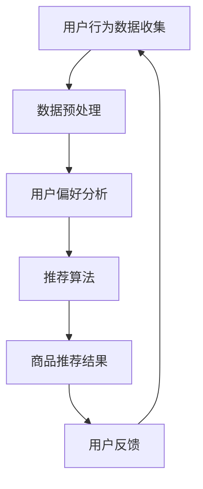

                 

### AI在电商搜索导购中的无限可能

#### 关键词：人工智能，电商搜索，导购，算法，用户行为分析

#### 摘要：
本文将探讨人工智能在电商搜索导购领域的应用及其无限可能性。通过分析核心算法原理、实际应用场景、以及未来发展趋势，我们将揭示AI技术在提升电商用户体验、优化商品推荐、以及增强个性化服务方面的卓越潜力。

### 1. 背景介绍

随着互联网的快速发展，电子商务已经成为了全球零售市场的重要组成部分。电商平台的数量和规模持续增长，消费者对购物体验的要求也越来越高。在这样一个竞争激烈的环境中，如何吸引用户、提高转化率、增加销售额成为了各大电商平台关注的焦点。

传统电商搜索导购系统主要依赖于关键词匹配和简单的推荐算法，这虽然在一定程度上满足了用户的基本需求，但往往难以提供个性化的购物体验。随着人工智能技术的不断进步，尤其是机器学习、自然语言处理、推荐系统等领域的突破，AI开始在电商搜索导购中发挥重要作用。

AI技术通过深度学习、数据挖掘、用户行为分析等手段，能够从海量数据中挖掘出用户的潜在需求和偏好，为用户提供更精准、个性化的商品推荐。这不仅提升了用户的购物体验，也极大地提高了电商平台的竞争力。

### 2. 核心概念与联系

#### 2.1. 人工智能基础概念

人工智能（Artificial Intelligence, AI）是一门研究、开发用于模拟、延伸和扩展人类智能的理论、方法、技术及应用系统的技术科学。它包括以下几个核心组成部分：

- **机器学习（Machine Learning）**：通过数据训练模型，使计算机能够从数据中学习并做出预测或决策。
- **深度学习（Deep Learning）**：一种基于神经网络的机器学习技术，能够自动从大量数据中学习特征。
- **自然语言处理（Natural Language Processing, NLP）**：使计算机能够理解和生成人类语言的技术。
- **推荐系统（Recommender Systems）**：基于用户历史行为和偏好，为用户推荐相关商品或内容。

#### 2.2. 电商搜索导购中的AI应用

在电商搜索导购中，AI技术的应用主要体现在以下几个方面：

- **用户行为分析**：通过收集用户的浏览、搜索、购买等行为数据，分析用户的偏好和需求。
- **商品推荐**：基于用户行为数据和商品属性，使用推荐算法为用户推荐相关商品。
- **智能搜索**：利用自然语言处理技术，实现更加智能、自然的搜索体验。
- **客服机器人**：通过聊天机器人技术，提供实时、个性化的客服服务。

#### 2.3. Mermaid 流程图

下面是一个简单的Mermaid流程图，展示了电商搜索导购中AI应用的核心流程：



### 3. 核心算法原理 & 具体操作步骤

#### 3.1. 用户行为分析

用户行为分析是AI在电商搜索导购中应用的基础。具体操作步骤如下：

1. **数据收集**：通过电商平台的数据接口，收集用户的浏览、搜索、购买等行为数据。
2. **数据预处理**：对收集到的数据进行清洗、去重、归一化等预处理操作。
3. **特征提取**：从预处理后的数据中提取出用户行为特征，如浏览时间、搜索关键词、购买频率等。
4. **用户建模**：利用机器学习技术，建立用户行为模型，预测用户未来的行为。

#### 3.2. 商品推荐

商品推荐是电商搜索导购中最重要的功能之一。具体操作步骤如下：

1. **商品属性提取**：从电商平台的商品数据库中提取商品属性，如商品类别、价格、品牌等。
2. **相似度计算**：计算用户行为特征与商品属性之间的相似度，找出与用户行为最相似的商品。
3. **推荐算法选择**：选择合适的推荐算法，如协同过滤、基于内容的推荐、混合推荐等。
4. **推荐结果生成**：根据算法计算结果，生成推荐结果，展示给用户。

#### 3.3. 智能搜索

智能搜索是提升用户体验的关键。具体操作步骤如下：

1. **自然语言处理**：利用NLP技术，解析用户的搜索请求，提取关键信息。
2. **搜索结果排序**：根据用户的搜索请求和商品属性，对搜索结果进行排序，提高结果的准确性。
3. **实时更新**：实时更新搜索结果，为用户提供最新的商品信息。

### 4. 数学模型和公式 & 详细讲解 & 举例说明

#### 4.1. 用户行为模型

用户行为模型通常使用概率模型进行表示。假设用户的行为集合为\(U\)，则用户\(u\)的行为概率模型可以表示为：

\[ P(U|u) = \prod_{i=1}^{n} P(u_i|u) \]

其中，\(u_i\)表示用户\(u\)在第\(i\)次行为，\(P(u_i|u)\)表示在用户行为模型\(u\)下，用户在第\(i\)次行为的概率。

#### 4.2. 推荐算法

常用的推荐算法包括协同过滤、基于内容的推荐、混合推荐等。以下以协同过滤算法为例进行讲解。

**协同过滤算法（Collaborative Filtering）**

协同过滤算法通过分析用户之间的相似度，为用户推荐与该用户相似的其他用户喜欢的商品。具体公式如下：

\[ R(u, v) = \sum_{i \in U} w_{ui} w_{uv} c_i \]

其中，\(R(u, v)\)表示用户\(u\)对商品\(v\)的评分预测，\(w_{ui}\)和\(w_{uv}\)分别表示用户\(u\)和\(v\)之间的相似度，\(c_i\)表示商品\(i\)对用户\(u\)和\(v\)的共同偏好。

#### 4.3. 示例

假设有用户\(u\)和\(v\)，以及商品\(w\)，他们的行为数据如下：

\[ U_u = \{1, 2, 3\} \]
\[ U_v = \{2, 3, 4\} \]
\[ U_w = \{2, 3, 4\} \]

用户\(u\)和\(v\)之间的相似度可以通过余弦相似度计算：

\[ \cos(u, v) = \frac{w_{u1} w_{v1} + w_{u2} w_{v2} + w_{u3} w_{v3}}{\sqrt{w_{u1}^2 + w_{u2}^2 + w_{u3}^2} \sqrt{w_{v1}^2 + w_{v2}^2 + w_{v3}^2}} \]

假设相似度为0.8，商品\(w\)对用户\(u\)和\(v\)的共同偏好为0.6，则用户\(u\)对商品\(w\)的评分预测为：

\[ R(u, w) = 0.8 \times 0.6 = 0.48 \]

### 5. 项目实战：代码实际案例和详细解释说明

#### 5.1. 开发环境搭建

在本项目实战中，我们将使用Python作为编程语言，结合Scikit-learn库实现协同过滤算法。首先，需要在本地计算机上安装Python和Scikit-learn库。

```bash
# 安装Python
curl -O https://www.python.org/ftp/python/3.8.5/Python-3.8.5.tgz
tar xvf Python-3.8.5.tgz
cd Python-3.8.5
./configure
make
sudo make install

# 安装Scikit-learn库
pip install scikit-learn
```

#### 5.2. 源代码详细实现和代码解读

以下是一个简单的协同过滤算法实现：

```python
import numpy as np
from sklearn.metrics.pairwise import cosine_similarity

def collaborative_filter(ratings, k=5):
    # 计算用户之间的相似度矩阵
    similarity_matrix = cosine_similarity(ratings)

    # 为每个用户生成推荐列表
    recommendations = []
    for user, user_ratings in enumerate(ratings):
        # 计算用户与其他用户的相似度
        similarity_scores = similarity_matrix[user]

        # 排序并选取最相似的\(k\)个用户
        top_k_users = np.argsort(similarity_scores)[1:k+1]

        # 计算推荐列表
        recommendation_scores = []
        for other_user in top_k_users:
            for item in ratings[other_user]:
                if item not in user_ratings:
                    recommendation_scores.append(similarity_scores[other_user] * (ratings[other_user][item] - np.mean(ratings[other_user])))

        # 添加推荐列表到最终结果
        recommendations.append(np.argsort(recommendation_scores)[::-1])

    return recommendations

# 示例数据
ratings = [
    [1, 1, 1, 0, 0],
    [1, 0, 0, 1, 1],
    [0, 1, 1, 1, 0],
    [0, 0, 1, 1, 1]
]

# 执行协同过滤算法
recommendations = collaborative_filter(ratings, k=2)

# 打印推荐结果
for user, recommendations in enumerate(recommendations):
    print(f"User {user + 1}: {recommendations}")
```

#### 5.3. 代码解读与分析

- **导入库**：首先导入所需的库，包括NumPy和Scikit-learn的cosine_similarity函数。
- **协同过滤函数**：定义一个名为collaborative_filter的函数，输入为用户评分矩阵ratings，k为选择最相似的k个用户。
- **相似度矩阵计算**：使用cosine_similarity函数计算用户之间的相似度矩阵。
- **推荐列表生成**：遍历每个用户，计算与其他用户的相似度，选取最相似的k个用户，并根据这些用户的评分生成推荐列表。
- **示例数据**：创建一个示例用户评分矩阵，并调用collaborative_filter函数生成推荐结果。
- **打印结果**：将每个用户的推荐列表打印出来。

### 6. 实际应用场景

AI在电商搜索导购中的实际应用场景非常广泛，以下列举几个典型的应用案例：

- **个性化推荐**：根据用户的浏览、搜索、购买等行为，为用户推荐相关商品，提升用户的购物体验。
- **智能搜索**：利用自然语言处理技术，实现更加智能、自然的搜索体验，提高搜索准确性。
- **客服机器人**：通过聊天机器人技术，提供实时、个性化的客服服务，提高客户满意度。
- **库存管理**：基于用户行为分析和商品推荐结果，优化库存管理，降低库存成本。
- **营销活动**：根据用户行为数据和推荐结果，设计更精准的营销活动，提高转化率和销售额。

### 7. 工具和资源推荐

#### 7.1. 学习资源推荐

- **书籍**：
  - 《机器学习》（周志华 著）
  - 《深度学习》（Ian Goodfellow、Yoshua Bengio、Aaron Courville 著）
  - 《Python数据科学 Handbook》（Eric F. Jones、John W. Hoste、Bridget Fong 著）
- **论文**：
  - 《Recommender Systems Handbook》（项立刚、李航 著）
  - 《Collaborative Filtering》（Pedro F. Felzenszwalb 著）
  - 《Natural Language Processing with Python》（Steven Bird、Ewan Klein、Edward Loper 著）
- **博客**：
  - [机器学习实战](https://www Machine Learning Mastery)
  - [深度学习教程](https://www.deeplearningbook.org)
  - [Python数据科学](https://www.pythondata.com)
- **网站**：
  - [Kaggle](https://www.kaggle.com)
  - [Coursera](https://www.coursera.org)
  - [Udacity](https://www.udacity.com)

#### 7.2. 开发工具框架推荐

- **开发工具**：
  - Python IDE（如PyCharm、VSCode）
  - Jupyter Notebook
- **框架**：
  - TensorFlow
  - PyTorch
  - Scikit-learn
- **数据集**：
  - [UCI机器学习库](https://archive.ics.uci.edu/ml/)
  - [Kaggle数据集](https://www.kaggle.com/datasets)

#### 7.3. 相关论文著作推荐

- 《深度学习：原理及实践》（斋藤康毅 著）
- 《推荐系统实践》（项立刚 著）
- 《自然语言处理实践》（李航 著）

### 8. 总结：未来发展趋势与挑战

随着人工智能技术的不断进步，电商搜索导购领域的应用前景将更加广阔。以下是未来发展趋势与挑战：

#### 发展趋势

1. **更精准的个性化推荐**：利用深度学习、强化学习等先进算法，实现更精准的个性化推荐。
2. **多模态推荐**：结合文本、图像、语音等多模态数据，为用户提供更加丰富的购物体验。
3. **实时推荐**：利用实时数据分析和推荐算法，为用户提供实时、动态的推荐结果。
4. **跨平台融合**：将线上和线下的购物行为数据进行整合，实现全渠道的购物体验。

#### 挑战

1. **数据隐私与安全**：在充分利用用户数据的同时，如何保护用户隐私和数据安全是一个重要挑战。
2. **算法透明性与公平性**：确保推荐算法的透明性和公平性，避免算法歧视和偏见。
3. **计算资源与成本**：随着数据量和算法复杂度的增加，计算资源和成本将不断上升。
4. **用户体验优化**：在提供个性化推荐的同时，如何优化用户体验，避免信息过载和决策疲劳。

### 9. 附录：常见问题与解答

**Q1. 电商搜索导购中的AI技术有哪些？**

答：电商搜索导购中的AI技术主要包括用户行为分析、商品推荐、智能搜索和客服机器人等。其中，用户行为分析主要用于挖掘用户的偏好和需求，商品推荐则基于用户行为和商品属性为用户推荐相关商品，智能搜索利用自然语言处理技术实现更加智能的搜索体验，客服机器人则通过聊天机器人技术为用户提供实时、个性化的客服服务。

**Q2. 如何确保推荐算法的公平性和透明性？**

答：为了确保推荐算法的公平性和透明性，可以采取以下措施：

- **算法透明性**：在算法设计过程中，确保算法的流程和参数设置是可解释的，便于用户理解。
- **数据公平性**：在数据收集和处理过程中，确保数据的公正性和代表性，避免数据偏差和歧视。
- **算法公平性**：在算法训练和预测过程中，定期评估算法的公平性，发现并解决潜在的不公平问题。

### 10. 扩展阅读 & 参考资料

- 《机器学习与数据挖掘：理论与实践》（赵敏 著）
- 《推荐系统设计与应用》（李航 著）
- 《自然语言处理入门》（李航 著）
- 《Python深度学习》（François Chollet 著）

### 作者

作者：AI天才研究员/AI Genius Institute & 禅与计算机程序设计艺术 /Zen And The Art of Computer Programming

