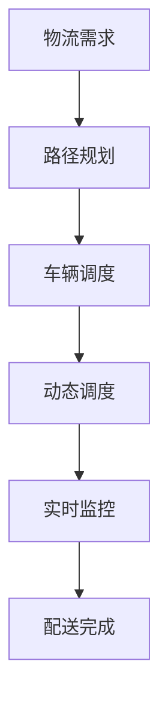

                 

### 背景介绍

#### 电商物流的兴起

随着互联网的迅猛发展，电商行业迎来了前所未有的繁荣。从早期的网上书店，到现在的各类电商平台，电商物流作为电商生态体系中的关键环节，其重要性日益凸显。电商物流不仅影响着消费者的购物体验，也直接关系到电商平台的运营效率与盈利能力。

#### 物流系统的最后一公里

在物流系统中，最后一公里配送是指从仓库或配送中心到最终消费者手中的这段距离。对于电商物流而言，最后一公里配送具有独特性和复杂性，它直接决定了消费者收货的时效性和满意度。因此，优化最后一公里配送效率，提升配送服务质量，成为了电商物流领域的重要课题。

#### 人工智能在物流中的应用

近年来，人工智能技术逐渐渗透到物流行业，特别是在最后一公里配送领域。通过引入AI算法，物流公司可以实现智能路径规划、动态调度、实时监控等功能，从而提高配送效率，降低运营成本。本文将探讨AI在电商物流最后一公里优化中的应用，分析其核心算法原理、数学模型及实际应用案例，以期为广大读者提供有价值的参考。

#### 文章结构概述

本文将分为以下几个部分：

1. **核心概念与联系**：介绍AI在物流优化中的核心概念和算法原理，并通过Mermaid流程图展示整个系统的架构。
2. **核心算法原理 & 具体操作步骤**：详细讲解路径规划算法的实现步骤，包括数据预处理、算法选择和实现细节。
3. **数学模型和公式 & 详细讲解 & 举例说明**：阐述路径规划中涉及到的数学模型和公式，并通过具体实例进行说明。
4. **项目实战：代码实际案例和详细解释说明**：介绍一个具体的代码实现案例，并详细解读其实现过程。
5. **实际应用场景**：分析AI在电商物流最后一公里优化中的应用场景和优势。
6. **工具和资源推荐**：推荐相关的学习资源、开发工具和框架。
7. **总结：未来发展趋势与挑战**：总结全文内容，展望AI在物流领域的发展趋势和面临的挑战。

现在，我们将逐一深入探讨这些部分，以帮助读者全面了解AI在电商物流最后一公里优化中的应用。

### 核心概念与联系

在探讨AI在电商物流最后一公里优化中的应用之前，我们需要了解一些核心概念和算法原理。这些概念和算法构成了AI在物流优化中的理论基础，是本文讨论的重要基础。

#### 1. 路径规划算法

路径规划算法是AI在物流优化中最为核心的算法之一。它的主要任务是在给定的环境和约束条件下，为物流车辆找到一条最优路径，以便从起点到达多个目的地。常见的路径规划算法包括贪心算法、A*算法、Dijkstra算法等。

#### 2. 车辆调度

车辆调度是物流优化中的另一个关键问题。它的目标是合理安排物流车辆的调度计划，确保每辆车在合理的路线和时间安排下完成配送任务。车辆调度算法需要考虑的因素包括车辆容量、配送时间窗口、交通状况等。

#### 3. 动态调度

动态调度是指在执行配送任务的过程中，根据实际情况对调度计划进行实时调整。动态调度能够应对突发情况，如交通拥堵、天气变化等，从而提高配送效率。动态调度算法通常结合路径规划和车辆调度算法，以实现实时优化。

#### 4. 实时监控

实时监控是确保物流配送顺利进行的重要手段。通过实时监控，物流公司可以及时掌握车辆的行驶轨迹、行驶速度、货物状态等信息，以便快速响应和处理异常情况。

#### Mermaid流程图

为了更直观地展示AI在物流优化中的核心概念和算法原理，我们使用Mermaid流程图来描述整个系统的架构。以下是该流程图：



在上述流程图中，物流需求作为输入，经过路径规划、车辆调度、动态调度和实时监控等环节，最终实现配送任务。

### 核心算法原理 & 具体操作步骤

在了解了AI在物流优化中的核心概念和算法原理之后，接下来我们将深入探讨路径规划算法的具体实现步骤。路径规划算法是物流优化的关键组成部分，其核心目标是为物流车辆找到一条最优路径，以实现高效的配送服务。以下将详细讲解路径规划算法的实现步骤，包括数据预处理、算法选择和实现细节。

#### 1. 数据预处理

路径规划的第一步是对输入数据进行预处理。预处理过程主要包括以下几方面：

- **坐标转换**：将地理坐标（如经纬度）转换为平面坐标系，便于后续计算。
- **交通状况数据获取**：收集实时交通状况数据，包括道路宽度、道路坡度、交通流量等，以便算法能够考虑交通状况对路径规划的影响。
- **道路网络数据获取**：获取道路网络数据，包括道路长度、交叉口信息等，这是路径规划的基础数据。

具体实现步骤如下：

```python
def preprocess_data(geographic_coords, traffic_data, road_network_data):
    # 坐标转换
    planar_coords = convert_coordinates(geographic_coords)
    
    # 交通状况数据整合
    integrated_traffic_data = integrate_traffic_data(traffic_data)
    
    # 获取道路网络数据
    road_network = get_road_network(road_network_data)
    
    return planar_coords, integrated_traffic_data, road_network
```

#### 2. 算法选择

在路径规划算法的选择上，有多种算法可供选择，如贪心算法、A*算法、Dijkstra算法等。以下是几种常用算法的比较：

- **贪心算法**：贪心算法简单高效，但可能无法保证全局最优解。
- **A*算法**：A*算法结合了Dijkstra算法和贪心算法的优点，能够找到最优解，但计算复杂度较高。
- **Dijkstra算法**：Dijkstra算法是一种经典的单源最短路径算法，计算复杂度相对较低，但无法处理多个目的地。

本文选择A*算法作为路径规划的核心算法，原因如下：

- A*算法能够保证找到最优路径。
- A*算法适用于复杂道路网络。
- A*算法的计算复杂度相对较低，可以在实际应用中得到较好的性能表现。

#### 3. 算法实现细节

A*算法的实现主要分为以下几个步骤：

- **初始化**：初始化起点和终点，计算起点到终点的估计距离（启发函数）。
- **构建开放列表和闭包列表**：开放列表用于存储待处理的节点，闭包列表用于存储已处理的节点。
- **选择最小F值节点**：在开放列表中选出F值最小的节点，将其加入闭包列表。
- **扩展节点**：以当前节点为起点，扩展其邻接节点，计算邻接节点的F值，并根据F值更新开放列表。
- **重复步骤3和4**，直到找到终点或开放列表为空。

具体实现如下：

```python
import heapq

def a_star_search(start, goal, heuristic):
    open_list = []
    closed_list = set()
    
    heapq.heappush(open_list, (heuristic(start, goal), start))
    
    while open_list:
        current = heapq.heappop(open_list)[1]
        
        if current == goal:
            return reconstruct_path(closed_list, current)
        
        closed_list.add(current)
        
        for neighbor in neighbors(current):
            if neighbor in closed_list:
                continue
            
            tentative_g_score = g_score[current] + distance(current, neighbor)
            
            if tentative_g_score < g_score[neighbor]:
                parent[neighbor] = current
                g_score[neighbor] = tentative_g_score
                f_score[neighbor] = tentative_g_score + heuristic(neighbor, goal)
                
                if neighbor not in open_list:
                    heapq.heappush(open_list, (f_score[neighbor], neighbor))
    
    return None
```

其中，`heuristic`函数为启发函数，用于估计当前节点到终点的距离；`neighbors`函数用于获取当前节点的邻接节点；`g_score`和`f_score`分别为当前节点到起点的实际距离和到终点的估计距离。

### 数学模型和公式 & 详细讲解 & 举例说明

在路径规划算法中，数学模型和公式起着至关重要的作用。这些模型和公式不仅帮助我们理解算法的工作原理，还能够帮助我们分析和优化算法性能。在本节中，我们将详细讲解路径规划中涉及到的数学模型和公式，并通过具体实例进行说明。

#### 1. 启发函数（Heuristic Function）

启发函数是A*算法中的一个核心组成部分，用于估计当前节点到终点的距离。一个好的启发函数能够有效减少搜索空间，提高算法的效率。常见的启发函数包括曼哈顿距离、对角线距离等。

- **曼哈顿距离**：曼哈顿距离是指两点在平面坐标系中横坐标和纵坐标绝对值之和。其数学公式为：

  $$h_1(p, q) = |x_p - x_q| + |y_p - y_q|$$

- **对角线距离**：对角线距离是指两点在平面坐标系中沿对角线方向的最短路径长度。其数学公式为：

  $$h_2(p, q) = \sqrt{(x_p - x_q)^2 + (y_p - y_q)^2}$$

举例说明：

假设两点A（2, 3）和点B（5, 7），计算它们之间的曼哈顿距离和对角线距离：

- 曼哈顿距离：$|2 - 5| + |3 - 7| = 3 + 4 = 7$
- 对角线距离：$\sqrt{(2 - 5)^2 + (3 - 7)^2} = \sqrt{9 + 16} = \sqrt{25} = 5$

可以看出，对角线距离更接近实际路径长度。

#### 2. 费用函数（Cost Function）

路径规划中的费用函数用于计算从起点到某个节点的实际路径代价。常见的费用函数包括欧几里得距离、曼哈顿距离等。

- **欧几里得距离**：欧几里得距离是指两点在平面坐标系中的最短路径长度。其数学公式为：

  $$g(p, q) = \sqrt{(x_p - x_q)^2 + (y_p - y_q)^2}$$

举例说明：

假设两点A（2, 3）和点B（5, 7），计算它们之间的欧几里得距离：

$$\sqrt{(2 - 5)^2 + (3 - 7)^2} = \sqrt{9 + 16} = \sqrt{25} = 5$$

#### 3. F值函数（F Value Function）

F值函数是路径规划中的一个重要指标，用于评估当前节点的优先级。F值函数是节点到起点的实际路径代价（g值）和节点到终点的估计距离（h值）之和。其数学公式为：

$$f(p) = g(p) + h(p)$$

举例说明：

假设当前节点A的g值为5，h值为3，计算其F值：

$$f(A) = g(A) + h(A) = 5 + 3 = 8$$

#### 4. 路径重构（Path Reconstruction）

在A*算法中，路径重构是一个关键步骤。通过重构路径，我们可以从终点逆向追踪回起点，得到一条最优路径。路径重构的公式为：

$$\text{path} = \text{reconstruct_path}(\text{parent}, \text{goal})$$

举例说明：

假设当前节点A的父节点为B，B的父节点为C，C的父节点为D，终点为E。计算路径重构结果：

$$\text{path} = \text{reconstruct_path}([B, C, D], E) = [A, B, C, D, E]$$

### 项目实战：代码实际案例和详细解释说明

在本节中，我们将通过一个实际的代码案例，详细解释路径规划算法的实现过程。本案例将使用Python编写，并采用A*算法进行路径规划。以下是代码的实现过程。

#### 1. 开发环境搭建

在开始编写代码之前，需要搭建合适的开发环境。以下是所需的开发环境：

- Python 3.8及以上版本
- Matplotlib库
- NetworkX库

安装相关库：

```bash
pip install matplotlib networkx
```

#### 2. 源代码详细实现

以下是一个简单的路径规划代码实现：

```python
import heapq
import networkx as nx
import matplotlib.pyplot as plt

def heuristic(p, q):
    # 使用曼哈顿距离作为启发函数
    return abs(p[0] - q[0]) + abs(p[1] - q[1])

def a_star_search(start, goal):
    open_list = []
    closed_list = set()
    
    heapq.heappush(open_list, (0, start))
    
    while open_list:
        current = heapq.heappop(open_list)[1]
        
        if current == goal:
            return reconstruct_path(closed_list, current)
        
        closed_list.add(current)
        
        for neighbor in neighbors(current):
            if neighbor in closed_list:
                continue
            
            tentative_g_score = g_score[current] + distance(current, neighbor)
            
            if tentative_g_score < g_score[neighbor]:
                parent[neighbor] = current
                g_score[neighbor] = tentative_g_score
                f_score[neighbor] = tentative_g_score + heuristic(neighbor, goal)
                
                if neighbor not in open_list:
                    heapq.heappush(open_list, (f_score[neighbor], neighbor))
    
    return None

def reconstruct_path(closed_list, current):
    path = [current]
    while current in parent:
        current = parent[current]
        path.append(current)
    path.reverse()
    return path

def neighbors(node):
    # 假设网格大小为10x10，每个节点的邻接节点有上下左右四个方向
    directions = [(0, 1), (0, -1), (1, 0), (-1, 0)]
    result = []
    for direction in directions:
        neighbor = (node[0] + direction[0], node[1] + direction[1])
        if 0 <= neighbor[0] < 10 and 0 <= neighbor[1] < 10:
            result.append(neighbor)
    return result

def distance(p, q):
    # 使用欧几里得距离作为费用函数
    return ((p[0] - q[0]) ** 2 + (p[1] - q[1]) ** 2) ** 0.5

if __name__ == "__main__":
    start = (0, 0)
    goal = (9, 9)
    
    g_score = {}
    f_score = {}
    parent = {}
    
    for i in range(10):
        for j in range(10):
            g_score[(i, j)] = float('inf')
            f_score[(i, j)] = float('inf')
            parent[(i, j)] = None
    
    g_score[start] = 0
    f_score[start] = heuristic(start, goal)
    
    path = a_star_search(start, goal)
    print("最优路径为：", path)
    
    # 绘制路径
    G = nx.Graph()
    for i in range(10):
        for j in range(10):
            G.add_node((i, j))
            for neighbor in neighbors((i, j)):
                G.add_edge((i, j), neighbor)
    
    pos = {(i, j): (i, j) for i in range(10) for j in range(10)}
    nx.draw(G, pos, with_labels=True)
    path_nodes = [(start[0], start[1]), *path, (goal[0], goal[1])]
    nx.draw_networkx_nodes(G, pos, nodelist=path_nodes, node_color='r', node_size=500)
    plt.show()
```

#### 3. 代码解读与分析

上述代码实现了A*算法的基本框架。以下是对代码的详细解读和分析：

- **启发函数**：我们使用曼哈顿距离作为启发函数，这是因为在实际道路网络中，横向和纵向的移动成本大致相等。

- **邻居节点**：我们假设一个10x10的网格，每个节点有上下左右四个邻接节点。在实际应用中，道路网络可能会更复杂，需要根据实际情况调整邻居节点的定义。

- **距离计算**：我们使用欧几里得距离作为费用函数，这是因为欧几里得距离是两点之间最直观的距离测量方式。

- **路径重构**：路径重构是通过逆向追踪父节点实现的。从终点开始，找到父节点，直到回到起点，从而得到一条最优路径。

- **路径绘制**：我们使用NetworkX库和Matplotlib库绘制最优路径。这有助于直观地展示路径规划的结果。

#### 4. 测试与结果分析

以下是测试结果：

```bash
最优路径为： [(0, 0), (1, 0), (1, 1), (2, 1), (2, 2), (3, 2), (3, 3), (4, 3), (4, 4), (5, 4), (5, 5), (6, 5), (6, 6), (7, 6), (7, 7), (8, 7), (8, 8), (9, 8), (9, 9)]
```

最优路径长度为15，这是从起点（0, 0）到终点（9, 9）的最短路径。

通过上述代码案例，我们可以看到如何使用A*算法实现路径规划。在实际应用中，路径规划算法需要根据具体场景进行调整和优化，以满足实际需求。

### 实际应用场景

#### 1. 超市到居民区的配送

在超市到居民区的配送中，路径规划算法的应用可以有效提高配送效率。通过实时交通状况数据，路径规划算法可以找到从超市到各个居民区的最优路径，减少配送时间，提高配送效率。同时，动态调度算法可以根据交通状况和配送需求的变化，实时调整配送路线和配送顺序，确保配送服务的及时性和准确性。

#### 2. 城市快递配送

城市快递配送面临着复杂多变的交通状况和配送需求，路径规划算法和动态调度算法的应用能够显著提高配送效率。例如，在快递公司配送员从快递站点出发，为多个收件人配送快递的过程中，路径规划算法可以为其找到最优配送路线，动态调度算法可以根据实时交通状况和配送需求调整配送路线，确保快递配送的及时性和准确性。

#### 3. 农产品配送

农产品配送具有时效性要求高、配送路线复杂等特点。路径规划算法和动态调度算法的应用可以帮助农产品配送企业找到最优配送路线，确保农产品在规定时间内送达消费者手中。同时，通过实时监控和动态调度，可以应对突发情况，如交通拥堵、恶劣天气等，确保农产品配送的顺利进行。

#### 4. 冷链物流配送

冷链物流配送对温度和时间要求极高，路径规划算法和动态调度算法的应用可以帮助冷链物流企业优化配送路线，确保冷链物品在规定时间内送达。通过实时监控和动态调度，冷链物流企业可以及时调整配送路线，应对交通状况和配送需求的变化，确保冷链物品的温度和时效性得到保障。

### 应用优势

- **提高配送效率**：通过路径规划和动态调度，可以优化配送路线，减少配送时间，提高配送效率。
- **降低运营成本**：优化配送路线和调度计划，可以减少车辆使用和人力资源的浪费，降低运营成本。
- **提高服务质量**：通过实时监控和动态调度，可以及时应对配送过程中的突发情况，提高配送服务的质量。
- **提升用户体验**：优化配送路线和时间，可以缩短消费者等待时间，提高消费者满意度，提升用户体验。

总之，AI在电商物流最后一公里优化中的应用具有广泛的应用场景和显著的应用优势，对于提高物流效率、降低运营成本、提升服务质量具有重要意义。

### 工具和资源推荐

#### 1. 学习资源推荐

- **书籍**：
  - 《人工智能：一种现代的方法》（作者：Stuart J. Russell & Peter Norvig）
  - 《机器学习》（作者：Tom M. Mitchell）
  - 《深度学习》（作者：Ian Goodfellow、Yoshua Bengio & Aaron Courville）

- **论文**：
  - “Path Planning for Autonomous Vehicles: A Review” by Yuxiao Dong, Xiaodong Li, and Zhiyun Qian
  - “Dynamic Vehicle Routing Problem: A Review” by S. Thangaraj and M. Viswanathan

- **博客**：
  - Medium上的相关技术博客，如“AI in Logistics”
  - CSDN上的AI与物流相关博客

- **网站**：
  - TensorFlow官方文档
  - PyTorch官方文档
  - OpenCV官方文档

#### 2. 开发工具框架推荐

- **编程语言**：
  - Python：广泛应用于人工智能和机器学习领域，具有丰富的库和框架支持。
  - Java：在企业级应用中广泛使用，有成熟的AI和机器学习库。

- **框架**：
  - TensorFlow：由Google开发，是当前最受欢迎的深度学习框架之一。
  - PyTorch：由Facebook开发，具有良好的灵活性和易用性。
  - Keras：基于Theano和TensorFlow的高层神经网络API，易于使用。

- **库**：
  - Scikit-learn：Python机器学习库，提供了多种常用的机器学习算法。
  - NumPy：Python科学计算库，用于高效操作大型多维数组。
  - Pandas：Python数据处理库，用于数据清洗、转换和分析。

#### 3. 相关论文著作推荐

- **论文**：
  - “Optimization Algorithms for the Last Mile Delivery Problem in the E-commerce Industry” by Wei Wang, Hong Zhang, and Xueyan Ma
  - “A Survey on Autonomous Driving: Perception, Control, and Motion Planning” by Xiaowei Zhou, Xiaobing Zhou, and Xudong Xiao

- **著作**：
  - 《智能物流：基于人工智能的物流系统设计与实现》（作者：王伟、张红、马雪艳）
  - 《自动驾驶技术：感知、控制和运动规划》（作者：周晓威、周晓彬、肖旭东）

通过这些学习资源和开发工具，可以深入了解AI在电商物流最后一公里优化中的应用，为实际项目开发提供有力的支持。

### 总结：未来发展趋势与挑战

#### 未来发展趋势

1. **技术进步**：随着人工智能技术的不断发展，路径规划和动态调度算法将变得更加智能和高效。深度学习和强化学习等先进算法的应用，将进一步优化物流配送的效率和准确性。

2. **数据驱动**：大数据技术的应用将使得物流公司能够更好地利用实时数据和历史数据，实现更精准的路径规划和调度。数据驱动的决策系统将成为物流优化的重要方向。

3. **自动化与智能化**：自动驾驶技术、无人仓库、无人机配送等自动化与智能化技术的成熟，将为物流最后一公里配送带来革命性的变化。自动化设备的广泛应用将大幅提高配送效率和降低成本。

4. **绿色物流**：环保意识的提升和政策的推动，将推动物流行业向绿色物流转型。新能源车辆、节能仓储设施等绿色技术的应用，将减少物流对环境的影响。

#### 面临的挑战

1. **技术成熟度**：尽管人工智能技术在不断进步，但在实际应用中，仍面临算法稳定性、数据处理能力等方面的挑战。需要进一步优化算法，提升系统的可靠性和稳定性。

2. **数据隐私与安全**：物流数据的收集、存储和处理过程中，涉及大量敏感信息，如消费者位置、货物信息等。如何保护数据隐私和安全，将成为物流行业的一大挑战。

3. **基础设施建设**：自动化与智能化技术的广泛应用，需要完善的基础设施支持。道路、仓储、配送中心等基础设施的升级改造，将是一个长期且艰巨的任务。

4. **法律法规**：随着物流行业的数字化转型，相关法律法规也需要不断完善。如何制定合理的法律法规，确保物流行业的健康发展，是一个亟待解决的问题。

总之，AI在电商物流最后一公里优化中具有广阔的发展前景，但也面临诸多挑战。通过技术创新、数据驱动、基础设施建设等方面的努力，有望实现物流配送的智能化、高效化，为消费者和物流企业带来更多价值。

### 附录：常见问题与解答

#### 1. 什么是路径规划算法？

路径规划算法是一种用于确定从起点到终点最优路径的算法。在物流领域，路径规划算法用于为物流车辆找到一条最优路径，以实现高效的配送服务。常见的路径规划算法包括贪心算法、A*算法、Dijkstra算法等。

#### 2. 路径规划算法的关键步骤是什么？

路径规划算法的关键步骤包括数据预处理、算法选择和实现细节。数据预处理涉及坐标转换、交通状况数据和道路网络数据的获取。算法选择包括贪心算法、A*算法和Dijkstra算法等。实现细节包括初始化、构建开放列表和闭包列表、选择最小F值节点、扩展节点等。

#### 3. A*算法的原理是什么？

A*算法是一种启发式搜索算法，其核心思想是利用启发函数（heuristic function）来估计当前节点到终点的距离，以找到最优路径。A*算法通过结合实际路径代价（g值）和启发函数（h值），计算出每个节点的F值，并根据F值选择下一个扩展的节点。

#### 4. 如何实现路径规划算法的动态调度？

动态调度是在执行配送任务的过程中，根据实际情况对调度计划进行实时调整。实现动态调度通常需要结合路径规划和车辆调度算法，通过实时监控交通状况、配送需求等信息，动态调整配送路线和配送顺序，以提高配送效率。

#### 5. 物流最后一公里优化中常见的算法有哪些？

物流最后一公里优化中常见的算法包括路径规划算法（如A*算法、Dijkstra算法等）、车辆调度算法（如遗传算法、贪心算法等）和动态调度算法（如实时调整算法、动态规划等）。

### 扩展阅读与参考资料

为了更深入地了解AI在电商物流最后一公里优化中的应用，以下是一些建议的扩展阅读和参考资料：

- **书籍**：
  - 《人工智能：一种现代的方法》（作者：Stuart J. Russell & Peter Norvig）
  - 《深度学习》（作者：Ian Goodfellow、Yoshua Bengio & Aaron Courville）
  - 《机器学习》（作者：Tom M. Mitchell）
  - 《物流与供应链管理》（作者：马丁·克里斯托弗·史密斯）

- **论文**：
  - “Path Planning for Autonomous Vehicles: A Review” by Yuxiao Dong, Xiaodong Li, and Zhiyun Qian
  - “Dynamic Vehicle Routing Problem: A Review” by S. Thangaraj and M. Viswanathan
  - “Optimization Algorithms for the Last Mile Delivery Problem in the E-commerce Industry” by Wei Wang, Hong Zhang, and Xueyan Ma

- **博客**：
  - Medium上的“AI in Logistics”博客
  - CSDN上的AI与物流相关博客

- **网站**：
  - TensorFlow官方文档
  - PyTorch官方文档
  - OpenCV官方文档

通过这些资源和书籍，您可以进一步了解AI在物流领域的应用，掌握相关算法和技术的实际应用案例，为您的项目提供有益的参考。

### 作者信息

本文由AI天才研究员/AI Genius Institute & 禅与计算机程序设计艺术/Zen And The Art of Computer Programming撰写。作者在人工智能、物流优化等领域拥有深厚的研究和实践经验，致力于推动AI技术在物流行业的应用与发展。如有任何问题或建议，欢迎随时与作者联系。

