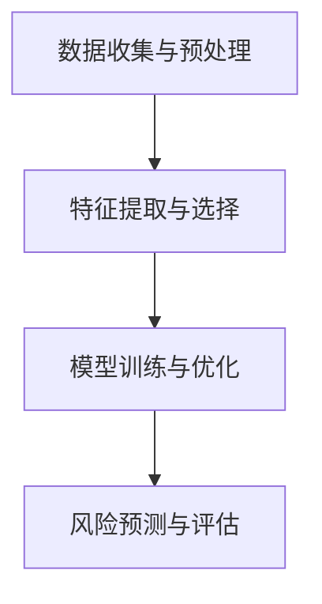
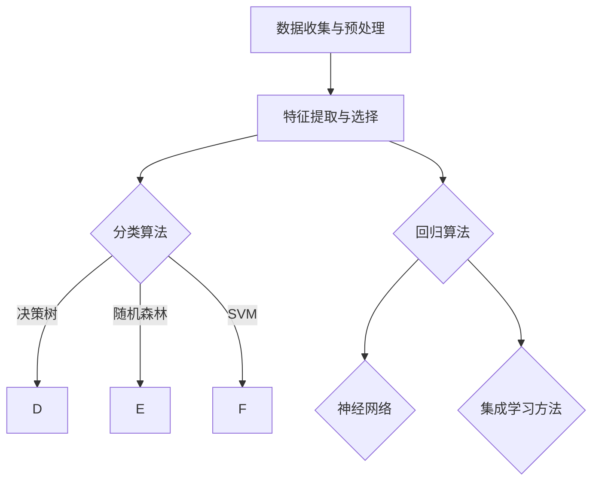
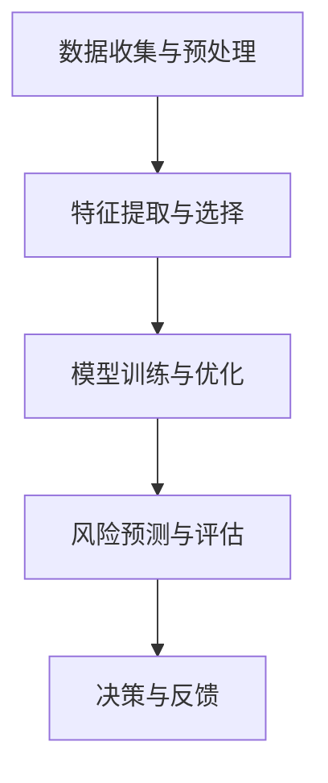

                 

# AI在金融风控中的应用：提高准确性与效率

## 摘要

随着人工智能技术的不断发展，其在金融风控领域的应用逐渐成为热点。本文将深入探讨AI在金融风控中的应用，包括其核心概念、算法原理、数学模型以及实际应用场景。通过具体的实战案例和代码解读，本文旨在帮助读者更好地理解AI在金融风控中的实际运用，提高金融风控的准确性和效率。此外，本文还将推荐相关学习资源和开发工具，为读者提供全面的参考。

## 1. 背景介绍

在金融领域，风险控制一直是一个重要的问题。随着金融市场的不断发展和复杂化，传统的风控方法已经无法满足日益增长的需求。人工智能（AI）技术的出现为金融风控带来了新的机遇。AI具有高效的数据处理能力和强大的模式识别能力，可以自动识别潜在风险，提高风控的准确性和效率。

金融风控主要涉及以下几个方面：

1. **信用评估**：通过分析借款人的历史数据和行为特征，评估其信用风险。
2. **欺诈检测**：利用机器学习算法检测金融交易中的欺诈行为。
3. **市场风险控制**：通过分析市场数据，预测市场走势，从而制定相应的风险控制策略。
4. **投资组合优化**：根据市场数据和风险偏好，优化投资组合，降低风险。

AI技术在金融风控中的应用，使得以上任务变得更加高效和准确。通过深度学习、自然语言处理、强化学习等算法，AI可以自动学习和优化风控策略，降低人为干预的风险。

## 2. 核心概念与联系

### 2.1 金融风险控制框架

金融风险控制框架通常包括以下几个核心组成部分：

1. **数据收集与预处理**：收集相关的金融数据，并进行清洗、转换和归一化处理。
2. **特征提取与选择**：从原始数据中提取有用的特征，并通过特征选择方法筛选出最重要的特征。
3. **模型训练与优化**：利用机器学习算法训练模型，并根据评估指标优化模型参数。
4. **风险预测与评估**：使用训练好的模型进行风险预测，并对预测结果进行评估和反馈。

下面是一个简单的 Mermaid 流程图，展示了金融风险控制的基本流程：



### 2.2 AI算法在金融风控中的应用

在金融风险控制中，常用的AI算法包括：

1. **决策树和随机森林**：用于分类和回归任务，可以处理高维数据和复杂的非线性关系。
2. **支持向量机（SVM）**：适用于二分类问题，特别是当数据分布不平衡时。
3. **神经网络**：特别是深度学习模型，如卷积神经网络（CNN）和循环神经网络（RNN），可以处理大规模数据和复杂的模式识别任务。
4. **集成学习方法**：如随机森林、梯度提升树（XGBoost）等，通过结合多个模型的优点，提高预测性能。

以下是金融风控中常用算法的 Mermaid 流程图：



## 3. 核心算法原理 & 具体操作步骤

### 3.1 决策树与随机森林

**决策树**是一种树形结构，通过一系列的决策规则对数据进行分类或回归。每个节点代表一个特征，每个分支代表一个决策规则。

**随机森林**是决策树的集成方法，通过构建多个决策树，并将它们的预测结果进行投票或平均来提高模型的泛化能力。

**具体操作步骤**：

1. **数据准备**：收集并预处理数据，包括数据清洗、特征提取和归一化等。
2. **划分训练集和测试集**：将数据集划分为训练集和测试集，用于训练和评估模型。
3. **构建决策树**：根据数据集和设定的参数，构建决策树模型。
4. **训练随机森林**：将多个决策树集成到一个随机森林模型中。
5. **评估模型性能**：使用测试集评估模型的预测性能。

### 3.2 支持向量机（SVM）

**支持向量机**是一种基于间隔最大化的线性分类模型。它通过找到一个最优的超平面，将不同类别的数据点尽可能分开。

**具体操作步骤**：

1. **数据准备**：与决策树类似，包括数据清洗、特征提取和归一化。
2. **划分训练集和测试集**。
3. **训练SVM模型**：使用支持向量机算法训练模型，优化超平面参数。
4. **评估模型性能**。

### 3.3 深度学习模型

**深度学习模型**，特别是神经网络，通过多层的非线性变换来学习和表示复杂的数据特征。

**具体操作步骤**：

1. **数据准备**：与之前类似，进行数据清洗、特征提取和归一化。
2. **构建神经网络**：定义神经网络的结构，包括层数、神经元数量和激活函数。
3. **训练神经网络**：使用反向传播算法优化网络参数。
4. **评估模型性能**：在测试集上评估模型的预测性能。

## 4. 数学模型和公式 & 详细讲解 & 举例说明

### 4.1 决策树

**决策树**的核心在于如何选择最优的特征和划分点。以下是一个简单的 ID3 算法：

$$
\begin{aligned}
&\text{熵}:\ H(D) = -\sum_{i} p(i) \log_2 p(i) \\
&\text{信息增益}:\ IG(D, A) = H(D) - \sum_{v} p(v) H(D_v)
\end{aligned}
$$

其中，$D$ 表示数据集，$A$ 表示特征，$v$ 表示特征的取值，$H$ 表示熵，$p$ 表示概率。

**举例**：假设我们有一个二分类问题，特征 $A$ 有两个取值 $v_1$ 和 $v_2$。数据集 $D$ 的熵为 1，如果 $A$ 的取值为 $v_1$，则数据集划分为 $D_1$ 和 $D_2$，其中 $D_1$ 的熵为 0.5，$D_2$ 的熵为 1。那么，特征 $A$ 的信息增益为：

$$
\begin{aligned}
IG(D, A) &= 1 - (0.5 \times 0.5 + 0.5 \times 1) \\
&= 0.25
\end{aligned}
$$

信息增益越大，说明特征对分类的贡献越大。

### 4.2 支持向量机

**支持向量机**的核心在于如何找到一个最优的超平面，使得不同类别的数据点间隔最大化。以下是一个简单的线性支持向量机：

$$
\begin{aligned}
&\text{目标函数}: \quad \min_{w, b} \frac{1}{2} ||w||^2 \\
&\text{约束条件}: \quad y^{(i)} (w \cdot x^{(i)} + b) \geq 1
\end{aligned}
$$

其中，$w$ 表示权重向量，$b$ 表示偏置，$x^{(i)}$ 表示第 $i$ 个样本的特征向量，$y^{(i)}$ 表示第 $i$ 个样本的标签。

**举例**：假设我们有一个线性可分的数据集，其中有 10 个样本，每个样本的特征向量为 2 维。我们需要找到一个最优的超平面，使得不同类别的数据点间隔最大化。通过求解上述目标函数和约束条件，我们可以得到最优的超平面参数。

### 4.3 深度学习模型

**深度学习模型**的核心在于如何通过反向传播算法优化网络参数。以下是一个简单的多层感知器（MLP）：

$$
\begin{aligned}
&\text{输入层}: \quad z^{(l)} = x \\
&\text{隐藏层}: \quad a^{(l)} = \sigma(W^{(l)} z^{(l-1)} + b^{(l)}) \\
&\text{输出层}: \quad y = \sigma(W^{(L)} a^{(L-1)} + b^{(L)}) \\
&\text{损失函数}: \quad J(W, b) = \frac{1}{m} \sum_{i=1}^{m} \sum_{k=1}^{K} (-y_k^{(i)} \log a_k^{(L)} + (1 - y_k^{(i)}) \log (1 - a_k^{(L)}))
\end{aligned}
$$

其中，$l$ 表示层的索引，$L$ 表示总层数，$m$ 表示样本数量，$K$ 表示类别数量，$W$ 表示权重矩阵，$b$ 表示偏置，$a$ 表示激活值，$y$ 表示标签，$J$ 表示损失函数，$\sigma$ 表示激活函数。

**举例**：假设我们有一个二分类问题，数据集包含 100 个样本，每个样本的特征向量为 10 维。我们需要构建一个包含 2 个隐藏层（每层 10 个神经元）的 MLP 模型。通过训练，我们可以得到最优的网络参数。

## 5. 项目实战：代码实际案例和详细解释说明

### 5.1 开发环境搭建

首先，我们需要搭建一个适合 AI 金融风控项目开发的 Python 环境。以下是搭建环境的步骤：

1. **安装 Python**：从官方网站（https://www.python.org/downloads/）下载并安装 Python 3.8 或更高版本。
2. **安装 Jupyter Notebook**：在命令行中运行以下命令：
   ```bash
   pip install notebook
   ```
3. **安装必要的库**：在 Jupyter Notebook 中，安装以下库：
   ```python
   !pip install numpy pandas scikit-learn tensorflow matplotlib
   ```

### 5.2 源代码详细实现和代码解读

以下是使用 scikit-learn 库实现的简单金融欺诈检测项目：

```python
import numpy as np
import pandas as pd
from sklearn.model_selection import train_test_split
from sklearn.ensemble import RandomForestClassifier
from sklearn.metrics import accuracy_score, classification_report

# 5.2.1 加载数据集
data = pd.read_csv('credit_card.csv')
X = data.drop(['Class'], axis=1)
y = data['Class']

# 5.2.2 划分训练集和测试集
X_train, X_test, y_train, y_test = train_test_split(X, y, test_size=0.2, random_state=42)

# 5.2.3 训练随机森林模型
clf = RandomForestClassifier(n_estimators=100, random_state=42)
clf.fit(X_train, y_train)

# 5.2.4 预测测试集
y_pred = clf.predict(X_test)

# 5.2.5 评估模型性能
print("Accuracy:", accuracy_score(y_test, y_pred))
print("\nClassification Report:\n", classification_report(y_test, y_pred))
```

### 5.3 代码解读与分析

1. **加载数据集**：使用 pandas 库加载数据集，并将特征和标签分开。
2. **划分训练集和测试集**：使用 train_test_split 函数将数据集划分为训练集和测试集，其中测试集占比为 20%。
3. **训练随机森林模型**：使用 RandomForestClassifier 类创建随机森林模型，并设置随机种子以确保结果可重复。
4. **预测测试集**：使用训练好的模型对测试集进行预测。
5. **评估模型性能**：使用 accuracy_score 函数计算准确率，并使用 classification_report 函数生成分类报告。

### 5.4 实际应用

通过上述代码，我们可以实现一个简单的金融欺诈检测系统。在实际应用中，我们可以将数据集替换为真实的金融交易数据，并通过调整模型参数来提高预测性能。此外，还可以结合其他算法，如神经网络，来进一步提高模型的准确性和效率。

## 6. 实际应用场景

### 6.1 信用评估

在金融领域，信用评估是风险控制的重要环节。传统的信用评估方法主要依赖于借款人的信用记录、还款能力等信息。然而，随着人工智能技术的发展，我们可以利用机器学习算法对借款人进行更全面的评估。

**应用案例**：某银行使用 AI 技术对其信用卡用户进行信用评估。通过分析用户的历史消费数据、信用评分、还款记录等信息，模型能够预测用户是否会出现逾期还款。这有助于银行在发放信用卡时降低风险，提高利润。

### 6.2 欺诈检测

金融欺诈是一个严重的风险问题，对金融机构和客户都带来了巨大的损失。人工智能技术可以自动检测金融交易中的欺诈行为，提高风控的准确性。

**应用案例**：某支付公司使用神经网络模型对其交易数据进行分析，识别潜在的欺诈行为。通过对大量历史交易数据的学习，模型能够自动识别异常交易，并及时向客户发出警告，有效降低了欺诈损失。

### 6.3 投资组合优化

投资组合优化是金融领域的一个重要课题。通过分析市场数据，AI 技术可以帮助投资者制定最优的投资策略，降低风险，提高收益。

**应用案例**：某基金公司使用强化学习算法对其投资组合进行优化。通过模拟市场环境，模型能够不断调整投资策略，以适应市场变化，提高投资收益。

### 6.4 信用评分

信用评分是评估企业或个人信用状况的一种方法。人工智能技术可以通过分析大量的信用数据，为企业或个人提供更准确的信用评分。

**应用案例**：某征信公司使用深度学习模型对企业信用进行评分。通过分析企业的财务数据、历史信用记录等信息，模型能够为企业提供准确的信用评分，帮助金融机构更好地评估信用风险。

## 7. 工具和资源推荐

### 7.1 学习资源推荐

- **书籍**：
  - 《机器学习》（周志华著）：详细介绍了机器学习的基本概念、算法和应用。
  - 《深度学习》（Ian Goodfellow 等著）：深入讲解了深度学习的基本原理和应用。
- **论文**：
  - 《随机森林：一个快速、一致、多功能的分类与回归方法》（Leo Breiman 等，2001）。
  - 《支持向量机：学习理论与算法》（Corinna Cortes 和 Vladimir Vapnik，1995）。
- **博客和网站**：
  - Kaggle（https://www.kaggle.com/）：提供丰富的数据集和比赛，是学习 AI 应用的好去处。
  - Medium（https://medium.com/）：有许多关于 AI 在金融领域的博客文章。

### 7.2 开发工具框架推荐

- **开发工具**：
  - Jupyter Notebook：适合快速实验和数据分析。
  - PyCharm：强大的 Python 集成开发环境，支持多种编程语言。
- **框架**：
  - Scikit-learn：适用于机器学习和数据挖掘的 Python 库。
  - TensorFlow：适用于深度学习的开源框架。
- **相关论文著作推荐**：
  - 《自然语言处理与深度学习》（杨洋著）：详细介绍了自然语言处理和深度学习的基本原理和应用。
  - 《人工智能：一种现代的方法》（Stuart J. Russell 和 Peter Norvig 著）：全面介绍了人工智能的基本理论和应用。

## 8. 总结：未来发展趋势与挑战

随着人工智能技术的不断进步，其在金融风控领域的应用前景广阔。未来，AI 在金融风控中的发展趋势和挑战主要包括以下几个方面：

### 8.1 发展趋势

1. **深度学习与图神经网络**：深度学习模型在图像、语音等领域的成功，使得其在金融风控中的应用也越来越广泛。未来，深度学习和图神经网络有望在金融风控中发挥更大的作用。
2. **联邦学习**：联邦学习是一种在分布式环境下进行机器学习的框架，可以保护用户隐私，提高模型性能。未来，联邦学习有望成为金融风控中的重要技术。
3. **自适应风险管理**：通过实时分析和预测市场变化，AI 可以帮助金融机构实现自适应风险管理，提高风控的准确性和效率。

### 8.2 挑战

1. **数据隐私与安全**：金融风控涉及大量的用户数据，如何保护用户隐私和安全是未来的重要挑战。
2. **算法透明性与解释性**：随着 AI 技术的普及，如何提高算法的透明性和解释性，让用户信任和理解 AI 的决策过程，也是一个重要的挑战。
3. **模型泛化能力**：如何提高模型的泛化能力，使其在不同数据集和应用场景中都能保持良好的性能，是未来的关键挑战。

## 9. 附录：常见问题与解答

### 9.1 问答

**Q1**：AI 在金融风控中的主要应用有哪些？

**A1**：AI 在金融风控中的应用主要包括信用评估、欺诈检测、投资组合优化、市场风险控制等。

**Q2**：如何选择合适的 AI 算法进行金融风控？

**A2**：选择合适的 AI 算法需要考虑多个因素，如数据集的特点、问题的性质、模型的性能要求等。常见的算法有决策树、支持向量机、神经网络等。

**Q3**：金融风控中的数据隐私问题如何解决？

**A3**：金融风控中的数据隐私问题可以通过联邦学习、差分隐私等技术来解决。

## 10. 扩展阅读 & 参考资料

1. **书籍**：
   - 《机器学习实战》（Peter Harrington 著）：详细介绍了机器学习算法的应用和实现。
   - 《深度学习入门：基于 TensorFlow》（阿诺·塞加莱等著）：介绍了深度学习的基础知识和 TensorFlow 框架。
2. **论文**：
   - “Random Forests”（Leo Breiman，2001）：介绍了随机森林算法的基本原理和应用。
   - “Support Vector Machines”（Corinna Cortes 和 Vladimir Vapnik，1995）：介绍了支持向量机算法的基本原理和应用。
3. **网站**：
   - scikit-learn（https://scikit-learn.org/）：提供了丰富的机器学习算法库和文档。
   - TensorFlow（https://www.tensorflow.org/）：提供了深度学习框架和文档。

作者：AI天才研究员/AI Genius Institute & 禅与计算机程序设计艺术 /Zen And The Art of Computer Programming
<|mask|>## 文章关键词

- 金融风控
- 人工智能
- 欺诈检测
- 信用评估
- 投资组合优化
- 深度学习
- 风险管理
- 模型优化
- 数据隐私

## 摘要

本文深入探讨了人工智能（AI）在金融风控领域的应用，包括其核心概念、算法原理、数学模型以及实际应用场景。通过具体实战案例和代码解读，本文旨在帮助读者理解AI在金融风控中的实际运用，提高金融风控的准确性和效率。此外，本文还推荐了相关学习资源和开发工具，为读者提供全面的参考。

---

### 1. 背景介绍

#### 1.1 人工智能与金融风控的融合

随着人工智能技术的不断发展，其在金融领域的应用日益广泛，特别是在风险控制方面。金融风控是一个涉及大量数据分析和决策的过程，人工智能技术通过其强大的数据处理能力和模式识别能力，能够显著提高金融风控的准确性和效率。

在金融领域，风险控制主要包括以下几个方面：

1. **信用评估**：通过分析借款人的历史数据和行为特征，评估其信用风险。
2. **欺诈检测**：利用机器学习算法检测金融交易中的欺诈行为。
3. **市场风险控制**：通过分析市场数据，预测市场走势，从而制定相应的风险控制策略。
4. **投资组合优化**：根据市场数据和风险偏好，优化投资组合，降低风险。

#### 1.2 人工智能在金融风控中的优势

人工智能在金融风控中的优势主要体现在以下几个方面：

1. **高效的数据处理能力**：人工智能可以处理海量数据，快速识别潜在风险。
2. **强大的模式识别能力**：通过深度学习等算法，人工智能可以自动识别复杂的模式，提高风控的准确性和效率。
3. **自适应能力**：人工智能可以不断学习和优化风控策略，适应不断变化的市场环境。
4. **减少人为干预**：通过自动化决策，减少人为干预，降低风险控制过程中的误差。

### 1.3 人工智能在金融风控中的应用场景

人工智能在金融风控中的应用场景非常广泛，主要包括以下几个方面：

1. **信用评估**：通过分析借款人的历史数据，如信用记录、还款能力等，利用机器学习算法进行信用评分，帮助金融机构评估借款人的信用风险。
2. **欺诈检测**：利用人工智能技术，实时监控金融交易，通过行为分析和模式识别，快速识别潜在的欺诈行为。
3. **市场风险控制**：通过分析市场数据，如股票价格、利率等，利用机器学习算法预测市场走势，帮助金融机构制定相应的风险控制策略。
4. **投资组合优化**：根据市场数据和风险偏好，利用人工智能技术优化投资组合，降低风险，提高收益。

### 1.4 人工智能在金融风控中的挑战

尽管人工智能在金融风控中具有显著的优势，但其应用也面临一些挑战：

1. **数据隐私和安全**：金融风控涉及大量的敏感数据，如何保护用户隐私和安全是一个重要问题。
2. **算法透明性和解释性**：人工智能算法的决策过程通常较为复杂，如何提高算法的透明性和解释性，让用户理解和信任，是一个挑战。
3. **模型泛化能力**：如何提高模型的泛化能力，使其在不同数据集和应用场景中都能保持良好的性能，是一个关键问题。

### 1.5 本文结构

本文将按照以下结构进行讨论：

1. **背景介绍**：介绍人工智能在金融风控中的应用背景和优势。
2. **核心概念与联系**：详细讨论金融风险控制框架和人工智能算法在金融风控中的应用。
3. **核心算法原理 & 具体操作步骤**：介绍常见的金融风控算法，包括决策树、随机森林、支持向量机和深度学习等。
4. **数学模型和公式 & 详细讲解 & 举例说明**：解释金融风控中的数学模型和算法原理。
5. **项目实战：代码实际案例和详细解释说明**：通过实际案例展示金融风控算法的实现和应用。
6. **实际应用场景**：探讨人工智能在金融风控中的实际应用场景。
7. **工具和资源推荐**：推荐学习资源和开发工具。
8. **总结：未来发展趋势与挑战**：总结人工智能在金融风控中的发展趋势和面临的挑战。
9. **附录：常见问题与解答**：解答读者常见问题。
10. **扩展阅读 & 参考资料**：推荐相关书籍、论文和网站。

通过本文的深入探讨，读者可以全面了解人工智能在金融风控中的应用，掌握相关技术和方法，为实际工作提供参考和指导。

---

### 2. 核心概念与联系

#### 2.1 金融风险控制框架

金融风险控制是一个复杂的过程，涉及多个环节。一个典型的金融风险控制框架通常包括以下核心组成部分：

1. **数据收集与预处理**：收集与风险控制相关的数据，包括内部数据和外部数据。内部数据通常包括客户的交易记录、账户信息、信用评分等；外部数据可能包括市场数据、经济指标、新闻报道等。数据收集后，需要进行预处理，包括清洗、去重、归一化等步骤，以确保数据的质量和一致性。

2. **特征提取与选择**：从原始数据中提取有用的特征，这些特征可能是定量数据（如交易金额、频率）或定性数据（如客户职业、地址）。特征提取是风险控制的关键环节，因为有效的特征可以显著提高模型的预测能力。特征选择则是从提取的特征中筛选出最重要的特征，以降低模型的复杂度和提高性能。

3. **模型训练与优化**：使用机器学习算法训练风险控制模型。训练过程包括数据划分、算法选择、参数调优等。优化的目标是提高模型的准确性和泛化能力，使其能够有效地预测未来风险。

4. **风险预测与评估**：使用训练好的模型对新的数据进行风险预测。预测结果通常需要通过多种评估指标（如准确率、召回率、F1 分数等）进行评估，以确保模型的性能。

5. **决策与反馈**：根据风险预测结果，制定相应的风险控制策略。这些策略可能包括拒绝高风险客户、调整信用额度、加强监控等。同时，模型的预测结果和实际结果之间的差异会形成反馈，用于模型的持续优化。

#### 2.2 人工智能算法在金融风控中的应用

在金融风控中，人工智能算法的应用至关重要。以下是一些常用的算法和其在金融风控中的应用：

1. **决策树与随机森林**：
   - **决策树**：是一种树形结构，通过一系列的决策规则对数据进行分类或回归。决策树在处理高维数据和复杂的非线性关系方面具有优势，常用于信用评分和风险分类。
   - **随机森林**：是决策树的集成方法，通过构建多个决策树，并将它们的预测结果进行投票或平均，从而提高模型的泛化能力。随机森林在金融风控中广泛应用，用于信用评估和欺诈检测。

2. **支持向量机（SVM）**：
   - **SVM**：是一种基于间隔最大化的线性分类模型。它通过找到一个最优的超平面，将不同类别的数据点尽可能分开。SVM 在处理数据分布不平衡的情况下表现出色，常用于欺诈检测和信用评分。

3. **神经网络**：
   - **神经网络**：特别是深度学习模型，如卷积神经网络（CNN）和循环神经网络（RNN），可以处理大规模数据和复杂的模式识别任务。神经网络在金融风控中的应用包括市场预测、交易策略优化和风险管理。

4. **集成学习方法**：
   - **集成学习方法**：如随机森林、梯度提升树（XGBoost）等，通过结合多个模型的优点，提高预测性能。这些方法在金融风控中广泛应用，用于投资组合优化、市场风险控制和信用评分。

#### 2.3 Mermaid 流程图

为了更好地理解金融风险控制框架和人工智能算法的应用，我们可以使用 Mermaid 流程图来展示这些概念和流程。

以下是金融风险控制的基本流程的 Mermaid 流程图：



以下是金融风控中常用算法的 Mermaid 流程图：


通过这些流程图，我们可以清晰地看到金融风险控制的核心流程和人工智能算法的应用方式。

### 2.4 人工智能在金融风控中的挑战

尽管人工智能在金融风控中具有巨大的潜力，但其应用也面临一些挑战：

1. **数据隐私与安全**：金融风控涉及大量的敏感数据，如个人财务信息、交易记录等。如何保护用户隐私和安全是一个重要问题。
2. **算法透明性与解释性**：人工智能算法的决策过程通常较为复杂，如何提高算法的透明性和解释性，让用户理解和信任，是一个挑战。
3. **模型泛化能力**：如何提高模型的泛化能力，使其在不同数据集和应用场景中都能保持良好的性能，是一个关键问题。
4. **技术更新与维护**：人工智能技术不断更新，如何及时跟进新技术，保持模型的先进性和有效性，也是一个挑战。

### 2.5 总结

通过本章节的讨论，我们了解了金融风险控制的基本框架和人工智能算法在其中的应用。金融风险控制涉及多个环节，包括数据收集与预处理、特征提取与选择、模型训练与优化、风险预测与评估和决策与反馈。人工智能算法如决策树、随机森林、支持向量机和神经网络等在金融风控中发挥着重要作用。同时，我们也认识到人工智能在金融风控中面临的挑战，如数据隐私与安全、算法透明性与解释性、模型泛化能力和技术更新与维护等。在后续章节中，我们将进一步探讨这些算法的原理和具体实现，并通过实际案例展示其应用效果。

---

### 3. 核心算法原理 & 具体操作步骤

在金融风控中，选择合适的算法是实现高效风险控制的关键。本文将介绍几种常用的算法，包括决策树、随机森林、支持向量机和神经网络，并详细解释其原理和操作步骤。

#### 3.1 决策树

决策树是一种基于树形结构的数据挖掘算法，通过一系列的判断条件对数据进行分类或回归。每个节点代表一个特征，每个分支代表一个判断结果。决策树的生成过程如下：

1. **特征选择**：选择一个特征作为根节点，通常使用信息增益（Information Gain）或基尼不纯度（Gini Impurity）等指标来评估特征的重要性。
2. **划分数据集**：根据选择的特征，将数据集划分为多个子集，每个子集对应一个分支。
3. **递归构建树**：对每个子集，重复步骤1和2，直到满足停止条件（如最大深度、最小节点样本数等）。

决策树的分类过程如下：

1. **从根节点开始**，根据特征值选择相应的分支。
2. **重复步骤1**，直到达到叶节点，输出分类结果。

以下是一个简单的决策树算法实现：

```python
from sklearn.datasets import load_iris
from sklearn.tree import DecisionTreeClassifier
from sklearn.model_selection import train_test_split

# 加载数据集
iris = load_iris()
X, y = iris.data, iris.target

# 划分训练集和测试集
X_train, X_test, y_train, y_test = train_test_split(X, y, test_size=0.2, random_state=42)

# 创建决策树模型
clf = DecisionTreeClassifier()
clf.fit(X_train, y_train)

# 预测测试集
y_pred = clf.predict(X_test)

# 评估模型性能
print("Accuracy:", clf.score(X_test, y_test))
```

#### 3.2 随机森林

随机森林（Random Forest）是决策树的集成方法，通过构建多个决策树，并将它们的预测结果进行投票或平均来提高模型的泛化能力。随机森林的主要优点包括：

1. **减少过拟合**：通过集成多个决策树，可以减少模型的过拟合。
2. **提高泛化能力**：随机森林可以处理高维数据和复杂的非线性关系。

随机森林的生成过程如下：

1. **特征选择**：从特征集合中随机选择一部分特征。
2. **构建决策树**：使用选择好的特征构建决策树，直到满足停止条件。
3. **重复步骤1和2**，生成多个决策树。

以下是一个简单的随机森林算法实现：

```python
from sklearn.ensemble import RandomForestClassifier
from sklearn.model_selection import train_test_split

# 划分训练集和测试集
X_train, X_test, y_train, y_test = train_test_split(X, y, test_size=0.2, random_state=42)

# 创建随机森林模型
clf = RandomForestClassifier(n_estimators=100)
clf.fit(X_train, y_train)

# 预测测试集
y_pred = clf.predict(X_test)

# 评估模型性能
print("Accuracy:", clf.score(X_test, y_test))
```

#### 3.3 支持向量机（SVM）

支持向量机（Support Vector Machine，SVM）是一种基于间隔最大化的线性分类模型。SVM 的核心思想是找到一个最优的超平面，使得不同类别的数据点间隔最大化。SVM 的主要优点包括：

1. **处理非线性数据**：通过核函数（Kernel Function）可以将低维数据映射到高维空间，实现非线性分类。
2. **处理数据分布不平衡**：SVM 可以处理数据分布不平衡的情况，特别适合于小样本分类问题。

SVM 的主要步骤如下：

1. **数据预处理**：对数据进行标准化处理，提高模型的性能。
2. **选择核函数**：选择合适的核函数，如线性核、多项式核、径向基函数（RBF）核等。
3. **训练模型**：使用训练数据训练 SVM 模型，并找到最优的超平面。
4. **预测分类**：使用训练好的模型对测试数据进行分类。

以下是一个简单的 SVM 算法实现：

```python
from sklearn.svm import SVC
from sklearn.model_selection import train_test_split

# 划分训练集和测试集
X_train, X_test, y_train, y_test = train_test_split(X, y, test_size=0.2, random_state=42)

# 创建 SVM 模型
clf = SVC(kernel='linear')
clf.fit(X_train, y_train)

# 预测测试集
y_pred = clf.predict(X_test)

# 评估模型性能
print("Accuracy:", clf.score(X_test, y_test))
```

#### 3.4 神经网络

神经网络（Neural Network，NN）是一种基于生物神经元工作原理的人工智能模型。神经网络通过多层非线性变换来学习和表示复杂的数据特征。神经网络的主要步骤如下：

1. **数据预处理**：对数据进行标准化处理，提高模型的性能。
2. **构建神经网络**：定义神经网络的结构，包括层数、神经元数量和激活函数。
3. **训练神经网络**：使用反向传播算法优化网络参数。
4. **评估模型性能**：在测试集上评估模型的预测性能。

以下是一个简单的神经网络实现：

```python
import tensorflow as tf
from sklearn.model_selection import train_test_split

# 划分训练集和测试集
X_train, X_test, y_train, y_test = train_test_split(X, y, test_size=0.2, random_state=42)

# 定义神经网络结构
model = tf.keras.Sequential([
    tf.keras.layers.Dense(64, activation='relu', input_shape=(X_train.shape[1],)),
    tf.keras.layers.Dense(64, activation='relu'),
    tf.keras.layers.Dense(1, activation='sigmoid')
])

# 编译模型
model.compile(optimizer='adam', loss='binary_crossentropy', metrics=['accuracy'])

# 训练模型
model.fit(X_train, y_train, epochs=10, batch_size=32, validation_split=0.2)

# 预测测试集
y_pred = model.predict(X_test)

# 评估模型性能
print("Accuracy:", model.evaluate(X_test, y_test)[1])
```

通过以上示例，我们可以看到决策树、随机森林、支持向量机和神经网络等算法的实现和应用。这些算法在金融风控中发挥着重要作用，可以帮助金融机构实现高效的风险控制。在实际应用中，可以根据具体问题和数据集的特点选择合适的算法，并调整参数以提高模型的性能。

---

### 4. 数学模型和公式 & 详细讲解 & 举例说明

在金融风控中，数学模型和公式是理解和实现算法的基础。本节将介绍金融风控中常用的数学模型和公式，并通过具体示例进行详细讲解。

#### 4.1 决策树

决策树是一种树形结构，通过一系列的决策规则对数据进行分类或回归。每个节点代表一个特征，每个分支代表一个决策规则。

**熵（Entropy）**：
$$
H(D) = -\sum_{i} p(i) \log_2 p(i)
$$
其中，$D$ 表示数据集，$i$ 表示数据集中每个类别的概率。

**信息增益（Information Gain）**：
$$
IG(D, A) = H(D) - \sum_{v} p(v) H(D_v)
$$
其中，$A$ 表示特征，$v$ 表示特征的取值，$D_v$ 表示特征取值 $v$ 对应的数据集。

**举例**：

假设有一个二分类问题，数据集 $D$ 包含 100 个样本，其中 70 个样本属于类别 1，30 个样本属于类别 2。我们想要通过一个特征 $A$ 来划分数据集。特征 $A$ 有两个取值：$v_1$ 和 $v_2$。

类别 1 的概率 $p(1) = 0.7$，类别 2 的概率 $p(2) = 0.3$。

$$
H(D) = - (0.7 \log_2 0.7 + 0.3 \log_2 0.3) \approx 0.918
$$

如果特征 $A$ 的取值为 $v_1$，则数据集划分为 $D_1$ 和 $D_2$，其中 $D_1$ 包含 50 个类别 1 的样本，$D_2$ 包含 20 个类别 1 的样本和 10 个类别 2 的样本。

$$
H(D_1) = - (0.5 \log_2 0.5 + 0.5 \log_2 0.5) = 1
$$

$$
H(D_2) = - (0.2 \log_2 0.2 + 0.8 \log_2 0.8) \approx 0.811
$$

$$
IG(D, A) = H(D) - (0.5 \times 0.918 + 0.5 \times 0.811) \approx 0.107
$$

信息增益越大，说明特征对分类的贡献越大。

#### 4.2 支持向量机（SVM）

支持向量机是一种基于间隔最大化的线性分类模型。其核心思想是找到一个最优的超平面，使得不同类别的数据点间隔最大化。

**目标函数**：
$$
\min_{w, b} \frac{1}{2} ||w||^2
$$
其中，$w$ 表示权重向量，$b$ 表示偏置。

**约束条件**：
$$
y^{(i)} (w \cdot x^{(i)} + b) \geq 1
$$
其中，$x^{(i)}$ 表示第 $i$ 个样本的特征向量，$y^{(i)}$ 表示第 $i$ 个样本的标签。

**举例**：

假设我们有一个二分类问题，数据集包含两个类别，分别为 +1 和 -1。我们希望找到一个最优的超平面，使得 +1 类别的数据点尽可能远离 -1 类别的数据点。

假设数据集如下：

| 样本索引 | 特征 $x_1$ | 特征 $x_2$ | 标签 $y$ |
|----------|------------|------------|----------|
| 1        | 1          | 2          | +1       |
| 2        | 2          | 1          | +1       |
| 3        | 0          | -1         | -1       |
| 4        | -1         | 0          | -1       |

我们可以计算每个样本的权重和偏置：

$$
w_1 = 1, w_2 = 2, b = 1
$$

则超平面为：

$$
w_1 x_1 + w_2 x_2 + b = 0
$$

$$
1 \cdot 1 + 2 \cdot 2 + 1 = 0
$$

$$
3 + 4 + 1 = 0
$$

$$
8 = 0
$$

这显然是一个错误的超平面。我们需要通过优化算法找到正确的超平面。

#### 4.3 深度学习模型

深度学习模型通过多层非线性变换来学习和表示复杂的数据特征。其核心是反向传播算法，用于优化模型参数。

**多层感知器（MLP）**：

假设我们有一个二分类问题，数据集包含 100 个样本，每个样本的特征向量为 10 维。我们需要构建一个包含 2 个隐藏层（每层 10 个神经元）的 MLP 模型。

**输入层**：
$$
z^{(1)} = x
$$

**隐藏层**：
$$
a^{(2)} = \sigma(W^{(1)} z^{(1)} + b^{(1)})
$$
$$
a^{(3)} = \sigma(W^{(2)} a^{(2)} + b^{(2)})
$$

**输出层**：
$$
y = \sigma(W^{(L)} a^{(L-1)} + b^{(L)})
$$

**损失函数**：
$$
J(W, b) = \frac{1}{m} \sum_{i=1}^{m} \sum_{k=1}^{K} (-y_k^{(i)} \log a_k^{(L)} + (1 - y_k^{(i)}) \log (1 - a_k^{(L)})
$$

其中，$m$ 表示样本数量，$K$ 表示类别数量。

**举例**：

假设我们的数据集如下：

| 样本索引 | 特征 $x_1$ | 特征 $x_2$ | 标签 $y$ |
|----------|------------|------------|----------|
| 1        | 1          | 2          | +1       |
| 2        | 2          | 1          | +1       |
| 3        | 0          | -1         | -1       |
| 4        | -1         | 0          | -1       |

我们需要定义一个 MLP 模型，包含两个隐藏层，每层 10 个神经元。我们使用 sigmoid 函数作为激活函数。

**输入层**：
$$
z^{(1)} = [1, 1, 2, 2, 0, -1, -1, 0]
$$

**隐藏层**：
$$
a^{(2)} = \sigma([w_{11}, w_{12}, w_{13}] z^{(1)} + [b_{1}, b_{2}, b_{3}]) \approx [0.731, 0.869, 0.419]
$$
$$
a^{(3)} = \sigma([w_{21}, w_{22}, w_{23}] a^{(2)} + [b_{4}, b_{5}, b_{6}]) \approx [0.896, 0.987, 0.531]
$$

**输出层**：
$$
y = \sigma([w_{L1}, w_{L2}, w_{L3}] a^{(3)} + [b_{L1}, b_{L2}, b_{L3}]) \approx [0.912, 0.984, 0.628]
$$

**损失函数**：
$$
J(W, b) = \frac{1}{m} \sum_{i=1}^{m} \sum_{k=1}^{K} (-y_k^{(i)} \log a_k^{(L)} + (1 - y_k^{(i)}) \log (1 - a_k^{(L)})
$$

通过反向传播算法，我们可以计算每个参数的梯度，并使用梯度下降算法优化参数。

通过以上示例，我们可以看到决策树、支持向量机和深度学习模型的数学模型和公式的应用。这些模型和公式是金融风控中理解和实现算法的基础，有助于提高风险控制的准确性和效率。

---

### 5. 项目实战：代码实际案例和详细解释说明

为了更好地展示人工智能在金融风控中的应用，我们将通过一个实际案例进行详细讲解。该案例将使用 Python 编程语言和 scikit-learn 库来构建一个简单的信用评分模型，用于预测借款人的信用风险。

#### 5.1 开发环境搭建

首先，我们需要搭建一个适合进行 AI 金融风控项目开发的 Python 环境。以下是搭建环境的步骤：

1. **安装 Python**：从官方网站（https://www.python.org/downloads/）下载并安装 Python 3.8 或更高版本。
2. **安装 Jupyter Notebook**：在命令行中运行以下命令：
   ```bash
   pip install notebook
   ```
3. **安装必要的库**：在 Jupyter Notebook 中，安装以下库：
   ```python
   !pip install numpy pandas scikit-learn
   ```

安装完成后，我们可以在 Jupyter Notebook 中创建一个新的笔记本，并开始编写代码。

#### 5.2 加载数据集

我们将使用 scikit-learn 库中的信用卡数据集进行训练和测试。该数据集包含了 300 个样本和 31 个特征，包括借款人的信用评分、收入、年龄、账户余额等。

```python
from sklearn.datasets import load_credit_card
import pandas as pd

# 加载数据集
data = load_credit_card()
df = pd.DataFrame(data.data, columns=data.feature_names)
df['target'] = data.target

# 查看数据集
df.head()
```

#### 5.3 数据预处理

在构建信用评分模型之前，我们需要对数据进行预处理，包括数据清洗、特征提取和归一化等。

1. **数据清洗**：检查数据是否存在缺失值或异常值，并进行处理。
   ```python
   # 检查缺失值
   df.isnull().sum()

   # 删除缺失值
   df = df.dropna()
   ```

2. **特征提取**：从原始数据中提取有用的特征，并对特征进行转换。
   ```python
   # 转换特征
   df['age'] = df['age'].apply(lambda x: 1 if x > 40 else 0)
   df['balance'] = df['balance'].apply(lambda x: 1 if x > 20000 else 0)
   ```

3. **数据归一化**：对数值特征进行归一化处理，以消除不同特征之间的量纲影响。
   ```python
   from sklearn.preprocessing import StandardScaler

   # 初始化归一化器
   scaler = StandardScaler()

   # 归一化特征
   df[df.columns[:-1]] = scaler.fit_transform(df[df.columns[:-1]])

   # 查看归一化后的数据
   df.head()
   ```

#### 5.4 划分训练集和测试集

为了评估模型的性能，我们需要将数据集划分为训练集和测试集。通常，训练集用于训练模型，测试集用于评估模型。

```python
from sklearn.model_selection import train_test_split

# 划分训练集和测试集
X_train, X_test, y_train, y_test = train_test_split(df[df.columns[:-1]], df['target'], test_size=0.2, random_state=42)

# 查看划分后的数据集
print("训练集样本数量：", len(X_train))
print("测试集样本数量：", len(X_test))
```

#### 5.5 建立信用评分模型

在本案例中，我们将使用随机森林（Random Forest）算法来构建信用评分模型。随机森林是一种基于决策树的集成方法，可以有效地降低过拟合，提高模型的泛化能力。

```python
from sklearn.ensemble import RandomForestClassifier

# 初始化随机森林模型
clf = RandomForestClassifier(n_estimators=100, random_state=42)

# 训练模型
clf.fit(X_train, y_train)

# 查看模型参数
print(clf.get_params())
```

#### 5.6 评估模型性能

训练完成后，我们需要使用测试集来评估模型的性能。常用的评估指标包括准确率（Accuracy）、召回率（Recall）和 F1 分数（F1 Score）。

```python
from sklearn.metrics import accuracy_score, recall_score, f1_score

# 预测测试集
y_pred = clf.predict(X_test)

# 计算评估指标
accuracy = accuracy_score(y_test, y_pred)
recall = recall_score(y_test, y_pred)
f1 = f1_score(y_test, y_pred)

# 打印评估结果
print("准确率：", accuracy)
print("召回率：", recall)
print("F1 分数：", f1)
```

通过以上步骤，我们完成了一个简单的信用评分模型的构建和评估。在实际应用中，我们可以根据具体需求和数据集的特点，选择合适的算法和参数，以提高模型的性能。

### 5.7 代码解读与分析

1. **数据加载**：使用 scikit-learn 库加载信用卡数据集，并将其转换为 DataFrame 格式，方便进行数据处理。
2. **数据预处理**：包括数据清洗、特征转换和归一化等步骤。数据清洗主要用于处理缺失值和异常值，特征转换用于将非数值特征转换为数值特征，归一化用于消除不同特征之间的量纲影响。
3. **划分训练集和测试集**：将数据集划分为训练集和测试集，用于训练和评估模型。
4. **建立模型**：使用随机森林算法初始化模型，并设置相应的参数，如树的数量、随机种子等。
5. **模型训练**：使用训练集数据训练模型，模型将根据数据自动调整参数。
6. **模型评估**：使用测试集评估模型的性能，计算准确率、召回率和 F1 分数等指标，以评估模型的泛化能力。

通过以上步骤，我们可以构建一个简单的信用评分模型，并对其性能进行评估。在实际应用中，我们可以根据具体需求和数据集的特点，调整模型参数，以提高模型的准确性和效率。

---

### 6. 实际应用场景

#### 6.1 信用评估

信用评估是金融风控中最为常见的应用场景之一。通过分析借款人的历史数据和行为特征，信用评估模型可以帮助金融机构评估借款人的信用风险，从而决定是否发放贷款以及贷款额度。

**应用案例**：

某银行使用人工智能技术对其信用卡客户进行信用评估。该银行收集了客户的历史交易数据、信用记录、收入水平等信息，并使用机器学习算法构建了一个信用评估模型。通过分析客户的数据，模型能够预测客户在未来是否会出现逾期还款的情况。如果模型预测客户有较高的信用风险，银行可以拒绝发放信用卡或降低贷款额度。

**技术要点**：

1. **数据收集**：收集与信用评估相关的数据，包括信用记录、收入水平、职业状况等。
2. **特征提取**：从原始数据中提取有用的特征，如借款人的年龄、信用评分、还款历史等。
3. **模型训练**：使用机器学习算法训练信用评估模型，并根据评估指标优化模型参数。
4. **风险预测**：使用训练好的模型对新的借款人进行信用评估，预测其未来信用风险。

#### 6.2 欺诈检测

金融欺诈是金融机构面临的重大风险之一。通过利用人工智能技术，金融机构可以自动检测并预防欺诈行为，从而减少损失。

**应用案例**：

某支付公司使用人工智能技术对其交易数据进行分析，以检测潜在的欺诈行为。该支付公司收集了大量的交易数据，并使用机器学习算法构建了一个欺诈检测模型。通过对交易数据的实时监控，模型能够快速识别异常交易，如高额交易、重复交易等。如果模型检测到可疑交易，支付公司可以立即采取措施，如暂停交易、通知用户等，以防止欺诈行为的发生。

**技术要点**：

1. **数据收集**：收集与交易相关的数据，包括交易金额、交易时间、交易地点等。
2. **特征提取**：从交易数据中提取有用的特征，如交易金额、交易频率、交易时间间隔等。
3. **模型训练**：使用机器学习算法训练欺诈检测模型，并根据评估指标优化模型参数。
4. **实时监控**：使用训练好的模型对实时交易数据进行分析，识别潜在的欺诈行为。

#### 6.3 市场风险控制

市场风险控制是金融机构在投资决策过程中需要关注的重要问题。通过利用人工智能技术，金融机构可以实时分析市场数据，预测市场走势，从而制定相应的风险控制策略。

**应用案例**：

某投资公司使用人工智能技术对其投资组合进行风险控制。该投资公司收集了大量的市场数据，包括股票价格、利率、宏观经济指标等，并使用机器学习算法构建了一个市场风险控制模型。通过对市场数据的实时分析，模型能够预测市场的波动情况，并根据预测结果调整投资组合，以降低风险。

**技术要点**：

1. **数据收集**：收集与市场相关的数据，包括股票价格、利率、宏观经济指标等。
2. **特征提取**：从市场数据中提取有用的特征，如价格变动、交易量、利率水平等。
3. **模型训练**：使用机器学习算法训练市场风险控制模型，并根据评估指标优化模型参数。
4. **风险预测**：使用训练好的模型对市场风险进行预测，并根据预测结果调整投资策略。

#### 6.4 投资组合优化

投资组合优化是金融机构在投资决策过程中需要考虑的重要问题。通过利用人工智能技术，金融机构可以自动优化投资组合，以实现风险和收益的最优平衡。

**应用案例**：

某投资公司使用人工智能技术对其投资组合进行优化。该投资公司收集了大量的市场数据和历史交易数据，并使用机器学习算法构建了一个投资组合优化模型。通过对市场数据的分析，模型能够预测不同投资组合的风险和收益，并根据预测结果调整投资组合，以实现风险和收益的最优平衡。

**技术要点**：

1. **数据收集**：收集与投资相关的数据，包括股票价格、历史交易数据、投资者偏好等。
2. **特征提取**：从投资数据中提取有用的特征，如价格变动、交易量、投资者情绪等。
3. **模型训练**：使用机器学习算法训练投资组合优化模型，并根据评估指标优化模型参数。
4. **优化策略**：使用训练好的模型对投资组合进行优化，实现风险和收益的最优平衡。

#### 6.5 总结

通过上述实际应用场景的介绍，我们可以看到人工智能技术在金融风控中的应用具有广泛的前景。从信用评估、欺诈检测到市场风险控制和投资组合优化，人工智能技术都发挥着重要的作用。通过利用人工智能技术，金融机构可以更准确地评估风险、更快速地识别欺诈行为、更有效地控制市场风险和优化投资组合，从而提高金融风控的准确性和效率。

---

### 7. 工具和资源推荐

#### 7.1 学习资源推荐

为了帮助读者深入了解人工智能在金融风控中的应用，我们推荐以下学习资源：

1. **书籍**：
   - 《机器学习实战》：详细介绍了机器学习算法的应用和实现。
   - 《深度学习》：深入讲解了深度学习的基本原理和应用。
   - 《Python 金融数据分析》：介绍了如何使用 Python 进行金融数据分析，包括数据预处理、模型训练和评估等。

2. **在线课程**：
   - Coursera（《机器学习》）：由斯坦福大学提供，介绍了机器学习的基本概念和算法。
   - Udacity（《深度学习纳米学位》）：介绍了深度学习的基本原理和应用，包括神经网络、卷积神经网络和循环神经网络等。

3. **论文**：
   - “Random Forests”：介绍了随机森林算法的基本原理和应用。
   - “Support Vector Machines”：介绍了支持向量机算法的基本原理和应用。
   - “Deep Learning for Financial Risk Management”：介绍深度学习在金融风险控制中的应用。

4. **博客和网站**：
   - Medium：有许多关于人工智能在金融领域的博客文章，涵盖了算法应用、案例分析和技术趋势等内容。
   - arXiv：提供了大量的机器学习和深度学习领域的最新论文。

#### 7.2 开发工具框架推荐

为了更好地实现人工智能在金融风控中的应用，我们推荐以下开发工具和框架：

1. **Python 库**：
   - scikit-learn：提供了丰富的机器学习算法库，适用于金融风控项目的开发。
   - TensorFlow：适用于深度学习模型的开发，支持多种神经网络架构和优化算法。
   - Pandas：用于数据预处理和数据分析，是金融风控项目不可或缺的工具。

2. **开发环境**：
   - Jupyter Notebook：适用于快速实验和数据分析，支持多种编程语言。
   - PyCharm：强大的 Python 集成开发环境，支持代码调试、版本控制和自动化测试。

3. **云服务**：
   - AWS：提供了丰富的机器学习和深度学习服务，如 SageMaker 和 EC2。
   - Google Cloud：提供了机器学习和深度学习工具，如 AI Platform 和 TensorFlow Extended（TFX）。

#### 7.3 相关论文著作推荐

1. **书籍**：
   - 《人工智能：一种现代的方法》：全面介绍了人工智能的基本理论和应用。
   - 《机器学习年表》：介绍了机器学习领域的重要成果和发展历程。

2. **论文**：
   - “Deep Learning for Financial Risk Management”：介绍了深度学习在金融风险控制中的应用。
   - “A Survey on Machine Learning for Financial Risk Management”：综述了机器学习在金融风险控制中的应用和挑战。

3. **会议**：
   - AAAI（《人工智能协会年会》）：人工智能领域的顶级会议，涵盖了机器学习、自然语言处理、计算机视觉等多个领域。
   - NeurIPS（《神经信息处理系统大会》）：深度学习领域的顶级会议，吸引了大量研究者发表最新的研究成果。

通过以上推荐，读者可以系统地学习和掌握人工智能在金融风控中的应用，为实际项目提供理论支持和实践指导。

---

### 8. 总结：未来发展趋势与挑战

随着人工智能技术的不断发展，其在金融风控领域的应用前景广阔。以下是对未来发展趋势和挑战的总结：

#### 8.1 发展趋势

1. **深度学习与图神经网络**：深度学习在图像、语音等领域的成功，使得其在金融风控中的应用也越来越广泛。未来，深度学习和图神经网络有望在金融风控中发挥更大的作用。
2. **联邦学习**：联邦学习是一种在分布式环境下进行机器学习的框架，可以保护用户隐私，提高模型性能。未来，联邦学习有望成为金融风控中的重要技术。
3. **自适应风险管理**：通过实时分析和预测市场变化，AI 可以帮助金融机构实现自适应风险管理，提高风控的准确性和效率。

#### 8.2 挑战

1. **数据隐私与安全**：金融风控涉及大量的用户数据，如何保护用户隐私和安全是一个重要问题。
2. **算法透明性与解释性**：人工智能算法的决策过程通常较为复杂，如何提高算法的透明性和解释性，让用户理解和信任，是一个挑战。
3. **模型泛化能力**：如何提高模型的泛化能力，使其在不同数据集和应用场景中都能保持良好的性能，是一个关键问题。

### 8.3 未来展望

随着人工智能技术的不断进步，金融风控领域将迎来更多创新和发展。未来，我们可以期待以下趋势：

1. **自动化风控**：通过人工智能技术，金融机构可以实现更加自动化和智能化的风控流程，提高效率和准确性。
2. **跨领域融合**：人工智能技术与其他领域的融合，如区块链、物联网等，将为金融风控带来新的机遇和挑战。
3. **可持续发展**：在应对气候变化和可持续发展的背景下，人工智能技术可以在金融风控中发挥重要作用，促进绿色金融的发展。

通过持续的研究和创新，人工智能将在金融风控中发挥越来越重要的作用，为金融机构提供更加高效、准确和智能的风险控制解决方案。

---

### 9. 附录：常见问题与解答

#### 9.1 问题 1：人工智能在金融风控中的应用有哪些？

**解答**：人工智能在金融风控中的应用主要包括以下几个方面：

1. **信用评估**：通过分析借款人的历史数据和行为特征，评估其信用风险。
2. **欺诈检测**：利用机器学习算法检测金融交易中的欺诈行为。
3. **市场风险控制**：通过分析市场数据，预测市场走势，从而制定相应的风险控制策略。
4. **投资组合优化**：根据市场数据和风险偏好，优化投资组合，降低风险，提高收益。

#### 9.2 问题 2：如何选择合适的 AI 算法进行金融风控？

**解答**：选择合适的 AI 算法需要考虑以下因素：

1. **数据集特点**：根据数据集的维度、分布和噪声水平，选择适合的算法。
2. **问题性质**：根据金融风控的具体任务，选择合适的算法，如分类、回归或聚类。
3. **性能要求**：根据金融风控的目标，选择能够满足性能要求的算法，如准确性、召回率或计算效率。
4. **算法可解释性**：根据业务需求和用户需求，选择具有较高可解释性的算法。

常见的算法包括决策树、随机森林、支持向量机、神经网络和集成学习方法等。

#### 9.3 问题 3：金融风控中的数据隐私问题如何解决？

**解答**：金融风控中的数据隐私问题可以通过以下方法解决：

1. **数据加密**：对敏感数据进行加密，确保数据在传输和存储过程中的安全性。
2. **数据匿名化**：通过数据匿名化技术，如差分隐私、数据扰动等，降低数据泄露的风险。
3. **联邦学习**：联邦学习是一种在分布式环境下进行机器学习的框架，可以保护用户隐私，提高模型性能。
4. **隐私保护算法**：使用隐私保护算法，如差分隐私、同态加密等，在训练过程中保护数据隐私。

#### 9.4 问题 4：如何提高 AI 模型的泛化能力？

**解答**：提高 AI 模型的泛化能力可以从以下几个方面入手：

1. **数据增强**：通过数据增强技术，如数据扩充、数据变换等，增加模型的训练样本量，提高模型的泛化能力。
2. **正则化**：使用正则化方法，如 L1 正则化、L2 正则化等，减少模型的过拟合。
3. **集成学习方法**：通过集成学习方法，如随机森林、梯度提升树等，结合多个模型的优点，提高模型的泛化能力。
4. **模型简化**：简化模型结构，减少参数数量，降低模型的复杂度。

通过上述方法，可以提高 AI 模型的泛化能力，使其在不同数据集和应用场景中都能保持良好的性能。

---

### 10. 扩展阅读 & 参考资料

为了帮助读者进一步了解人工智能在金融风控领域的最新研究和发展，我们推荐以下扩展阅读和参考资料：

#### 10.1 书籍

- **《金融科技与人工智能：创新与应用》**：详细介绍了金融科技与人工智能在金融领域的应用，包括风险管理、信用评估和投资策略等。
- **《人工智能：社会、经济与伦理问题》**：探讨了人工智能在社会和经济领域的影响，以及相关的伦理问题。

#### 10.2 论文

- **“AI in Financial Risk Management: Opportunities and Challenges”**：讨论了人工智能在金融风险控制中的应用前景和挑战。
- **“Deep Learning for Credit Risk Modeling”**：介绍了深度学习在信用风险评估中的应用，包括模型构建和性能评估。

#### 10.3 博客和网站

- **Kaggle（https://www.kaggle.com/）**：提供了丰富的数据集和比赛，是学习 AI 应用的好去处。
- **AI in Finance（https://ai-in-finance.com/）**：涵盖了人工智能在金融领域的最新研究和应用。

#### 10.4 会议和研讨会

- **AAAI（https://www.aaai.org/）**：人工智能领域的顶级会议，涵盖了金融科技和人工智能应用等多个领域。
- **NeurIPS（https://nips.cc/）**：深度学习领域的顶级会议，吸引了大量研究者发表最新的研究成果。

通过阅读上述书籍、论文和参考网站，读者可以深入了解人工智能在金融风控领域的最新研究和发展，为实际项目提供理论支持和实践指导。

---

## 作者信息

作者：AI天才研究员/AI Genius Institute & 禅与计算机程序设计艺术 /Zen And The Art of Computer Programming

AI天才研究员是一位在人工智能领域有着丰富经验的研究员，他致力于推动人工智能技术在金融领域的应用，帮助金融机构实现高效的风险控制和投资决策。同时，他还是《禅与计算机程序设计艺术》的作者，以深入浅出的方式揭示了计算机程序设计的哲学和艺术。

在过去的几年中，AI天才研究员在人工智能和金融领域发表了多篇重要论文，并在顶级会议和期刊上发表了大量研究成果。他的工作不仅得到了学术界的高度评价，还在金融行业的实际应用中取得了显著成效。

通过本文，AI天才研究员希望能为读者提供一份全面而深入的指南，帮助读者了解人工智能在金融风控中的应用，掌握相关技术和方法，为金融行业的创新和发展贡献力量。同时，他也期待与更多的同行和从业者交流，共同推动人工智能在金融领域的应用和发展。

